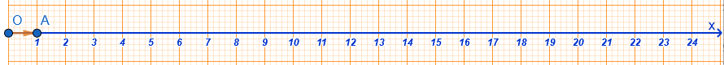
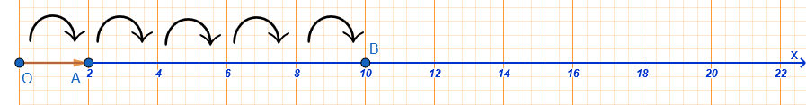

## Φυσικοί Αριθμοί

### Κατανόηση των Φυσικών Αριθμών

::: {style="background-color: #b5b1de; border: 2px solid #2f3e50; color: #25188a; padding: 15px; border-radius: 5px;"}
**Θεωρία & Ορισμοί**

- **Ορισμός:** Οι αριθμοί $0, 1, 2, 3, 4, \dots$ που χρησιμοποιούνται για την απαρίθμηση αντικειμένων ονομάζονται **φυσικοί αριθμοί**.
  Το σύνολό τους συμβολίζεται με το γράμμα $\mathbb{N}$.

- **Διαδοχικότητα:** Κάθε φυσικός αριθμός έχει έναν επόμενο ($\nu+1$) και έναν προηγούμενο ($\nu-1$), εκτός από το $0$ που έχει μόνο επόμενο (το $1$).
  Δύο αριθμοί που διαφέρουν κατά μία μονάδα λέγονται **διαδοχικοί**.

- **Άρτιοι & Περιττοί:** Οι φυσικοί που διαιρούνται με το $2$ λέγονται **άρτιοι** (λήγουν σε $0, 2, 4, 6, 8$), ενώ εκείνοι που δεν διαιρούνται λέγονται **περιττοί** (λήγουν σε $1, 3, 5, 7, 9$).

- **Αξία Θέσης:** Στο δεκαδικό σύστημα, η αξία ενός ψηφίου καθορίζεται από τη θέση του (μονάδες, δεκάδες, εκατοντάδες κ.λπ.).
:::

**Παραδείγματα**

1.  Για τον αριθμό $N = 6$ (άρτιος), ο προηγούμενος είναι ο $5$ (περιττός) και ο επόμενος ο $7$ (περιττός).
2.  Ο αριθμός $455$ είναι περιττός γιατί διαιρούμενος με το $2$ αφήνει υπόλοιπο $1$ ($455 = 227 \cdot 2 + 1$).
3.  Στον αριθμό $34.720$, το ψηφίο $4$ βρίσκεται στις χιλιάδες, άρα η αξία του είναι $4.000$.

**Ασκήσεις**

1.  Γράψτε με ψηφία τους αριθμούς: (α) διακόσια πέντε, (β) είκοσι χιλιάδες οκτακόσια δεκάτρία.
2.  Ποιοι είναι οι τρεις προηγούμενοι και οι δύο επόμενοι του αριθμού $289$;.
3.  Χαρακτηρίστε ως άρτιους ή περιττούν τους αριθμούς: $233, 8.455, 332, 12, 0$.
4.  Βρείτε πόσοι φυσικοί αριθμοί περιλαμβάνονται ανάμεσα στο $5$ και το $500$.
5.  Αναλύστε τον αριθμό $123.654$ ως προς την αξία κάθε θέσης των ψηφίων του.
6.  Αν ο $N$ είναι περιττός, τι είδους αριθμός είναι ο $N+1$;.
7.  Πόσες δεκάδες και πόσες εκατοντάδες έχει ο αριθμός $567.532$;.
8.  Σχηματίστε όλους τους δυνατούς τριψήφιους αριθμούς χρησιμοποιώντας μία φορά τα ψηφία $5, 6, 7$.

### Αντιστοίχιση Φυσικών Αριθμών με Σημεία του Άξονα

::: {style="background-color: #b5b1de; border: 2px solid #2f3e50; color: #25188a; padding: 15px; border-radius: 5px;"}
**Θεωρία & Ορισμοί**

- **Ορισμός Άξονα:** Για να παραστήσουμε τους φυσικούς αριθμούς γεωμετρικά, χρησιμοποιούμε μια ευθεία (ή ημιευθεία).

- **Κατασκευή:** Ορίζουμε ένα σημείο $O$ ως αρχή που αντιστοιχεί στο $0$.
  Δεξιά του επιλέγουμε ένα σημείο $A$ που αντιστοιχεί στο $1$.
  Το τμήμα $OA$ ονομάζεται **μονάδα μέτρησης**.

- **Τετμημένη:** Ο αριθμός που αντιστοιχεί σε ένα σημείο του άξονα ονομάζεται **τετμημένη** του σημείου αυτού.

- **Διάταξη:** Οι φυσικοί αριθμοί τοποθετούνται κατά σειρά αυξανόμενου μεγέθους προς τα δεξιά.\

  \
  
  

:::

**Παραδείγματα**

1.  Αν η μονάδα $OA$ είναι $2$ cm, τότε το σημείο που απέχει $10$ cm από το $O$ αντιστοιχεί στον αριθμό $5$ ($10 : 2 = 5$).\
    
2.  Σε έναν άξονα, ο αριθμός $35$ βρίσκεται ακριβώς στη μέση του τμήματος που ενώνει το $30$ και το $40$.
3.  Το σημείο $M(2)$ στον άξονα απέχει από την αρχή $O$ δύο φορές την απόσταση $OA$.

**Ασκήσεις**

1.  Κατασκευάστε άξονα με μονάδα $OA = 1$ cm και τοποθετήστε τους αριθμούς $3, 5, 8$.
2.  Αν στον άξονα η μονάδα $OA$ είναι $3$ cm, ποιος αριθμός αντιστοιχεί σε σημείο που απέχει $18$ cm από το $O$;.
3.  Σχεδιάστε έναν άξονα και τοποθετήστε τα σημεία $B, \Gamma, \Delta$ σε αποστάσεις $6, 10$ και $14$ μονάδων από την αρχή.
4.  Βρείτε τη μέση απόσταση ανάμεσα στους αριθμούς $10$ και $20$ πάνω στον άξονα.
5.  Σημειώστε στον άξονα τους αριθμούς που αντιστοιχούν στην αξία των χαρτονομισμάτων των $5, 10, 20$ και $50$ ευρώ.
6.  Ποιος φυσικός αριθμός βρίσκεται στον άξονα ανάμεσα στο $2,3$ και το $3,8$;.
7.  Αν ένα σημείο $K$ έχει τετμημένη $4$, ποια είναι η απόστασή του από το σημείο $M$ με τετμημένη $9$;.
8.  Σε έναν άξονα με μονάδα $2$ cm, βρείτε την απόσταση μεταξύ των σημείων $3$ και $7$.

### Σύγκριση Φυσικών Αριθμών

::: {style="background-color: #b5b1de; border: 2px solid #2f3e50; color: #25188a; padding: 15px; border-radius: 5px;"}
**Θεωρία & Ορισμοί**

- **Σύμβολα:** Χρησιμοποιούμε τα σύμβολα $=$ (ίσο), $<$ (μικρότερο) και $>$ (μεγαλύτερο).

- **Κανόνας 1:** Αν δύο αριθμοί έχουν διαφορετικό πλήθος ψηφίων, μεγαλύτερος είναι αυτός με τα περισσότερα ψηφία.

- **Κανόνας 2:** Αν έχουν ίδιο πλήθος ψηφίων, συγκρίνουμε τα ψηφία τους από αριστερά προς τα δεξιά, μέχρι να βρούμε τα πρώτα που διαφέρουν.

- **Σειρά:** Η κατάταξη από τον μικρότερο στον μεγαλύτερο λέγεται **αύξουσα**, ενώ από τον μεγαλύτερο στον μικρότερο **φθίνουσα**.

Η διάταξη επιτρέπει τη σύγκριση οποιωνδήποτε δύο φυσικών αριθμών βάσει των παρακάτω κανόνων:

* **Αρχή της Τριχοτομίας:** Για κάθε ζεύγος αριθμών $n, m$, ισχύει ακριβώς μία από τις σχέσεις: $n = m$, $n < m$ ή $n > m$.

* **Ορισμός Ανισότητας:** Ο $m$ είναι μικρότερος του $n$ ($m < n$) αν υπάρχει ένας φυσικός αριθμός $k \neq 0$ τέτοιος ώστε $n = m + k$.

* **Μεταβατική Ιδιότητα:** Αν $n < m$ και $m < k$, τότε $n < k$.

* **Αντισυμμετρική Ιδιότητα:** Αν $m \le n$ και $n \le m$, τότε αναγκαστικά $m = n$.

:::

**Παραδείγματα**

1.  $52.874 > 9.873$ γιατί ο πρώτος έχει $5$ ψηφία ενώ ο δεύτερος $4$.
2.  $10.100 > 10.010$ γιατί στην τάξη των εκατοντάδων το $1$ είναι μεγαλύτερο από το $0$.
3.  $3.508 < 3.515$ γιατί στην τάξη των μονάδων το $8$ είναι μικρότερο από το $15$ (εξετάζοντας τις τελευταίες τάξεις).
4.  Να τοποθετηθούν σε αύξουσα σειρά οι αριθμοί: $3.515, 4.800, 3.620, 3.508, 4.801$.

- **Λύση:** Συγκρίνουμε τις χιλιάδες και μετά τις εκατοντάδες: $3.508 < 3.515 < 3.620 < 4.800 < 4.801$.

**Ασκήσεις**

1.  Τοποθετήστε το σύμβολο $<$ ή $>$: (α) $38 \dots 36$, (β) $456 \dots 465$, (γ) $8.765 \dots 8.970$.
2.  Διατάξτε σε αύξουσα σειρά τους αριθμούς: $3.515, 4.800, 3.620, 3.508, 4.801$.
3.  Διατάξτε σε φθίνουσα σειρά τους αριθμούς: $5.678, 8.765, 5.687, 7.685$.
4.  Συγκρίνετε τους αριθμούς $789$ και $987$ εξηγώντας τον κανόνα που χρησιμοποιήσατε.
5.  Ποιος είναι ο μικρότερος τετραψήφιος φυσικός αριθμός και ποιος ο μεγαλύτερος τριψήφιος;.
6.  Αν $a < \beta$ και $\beta < \gamma$, τι συμπέρασμα βγάζετε για τη σχέση του $a$ με το $\gamma$;.
7.  Συγκρίνετε τα αποτελέσματα των παραστάσεων: $3+6$ και $6+3$.
8.  Βρείτε έναν φυσικό αριθμό $x$ τέτοιον ώστε $23 < x < 25$.

### Στρογγυλοποίηση Φυσικών Αριθμών

::: {style="background-color: #b5b1de; border: 2px solid #2f3e50; color: #25188a; padding: 15px; border-radius: 5px;"}
**Θεωρία & Ορισμοί**

- **Ορισμός:** Είναι η αντικατάσταση ενός αριθμού με μια προσέγγιση (δεκάδας, εκατοντάδας κ.λπ.) για ευκολότερη χρήση.

- **Κανόνας:**

  1.  Προσδιορίζουμε την τάξη στρογγυλοποίησης.
  2.  Εξετάζουμε το ψηφίο στα δεξιά της:
      - Αν είναι $0, 1, 2, 3$ ή $4$, το ψηφίο της τάξης παραμένει ίδιο και τα δεξιά μηδενίζονται.
      - Αν είναι $5, 6, 7, 8$ ή $9$, το ψηφίο της τάξης αυξάνεται κατά $1$ και τα δεξιά μηδενίζονται.

- **Εξαιρέσεις:** Δεν στρογγυλοποιούμε αριθμούς που δηλώνουν ταυτότητα (τηλέφωνα, ΑΔΤ, κωδικούς).
:::

**Παραδείγματα**

1.  Ο αριθμός $13.637$ στις **εκατοντάδες**: 

Το δεξί ψηφίο είναι $3 < 5$, άρα γίνεται $13.600$.

2.  Ο αριθμός $13.637$ στις **χιλιάδες**: 

Το δεξί ψηφίο (εκατοντάδες) είναι $6 > 5$, άρα το $3$ γίνεται $4$ και προκύπτει $14.000$.

3.  Ο αριθμός $9.573.842$ στα **εκατομμύρια**: 

Το δεξί ψηφίο είναι $5 = 5$, άρα το $9$ αυξάνεται κατά $1$ και γίνεται $10.000.000$.

4.  Στρογγυλοποιήστε τον $1.658$ στις εκατοντάδες.

- **Λύση:** Το ψηφίο των δεκάδων είναι $5$, άρα οι εκατοντάδες αυξάνονται: $1.700$.

**Ασκήσεις**

1.  Στρογγυλοποιήστε στην πλησιέστερη εκατοντάδα τους αριθμούς: $345, 761, 2.567, 9.532$.
2.  Στρογγυλοποιήστε τον αριθμό $7.568.349$ στις χιλιάδες και στις δεκάδες χιλιάδες.
3.  Σε ποιους από τους αριθμούς επιτρέπεται η στρογγυλοποίηση: (α) Αριθμός Ταυτότητας, (β) Βάρος αυτοκινήτου, (γ) Τηλέφωνο.
4.  Υπολογίστε πρόχειρα (με στρογγυλοποίηση δεκάδας) αν $1.000$€ αρκούν για αγορές αξίας $156, 30, 38, 369$ και $432$€.
5.  Στρογγυλοποιήστε τον αριθμό $202.987$ στις εκατοντάδες. Ποιο είναι το αποτέλεσμα;.
6.  Ποιο ψηφίο πρέπει να μπει στο τέλος του $83\_$ ώστε αν στρογγυλοποιηθεί στη δεκάδα να γίνει $830$ και ο αριθμός να είναι άρτιος;.
7.  Στρογγυλοποιήστε την απόσταση Γης - Σελήνης ($384.394$ km) στην πλησιέστερη χιλιάδα.
8.  Προσδιορίστε το ψηφίο των δεκάδων στον αριθμό $25,\_7$ αν γνωρίζετε ότι στρογγυλοποιούμενο στο δέκατο γίνεται $25,5$.

------------------------------------------------------------------------

