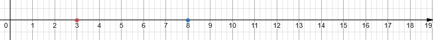

Οι φυσικοί αριθμοί αποτελούν το θεμελιώδες σύνολο αριθμών ($\mathbb{N}$) που χρησιμοποιείται για την καταμέτρηση αντικειμένων και διακρίνονται για τις εξής ιδιότητες και κανόνες διάταξης:

### **1. Ορισμός και Βασικά Χαρακτηριστικά**

-   **Σύνολο:** Περιλαμβάνει τους αριθμούς $\{0, 1, 2, 3, \dots\}$. Κάθε αριθμός προκύπτει από τον προηγούμενό του με την προσθήκη μίας μονάδας.
-   **Άπειρο Σύνολο:** Οι φυσικοί αριθμοί είναι άπειροι, καθώς δεν υπάρχει μέγιστος αριθμός· για κάθε $n$ υπάρχει πάντα ο επόμενός του, $n+1$.
-   **Ελάχιστο Στοιχείο:** Το **μηδέν (0)** θεωρείται η αφετηρία της αριθμητικής ημιευθείας και το ελάχιστο στοιχείο του συνόλου.
-   **Διακριτός Χαρακτήρας:** Μεταξύ δύο διαδοχικών φυσικών αριθμών $n$ και $n+1$ **δεν παρεμβάλλεται κανένας άλλος** φυσικός αριθμός.

### **2. Κανόνες Διάταξης και Σύγκρισης**

Η διάταξη επιτρέπει τη σύγκριση οποιωνδήποτε δύο φυσικών αριθμών βάσει των παρακάτω κανόνων:

\* **Αρχή της Τριχοτομίας:** Για κάθε ζεύγος αριθμών $n, m$, ισχύει ακριβώς μία από τις σχέσεις: $n = m$, $n < m$ ή $n > m$.

\* **Ορισμός Ανισότητας:** Ο $m$ είναι μικρότερος του $n$ ($m < n$) αν υπάρχει ένας φυσικός αριθμός $k \neq 0$ τέτοιος ώστε $n = m + k$.

\* **Μεταβατική Ιδιότητα:** Αν $n < m$ και $m < k$, τότε $n < k$.

\* **Αντισυμμετρική Ιδιότητα:** Αν $m \le n$ και $n \le m$, τότε αναγκαστικά $m = n$.

\* **Αριθμητική Ημιευθεία:** Οι αριθμοί διατάσσονται πάνω σε μια ημιευθεία ξεκινώντας από το 0 και προχωρώντας προς τα δεξιά.
Όσο πιο δεξιά βρίσκεται ένας αριθμός, τόσο μεγαλύτερος είναι.

\* **Αρχή της Καλής Διάταξης:** Κάθε μη κενό υποσύνολο των φυσικών αριθμών έχει ένα **ελάχιστο στοιχείο**.

### **3. Βασικές Πράξεις και Ιδιότητες**

Οι φυσικοί αριθμοί διέπονται από συγκεκριμένες ιδιότητες κατά την εκτέλεση πράξεων:

\* **Πρόσθεση:** Είναι πράξη **κλειστή** στο $\mathbb{N}$.

Ισχύουν η **αντιμεταθετική** ($a+\beta = \beta+a$),

η **προσεταιριστική** $(a+\beta)+\gamma=a+(\beta+\gamma)$

και το **0 ως ουδέτερο στοιχείο** ($a+0=a$).

\* **Αφαίρεση:** Είναι η αντίστροφη πράξη της πρόσθεσης.

Μπορεί να εκτελεστεί μόνο αν ο **μειωτέος είναι μεγαλύτερος ή ίσος του αφαιρετέου** ($a \ge \beta$).

\* **Πολλαπλασιασμός:** Ισχύουν

η **αντιμεταθετική**, $a\cdot\beta=\beta\cdot a$

η **προσεταιριστική** $(a\cdot \beta) \cdot \gamma=a\cdot(\beta\cdot\gamma)$\
και η **επιμεριστική** ιδιότητα ως προς την πρόσθεση και την αφαίρεση.
$$a\cdot(\beta+\gamma)=a\cdot\beta+a\cdot\gamma $$ $$a\cdot(\beta-\gamma)=a\cdot\beta-a\cdot\gamma $$

Το **1 είναι το ουδέτερο στοιχείο**, $a\cdot1=a$

ενώ το **0 είναι το απορροφητικό στοιχείο** ($a \cdot 0 = 0$).

\* **Ευκλείδεια Διαίρεση:** Για κάθε διαιρετέο $\Delta$ και διαιρέτη $\delta$, υπάρχουν μοναδικά πηλίκο $\pi$ και υπόλοιπο $\upsilon$ ώστε $\Delta = \delta \cdot \pi + \upsilon$, με τον περιορισμό $0 \le \upsilon < \delta$.

\* **Δυνάμεις:** Εκφράζουν το γινόμενο ίδιων παραγόντων ($a^n$).
Ισχύει $a^1 = a$ και $a^0 = 1$ (για $a \neq 0$).

### **4. Κατηγοριοποίηση Αριθμών**

-   **Άρτιοι (Ζυγοί):** Τελειώνουν σε $0, 2, 4, 6, 8$.
-   **Περιττοί (Μονοί):** Τελειώνουν σε $1, 3, 5, 7, 9$.
-   **Πρώτοι αριθμοί:** Έχουν διαιρέτες μόνο τον εαυτό τους και τη μονάδα (π.χ. $2, 3, 5, 7$).
-   **Σύνθετοι αριθμοί:** Έχουν περισσότερους από δύο διαιρέτες.

Τέλος, η **στρογγυλοποίηση** αποτελεί σημαντικό κανόνα για την προσέγγιση φυσικών αριθμών: αν το ψηφίο στα δεξιά της θέσης στρογγυλοποίησης είναι $0-4$ ο αριθμός παραμένει ίδιος, ενώ αν είναι $5-9$ αυξάνεται κατά μία μονάδα.\

\
------------------------------------------------------------------------\
\
Ακολουθεί μια παρουσίαση της θεωρίας των φυσικών αριθμών, μαζί με λυμένες και προτεινόμενες ασκήσεις.

### **Μέρος 1: Θεωρία και Κανόνες**

**1. Ορισμός και Δομή**

\* Οι **φυσικοί αριθμοί** ($\mathbb{N}$) είναι οι αριθμοί $\{0, 1, 2, 3, \dots\}$.
Ξεκινούν από το **0** (ελάχιστο στοιχείο) και είναι **άπειροι**.

\* Κάθε αριθμός προκύπτει από τον προηγούμενο με την προσθήκη της μονάδας ($n+1$).

\* Διακρίνονται σε **άρτιους** (τελειώνουν σε 0, 2, 4, 6, 8) και **περιττούς** (τελειώνουν σε 1, 3, 5, 7, 9).

**2. Διάταξη και Στρογγυλοποίηση**

\* **Σύγκριση:** Χρησιμοποιούμε τα σύμβολα $<, >, =$.
Ένας αριθμός $a$ είναι μικρότερος του $\beta$ αν βρίσκεται πιο αριστερά στην αριθμητική ημιευθεία.

\* **Κανόνας Στρογγυλοποίησης:**

1\.
Επιλέγουμε τη θέση στρογγυλοποίησης.

2\.
Εξετάζουμε το ψηφίο στα δεξιά:

-   Αν είναι **0-4**: Το ψηφίο της θέσης παραμένει ίδιο.

-   Αν είναι **5-9**: Το ψηφίο της θέσης αυξάνεται κατά 1.

3\.
Όλα τα ψηφία δεξιά γίνονται μηδενικά.

**3. Ευκλείδεια Διαίρεση και Διαιρετότητα**

\* **Ταυτότητα:** $\Delta = \delta \cdot \pi + \upsilon$, με τον περιορισμό $0 \le \upsilon < \delta$.

\* **Κριτήρια Διαιρετότητας:**

-   Με το **2**: Λήγει σε 0, 2, 4, 6, 8.

-   Με το **5**: Λήγει σε 0 ή 5.

-   Με το **3** ή **9**: Το άθροισμα των ψηφίων του διαιρείται με το 3 ή 9 αντίστοιχα.

-   Με το **4** ή **25**: Τα δύο τελευταία ψηφία διαιρούνται με το 4 ή 25.

\* **ΜΚΔ & ΕΚΠ:** Ο Μέγιστος Κοινός Διαιρέτης είναι το γινόμενο των κοινών πρώτων παραγόντων με τον μικρότερο εκθέτη.
Το Ελάχιστο Κοινό Πολλαπλάσιο είναι το γινόμενο κοινών και μη κοινών με τον μεγαλύτερο εκθέτη.

------------------------------------------------------------------------

### **Μέρος 2: 10 Ασκήσεις Λυμένες**

1.  **Στρογγυλοποίηση:** Στρογγυλοποιήστε τον αριθμό **259.663** στις Μονάδες Χιλιάδων (ΜΧ).
    -   **Λύση:** Η θέση ΜΧ είναι το 9. Το δεξί ψηφίο είναι το 6 ($6 \ge 5$). Το 9 γίνεται 10, άρα η μονάδα μεταφέρεται στο 5, που γίνεται 6. Αποτέλεσμα: **260.000**.
2.  **Ευκλείδεια Διαίρεση:** Αν ένας αριθμός διαιρεθεί με το 9, δίνει πηλίκο 73 και υπόλοιπο 4. Ποιος είναι ο αριθμός;
    -   **Λύση:** $\Delta = \delta \cdot \pi + \upsilon \Rightarrow \Delta = 9 \cdot 73 + 4 = 657 + 4 = \mathbf{661}$.
3.  **Προτεραιότητα Πράξεων:** Υπολογίστε την τιμή: $4+(3-2)+(5-1)\cdot2+7-2$.
    -   **Λύση:**
        -   πρώτα τις παρενθέσεις $4+1+4\cdot2+7-2$.
        -   μετά τον πολλαπλασιασμό $4+1+8+7-2$.
        -   Τέλος τις προσθέσεις και αφαιρέσεις με την σειρά που τις συναντάμε: $20-2=\mathbf{18}$.
4.  **Κριτήρια Διαιρετότητας:** Εξετάστε αν ο αριθμός **123.456** διαιρείται με το 3.
    -   **Λύση:** Προσθέτουμε τα ψηφία: $1+2+3+4+5+6 = 21$. Το 21 διαιρείται με το 3 ($21:3=7$), άρα ο αριθμός **διαιρείται με το 3**.
5.  **ΕΚΠ:** Βρείτε το ΕΚΠ των αριθμών 15 και 27.
    -   **Λύση:** Ανάλυση: $15 = 3 \cdot 5$ και $27 = 3^3$. Το ΕΚΠ παίρνει κοινούς και μη κοινούς με μέγιστο εκθέτη: $3^3 \cdot 5 = 27 \cdot 5 = \mathbf{135}$.
6.  **ΜΚΔ:** Βρείτε τον ΜΚΔ των αριθμών 15 και 27.
    -   **Λύση:** Από την προηγούμενη ανάλυση ($3 \cdot 5$ και $3^3$), ο ΜΚΔ παίρνει μόνο κοινούς με ελάχιστο εκθέτη: **3**.
7.  **Δυνάμεις:** Υπολογίστε την τιμή της παράστασης: $2^3 + 5^2 - 12^1$.
    -   **Λύση:** $2^3 = 8$, $5^2 = 25$, $12^1 = 12$. Άρα $8 + 25 - 12 = 33 - 12 = \mathbf{21}$.
8.  **Πρόβλημα Παράταξης:** Μπορεί ένας καθηγητής να παρατάξει 168 μαθητές σε πλήρεις πεντάδες;
    -   **Λύση:** Εκτελούμε τη διαίρεση $168 : 5$. Το 168 δεν λήγει σε 0 ή 5, άρα η διαίρεση αφήνει υπόλοιπο ($168 = 5 \cdot 33 + 3$). **Όχι**, θα περισσέψουν 3 μαθητές.
9.  **Πρόβλημα Αποθήκευσης:** Σε μια δισκέτα χωρούν 11 φωτογραφίες. Πόσες δισκέτες χρειάζονται για 180 φωτογραφίες;
    -   **Λύση:** $180 : 11 \Rightarrow 180 = 11 \cdot 16 + 4$. Χρειάζονται 16 πλήρεις δισκέτες και μία ακόμα για τις 4 που περισσεύουν. Σύνολο: **17 δισκέτες**.
10. **Ανάλυση σε Πρώτους Παράγοντες:** Αναλύστε τον αριθμό 360.
    -   **Λύση:** $360 = 2 \cdot 180 = 2^2 \cdot 90 = 2^3 \cdot 45 = 2^3 \cdot 3 \cdot 15 = 2^3 \cdot 3^2 \cdot 5$. Μορφή δυνάμεων: $2^3 \cdot 3^2 \cdot 5$.

------------------------------------------------------------------------

### **Μέρος 3: 10 Ασκήσεις χωρίς Λύση**

1.  Στρογγυλοποιήστε τον αριθμό **563.524.132.678** στις Δεκάδες Εκατομμυρίων (ΔΕ).
2.  Υπολογίστε την τιμή της αριθμητικής παράστασης: $5 \cdot 4^2 - (10 - 2) \cdot 3 + 2^3$.
3.  Εξετάστε ποιες από τις παρακάτω ισότητες είναι Ευκλείδειες διαιρέσεις:

-   α) $125 = 35 \cdot 3 + 20$
-   β) $762 = 38 \cdot 19 + 40$.

4.  Συμπληρώστε το ψηφίο που λείπει στον αριθμό **83\_** ώστε να διαιρείται ταυτόχρονα με το 2 και το 5.
5.  Βρείτε το ΕΚΠ και τον ΜΚΔ των αριθμών **8, 12 και 24**.
6.  Γράψτε σε μορφή μιας δύναμης το γινόμενο: $3 \cdot 3 \cdot 3 \cdot 3 \cdot a \cdot a \cdot a$.
7.  Τρία πλοία αναχωρούν μαζί. Το πρώτο επιστρέφει κάθε 3 μέρες, το δεύτερο κάθε 4 και το τρίτο κάθε 8. Μετά από πόσες μέρες θα ξανασυναντηθούν;.
8.  Ποια μπορεί να είναι τα δυνατά υπόλοιπα μιας διαίρεσης αν ο διαιρέτης είναι το 8;.
9.  Εφαρμόστε την επιμεριστική ιδιότητα για να υπολογίσετε το γινόμενο $17 \cdot 18$ χρησιμοποιώντας τη μορφή $17 \cdot (20 - 2)$.
10. Αναλύστε τον αριθμό **2.520** σε γινόμενο πρώτων παραγόντων.\
