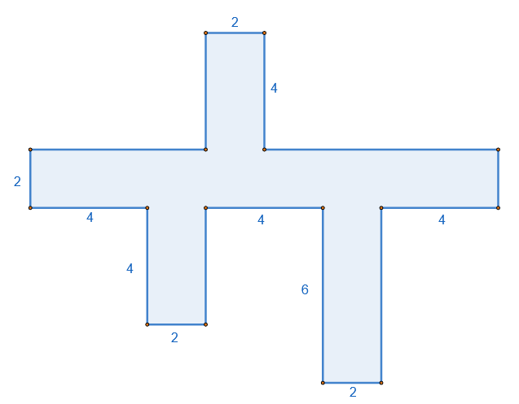

## Πρόσθεση, αφαίρεση και πολλαπλασιασμός φυσικών αριθμών

### Πρόσθεση Φυσικών Αριθμών

::: {style="background-color: #b5b1de; border: 2px solid #2f3e50; color: #25188a; padding: 15px; border-radius: 5px;"}
**Θεωρία & Ορισμοί**

- **Ορισμός:** Πρόσθεση είναι η πράξη με την οποία από δύο φυσικούς αριθμούς $\alpha$ και $\beta$ (**προσθετέοι**), βρίσκουμε έναν τρίτο φυσικό αριθμό $\gamma$ (**άθροισμα**).
  Συμβολίζεται με το «$+$» και η διαδικασία αντιστοιχεί στην ένωση δύο ξένων συνόλων.

- **Εσωτερική Πράξη:** Το άθροισμα δύο φυσικών αριθμών είναι πάντα φυσικός αριθμός.

**Ιδιότητες**

1.  **Αντιμεταθετική:** Μπορούμε να αλλάζουμε τη σειρά των προσθετέων χωρίς να αλλάζει το άθροισμα ($\alpha + \beta = \beta + \alpha$).

2.  **Προσεταιριστική:** Σε άθροισμα τριών αριθμών, μπορούμε να αντικαταστήσουμε προσθετέους με το άθροισμά τους ή να αλλάξουμε την ομαδοποίησή τους \[$(\alpha + \beta) + \gamma = \alpha + (\beta + \gamma)$\].

3.  **Ουδέτερο Στοιχείο:** Το **μηδέν (**$0$) δεν μεταβάλλει τον αριθμό στον οποίο προστίθεται ($\alpha + 0 = \alpha$).
:::

**Παραδείγματα**

1.  $13 + 5 = 18$.
2.  $3 + 6 = 9$ και $6 + 3 = 9$ (Επαλήθευση αντιμεταθετικής ιδιότητας).
3.  $(5 + 4) + 2 = 9 + 2 = 11$ και $5 + (4 + 2) = 5 + 6 = 11$ (Επαλήθευση προσεταιριστικής ιδιότητας).

**Ασκήσεις**

1.  Υπολογίστε το άθροισμα: $3.582 + 7.591$.
2.  Βρείτε το $x$ στην εξίσωση: $x + 3 = 10$.
3.  Εκτελέστε την πράξη: $122 + 332$.
4.  Υπολογίστε νοερά: $64 + 21 + 24 + 19$.
5.  Συμπληρώστε το κενό: $32 + ... = 32$.
6.  Βρείτε το άθροισμα των φυσικών αριθμών από το $1$ έως το $9$.
7.  Αν $\alpha + \beta = 25$, υπολογίστε την τιμή: $10 + \alpha + \beta + 5$.
8.  Προσθέστε τα μήκη: $15 \text{m} + 28 \text{m} + 300 \text{cm}$.
9.  Εκτελέστε την πρόσθεση: $1.497 + 2.689 + 601$.
10. Λύστε την εξίσωση: $7 + x = 15$.

------------------------------------------------------------------------

### Αφαίρεση Φυσικών Αριθμών

::: {style="background-color: #b5b1de; border: 2px solid #2f3e50; color: #25188a; padding: 15px; border-radius: 5px;"}
**Θεωρία & Ορισμοί**

- **Ορισμός:** Αφαίρεση είναι η πράξη με την οποία, όταν δίνονται δύο αριθμοί $M$ (**μειωτέος**) και $A$ (**αφαιρετέος**), βρίσκουμε έναν αριθμό $\Delta$ (**διαφορά**), ο οποίος όταν προστεθεί στον $A$ δίνει τον $M$ ($M - A = \Delta$).

- **Περιορισμός:** Στους φυσικούς αριθμούς, η αφαίρεση είναι δυνατή μόνο αν ο αφαιρετέος είναι **μικρότερος ή ίσος** του μειωτέου ($M \ge A$).

- **Αντίστροφη Πράξη:** Η αφαίρεση θεωρείται η αντίστροφη πράξη της πρόσθεσης.

**Ιδιότητες**

1.  **Σχέση με Μηδέν:** $\alpha - 0 = \alpha$ και $\alpha - \alpha = 0$.

2.  **Θεμελιώδης Ιδιότητα:** Η διαφορά δεν μεταβάλλεται αν προσθέσουμε ή αφαιρέσουμε τον ίδιο αριθμό και στους δύο όρους της \[$\alpha - \beta = (\alpha + \gamma) - (\beta + \gamma)$\].

3.  **Μη Αντιμεταθετική:** Η αφαίρεση **δεν** είναι αντιμεταθετική πράξη στους φυσικούς αριθμούς.
:::

**Παραδείγματα**

1.  $16 - 7 = 9$, διότι $9 + 7 = 16$.
2.  $20 - 8 = 12$.
3.  $30 - 18 = 12$.

**Ασκήσεις**

1.  Εκτελέστε την αφαίρεση: $3.452 - 865$.
2.  Λύστε την εξίσωση: $x - 30 = 50$.
3.  Βρείτε το $x$: $15 - x = 8$.
4.  Υπολογίστε τη διαφορά: $13.005 - 9.678$.
5.  Ποιο είναι το αποτέλεσμα της πράξης $635 - 536$;.
6.  Υπολογίστε νοερά: $285 - 79$.
7.  Εκτελέστε την πράξη: $829.310 - 497.583$.
8.  Λύστε την εξίσωση: $x + 20 = 25$.
9.  Υπολογίστε το αποτέλεσμα: $100 - (30 + 20)$.
10. Βρείτε την τιμή της παράστασης: $(524 - 99) - 75$.

------------------------------------------------------------------------

### Πολλαπλασιασμός Φυσικών Αριθμών

::: {style="background-color: #b5b1de; border: 2px solid #2f3e50; color: #25188a; padding: 15px; border-radius: 5px;"}
**Θεωρία & Ορισμοί**

- **Ορισμός:** Πολλαπλασιασμός είναι η πράξη με την οποία από δύο φυσικούς αριθμούς $\alpha$ και $\beta$ (**παράγοντες**), βρίσκουμε έναν τρίτο φυσικό αριθμό $\gamma$ (**γινόμενο**).
  Ορίζεται επίσης ως το άθροισμα $a$ προσθετέων ίσων με $\beta$.

- **Ορολογία:** Ο πρώτος παράγοντας λέγεται **πολλαπλασιαστής** και ο δεύτερος **πολλαπλασιαστέος**.

**Ιδιότητες**

1.  **Αντιμεταθετική:** Το γινόμενο δεν αλλάζει αν αλλάξουμε τη σειρά των παραγόντων ($\alpha \cdot \beta = \beta \cdot \alpha$).

2.  **Προσεταιριστική:** Μπορούμε να ομαδοποιούμε τους παράγοντες με διαφορετικό τρόπο χωρίς να αλλάζει το αποτέλεσμα \[$(\alpha \cdot \beta) \cdot \gamma = \alpha \cdot (\beta \cdot \gamma)$\].

3.  **Ουδέτερο Στοιχείο:** Η **μονάδα (**$1$) δεν μεταβάλλει τον αριθμό με τον οποίο πολλαπλασιάζεται ($\alpha \cdot 1 = \alpha$).

4.  **Επιμεριστική Ιδιότητα (ως προς την πρόσθεση/αφαίρεση):** $\alpha \cdot (\beta \pm \gamma) = \alpha \cdot \beta \pm \alpha \cdot \gamma$.

5.  **Ιδιότητα του Μηδενός:** Κάθε αριθμός επί μηδέν ισούται με μηδέν ($\alpha \cdot 0 = 0$).
:::

**Παραδείγματα**

1.  $7 \cdot 6 = 42$.
2.  $35 \cdot 10 = 350$.
3.  $89 \cdot 7 + 89 \cdot 3 = 89 \cdot (7 + 3) = 89 \cdot 10 = 890$ (Εφαρμογή επιμεριστικής).

**Ασκήσεις**

1.  Υπολογίστε το γινόμενο: $421 \cdot 100$.
2.  Εκτελέστε την πράξη: $284 \cdot 99$ (χρησιμοποιώντας επιμεριστική).
3.  Βρείτε το γινόμενο των φυσικών αριθμών μεταξύ $0$ και $10$.
4.  Υπολογίστε νοερά: $84 \cdot 21$ (ως $84 \cdot 20 + 84 \cdot 1$).
5.  Εκτελέστε τον πολλαπλασιασμό: $5.879 \cdot 346$.
6.  Υπολογίστε την τιμή: $23 \cdot 49 + 77 \cdot 49$.
7.  Βρείτε το αποτέλεσμα: $3 \cdot 13$.
8.  Εκτελέστε την πράξη: $4.375 \cdot 169$.
9.  Συμπληρώστε το κενό: $23 \cdot ... = 0$.
10. Υπολογίστε το γινόμενο: $7.567 \cdot 694$.

### Ασκήσεις

1.  **Συμπλήρωση Κενών (Ιδιότητες Πράξεων)**

Συμπλήρωσε τα παρακάτω κενά:

- α. Η ιδιότητα $x + y = y + x$ λέγεται ...................................................................................
- β. Η ιδιότητα $x \cdot (y \cdot z) = (x \cdot y) \cdot z$ λέγεται .........................................................................
- γ. Ο αριθμός που αν τον πολλαπλασιάσουμε με έναν αριθμό $\alpha$ δίνει γινόμενο $\alpha$ είναι το ...............
- δ. Το αποτέλεσμα της διαίρεσης λέγεται ...............................................................................
- ε. Σε μια αφαίρεση ο Μειωτέος $(Μ)$, ο Αφαιρετέος $(Α)$, και η διαφορά $(Δ)$ συνδέονται με τη σχέση: ........................................................................................................
- στ. Η ιδιότητα $\alpha \cdot \beta = \beta \cdot \alpha$ λέγεται ...................................................................................
- ζ. Η ιδιότητα $(x + y) + z = x + (y + z)$ λέγεται ..........................................................................
- η. Η ιδιότητα $\alpha \cdot (\beta - \gamma) = \alpha \cdot \beta - \alpha \cdot \gamma$ λέγεται ................................................................

2.  **Πολλαπλασιασμοί με Δυνάμεις του 10**

Συμπλήρωσε τα γινόμενα:

- α. $84 \cdot [\dots] = 8.400$
- β. $125 \cdot [\dots] = 12.500$
- γ. $630 \cdot [\dots] = 6.300.000$

3.  **Κρυπτογραφική Πρόσθεση & Αφαίρεση**
- α.  Συμπλήρωσε τα κενά με τους κατάλληλους αριθμούς, ώστε να προκύψουν σωστά αποτελέσματα:

\begin{array}{r\@{\quad}l} \Box \ 4 \ 7 \\

- \ 6 \ \Box \ 5 \\ \hline
1 \ 2 \  8 \ 2 
\end{array} 

- β.  Συμπλήρωσε τα κενά με τους κατάλληλους αριθμούς, ώστε να προκύψουν σωστά αποτελέσματα:

 
\begin{array}{r\@{\quad}l} 5 \ \Box  \ 3 \\

- \ \Box \ 4 \ 8 \\ \hline
2 \ 1 \ 5 
\end{array} 

4.  **Προτεραιότητα Πράξεων**

Αντιστοίχισε κάθε γραμμή της πρώτης στήλης με ένα από τα αποτελέσματα της δεύτερης στήλης:

| Πράξη                   | Αποτέλεσμα |
|:------------------------|:-----------|
| $2 + 3 \cdot 4 + 5$     | $11$       |
| $(2 + 3) \cdot (4 + 5)$ | $45$       |
| $2 + 3 \cdot (4 + 5)$   | $19$       |
| $(2 + 3) \cdot 4 + 5$   | $29$       |
|                         | $25$       |

5.  **Υπολογισμοί και Επιλογή Σωστού**

Τοποθέτησε ένα "X" στην αντίστοιχη θέση του σωστού αποτελέσματος:

- α. $245 + 55 =$ (300 / 310 / 290)
- β. $150 - 65 =$ (85 / 95 / 75)
- γ. $12 \cdot 5 + 10 =$ (70 / 180 / 60)
- δ. $40 : (10 - 2) =$ (2 / 5 / 8)

6.  **Επιμεριστική Ιδιότητα**

Υπολόγισε τα παρακάτω γινόμενα χρησιμοποιώντας την επιμεριστική ιδιότητα:

- α. $4 \cdot 102$
- β. $6 \cdot 98$
- γ. $15 \cdot 11$
- δ. $8 \cdot 1.005$

7.  **Εμβαδόν Σχήματος**

Υπολόγισε το εμβαδόν του παρακάτω σχήματος , χωρίζοντάς το σε ορθογώνια και χρησιμοποιώντας την επιμεριστική ιδιότητα.\
{width="400"}

8.  **Προβλήματα Αγοράς**

Αγοράσαμε τρεις συσκευές που κόστιζαν: $420 \text{ €}$, $180 \text{ €}$ και $350 \text{ €}$.

- α. Υπολόγισε πρόχειρα (με στρογγυλοποίηση) αν φτάνουν $1.000 \text{ €}$ για να πληρώσουμε.
- β. Βρες ακριβώς πόσα χρήματα θα πληρώσουμε.

9.  **Διαχείριση Χρημάτων**

Η Μαρία βγήκε για ψώνια έχοντας $120 \text{ €}$.
Αγόρασε ένα βιβλίο που κόστιζε $18 \text{ €}$, μια τσάντα που κόστιζε $45 \text{ €}$ και ένα ζευγάρι ακουστικά που κόστιζαν $32 \text{ €}$.
Της φτάνουν τα χρήματα για να τα αγοράσει όλα; Πόσα θα της περισσέψουν ή πόσα θα της λείπουν;

10. **Αποθήκη Προϊόντων**

Σε μια αποθήκη υπήρχαν $450$ κιλά πατάτες και $320$ κιλά κρεμμύδια.
Πουλήθηκαν $215$ κιλά πατάτες και $180$ κιλά κρεμμύδια.
Πόσα κιλά λαχανικά έμειναν συνολικά στην αποθήκη;

11. **Ηλικίες**

Ο Πέτρος γεννήθηκε το $1995$.
Η αδερφή του, η Άννα, είναι $4$ χρόνια μεγαλύτερή του.

- α. Πόσων χρονών είναι ο Πέτρος σήμερα (το $2024$);
- β. Πότε γεννήθηκε η Άννα;

12. **Χωρητικότητα Πάρκινγκ**

Ένα πάρκινγκ έχει $5$ ορόφους.
Οι $3$ πρώτοι όροφοι έχουν από $40$ θέσεις ο καθένας και οι υπόλοιποι $2$ όροφοι έχουν από $35$ θέσεις ο καθένας.
Αν μέσα στο πάρκινγκ βρίσκονται ήδη $150$ αυτοκίνητα, πόσες κενές θέσεις υπάρχουν ακόμα;

------------------------------------------------------------------------
