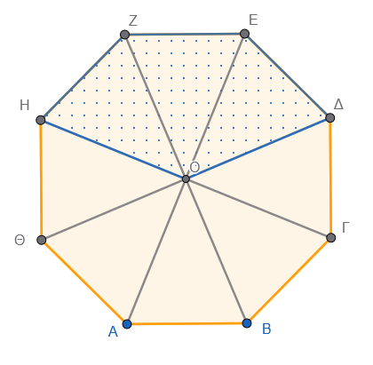
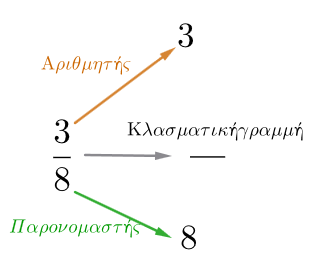

------------------------------------------------------------------------

## Η Έννοια του Κλάσματος

::: {style="background-color: #b5b1de; border: 2px solid #2f3e50; color: #25188a; padding: 15px; border-radius: 5px;"}
### **Θεωρία**

- **Ορισμός:** Το κλάσμα αναπαριστά ένα κομμάτι ενός ολόκληρου αντικειμένου ή έναν αριθμό ίσων κομματιών του όλου.\

  {width="300"}\
  Το οκτάγωνο είναι χωρισμένο σε 8 ίσα τρίγωνα, τα 3 στιγματισμένα μέρη είναι τα $\dfrac{3}{8}$ όλου του πολυγώνου

- **Όροι του κλάσματος:** Αποτελείται από τον **αριθμητή** $3$ (πάνω), τον **παρονομαστή** $8$ (κάτω) και την **κλασματική γραμμή**.\
  {width="250"}

- Ο **παρονομαστής** δείχνει σε πόσα ίσα μέρη χωρίσαμε τη μονάδα.

- Ο **αριθμητής** δείχνει πόσα από αυτά τα μέρη πήραμε.

- Η **κλασματική γραμμή** συμβολίζει την πράξη της διαίρεσης.

- **Περιορισμός:** Ο παρονομαστής δεν μπορεί ποτέ να είναι μηδέν (0).

- **Κλασματική μονάδα:** Είναι το κλάσμα που έχει αριθμητή τη μονάδα (1), π.χ.
  $\dfrac{1}{ν}$**.**
:::

**Λυμένες Ασκήσεις**

1.  **Ερώτηση:** Ποιος είναι ο αριθμητής και ποιος ο παρονομαστής στο κλάσμα $\dfrac{4}{6}$;

**Λύση:** Αριθμητής είναι το 4 και παρονομαστής το 6.

2.  **Ερώτηση:** Γράψτε τη διαίρεση $3:8$ ως κλάσμα.

**Λύση:** Το πηλίκο της διαίρεσης $3:8$ εκφράζεται ως το κλάσμα $\dfrac{3}{8}$.

3.  **Ερώτηση:** Αν χωρίσουμε μια πίτσα σε 5 ίσα μέρη και φάμε το 1, τι μέρος της πίτσας φάγαμε;

**Λύση:** Ο παρονομαστής είναι 5 (συνολικά μέρη) και ο αριθμητής 1 (μέρος που πήραμε), άρα φάγαμε το $\dfrac{1}{5}$ της πίτσας.

4.  **Ερώτηση:** Ποιος φυσικός αριθμός είναι ίσος με το κλάσμα $\dfrac{24}{6}$;

**Λύση:** $24 : 6 = 4$.
Άρα το κλάσμα ισούται με τον φυσικό αριθμό 4.

5.  **Ερώτηση:** Υπολογίστε το $\dfrac{1}{5}$ του 20.

**Λύση:** Πολλαπλασιάζουμε το $\dfrac{1}{5}$ με το 20: $\dfrac{1 \cdot 20}{5} = \dfrac{20}{5} = 4$.

**Άλυτες Ασκήσεις**

1.  Γράψτε ως κλάσματα τις διαιρέσεις: $9:10$, $45:68$, $132:234$.

2.  Ποια διαίρεση παριστάνει το κλάσμα $\dfrac{5}{23}$ και ποια το $\dfrac{18}{8}$;

3.  Μια οικογένεια έχει 6 μέλη (2 γονείς, 4 παιδιά).
    Τι κλάσμα του συνόλου είναι τα παιδιά;

4.  Στην ίδια οικογένεια, τι κλάσμα του συνόλου είναι οι ενήλικες;

5.  Βρείτε με ποιον φυσικό αριθμό είναι ίσα τα κλάσματα: $\dfrac{12}{2}, \dfrac{30}{5}, \dfrac{8}{2}$.

6.  Στο κλάσμα $\dfrac{x}{x-3}$, ποιον περιορισμό πρέπει να βάλουμε για τον παρονομαστή;

7.  Αν ο αριθμητής ενός κλάσματος είναι 0, με τι ισούται το κλάσμα;

8.  Γράψτε τον φυσικό αριθμό 13 ως κλάσμα με παρονομαστή τη μονάδα.

9.  Σχεδιάστε ένα ορθογώνιο, χωρίστε το σε 8 ίσα μέρη και σκιάστε τα $\dfrac{3}{8}$.

10. Τι ονομάζουμε όρους ενός κλάσματος;

------------------------------------------------------------------------

### 2. Ισοδύναμα Κλάσματα

**Θεωρία**

::: {style="background-color: #b5b1de; border: 2px solid #2f3e50; color: #25188a; padding: 15px; border-radius: 5px;"}

* **Ορισμός:** Ισοδύναμα ή ίσα ονομάζονται τα κλάσματα που εκφράζουν το ίδιο μέρος ενός μεγέθους, παρόλο που έχουν διαφορετικούς όρους.

* **Τρόποι δημιουργίας:**

1.  Πολλαπλασιάζοντας αριθμητή και παρονομαστή με τον ίδιο φυσικό αριθμό (διάφορο του μηδενός).

$$\frac{a}{\beta}=\frac{a\cdot\kappa}{\beta\cdot\kappa} $$

2.  Διαιρώντας αριθμητή και παρονομαστή με τον ίδιο φυσικό αριθμό (απλοποίηση).

\
$$\frac{a}{\beta}=\frac{a:\kappa}{\beta:\kappa}$$

* **Ανάγωγο κλάσμα:** Το κλάσμα που δεν μπορεί να απλοποιηθεί άλλο (ο αριθμητής και ο παρονομαστής δεν έχουν κοινό διαιρέτη εκτός από το 1).

* **Ιδιότητα:** Σε δύο ισοδύναμα κλάσματα $\dfrac{a}{\beta} = \dfrac{\gamma}{\delta}$, τα χιαστί γινόμενα είναι ίσα ($a \cdot \delta = \beta \cdot \gamma$).

:::

\

**Λυμένες Ασκήσεις**

1.  **Ερώτηση:** Βρείτε ένα ισοδύναμο κλάσμα του $\dfrac{1}{2}$ με παρονομαστή το 4.

**Λύση:** Πολλαπλασιάζουμε και τους δύο όρους με το 2: $\dfrac{1 \cdot 2}{2 \cdot 2} = \dfrac{2}{4}$.

2.  **Ερώτηση:** Απλοποιήστε το κλάσμα $\dfrac{6}{15}$.

**Λύση:** Διαιρούμε και τους δύο όρους με τον ΜΚΔ τους, που είναι το 3: $\dfrac{6:3}{15:3} = \dfrac{2}{5}$.

3.  **Ερώτηση:** Είναι τα κλάσματα $\dfrac{1}{2}$ και $\dfrac{4}{8}$ ισοδύναμα;

**Λύση:** Ελέγχουμε τα χιαστί γινόμενα: $1 \cdot 8 = 8$ και $2 \cdot 4 = 8$.
Επειδή $8=8$, είναι ισοδύναμα.

4.  **Ερώτηση:** Τρέψτε το $\dfrac{3}{4}$ σε ισοδύναμο με αριθμητή 21.

**Λύση:** Επειδή $3 \cdot 7 = 21$, πολλαπλασιάζουμε και τον παρονομαστή με το 7: $4 \cdot 7 = 28$.
Άρα $\dfrac{21}{28}$.

5.  **Ερώτηση:** Το κλάσμα $\dfrac{2}{5}$ είναι ανάγωγο;

**Λύση:** Ναι, γιατί το 2 και το 5 δεν έχουν κοινό διαιρέτη εκτός από τη μονάδα.

\

**Άλυτες Ασκήσεις**

1.  Μετατρέψτε το κλάσμα $\dfrac{1}{6}$ σε ισοδύναμο με παρονομαστή 12, 30 και 60.

2.  Απλοποιήστε τα κλάσματα: $\dfrac{24}{48}, \dfrac{36}{45}, \dfrac{66}{77}$.

3.  Εξετάστε αν είναι ισοδύναμα τα ζεύγη: $\dfrac{4}{5}$ και $\dfrac{20}{25}$, $\dfrac{32}{64}$ και $\dfrac{1}{2}$.

4.  Βρείτε τον άγνωστο $x$ στην ισότητα: $\dfrac{5}{6} = \dfrac{x}{42}$.

5.  Κάντε ομώνυμα τα κλάσματα $\dfrac{5}{6}$ και $\dfrac{4}{15}$.

6.  Μετατρέψτε το $\dfrac{2}{3}$ σε ισοδύναμο με παρονομαστή 120.

7.  Απλοποιήστε το κλάσμα $\dfrac{114}{76}$ μέχρι να γίνει ανάγωγο.

8.  Βρείτε τρία ισοδύναμα κλάσματα για το $\dfrac{1}{3}$.

9.  Πώς ονομάζεται η διαδικασία με την οποία μικραίνουμε τους όρους ενός κλάσματος;

10. Συμπληρώστε την ισότητα: $\dfrac{3}{8} = \dfrac{a=  }{24}$.

------------------------------------------------------------------------

### Σύγκριση Κλασμάτων

**Θεωρία**

::: {style="background-color: #b5b1de; border: 2px solid #2f3e50; color: #25188a; padding: 15px; border-radius: 5px;"}

* **Ομώνυμα κλάσματα:** Έχουν ίδιο παρονομαστή.
Μεγαλύτερο είναι αυτό με τον **μεγαλύτερο αριθμητή**.

* **Κλάσματα με ίδιο αριθμητή:** Μεγαλύτερο είναι αυτό με τον **μικρότερο παρονομαστή**.

* **Ετερώνυμα κλάσματα:** Για να τα συγκρίνουμε, τα μετατρέπουμε πρώτα σε ομώνυμα.

* **Σύγκριση με τη μονάδα (1):**

* Αριθμητής $\lt$ Παρονομαστή $\Rightarrow$ Κλάσμα $\lt 1$ (Γνήσιο).

* Αριθμητής $\gt$ Παρονομαστή $\Rightarrow$ Κλάσμα $\gt 1$ (Καταχρηστικό).

* Αριθμητής = Παρονομαστή $\Rightarrow$ Κλάσμα = 1.

:::

\

**Λυμένες Ασκήσεις**

1.  **Ερώτηση:** Συγκρίνετε τα κλάσματα $\dfrac{2}{5}$ και $\dfrac{4}{5}$.

**Λύση:** Είναι ομώνυμα.
Επειδή $4 > 2$, ισχύει $\dfrac{4}{5} > \dfrac{2}{5}$.

2.  **Ερώτηση:** Συγκρίνετε τα $\dfrac{3}{7}$ και $\dfrac{3}{5}$.

**Λύση:** Έχουν ίδιο αριθμητή.
Μεγαλύτερο είναι αυτό με τον μικρότερο παρονομαστή, άρα $\dfrac{3}{5} > \dfrac{3}{7}$.

3.  **Ερώτηση:** Συγκρίνετε το $\dfrac{5}{6}$ με το $\dfrac{13}{15}$.

**Λύση:** Τα κάνουμε ομώνυμα με ΕΚΠ(6,15)=30.
$\dfrac{5}{6} = \dfrac{25}{30}$ και $\dfrac{13}{15} = \dfrac{26}{30}$.
Επειδή $\dfrac{25}{30} < \dfrac{26}{30}$, τότε $\dfrac{5}{6} < \dfrac{13}{15}$.

4.  **Ερώτηση:** Το κλάσμα $\dfrac{3}{4}$ είναι μεγαλύτερο ή μικρότερο από το 1;

**Λύση:** Επειδή ο αριθμητής (3) είναι μικρότερος από τον παρονομαστή (4), το κλάσμα είναι μικρότερο από το 1 ($\dfrac{3}{4} < 1$).

5.  **Ερώτηση:** Συγκρίνετε το $\dfrac{8}{7}$ με τη μονάδα.

**Λύση:** $8 > 7$, άρα $\dfrac{8}{7} > 1$.

\

**Άλυτες Ασκήσεις**

1.  Βάλτε σε αύξουσα σειρά τα κλάσματα: $\dfrac{4}{9}, \dfrac{4}{7}, \dfrac{4}{11}, \dfrac{4}{5}, \dfrac{4}{3}$.

2.  Συγκρίνετε τα κλάσματα: $\dfrac{6}{31}$ και $\dfrac{6}{7}$, $\dfrac{8}{7}$ και $\dfrac{4}{7}$.

3.  Ποιο είναι μεγαλύτερο: το $\dfrac{7}{8}$ ή το $\dfrac{4}{9}$; (Κάντε τα ομώνυμα).

4.  Συγκρίνετε με το 1 τα κλάσματα: $\dfrac{9}{9}, \dfrac{116}{253}, \dfrac{85}{48}$.

5.  Βρείτε ένα κλάσμα ανάμεσα στο $\dfrac{1}{9}$ και το $\dfrac{2}{9}$.

6.  Αν ο Νίκος έφαγε τα $\dfrac{4}{6}$ μιας πίτσας και ο Πέτρος τα $\dfrac{5}{6}$, ποιος έφαγε περισσότερο;

7.  Ταξινομήστε από το μικρότερο στο μεγαλύτερο: $\dfrac{7}{5}, \dfrac{2}{5}, \dfrac{1}{5}, \dfrac{9}{5}$.

8.  Είναι το $\dfrac{17}{36}$ μεγαλύτερο ή μικρότερο από το $\dfrac{3}{4}$;

9.  Πώς ονομάζεται το κλάσμα του οποίου ο αριθμητής είναι μεγαλύτερος από τον παρονομαστή;

10. Συγκρίνετε τα κλάσματα $\dfrac{2013}{2014}$ και $\dfrac{2015}{2014}$.

------------------------------------------------------------------------

### Πρόσθεση και Αφαίρεση Κλασμάτων

**Θεωρία**

::: {style="background-color: #b5b1de; border: 2px solid #2f3e50; color: #25188a; padding: 15px; border-radius: 5px;"}

* **Ομώνυμα κλάσματα:** Προσθέτουμε ή αφαιρούμε τους αριθμητές και διατηρούμε τον ίδιο παρονομαστή.

$$\frac{a}{\gamma}\pm\frac{\beta}{\gamma}=\frac{a\pm\beta}{\gamma}$$

* **Ετερώνυμα κλάσματα:** Τα μετατρέπουμε πρώτα σε ομώνυμα (συνήθως με το ΕΚΠ των παρονομαστών) και μετά εκτελούμε την πράξη στους αριθμητές.

:::

\

**Λυμένες Ασκήσεις**

1.  Κάντε την πρόσθεση $\dfrac{2}{5} + \dfrac{1}{5}$.

**Λύση:** $\dfrac{(2+1)}{5} = \dfrac{3}{5}$.

2.  Κάντε την αφαίρεση $\dfrac{3}{5} - \dfrac{1}{5}$.

**Λύση:** $\dfrac{(3-1)}{5} = \dfrac{2}{5}$.

3.  Κάντε την πρόσθεση $\dfrac{3}{10} + \dfrac{5}{8}$.

**Λύση:** ΕΚΠ(10,8)=40.
$\dfrac{12}{40} + \dfrac{25}{40} = \dfrac{37}{40}$.

4.  Κάντε την αφαίρεση $\dfrac{5}{8} - \dfrac{3}{10}$.

**Λύση:** $\dfrac{25}{40} - \dfrac{12}{40} = \dfrac{13}{40}$.

5.  Κάντε την πρόσθεση $\dfrac{3}{8} + \dfrac{5}{12}$.

**Λύση:** ΕΚΠ(8,12)=24.
$\frac{(3 \cdot 3)}{24} + \frac{(5 \cdot 2)}{24} = \frac{9}{24} + \frac{10}{24} = \frac{19}{24}$.

\

**Άλυτες Ασκήσεις**

1.  Κάντε τις προσθέσεις: $\dfrac{3}{8} + \dfrac{7}{12} + \dfrac{3}{4}$.

2.  Κάντε τις αφαιρέσεις: $\dfrac{5}{7} - \dfrac{3}{9}$ και $\dfrac{6}{8} - \dfrac{3}{12}$.

3.  Υπολογίστε το άθροισμα: $\dfrac{1}{2} + \dfrac{5}{6} + \dfrac{2}{3}$.

4.  Βρείτε τη διαφορά: $\dfrac{3}{2} - \dfrac{4}{3}$.

5.  Η Ιωάννα χρησιμοποίησε $\dfrac{3}{10}$ κιλού ζάχαρη για ένα γλυκό και $\dfrac{2}{5}$ για ενα άλλο.
Πόση ζάχαρη χρησιμοποίησε συνολικά;

6.  Αν είχε 1 κιλό ζάχαρη, πόση της έμεινε μετά παρασκευή των γλυκών (ασκηση 5);

7.  Ένα συνεργείο κάνει ένα έργο σε 8 ημέρες και ένα άλλο σε 6.
Τι μέρος του έργου κάνουν μαζί σε 1 ημέρα; ($\dfrac{1}{8} + \dfrac{1}{6}$)

8.  Υπολογίστε: $(\dfrac{5}{6} + \dfrac{1}{2}) - \dfrac{3}{4}$.

9.  Σε ποιον αριθμό πρέπει να προσθέσουμε το $\dfrac{2}{5}$ για να βρούμε $\dfrac{4}{7}$;

10. Υπολογίστε: $\dfrac{12}{5} - \dfrac{4}{3} - \left(5 - \dfrac{2}{3}\right)$ .

11. Υπολογίστε την παράσταση (2 Παρενθέσεις)
$$\left(5 - \frac{2}{3}\right) + \left(1 + \frac{1}{2}\right)$$

12.  Υπολογίστε την παράσταση (3 Παρενθέσεις)
$$\left(2 + \frac{1}{4}\right) - \left[\left(\frac{1}{2} + \frac{1}{3}\right) + \left(1 - \frac{3}{4}\right)\right]$$

**Βήμα 1: Επίλυση της εσωτερικής παρένθεσης $(\dfrac{1}{2} + \dfrac{1}{3})$**
Κοινός παρονομαστής το 6: $\dfrac{3}{6} + \dfrac{2}{6} = \dfrac{5}{6}$.

**Βήμα 2: Επίλυση της εσωτερικής παρένθεσης $(1 - \dfrac{3}{4})$**
Μετατροπή: $\dfrac{4}{4} - \dfrac{3}{4} = \dfrac{1}{4}$.

**Βήμα 3: Επίλυση της αγκύλης και της εξωτερικής παρένθεσης**
Αγκύλη: $\dfrac{5}{6} + \dfrac{1}{4} = \dfrac{10}{12} + \dfrac{3}{12} = \dfrac{13}{12}$.
Εξωτερική παρένθεση: $2 + \dfrac{1}{4} = \dfrac{8}{4} + \dfrac{1}{4} = \dfrac{9}{4}$.

**Βήμα 4: Τελική αφαίρεση**
$\dfrac{9}{4} - \dfrac{13}{12} = \dfrac{27}{12} - \dfrac{13}{12} = \dfrac{14}{12} = \dfrac{7}{6}$.

**Τελική Απάντηση**
$\dfrac{7}{6}$ ή $1 \dfrac{1}{6}$

13. Υπολογίστε την παράσταση (4 Παρενθέσεις & Εσωτερικές)
$$\left[\left(3 - \frac{1}{2}\right) + \left(\frac{1}{5} + \frac{2}{5}\right)\right] - \left[\left(1 + \frac{1}{10}\right) - \left(\frac{1}{2} - \frac{1}{4}\right)\right]$$

**Βήμα 1: Επίλυση παρενθέσεων πρώτης αγκύλης**

.......................................................

Άθροισμα: $\dfrac{5}{2} + \dfrac{3}{5} = \dfrac{25}{10} + \dfrac{6}{10} = \dfrac{31}{10}$.

**Βήμα 2: Επίλυση παρενθέσεων δεύτερης αγκύλης**

....................................................................

Αφαίρεση: $\dfrac{11}{10} - \dfrac{1}{4} = \dfrac{22}{20} - \dfrac{5}{20} = \dfrac{17}{20}$.

**Βήμα 3: Τελική αφαίρεση**

..................................................................

**Τελική Απάντηση**
$\dfrac{9}{4}$ ή $2 \dfrac{1}{4}$

14. Υπολογίστε την παράσταση (Σύνθετη με πολλαπλές εσωτερικές)
$$4 - \left\{ \left[ \left( \frac{1}{2} + \frac{1}{2} \right) + \left(2 - \frac{2}{3} \right) \right] - \left(1 + \frac{1}{6} \right) \right\}$$

**Βήμα 1: Εσωτερικές παρενθέσεις της αγκύλης**

..................................................

Άθροισμα αγκύλης: $1 + \dfrac{4}{3} = \dfrac{7}{3}$.

**Βήμα 2: Η τρίτη παρένθεση**
$(1 + \dfrac{1}{6}) = \dfrac{7}{6}$.

**Βήμα 3: Επίλυση της μεγάλης παρένθεσης (άγκιστρο)**
$\dfrac{7}{3} - \dfrac{7}{6} = \dfrac{14}{6} - \dfrac{7}{6} = \dfrac{7}{6}$.

**Βήμα 4: Τελική αφαίρεση από τον φυσικό 4**
$4 - \dfrac{7}{6} = \dfrac{24}{6} - \dfrac{7}{6} = \dfrac{17}{6}$.

**Τελική Απάντηση**
$\dfrac{17}{6}$ ή $2 \dfrac{5}{6}$

------------------------------------------------------------------------

### Πολλαπλασιασμός Κλασμάτων

**Θεωρία**

::: {style="background-color: #b5b1de; border: 2px solid #2f3e50; color: #25188a; padding: 15px; border-radius: 5px;"}

* **Κανόνας:** Πολλαπλασιάζουμε αριθμητή με αριθμητή και παρονομαστή με παρονομαστή.

$$\frac{a}{\beta} \cdot \frac{\gamma}{\delta}=\frac{a\cdot\gamma}{\beta\cdot\delta}$$

* **Σημαντικό:** Δεν χρειάζεται τα κλάσματα να είναι ομώνυμα.

* **Με ακέραιο:** Πολλαπλασιάζουμε τον ακέραιο μόνο με τον αριθμητή και αφήνουμε τον ίδιο παρονομαστή.
$$ a \cdot \frac{\gamma}{\delta}=\frac{a\cdot\gamma}{\delta}$$

* **Μέρος αριθμού:** Για να βρούμε το κλασματικό μέρος ενός αριθμού, πολλαπλασιάζουμε το κλάσμα με τον αριθμό.

$$\frac{\kappa}{λ} \cdot A =\frac{\kappa\cdot A}{λ}$$
:::

**Λυμένες Ασκήσεις (5)**

1.  Πολλαπλασιάστε $\dfrac{2}{7} \cdot \dfrac{4}{5}$.

**Λύση:** $\dfrac{(2 \cdot 4)}{(7 \cdot 5)} = \dfrac{8}{35}$.

2.  Πολλαπλασιάστε $2 \cdot \dfrac{3}{5}$.

**Λύση:** $\dfrac{(2 \cdot 3)}{5} = \dfrac{6}{5}$.

3.  Βρείτε τα $\dfrac{3}{4}$ του 100.

**Λύση:** $\dfrac{3}{4} \cdot 100 = \dfrac{(3 \cdot 100)}{4} = \dfrac{300}{4} = 75$.

4.  Βρείτε το $\dfrac{1}{5}$ του 4.

**Λύση:** $\dfrac{1}{5} \cdot 4 = \dfrac{4}{5}$.

5.  Βρείτε τα $\dfrac{2}{3}$ του 200.

**Λύση:** $\dfrac{2}{3} \cdot 200 = \dfrac{400}{3}$.

\

**Άλυτες Ασκήσεις**

1.  Υπολογίστε το γινόμενο: $(\dfrac{5}{6} + \dfrac{1}{2} - \dfrac{3}{4}) \cdot 4$.

2.  Βρείτε τα $\dfrac{5}{9}$ του 252.

3.  Βρείτε τα $\dfrac{3}{4}$ του 372.

4.  Ένας βοσκός έχει 385 ζώα.

Τα $\dfrac{2}{5}$ είναι γίδια.

Πόσα είναι τα γίδια;

5.  Ένας οινοπώλης πούλησε τα $\dfrac{5}{8}$ από τα 184 κιλά κρασί.
Πόσα κιλά πούλησε;

6.  Βρείτε τα $\dfrac{4}{5}$ των $\dfrac{2}{3}$ των 60 €.

7.  Πολλαπλασιάστε $\dfrac{3}{8} \cdot 12$.

8.  Βρείτε το $\dfrac{1}{4}$ της αξίας ενός υπολογιστή που κοστίζει 1.500 €.

9.  Πόσο είναι τα $\dfrac{9}{7}$ του 60;

10. Αν το ένα κιλό πατάτες κοστίζει 2 €, πόσο κοστίζουν τα $4$ κιλά, πόσο τα $\dfrac{5}{8}$ κιλά;

11. Να υπολογιστεί η παράσταση (2 Παρενθέσεις)
$$\left(\frac{3}{4} + \frac{1}{2}\right) \times \left(5 - \frac{1}{3}\right)$$

.....................................

.....................................

**Τελική Απάντηση**
$\dfrac{35}{6}$ ή $5 \dfrac{5}{6}$

12. Να υπολογίσετε τη παράσταση (3 Παρενθέσεις)
$$3 \times \left[\left(\frac{1}{2} + 1\right) - \left(\frac{1}{4} \times \frac{2}{3}\right)\right]$$

**Βήμα 1: Εσωτερική παρένθεση πρόσθεσης**

...............................................

.............................................

**Βήμα 2: Εσωτερική παρένθεση πολλαπλασιασμού**

...............................................

..............................................

**Βήμα 3: Αφαίρεση εντός της αγκύλης**

........................................

.......................................

**Βήμα 4: Τελικός πολλαπλασιασμός με τον φυσικό 3**
$3 \times \dfrac{4}{3} = \dfrac{12}{3} = 4$.

**Τελική Απάντηση**
$4$

13. Υπολογίστε την παράσταση (4 Παρενθέσεις & Εσωτερικές)
$$\left[ \left(2 \times \frac{1}{5}\right) + \left(\frac{3}{10} - \frac{1}{5}\right)\right ] \times \left[ \left(1 + \frac{1}{2}\right) \times 2 \right]$$

**Βήμα 1: Πρώτη αγκύλη (εσωτερικές πράξεις)**

...................................................

Άθροισμα: $\dfrac{2}{5} + \dfrac{1}{10} = \dfrac{4}{10} + \dfrac{1}{10} = \dfrac{5}{10} = \dfrac{1}{2}$.

**Βήμα 2: Δεύτερη αγκύλη (εσωτερικές πράξεις)**

...............................................

Πολλαπλασιασμός: $\dfrac{3}{2} \times 2 = 3$.

**Βήμα 3: Τελικός πολλαπλασιασμός**
$\dfrac{1}{2} \times 3 = \dfrac{3}{2}$.

**Τελική Απάντηση**
$\dfrac{3}{2}$ ή $1 \dfrac{1}{2}$

14. Υπολογίστε την παράσταση (Σύνθετη με αλληλουχία πράξεων)
$$\left\{ \left[ \left( 4 - \frac{1}{2} \right) \times \frac{2}{7} \right] + \left( \frac{1}{3} \times 2 \right) \right\} \times \frac{1}{2}$$

**Βήμα 1: Εσωτερική παρένθεση αφαίρεσης**
$(4 - \dfrac{1}{2}) = \dfrac{8}{2} - \dfrac{1}{2} = \dfrac{7}{2}$.

**Βήμα 2: Πολλαπλασιασμός εντός αγκύλης**
$\dfrac{7}{2} \times \dfrac{2}{7} = \dfrac{14}{14} = 1$.

**Βήμα 3: Δεύτερη παρένθεση και άθροισμα αγκίστρου**
$\left(\dfrac{1}{3} \times 2\right) = \dfrac{2}{3}$.
Στο άγκιστρο: $1 + \dfrac{2}{3} = \dfrac{3}{3} + \dfrac{2}{3} = \dfrac{5}{3}$.

**Βήμα 4: Τελικός πολλαπλασιασμός**

..........................................

**Τελική Απάντηση**
$\dfrac{5}{6}$

15. Υπολογίστε την παράσταση (Πολλαπλές εσωτερικές και φυσικοί)
$$2 \times \left\{ \left[ \left( \frac{3}{4} + \frac{1}{4} \right) \times 5 \right] - \left[ 2 \times \left( 1 - \frac{1}{3} \right) \right] \right\}$$

**Βήμα 1: Επίλυση αριστερής αγκύλης**
$\left(\dfrac{3}{4} + \dfrac{1}{4}\right) = \dfrac{4}{4} = 1$.
$1 \times 5 = 5$.

**Βήμα 2: Επίλυση δεξιάς αγκύλης**
$\left(1 - \frac{1}{3}\right) = \frac{2}{3}$.
$2 \times \dfrac{2}{3} = \dfrac{4}{3}$.

**Βήμα 3: Αφαίρεση εντός αγκίστρου**
$............................... = \dfrac{11}{3}$.

**Βήμα 4: Τελικός πολλαπλασιασμός**
$2 \times \dfrac{11}{3} = \dfrac{22}{3}$.

**Τελική Απάντηση**
$\dfrac{22}{3}$ ή $7 \dfrac{1}{3}$

------------------------------------------------------------------------

### Διαίρεση Κλασμάτων

**Θεωρία**

::: {style="background-color: #b5b1de; border: 2px solid #2f3e50; color: #25188a; padding: 15px; border-radius: 5px;"}

* **Αντίστροφοι αριθμοί:** Δύο αριθμοί των οποίων το γινόμενο είναι 1.

Για ένα κλάσμα, ο αντίστροφός του προκύπτει αν αλλάξουμε τις θέσεις αριθμητή και παρονομαστή.
Το 0 δεν έχει αντίστροφο.

Ο αντίστροφος του $\dfrac{a}{\beta}$ είναι το $\dfrac {\beta}{a}$ διότι $\dfrac{a}{\beta} \cdot \dfrac{\beta}{a}=1$

Ο αντίστροφος του $α$ είναι ο $\dfrac{1}{a}$ διότι $a\cdot\dfrac{1}{a}=1$

* **Κανόνας διαίρεσης:** Πολλαπλασιάζουμε το πρώτο κλάσμα (διαιρετέο) με τον αντίστροφο του δεύτερου κλάσματος (διαιρέτη).

$$\frac{a}{\beta} : \frac{\gamma}{\delta}=\frac{a}{\beta}\cdot\frac{\delta}{\gamma}$$

* **Σύνθετο κλάσμα:** Κλάσμα που έχει έναν τουλάχιστον όρο κλάσμα.
Λύνεται πολλαπλασιάζοντας τους "άκρους" όρους για αριθμητή και τους "μέσους" για παρονομαστή.

$$\frac{\dfrac{a}{\beta}}{\dfrac{\gamma}{\delta}} \cdot =\frac{a\cdot\delta}{\beta\cdot\gamma}$$

:::

\

**Λυμένες Ασκήσεις (5)**

1.  Διαιρέστε $\dfrac{2}{5} : \dfrac{3}{8}$.

**Λύση:** $\dfrac{2}{5} \cdot \dfrac{8}{3} = \dfrac{(2 \cdot 8)}{ (5 \cdot 3)} = \dfrac{16}{15}$.

2.  Βρείτε τον αντίστροφο του $\dfrac{2}{3}$.

**Λύση:** Είναι το $\dfrac{3}{2}$, γιατί $\dfrac{2}{3} \cdot \dfrac{3}{2} = \dfrac{6}{6} = 1$.

3.  Διαιρέστε $\dfrac{4}{7} : \dfrac{3}{8}$.

**Λύση:** $\dfrac{4}{7} \cdot \dfrac{8}{3} = \dfrac{32}{21}$.

4.  Λύστε το σύνθετο κλάσμα $\dfrac{\dfrac{7}{3}}{\dfrac{5}{4}}$.

**Λύση:** Άκροι (7, 4) $\rightarrow 7 \cdot 4 = 28$.
Μέσοι (3, 5) $\rightarrow 3 \cdot 5 = 15$.
Αποτέλεσμα $\dfrac{28}{15}$.

5.  Αν τα $\dfrac{2}{5}$ ενός αριθμού είναι το 100, ποιος είναι ο αριθμός;

**Λύση:** Κάνουμε διαίρεση $100 : \dfrac{2}{5} = 100 \cdot \dfrac{5}{2} = \dfrac{500}{2} = 250$.

\

**Άλυτες Ασκήσεις**

1.  Βρείτε τους αντίστροφους των: $\dfrac{12}{13}, 5, \dfrac{1}{9}$.

2.  Κάντε τη διαίρεση: $\dfrac{1}{3} : \dfrac{2}{5}$.

3.  Διαιρέστε έναν φυσικό αριθμό με κλάσμα: $3 : \dfrac{1}{14}$.

4.  Λύστε την εξίσωση $6x = 1$ βελτιώνοντας τη γνώση σας για τους αντίστροφους.

5.  Μετατρέψτε το σύνθετο κλάσμα σε απλό: $\dfrac{\dfrac{3}{2}} {\dfrac{5}{8}}$.

6.  Ένας παππούς έχει 32 κιλά κρασί και μπουκάλια των $\dfrac{2}{5}$ του κιλού.
    Πόσα μπουκάλια θα γεμίσει; 
    
> ($32 : \dfrac{2}{5}$)

7.  Αν τα $\dfrac{3}{4}$ των μαθητών είναι 270, πόσους μαθητές έχει το σχολείο συνολικά; 

> ($270 : \dfrac{3}{4}$)

8.  Ποιος αριθμός έχει αντίστροφο τον εαυτό του;

9.  Κάντε τις πράξεις: $\left(\dfrac{3}{4} + \dfrac{5}{2} - \dfrac{5}{6}\right) : \left(3 - \dfrac{4}{3} + \dfrac{1}{4}\right)$.

10. Μια δεξαμενή είναι γεμάτη κατά τα $\dfrac{5}{8}$ και περιέχει 1250 λίτρα.
    Πόσα λίτρα χωράει συνολικά;

11. Υπολογίστε την παράσταση (2 Παρενθέσεις)
$$\left(\frac{4}{5} : 2\right) + \left(3 \times \frac{1}{6}\right)$$

.......................................

......................................

**Τελική Απάντηση**
$\dfrac{9}{10}$

12. Να κάνετε τις πράξεις (3 Παρενθέσεις & Εσωτερική)
$$\left[ \left( \frac{1}{2} + \frac{1}{4} \right) : \frac{3}{8} \right] - \left( 1 : \frac{2}{1} \right)$$

**Βήμα 1: Εσωτερική παρένθεση αγκύλης**
$\dfrac{1}{2} + \dfrac{1}{4} = .............................$.

**Βήμα 2: Διαίρεση εντός αγκύλης**
$\dfrac{3}{4} : \dfrac{3}{8} = .................................... = 2$.

**Βήμα 3: Δεύτερη παρένθεση και τελική αφαίρεση**
$................................ = \dfrac{3}{2}$.

**Τελική Απάντηση**
$\dfrac{3}{2}$ ή $1 \dfrac{1}{2}$

13. Κάντε τις πράξεις (4 Παρενθέσεις & Εσωτερικές)
$$\left\{ \left[ \left( 5 - 3 \right) \times \frac{1}{4} \right] : \left( \frac{1}{2} + \frac{1}{2} \right) \right\} + \frac{3}{4}$$

**Βήμα 1: Εσωτερική παρένθεση αφαίρεσης**

$................= 2$.

**Βήμα 2: Πράξεις εντός αγκύλης**

$2 \times \dfrac{1}{4} = ................= \dfrac{1}{2}$.

**Βήμα 3: Δεύτερη εσωτερική παρένθεση και διαίρεση**

$\left(\dfrac{1}{2} + \dfrac{1}{2}\right) = 1$.

Άρα μέσα στο άγκιστρο έχουμε: $\dfrac{1}{2} : 1 = \dfrac{1}{2}$.

**Βήμα 4: Τελική πρόσθεση**
$................................. = \dfrac{5}{4}$.

**Τελική Απάντηση**
$\dfrac{5}{4}$ ή $1 \dfrac{1}{4}$

14. Να κάνετε τις πράξεις (Σύνθετη με Διαίρεση Φυσικού)
$$10 : \left\{ \left[ \left( \frac{2}{3} \times \frac{6}{5} \right) + \frac{1}{5} \right] \times \left( 2 - \frac{1}{2} \right) \right\}$$

**Βήμα 1: Εσωτερικός πολλαπλασιασμός αγκύλης**
$.................................. = \dfrac{4}{5}$.

**Βήμα 2: Ολοκλήρωση αγκύλης**

$\dfrac{4}{5} + \dfrac{1}{5} = ................= 1$.

**Βήμα 3: Δεύτερη παρένθεση και άγκιστρο**
$............................ = \dfrac{3}{2}$.

Άγκιστρο: $1 \times \dfrac{3}{2} = \dfrac{3}{2}$.

**Βήμα 4: Τελική διαίρεση φυσικού**
$10 : \dfrac{3}{2} = .................. = \dfrac{20}{3}$.

**Τελική Απάντηση**
$\dfrac{20}{3}$ ή $6 \dfrac{2}{3}$

15. Υπολογίστε την παράσταση (4 Παρενθέσεις με πολλαπλάσια)
$$\left[ \left( \frac{3}{4} : \frac{1}{2} \right) - \left( \frac{1}{3} \times \frac{3}{4} \right) \right] : \left[ \left( 1 + 1 \right) : \frac{1}{2} \right]$$

**Βήμα 1: Πρώτη αγκύλη (εσωτερικές)**

$\left(\dfrac{3}{4} : \dfrac{1}{2}\right) = .......................... = \dfrac{3}{2}$.

$\left(\dfrac{1}{3} \times \dfrac{3}{4}\right) = ....................= \dfrac{1}{4}$.

Αφαίρεση: $\dfrac{3}{2} - \dfrac{1}{4} = \dfrac{6}{4} - \dfrac{1}{4} = \dfrac{5}{4}$.

**Βήμα 2: Δεύτερη αγκύλη (εσωτερικές)**

$(1 + 1) = 2$.

$2 : \dfrac{1}{2} = 2 \times 2 = 4$.

**Βήμα 3: Τελική διαίρεση**
$\dfrac{5}{4} : 4 = \dfrac{5}{4} \times \dfrac{1}{4} = \dfrac{5}{16}$.

**Τελική Απάντηση**

$\dfrac{5}{16}$

16.  Να υπολογίσετε την παράσταση (Η πιο σύνθετη)
$$\left\{ 2 + \left[ \left( \frac{1}{5} : \frac{1}{10} \right) - \left( \frac{1}{2} \times \frac{4}{3} \right) \right] \right\} : \left( 1 - \frac{1}{3} \right)$$

**Βήμα 1: Εσωτερικές πράξεις αγκύλης**

$\left(\dfrac{1}{5} : \dfrac{1}{10}\right) = ................... = 2$.

$\left(\dfrac{1}{2} \times \dfrac{4}{3}\right) = .................. = \dfrac{2}{3}$.

**Βήμα 2: Επίλυση αγκύλης και αγκίστρου**

Αγκύλη: $2 - \dfrac{2}{3} = ........................... = \dfrac{4}{3}$.

Άγκιστρο: $2 + \dfrac{4}{3} = ......................... = \frac{10}{3}$.

**Βήμα 3: Τελευταία παρένθεση και τελική διαίρεση**

$\left(1 - \dfrac{1}{3}\right) = \dfrac{2}{3}$.

Τελική πράξη: $\dfrac{10}{3} : \dfrac{2}{3} = ................................ = 5$.

**Τελική Απάντηση**

$5$

\

### Για την επίλυση ενός **σύνθετου κλάσματος** 
(δηλαδή ενός κλάσματος που έχει ως όρους του ένα ή περισσότερα άλλα κλάσματα), προτείνουμε δύο βασικές μεθόδους, αφού πρώτα βεβαιωθούμε ότι ο αριθμητής και ο παρονομαστής έχουν πάρει την τελική τους κλασματική μορφή.

::: {.callout-tip style="color: brown;"}

**Βασικό Προπαρασκευαστικό Βήμα**

Αν ο αριθμητής ή ο παρονομαστής της κλασματικής παράστασης περιέχουν πράξεις (πρόσθεση, αφαίρεση κ.λπ.), πρέπει **αρχικά να εκτελέσουμε αυτές τις πράξεις ξεχωριστά**, ώστε να καταλήξουμε σε ένα απλό κλάσμα πάνω και ένα απλό κλάσμα κάτω.

#### **Μέθοδος 1: Ο Κανόνας των Άκρων και Μέσων Όρων**

Αυτή θεωρείται η ταχύτερη μέθοδος για τη μετατροπή ενός σύνθετου κλάσματος σε απλό.
Τα βήματα είναι τα εξής:

1.  **Πολλαπλασιάζουμε τους "άκρους" όρους** (τον πάνω-πάνω αριθμητή με τον κάτω-κάτω παρονομαστή).

2.  Το γινόμενο αυτό το τοποθετούμε στη θέση του **αριθμητή** του νέου κλάσματος.

3.  **Πολλαπλασιάζουμε τους "μέσους" όρους** (τους δύο εσωτερικούς όρους).

4.  Το γινόμενο αυτό το τοποθετούμε στη θέση του **παρονομαστή** του νέου κλάσματος.

5.  **Μαθηματικός τύπος:** $\dfrac{\dfrac{\alpha}{\beta}}{\dfrac{\gamma}{\delta}} = \dfrac{\alpha \cdot \delta}{\beta \cdot \gamma}$.

#### **Μέθοδος 2: Μετατροπή σε Διαίρεση**

Επειδή η κλασματική γραμμή συμβολίζει την πράξη της διαίρεσης, μπορούμε να λύσουμε το σύνθετο κλάσμα ως εξής:

1.  **Μετατρέπουμε την κύρια κλασματική γραμμή σε σύμβολο διαίρεσης (:)**.

2.  Γράφουμε το κλάσμα του αριθμητή ως διαιρετέο και το κλάσμα του παρονομαστή ως διαιρέτη.

3.  Εκτελούμε τη διαίρεση **πολλαπλασιάζοντας το πρώτο κλάσμα με τον αντίστροφο του δεύτερου**.

### **Σημαντικές Παρατηρήσεις**

- **Απλοποίηση:** Αφού βρούμε το τελικό αποτέλεσμα, ελέγχουμε αν το κλάσμα μπορεί να απλοποιηθεί ώστε να γίνει **ανάγωγο**.

- **Περιορισμοί:** Όπως σε κάθε κλάσμα, ο παρονομαστής (ή οι παρονομαστές των επιμέρους κλασμάτων) **δεν επιτρέπεται ποτέ να είναι μηδέν**.

- **Προτεραιότητα Πράξεων:** Εάν το σύνθετο κλάσμα αποτελεί μέρος μιας ευρύτερης αριθμητικής παράστασης, πρέπει να τηρείται η αυστηρή σειρά των πράξεων (παρενθέσεις, δυνάμεις, πολλαπλασιασμοί/διαιρέσεις, προσθέσεις/αφαιρέσεις).

:::

### Η επίλυση προβλημάτων με βρύσες (ή κρουνούς)
που γεμίζουν και αδειάζουν ταυτόχρονα μια δεξαμενή βασίζεται στη μέθοδο της **αναγωγής στη μονάδα** και στη χρήση κλασματικών εξισώσεων.

::: {.callout-tip style="color: brown;"}

Τα βασικά βήματα και η λογική επίλυσης έχουν ως εξής:

- **Κατανόηση του Ρυθμού Πλήρωσης/Εκροής:** Αν μια βρύση γεμίζει μια δεξαμενή σε $t$ ώρες, τότε **σε 1 ώρα έχει γεμίσει το** $\dfrac{1}{t}$ **μέρος της δεξαμενής**.

  Αυτό το κλάσμα αντιπροσωπεύει την «απόδοση» ή τον ρυθμό παραγωγής έργου ανά μονάδα χρόνου.

- **Πρόσθεση και Αφαίρεση Αποδόσεων:** Όταν περισσότερες από μία βρύσες λειτουργούν ταυτόχρονα, οι αποδόσεις τους συνδυάζονται.

  - Οι βρύσες που **γεμίζουν** τη δεξαμενή έχουν **θετική απόδοση** (πρόσθεση).

  - Οι σωλήνες ή βρύσες που **αδειάζουν** τη δεξαμενή έχουν **αρνητική απόδοση** (αφαίρεση).

- **Η Γενική Εξίσωση:** Αν $t_1$ και $t_2$ είναι οι χρόνοι των βρυσών που γεμίζουν τη δεξαμενή, $t_3$ ο χρόνος της βρύσης που την αδειάζει και $x$ ο συνολικός χρόνος που απαιτείται για να γεμίσει η δεξαμενή όταν λειτουργούν όλες μαζί, η εξίσωση έχει τη μορφή:

$\mathbf{\dfrac{1}{t_1} + \dfrac{1}{t2} - \dfrac{1}{t_3} = \dfrac{1}{x}}$.

**Παράδειγμα Εφαρμογής:** Αν μια βρύση γεμίζει τη δεξαμενή σε 12 ώρες ($\dfrac{1}{12}$), μια δεύτερη σε 15 ώρες ($\dfrac{1}{15}$) και μια τρίτη την αδειάζει σε 5 ώρες ($\dfrac{1}{5}$), τότε σε μία ώρα η δεξαμενή θα περιέχει το $\dfrac{1}{12} + \dfrac{1}{15} - \dfrac{1}{5}$ του συνολικού νερού.
:::

\

::: {style="background-color: #b5b1de; border: 2px solid #2f3e50; color: #25188a; padding: 15px; border-radius: 5px;"}

**Σημαντικές Παρατηρήσεις:**

1.  **Αδύνατη Πλήρωση:** Αν μετά τις πράξεις το αποτέλεσμα για το $x$ είναι **αρνητικός αριθμός**, αυτό σημαίνει ότι η δεξαμενή **δεν θα γεμίσει ποτέ**, καθώς ο ρυθμός εκροής είναι μεγαλύτερος από τον ρυθμό πλήρωσης.

2.  **Μετατροπή Μονάδων:** Επειδή ο χρόνος συχνά προκύπτει ως καταχρηστικό κλάσμα (π.χ. $\frac{4}{3}$ της ώρας), πολλαπλασιάζουμε με το 60 για να βρούμε τα ακριβή λεπτά (π.χ. $\frac{4}{3} \cdot 60 = 80$ λεπτά).

3.  **Συγκεκριμένη Χωρητικότητα:** Αν το πρόβλημα δίνει τη χωρητικότητα της δεξαμενής σε λίτρα, μπορούμε να υπολογίσουμε πόσα λίτρα προστίθενται ή αφαιρούνται ανά δευτερόλεπτο ή λεπτό για να βρούμε τον τελικό ρυθμό πλήρωσης.
:::
