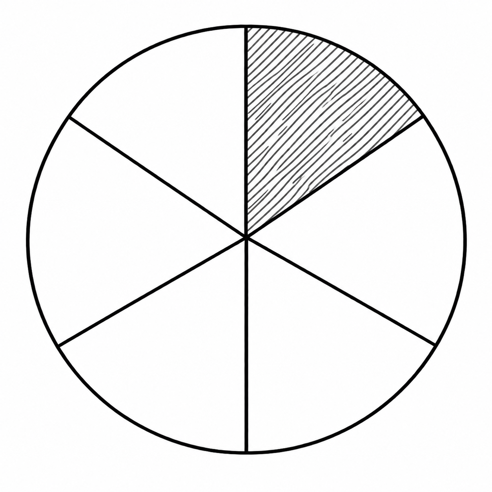
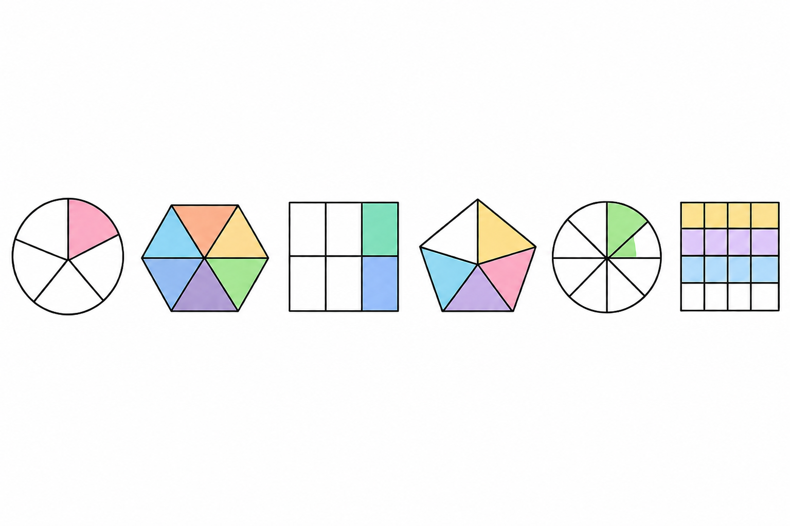

------------------------------------------------------------------------

## Η Έννοια του Κλάσματος

### Κατανόηση του κλάσματος μέσω του χωρισμού του «όλου» σε μέρη

::: {style="background-color: #b5b1de; border: 2px solid #2f3e50; color: #25188a; padding: 15px; border-radius: 5px;"}
**Θεωρία και Ορισμοί**

- **Ετυμολογία:** Η λέξη «κλάσμα» προέρχεται από το αρχαίο ελληνικό ρήμα «κλάω» ή «κλω», που σημαίνει κόβω ή τεμαχίζω κάτι.

- **Έννοια:** Το κλάσμα δηλώνει ένα κομμάτι ή μέρος ενός πράγματος.
  Στα Μαθηματικά, το ολόκληρο («όλον») χωρίζεται σε **ίσα μέρη**.

{width="300"}\
Το οκτάγωνο είναι χωρισμένο σε 8 ίσα τρίγωνα, τα 3 στιγματισμένα μέρη είναι τα $\dfrac{3}{8}$ όλου του πολυγώνου

- Ο **παρονομαστής** δείχνει σε πόσα ίσα μέρη χωρίσαμε τη μονάδα.

- Ο **αριθμητής** δείχνει πόσα από αυτά τα μέρη πήραμε.

- Η **κλασματική γραμμή** συμβολίζει την πράξη της διαίρεσης.

- **Περιορισμός:** Ο παρονομαστής δεν μπορεί ποτέ να είναι μηδέν (0).

- **Κλασματική μονάδα:** Είναι το κλάσμα που έχει αριθμητή τη μονάδα (1), π.χ.
  $\dfrac{1}{ν}$ , (όπου $\nu \neq 0$) και εκφράζει το ένα από τα $\nu$ ίσα μέρη στα οποία χωρίστηκε μια ποσότητα.

- **Κλασματικός Αριθμός:** Είναι το άθροισμα πολλών κλασματικών μονάδων.
  Συμβολίζεται ως $\dfrac{κ}{ν}$, όπου $\kappa$ και $\nu$ είναι φυσικοί αριθμοί με $\nu \neq 0$.

- **Όροι του κλάσματος:**

  - **Παρονομαστής (**$\nu$): Δείχνει σε πόσα ίσα μέρη χωρίσαμε το ολόκληρο.
  - **Αριθμητής (**$\kappa$): Δείχνει πόσα από αυτά τα ίσα μέρη πήραμε.
  - **Γραμμή κλάσματος:** Η γραμμή που χωρίζει τους δύο όρους.

{width="250"} Στο σχήμα το κλάσμα μας $\dfrac{3}{8}$ αποτελείται από τον **αριθμητή** $3$ (πάνω), τον **παρονομαστή** $8$ (κάτω) και την **κλασματική γραμμή**.\

**Ιδιότητες**

- Κάθε κλάσμα $\dfrac{κ}{ν}$ μπορεί να γραφεί ως γινόμενο: $\kappa \cdot \dfrac{1}{\nu}$.

- Το ολόκληρο εκφράζεται όταν ο αριθμητής είναι ίσος με τον παρονομαστή ($\dfrac{ν}{ν} = 1$).
:::

**Παραδείγματα**

1.  Μια πίτσα χωρίζεται σε 8 ίσα κομμάτια· αν κάποιος φάει το 1, έχει φάει το $\dfrac{1}{8}$ της πίτσας.

2.  Μια σοκολάτα χωρισμένη σε 8 ίσα τετραγωνίδια.

3.  Ένα τετράγωνο χωρισμένο σε 4 ίσα μέρη, όπου το καθένα είναι το $\dfrac{1}{4}$ του όλου.

4.  Ένα ευθύγραμμο τμήμα ΑΒ που χωρίζεται σε 4 ίσα μέρη.

5.  Ένας κύκλος χωρισμένος σε 6 ίσα τμήματα.

6.  Ποιος είναι ο αριθμητής και ποιος ο παρονομαστής στο κλάσμα $\dfrac{4}{6}$;

**Λύση:** Αριθμητής είναι το 4 και παρονομαστής το 6.

7.  Γράψτε τη διαίρεση $3:8$ ως κλάσμα.

**Λύση:** Το πηλίκο της διαίρεσης $3:8$ εκφράζεται ως το κλάσμα $\dfrac{3}{8}$.

8.  Αν χωρίσουμε μια πίτσα σε 5 ίσα μέρη και φάμε το 1, τι μέρος της πίτσας φάγαμε;

**Λύση:** Ο παρονομαστής είναι 5 (συνολικά μέρη) και ο αριθμητής 1 (μέρος που πήραμε), άρα φάγαμε το $\dfrac{1}{5}$ της πίτσας.

9.  Ποιος φυσικός αριθμός είναι ίσος με το κλάσμα $\dfrac{24}{6}$;

**Λύση:** $24 : 6 = 4$.
Άρα το κλάσμα ισούται με τον φυσικό αριθμό 4.

10. Υπολογίστε το $\dfrac{1}{5}$ του 20.

**Λύση:** Πολλαπλασιάζουμε το $\dfrac{1}{5}$ με το 20: $\dfrac{1 \cdot 20}{5} = \dfrac{20}{5} = 4$.

**Ασκήσεις**

1.  Γράψτε το κλάσμα που εκφράζει το χρωματισμένο μέρος ενός κύκλου χωρισμένου σε 6 ίσα μέρη.
\
    {width="200"}
2.  Ποιο κλάσμα ενός τετραγώνου αποτελεί ένα μέρος του αν χωριστεί σε 4 ίσα τμήματα;
3.  Σε μια τάξη 28 μαθητών, οι 4 είναι απόντες. Τι κλάσμα των μαθητών είναι οι απόντες;
4.  Αν χωρίσουμε ένα μέγεθος σε 10 ίσα μέρη, πώς ονομάζεται το ένα μέρος;
5.  Ποιος είναι ο αριθμητής και ποιος ο παρονομαστής στο κλάσμα $\dfrac{3}{5}$;
6.  Σχεδιάστε ένα ορθογώνιο και χρωματίστε τα $\dfrac{3}{4}$ αυτού.
7.  Γράψτε με μορφή κλάσματος την κλασματική μονάδα «ένα έβδομο».
8.  Από ποια κλασματική μονάδα αποτελείται το κλάσμα $\dfrac{5}{8}$;.
9.  Πόσες κλασματικές μονάδες $\dfrac{1}{4}$ χρειάζονται για να σχηματίσουν τη μονάδα;.
10. Αν πάρουμε 5 τμήματα από μια ποσότητα χωρισμένη σε 7 ίσα μέρη, ποιο κλάσμα προκύπτει;.

------------------------------------------------------------------------

### Κατανόηση του κλάσματος ως σχέση μεταξύ ομοειδών ποσοτήτων

::: {style="background-color: #b5b1de; border: 2px solid #2f3e50; color: #25188a; padding: 15px; border-radius: 5px;"}
**Θεωρία και Ορισμοί**

- **Πηλίκο Διαίρεσης:** Κάθε κλάσμα $\dfrac{\kappa}{\nu}$ παριστάνει το ακριβές πηλίκο της διαίρεσης του αριθμητή διά του παρονομαστή ($\kappa:\nu = \dfrac{\kappa}{\nu}$).

- **Λόγος (Ratio):** Το πηλίκο των μέτρων δύο ομοειδών μεγεθών (π.χ. δύο μηκών) ονομάζεται λόγος.

- **Ρητός Αριθμός:** Κάθε αριθμός που μπορεί να γραφεί ως πηλίκο δύο ακεραίων (με διαιρέτη $\neq 0$).

**Ιδιότητες**

- **Σύγκριση με τη μονάδα:**

- Αν Αριθμητής \< Παρονομαστή, το κλάσμα είναι μικρότερο της μονάδας (**γνήσιο**).

- Αν Αριθμητής \> Παρονομαστή, το κλάσμα είναι μεγαλύτερο της μονάδας (**καταχρηστικό**).

- Κάθε φυσικός αριθμός μπορεί να θεωρηθεί κλάσμα με παρονομαστή το 1.

- Αν πολλαπλασιάσουμε ή διαιρέσουμε και τους δύο όρους κλάσματος με τον ίδιο αριθμό ($\neq 0$), προκύπτει **ισοδύναμο** κλάσμα.
:::

**Παραδείγματα**

1.  Ο λόγος του ύψους μιας γυναίκας (8cm σε φωτό) προς το πραγματικό (192cm) είναι $\dfrac{8}{192} = \dfrac{1}{24}$.
2.  Η διαίρεση 3:8 εκφράζεται από το κλάσμα $\dfrac{3}{8}$.
3.  Το βάρος ενός ατόμου 40kg προς ένα άλλο 45kg έχει λόγο $\dfrac{40}{45} = \dfrac{8}{9}$.
4.  Ο αριθμός 6 γράφεται ως $\dfrac{6}{1}$.
5.  Σύγκριση τμημάτων: αν το τμήμα Β αποτελείται από 8 μονάδες Α και το Γ από 13 μονάδες Α, ο λόγος Β/Γ είναι $\dfrac{8}{13}$.

**Ασκήσεις**

1.  Βρείτε τον λόγο των ευθυγράμμων τμημάτων ΑΒ=4cm και ΓΔ=1cm.

2.  Είναι το κλάσμα $\dfrac{8}{3}$ μεγαλύτερο ή μικρότερο της μονάδας;.

3.  Γράψτε τον αριθμό 15 σε μορφή κλάσματος.

4.  Ποια διαίρεση παριστάνει το κλάσμα $\dfrac{2}{21}$;.

5.  Βρείτε τον λόγο των εμβαδών δύο τετραγώνων με πλευρές 3m και 5m.

6.  Χαρακτηρίστε το κλάσμα $\dfrac{45}{54}$ ως γνήσιο ή καταχρηστικό.

7.  Βρείτε τον λόγο των υψών δύο παιδιών, 180cm και 160cm.

8.  Γράψτε ως κλάσματα τις διαιρέσεις: $9:10$, $45:68$, $132:234$.

9.  Ποια διαίρεση παριστάνει το κλάσμα $\dfrac{5}{23}$ και ποια το $\dfrac{18}{8}$;

10. Μια οικογένεια έχει 6 μέλη (2 γονείς, 4 παιδιά).
    Τι κλάσμα του συνόλου είναι τα παιδιά;

11. Στην ίδια οικογένεια, τι κλάσμα του συνόλου είναι οι ενήλικες;

12. Βρείτε με ποιον φυσικό αριθμό είναι ίσα τα κλάσματα: $\dfrac{12}{2}, \dfrac{30}{5}, \dfrac{8}{2}$.

13. Στο κλάσμα $\dfrac{x}{x-3}$, ποιον περιορισμό πρέπει να βάλουμε για τον παρονομαστή;

14. Αν ο αριθμητής ενός κλάσματος είναι 0, με τι ισούται το κλάσμα;

15. Γράψτε τον φυσικό αριθμό 13 ως κλάσμα με παρονομαστή τη μονάδα.

16. Σχεδιάστε ένα ορθογώνιο, χωρίστε το σε 8 ίσα μέρη και σκιάστε τα $\dfrac{3}{8}$.

17. Τι ονομάζουμε όρους ενός κλάσματος;

------------------------------------------------------------------------

### Υπολογισμός μέρους από το όλο (Αναγωγή στη μονάδα)

::: {style="background-color: #b5b1de; border: 2px solid #2f3e50; color: #25188a; padding: 15px; border-radius: 5px;"}
**Θεωρία και Μέθοδος** Όταν γνωρίζουμε την τιμή του όλου και ζητάμε την τιμή ενός μέρους $\dfrac{κ}{ν}$:

1.  Διαιρούμε το όλο με τον παρονομαστή ($\nu$) για να βρούμε την τιμή της **κλασματικής μονάδας** ($\dfrac{1}{ν}$).
2.  Πολλαπλασιάζουμε το αποτέλεσμα με τον αριθμητή ($\kappa$).
:::

**Παραδείγματα**

1.  Η δεξαμενή νερού ενός χωριού, χωράει $40 \  m^3$. Ο πρόεδρος της κοινότητας το μέτρησε κάποια στιγμή και βρήκε ότι ήταν γεμάτη κατά τα $\dfrac{2}{5}$. Πόσα λίτρα νερό είχε η δεξαμενή.

**Λύση**

Για να υπολογίσουμε πόσα λίτρα νερό είχε η δεξαμενή, ακολουθούμε τα παρακάτω βήματα βασιζόμενοι στις μονάδες μέτρησης και τις μεθόδους υπολογισμού των πηγών:

**1. Μετατροπή των κυβικών μέτρων (**$m^3$) σε λίτρα (lt)

- Σύμφωνα με τις μονάδες μέτρησης όγκου, **1 κυβικό μέτρο (**$m^3$) ισούται με 1.000 κυβικά δεκατόμετρα ($dm^3$).

- Η μονάδα χωρητικότητας **λίτρο (lt) είναι ακριβώς ίση με 1 κυβικό δεκατόμετρο (**$dm^3$).

- Επομένως, **1** $m^3$ αντιστοιχεί σε 1.000 λίτρα.

- Άρα, η συνολική χωρητικότητα της δεξαμενής σε λίτρα είναι: $40 \times 1.000 = \mathbf{40.000}$ **λίτρα**.

**2. Υπολογισμός του μέρους (**$\dfrac{2}{5}$) από το όλο (40.000 λίτρα)

Για να βρούμε την ποσότητα του νερού, χρησιμοποιούμε τη μέθοδο της **αναγωγής στη μονάδα**:

- **Βρίσκουμε την τιμή της κλασματικής μονάδας (**$\dfrac{1}{5}$): Διαιρούμε τη συνολική χωρητικότητα με τον παρονομαστή (5).
  $40.000 : 5 = 8.000$ λίτρα.

- **Βρίσκουμε την τιμή του μέρους (**$\dfrac{2}{5}$): Πολλαπλασιάζουμε το αποτέλεσμα με τον αριθμητή (2).
  $8.000 \times 2 = 16.000$ λίτρα.

Εναλλακτικά, μπορούμε να πολλαπλασιάσουμε απευθείας τον αριθμό που εκφράζει το όλο με το κλάσμα: $40.000 \times \dfrac{2}{5} = 16.000$ λίτρα.

**Συμπέρασμα:**

Η δεξαμενή είχε **16.000 λίτρα** νερό.

2.  Πόσα λεπτά είναι τα $\dfrac{2}{5}$ της ώρας (60 λεπτά);

- $\dfrac{1}{5}$ της ώρας: $60 : 5 = 12$ λεπτά.
- $\dfrac{2}{5}$ της ώρας: $2 \cdot 12 = 24$ λεπτά.

3.  Βρείτε το μήκος του ΑΚ αν είναι τα $\dfrac{5}{8}$ του ΑΒ=32cm.

- $\dfrac{1}{8}$ του ΑΒ: $32 : 8 = 4cm$.
- $\dfrac{5}{8}$ του ΑΒ: $5 \cdot 4 = 20cm$.

4.  Βρείτε πόσα γραμμάρια είναι τα $\dfrac{3}{4}$ του κιλού (1000g).

- $\dfrac{1}{4}$ του kg: $1000 : 4 = 250g$.
- $\dfrac{3}{4}$ του kg: $3 \cdot 250 = 750g$.

**Ασκήσεις**

1.  Υπολογίστε τα $\dfrac{4}{5}$ των 1500 γραμμαρίων.
2.  Βρείτε τα $\dfrac{5}{8}$ των 2 κιλών (2000g).
3.  Πόσα ml είναι το $\dfrac{1}{15}$ ενός αναψυκτικού 330ml;.
4.  Ένας εργάτης παίρνει 880 δρχ. για $\dfrac{4}{5}$ της εργασίας. Πόσα θα πάρει για το $\dfrac{1}{5}$;
5.  Βρείτε τα $\dfrac{9}{10}$ των 5 κιλών σε γραμμάρια.
6.  Από 140 αυτοκίνητα, τα $\dfrac{2}{7}$ είναι λευκά. Πόσα είναι τα λευκά;
7.  Μια διαδρομή είναι 80km. Πόσα km είναι τα $\dfrac{3}{8}$ της διαδρομής;
8.  Πόσα λεπτά είναι τα $\dfrac{5}{6}$ της ώρας;
9.  Βρείτε τα $\dfrac{11}{13}$ του αριθμού 13.
10. Πόσα ευρώ είναι τα $\dfrac{3}{4}$ των 200€;

------------------------------------------------------------------------

### Υπολογισμός του όλου από την τιμή ενός μέρους του

::: {style="background-color: #b5b1de; border: 2px solid #2f3e50; color: #25188a; padding: 15px; border-radius: 5px;"}
**Θεωρία και Μέθοδος**

Όταν γνωρίζουμε την τιμή ενός μέρους $\dfrac{κ}{ν}$ και ζητάμε το «όλον»:

1.  Διαιρούμε τη γνωστή τιμή με τον αριθμητή ($\kappa$) για να βρούμε την τιμή της κλασματικής μονάδας ($\dfrac{1}{ν}$).
2.  Πολλαπλασιάζουμε το αποτέλεσμα με τον παρονομαστή ($\nu$) για να βρούμε το όλο ($\dfrac{ν}{ν}$).
:::

**Παραδείγματα**

1.  Τα $\dfrac{2}{3}$ μιας δεξαμενής περιέχουν 1440kg λάδι. Πόσο λάδι χωράει όλη η δεξαμενή;

- $\dfrac{1}{3}$ της δεξαμενής: $1440 : 2 = 720kg$.

- Όλη η δεξαμενή ($\dfrac{3}{3}$): $3 \cdot 720 = 2160kg$.

2.  Οι μαθήτριες ενός σχολείου είναι τα $\dfrac{5}{9}$ του συνόλου. Αν οι μαθήτριες είναι 85, πόσα είναι όλα τα παιδιά;

- $\dfrac{1}{9}$ των παιδιών: $85 : 5 = 17$ παιδιά.
- Όλα τα παιδιά ($\dfrac{9}{9}$): $9 \cdot 17 = 153$ παιδιά.

3.  Από μια τούρτα περίσσεψαν 2 κομμάτια που είναι τα $\dfrac{2}{7}$ της τούρτας. Πόσα ήταν αρχικά όλα τα κομμάτια;

- $\dfrac{1}{7}$ της τούρτας: $2 : 2 = 1$ κομμάτι.
- Όλη η τούρτα ($\dfrac{7}{7}$): $7 \cdot 1 = 7$ κομμάτια.

4.  Αν το $\dfrac{1}{5}$ ενός κιλού καρύδια είναι 14 καρύδια, πόσα καρύδια έχει όλο το κιλό;

- $\dfrac{5}{5}$ του κιλού: $5 \cdot 14 = 70$ καρύδια.

5.  Βρείτε τον αριθμό του οποίου τα $\dfrac{4}{7}$ είναι το $29/5$.

- $\dfrac{1}{7}$ του αριθμού: $\dfrac{29}{5} : 4 = \dfrac{29}{20}$.
- Όλος ο αριθμός: $7 \cdot \dfrac{29}{20} = \dfrac{203}{20}$.

**Ασκήσεις**

1.  Αν τα $\dfrac{3}{4}$ ενός ποσού είναι 1500€, ποιο είναι το συνολικό ποσό;.
2.  Τα $\dfrac{2}{7}$ μιας διαδρομής είναι 14km. Πόσο είναι όλη η διαδρομή;.
3.  Βρείτε τον αριθμό του οποίου το $\dfrac{1}{3}$ είναι 40.
4.  Αν τα $\dfrac{2}{9}$ του ύψους είναι 40cm, ποιο είναι το συνολικό ύψος;.
5.  Αν τα $\dfrac{4}{7}$ ενός ποσού είναι 800€, ποιο είναι το συνολικό ποσό;.
6.  Βρείτε το συνολικό βάρος αν τα $\dfrac{5}{8}$ είναι 25kg.
7.  Αν τα $\dfrac{10}{12}$ ενός τμήματος είναι 5cm, ποιο είναι το μήκος του τμήματος;.
8.  Βρείτε την αξία ενός έργου αν το $\dfrac{1}{3}$ κοστίζει 1260 δρχ..
9.  Αν τα $\dfrac{3}{5}$ μιας δεξαμενής είναι 105 λίτρα, πόσο χωράει όλη;.
10. Βρείτε τον αριθμό του οποίου τα $\dfrac{2}{5}$ είναι 18.
11. Αν τα $\dfrac{5}{8}$ μιας ποσότητας είναι 12, υπολογίστε τα $\dfrac{3}{8}$, τα $\dfrac{7}{8}$ και όλη την ποσότητα.
12. Για τα παρακάτω σχήματα γράψε το κλάσμα που αντιστοιχεί στο γραμμοσκιασμένο μέρος.\
    {width="500"}

------------------------------------------------------------------------
