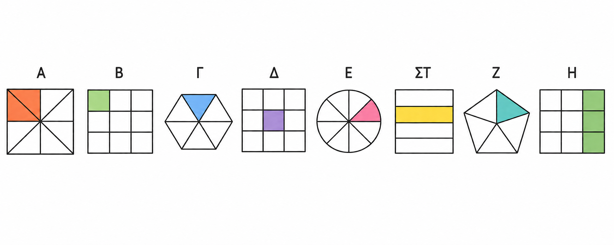

------------------------------------------------------------------------

## Σύγκριση κλασμάτων

### Σύγκριση κλασμάτων

::: {style="background-color: #b5b1de; border: 2px solid #2f3e50; color: #25188a; padding: 15px; border-radius: 5px;"}
**Θεωρία, Ορισμοί και Ιδιότητες**

- **Ορισμός Σύγκρισης:** Συγκρίνω δύο κλάσματα σημαίνει ότι εξετάζω αν εκφράζουν το ίδιο τμήμα ενός μεγέθους (ίσα) ή αν το ένα εκφράζει μεγαλύτερο τμήμα από το άλλο.

- **Κανόνας Ομώνυμων:** Από δύο **ομώνυμα** κλάσματα (ίδιος παρονομαστής), μεγαλύτερο είναι εκείνο που έχει τον **μεγαλύτερο αριθμητή**.

- **Κανόνας Ίσων Αριθμητών:** Από δύο κλάσματα με τον **ίδιο αριθμητή**, μεγαλύτερο είναι εκείνο που έχει τον **μικρότερο παρονομαστή** (γιατί το όλον χωρίστηκε σε λιγότερα, άρα μεγαλύτερα, μέρη).

- **Κανόνας Ετερωνύμων:** Για να συγκρίνουμε ετερώνυμα κλάσματα, τα μετατρέπουμε πρώτα σε **ομώνυμα** (με ΕΚΠ) και μετά συγκρίνουμε τους αριθμητές τους.

- **Σύγκριση με τη Μονάδα:**

  - **Ίσο με 1:** Αριθμητής = Παρονομαστής.
  - **Γνήσιο (\<1):** Αριθμητής \< Παρονομαστής.
  - **Καταχρηστικό (\>1):** Αριθμητής \> Παρονομαστής.

- **Χιαστί Ιδιότητα:** Το κλάσμα $\frac{\alpha}{\beta}$ είναι μεγαλύτερο από το $\frac{\gamma}{\delta}$ αν και μόνο αν $\alpha \cdot \delta > \beta \cdot \gamma$.
:::

**Παραδείγματα**

1.  **Ομώνυμα:** $\dfrac{9}{13} > \dfrac{5}{13}$ επειδή $9 > 5$.
2.  **Ίσοι Αριθμητές:** $\dfrac{13}{9} < \dfrac{13}{5}$ επειδή $9 > 5$.
3.  **Ετερώνυμα:** Για τα $\dfrac{7}{12}$ και $\dfrac{5}{16}$, το $ΕΚΠ(12, 16)=48$. Γίνονται $\dfrac{28}{48}$ και $\dfrac{15}{48}$. Άρα $\dfrac{7}{12} > \dfrac{5}{16}$.
4.  **Με τη Μονάδα:** $\dfrac{5}{8} < 1$ (γνήσιο), ενώ $\dfrac{12}{11} > 1$ (καταχρηστικό).
5.  **Χιαστί:** $\dfrac{5}{8}$ και $\dfrac{4}{9} \rightarrow 5 \cdot 9 = 45$ και $8 \cdot 4 = 32$. Επειδή $45 > 32$, τότε $\dfrac{5}{8} > \dfrac{4}{9}$.

**Ασκήσεις**

1.  Συγκρίνετε τα κλάσματα $\dfrac{3}{7}$ και $\dfrac{5}{7}$.
2.  Συγκρίνετε τα κλάσματα $\dfrac{3}{5}$ και $\dfrac{3}{9}$.
3.  Βάλτε σε φθίνουσα σειρά τα: $\dfrac{31}{10}, \dfrac{31}{14}, \dfrac{31}{11}, \dfrac{31}{13}, \dfrac{31}{12}$.
4.  Συγκρίνετε με τη μονάδα τα κλάσματα $\dfrac{5}{8}, \dfrac{12}{11}, \dfrac{16}{16}, \dfrac{109}{120}$.
5.  Τοποθετήστε σε αύξουσα σειρά τα: $\dfrac{3}{5}, \dfrac{8}{15}, \dfrac{5}{10}, \dfrac{20}{15}, \dfrac{7}{5}$.
6.  Βρείτε αν το κλάσμα $\dfrac{8}{9}$ είναι μεγαλύτερο ή μικρότερο από το 1.
7.  Συγκρίνετε τα $\dfrac{4}{5}$ και $\dfrac{8}{12}$.
8.  Τοποθετήστε στην ευθεία των αριθμών τα κλάσματα $\dfrac{1}{2}, \dfrac{3}{2}, \dfrac{5}{2}$.
9.  Βρείτε τον φυσικό αριθμό που βρίσκεται ανάμεσα στα $\dfrac{12}{13}$ και $\dfrac{14}{13}$.
10. Συγκρίνετε τα κλάσματα $\dfrac{188}{189}$ και $\dfrac{189}{188}$.
11. Διατάξτε από το μικρότερο στο μεγαλύτερο τα: $\dfrac{5}{6}, \dfrac{11}{12}, \dfrac{17}{18}, \dfrac{8}{9}$.
12. Χρησιμοποιήστε το σύμβολο $>$ ή $<$ μεταξύ των $\dfrac{8-5}{7 \cdot 2}$ και $\dfrac{3 \cdot 5}{2 \cdot 4 + 3}$.

------------------------------------------------------------------------

### Επίλυση σχετικών προβλημάτων

::: {style="background-color: #b5b1de; border: 2px solid #2f3e50; color: #25188a; padding: 15px; border-radius: 5px;"}
**Θεωρία και Μέθοδος**

Η επίλυση προβλημάτων με σύγκριση κλασμάτων απαιτεί τη μετατροπή διαφορετικών δεδομένων σε μια **κοινή βάση** (συνήθως ομώνυμα κλάσματα) ώστε να είναι δυνατή η αξιολόγησή τους.
Συχνά χρησιμοποιούμε τη μέθοδο της **αναγωγής στη μονάδα** ή τη **χιαστί ιδιότητα** για να ελέγξουμε ισότητες σε προβλήματα αναλογιών.
:::

**Παραδείγματα**

1.  **Διαχείριση Χρόνου:** Αν ένας μαθητής κοιμάται $\dfrac{8}{24}$ της ημέρας, είναι στο σχολείο $\dfrac{6}{24}$ και διαβάζει $\dfrac{4}{24}$, η σειρά δραστηριοτήτων είναι: Ύπνος \> Σχολείο \> Διάβασμα.
2.  **Οδική Ασφάλεια:** Σε δύο δρόμους καταγράφηκαν παραβάτες. Στον δρόμο Α: $\dfrac{140}{5000}$ και στον Β: $\dfrac{220}{7500}$. Με μετατροπή σε ομώνυμα ($\dfrac{420}{15000}$ έναντι $\dfrac{440}{15000}$), ο δρόμος Α έχει λιγότερους παραβάτες.
3.  **Πυκνότητα:** Για να βρούμε ένα κλάσμα ανάμεσα στα $\dfrac{2}{5}$ και $\dfrac{3}{5}$, τα κάνουμε $\dfrac{4}{10}$ και $\dfrac{6}{10}$. Το $\dfrac{5}{10}$ βρίσκεται ανάμεσά τους.
4.  **Χωρητικότητα:** Αν δύο όμοια αεροπλάνα είναι γεμάτα κατά $\dfrac{28}{32}$ και $\dfrac{98}{112}$ αντίστοιχα, ελέγχουμε με χιαστί γινόμενα ($28 \cdot 112 = 3136$) ότι μεταφέρουν τον ίδιο αριθμό επιβατών.
5.  **Κράματα:** Σε κράμα 25,5 kg, τα $\dfrac{4}{10}$ είναι χαλκός και τα $\dfrac{34}{100}$ κασσίτερος. Συγκρίνοντας ($\dfrac{40}{100}>\dfrac{34}{100}$), ο χαλκός είναι περισσότερος.

**Ασκήσεις**

1.  Ποιος δρόμος έχει περισσότερους νομοταγείς πολίτες αν οι παραβάτες είναι $\dfrac{140}{5000}$ (Δρόμος Α) και $\dfrac{220}{7500}$ (Δρόμος Β);
2.  Ένας εργάτης παίρνει 880 δρχ. για τα $\dfrac{4}{5}$ της δουλειάς. Πόσα θα πάρει για το $\dfrac{1}{5}$ και ποιο ποσό είναι μεγαλύτερο;
3.  Αν ο Κώστας πιει τα $\dfrac{2}{3}$ ενός αναψυκτικού $1,5$ λίτρου, πόσο νερό μένει σε σχέση με το αρχικό;
4.  Σε ένα σχολείο 252 μαθητών, τα $\dfrac{5}{9}$ είναι αγόρια. Είναι περισσότερα τα αγόρια ή τα κορίτσια;
5.  Δύο κάμερες καταγράφουν παραβάτες. Η μία $\dfrac{3}{100}$ και η άλλη $\dfrac{5}{150}$. Ποια κάμερα δείχνει μεγαλύτερο ποσοστό παραβατικότητας;
6.  Συγκρίνετε τα ύψη δύο παιδιών (180cm και 160cm) χρησιμοποιώντας τον λόγο των υψών τους.
7.  Ένας αγρότης πούλησε τα $\dfrac{2}{5}$ της σοδειάς του. Του έμεινε περισσότερη ή λιγότερη από τη μισή;
8.  Αν τα $\dfrac{3}{4}$ μιας δεξαμενής είναι $1500$ λίτρα, πόση είναι η συνολική χωρητικότητα και πώς συγκρίνεται με τα $2000$ λίτρα;
9.  Μια διαδρομή είναι 80km. Ποιο είναι μεγαλύτερο: τα $\dfrac{3}{8}$ της διαδρομής ή τα 40km;
10. Στο παρακάτω σχήμα να βρείτε για κάθε μια περίπτωση το κλάσμα που αντιστοιχεί και μετά να τα βάλετε σε αύξουσα σειρά.\
    
11. Ανάμεσα σε ποιούς διαδοχικούς φυσικούς μπορείτε να τοποθετήσετε τα κλάσματα:
  - α. $\dfrac{2}{5}$
  - β.  $\dfrac{5}{2}$
  - γ,  $\dfrac{12}{5}$
  - δ.  $\dfrac{8}{3}$
  - ε.  $\dfrac{20}{6}$
  - στ. $\dfrac{200}{85}$
  - ζ.  $\dfrac{825}{100}$
  
  Τοποθετήστε τα κλάσματα (κατά προσεγγιση) σε άξονα.

------------------------------------------------------------------------
### Ασκήσεων .... συνέχεια

**Λυμένες Ασκήσεις**

1.  **Ερώτηση:** Συγκρίνετε τα κλάσματα $\dfrac{2}{5}$ και $\dfrac{4}{5}$.

**Λύση:** Είναι ομώνυμα.
Επειδή $4 > 2$, ισχύει $\dfrac{4}{5} > \dfrac{2}{5}$.

2.  **Ερώτηση:** Συγκρίνετε τα $\dfrac{3}{7}$ και $\dfrac{3}{5}$.

**Λύση:** Έχουν ίδιο αριθμητή.
Μεγαλύτερο είναι αυτό με τον μικρότερο παρονομαστή, άρα $\dfrac{3}{5} > \dfrac{3}{7}$.

3.  **Ερώτηση:** Συγκρίνετε το $\dfrac{5}{6}$ με το $\dfrac{13}{15}$.

**Λύση:** Τα κάνουμε ομώνυμα με ΕΚΠ(6,15)=30.
$\dfrac{5}{6} = \dfrac{25}{30}$ και $\dfrac{13}{15} = \dfrac{26}{30}$.
Επειδή $\dfrac{25}{30} < \dfrac{26}{30}$, τότε $\dfrac{5}{6} < \dfrac{13}{15}$.

4.  **Ερώτηση:** Το κλάσμα $\dfrac{3}{4}$ είναι μεγαλύτερο ή μικρότερο από το 1;

**Λύση:** Επειδή ο αριθμητής (3) είναι μικρότερος από τον παρονομαστή (4), το κλάσμα είναι μικρότερο από το 1 ($\dfrac{3}{4} < 1$).

5.  **Ερώτηση:** Συγκρίνετε το $\dfrac{8}{7}$ με τη μονάδα.

**Λύση:** $8 > 7$, άρα $\dfrac{8}{7} > 1$.

\

**Άλυτες Ασκήσεις**

1.  Βάλτε σε αύξουσα σειρά τα κλάσματα: $\dfrac{4}{9}, \dfrac{4}{7}, \dfrac{4}{11}, \dfrac{4}{5}, \dfrac{4}{3}$.

2.  Συγκρίνετε τα κλάσματα: $\dfrac{6}{31}$ και $\dfrac{6}{7}$, $\dfrac{8}{7}$ και $\dfrac{4}{7}$.

3.  Ποιο είναι μεγαλύτερο: το $\dfrac{7}{8}$ ή το $\dfrac{4}{9}$; (Κάντε τα ομώνυμα).

4.  Συγκρίνετε με το 1 τα κλάσματα: $\dfrac{9}{9}, \dfrac{116}{253}, \dfrac{85}{48}$.

5.  Βρείτε ένα κλάσμα ανάμεσα στο $\dfrac{1}{9}$ και το $\dfrac{2}{9}$.

6.  Αν ο Νίκος έφαγε τα $\dfrac{4}{6}$ μιας πίτσας και ο Πέτρος τα $\dfrac{5}{6}$, ποιος έφαγε περισσότερο;

7.  Ταξινομήστε από το μικρότερο στο μεγαλύτερο: $\dfrac{7}{5}, \dfrac{2}{5}, \dfrac{1}{5}, \dfrac{9}{5}$.

8.  Είναι το $\dfrac{17}{36}$ μεγαλύτερο ή μικρότερο από το $\dfrac{3}{4}$;

9.  Πώς ονομάζεται το κλάσμα του οποίου ο αριθμητής είναι μεγαλύτερος από τον παρονομαστή;

10. Συγκρίνετε τα κλάσματα $\dfrac{2013}{2014}$ και $\dfrac{2015}{2014}$.
