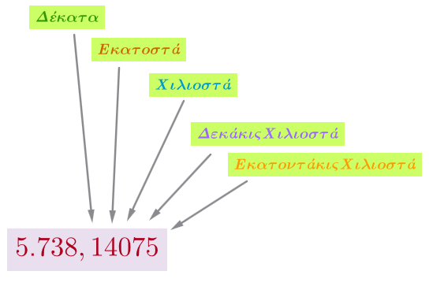
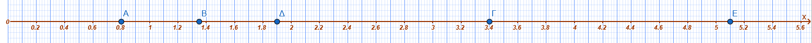
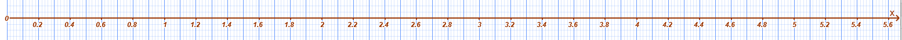

------------------------------------------------------------------------

## Δεκαδικά κλάσματα - Δεκαδικοί αριθμοί - Διάταξη δεκαδικών αριθμών - Στρογγυλοποίηση

### **Μετατροπή Δεκαδικού Κλάσματος σε Δεκαδικό Αριθμό και Αντιστρόφως**

::: {style="background-color: #b5b1de; border: 2px solid #2f3e50; color: #25188a; padding: 15px; border-radius: 5px;"}
**Θεωρία - Ορισμοί - Ιδιότητες**

- **Δεκαδικό κλάσμα** ονομάζεται το κλάσμα που έχει ως παρονομαστή μια δύναμη του 10 (10, 100, 1.000 κ.λπ.).

$$\frac{3}{10}, \frac{14}{100}, \frac{5}{1000}, \frac{567}{10.000}, \cdots$$

- Για να μετατρέψουμε ένα δεκαδικό κλάσμα σε **δεκαδικό αριθμό**, γράφουμε τον αριθμητή και χωρίζουμε με υποδιαστολή από τα δεξιά προς τα αριστερά τόσα ψηφία όσα είναι τα μηδενικά του παρονομαστή.

$$\frac{8}{100}=0,08\ \ \ \ \ ,\frac{56}{10}=5,6\ \ \ \ \ , \frac{72}{1000}=0,072 \ \ \ \ \cdots $$

- Για να μετατρέψουμε έναν δεκαδικό αριθμό σε **δεκαδικό κλάσμα**, θέτουμε ως αριθμητή τον αριθμό χωρίς την υποδιαστολή και ως παρονομαστή τη μονάδα με τόσα μηδενικά όσα ήταν τα δεκαδικά ψηφία του αριθμού.
:::

**Παραδείγματα**

1.  $\dfrac{3}{10} = 0,3$
2.  $\dfrac{825}{100} = 8,25$
3.  $\dfrac{18}{1000} = 0,018$
4.  $2,35 = \dfrac{235}{100}$
5.  $0,007 = \dfrac{7}{1000}$
6.  $\dfrac{5}{10} = 0,5$.
7.  $\dfrac{12}{100} = 0,12$.
8.  $\dfrac{345}{1.000} = 0,345$.
9.  $\dfrac{7}{100} = 0,07$.
10. $\dfrac{314}{100} = 3,14$.
11. $0,348 = \dfrac{348}{1.000}$.
12. $2,35 = \dfrac{235}{100}$.
13. $\dfrac{10}{8} = 10 : 8 = 1,25 = \dfrac{125}{100}$.

**Ασκήσεις**

*Μετατρέψτε σε δεκαδικούς αριθμούς:*

1.  $\dfrac{58}{10}$,
2.  $\dfrac{3}{100}$,
3.  $\dfrac{5025}{100}$,
4.  $\dfrac{1024}{1000}$,
5.  $\dfrac{24}{10}$,
6.  $\dfrac{142}{1000}$,
7.  $\dfrac{2}{100}$,
8.  $\dfrac{2007}{10000}$,
9.  $\dfrac{5}{10^5}$.

*Μετατρέψτε σε δεκαδικά κλάσματα:*

10. $3,5$,

11. $45,25$,

12. $3,004$,

13. $102,4$,

14. $77,28$,

15. $0,027$.

16. Μετάτρεψε το $\dfrac{58}{10}$ σε δεκαδικό.

17. Μετάτρεψε το $\dfrac{3}{100}$ σε δεκαδικό.

18. Μετάτρεψε το $\dfrac{1.024}{1.000}$ σε δεκαδικό.

19. Γράψε το $3,5$ ως δεκαδικό κλάσμα.

20. Γράψε το $0,004$ ως δεκαδικό κλάσμα.

------------------------------------------------------------------------

### **Οι Δεκαδικοί Αριθμοί ως Αποτέλεσμα Μετρήσεων**

::: {style="background-color: #b5b1de; border: 2px solid #2f3e50; color: #25188a; padding: 15px; border-radius: 5px;"}
**Θεωρία - Ορισμοί - Ιδιότητες**

- Σε πολλές μετρήσεις οι φυσικοί αριθμοί δεν επαρκούν για να εκφράσουν το αποτέλεσμα με ακρίβεια, γι' αυτό χρησιμοποιούμε τους δεκαδικούς.

- Τα μεγέθη (μήκος, βάρος, χρόνος) μετρούνται με μονάδες που έχουν **υποδιαιρέσεις** βασισμένες στο δεκαδικό σύστημα (π.χ. $1 cm = 0,01 m$).
:::

**Παραδείγματα**

1.  Μήκος $1,68 m$ σημαίνει $1$ μέτρο και $68$ εκατοστά.
2.  $50 cm = 0,5 m$.
3.  $1 dm = 0,1 m$.
4.  $1 mm = 0,001 m$.
5.  Βάρος $1.020 kg$ μπορεί να εκφραστεί ως $1,02$ τόνοι.

**Ασκήσεις**

*Μετατρέψτε σε μέτρα (m):*

1.  $27 km$,
2.  $59 hm$,
3.  $2704 hm$,
4.  $4763 dam$,
5.  $80 dm$,
6.  $1300 dm$,
7.  $5000 dm$.

*Μετατρέψτε τις παρακάτω μονάδες:*

8.  $7 mm$ σε $\mu$,
9.  $6 cm$ σε $\mu$,
10. $52 \mu$ σε $A$,
11. $3 cm$ σε $A$.
12. Εκφράστε σε $km$ την απόσταση $54.702 m$.
13. Εκφράστε σε $km$ τα $8.760 dam$.
14. Πόσα $ml$ είναι τα $0,25 lt$;
15. Πόσα $dm$ είναι τα $50 cm$;

------------------------------------------------------------------------

### **Η Αξία των Ψηφίων ενός Δεκαδικού Αριθμού**

::: {style="background-color: #b5b1de; border: 2px solid #2f3e50; color: #25188a; padding: 15px; border-radius: 5px;"}
**Θεωρία - Ορισμοί - Ιδιότητες**

- Κάθε δεκαδικός αποτελείται από το **ακέραιο μέρος** (αριστερά της υποδιαστολής) και το **δεκαδικό μέρος** (δεξιά της υποδιαστολής).

- Οι θέσεις στο δεκαδικό μέρος είναι: **δέκατα** (1η), **εκατοστά** (2η), **χιλιοστά** (3η), **δεκάκις χιλιοστά** (4η) κ.λπ..

- Κάθε ψηφίο έχει δεκαπλάσια αξία από το ψηφίο που βρίσκεται αμέσως δεξιά του.
:::

**Παραδείγματα**

1.  Στο $73,324$: $7$ δεκάδες, $3$ μονάδες, $3$ δέκατα, $2$ εκατοστά, $4$ χιλιοστά.
2.  Στο $25,3764$: Το $7$ είναι εκατοστά.
3.  $0,008$: Το $8$ είναι χιλιοστά.
4.  $6,75 = 6 + \dfrac{7}{10} + \dfrac{5}{100}$.
5.  $2,74 = 2 + \dfrac{7}{10} + \dfrac{4}{100}$.
6.  Στον $345,123$ το $1$ είναι δέκατα, το $2$ εκατοστά, το $3$ χιλιοστά.
7.  $1,3$ διαβάζεται: "ένα κόμμα τρία" ή "μία μονάδα και τρία δέκατα".
8.  Στον $5,8909$ το ψηφίο των χιλιοστών είναι το $0$.
9.  Στον $98,0005$ το ψηφίο των δεκάκις χιλιοστών είναι το $5$.
10. Ποια είναι η αξία του ψηφίου 7 στον αριθμό 4,75;

**Λύση:** Το 7 βρίσκεται στην πρώτη θέση δεξιά από την υποδιαστολή.
**Άρα:** 7 δέκατα (0,7).

6.  Ποια είναι η αξία του ψηφίου 3 στον αριθμό 12,453;

**Λύση:** Το 3 βρίσκεται στην τρίτη θέση δεξιά από την υποδιαστολή.
**Επομένως:** 3 χιλιοστά (0,003).

7.  Αναλύστε τον αριθμό 5,24 σε άθροισμα αξιών.

**Λύση:** Χωρίζουμε τις μονάδες, τα δέκατα και τα εκατοστά.
**Επομένως:** 5 + 0,2 + 0,04.

8.  Ποιο ψηφίο δείχνει τα εκατοστά στον αριθμό 0,891;

**Λύση:** Τα εκατοστά είναι η δεύτερη θέση μετά την υποδιαστολή.
**Άρα:** Το ψηφίο 9.

9.  Γράψτε με ψηφία τον αριθμό: "Μηδέν κόμμα πέντε χιλιοστά".

**Λύση:** Χρειαζόμαστε το 5 στην τρίτη δεκαδική θέση.
**Άρα:** 0,005.

**Ασκήσεις**

*Βρείτε την τάξη του ψηφίου 8 στους αριθμούς:*

1.  $805$,
2.  $580$,
3.  $5.080$,
4.  $80.500$,
5.  $5.008.000$.

*Προσδιορίστε τα ψηφία (δέκατα, εκατοστά κ.λπ.):*

6.  $5,8909$,
7.  $98,0005$,
8.  $456,8756$,
9.  $0,1003$.

*Γράψτε με ψηφία τους αριθμούς:*

10. $3$ δεκάδες, $7$ μονάδες, $4$ δέκατα, $6$ χιλιοστά.
11. $2$ μονάδες, $3$ εκατοστά, $9$ δεκάκις χιλιοστά.
12. $5$ δέκατα, $6$ χιλιοστά, $2$ εκατοντάκις χιλιοστά.
13. $27$ ακέραιος και $3$ χιλιοστά.
14. $107$ ακέραιος και $23$ εκατοντάκις χιλιοστά.
15. $7$ κόμμα $204$ δεκάκις εκατομμυριοστά.

*Λύστε*

1.  Ποια η αξία του $8$ στον αριθμό $456,8756$;.
2.  Πώς λέγεται το τέταρτο δεκαδικό ψηφίο μετά την υποδιαστολή;.
3.  Συμπλήρωσε: $175 cm = \dots dm$.
4.  Συμπλήρωσε: $4,9 m = \dots cm$.
5.  Συμπλήρωσε: $99,6 mm = \dots cm$.
6.  Πόσα δευτερόλεπτα έχει μία ώρα;.
7.  Πόσα $kg$ είναι ο ένας τόνος ($1 t$);.
8.  Πόσα $m^2$ είναι το $1$ στρέμμα;.
9.  Στον αριθμό $0,1768$ ποιο ψηφίο είναι στα εκατοστά;.
10. Γράψε ολογράφως τον αριθμό $14,085$.
11. Ποια είναι η αξία του ψηφίου **4** στον αριθμό **12,48**;
12. Στον αριθμό **6,732**, ποιο ψηφίο βρίσκεται στη θέση των **χιλιοστών**;
13. Ποια είναι η αξία του ψηφίου **9** στον αριθμό **0,09**;
14. Ανάλυσε τον αριθμό **8,15** σε άθροισμα (όπως η λυμένη άσκηση 7).
15. Ποιο είναι μεγαλύτερο: το **0,5** ή το **0,05**; Γιατί;
16. Γράψε τον αριθμό που έχει **3 μονάδες** και **8 εκατοστά**.
17. Ποια είναι η αξία του **0** στον αριθμό **4,02**;
18. Μετάτρεψε το κλάσμα **\$**\dfrac{7}{100} σε δεκαδικό αριθμό.
19. Ποια είναι η αξία του ψηφίου **2** στον αριθμό **25,3**; (Προσοχή: είναι πριν την υποδιαστολή).
20. Γράψε με λέξεις τον αριθμό **1,003**.

------------------------------------------------------------------------

### **Αντιστοίχιση Δεκαδικών με Σημεία της Ευθείας των Αριθμών**

::: {style="background-color: #b5b1de; border: 2px solid #2f3e50; color: #25188a; padding: 15px; border-radius: 5px;"}
**Θεωρία - Ορισμοί - Ιδιότητες**

- Για να τοποθετήσουμε δεκαδικούς στην ευθεία, χωρίζουμε το τμήμα μεταξύ των φυσικών αριθμών σε $10$ ίσα μέρη (για δέκατα) ή $100$ ίσα μέρη (για εκατοστά).

- Οι δεκαδικοί αριθμοί διατάσσονται πάνω στην ευθεία από τα αριστερά προς τα δεξιά κατά σειρά μεγέθους.
:::

**Παραδείγματα**

1.  Ο $0,8$ βρίσκεται μεταξύ $0$ και $1$, στο 8ο υποδιαίρετο τμήμα (δέκατο).
2.  Ο $1,35$ βρίσκεται μεταξύ $1$ και $2$, στο 35ο εκατοστό.
3.  Ο $3,4$ βρίσκεται μεταξύ $3$ και $4$.
4.  Ο $1,9$ βρίσκεται πολύ κοντά στο $2$.
5.  Ο $5,1$ βρίσκεται αμέσως μετά το $5$.\
    

**Ασκήσεις**

*Τοποθετήστε στην ευθεία των αριθμών:*

1.  $3,4$,
2.  $4,5$,
3.  $2,3$,
4.  $2,8$,
5.  $4,7$,
6.  $4,3$,
7.  $2,5$,
8.  $1,9$,
9.  $5,1$.
10. $1,2$,
11. $2,10$,
12. $2,3$,
13. $1,40$,
14. $3,2$,
15. $0,9$.\
    

------------------------------------------------------------------------

### **Σύγκριση Δεκαδικών Αριθμών**

::: {style="background-color: #b5b1de; border: 2px solid #2f3e50; color: #25188a; padding: 15px; border-radius: 5px;"}
**Θεωρία - Ορισμοί - Ιδιότητες**

- Αν δύο δεκαδικοί έχουν διαφορετικό ακέραιο μέρος, μεγαλύτερος είναι αυτός με το **μεγαλύτερο ακέραιο μέρος**.

- Αν έχουν το ίδιο ακέραιο μέρος, συγκρίνουμε τα δεκαδικά ψηφία ένα προς ένα από αριστερά προς τα δεξιά μέχρι να βρούμε το πρώτο που διαφέρει.

- Τα μηδενικά στο τέλος ενός δεκαδικού δεν αλλάζουν την αξία του ($7,534 = 7,5340$).

- **Ευθεία:** Το τμήμα μεταξύ δύο φυσικών αριθμών (π.χ. $0$ και $1$) χωρίζεται σε $10$ ίσα μέρη για τα δέκατα ή $100$ για τα εκατοστά.
:::

**Παραδείγματα**

1.  $8,97453 < 9,432$ (γιατί $8 < 9$).
2.  $105,3842 > 105,37896$ (γιατί στα εκατοστά $8 > 7$).
3.  $14,35 > 9,48$.
4.  $32,12 < 32,21$.
5.  $7,534 = 7,5340$.
6.  $45,345 < 45,413$ (γιατί $3 < 4$ στα δέκατα).
7.  $980,19 > 899,01$ (λόγω ακέραιου μέρους).
8.  $7,534 = 7,5340$.
9.  $0,8$ στην ευθεία: χωρίζουμε το $0-1$ σε $10$ μέρη και παίρνουμε το 8ο.
10. Διάταξη: $1,9 < 2,3 < 2,5 < 2,8$.
11. $1,25 : 0,5 \Rightarrow$ Πολλαπλασιάζουμε με το $100$ και τους δύο: $125 : 50$.
12. $25,47$ είναι μεταξύ $25,4$ και $25,5$.
13. Σύγκριση κλασμάτων: $\dfrac{7}{10} > \dfrac{7}{15}$.
14. Σύγκριση με μονάδα: $\dfrac{12}{11} > 1$.

**Ασκήσεις**

*Βάλτε το σύμβολο \<, \> ή = :*

1.  $45,345 \dots 45,413$,
2.  $980,19 \dots 899,01$,
3.  $7,534 \dots 7,5340$.
4.  $45 \dots 45$,
5.  $38 \dots 36$,
6.  $456 \dots 465$,
7.  $8.765 \dots 8.970$.
8.  $90.876 \dots 86.945$,
9.  $345 \dots 5.690$,
10. $1,050:3,100 \dots 2,593:4,650$.

*Διατάξτε σε αύξουσα σειρά:*

11. $1,01, 1,1, 11,01, 11,1, 1,001, 11,001$.

*Διατάξτε σε φθίνουσα σειρά:*

12. $9,99, 9,09, 9,90, 99,009$.
13. $34,952, 34,925, 34,592, 34,529, 34,295, 34,259$.
14. $4,420, 4,402, 4,240, 4,204$.
15. $50.500, 50.050, 50.005, 55.000$.
16. Σύγκρινε: $12,3 \dots 12,300$.
17. Σύγκρινε: $0,001 \dots 0,01$.
18. Τοποθέτησε σε αύξουσα σειρά: $3,4, 2,3, 2,8, 1,9$.
19. Βάλε το σύμβολο $>$ ή $<$ : $8,239 \dots 8,24$.
20. Ποιος αριθμός είναι μεγαλύτερος: $25,34$ ή $25,339$;.
21. Βάλε στη σειρά: $0,5, 0,05, 0,55, 0,005$.
22. Τοποθέτησε στην ευθεία τον $1,35$.
23. Βρες έναν δεκαδικό ανάμεσα στο $2,5$ και $2,6$.
24. Σύγκρινε: $\dfrac{5}{8} \dots 1$.
25. Διάταξε φθίνουσα: $34,952, 34,925, 34,592$.

------------------------------------------------------------------------

### **Στρογγυλοποίηση Δεκαδικών Αριθμών**

::: {style="background-color: #b5b1de; border: 2px solid #2f3e50; color: #25188a; padding: 15px; border-radius: 5px;"}
**Θεωρία - Ορισμοί - Ιδιότητες**

- Επιλέγουμε την τάξη στρογγυλοποίησης και εξετάζουμε το ψηφίο της αμέσως μικρότερης τάξης (δεξιά).

- Αν το ψηφίο είναι **μικρότερο του 5** ($0, 1, 2, 3, 4$), το ψηφίο της τάξης παραμένει ίδιο και τα επόμενα μηδενίζονται ή παραλείπονται.

- Αν το ψηφίο είναι **5 ή μεγαλύτερο** ($5, 6, 7, 8, 9$), το ψηφίο της τάξης αυξάνεται κατά 1 και τα επόμενα μηδενίζονται ή παραλείπονται.

- **Δεν στρογγυλοποιούμε** αριθμούς τηλεφώνων, ταυτοτήτων ή κωδικούς.
:::

**Παραδείγματα**

1.  $957,3842 \rightarrow 957,38$ (στο εκατοστό).
2.  $11,255 \rightarrow 11,3$ (στο δέκατο).
3.  $2,015 \rightarrow 2,02$ (στο εκατοστό).
4.  $1.255 \text{ €} \rightarrow 1.300 \text{ €}$ (στην εκατοντάδα).
5.  $4.344 m \rightarrow 4.300 m$ (στην εκατοντάδα).
6.  $9,573,842$ στις εκατοντάδες $\rightarrow 9.573.800$.
7.  $9,573,842$ στα εκατομμύρια $\rightarrow 10.000.000$.
8.  $9876,008$ στο δέκατο $\rightarrow 9876,0$.
9.  $67,8956$ στο εκατοστό $\rightarrow 67,90$.
10. $8,239$ στο εκατοστό $\rightarrow 8,24$.
11. $23,7048$ στο χιλιοστό $\rightarrow 23,705$.
12. $17,73$ στον πλησιέστερο ακέραιο $\rightarrow 18$.
13. $40,14$ στον πλησιέστερο ακέραιο $\rightarrow 40$.
14. $25,47$ στο δέκατο $\rightarrow 25,5$.
15. $7,568,349$ στις δεκάδες χιλιάδες $\rightarrow 7.570 .000$.

**Ασκήσεις**

*Στρογγυλοποιήστε στο δέκατο, εκατοστό και χιλιοστό:*

1.  $9876,008$,

2.  $67,8956$,

3.  $0,001$,

4.  $8,239$,

5.  $23,7048$.

6.  $13,5555$,

7.  $2,4242$,

8.  $3,1717$,

9.  $6,2549$.
    *Στρογγυλοποιήστε στην πλησιέστερη μονάδα, δεκάδα, εκατοντάδα ή χιλιάδα:*

10. $11.134$,

11. $21.254$,

12. $58.398$,

13. $97.951$,

14. $48.265 kg$,

15. $384.394 km$.

16. Στρογγυλοποίησε στο δέκατο: $67,8956$.

17. Στρογγυλοποίησε στο εκατοστό: $9876,008$.

18. Στρογγυλοποίησε στη μονάδα: $23,24$.

19. Στρογγυλοποίησε στη μονάδα: $10,11$.

20. Στρογγυλοποίησε στο χιλιοστό: $0,0014$.

21. Στρογγυλοποίησε στο δέκατο: $8,239$.

22. Στρογγυλοποίησε στο εκατοστό: $23,7048$.

23. Στρογγυλοποίησε στις εκατοντάδες: $34.564$.

24. Στρογγυλοποίησε στις χιλιάδες: $7.568 .349$.

25. Στρογγυλοποίησε στον πλησιέστερο ακέραιο: $99,099$.

------------------------------------------------------------------------

### **Δεκαδικό Κλάσμα ως Πηλίκο και Ποσοστό**

::: {style="background-color: #b5b1de; border: 2px solid #2f3e50; color: #25188a; padding: 15px; border-radius: 5px;"}
**Θεωρία - Ορισμοί - Ιδιότητες**

- Κάθε κλάσμα $\dfrac{\alpha}{\beta}$ ισοδυναμεί με τη διαίρεση $\alpha : \beta$.

- Το **ποσοστό επί τοις εκατό (%)** είναι ένα κλάσμα με παρονομαστή το $100$.

$$\dfrac{5}{100}=5\% \ \ \ \ , \dfrac{85}{100}=85\% \ \ \ \ \ , \frac{0,6}{100}=0,6\% $$

- Για να μετατρέψουμε ένα κλάσμα σε ποσοστό, εκτελούμε τη διαίρεση και πολλαπλασιάζουμε το αποτέλεσμα με το 100.
:::

**Παραδείγματα**

1.  $\dfrac{20}{4} = 20 : 4 = 5$.
2.  $\dfrac{3}{8} = 3 : 8 = 0,375$.
3.  $\dfrac{4}{5} = 0,80 = 80\%$.
4.  $12\% = \dfrac{12}{100} = \dfrac{3}{25}$.
5.  $0,52 = 52\%$.
6.  $\dfrac{4}{5} = \dfrac{4 \cdot 20}{5 \cdot 20} = \dfrac{80}{100} = 80\%$.
7.  $\dfrac{3}{8} = 0,375 = 37,5\%$.

**Ασκήσεις**

*Εκτελέστε τις διαιρέσεις και γράψτε το πηλίκο ως δεκαδικό:*

1.  $14:70$,
2.  $26:4$,
3.  $121:200$,
4.  $72:90$,
5.  $36:200$.

*Μετατρέψτε τα κλάσματα σε ποσοστά %:*

6.  $\dfrac{1}{5}$,
7.  $\dfrac{3}{2}$,
8.  $\dfrac{1}{4}$,
9.  $\dfrac{3}{4}$,
10. $\dfrac{3}{5}$.

*Μετατρέψτε τους δεκαδικούς σε ποσοστά %:*

11. $0,52$,
12. $3,41$,
13. $0,19$,
14. $0,03$,
15. $0,07$.
16. Μετάτρεψε το $\dfrac{1}{4}$ σε ποσοστό $\%$.
17. Μετάτρεψε το $\frac{3}{2}$ σε ποσοστό $\%$.
18. Γράψε το $15\%$ ως δεκαδικό κλάσμα και απλοποίησέ το.
19. Βρες τη δεκαδική μορφή του $\dfrac{20}{11}$ (περιοδικός).
20. Γράψε το $73\%$ ως κλάσμα.

------------------------------------------------------------------------

### Ασκήσεων .... συνέχεια
