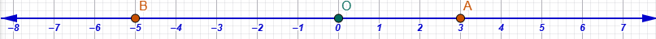
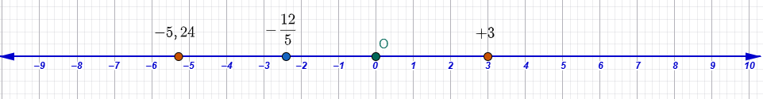

\usepackage{wasysym}

```{=html}
<!-- Φόρτωση βιβλιοθήκης GeoGebra -->
<script src="https://www.geogebra.org/apps/deployggb.js"</script>

<!-- Συνάρτηση δημιουργίας applets -->
<script>
function createGeoGebra(containerId, materialId, width = 700, height = 500) {
  var params = {
    "id": "ggb-" + containerId,
    "material_id": materialId,
    "width": width,
    "height": height,
    "showToolBar": true,
    "showMenuBar": false,
    "showAlgebraInput": true
  };
  
  var applet = new GGBApplet(params, '5.2');
  applet.inject(containerId);
}
</script>
```

------------------------------------------------------------------------

## Χρειάζονται οι αρνητικοί αριθμοί;

Οι αρνητικοί αριθμοί είναι απαραίτητοι γιατί μας επιτρέπουν να περιγράψουμε καταστάσεις και μεγέθη που οι φυσικοί αριθμοί ή τα κλάσματα δεν επαρκούν να εκφράσουν.
Η ανάγκη για τη χρήση τους προκύπτει τόσο από την καθημερινή ζωή όσο και από την εσωτερική λογική των μαθηματικών.

### 1. Εφαρμογές στην Καθημερινή Ζωή

Στην καθημερινότητα, οι αρνητικοί αριθμοί χρησιμοποιούνται για να δείξουν όχι μόνο "πόσα έχουμε", αλλά και **"πόσα μας λείπουν"** ή θέσεις που βρίσκονται κάτω από ένα σημείο αναφοράς.
Συγκεκριμένα χρησιμοποιούνται για:

\* **Χρέη και Οικονομικά:** Εκφράζουν ελλείψεις, ζημιές ή χρέη (σε αντίθεση με τα κέρδη και τις καταθέσεις), καθώς και μειώσεις τιμών ή εκπτώσεις.

\* **Θερμοκρασία:** Χρησιμοποιούνται για να περιγράψουν το κρύο όταν η θερμοκρασία πέφτει **κάτω από το μηδέν**.

\* **Υψόμετρο και Βάθος:** Βοηθούν στον προσδιορισμό θέσεων σε σχέση με την επιφάνεια της θάλασσας, όπου το βάθος εκφράζεται με αρνητικούς αριθμούς (π.χ. ένας καρχαρίας στα -200 μέτρα).

\* **Μετακινήσεις και Θέσεις:** Σε έναν ανελκυστήρα, οι αριθμοί -1 ή -2 δείχνουν τα υπόγεια επίπεδα.
Επίσης, στην αριθμογραμμή, εκφράζουν μετακινήσεις προς τα αριστερά ή πίσω από το σημείο μηδέν.

### 2. Μαθηματική Αναγκαιότητα

Πέρα από τις πρακτικές εφαρμογές, οι αρνητικοί αριθμοί "εφευρέθηκαν" για να επιλύσουν συγκεκριμένα μαθηματικά προβλήματα:

\* **Δυνατότητα Αφαίρεσης:** Στους φυσικούς αριθμούς, η αφαίρεση ενός μεγαλύτερου αριθμού από έναν μικρότερο είναι αδύνατη.
Οι αρνητικοί αριθμοί δημιουργήθηκαν ώστε η πράξη της αφαίρεσης να είναι δυνατή σε κάθε περίπτωση.

\* **Επίλυση Εξισώσεων:** Πολλές εξισώσεις (όπως οι δευτεροβάθμιες ή απλές γραμμικές μορφής $ax+b=c$ όπου $c<b$) απαιτούν αρνητικούς αριθμούς για να έχουν λύση κάτω από όλες τις συνθήκες.

\* **Αρχή της Διατήρησης:** Χρειάζονται για να διατηρούνται οι βασικές ιδιότητες των πράξεων (όπως η επιμεριστική ιδιότητα) σε όλα τα σύνολα αριθμών, επιτρέποντας τη δημιουργία ενός ενοποιημένου συστήματος μαθηματικών.

\* **Γεωμετρία:** Είναι απαραίτητοι στην Αναλυτική Γεωμετρία για να περιγραφεί ολόκληρο το επίπεδο με συντεταγμένες και όχι μόνο το θετικό μέρος των αξόνων.

Συνοψίζοντας, οι αρνητικοί αριθμοί είναι το εργαλείο που μας επιτρέπει να περάσουμε από το απλό μέτρημα αντικειμένων στην πλήρη κατανόηση και μαθηματική περιγραφή του κόσμου.

------------------------------------------------------------------------

2.  **Η έκφραση μεγεθών ή μεταβλητών με θετικούς και αρνητικούς αριθμούς** βασίζεται στη χρήση των **προσήμων**, δηλαδή των συμβόλων «+» και «-», τα οποία γράφονται πριν από τους αριθμούς για να τους χαρακτηρίσουν. Το **μηδέν (0)** αποτελεί το σημείο αναφοράς και δεν είναι ούτε θετικός ούτε αρνητικός αριθμός.

Συγκεκριμένα, τα μεγέθη εκφράζονται ως εξής:

-   **Οικονομικά Μεγέθη:** Οι θετικοί αριθμοί χρησιμοποιούνται για να δηλώσουν **καταθέσεις, κέρδη, έσοδα** ή αυξήσεις μισθών.
    Αντίθετα, οι αρνητικοί αριθμοί εκφράζουν **αναλήψεις, ζημιές, χρέη, οφειλές** ή έξοδα.

-   **Θερμοκρασία:** Οι τιμές **πάνω από το μηδέν** εκφράζονται με θετικούς αριθμούς (π.χ. +20°C), ενώ οι θερμοκρασίες **κάτω από το μηδέν** (κρύο) εκφράζονται με αρνητικούς αριθμούς (π.χ. -10°C).

-   **Υψόμετρο και Βάθος:** Σε σχέση με την επιφάνεια της θάλασσας (που θεωρείται το μηδέν), το **υψόμετρο** εκφράζεται με θετικούς αριθμούς (+200 m), ενώ το **βάθος** κάτω από την επιφάνεια εκφράζεται με αρνητικούς αριθμούς (-15 m).

-   **Μεταβολές Μεγεθών:** Μια **αύξηση** σε ένα μέγεθος (π.χ. αύξηση τιμής ή επιτοκίου) δηλώνεται με θετικό αριθμό, ενώ μια **μείωση ή έκπτωση** δηλώνεται με αρνητικό αριθμό.

-   **Θέση και Κίνηση:** Στον άξονα των ρητών αριθμών, οι θετικοί αριθμοί τοποθετούνται **δεξιά** από το μηδέν και οι αρνητικοί **αριστερά**.
    Η θέση ενός σημείου ονομάζεται **τετμημένη**.
    Αντίστοιχα, το +3 μπορεί να σημαίνει βήματα **μπροστά**, ενώ το -5 βήματα **πίσω**.\



-   **Ανελκυστήρας:** Οι θετικοί αριθμοί αντιστοιχούν στους ορόφους **πάνω από το ισόγειο**, ενώ οι αρνητικοί αριθμοί (π.χ. -1, -2) δηλώνουν τα επίπεδα του **υπογείου**.

Είναι σημαντικό να σημειωθεί ότι όταν ένας αριθμός δεν συνοδεύεται από πρόσημο, εννοείται ότι είναι **θετικός**.
Οι αρνητικοί αριθμοί μας επιτρέπουν να εκφράσουμε καταστάσεις όπου έχουμε «λιγότερα από το τίποτα» ή ελλείψεις.

3.  **Οι ρητοί αριθμοί (**$\mathbb{Q}$) αποτελούν ένα διευρυμένο σύνολο αριθμών που περιλαμβάνει όλους εκείνους τους αριθμούς που μπορούν να γραφτούν σε **μορφή κλάσματος** π.χ $\frac{24}{45}$, με ακέραιους όρους και παρονομαστή διάφορο του μηδενός. Στην πράξη, το σύνολο των ρητών περιλαμβάνει τους **φυσικούς αριθμούς (**$\mathbb{N}$), τους **ακέραιους** ($\mathbb{Z}$) οι περιλαμβάνουν και τους φυσικούς, τα **κλάσματα**, τους **δεκαδικούς**, καθώς και τους αντίστοιχους **αρνητικούς** τους αριθμούς.

### Βασικές Έννοιες και Χαρακτηριστικά

::: {style="background-color: #f0f8cc; border: 2px solid #2f3e50; color: #345678; padding: 15px; border-radius: 5px;"}
-   **Πρόσημα:** Χρησιμοποιούμε τα σύμβολα **«+»** και **«-»** πριν από τους αριθμούς για να τους χαρακτηρίσουμε.

-   **Θετικοί και Αρνητικοί:** Θετικός λέγεται ο αριθμός με πρόσημο «+» (αν δεν έχει πρόσημο σημαίνει οτι είναι θετικός), ενώ αρνητικός ο αριθμός με πρόσημο «-».

-   **Το Μηδέν (0):** Αποτελεί το σημείο αναφοράς και **δεν είναι ούτε θετικός ούτε αρνητικός** αριθμός.

-   **Ομόσημοι και Ετερόσημοι:** Ομόσημοι ονομάζονται οι αριθμοί με το ίδιο πρόσημο, ενώ ετερόσημοι εκείνοι με διαφορετικό.

    -   Ομόσημοι θετικοί: $+5,+7,+12, +5876$.

    -   Ομόσημοι αρνητικοί: $-2000, -36,4  ,  -3,  -0,01$

    -   Ετερόσημοι: $-296\quad και\quad85$ $\quad$,$\quad$ $+34,78\quad και\quad -\frac{8}{5}$

**Απόλυτη Τιμή (**$|α|$): Είναι η **απόσταση** του σημείου που παριστάνει τον αριθμό από την αρχή Ο του άξονα και είναι πάντα θετικός αριθμός ή μηδέν.

-   $|-8,3|=8,3$

-   $|+78|=78$
:::

#### **5 Λυμένες Ασκήσεις**

1.  Να βρεθεί η απόλυτη τιμή του $+7,25$.
    -   **Λύση:** $|+7,25| = 7,25$.
2.  Να βρεθεί η απόλυτη τιμή του $-2,5$.
    -   **Λύση:** $|-2,5| = 2,5$.
3.  Να βρεθεί η απόλυτη τιμή του $-58$.
    -   **Λύση:** $|-58| = 58$.
4.  Να βρείτε τον αριθμό $x$ αν $|x| = 100$.
    -   **Λύση:** Ο $x$ μπορεί να είναι $+100$ ή $-100$.
5.  Ποια είναι η απόλυτη τιμή του μηδενός;
    -   **Λύση:** $|0| = 0$.

#### **10 Άλυτες Ασκήσεις**

Να βρείτε την απόλυτη τιμή των παρακάτω αριθμών:

1\.
$-25$

2\.
$+8$

3\.
$-16$

4\.
$+7$

5\.
$-6$

6\.
$-15$

7\.
$29$

8\.
$-8,2$

9\.
$-\frac{258}{8}$

10\.
$+\frac{17}{3}$

------------------------------------------------------------------------

::: {style="background-color: #f0f7cc; border: 2px solid #2f3e50; color: #345678; padding: 15px; border-radius: 5px;"}
### **Αντίθετοι Αριθμοί**

**Αντίθετοι** ονομάζονται δύο αριθμοί που είναι **ετερόσημοι** (διαφορετικό πρόσημο) και έχουν την **ίδια απόλυτη τιμή**.
Ο αντίθετος του $x$ είναι ο $-x$.
:::

#### **5 Λυμένες Ασκήσεις**

1.  Ποιος είναι ο αντίθετος του αριθμού $+2$;
    -   **Λύση:** Ο $-2$.
2.  Ποιος είναι ο αντίθετος του αριθμού $-19$;
    -   **Λύση:** Ο $+19$.
3.  Ποιος είναι ο αντίθετος του αριθμού $-12$;
    -   **Λύση:** Ο $+12$.
4.  Ποιος είναι ο αντίθετος του αριθμού $-2,7$;
    -   **Λύση:** Ο $+2,7$.
5.  Αν ένα σημείο $Κ$ έχει τετμημένη $-7$, ποια είναι η τετμημένη του σημείου $Λ$ που είναι συμμετρικό του ως προς την αρχή του άξονα;
    -   **Λύση:** Η τετμημένη του $Λ$ είναι ο αντίθετος αριθμός, δηλαδή ο $+7$.

#### **10 Άλυτες Ασκήσεις**

Να βρείτε τους αντίθετους των παρακάτω αριθμών:

1\.
$5$

2\.
$-4$

3\.
$-1$

4\.
$-9$

5\.
$-7$

6\.
$6,4$

7\.
$-\frac{2}{3}$

8\.
$+8$

9\.
$16$

10\.
$-0,02$

### Παράσταση στην Αριθμογραμμή

Οι ρητοί αριθμοί απεικονίζονται ως σημεία πάνω σε μια ευθεία, τον **άξονα των ρητών**.

-   Στο κέντρο τοποθετείται το μηδέν.

-   Στα **δεξιά** βρίσκονται οι θετικοί αριθμοί και στα **αριστερά** οι αρνητικοί.

-   Ο αριθμός που αντιστοιχεί σε κάθε σημείο του άξονα ονομάζεται **τετμημένη** του σημείου.



### Σύγκριση Ρητών Αριθμών

::: {style="background-color: #f1f8cc; border: 2px solid #2f3e50; color: #345678; padding: 15px; border-radius: 5px;"}
Η σύγκριση βασίζεται στη θέση τους πάνω στον άξονα: **μεγαλύτερος είναι ο αριθμός που βρίσκεται δεξιότερα**.
Παρατηρώντας τον άξονα βλέπουμε ότι:

1.  Κάθε θετικός είναι μεγαλύτερος από το μηδέν και από κάθε αρνητικό.

2.  Το μηδέν είναι μεγαλύτερο από κάθε αρνητικό.

3.  Μεταξύ δύο θετικών, μεγαλύτερος είναι αυτός με τη μεγαλύτερη απόλυτη τιμή.

4.  Μεταξύ δύο αρνητικών, μεγαλύτερος είναι αυτός με τη **μικρότερη απόλυτη τιμή**.
:::

### Πράξεις με Ρητούς

::: {style="background-color: #f0f8cc; border: 2px solid #2f3e50; color: #345678; padding: 15px; border-radius: 5px;"}
-   **Πρόσθεση:** Για ομόσημους, προσθέτουμε τις απόλυτες τιμές και βάζουμε το κοινό τους πρόσημο. Για ετερόσημους, αφαιρούμε τη μικρότερη από τη μεγαλύτερη απόλυτη τιμή και κρατάμε το πρόσημο εκείνου με τη μεγαλύτερη απόλυτη τιμή.\
:::

**5 Λυμένες Ασκήσεις**

-   $(+4,05) + (+6,15)$

-   *Λύση:* Οι αριθμοί είναι ομόσημοι θετικοί.
    Προσθέτουμε τις απόλυτες τιμές: $4,05 + 6,15 = 10,2$.
    Το αποτέλεσμα είναι $+10,2$

-   $(-3,5) + (-2,5)$

    -   *Λύση:* Οι αριθμοί είναι ομόσημοι αρνητικοί. Προσθέτουμε τις απόλυτες τιμές: $3,5 + 2,5 = 6$. Βάζουμε το κοινό πρόσημο (-) και έχουμε $-6$.

-   $(-2) + (+7)$

    -   *Λύση:* Οι αριθμοί είναι ετερόσημοι. Αφαιρούμε τις απόλυτες τιμές: $7 - 2 = 5$. Κρατάμε το πρόσημο του $+7$ (μεγαλύτερη απόλυτη τιμή), άρα $+5$.

-   $(+2) + (-8)$

    -   *Λύση:* Οι αριθμοί είναι ετερόσημοι. Αφαιρούμε τις απόλυτες τιμές: $8 - 2 = 6$. Κρατάμε το πρόσημο του $-8$ (μεγαλύτερη απόλυτη τιμή), άρα $-6$.

-   $(+15) + (-15)$

    -   *Λύση:* Οι αριθμοί είναι αντίθετοι. Το άθροισμά τους είναι $0$.

### **10 Άλυτες Ασκήσεις**

Να υπολογίσετε τα παρακάτω αθροίσματα χρησιμοποιώντας τους παραπάνω κανόνες:

1.  $(+5) + (+7)$

2.  $(-8) + (-6)$

3.  $(+6) + (-4)$

4.  $(-9) + (+5)$

5.  $(-17) + 0$

6.  $(+13) + (-14)$

7.  $(-7) + (+4)$

8.  $(-20) + (+8)$

9.  $(+8) + (+53)$

10. $(+21,4) + (-16,2)$

::: {style="background-color: #f0f8cc; border: 2px solid #2f3e50; color: #345678; padding: 15px; border-radius: 5px;"}
-   **Αφαίρεση:** Για να αφαιρέσουμε δύο αριθμούς, **προσθέτουμε στον μειωτέο τον αντίθετό του αφαιρετέου** $$α - β = α + (-β)$$\
:::

### **5 Λυμένες Ασκήσεις**

1.  $(+5) - (-7)$

-   *Λύση:* Μετατρέπουμε την αφαίρεση σε πρόσθεση του αντιθέτου: $5 + (+7) = 12$.

2.  $(-8) - (+8)$

    -   *Λύση:* Προσθέτουμε στον $-8$ τον αντίθετο του $+8$: $-8 + (-8) = -16$.

3.  $(-2) - (-15,2)$

    -   *Λύση:* Προσθέτουμε στον $-2$ τον αντίθετο του $-15,2$: $-2 + (+15,2) = +13,2$.

4.  $14,55 - 18,45$

    -   *Λύση:* Επειδή ο αφαιρετέος είναι μεγαλύτερος, το αποτέλεσμα είναι αρνητικό: $14,55 - 18,45 = -3,9$.

5.  $(+18) - (-3)$

    -   *Λύση:* Προσθέτουμε στον $+18$ τον αντίθετο του $-3$: $18 + (+3) = +21$.

### **10 Άλυτες Ασκήσεις**

Να υπολογίσετε τις παρακάτω διαφορές χρησιμοποιώντας τον κανόνα της πρόσθεσης του αντιθέτου:

1.  $(-9) - (+5)$

2.  $0 - (-18)$

3.  $(-17) - (-2)$

4.  $(-22) - (+7)$

5.  $(-17,82) - (-4,45)$

6.  $(+\frac{12}{5}) - (-\frac{10}{3})$

7.  $(-21,4) - (+12,8)$

8.  $(-\frac{400}{7}) - (+\frac{25}{6})$

9.  $(+0,0025) - (-11,3)$

10. $(-8,3) - (-1,7)$

::: {style="background-color: #f0f8cc; border: 2px solid #2f3e50; color: #345678; padding: 15px; border-radius: 5px;"}
**Σημείωση:** Κατά την επίλυση, να θυμάστε ότι όταν μια παρένθεση έχει μπροστά της το πρόσημο «-», την απαλείφουμε αλλάζοντας το πρόσημο του όρου που περιέχει.
:::

Ακολουθούν **10 ασκήσεις** για τον υπολογισμό αθροισμάτων με περισσότερους από 3 όρους, οι οποίες περιλαμβάνουν ακέραιους, δεκαδικούς και κλασματικούς ρητούς αριθμούς.
Για την επίλυσή τους, μπορείτε να εφαρμόσετε είτε τη μέθοδο της **ομαδοποίησης θετικών και αρνητικών** όρων είτε την **κατά σειρά πρόσθεση** των αριθμών.

### **Ασκήσεις με Ακεραίους**

1.  $(+4) + (+5) + (-8) + (+7) + (+8) + (-9)$.
2.  $(-12) + (-17) + (+15) + (-3) + (-9)$.
3.  $(+3) - 7 + 2 + 10 - 3 - 9 + 5 - 2 - 1$.
4.  $(+4) + (+9) + (-5) + (+8) + (-5) + (+4) + (-1)$.
5.  $(+9) + (+3) + (+4) + (+7) + (-6) + (+8) + (-2)$.

### **Ασκήσεις με Δεκαδικούς**

6.  $(+5,6) + (+8,7) + (-3,2) + (-6,9) + (+3,2) + (-7,4)$.
7.  $(-1,8) + (+4,8) + (+9,7) + (-4,8) + (-3,4) + (+1,5)$.
8.  $(+4) + (-5) + (+8) + (-7) + (-8) + (-9) + 8 + (-12) + (+25) + (-70) + (+60) + (-10)$.

### **Ασκήσεις με Κλάσματα**

9.  $(+\frac{3}{4}) + (+\frac{1}{2}) + (-\frac{5}{6}) + (-\frac{7}{12})$ (υπόδειξη: μετατρέψτε τις αφαιρέσεις σε προσθέσεις αντιθέτων).
10. $(-3\frac{1}{4}) + (+2\frac{1}{3}) + (+1\frac{1}{2}) + (-2\frac{5}{6})$ (υπόδειξη: επεξεργαστείτε τους όρους ως αλγεβρικό άθροισμα).

::: {style="background-color: #f0f6cc; border: 2px solid #2f3e50; color: #345678; padding: 15px; border-radius: 5px;"}
**Σημείωση:** Κατά την επίλυση των παραπάνω, θυμηθείτε ότι αν υπάρχουν **αντίθετοι αριθμοί** στην ίδια παράσταση, μπορείτε να τους διαγράψετε, καθώς το άθροισμά τους είναι μηδέν.
:::

Ακολουθούν **10 ασκήσεις** που απαιτούν την **απαλοιφή παρενθέσεων** και τον υπολογισμό αθροισμάτων με περισσότερους από 4 όρους, καλύπτοντας ακέραιους, δεκαδικούς και κλάσματα.

### **Κανόνες Απαλοιφής Παρενθέσεων**

::: {style="background-color: #f0f8cc; border: 2px solid #2f3e50; color: #345678; padding: 15px; border-radius: 5px;"}
1.  Όταν μπροστά από μια παρένθεση υπάρχει το **σύμβολο «+»** (ή καθόλου πρόσημο), την απαλείφουμε μαζί με το «+» και γράφουμε τους όρους που περιέχει με τα **ίδια πρόσημά τους**. $$+(-8)=-8$$ $$+(+12)=+12$$
2.  Όταν μπροστά από μια παρένθεση υπάρχει το **σύμβολο «-»**, την απαλείφουμε μαζί με το «-» και γράφουμε τους όρους που περιέχει με **αλλαγμένα (αντίθετα) πρόσημα**. $$-(+34)=-34$$ $$-(-86)=+86$$
3.  **Συμβουλή:** Αν υπάρχουν **αντίθετοι αριθμοί**, τους διαγράφουμε αμέσως για ευκολότερους υπολογισμούς.
:::

------------------------------------------------------------------------

### **Ασκήσεις προς Επίλυση**

#### **Ασκήσεις με Ακεραίους**

1.  $(+4) + (+9) - (+5) + (+8) - (-5) + (+4) + (-1)$.
2.  $(-15) + (-20) - (-30) + (+40) + (+65) - (+12)$.
3.  $-(-8) + (+10) + (-13) - (+4) - (-7)$.
4.  $(+15) - (+4) + (+7) - (+10) + (-5) + (-8)$.

#### **Ασκήσεις με Δεκαδικούς**

5.  $(+5,6) + (+8,7) - (+3,2) - (+6,9) + (+3,2) - (+7,4)$.
6.  $-(-1,8) + (+4,8) + (+9,7) + (-4,8) - (+3,4) + (+1,5)$.
7.  $-(-0,6 + 4) + (2,3 - 4,7 - 0,5) - 9 - (5,7 - 2,3 + 3)$.

#### **Ασκήσεις με Κλάσματα**

8.  $+\left(+\frac{3}{4}\right) + \left(+\frac{1}{2}\right) - \left(+\frac{5}{6}\right) - \left(+\frac{7}{12}\right)$.
9.  $-\left(-3\frac{1}{4}\right) - \left(-2\frac{1}{3}\right) + \left(+1\frac{1}{2}\right) - \left(+2\frac{5}{6}\right)$.
10. $\left(\frac{4}{5} - \frac{2}{3}\right) - \left(\frac{1}{2} - \frac{3}{4} + \frac{5}{6}\right) + \left(-2\frac{1}{3} - 2\right)$.

::: {style="background-color: #f0c8cc; border: 2px solid #2f3e50; color: #345678; padding: 15px; border-radius: 5px;"}
**Υπόδειξη για τη λύση:** Μετά την απαλοιφή των παρενθέσεων, μπορείτε να **ομαδοποιήσετε** όλους τους θετικούς και όλους τους αρνητικούς αριθμούς χωριστά, να βρείτε τα μερικά αθροίσματα και στο τέλος να κάνετε την τελική πρόσθεση των δύο ετερόσημων αποτελεσμάτων.
:::

-   **Πολλαπλασιασμός και Διαίρεση:**

### **Βασικοί Κανόνες Πολλαπλασιασμού**

::: {style="background-color: #f0f8cc; border: 2px solid #2f3e50; color: #345678; padding: 15px; border-radius: 5px;"}
-   **Ομόσημοι ρητοί:** Πολλαπλασιάζουμε τις απόλυτες τιμές τους και στο γινόμενο βάζουμε το πρόσημο **συν (+)**.
-   **Ετερόσημοι ρητοί:** Πολλαπλασιάζουμε τις απόλυτες τιμές τους και στο γινόμενο βάζουμε το πρόσημο **πλην (-)**.
-   **Πολλαπλασιασμός με το μηδέν:** Το γινόμενο οποιουδήποτε ρητού αριθμού με το μηδέν ισούται με **μηδέν**.\|
-   **Γινόμενο πολλών παραγόντων:** Το πρόσημο είναι **+** αν το πλήθος των αρνητικών παραγόντων είναι **άρτιο**, και **-** αν είναι **περιττό**.
:::

### **5 Λυμένες Ασκήσεις**

1.  $(+2) \cdot (+3)$

-   *Λύση:* Οι αριθμοί είναι ομόσημοι, άρα το γινόμενο είναι θετικό: $2 \cdot 3 = 6$. Αποτέλεσμα: $+6$.

2.  $(-2) \cdot (-4)$

-   *Λύση:* Οι αριθμοί είναι ομόσημοι (αρνητικοί), άρα το γινόμενο είναι θετικό: $2 \cdot 4 = 8$. Αποτέλεσμα: $+8$.

3.  $(+4) \cdot (-3)$

-   *Λύση:* Οι αριθμοί είναι ετερόσημοι, άρα το γινόμενο είναι αρνητικό: $4 \cdot 3 = 12$. Αποτέλεσμα: $-12$.

4.  $(-1,4) \cdot 5$

-   *Λύση:* Πολλαπλασιάζουμε τις απόλυτες τιμές $1,4 \cdot 5 = 7$. Επειδή είναι ετερόσημοι, το αποτέλεσμα είναι $-7$.

5.  $(-10) \cdot (-0,7)$

-   *Λύση:* Πολλαπλασιάζουμε $10 \cdot 0,7 = 7$. Επειδή είναι ομόσημοι, το αποτέλεσμα είναι $+7$.

### **10 Άλυτες Ασκήσεις**

Να υπολογίσετε τα παρακάτω γινόμενα χρησιμοποιώντας τους κανόνες των προσήμων: 1.
$(+10) \cdot (-71)$

2.  $(-43) \cdot (+71)$

3.  $\left(-\frac{10}{7}\right) \cdot \left(+\frac{10}{3}\right)$

4.  $(-8) \cdot (-3)$

5.  $(+31) \cdot (-1)$

6.  $(-32) \cdot (-2)$

7.  $\left(-\frac{11}{8}\right) \cdot \left(+\frac{14}{5}\right)$

8.  $(-26) \cdot (-13)$

9.  $\left(-\frac{1}{2}\right) \cdot \left(-\frac{3}{4}\right)$

10. $0,6 \cdot (-10)$

Ακολουθούν **10 ασκήσεις** πολλαπλασιασμού ρητών αριθμών (ακεραίων, δεκαδικών και κλασμάτων) με περισσότερους από 3 όρους, βασισμένες στους κανόνες για το **γινόμενο πολλών παραγόντων**.

### **Βασικοί Κανόνες για το Γινόμενο Πολλών Παραγόντων**

::: {style="background-color: #f0f8cc; border: 2px solid #2f3e50; color: #345678; padding: 15px; border-radius: 5px;"}
Για να υπολογίσουμε ένα γινόμενο πολλών παραγόντων: \* Πολλαπλασιάζουμε τις **απόλυτες τιμές** όλων των αριθμών.

-   Το αποτέλεσμα έχει πρόσημο **συν (+)** αν το πλήθος των αρνητικών παραγόντων είναι **άρτιο** (ζυγό).
-   Το αποτέλεσμα έχει πρόσημο **πλην (-)** αν το πλήθος των αρνητικών παραγόντων είναι **περιττό** (μονό).
-   Αν έστω και ένας παράγοντας είναι το **μηδέν (0)**, τότε ολόκληρο το γινόμενο ισούται με **μηδέν**.
:::

### **Ασκήσεις προς Επίλυση**

1.  $(+2) \cdot (-3) \cdot (-2) \cdot (+5)$
2.  $(+3) \cdot (-1) \cdot (-4) \cdot (-1) \cdot (+2)$
3.  $(-1,2) \cdot (+0,5) \cdot (-10) \cdot (-2)$
4.  $\left(-\frac{1}{2}\right) \cdot \left(-\frac{2}{3}\right) \cdot \left(+\frac{3}{4}\right) \cdot \left(-\frac{4}{5}\right)$
5.  $(-10) \cdot (+0,7) \cdot (-2) \cdot (-0,5)$
6.  $(+15) \cdot (-3,2) \cdot 0 \cdot (-8,1) \cdot (+2)$
7.  $(+12) \cdot \left(-\frac{1}{4}\right) \cdot (-2) \cdot (+5)$
8.  $(-0,725) \cdot (+1000) \cdot (-0,1) \cdot (+2)$
9.  $\left(-\frac{3}{5}\right) \cdot \left(+\frac{5}{9}\right) \cdot \left(-\frac{16}{25}\right) \cdot \left(-\frac{25}{8}\right)$
10. $(-1) \cdot (-1) \cdot (+2) \cdot (-3) \cdot (+4) \cdot (-0,5)$

**Συμβουλή για τη λύση:** Ξεκινήστε μετρώντας πόσα «πλην» υπάρχουν στην άσκηση για να βρείτε το τελικό πρόσημο και στη συνέχεια κάντε τους πολλαπλασιασμούς των αριθμών.
Αν δείτε το **0** ως παράγοντα, δεν χρειάζεται να κάνετε καμία άλλη πράξη, το αποτέλεσμα είναι αμέσως 0.

### **Βασικοί Κανόνες Διαίρεσης**

::: {style="background-color: #f0f8cc; border: 2px solid #2f3e50; color: #345678; padding: 15px; border-radius: 5px;"}
-   Για να διαιρέσουμε δύο ρητούς αριθμούς, διαιρούμε τις **απόλυτες τιμές** τους και στο πηλίκο βάζουμε το κατάλληλο πρόσημο.
-   Αν οι αριθμοί είναι **ομόσημοι**, το πηλίκο είναι **θετικός αριθμός (+)**.
-   Αν οι αριθμοί είναι **ετερόσημοι**, το πηλίκο είναι **αρνητικός αριθμός (-)**. - Η διαίρεση ενός ρητού αριθμού **α** με έναν αριθμό **β** (διάφορο του μηδενός) μπορεί να γίνει και με πολλαπλασιασμό του **α** επί τον **αντίστροφο** του **β** ($α : β = α \cdot \frac{1}{β}$).
-   **Διαίρεση με διαιρέτη το μηδέν δεν ορίζεται**.
:::

### **5 Λυμένες Ασκήσεις**

1.  $(+15,15) : (+3)$
    -   *Λύση:* Οι αριθμοί είναι ομόσημοι, άρα το πηλίκο είναι θετικό. $15,15 : 3 = 5,05$. Αποτέλεσμα: $+5,05$.
2.  $(-4,5) : (-1,5)$
    -   *Λύση:* Οι αριθμοί είναι ομόσημοι (αρνητικοί), άρα το πηλίκο είναι θετικό. $4,5 : 1,5 = 3$. Αποτέλεσμα: $+3$.
3.  $(-81) : (+0,9)$
    -   *Λύση:* Οι αριθμοί είναι ετερόσημοι, άρα το πηλίκο είναι αρνητικό. $81 : 0,9 = 90$. Αποτέλεσμα: $-90$.
4.  $49 : (-7)$
    -   *Λύση:* Οι αριθμοί είναι ετερόσημοι, άρα το πηλίκο είναι αρνητικό. $49 : 7 = 7$. Αποτέλεσμα: $-7$.
5.  $(+\frac{2}{3}) : (-\frac{7}{5})$
    -   *Λύση:* Πολλαπλασιάζουμε τον διαιρετέο με τον αντίστροφο του διαιρέτη. Επειδή είναι ετερόσημοι, το πρόσημο θα είναι αρνητικό: $-(\frac{2}{3} \cdot \frac{5}{7}) = -\frac{10}{21}$.

------------------------------------------------------------------------

### **10 Άλυτες Ασκήσεις**

Να υπολογίσετε τα παρακάτω πηλίκα χρησιμοποιώντας τους κανόνες των προσήμων:

1.  $(+49) : (+7)$

2.  $(-81) : (-27)$

3.  $(+18) : (-9)$

4.  $(-12) : (+3)$

5.  $(-200) : (+25)$

6.  $\left(-\frac{10}{7}\right) : \left(+\frac{2}{5}\right)$

7.  $3,5 : (-5)$

8.  $(-9,6) : 6$

9.  $\left(-\frac{2}{7}\right) : \left(-\frac{2}{7}\right)$

10. $2,5 : (-5)$

Ακολουθούν **15 ασκήσεις** που περιλαμβάνουν τις τέσσερις πράξεις (πρόσθεση, αφαίρεση, πολλαπλασιασμό, διαίρεση) με ακέραιους, δεκαδικούς και κλάσματα, αποτελούμενες από περισσότερους από 3 όρους:

### **Ασκήσεις με Ακεραίους και Δεκαδικούς**

1.  $(+4) + (+5) + (-8) + (+7) + (+8) + (-9)$.
2.  $(-15) + (-20) + (-30) + (+40) + (+65) + (-12)$.
3.  $(+3) - 7 + 2 + 10 - 3 - 9 + 5 - 2 - 1$.
4.  $11,01 - 41,05 + 9,04$ (προσθέστε έναν ακόμη όρο, π.χ. $+ 10,5$, για την εξάσκηση).
5.  $-(-0,6 + 4) + (2,3 - 4,7 - 0,5) - 9 - (5,7 - 2,3 + 3)$.
6.  $(-2,2 + 2,5) \cdot (-0,4) - (-0,2 - 0,3) \cdot (-1)$.

### **Ασκήσεις με Κλάσματα (Πρόσθεση και Αφαίρεση)**

7.  $\left(+\frac{3}{4}\right) + \left(+\frac{1}{2}\right) + \left(-\frac{5}{6}\right) + \left(-\frac{7}{12}\right)$.
8.  $\left(-\frac{3}{4}\right) - \left(-\frac{1}{2}\right) - \left(+\frac{5}{6}\right) - \left(+\frac{7}{12}\right)$.
9.  $\left(-3\frac{1}{4}\right) - \left(-2\frac{1}{3}\right) + \left(+1\frac{1}{2}\right) - \left(+2\frac{5}{6}\right)$.
10. $\left(\frac{4}{5} - \frac{2}{3}\right) - \left(\frac{1}{2} - \frac{3}{4} + \frac{5}{6}\right) + \left(-2\frac{1}{3} - 2\right)$.

### **Ασκήσεις με Πολλαπλασιασμό, Διαίρεση και Σύνθετες Παραστάσεις**

11. $(-1) \cdot (-20) \cdot \left(+\frac{2}{3}\right) \cdot (-3) \cdot (-0,25)$.
12. $[(-2)^3 \cdot 3 - 3^4 + (-2)^4 : 16] + [-1 - (-1)^7 \cdot 8]$.
13. $\left(\frac{2}{5} + \frac{1}{3} - \frac{3}{15}\right) : \left(\frac{5}{8} - \frac{1}{2}\right)$.
14. $15 : (-2) - \frac{5}{6} : \left(-\frac{15}{6}\right) + \frac{12}{5} : \left(-\frac{2}{-9}\right)$.
15. $\left[\left(\frac{3}{5} : \frac{9}{25}\right) - \left(\frac{8}{3} : \frac{5}{4}\right)\right] : \left(-\frac{3}{2}\right)$.

::: {style="background-color: #f0f8cc; border: 2px solid #2f3e50; color: #345678; padding: 15px; border-radius: 5px;"}
**Υπόδειξη για την επίλυση:** Κατά την εκτέλεση των πράξεων, ακολουθήστε την προβλεπόμενη προτεραιότητα: πρώτα οι **δυνάμεις**, μετά οι **πολλαπλασιασμοί και οι διαιρέσεις** και τέλος οι **προσθέσεις και οι αφαιρέσεις**.
Αν υπάρχουν παρενθέσεις, εκτελούμε πρώτα τις πράξεις στο εσωτερικό τους.
:::

::: {style="background-color: #f0f8ff; border: 2px solid #2c3e50; color: #333333; padding: 15px; border-radius: 5px;"}
### Προσέξτε!

Να επισημάνουμε ότι οι ιδιότητες των πράξεων για την πρόσθεση τον πολλαπλασιασμό καθώς και η επιμεριστική ιδιότητα ισχύουν όπως ακριβώς τις γνωρίζουμε.
:::

### Ιστορικά Στοιχεία

Οι αρνητικοί αριθμοί εμφανίστηκαν για πρώτη φορά σε κινεζικά κείμενα, ενώ στην ευρωπαϊκή παράδοση ο **Διόφαντος** (3ος αι. μ.Χ.) ήταν ο πρώτος που τους χρησιμοποίησε σε ενδιάμεσους υπολογισμούς, αν και τότε θεωρούσε αποδεκτές μόνο τις θετικές λύσεις.
Η πλήρης αποδοχή τους απαίτησε αιώνες μαθηματικής εξέλιξης για να διαμορφωθούν οι κανόνες που γνωρίζουμε σήμερα.
