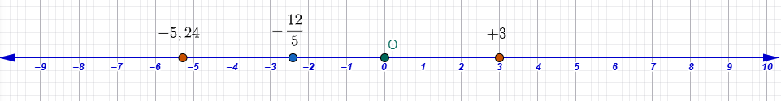

\usepackage{wasysym}

```{=html}
<!-- Φόρτωση βιβλιοθήκης GeoGebra -->
<script src="https://www.geogebra.org/apps/deployggb.js"</script>

<!-- Συνάρτηση δημιουργίας applets -->
<script>
function createGeoGebra(containerId, materialId, width = 700, height = 500) {
  var params = {
    "id": "ggb-" + containerId,
    "material_id": materialId,
    "width": width,
    "height": height,
    "showToolBar": true,
    "showMenuBar": false,
    "showAlgebraInput": true
  };
  
  var applet = new GGBApplet(params, '5.2');
  applet.inject(containerId);
}
</script>
```

------------------------------------------------------------------------

## Θετικοί και Αρνητικοί Αριθμοί (Ρητοί αριθμοί) - H ευθεία των ρητών - Τετμημένη σημείου

### Η ανάγκη εισαγωγής των αρνητικών αριθμών


::: {style="background-color: #b5b1de; border: 2px solid #2f3e50; color: #25188a; padding: 15px; border-radius: 5px;"}


**Θεωρία και Ορισμοί**

Στο σύστημα των φυσικών (απολύτων ακεραίων) αριθμών ($\mathbb{N}$ ή $\Phi_0$), η πράξη της αφαίρεσης $a - \beta$ είναι δυνατή **μόνο όταν** ο μειωτέος $a$ είναι μεγαλύτερος ή ίσος από τον αφαιρετέο $\beta$ ($a \geq \beta$). 

Όταν ο αφαιρετέος είναι μεγαλύτερος ($a < \beta$), η πράξη χαρακτηρίζεται ως **«αδύνατη»** μέσα στο σύστημα των ακεραίων της Αριθμητικής. 

Για να ξεπεραστεί αυτός ο περιορισμός και να είναι κάθε αφαίρεση δυνατή, εισάγονται οι **αρνητικοί αριθμοί**, οι οποίοι μαζί με τους θετικούς και το μηδέν αποτελούν το διευρυμένο σύνολο των ακεραίων.

**Ιδιότητες**

*   Οι αρνητικοί αριθμοί εκφράζουν μεγέθη **αντίθετα** προς τα θετικά (π.χ. χρέος αντί για περιουσία).
*   Η αφαίρεση $a - \beta$ στους ρητούς αριθμούς είναι πλέον **πάντοτε δυνατή**.
*   Το μηδέν (0) λειτουργεί ως το σημείο αναφοράς (ουδέτερο στοιχείο) ανάμεσα στους θετικούς και τους αρνητικούς.

-   **Πρόσημα:** Χρησιμοποιούμε τα σύμβολα **«+»** και **«-»** πριν από τους αριθμούς για να τους χαρακτηρίσουμε.

-   **Θετικοί και Αρνητικοί:** Θετικός λέγεται ο αριθμός με πρόσημο «+» (αν δεν έχει πρόσημο σημαίνει οτι είναι θετικός), ενώ αρνητικός ο αριθμός με πρόσημο «-».

-   **Το Μηδέν (0):** Αποτελεί το σημείο αναφοράς και **δεν είναι ούτε θετικός ούτε αρνητικός** αριθμός.

-   **Ομόσημοι και Ετερόσημοι:** Ομόσημοι ονομάζονται οι αριθμοί με το ίδιο πρόσημο, ενώ ετερόσημοι εκείνοι με διαφορετικό.

  -   Ομόσημοι θετικοί: $+5,+7,+12, +5876$.

  -   Ομόσημοι αρνητικοί: $-2000, -36,4  ,  -3,  -0,01$

  -   Ετερόσημοι: $-296\quad και\quad85$ $\quad$,$\quad$ $+34,78\quad και\quad -\frac{8}{5}$
  
*   Το σύνολο των ακεραίων $\mathbb{N}$ είναι όλοι οι φυσικοί αριθμοί (οι οποίοι είναι οι θετικοί ακέραιοι) μαζί με τους αντίστοιχους αρνητικούς 

$$\mathbb{N}={......, -4, -3, -2, -1, 0, +1, +2, +3, +4, +5, .....}$$ 

*   Ρητοί $\mathbb{Q}$ αριθμοί είναι όλοι οι γνωστοί μας έως τώρα αριθμοί: φυσικοί, κλάσματα και δεκαδικοί μαζί με τους αντίστοιχους αρνητικούς αριθμούς.

$$\mathbb{Q}=\left\{{\dfrac{a}{β}} : \ \ α \in \mathbb{Z}, \ \ \ β \in \mathbb{Z} \ \ \text{ και } \ \  β\ne 0 \right\}$$

:::

**Παραδείγματα**

1.  Η αφαίρεση $15 - 23$ είναι αδύνατη στους φυσικούς αριθμούς, αλλά έχει νόημα στους ρητούς ως $-8$.
2.  Μια θερμοκρασία $5$ βαθμούς κάτω από το μηδέν εκφράζεται ως $-5^\circ C$.
3.  Ένα οικονομικό έλλειμμα (χρέος) $1.000$ δραχμών εκφράζεται ως $-1.000$.
4.  Το βάθος $10$ μέτρα κάτω από την επιφάνεια της θάλασσας εκφράζεται ως $-10$ m.
5.  Η κίνηση ενός σημείου πάνω σε έναν άξονα κατά $3$ μονάδες προς τα αριστερά της αρχής $O$.

**Ασκήσεις**

1.  Εξετάστε αν η πράξη $8 - 12$ είναι δυνατή στο σύνολο $\Phi_0$.
2.  Αν ένας έμπορος έχει εισπράξεις $100$ δρχ. και πληρωμές $150$ δρχ., ποιο είναι το υπόλοιπο του ταμείου του;.
3.  Ποιος αριθμός πρέπει να προστεθεί στο $20$ για να προκύψει $15$;
4.  Εκφράστε με πρόσημο τη διαφορά ηλικίας αν ο υιός είναι $15$ και ο πατέρας $45$.
5.  Συμπληρώστε την ισότητα $10 - ... = 15$.
6.  Για ποιες τιμές του $a$ η διαφορά $7 - a$ δεν ανήκει στους φυσικούς αριθμούς;.
7.  Γράψτε τον αντίθετο του αριθμού $+5$.
8.  Ποια είναι η διαφορά μεταξύ ενός κέρδους $500$ δρχ. και μιας ζημίας $500$ δρχ.;
9.  Αν ένα ασανσέρ κατεβαίνει $2$ ορόφους κάτω από το ισόγειο (0), σε ποιον όροφο βρίσκεται;
10. Τι σημαίνει η έκφραση «έλλειμμα 6.720 δρχ.» σε μαθηματική μορφή;.
11. Ποια είναι η απόσταση του $-3$ από το $0$ στον άξονα;.
12. Αν $a = -4$, υπολογίστε την τιμή της παράστασης $a + 4$.
13. Βρείτε έναν αριθμό που η διαφορά του από το $10$ να είναι $15$.
14. Χρησιμοποιήστε το σύμβολο $<$ για να συγκρίνετε το $0$ με το $-5$.
15. Γιατί η διαίρεση με το $0$ παραμένει αδύνατη και στους αρνητικούς αριθμούς;.

---

### Έκφραση μεγεθών με θετικούς ή αρνητικούς αριθμούς

::: {style="background-color: #b5b1de; border: 2px solid #2f3e50; color: #25188a; padding: 15px; border-radius: 5px;"}

**Θεωρία και Ορισμοί**

Τα **συγκεκριμένα ποσά** ή μεγέθη μπορούν να έχουν **αντίθετες φορές** ή κατευθύνσεις. Οι θετικοί αριθμοί (+) χρησιμοποιούνται για μεγέθη που δηλώνουν αύξηση, κέρδος, ύψος ή κίνηση προς τα δεξιά. Οι αρνητικοί αριθμοί (-) χρησιμοποιούνται για μεγέθη που δηλώνουν μείωση, ζημία, βάθος ή κίνηση προς τα αριστερά.

**Ιδιότητες**

*   **Ομοειδή μεγέθη:** Για να συγκριθούν ή να προστεθούν, πρέπει να αναφέρονται στην ίδια μονάδα μέτρησης.
*   **Συμμεταβλητά ποσά:** Δύο ποσά μπορεί να μεταβάλλονται ανάλογα ή αντίστροφα, επηρεάζοντας το πρόσημο της μεταβολής τους.

:::

**Παραδείγματα**

1.  Ύψος βουνού $2.917$ m ($+2.917$) και βάθος θάλασσας $1.500$ m ($-1.500$).
2.  Κέρδος $500$ δρχ. ($+500$) και έξοδα $300$ δρχ. ($-300$).
3.  Χρονική στιγμή $300$ π.Χ. ($-300$) και $2024$ μ.Χ. ($+2024$).
4.  Θερμοκρασία $10$ βαθμοί άνω του μηδενός ($+10$) και $3$ βαθμοί κάτω του μηδενός ($-3$).
5.  Μετατόπιση κινητού προς τα δεξιά κατά $5$ m ($+5$) και προς τα αριστερά κατά $8$ m ($-8$).

**15 Ασκήσεις**

1.  Εκφράστε με ρητό αριθμό ένα χρέος $1.500$ δρχ..
2.  Ένα πλοίο βρίσκεται $50$ ναυτικά μίλια βόρεια του ισημερινού. Αν το βόρεια είναι (+), πώς εκφράζεται η θέση του;.
3.  Αν το βάρος ενός ατόμου μειώθηκε κατά $3$ κιλά, πώς εκφράζεται η μεταβολή;
4.  Εκφράστε το ύψος ενός αεροπλάνου στα $10.000$ πόδια.
5.  Ένας δύτης καταδύεται στα $25$ μέτρα. Ποιο είναι το πρόσημο του βάθους;
6.  Η θερμοκρασία στην κορυφή του Ολύμπου είναι $-10^\circ C$. Τι σημαίνει αυτό;.
7.  Εκφράστε το έτος ίδρυσης της Ρώμης ($753$ π.Χ.) ως ρητό αριθμό.
8.  Αν η είσπραξη είναι $+894$ δρχ., τι εκφράζει το $-286$ δρχ.;.
9.  Ένα σημείο $A$ έχει τετμημένη $+4$. Προς ποια μεριά του μηδενός βρίσκεται;.
10. Πώς εκφράζεται η μείωση της τιμής ενός προϊόντος κατά $20$ δρχ.;
11. Εκφράστε την υπεροχή ενός αριθμού $a$ έναντι του $\beta$ αν $a=10$ και $\beta=15$.
12. Πώς συμβολίζεται η μεταβολή της στάθμης μιας δεξαμενής που άδειασε κατά $720$ kg λάδι;.
13. Αν μια βίδα βιδώνει (+) και ξεβιδώνει (-), πώς εκφράζονται $3$ στροφές ξεβιδώματος;.
14. Εκφράστε την ταχύτητα ενός κινητού που κινείται αντίθετα προς την ορισμένη φορά.
15. Ένας μαθητής έχασε $18$ βώλους και κέρδισε $12$. Ποιο είναι το τελικό πρόσημο της μεταβολής του;.

---

### Παράσταση ρητού με σημείο ενός άξονα - Τετμημένη σημείου

::: {style="background-color: #b5b1de; border: 2px solid #2f3e50; color: #25188a; padding: 15px; border-radius: 5px;"}

**Θεωρία και Ορισμοί**

Για τη γραφική παράσταση των ρητών αριθμών χρησιμοποιούμε μια ευθεία $x'x$, στην οποία ορίζουμε μια **αρχή $O$** (που αντιστοιχεί στο μηδέν) και ένα **μοναδιαίο τμήμα $OA$** (που αντιστοιχεί στη μονάδα 1).

Οι ρητοί αριθμοί απεικονίζονται ως σημεία πάνω στον **άξονα των ρητών**.

-   Στο κέντρο τοποθετείται το μηδέν.

-   Στα **δεξιά** βρίσκονται οι θετικοί αριθμοί και στα **αριστερά** οι αρνητικοί.

-   Ο αριθμός που αντιστοιχεί σε κάθε σημείο του άξονα ονομάζεται **τετμημένη** του σημείου.





**Ιδιότητες**

*   Σε κάθε ρητό αριθμό αντιστοιχεί **ένα και μόνο ένα** σημείο του άξονα.
*   Οι θετικοί ρητοί παριστάνονται δεξιά της αρχής $O$ και οι αρνητικοί αριστερά.
*   Για να παραστήσουμε ένα κλάσμα $\dfrac{a}{β}$, διαιρούμε το μοναδιαίο τμήμα σε $\beta$ ίσα μέρη και παίρνουμε $a$ τέτοια μέρη από το μηδέν.

:::

**Παραδείγματα**

1.  Το σημείο $Α$ με τετμημένη $+3$ βρίσκεται $3$ μονάδες δεξιά του $O$ και το Β με τετμημέμη $-5$, 5 μονάδες αριστερά της αρχής Ο.


2.  Το κλάσμα $\dfrac{3}{4}$ παριστάνεται στο σημείο που προκύπτει αν χωρίσουμε τη μονάδα σε $4$ ίσα μέρη και μετρήσουμε $3$ από την αρχή.
3.  Ο μικτός αριθμός $2 \dfrac{1}{4}$ (ή $9/4$) βρίσκεται μεταξύ των σημείων $2$ και $3$ του άξονα.
4.  Το σημείο με τετμημένη $-2$ βρίσκεται $2$ μονάδες αριστερά του $O$.
5.  Η αρχή των αξόνων $O$ έχει τετμημένη $0$.

**15 Ασκήσεις**

1.  Σχεδιάστε έναν άξονα $Ox$ και τοποθετήστε τα σημεία με τετμημένες $1, 2, 5$.
2.  Τοποθετήστε στον άξονα τα κλάσματα $1/2, 3/4, 5/4$.
3.  Βρείτε την τετμημένη του μέσου $M$ ενός τμήματος $AB$ αν $A(+2)$ και $B(+6)$.
4.  Ποια είναι η απόσταση ανάμεσα στα σημεία με τετμημένες $-3$ και $+2$;.
5.  Σημειώστε στον άξονα τον αριθμό $0,5$.
6.  Αν ένα σημείο μετατοπιστεί από το $+2$ κατά $5$ μονάδες αριστερά, ποια θα είναι η νέα του τετμημένη;.
7.  Ποιο σημείο είναι συμμετρικό του $A(+3)$ ως προς την αρχή $O$;.
8.  Τοποθετήστε στον άξονα τον ρητό αριθμό $-1,5$.
9.  Πόσα ίσα μέρη πρέπει να χωρίσετε τη μονάδα για να παραστήσετε το $7/8$;.
10. Βρείτε το σημείο που αντιστοιχεί στον αντίστροφο του $+2$.
11. Σχεδιάστε τα σημεία $A(1/3)$ και $B(2/3)$. Ποιο είναι δεξιότερα;.
12. Τοποθετήστε στον άξονα τον μικτό αριθμό $3 \dfrac{1}{2}$.
13. Ποια είναι η τετμημένη της αρχής $O$;.
14. Σημειώστε ένα σημείο $P$ με τετμημένη $x$, έτσι ώστε $OP= 4$ μονάδες. Πόσες λύσεις υπάρχουν;
15. Αν η μονάδα $OA$ είναι $2$ cm, σε πόση απόσταση από το $O$ βρίσκεται το σημείο με τετμημένη $+2,5$;.
