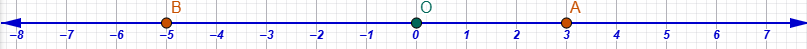

\usepackage{wasysym}

```{=html}
<!-- Φόρτωση βιβλιοθήκης GeoGebra -->
<script src="https://www.geogebra.org/apps/deployggb.js"</script>

<!-- Συνάρτηση δημιουργίας applets -->
<script>
function createGeoGebra(containerId, materialId, width = 700, height = 500) {
  var params = {
    "id": "ggb-" + containerId,
    "material_id": materialId,
    "width": width,
    "height": height,
    "showToolBar": true,
    "showMenuBar": false,
    "showAlgebraInput": true
  };
  
  var applet = new GGBApplet(params, '5.2');
  applet.inject(containerId);
}
</script>
```

------------------------------------------------------------------------

## Απόλυτη τιμή ρητού - Αντίθετοι ρητοί - Σύγκριση ρητών

### Απόλυτη τιμή ρητού και αντιστοίχιση στον άξονα

::: {style="background-color: #b5b1de; border: 2px solid #2f3e50; color: #25188a; padding: 15px; border-radius: 5px;"}

**Θεωρία, Ορισμοί και Ιδιότητες**

*   **Απόλυτη τιμή** ενός ρητού αριθμού ονομάζεται η απόσταση του σημείου που παριστάνει τον αριθμό αυτόν πάνω στον άξονα από την αρχή $O$ (το μηδέν).

*   Συμβολίζεται με δύο κατακόρυφες γραμμές $|a|$.

*   **Ιδιότητες:**

    1.  Η απόλυτη τιμή κάθε ρητού (εκτός του μηδενός) είναι πάντα **θετικός αριθμός**.
    
    $$
    |x|=
    \begin{cases}
    x, \ \text{ Αν } \ x>0\\
    -x, \ \text{ Αν } \ x<0\\
    0 , \ \text{ Αν } \ x=0
    \end{cases}
    $$
    
    2.  Η απόλυτη τιμή δείχνει το «μέγεθος» του αριθμού χωρίς να λαμβάνεται υπόψη η φορά (το πρόσημο).
    3.  Η απόλυτη τιμή δείχνει την «απόσταση» του αριθμού από το $0$.

:::

**Παραδείγματα**

1.  $|+5| = 5$ (απόσταση 5 μονάδες δεξιά του $O$).
2.  $|-3| = 3$ (απόσταση 3 μονάδες αριστερά του $O$).
3.  $\left|\dfrac{3}{4}\right| = \dfrac{3}{4}$ (απόσταση $\dfrac{3}{4}$ της μονάδας από το μηδέν).
4.  Ο αριθμός με απόλυτη τιμή $4$ και πρόσημο $(-)$ αντιστοιχεί στο σημείο $M$ που απέχει 4 μονάδες αριστερά της αρχής.
5.  Αν $|x| = 2$, τότε ο $x$ μπορεί να είναι το $+2$ ή το $-2$.

**Ασκήσεις**

1.  Βρείτε την απόλυτη τιμή των αριθμών: $+7, -12, +0,5, -1/2$.
2.  Ποιοι αριθμοί έχουν απόλυτη τιμή $8$;
3.  Τοποθετήστε στον άξονα τα σημεία $A, B$ αν $|A|=3$ (θετικός) και $|B|=3$ (αρνητικός).
4.  Αν η απόσταση $OM$ είναι $4,5$ μονάδες, ποιες είναι οι πιθανές τετμημένες του $M$;
5.  Υπολογίστε την παράσταση $|-5| + |+2|$.
6.  Συγκρίνετε τις απόλυτες τιμές $|-10|$ και $|+3|$.
7.  Βρείτε έναν αριθμό $x$ ώστε $|x| < 1$.
8.  Ποιος αριθμός έχει απόλυτη τιμή ίση με το μηδέν;.
9.  Σημειώστε στον άξονα τον αριθμό που έχει $|x|=2,5$ και βρίσκεται δεξιά του $O$.
10. Αν $|x|=|-7|$, ποια είναι η τιμή του $x$;
11. Σχεδιάστε ένα τμήμα $OA=1$ και βρείτε το σημείο $B$ ώστε $|B|=2|A|$.
12. Ποια είναι η απόλυτη τιμή του αντίστροφου του $-2$;.
13. Είναι αληθές ότι $|-x| = |x|$; Δώστε παράδειγμα.
14. Αν $|a|=5$ και $|b|=3$, ποια είναι η μέγιστη τιμή του $|a+b|$;
15. Βρείτε την απόλυτη τιμή του αποτελέσματος της πράξης $15-20$.

---

### Εύρεση ρητού που αντιστοιχεί σε σημείο του άξονα

::: {style="background-color: #b5b1de; border: 2px solid #2f3e50; color: #25188a; padding: 15px; border-radius: 5px;"}

**Θεωρία, Ορισμοί και Ιδιότητες**

*   Κάθε σημείο $M$ του άξονα $Ox$ αντιστοιχεί σε **έναν μοναδικό ρητό αριθμό** (τετμημένη).

*   Για να βρούμε τον ρητό, εξετάζουμε σε πόσα ίσα μέρη έχει χωριστεί το **μοναδιαίο τμήμα** $OA$ (παρονομαστής) και πόσα τέτοια μέρη απέχει το σημείο από το $O$ (αριθμητής).

*   Αν το σημείο βρίσκεται δεξιά του $O$, ο ρητός είναι θετικός· αν αριστερά, είναι αρνητικός.

:::

**Παραδείγματα**

1.  Σημείο $M$ στο μέσο του $OA$ αντιστοιχεί στο $\dfrac{1}{2}$.
2.  Σημείο που προκύπτει από 3 διαδοχικά τμήματα ίσα με το $\dfrac{1}{4}$ της μονάδας δεξιά του $O$ είναι το $\dfrac{3}{4}$.
3.  Σημείο $B$ με $OB = 2 OA$ δεξιά του $O$ είναι ο ακέραιος $+2$.
4.  Σημείο ανάμεσα στο $1$ και το $2$ που χωρίζει το τμήμα $ΟΑ$ στη μέση είναι το $1,5$ ή $3/2$.



5.  Σημείο στην αρχή $O$ αντιστοιχεί στον αριθμό $0$.

**Ασκήσεις**

1.  Χωρίστε τη μονάδα σε 3 ίσα μέρη. Ποιος αριθμός αντιστοιχεί στο πρώτο σημείο δεξιά του $O$;.
2.  Αν $OA = 4$ cm, ποιος αριθμός αντιστοιχεί σε σημείο που απέχει 1 cm από το $O$;
3.  Βρείτε τον ρητό που βρίσκεται στο μέσο των $+1$ και $+2$.
4.  Ένα σημείο $P$ ισαπέχει από το $0$ και το $+\dfrac{1}{2}$. Ποια είναι η τετμημένη του;
5.  Ποιος ρητός αντιστοιχεί στο σημείο που είναι $5$ μονάδες αριστερά του $O$;
6.  Αν η μονάδα χωριστεί σε 10 μέρη, ποιος δεκαδικός αντιστοιχεί στο 7ο σημείο;.
7.  Ποιος μικτός αριθμός αντιστοιχεί σε σημείο που απέχει $2$ ολόκληρες μονάδες και $\dfrac{1}{3}$ της μονάδας από το $O$;.
8.  Προσδιορίστε το σημείο $x$ αν $2x = 1$.
9.  Σε άξονα με μονάδα 2 cm, ποιος αριθμός είναι στα 5 cm δεξιά του $O$;
10. Ποιο σημείο αντιστοιχεί στον αριθμό $\dfrac{7]{4}$; (Πόσες μονάδες και τι υπόλοιπο;).
11. Αν ένα σημείο $M$ είναι στην τετμημένη $+3$ και μετατοπιστεί κατά $\dfrac{1}{2}$ μονάδα αριστερά, πού θα βρίσκεται;
12. Βρείτε τον ρητό του σημείου που χωρίζει το τμήμα $ΟΑ$ σε λόγο $1:6$.


13. Ποιος αριθμός αντιστοιχεί στο συμμετρικό του $+\dfrac{2}{3}$ ως προς το $O$;.
14. Αν $OA=1$, σημειώστε το $3OA$. Ποιος αριθμός είναι;.
15. Ποιο σημείο παριστάνει το ακριβές πηλίκο της διαίρεσης $3:4$;.

---

### Αντίθετοι ρητοί και σχετική θέση στον άξονα

::: {style="background-color: #b5b1de; border: 2px solid #2f3e50; color: #25188a; padding: 15px; border-radius: 5px;"}

**Θεωρία, Ορισμοί και Ιδιότητες**

*   **Αντίθετοι** ονομάζονται δύο ρητοί αριθμοί που έχουν την **ίδια απόλυτη τιμή** (ίδια απόσταση από το $O$) αλλά **διαφορετικό πρόσημο** (αντίθετες φορές).

*   Στον άξονα, τα σημεία που παριστάνουν δύο αντίθετους αριθμούς είναι **συμμετρικά ως προς την αρχή $O$**.

*   **Ιδιότητα:** Το άθροισμα δύο αντίθετων ρητών είναι πάντα ίσο με **μηδέν** ($a + (-a) = 0$).

:::

**Παραδείγματα**

1.  Ο $+4$ και ο $-4$ είναι αντίθετοι και ισαπέχουν από το $0$.
2.  Ο αντίθετος του $-\dfrac{2}{3}$ είναι ο $+\dfrac{2}{3}$.
3.  Το μηδέν είναι ο μοναδικός αριθμός που είναι αντίθετος του εαυτού του ($0 = -0$).
4.  Αν ένα σημείο $A$ έχει τετμημένη $+1,5$, το συμμετρικό του $A'$ ως προς το $O$ έχει τετμημένη $-1,5$.
5.  Οι αριθμοί $x$ και $-x$ έχουν $|x| = |-x|$.

**Ασκήσεις**

1.  Γράψτε τους αντίθετους των: $+9, -25, +3,4, -5/6$.
2.  Αν $a = -10$, ποιος είναι ο $-a$;
3.  Ποια είναι η απόσταση μεταξύ των σημείων που παριστάνουν τους αντίθετους αριθμούς $+5$ και $-5$;
4.  Αν δύο σημεία είναι συμμετρικά ως προς το $O$ και απέχουν μεταξύ τους 10 μονάδες, ποιες είναι οι τετμημένες τους;
5.  Υπολογίστε το άθροισμα $(+3) + (-3)$..
6.  Βρείτε τον $x$ αν ο αντίθετός του είναι ο $+\dfrac{1}{4}$.
7.  Ποιο είναι το μέσο του τμήματος που ενώνει δύο αντίθετους αριθμούς;.
8.  Αν $|x|=7$, ποιοι είναι οι δυνατοί αντίθετοι αριθμοί;
9.  Είναι ο αντίστροφος ενός αριθμού πάντα αντίθετος του; (π.χ. για τον 2)..
10. Ποιο είναι το πρόσημο του αντίθετου ενός αρνητικού αριθμού;
11. Σχεδιάστε στον άξονα τον $-(-4)$.
12. Αν $a$ και $\beta$ είναι αντίθετοι, τι ισούται η παράσταση $a + \beta + 5$;
13. Ποιος αριθμός απέχει από το $-2$ όσο και ο αντίθετός του;

**Λύση**

*   **Αντίθετοι αριθμοί** ($x$ και $-x$) είναι εκείνοι που έχουν την ίδια απόλυτη τιμή (απόσταση από το μηδέν) αλλά διαφορετικό πρόσημο.
*   Στη **γεωμετρική απεικόνιση** των αριθμών πάνω στον άξονα, οι αντίθετοι αριθμοί βρίσκονται σε **αντίθετες φορές** (κατευθύνσεις) ως προς την αρχή $O$ (το μηδέν), η οποία αποτελεί το **μέσον** του τμήματος που τους συνδέει.
*   Για να απέχει ένα σημείο (το $-2$) το ίδιο από δύο αντίθετους αριθμούς $x$ και $-x$, θα πρέπει το σημείο αυτό να είναι το **μέσον** της απόστασής τους.
*   Επειδή όμως το μοναδικό σημείο που ισαπέχει πάντα από κάθε ζεύγος αντίθετων αριθμών είναι το **μηδέν** (καθώς είναι το κέντρο συμμετρίας τους), και το $-2$ δεν ταυτίζεται με το μηδέν, η μόνη περίπτωση να ισχύει η ισότητα των αποστάσεων είναι οι δύο αριθμοί ($x$ και $-x$) να **συμπίπτουν**.
*   Ο μοναδικός αριθμός που είναι **αντίθετος του εαυτού του** ($x = -x$) είναι το **μηδέν (0)**.

**Επαλήθευση:**
1.  Ο αριθμός είναι το **0**.
2.  Ο αντίθετός του είναι επίσης το **0**.
3.  Η απόσταση του 0 από το $-2$ είναι **2 μονάδες**.
4.  Η απόσταση του αντίθετου του (του 0) από το $-2$ είναι επίσης **2 μονάδες**.
Συνεπώς, οι αποστάσεις είναι ίσες.

14. Γράψτε την απόλυτη τιμή του αντίθετου του $-8$.
15. Αν $A(+2)$ και $B$ είναι ο αντίθετός του, βρείτε το μήκος του τμήματος $AB$..

---

### Σύγκριση δύο ρητών

::: {style="background-color: #b5b1de; border: 2px solid #2f3e50; color: #25188a; padding: 15px; border-radius: 5px;"}

**Θεωρία, Ορισμοί και Ιδιότητες**

*   Από δύο ρητούς αριθμούς, **μεγαλύτερος** είναι εκείνος που βρίσκεται **δεξιότερα** πάνω στον άξονα.

*   **Κανόνες Σύγκρισης:**
    1.  Κάθε θετικός αριθμός είναι μεγαλύτερος από το μηδέν και από κάθε αρνητικό.
    2.  Κάθε αρνητικός αριθμός είναι μικρότερος από το μηδέν.
    3.  Από δύο θετικούς ρητούς, μεγαλύτερος είναι αυτός με τη μεγαλύτερη απόλυτη τιμή.
    4.  Από δύο αρνητικούς ρητούς, μεγαλύτερος είναι αυτός με τη **μικρότερη απόλυτη τιμή** (αυτός που είναι πιο κοντά στο μηδέν).

:::

**Παραδείγματα**

1.  $+5 > +2$ (ο $5$ είναι δεξιότερα).
2.  $+1 > -100$ (κάθε θετικός είναι μεγαλύτερος από κάθε αρνητικό).
3.  $0 > -3$ (το μηδέν είναι μεγαλύτερο από τους αρνητικούς).
4.  $-2 > -5$ (ο $-2$ είναι πιο κοντά στο $0$, άρα δεξιότερα).
5.  $\dfrac{1}{2} <\dfrac{3}{4}$ (μετατρέπουμε σε ομώνυμα $\dfrac{2}{4} < \dfrac{3}{4}$).

**Ασκήσεις**

1.  Συγκρίνετε τους αριθμούς: $+8$ και $+12$, $-5$ και $-3$..
2.  Βάλτε το σύμβολο $>$ ή $<$ : $-10 ... +1$, $0 ... -2$.
3.  Ποιος αριθμός είναι μεγαλύτερος: ο $-0,5$ ή ο $-1$;
4.  Συγκρίνετε τα κλάσματα $\dfrac{2}{3}$ και $\dfrac{4}{5}$..
5.  Αν $a > 0$ και $\beta < 0$, ποια είναι η σχέση μεταξύ $a$ και $\beta$;
6.  Ποιος αριθμός είναι δεξιότερα στον άξονα: ο $-15$ ή ο $-20$;
7.  Συγκρίνετε τις απόλυτες τιμές των $-7$ και $+4$. Ποιος αριθμός είναι πραγματικά μεγαλύτερος;
8.  Αν $x < -3$, μπορεί ο $x$ να είναι θετικός;
9.  Συγκρίνετε το $-1/2$ με το $-1/4$.
10. Βρείτε έναν ρητό $x$ τέτοιον ώστε $-1 < x < 0$..
11. Ποιο είναι μεγαλύτερο: το $0,3$ ή το $1/3$; .
12. Αν $a < \beta$, ποια είναι η σχέση των αντίθετων τους $-a$ και $-\beta$;
13. Συγκρίνετε το $-5$ με την απόλυτη τιμή του $|-5|$.
14. Ποιος αριθμός ισαπέχει από τους $-2$ και $+2$; Είναι μεγαλύτερος από τον $-1$;
15. Διατάξτε σε φθίνουσα σειρά: $-3, +2, 0, -1, +5$.

---

### Διάταξη ρητών αριθμών

::: {style="background-color: #b5b1de; border: 2px solid #2f3e50; color: #25188a; padding: 15px; border-radius: 5px;"}

**Θεωρία, Ορισμοί και Ιδιότητες**

*   **Διάταξη** είναι η τοποθέτηση των αριθμών σε μια σειρά από τον μικρότερο στον μεγαλύτερο (**αύξουσα**) ή αντίστροφα (**φθίνουσα**).

*   Χρησιμοποιείται η **μεταβατική ιδιότητα**: Αν $a < \beta$ και $\beta < \gamma$, τότε $a < \gamma$.

*   Για κλάσματα, η διάταξη διευκολύνεται με τη μετατροπή τους σε **ομώνυμα** (ίδιο παρονομαστή).

:::

**Παραδείγματα**

1.  Αύξουσα διάταξη: $-5 < -2 < 0 < +3 < +7$.
2.  Φθίνουσα διάταξη: $+10 > +4 > 0 > -1 > -8$.
3.  Διάταξη κλασμάτων: $\dfrac{1}{4} < \dfrac{1}{2} < \dfrac{3}{4}$.
4.  Ανάμεσα στο $-1$ και το $+1$ υπάρχουν άπειροι ρητοί (πυκνότητα).
5.  Διπλή ανισότητα: $-3 < x < +2$ (ο $x$ είναι μεταξύ $-3$ και $2$).

**Ασκήσεις**

1.  Βάλτε στη σειρά (αύξουσα): $-4, +6, -1, 0, +2, -9$..
2.  Τοποθετήστε σε φθίνουσα σειρά: $\dfrac{1}{2}, -1, \dfrac{3}{4}, -\dfrac{1}{2}, 0$..
3.  Βρείτε τρεις ρητούς ανάμεσα στο $-2$ και το $-1$..
4.  Γράψτε μια διπλή ανισότητα για τους αριθμούς $-5, +3, -2$..
5.  Ποιοι ακέραιοι $x$ ικανοποιούν τη σχέση $-3 < x \le +1$;.
6.  Αν $a < \beta < \gamma$, ποιο σημείο είναι το πιο αριστερό στον άξονα;.
7.  Διατάξτε τα κλάσματα: $\dfrac{2}{5}, \dfrac{2}{3}, \dfrac{2}{7}$. (Ίδιοι αριθμητές)..
8.  Τοποθετήστε στον άξονα και διατάξτε: $-1,5, +0,5, -0,5, +1,5$.
9.  Βρείτε το σύνολο των φυσικών αριθμών $x$ ώστε $x < 5$..
10. Διατάξτε κατά σειρά μεγέθους τις αποστάσεις των αριθμών $-8, +3, -2$ από το μηδέν.
11. Αν $-2 < a < 0$, είναι ο $a$ θετικός ή αρνητικός;
12. Συμπληρώστε: $-10 < ... < -8$.
13. Ποιος αριθμός λείπει από τη διάταξη των διαδοχικών ακεραίων: $-2, -1, ..., +1, +2$..
14. Διατάξτε τους αριθμούς: $2, -2, | -2 |, 0$.
15. Πόσοι ακέραιοι υπάρχουν ανάμεσα στο $-100$ και το $+100$;.