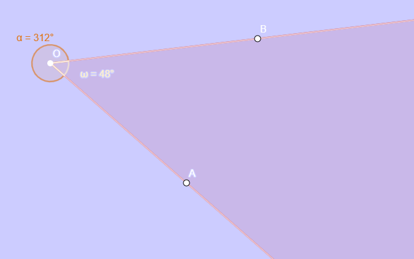
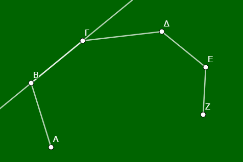
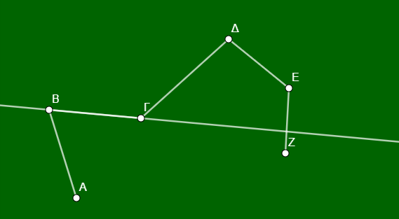
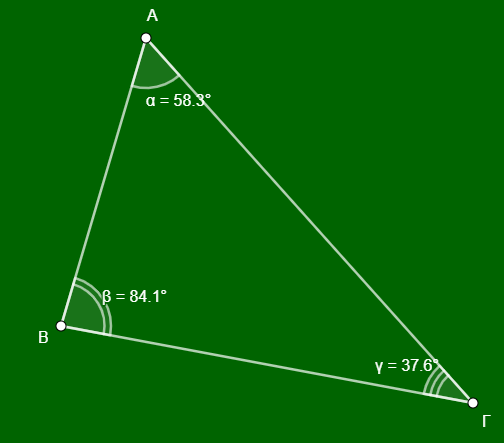
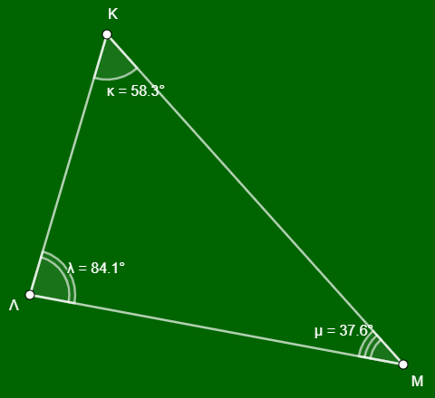

\usepackage{wasysym}

```{=html}
<!-- Φόρτωση βιβλιοθήκης GeoGebra -->
<script src="https://www.geogebra.org/apps/deployggb.js"</script>

<!-- Συνάρτηση δημιουργίας applets -->
<script>
function createGeoGebra(containerId, materialId, width = 700, height = 500) {
  var params = {
    "id": "ggb-" + containerId,
    "material_id": materialId,
    "width": width,
    "height": height,
    "showToolBar": true,
    "showMenuBar": false,
    "showAlgebraInput": true
  };
  
  var applet = new GGBApplet(params, '5.2');
  applet.inject(containerId);
}
</script>
```

------------------------------------------------------------------------

Η έννοια της **γωνίας** αποτελεί θεμελιώδες στοιχείο της Γεωμετρίας, επιτρέποντας τη μελέτη των τριγώνων, των πολυγώνων και του κύκλου.
Ακολουθεί μια αναλυτική παρουσίαση της θεωρίας και ενδεικτικές ασκήσεις βασισμένες στις πηγές.

## **Θεωρία Γωνιών**

#### **Ορισμός και Στοιχεία**

Γωνία ονομάζεται το γεωμετρικό σχήμα που σχηματίζεται από **δύο ημιευθείες με κοινή αρχή**.

\* **Κορυφή:** Η κοινή αρχή των ημιευθειών (π.χ. το σημείο Ο).

\* **Πλευρές:** Οι δύο ημιευθείες που σχηματίζουν τη γωνία (π.χ. Οχ και Οy).

\* **Συμβολισμός:** Συμβολίζεται με τρία κεφαλαία γράμματα, όπου το μεσαίο είναι η κορυφή (π.χ. $\widehat{AOB}$), ή με ένα μικρό γράμμα στο εσωτερικό της (π.χ. $\hat{\omega}$).



#### **Κυρτή και Μη Κυρτή Γωνία**

-   **Κυρτή γωνία:** Όταν από ένα σημείο Ο φέρουμε δύο ημιευθείες Οχ και Οy, τότε σχηματίζονται δύο γωνίες. Η μικρότερη απο αυτές (σχ. 1 : η $\hat ω$ είναι **κυρτή γωνία** και η μεγαλύτερη (σχ. 1: η $\hatα$ είναι η **μή κυρτή**. Στα κυρτά πολύγωνα, όλες οι εσωτερικές γωνίες είναι μικρότερες από 180°.Μια μη κυρτή γωνία είναι μεγαλύτερη από μια ευθεία γωνία (180°) αλλά μικρότερη από μια πλήρη γωνία (360°).
-   Παρόμοια μπορούμε να πούμε ότι μια τεθλασμένη γραμμή είναι κυρτή αν κάθε ευθεία που περνάει από μια πλευρά της αφήνει όλο το σχήμα απο την μια μεριά

\


\
διαφορετικά είναι μη κυρτή.

\


#### **2. Σχέσεις Γωνιών και Πλευρών σε Τρίγωνο**

Σε ένα τρίγωνο (π.χ. ΑΒΓ), οι γωνίες και οι πλευρές συνδέονται με τους εξής όρους:

\* **Περιεχομένη γωνία:** Είναι η γωνία που σχηματίζεται μεταξύ δύο πλευρών.



Για παράδειγμα, η γωνία $\widehat{A}$ περιέχεται στις πλευρές ΑΒ και ΑΓ.
Αντίστοιχα, η γωνία που βρίσκεται μεταξύ των πλευρών ΑΒ και ΒΓ είναι η $\widehat{B}$.

\* **Προσκείμενη γωνία:** Είναι οι γωνίες που "βρίσκονται" πάνω σε μια πλευρά, δηλαδή έχουν τη μία τους πλευρά πάνω στο ευθύγραμμο τμήμα της πλευράς αυτής.
Για παράδειγμα, οι γωνίες $\widehat{B}$ και $\widehat{\Gamma}$ είναι προσκείμενες στην πλευρά ΒΓ.

\* **Απέναντι γωνία:** Είναι η γωνία που βρίσκεται απέναντι από μια συγκεκριμένη πλευρά.
Για παράδειγμα, η γωνία $\widehat{A}$ βρίσκεται απέναντι από την πλευρά ΒΓ.
Αντίστοιχα, η πλευρά που βρίσκεται απέναντι από τη γωνία $\widehat{\Gamma}$ είναι η ΑΒ.

------------------------------------------------------------------------

### **Ασκήσεις και Εφαρμογές**

**Άσκηση 1 (Συμπλήρωση Κενών):** Στο τρίγωνο ΚΛΜ:



1\.
Η περιεχόμενη γωνία των πλευρών ΛΚ και ΛΜ είναι η γωνία **..........**.

2\.
Η πλευρά ΛΜ έχει απέναντι γωνία την **..........**.

3\.
Οι προσκείμενες γωνίες της πλευράς ΛΚ είναι οι **..........** και **..........**.

4\.
Η γωνία $\widehat{M}$ περιέχεται στις πλευρές **..........** και **..........**.

\* *(Λύσεις: 1.* $\widehat{\Lambda}$, 2. $\widehat{K}$, 3. $\widehat{K}$ και $\widehat{\Lambda}$, 4. ΜΚ και ΜΛ).

**Άσκηση 2 (Αναγνώριση σε Σχήμα):** Σε ένα τρίγωνο ΑΒΓ, (σχεδιάστε το τρίγωνο) βρείτε:

1\.
Ποια γωνία του τριγώνου περιέχεται στις πλευρές ΑΒ και ΓΑ;

2\.
Ποια πλευρά είναι απέναντι από τη γωνία $\widehat{B}$;

3\.
Ποιες γωνίες είναι προσκείμενες στην πλευρά ΓΒ;

\* *(Απαντήσεις: 1. Η* $\widehat{A}$, 2. Η πλευρά ΑΓ, 3. Οι γωνίες $\widehat{B}$ και $\widehat{\Gamma}$).

**Άσκηση 3 (Σωστό/Λάθος):**

1\.
Μια τεθλασμένη γραμμή ονομάζεται κυρτή όταν η προέκταση κάθε πλευράς της αφήνει όλες τις άλλες πλευρές της στο ίδιο ημιεπίπεδο.
**(Σ)**.

2\.
Σε ένα ισοσκελές τρίγωνο, οι προσκείμενες στη βάση γωνίες είναι άνισες.
**(Λ)**.

3\.
Μια μη κυρτή γωνία είναι πάντα μικρότερη από μια ορθή γωνία.
**(Λ)**.

4\.
Η γωνία που περιέχεται στις κάθετες πλευρές ενός ορθογωνίου τριγώνου είναι 90°.
**(Σ)**.

**Άσκηση 4 (Σύγκριση):** Δίνονται τρεις γωνίες: μία οξεία, μία ορθή και μία αμβλεία.
Ποια είναι η μεγαλύτερη και ποια η μικρότερη;

\* *Απάντηση: Μεγαλύτερη είναι η αμβλεία και μικρότερη η οξεία.*

**Άσκηση 5 (Κατασκευή):** Σχεδιάστε μια κυρτή γωνία 120° και ονομάστε την $\widehat{AOB}$.
Στη συνέχεια, σκιάστε την αντίστοιχη μη κυρτή γωνία.

#### **2. Ταξινόμηση Γωνιών βάσει Μέτρου**

Οι γωνίες ταξινομούνται ανάλογα με το άνοιγμά τους σε σχέση με την **ορθή γωνία** (90°):

| Είδος Γωνίας | Μέτρο ($\phi$) | Περιγραφή |
|:-----------------------|:-----------------------|:-----------------------|
| **Μηδενική** | $\phi = 0^\circ$ | Οι πλευρές συμπίπτουν. |
| **Οξεία** | $0^\circ < \phi < 90^\circ$ | Μικρότερη από την ορθή. |
| **Ορθή** | $\phi = 90^\circ$ | Οι πλευρές είναι κάθετες μεταξύ τους. |
| **Αμβλεία** | $90^\circ < \phi < 180^\circ$ | Μεγαλύτερη από την ορθή, μικρότερη από την ευθεία. |
| **Ευθεία** | $\phi = 180^\circ$ | Οι πλευρές είναι αντικείμενες ημιευθείες. |
| **Πλήρης** | $\phi = 360^\circ$ | Οι πλευρές συμπίπτουν μετά από πλήρη περιστροφή. |

### **Θεωρία Ευθυγράμμων Σχημάτων**

-    **Ορισμός:** Το **ευθύγραμμο σχήμα** (ή πολύγωνο) ορίζεται ως το σχήμα που σχηματίζεται από μια **κλειστή τεθλασμένη γραμμή**, της οποίας οι πλευρές τέμνονται μόνο σε σημεία που αποτελούν κορυφές του.

- **Στοιχεία:** Τα πολύγωνα αποτελούνται από **πλευρές** και **κορυφές**.
    Ο αριθμός των κορυφών ή των πλευρών καθορίζει την ονομασία τους:

  * **Τρίγωνο:** 3 κορυφές.

  * **Τετράπλευρο:** 4 κορυφές.

  * **Πεντάγωνο:** 5 κορυφές.

  * **Εξάγωνο:** 6 κορυφές.

- ***Κανονικό Πολύγωνο:** Ονομάζεται το πολύγωνο που έχει **όλες τις πλευρές του ίσες** και **όλες τις γωνίες του ίσες**.

- **Περίμετρος (Π):** Είναι το **άθροισμα των μηκών** όλων των πλευρών του πολυγώνου.

### **Θεωρία Ίσων Σχημάτων**

-   **Ορισμός Ισότητας:** Δύο ευθύγραμμα σχήματα ονομάζονται **ίσα** όταν, αν τοποθετηθούν το ένα πάνω στο άλλο με κατάλληλη μετατόπιση ή στροφή, **συμπίπτουν**.

-   **Αντίστοιχα Στοιχεία:** Στα ίσα σχήματα, όλες οι **αντίστοιχες πλευρές και γωνίες** (καθώς και οι διαγώνιοι) είναι ίσες μία προς μία.

   

### **Ασκήσεις και Εφαρμογές**

**Άσκηση 1 (Συμπλήρωση Κενών):**

1.  Δύο ευθύγραμμα σχήματα λέγονται ίσα αν **....................** όταν τοποθετήσουμε το ένα **....................**.

2.  Οι αντίστοιχες πλευρές και γωνίες των ίσων σχημάτων είναι **....................**.

3.  Ένα πολύγωνο ονομάζεται κανονικό, όταν έχει όλες τις **....................** του ίσες και όλες τις **....................** του ίσες.

 

-   *(Λύσεις: 1. συμπίπτουν, πάνω στο άλλο, 2. ίσες, 3. πλευρές, γωνίες)*.

  

**Άσκηση 2 (Περίμετρος):** Να βρεθεί η περίμετρος ενός τριγώνου με πλευρές 2,3 dm, 45 mm και 5 cm.

-   **Λύση:** Πρέπει πρώτα να μετατρέψουμε όλες τις μονάδες σε εκατοστά (cm): 2,3 dm = 23 cm και 45 mm = 4,5 cm.
    Περίμετρος Π = 23 + 4,5 + 5 = **32,5 cm**.

**Άσκηση 3 (Γεωμετρική Αναγνώριση):** Σε ένα παραλληλόγραμμο ΑΒΓΔ, αν η περίμετρος είναι 20 cm και η πλευρά ΑΒ είναι 5 cm, να βρεθούν οι υπόλοιπες πλευρές.

-   **Λύση:** Στο παραλληλόγραμμο οι απέναντι πλευρές είναι ίσες, άρα ΓΔ = ΑΒ = 5 cm.
    Το άθροισμα των άλλων δύο ίσων πλευρών (ΑΔ + ΒΓ) είναι 20 - (5 + 5) = 10 cm, άρα ΑΔ = ΒΓ = **5 cm** (Στην περίπτωση αυτή το σχήμα είναι ρόμβος).


::: {style="background-color: #f0f8cc; border: 2px solid #2f3e50; color: #25188a; padding: 15px; border-radius: 5px;"}
1.  **Πολλαπλασιασμός δυνάμεων με την ίδια βάση:** $α^μ \cdot α^ν = α^{μ+ν}$.
2.  **Διαίρεση δυνάμεων με την ίδια βάση:** $α^μ : α^ν = α^{μ-ν}$.
3.  **Δύναμη γινομένου:** $(α \cdot β)^ν = α^ν \cdot β^ν$.
4.  **Δύναμη πηλίκου:** $(\frac{α}{β})^ν = \frac{α^ν}{β^ν}$.
5.  **Δύναμη δύναμης:** $(α^μ)^ν = α^{μ \cdot ν}$.
:::
