\usepackage{wasysym}

```{=html}
<!-- Φόρτωση βιβλιοθήκης GeoGebra -->
<script src="https://www.geogebra.org/apps/deployggb.js"</script>

<!-- Συνάρτηση δημιουργίας applets -->
<script>
function createGeoGebra(containerId, materialId, width = 700, height = 500) {
  var params = {
    "id": "ggb-" + containerId,
    "material_id": materialId,
    "width": width,
    "height": height,
    "showToolBar": true,
    "showMenuBar": false,
    "showAlgebraInput": true
  };
  
  var applet = new GGBApplet(params, '5.2');
  applet.inject(containerId);
}
</script>
```

------------------------------------------------------------------------

Στη γεωμετρία, το **σημείο** και η **γραμμή** (ειδικότερα η ευθεία) αποτελούν **πρωταρχικές έννοιες**, οι οποίες δεν ορίζονται αυστηρά αλλά γίνονται αντιληπτές μέσα από την εμπειρία και περιγράφονται από αξιώματα.

## Το Σημείο

Το σημείο είναι η πιο στοιχειώδη έννοια του χώρου και ο Ευκλείδης το περιέγραψε ως «εκείνο που δεν έχει μέρη».

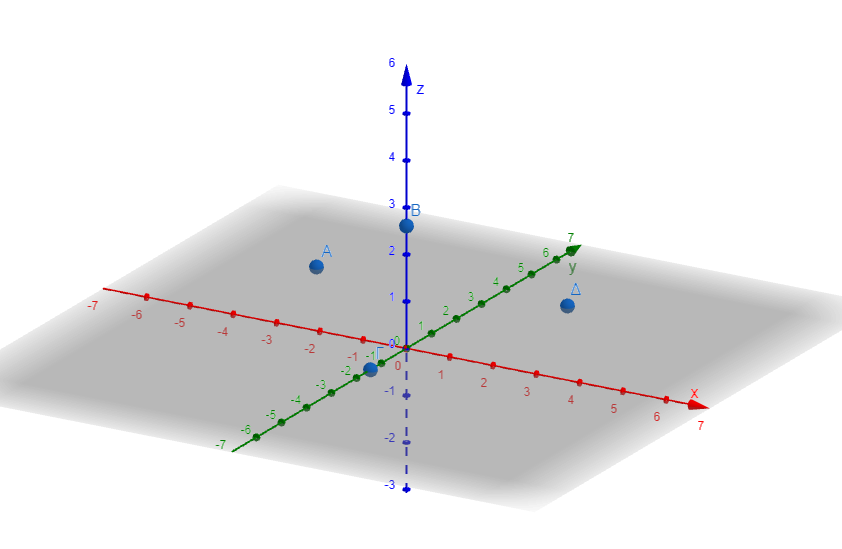

\* **Διαστάσεις:** Το σημείο έχει **μηδενικές διαστάσεις** (δεν έχει μήκος, πλάτος ή ύψος), γεγονός που το καθιστά πρακτικά αόρατο και άυλο.

\* **Αναπαράσταση και Συμβολισμός:** Σχεδιάζεται συνήθως ως μια τελεία και συμβολίζεται με ένα **κεφαλαίο γράμμα** (π.χ. $A, B, \Gamma$).

\* **Λειτουργία:** Προσδιορίζει μια θέση στον χώρο και αποτελεί το δομικό στοιχείο όλων των άλλων γεωμετρικών σχημάτων.

## Η Γραμμή και η Ευθεία

Η γραμμή μπορεί να θεωρηθεί ως μια συνεχής σειρά θέσεων που παίρνει ένα κινούμενο σημείο.
Η **ευθεία γραμμή** είναι ένα γεωμετρικό σχήμα **μίας διάστασης** (μήκος χωρίς πλάτος).

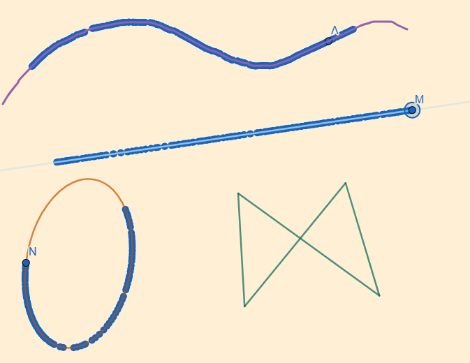

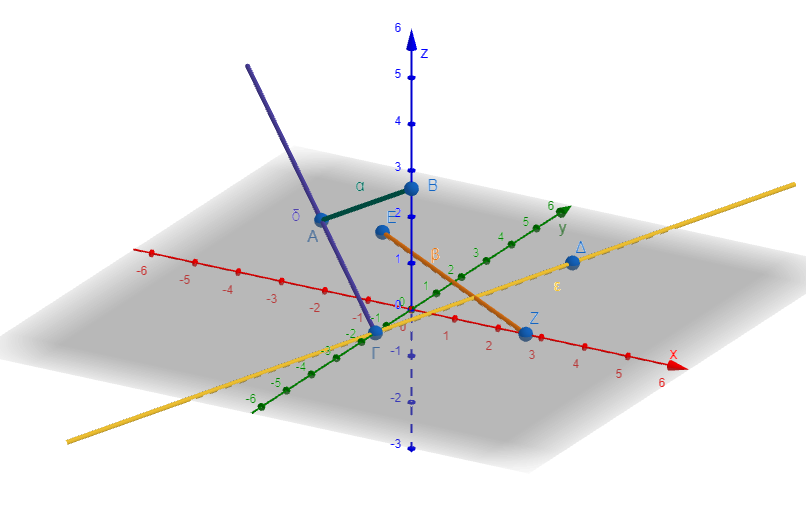

\* **Χαρακτηριστικά:** Η ευθεία έχει **άπειρο μήκος**, δεν έχει αρχή ούτε τέλος και εκτείνεται απεριόριστα και προς τις δύο κατευθύνσεις.

\* **Συμβολισμός:** Συμβολίζεται με ένα **μικρό γράμμα** (π.χ. $\epsilon, \zeta$) ή με δύο κεφαλαία γράμματα σημείων που ανήκουν σε αυτήν ($AB$).

\* **Είδη Γραμμών:**

\* **Ευθύγραμμο τμήμα:** Το μέρος μιας ευθείας που περικλείεται μεταξύ δύο σημείων (άκρα), έχοντας πεπερασμένο μήκος.

\* **Ημιευθεία:** Το τμήμα μιας ευθείας που ξεκινά από ένα σημείο (αρχή) και εκτείνεται επ' άπειρον προς μία κατεύθυνση.

\* **Τεθλασμένη γραμμή:** Μια γραμμή που αποτελείται από διαδοχικά ευθύγραμμα τμήματα που δεν είναι όλα συνευθειακά.

\* **Καμπύλη γραμμή:** Γραμμές που δεν είναι ευθείες, όπως ένας κύκλος.

### Σχέσεις Σημείων και Γραμμών

Η Ευκλείδεια Γεωμετρία στηρίζεται σε βασικές παραδοχές (αξιώματα) για τη σχέση αυτών των εννοιών:

\* **Προσδιορισμός ευθείας:** Από δύο οποιαδήποτε διαφορετικά σημεία διέρχεται **μία και μόνο μία ευθεία**.

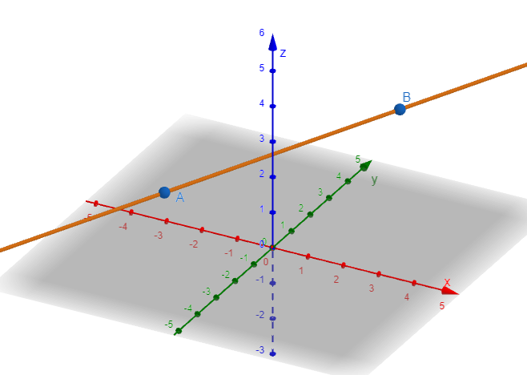

\* **Δέσμη ευθειών:** Από ένα μόνο σημείο διέρχονται **άπειρες ευθείες**.

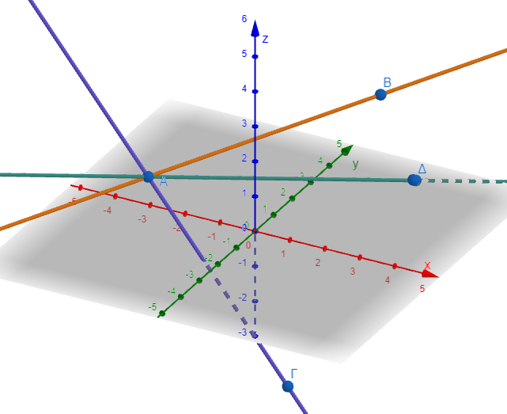

\* **Συνευθειακά σημεία:** Τα σημεία που ανήκουν στην ίδια ευθεία ονομάζονται συνευθειακά.

\* **Σχετικές θέσεις ευθειών:** Δύο ευθείες στο ίδιο επίπεδο μπορεί να **ταυτίζονται** (όλα τα σημεία κοινά), να **τέμνονται** (ένα κοινό σημείο) ή να είναι **παράλληλες** (κανένα κοινό σημείο).
Στον τρισδιάστατο χώρο, αν δύο ευθείες δεν τέμνονται και δεν είναι παράλληλες, ονομάζονται **ασύμβατες**.

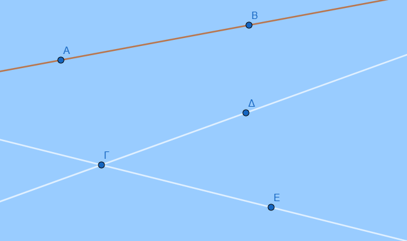

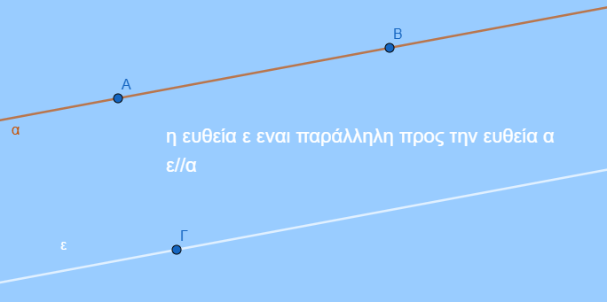

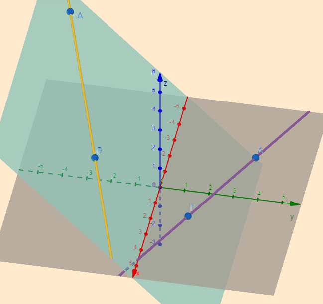

-   **Αντικείμενες ημιευθείες:** Δύο ημιευθείες που έχουν την ίδια αρχή, βρίσκονται στην ίδια ευθεία (ίδιο φορέα) και έχουν αντίθετες κατευθύνσεις.

::: {style="background-color: #f0f8cc; border: 2px solid #2f3e50; color: #25188a; padding: 15px; border-radius: 5px;"}
-   *Σημείωση:* Αν δύο ευθείες τέμνονται σχηματίζοντας ορθές γωνίες, ονομάζονται **κάθετες** ($\epsilon \perp \zeta$).
:::

### Ενδεικτικές Ασκήσεις

**Α. Ερωτήσεις Θεωρίας (Σωστό/Λάθος & Συμπλήρωση Κενών)**

1.  Από ένα σημείο διέρχονται ............
    ευθείες.

2.  Δύο ημιευθείες με κοινή αρχή είναι πάντα αντικείμενες.
    (Λάθος, πρέπει να ανήκουν στην ίδια ευθεία).

3.  Πόσες διαστάσεις έχει ένα σημείο; (0).

4.  Πόσες ευθείες διέρχονται από τρία μη συνευθειακά σημεία; (Καμία).

**Β. Ασκήσεις Ονοματολογίας και Σχεδίασης**

1.  Σχεδιάστε μια ευθεία $x'x$ και σημειώστε τέσσερα διαδοχικά σημεία $A, B, K, \Delta$.

-   Γράψτε όλα τα ευθύγραμμα τμήματα που ορίζονται (π.χ. $AB, AK, A\Delta, BK, B\Delta, K\Delta$).

-   Ονομάστε την αντικείμενη ημιευθεία της $Kx'$ (είναι η $Kx$ ή $K\Delta$).

2.  Σχεδιάστε ένα ευθύγραμμο τμήμα $HK$ και ένα σημείο $\Lambda$ εκτός αυτού.

3.  Αν $M$ είναι το μέσο ενός τμήματος $AB$, σχεδιάστε τις αντικείμενες ημιευθείες $MA$ και $MB$.

4.  Στο παρακάτω σχήμα ονομάστε όλες τις ημιευθείες.\

    \
    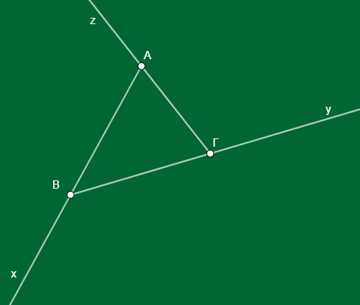

5.  Στο παρακάτω σχήμα ονόμασε όλα τα σημεία και μετά γράψε όλα τα ευθύγραμμα τμήματα που σχηματίζονται.\

    \

**Γ. Σύνθετα Προβλήματα Λογικής**

1.  **Υπολογισμός Πλήθους:** Αν δοθούν 6 σημεία στο επίπεδο, ανά 3 μη συνευθειακά, πόσες ευθείες ορίζονται συνολικά; (Απάντηση: 15 ευθείες).

2.  **Κοινά Σημεία:** Πόσα κοινά σημεία έχουν οι ημιευθείες $AB$ και $BA$ αν το $A$ και το $B$ ανήκουν στην ίδια ευθεία; (Άπειρα, όλο το τμήμα $AB$).

3.  **Σχετικές Θέσεις:** Σχεδιάστε τρεις ευθείες $\epsilon, \lambda, \sigma$ που να μην είναι παράλληλες ανά δύο και να μην διέρχονται και οι τρεις από το ίδιο σημείο.
    Πόσα σημεία τομής προκύπτουν; (3 σημεία).

## Θεωρία: Το Επίπεδο

Το επίπεδο είναι μια **πρωταρχική έννοια** που δεν ορίζεται αυστηρά, αλλά γίνεται αντιληπτή μέσω εμπειρικών παραδειγμάτων, όπως η επιφάνεια ενός καθρέφτη, ενός λείου δαπέδου ή ενός τραπεζιού.

-   **Διαστάσεις και Έκταση:** Το επίπεδο έχει **δύο διαστάσεις** (μήκος και πλάτος).
    Θεωρείται μια επιφάνεια **άπειρη**, χωρίς πάχος, που επεκτείνεται απεριόριστα προς όλες τις κατευθύνσεις, στερούμενη αρχής και τέλους.

-   **Συμβολισμός:** Συνήθως σχεδιάζεται ως παραλληλόγραμμο και συμβολίζεται με ένα κεφαλαίο γράμμα (π.χ. $P$ ή $\Pi$) ή ένα μικρό ελληνικό γράμμα (π.χ. $\pi, \sigma$).

-   **Καθορισμός Επιπέδου:** Ένα επίπεδο προσδιορίζεται μονοσήμαντα από:

1.  **Τρία μη συνευθειακά σημεία** (δηλαδή σημεία που δεν ανήκουν στην ίδια ευθεία).

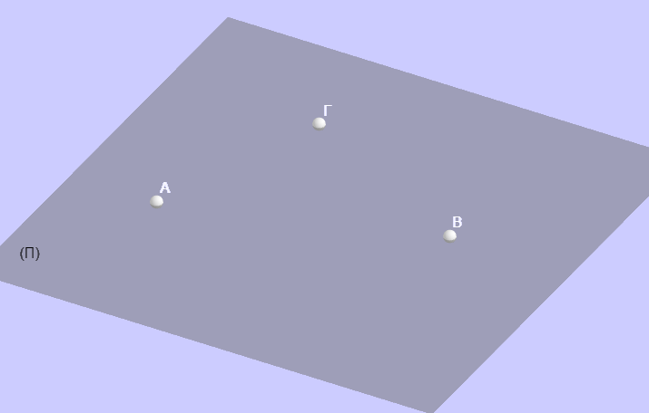

2.  Μια **ευθεία και ένα σημείο** εκτός αυτής.\

    \
    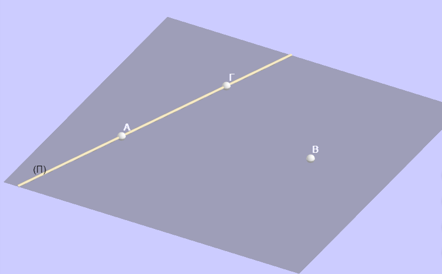

3.  Δύο **τεμνόμενες ευθείες**.\

    \
    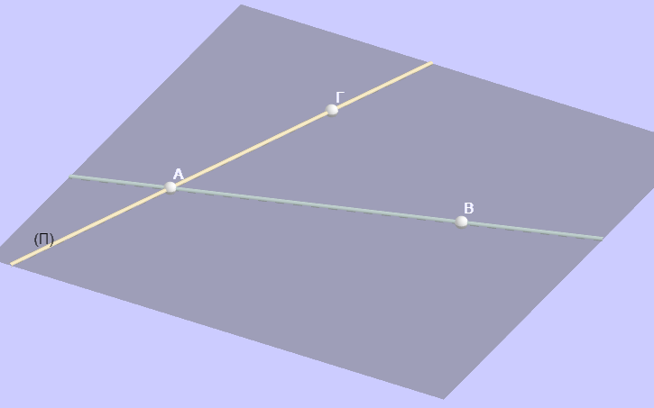

4.  Δύο **παράλληλες ευθείες**.

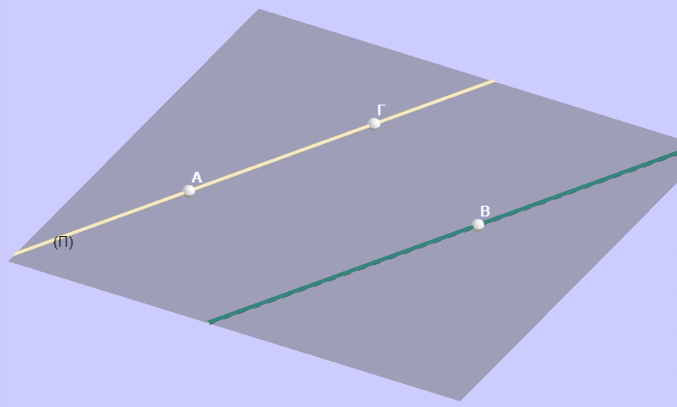

\

## Θεωρία: Το Ημιεπίπεδο

Όπως ένα σημείο χωρίζει μια ευθεία σε δύο ημιευθείες, έτσι και μια ευθεία χωρίζει ένα επίπεδο σε δύο μέρη.

-   **Ορισμός:** Κάθε ευθεία $\epsilon$ ενός επιπέδου το χωρίζει σε δύο μέρη που ονομάζονται **ημιεπίπεδα**.

-   **Αρχική Ευθεία ή Σύνορο:** Η ευθεία $\epsilon$ ονομάζεται **όριο** ή **σύνορο** των δύο ημιεπιπέδων.
    Τα δύο ημιεπίπεδα δεν έχουν κοινά σημεία μεταξύ τους, εκτός από τα σημεία της αρχικής ευθείας.\

    \
    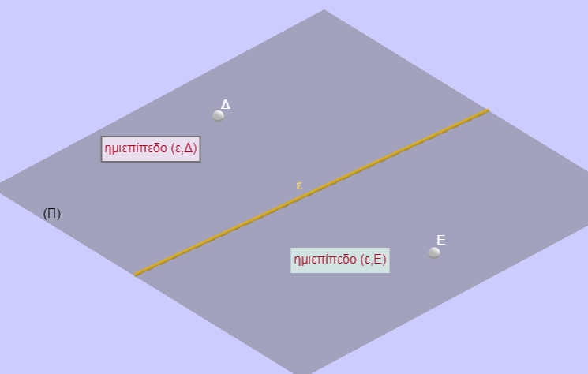

-   **Συμβολισμός:** Ένα ημιεπίπεδο συμβολίζεται με την αρχική ευθεία και ένα σημείο του, π.χ.
    $(\epsilon, A)$.

-   **Κυρτότητα:** Το ημιεπίπεδο είναι **κυρτό σύνολο**.
    Αυτό σημαίνει ότι αν επιλέξουμε δύο τυχαία σημεία $M$ και $N$ εντός ενός ημιεπιπέδου, ολόκληρο το ευθύγραμμο τμήμα $MN$ θα βρίσκεται μέσα στο ίδιο ημιεπίπεδο.

### Ενδεικτικές Ασκήσεις και Εφαρμογές

**Α. Ερωτήσεις Κατανόησης**

1.  **Γιατί ένα σκαμνί με τρία πόδια δεν "τρεκλίζει" ποτέ;**

-   *Απάντηση:* Επειδή τρία σημεία ορίζουν πάντα ένα μοναδικό επίπεδο, τα άκρα των τριών ποδιών θα εφάπτονται πάντα στο επίπεδο του δαπέδου

2.  **Πόσα επίπεδα διέρχονται από δύο σημεία** $A$ και $B$;

-   *Απάντηση:* Από δύο σημεία διέρχονται **άπειρα** επίπεδα (φανταστείτε τις σελίδες ενός βιβλίου που ανοίγουν γύρω από τη ράχη του).

3.  **Ποιο είναι το όριο ενός ημιεπιπέδου;**

-   *Απάντηση:* Το όριο είναι η ευθεία που χώρισε το αρχικό επίπεδο στα δύο.

**Β. Ασκήσεις Σχεδίασης και Λογικής**

1.  **Σχεδίαση Ημιεπιπέδων:** Σχεδιάστε ένα επίπεδο $\pi$ και μια ευθεία $\epsilon$ εντός αυτού.
    Ονομάστε τα δύο ημιεπίπεδα που προκύπτουν.

2.  **Σχετικές Θέσεις:** Αν δύο σημεία $A$ και $B$ βρίσκονται σε διαφορετικά ημιεπίπεδα ως προς μια ευθεία $\epsilon$, τι συμβαίνει με το ευθύγραμμο τμήμα $AB$;

-   *Απάντηση:* Το τμήμα $AB$ υποχρεωτικά **τέμνει** την ευθεία $\epsilon$.

3.  **Συνεπίπεδα Σχήματα:** Αναγνωρίστε στην αίθουσα διδασκαλίας δύο επίπεδα που είναι παράλληλα (π.χ. δάπεδο και οροφή) και δύο που τέμνονται (π.χ. δύο διπλανοί τοίχοι).


