\usepackage{wasysym}

```{=html}
<!-- Φόρτωση βιβλιοθήκης GeoGebra -->
<script src="https://www.geogebra.org/apps/deployggb.js"</script>

<!-- Συνάρτηση δημιουργίας applets -->
<script>
function createGeoGebra(containerId, materialId, width = 700, height = 500) {
  var params = {
    "id": "ggb-" + containerId,
    "material_id": materialId,
    "width": width,
    "height": height,
    "showToolBar": true,
    "showMenuBar": false,
    "showAlgebraInput": true
  };
  
  var applet = new GGBApplet(params, '5.2');
  applet.inject(containerId);
}
</script>
```

------------------------------------------------------------------------


## Σημείο-Ευθύγραμμο Τμήμα-Ευθεία-Ημιευθεία-Επίπεδο-Ημιεπίπεδο

### **Σχεδίαση και Συμβολισμός (Σημείο, Ευθεία, Τμήμα, Ημιευθεία)**

::: {style="background-color: #c0d4b8; border: 2px solid #2f3e50; color: #25188a; padding: 15px; border-radius: 5px;"}

**Θεωρία – Ορισμοί – Ιδιότητες**

*   **Σημείο:** Δεν έχει καμία διάσταση (μήκος, πλάτος, ύψος), γεγονός που το καθιστά πρακτικά αόρατο και άυλο. Παριστάνεται με μια κοκκίδα και συμβολίζεται με ένα κεφαλαίο γράμμα (π.χ. Α, Β) 

Το σημείο είναι η πιο στοιχειώδη έννοια του χώρου και ο Ευκλείδης το περιέγραψε ως «εκείνο που δεν έχει μέρη».

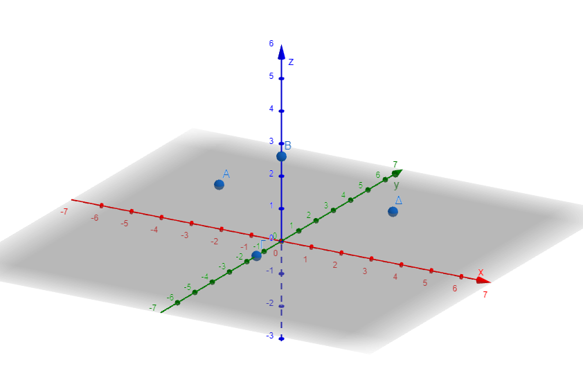


* **Λειτουργία:** Προσδιορίζει μια θέση στον χώρο και αποτελεί το δομικό στοιχείο όλων των άλλων γεωμετρικών σχημάτων.

---

*   **Γραμμή:** Είναι το σύνολο των ιχνών (τροχιά) ενός κινητού σημείου. Είναι ένα άπειρο σύνολο σημείων.

Η γραμμή μπορεί να θεωρηθεί ως μια συνεχής σειρά θέσεων που παίρνει ένα κινούμενο σημείο.


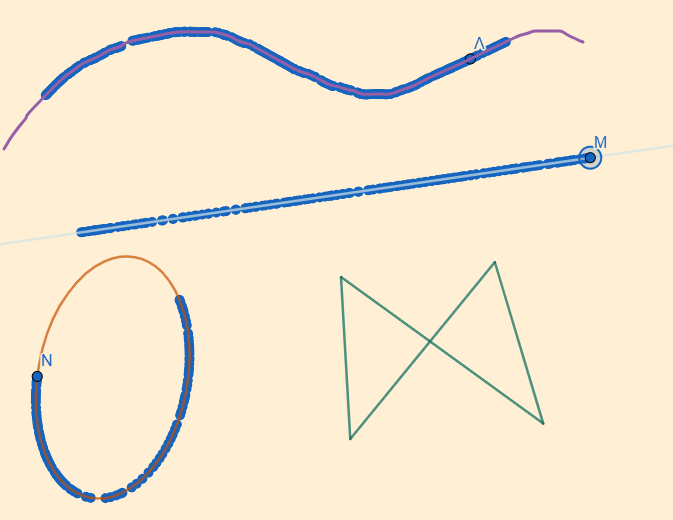

* **Είδη Γραμμών:**

  * **Ευθύγραμμο τμήμα:** Το μέρος μιας ευθείας που περικλείεται μεταξύ δύο σημείων (άκρα), έχοντας πεπερασμένο μήκος.

  * **Ημιευθεία:** Το τμήμα μιας ευθείας που ξεκινά από ένα σημείο (αρχή) και εκτείνεται επ' άπειρον προς μία κατεύθυνση.

  * **Τεθλασμένη γραμμή:** Μια γραμμή που αποτελείται από διαδοχικά ευθύγραμμα τμήματα που δεν είναι όλα συνευθειακά.

  * **Καμπύλη γραμμή:** Γραμμές που δεν είναι ευθείες, όπως ένας κύκλος.

---

*   **Ευθεία:** Η απλούστερη γραμμή, άπειρη και προς τις δύο διευθύνσεις. Συμβολίζεται με δύο σημεία της (π.χ. ευθεία ΓΔ), με ένα μικρό γράμμα (π.χ. ευθεία ε) ή με δύο μικρά γράμματα στα άκρα (π.χ. xy).
*   **Ημιευθεία:** Ένα σημείο (αρχή) πάνω σε μια ευθεία τη χωρίζει σε δύο μέρη που λέγονται ημιευθείες. Συμβολίζεται με την αρχή και την κατεύθυνσή της (π.χ. Γδ).
*   **Ευθύγραμμο Τμήμα:** Μέρος ευθείας που περιορίζεται από δύο σημεία (άκρα). Συμβολίζεται ως ΑΒ ή [ΑΒ].

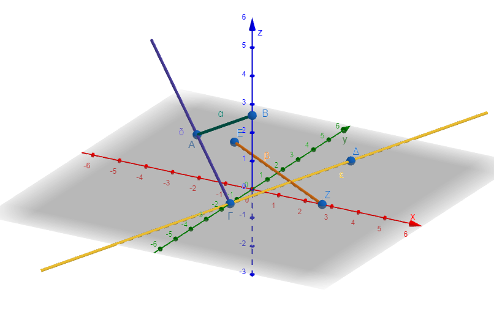


:::


**Παραδείγματα**

1.  Σχεδίαση σημείου Γ και ονομασία του.
2.  Σχεδίαση ευθείας (ε) με χρήση χάρακα.
3.  Σχεδίαση ευθυγράμμου τμήματος [ΚΛ] μήκους 5cm.
4.  Ορισμός ημιευθείας Οχ με αρχή το Ο πάνω στην ευθεία χ'χ.


**Ασκήσεις**

1.  Σχεδιάστε τρία σημεία Α, Β, Γ και ονομάστε τα.
2.  Χαράξτε μια γραμμή (γ) και σημειώστε ένα σημείο Μ πάνω της και ένα σημείο Ν εκτός αυτής.
3.  Σχεδιάστε μια ευθεία xy και ορίστε πάνω της δύο σημεία Α και Β.
4.  Συμβολίστε ένα κλειστό ευθύγραμμο τμήμα με άκρα Δ και Ε.
5.  Σχεδιάστε δύο αντίθετες ημιευθείες Οχ και Οy.
6.  Σχεδιάστε ένα επίπεδο (ρ) και μια ευθεία (δ) που δεν ανήκει σε αυτό.
7.  Ονομάστε τα δύο ημιεπίπεδα που ορίζει η ευθεία ΑΒ στο επίπεδο Π.
8.  Χαράξτε τρεις διαφορετικές γραμμές που να περνούν από τα σημεία Α και Β.
9.  Σχεδιάστε ένα σημείο και συμβολίστε το ως τομή δύο ευθειών.
10. Σχεδιάστε ένα ευθύγραμμο τμήμα ΑΒ και σημειώστε το μέσο του Μ.
11. Σχεδιάστε μια ημιευθεία Αχ και μια ημιευθεία Αy που να μην είναι αντίθετες.
12. Σχεδιάστε ένα επίπεδο και σημειώστε τρία σημεία που ανήκουν σε αυτό.
13. Πώς συμβολίζουμε μια ημιευθεία με αρχή το σημείο Κ που περνά από το Λ;.
14. Σχεδιάστε μια τεθλασμένη γραμμή με 4 κορυφές.
15. Χρησιμοποιήστε το σύμβολο του ανήκει (∈) για ένα σημείο Α και μια ευθεία ε.

---

### **Διαφορά Ευθυγράμμου Τμήματος και Ευθείας**

::: {style="background-color: #c0d4b8; border: 2px solid #2f3e50; color: #25188a; padding: 15px; border-radius: 5px;"}

**Θεωρία – Ορισμοί – Ιδιότητες**

*   **Ευθεία:** Είναι απεριόριστη και προς τα δύο μέρη, δεν έχει άκρα και το μήκος της είναι άπειρο. Ορίζεται από δύο σημεία αλλά επεκτείνεται πέρα από αυτά.
*   **Ευθύγραμμο Τμήμα:** Είναι ένα "κομμάτι" ευθείας που περιλαμβάνει δύο ορισμένα σημεία (άκρα) και όλα τα σημεία που βρίσκονται ανάμεσά τους. Έχει συγκεκριμένο μήκος που μπορεί να μετρηθεί.
*   **Βασική Διαφορά:** Η ευθεία είναι άπειρο σημειοσύνολο χωρίς αρχή και τέλος, ενώ το τμήμα είναι πεπερασμένο μέρος της ευθείας (γνήσιο υποσύνολο) με αρχή και τέλος.

:::

**Παραδείγματα**

1.  Μια φωτεινή ακτίνα δίνει την ιδέα της ευθείας (αν την φανταστούμε να προεκτείνεται άπειρα).
2.  Ένα τεντωμένο νήμα μεταξύ δύο καρφιών είναι ευθύγραμμο τμήμα.
3.  Η άκρη ενός χάρακα παριστάνει ένα ευθύγραμμο τμήμα.
4.  Η προέκταση ενός τμήματος ΑΒ και από τις δύο πλευρές δημιουργεί την ευθεία ΑΒ.
5.  Το μήκος ενός βιβλίου είναι ευθύγραμμο τμήμα, ενώ ο ορίζοντας θυμίζει ευθεία.

**Ασκήσεις**

1.  Σχεδιάστε το ευθύγραμμο τμήμα [ΑΒ] και την ευθεία ΑΒ. Ποια είναι η διαφορά τους;.
2.  Σημειώστε αν το τμήμα ΑΒ είναι υποσύνολο της ευθείας ΑΒ.
3.  Μετρήστε το μήκος ενός τμήματος ΓΔ. Μπορείτε να μετρήσετε το μήκος μιας ευθείας;.
4.  Πόσα άκρα έχει μια ευθεία και πόσα ένα ευθύγραμμο τμήμα;.
5.  Σχεδιάστε ένα τμήμα ΑΒ και προεκτείνετέ το μόνο προς το μέρος του Β. Τι σχήμα προκύπτει;.
6.  Πόσα σημεία περιέχει μια ευθεία και πόσα ένα τμήμα;.
7.  Σχεδιάστε μια ευθεία (ε) και ορίστε πάνω της ένα τμήμα ΚΛ.
8.  Αν Α, Β, Γ είναι σημεία στην ίδια ευθεία, ονομάστε τα τμήματα που ορίζονται.
9.  Σχεδιάστε την τομή δύο ευθυγράμμων τμημάτων που βρίσκονται στην ίδια ευθεία.
10. Μπορεί ένα ευθύγραμμο τμήμα να περιέχει μια ευθεία; Εξηγήστε.
11. Σχεδιάστε ένα τμήμα ΑΒ μήκους 4cm και μια ευθεία που να το περιέχει.
12. Ποιο σχήμα ονομάζουμε "ανοικτό ευθύγραμμο τμήμα";.
13. Σχεδιάστε δύο τμήματα που έχουν κοινό μόνο ένα άκρο.
14. Αν πάρουμε 4 σημεία σε μια ευθεία, πόσα τμήματα ορίζονται;.
15. Σχεδιάστε μια ευθεία και ένα τμήμα που να την τέμνει σε ένα σημείο.

---

### **Μοναδικότητα Ευθείας (Δύο σημεία vs Ένα σημείο)**

::: {style="background-color: #c0d4b8; border: 2px solid #2f3e50; color: #25188a; padding: 15px; border-radius: 5px;"}

**Θεωρία – Ορισμοί – Ιδιότητες**

*   **Αξίωμα:** Από δύο διαφορετικά σημεία διέρχεται μία και μόνο μία ευθεία. Λέμε ότι δύο σημεία ορίζουν μια ευθεία.

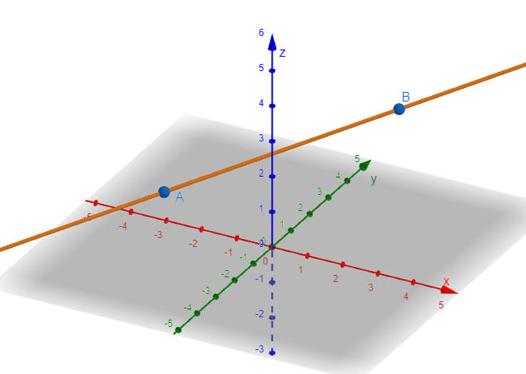

*   **Σημείο και Ευθείες:** Από ένα μόνο σημείο μπορούν να διέλθουν άπειρες ευθείες (_δέσμη ευθειών_).

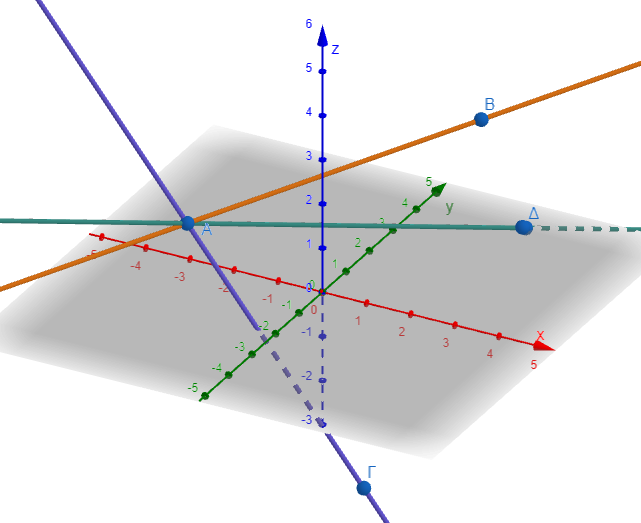

*   **Ιδιότητα:** Δύο διαφορετικές ευθείες μπορούν να έχουν το πολύ ένα κοινό σημείο (σημείο τομής).

**Συνευθειακά σημεία:** Τα σημεία που ανήκουν στην ίδια ευθεία ονομάζονται συνευθειακά.

* **Σχετικές θέσεις ευθειών:** Δύο ευθείες στο ίδιο επίπεδο μπορεί να **ταυτίζονται** (όλα τα σημεία κοινά), να **τέμνονται** (ένα κοινό σημείο) ή να είναι **παράλληλες** (κανένα κοινό σημείο).
Στον τρισδιάστατο χώρο, αν δύο ευθείες δεν τέμνονται και δεν είναι παράλληλες, ονομάζονται **ασύμβατες**.

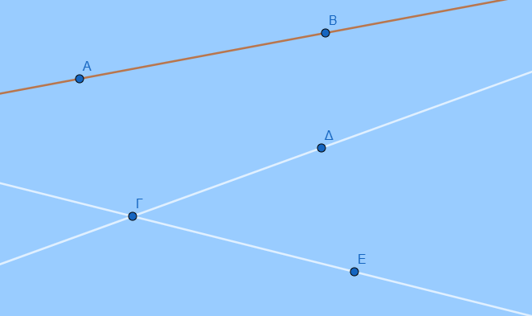

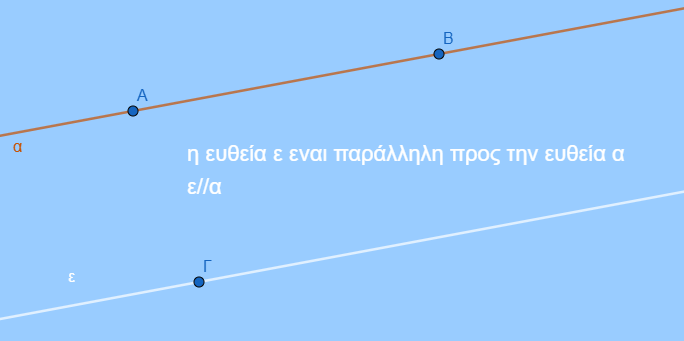

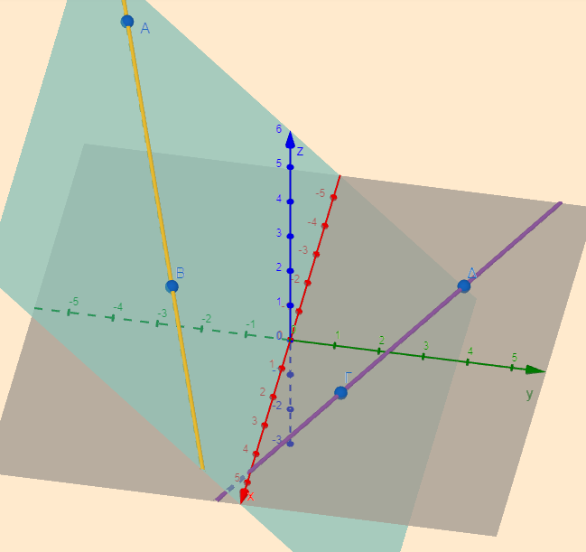

-   **Αντικείμενες ημιευθείες:** Δύο ημιευθείες που έχουν την ίδια αρχή, βρίσκονται στην ίδια ευθεία (ίδιο φορέα) και έχουν αντίθετες κατευθύνσεις.

>>> *Σημείωση:* Αν δύο ευθείες τέμνονται σχηματίζοντας ορθές γωνίες, ονομάζονται **κάθετες** ($\epsilon \perp \zeta$).


:::

**Παραδείγματα**

1.  Αν έχουμε δύο καρφιά, μπορούμε να τεντώσουμε μόνο μία κλωστή που να περνά ακριβώς και από τα δύο.
2.  Από την τρύπα μιας βελόνας (σημείο) μπορούν να περάσουν άπειρες κλωστές (ευθείες) σε διαφορετικές κατευθύνσεις.
3.  Η χάραξη γραμμής με χάρακα που εφάπτεται σε δύο σημεία Α και Β.
4.  Οι ακτίνες του ήλιου που ξεκινούν από ένα σημείο.
5.  Ο προσδιορισμός μιας ευθείας στο χαρτί σημειώνοντας δύο σταυρούς.


**Ασκήσεις**

1.  Σημειώστε δύο σημεία Α, Β και χαράξτε την ευθεία που διέρχεται από αυτά.
2.  Από ένα σημείο Ο χαράξτε 5 διαφορετικές ευθείες.
3.  Πόσες ευθείες ορίζουν 3 σημεία που δεν είναι στην ίδια ευθεία;.
4.  Σχεδιάστε δύο ευθείες που τέμνονται σε ένα σημείο Μ.
5.  Πάρτε 4 σημεία ανά τρία μη συνευθειακά. Πόσες ευθείες ορίζονται;.
6.  Μπορούν δύο διαφορετικές ευθείες να έχουν δύο κοινά σημεία;.
7.  Σχεδιάστε μια δέσμη ευθειών με κέντρο το σημείο Κ.
8.  Αν Α, Β, Γ είναι συνευθειακά, πόσες ευθείες ορίζουν;.
9.  Σχεδιάστε τρεις ευθείες που να τέμνονται ανά δύο σε διαφορετικά σημεία.
10. Πάρτε ένα σημείο Α και χαράξτε δύο κάθετες ευθείες που να περνούν από αυτό.
11. Πόσες ευθείες περνούν από το κέντρο ενός κύκλου;.
12. Σχεδιάστε δύο ευθείες που δεν έχουν κανένα κοινό σημείο (παράλληλες).
13. Πόσες ευθείες ορίζονται από 5 σημεία, όπου κανένα τρίτο δεν είναι συνευθειακό;.
14. Σχεδιάστε ένα σημείο Α και μια ευθεία ε που να μην περνά από αυτό.
15. Χαράξτε μια ευθεία και βρείτε πόσες παράλληλες προς αυτήν περνούν από ένα εξωτερικό σημείο.

---

### **Επίπεδο και Ημιεπίπεδο - Μοναδικότητα Επιπέδου (Τρία σημεία vs Ένα/Δύο σημεία)**

::: {style="background-color: #c0d4b8; border: 2px solid #2f3e50; color: #25188a; padding: 15px; border-radius: 5px;"}

**Θεωρία – Ορισμοί – Ιδιότητες**


*   **Επίπεδο:** 

Το επίπεδο είναι μια **πρωταρχική έννοια** που δεν ορίζεται αυστηρά, αλλά γίνεται αντιληπτή μέσω εμπειρικών παραδειγμάτων, όπως η επιφάνεια ενός καθρέφτη, ενός λείου δαπέδου ή ενός τραπεζιού.

  -   **Διαστάσεις και Έκταση:** Το επίπεδο έχει **δύο διαστάσεις** (μήκος και πλάτος).
    Θεωρείται μια επιφάνεια **άπειρη**, χωρίς πάχος, που επεκτείνεται απεριόριστα προς όλες τις κατευθύνσεις, στερούμενη αρχής και τέλους.

  -   **Συμβολισμός:** Συνήθως σχεδιάζεται ως παραλληλόγραμμο και συμβολίζεται με ένα κεφαλαίο γράμμα (π.χ. $P$ ή $\Pi$) ή ένα μικρό ελληνικό γράμμα (π.χ. $\pi, \sigma$).

  -   **Καθορισμός Επιπέδου:** Ένα επίπεδο προσδιορίζεται μονοσήμαντα από:
    
  *  **Τρία μη συνευθειακά σημεία** (δηλαδή σημεία που δεν ανήκουν στην ίδια ευθεία).

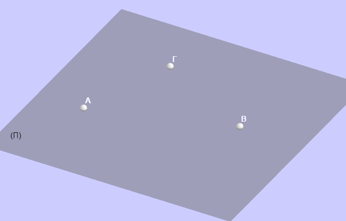

  *  Μια **ευθεία και ένα σημείο** εκτός αυτής.


  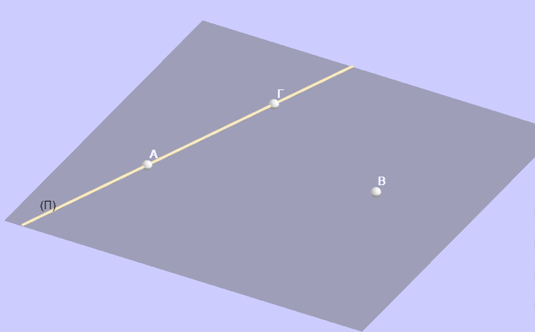

  *  Δύο **τεμνόμενες ευθείες**.\ 

    
  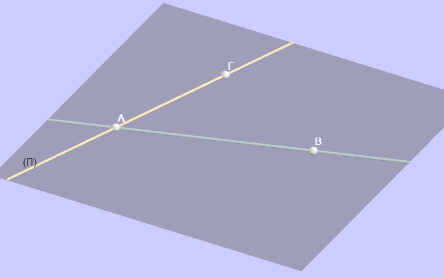

  *  Δύο **παράλληλες ευθείες**.

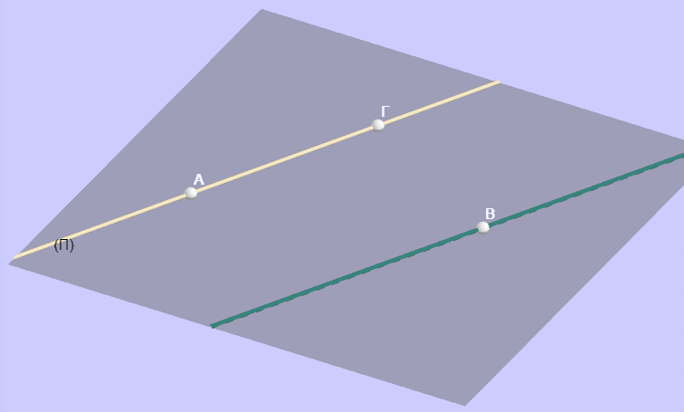


*   **Ημιεπίπεδο:** 

Όπως ένα σημείο χωρίζει μια ευθεία σε δύο ημιευθείες, έτσι και μια ευθεία χωρίζει ένα επίπεδο σε δύο μέρη.

  -   **Ορισμός:** Κάθε ευθεία $\epsilon$ ενός επιπέδου το χωρίζει σε δύο μέρη που ονομάζονται **ημιεπίπεδα**.

  -   **Αρχική Ευθεία ή Σύνορο:** Η ευθεία $\epsilon$ ονομάζεται **όριο** ή **σύνορο** των δύο ημιεπιπέδων.
    Τα δύο ημιεπίπεδα δεν έχουν κοινά σημεία μεταξύ τους, εκτός από τα σημεία της αρχικής ευθείας.\

    
  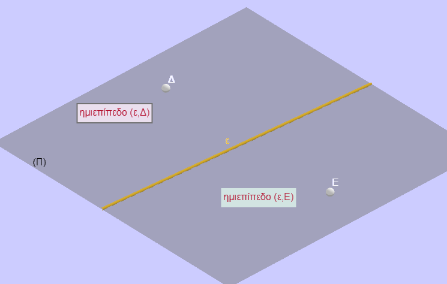

-    **Συμβολισμός:** Ένα ημιεπίπεδο συμβολίζεται με την αρχική ευθεία και ένα σημείο του, π.χ.
    $(\epsilon, A)$.

  -   **Κυρτότητα:** Το ημιεπίπεδο είναι **κυρτό σύνολο**.
    Αυτό σημαίνει ότι αν επιλέξουμε δύο τυχαία σημεία $M$ και $N$ εντός ενός ημιεπιπέδου, ολόκληρο το ευθύγραμμο τμήμα $MN$ θα βρίσκεται μέσα στο ίδιο ημιεπίπεδο.


:::

**Παραδείγματα**

1.  Ένα τραπέζι με τρία πόδια (τρίποδο) στέκεται πάντα σταθερά γιατί τρία σημεία ορίζουν ένα επίπεδο.
2.  Τα φύλλα ενός βιβλίου είναι άπειρα επίπεδα που περνούν από την ίδια ευθεία (τη ράχη του).
3.  Ο τοίχος, το δάπεδο και η οροφή μιας τάξης είναι διαφορετικά επίπεδα.
4.  Δύο τεμνόμενες ακμές ενός τοίχου ορίζουν το επίπεδο του τοίχου.
5.  Μια κόλλα χαρτί πάνω στο τραπέζι παριστάνει ένα μέρος επιπέδου.

**Ασκήσεις**

1.  Πάρτε τρία σημεία Α, Β, Γ μη συνευθειακά. Πόσα επίπεδα ορίζουν;.
2.  Αν έχετε 4 σημεία Α, Β, Γ, Δ ανά τρία μη συνευθειακά, πόσα επίπεδα ορίζονται;.
3.  Πόσα επίπεδα περνούν από μια ευθεία (ε);.
4.  Σχεδιάστε δύο τεμνόμενες ευθείες. Πόσα επίπεδα ορίζουν;.
5.  Βρείτε μέσα στην τάξη δύο παράλληλες ευθείες και ονομάστε το επίπεδο που ορίζουν.
6.  Πόσα επίπεδα περνούν από ένα μοναδικό σημείο;.
7.  Αν 3 σημεία είναι συνευθειακά, ορίζουν μοναδικό επίπεδο; Εξηγήστε.
8.  Σχεδιάστε ένα επίπεδο Π και μια ευθεία ε που να ανήκει σε αυτό.
9.  Σχεδιάστε ένα επίπεδο και ένα σημείο Α που να μην ανήκει σε αυτό.
10. Πόσα επίπεδα ορίζει ένα τρίγωνο;.
11. Σχεδιάστε δύο ημιεπίπεδα με κοινή ακμή (σαν ανοικτό βιβλίο).
12. Πάρτε μια ευθεία και ένα σημείο εκτός αυτής. Πόσα επίπεδα ορίζουν;.
13. Πόσα επίπεδα ορίζουν οι τρεις ακμές ενός κύβου που συναντώνται σε μια κορυφή;.
14. Σχεδιάστε ένα επίπεδο και μια ευθεία που να το τέμνει σε ένα σημείο.
15. Αν δύο επίπεδα έχουν δύο κοινά σημεία, τι συμπεραίνετε για την τομή τους;.


---

### .... Ασκήσεων συνέχεια

**Α. Ερωτήσεις Θεωρίας (Σωστό/Λάθος & Συμπλήρωση Κενών)**

1.  Από ένα σημείο διέρχονται ............
    ευθείες.

2.  Δύο ημιευθείες με κοινή αρχή είναι πάντα αντικείμενες.
    (Λάθος, πρέπει να ανήκουν στην ίδια ευθεία).

3.  Πόσες διαστάσεις έχει ένα σημείο; (0).

4.  Πόσες ευθείες διέρχονται από τρία μη συνευθειακά σημεία; (Καμία).

**Β. Ασκήσεις Ονοματολογίας και Σχεδίασης**

1.  Σχεδιάστε μια ευθεία $x'x$ και σημειώστε τέσσερα διαδοχικά σημεία $A, B, K, \Delta$.

-   Γράψτε όλα τα ευθύγραμμα τμήματα που ορίζονται (π.χ. $AB, AK, A\Delta, BK, B\Delta, K\Delta$).

-   Ονομάστε την αντικείμενη ημιευθεία της $Kx'$ (είναι η $Kx$ ή $K\Delta$).

2.  Σχεδιάστε ένα ευθύγραμμο τμήμα $HK$ και ένα σημείο $\Lambda$ εκτός αυτού.

3.  Αν $M$ είναι το μέσο ενός τμήματος $AB$, σχεδιάστε τις αντικείμενες ημιευθείες $MA$ και $MB$.

4.  Στο παρακάτω σχήμα ονομάστε όλες τις ημιευθείες.\

    \
    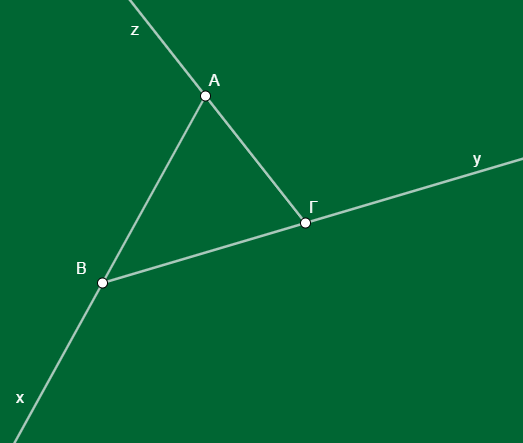

5.  Στο παρακάτω σχήμα ονόμασε όλα τα σημεία και μετά γράψε όλα τα ευθύγραμμα τμήματα που σχηματίζονται.\

    \

**Γ. Σύνθετα Προβλήματα Λογικής**

1.  **Υπολογισμός Πλήθους:** Αν δοθούν 6 σημεία στο επίπεδο, ανά 3 μη συνευθειακά, πόσες ευθείες ορίζονται συνολικά; (Απάντηση: 15 ευθείες).

2.  **Κοινά Σημεία:** Πόσα κοινά σημεία έχουν οι ημιευθείες $AB$ και $BA$ αν το $A$ και το $B$ ανήκουν στην ίδια ευθεία; (Άπειρα, όλο το τμήμα $AB$).

3.  **Σχετικές Θέσεις:** Σχεδιάστε τρεις ευθείες $\epsilon, \lambda, \sigma$ που να μην είναι παράλληλες ανά δύο και να μην διέρχονται και οι τρεις από το ίδιο σημείο.
    Πόσα σημεία τομής προκύπτουν; (3 σημεία).


**Α. Ερωτήσεις Κατανόησης**

1.  **Γιατί ένα σκαμνί με τρία πόδια δεν "τρεκλίζει" ποτέ;**

-   *Απάντηση:* Επειδή τρία σημεία ορίζουν πάντα ένα μοναδικό επίπεδο, τα άκρα των τριών ποδιών θα εφάπτονται πάντα στο επίπεδο του δαπέδου

2.  **Πόσα επίπεδα διέρχονται από δύο σημεία** $A$ και $B$;

-   *Απάντηση:* Από δύο σημεία διέρχονται **άπειρα** επίπεδα (φανταστείτε τις σελίδες ενός βιβλίου που ανοίγουν γύρω από τη ράχη του).

3.  **Ποιο είναι το όριο ενός ημιεπιπέδου;**

-   *Απάντηση:* Το όριο είναι η ευθεία που χώρισε το αρχικό επίπεδο στα δύο.

**Β. Ασκήσεις Σχεδίασης και Λογικής**

1.  **Σχεδίαση Ημιεπιπέδων:** Σχεδιάστε ένα επίπεδο $\pi$ και μια ευθεία $\epsilon$ εντός αυτού.
    Ονομάστε τα δύο ημιεπίπεδα που προκύπτουν.

2.  **Σχετικές Θέσεις:** Αν δύο σημεία $A$ και $B$ βρίσκονται σε διαφορετικά ημιεπίπεδα ως προς μια ευθεία $\epsilon$, τι συμβαίνει με το ευθύγραμμο τμήμα $AB$;

-   *Απάντηση:* Το τμήμα $AB$ υποχρεωτικά **τέμνει** την ευθεία $\epsilon$.

3.  **Συνεπίπεδα Σχήματα:** Αναγνωρίστε στην αίθουσα διδασκαλίας δύο επίπεδα που είναι παράλληλα (π.χ. δάπεδο και οροφή) και δύο που τέμνονται (π.χ. δύο διπλανοί τοίχοι).


