\usepackage{wasysym}

```{=html}
<!-- Φόρτωση βιβλιοθήκης GeoGebra -->
<script src="https://www.geogebra.org/apps/deployggb.js"</script>

<!-- Συνάρτηση δημιουργίας applets -->
<script>
function createGeoGebra(containerId, materialId, width = 700, height = 500) {
  var params = {
    "id": "ggb-" + containerId,
    "material_id": materialId,
    "width": width,
    "height": height,
    "showToolBar": true,
    "showMenuBar": false,
    "showAlgebraInput": true
  };
  
  var applet = new GGBApplet(params, '5.2');
  applet.inject(containerId);
}
</script>
```

------------------------------------------------------------------------

## Γωνία – Γραμμή – Επίπεδα σχήματα – Ευθύγραμμα σχήματα – Ίσα σχήματα

### **Η Έννοια της Γωνίας (Σχεδίαση, Συμβολισμός, Ανάγνωση, Είδη)**

::: {style="background-color: #c0d4b8; border: 2px solid #2f3e50; color: #25188a; padding: 15px; border-radius: 5px;"}
**Θεωρία – Ορισμοί – Ιδιότητες**

- **Ορισμός:** **Γωνία** ονομάζεται το μέρος του επιπέδου που περιέχεται μεταξύ δύο ημιευθειών οι οποίες έχουν κοινή αρχή.
  Στην πραγματικότητα σχεδιάζονται κάθε φορά δύο γωνίες

  - Μια γωνία **κυρτή** (η μικρότερη) και

  - μία **μη κυρτή** (η μεγαλύτερη).

- **Στοιχεία:** Το κοινό σημείο των ημιευθειών λέγεται **κορυφή** της γωνίας, ενώ οι ημιευθείες λέγονται **πλευρές**.

<!-- -->

- **Συμβολισμός:** Μια γωνία συμβολίζεται είτε με το γράμμα της κορυφής (π.χ. $\hat{Ο}$), είτε με τρία κεφαλαία γράμματα όπου το μεσαίο είναι η κορυφή (π.χ. $\widehat{ΑΟΒ}$), είτε με το όνομα των ημιευθειών της (π.χ. $(Ox, Oy)$).\
  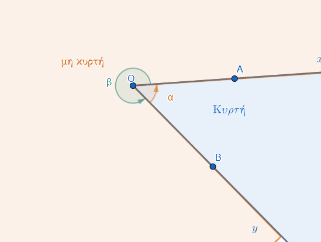{width="500"}

------------------------------------------------------------------------

#### **Σχέσεις Γωνιών και Πλευρών σε Τρίγωνο**

Σε ένα τρίγωνο (π.χ. ΑΒΓ), οι γωνίες και οι πλευρές συνδέονται με τους εξής όρους:

- **Περιεχομένη γωνία:** Είναι η γωνία που σχηματίζεται μεταξύ δύο πλευρών.

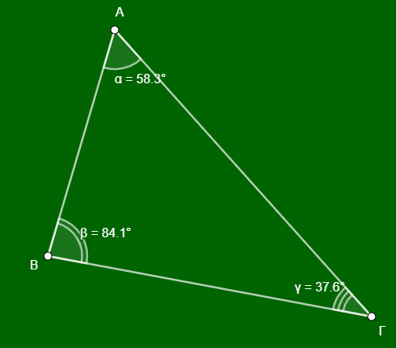{width="391"}

Για παράδειγμα, η γωνία $\widehat{A}$ περιέχεται στις πλευρές ΑΒ και ΑΓ.
Αντίστοιχα, η γωνία που βρίσκεται μεταξύ των πλευρών ΑΒ και ΒΓ είναι η $\widehat{B}$.

- **Προσκείμενη γωνία:** Είναι οι γωνίες που "βρίσκονται" πάνω σε μια πλευρά, δηλαδή έχουν τη μία τους πλευρά πάνω στο ευθύγραμμο τμήμα της πλευράς αυτής.
  Για παράδειγμα, οι γωνίες $\widehat{B}$ και $\widehat{\Gamma}$ είναι προσκείμενες στην πλευρά ΒΓ.

- **Απέναντι γωνία:** Είναι η γωνία που βρίσκεται απέναντι από μια συγκεκριμένη πλευρά.
  Για παράδειγμα, η γωνία $\widehat{A}$ βρίσκεται απέναντι από την πλευρά ΒΓ.
  Αντίστοιχα, η πλευρά που βρίσκεται απέναντι από τη γωνία $\widehat{\Gamma}$ είναι η ΑΒ.

------------------------------------------------------------------------

#### **Ταξινόμηση Γωνιών βάσει Μέτρου**

Οι γωνίες ταξινομούνται ανάλογα με το άνοιγμά τους σε σχέση με την **ορθή γωνία** (90°):

| Είδος Γωνίας | Μέτρο ($\phi$) | Περιγραφή |
|:-----------------------|:-----------------------|:-----------------------|
| **Μηδενική** | $\phi = 0^\circ$ | Οι πλευρές συμπίπτουν. |
| **Οξεία** | $0^\circ < \phi < 90^\circ$ | Μικρότερη από την ορθή. |
| **Ορθή** | $\phi = 90^\circ$ | Οι πλευρές είναι κάθετες μεταξύ τους. |
| **Αμβλεία** | $90^\circ < \phi < 180^\circ$ | Μεγαλύτερη από την ορθή, μικρότερη από την ευθεία. |
| **Ευθεία** | $\phi = 180^\circ$ | Οι πλευρές είναι αντικείμενες ημιευθείες. |
| **Πλήρης** | $\phi = 360^\circ$ | Οι πλευρές συμπίπτουν μετά από πλήρη περιστροφή. |
:::

**Παραδείγματα**

1.  Σχεδίαση γωνίας $xOy$ και επισήμανση της κορυφής $O$ και των πλευρών $Ox, Oy$.
2.  Ονομασία μιας γωνίας με τρία γράμματα $A, B, \Gamma$, όπου $B$ είναι η κορυφή ($\widehat{AB\Gamma}$).
3.  Παράσταση μιας **ορθής γωνίας** (το μισό της ευθείας γωνίας) με το χαρακτηριστικό τετράγωνο σύμβολο.

**Ασκήσεις**

1.  Σχεδιάστε μια γωνία και ονομάστε την με τρεις διαφορετικούς τρόπους.
2.  Πάρτε δύο ημιευθείες $Ox$ και $Oy$ και χρωματίστε την κυρτή γωνία που σχηματίζουν.
3.  Σε ένα σημείο $O$, σχεδιάστε τέσσερις διαδοχικές γωνίες.
4.  Πόσες γωνίες σχηματίζονται αν από μια κορυφή $O$ φέρουμε τρεις ημιευθείες;.
5.  Σχεδιάστε μια **μη κυρτή γωνία** και σημειώστε ένα σημείο στο εσωτερικό της.
6.  Ποιο είδος γωνίας σχηματίζουν οι δείκτες του ρολογιού στις 3:00;.

------------------------------------------------------------------------

### **Είδη Γραμμών και Πολυγωνικές Γραμμές**

::: {style="background-color: #c0d4b8; border: 2px solid #2f3e50; color: #25188a; padding: 15px; border-radius: 5px;"}
**Θεωρία – Ορισμοί – Ιδιότητες**

- **Γραμμή:** Είναι το σύνολο των ιχνών (τροχιά) ενός κινητού σημείου.
- **Είδη Γραμμών:**
  1.  **Ευθεία:** Η απλούστερη γραμμή.
  2.  **Τεθλασμένη ή Πολυγωνική:** Αποτελείται από διαδοχικά ευθύγραμμα τμήματα που δεν ανήκουν στην ίδια ευθεία.
  3.  **Καμπύλη:** Κανένα μέρος της δεν είναι ευθύγραμμο τμήμα (π.χ. κύκλος).
  4.  **Μεικτή:** Αποτελείται από ευθύγραμμα και καμπύλα τμήματα.
- **Κυρτότητα:** Μια επίπεδη πολυγωνική γραμμή λέγεται **κυρτή**, όταν ο φορέας κάθε πλευράς της αφήνει ολόκληρη τη γραμμή στο ίδιο ημιεπίπεδο.

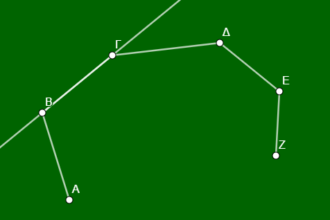{width="382"}

Αν την τέμνει, λέγεται **μη κυρτή**.

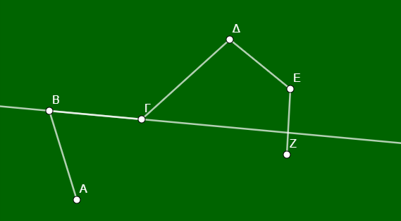{width="384"}
:::

**Παραδείγματα**

1.  Τα γράμματα $M, N, \Sigma$ ως παραδείγματα **τεθλασμένης γραμμής**.
2.  Το γράμμα $O$ ως παράδειγμα **κλειστής καμπύλης γραμμής**.
3.  Μια **ανοιχτή τεθλασμένη γραμμή** με 4 πλευρές και 5 κορυφές.
4.  Σχεδίαση μιας **κυρτής πολυγωνικής γραμμής** (π.χ. το περίγραμμα ενός τριγώνου).
5.  Σχεδίαση μιας **μη κυρτής γραμμής** όπου δύο πλευρές διασταυρώνονται.

**Ασκήσεις**

1.  Σχεδιάστε μια τεθλασμένη γραμμή $AB\Gamma\Delta E$ και ονομάστε τις πλευρές και τις κορυφές της.
2.  Σχεδιάστε μια **ανοιχτή** και μια **κλειστή** τεθλασμένη γραμμή.
3.  Σχεδιάστε μια κυρτή τεθλασμένη γραμμή με 5 πλευρές.
4.  Σχεδιάστε μια μη κυρτή τεθλασμένη γραμμή με 4 πλευρές.
5.  Σχεδιάστε μια **μεικτή γραμμή** που να αποτελείται από δύο τμήματα και μια καμπύλη.
6.  Πόσες κορυφές έχει μια ανοιχτή τεθλασμένη γραμμή με 7 πλευρές;.
7.  Σχεδιάστε μια κλειστή καμπύλη γραμμή και σημειώστε ένα σημείο στο εσωτερικό της.
8.  Σχεδιάστε δύο γραμμές που να τέμνονται σε δύο σημεία.
9.  Πάρτε 4 σημεία μη συνευθειακά και ενώστε τα ώστε να σχηματίσουν **σταυροειδή** τεθλασμένη γραμμή.
10. Σχεδιάστε μια τεθλασμένη γραμμή που να είναι τμήμα ενός κυρτού πολυγώνου.
11. Ποια από τα γράμματα $L, Z, \Gamma$ είναι κυρτές τεθλασμένες γραμμές;.
12. Μπορείτε να σχεδιάστε τρεις διαφορετικές γραμμές που να διέρχονται από τα σημεία $A$ και $B$;

------------------------------------------------------------------------

### **Ευθύγραμμα Σχήματα (Πολύγωνα) – Κυρτά και Μη Κυρτά**

::: {style="background-color: #c0d4b8; border: 2px solid #2f3e50; color: #25188a; padding: 15px; border-radius: 5px;"}
**Θεωρία – Ορισμοί – Ιδιότητες**

- **Ορισμός:** **Πολύγωνο** ονομάζεται κάθε κλειστή τεθλασμένη γραμμή.
  Το επίπεδο χωρίο που περικλείεται από αυτήν λέγεται **πολυγωνικό χωρίο**.

- **Κυρτό Ευθύγραμμο Σχήμα:** Ένα σχήμα είναι κυρτό αν για οποιαδήποτε δύο σημεία του $A, B$, το ευθύγραμμο τμήμα $AB$ βρίσκεται ολόκληρο μέσα στο σχήμα.\
  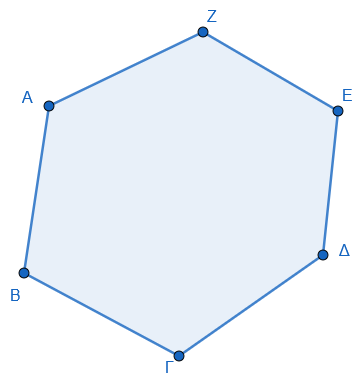{width="350"}

- **Μη Κυρτό Ευθύγραμμο Σχήμα:** Αν υπάρχει έστω και ένα τμήμα $AB$ που συνδέει δύο εσωτερικά σημεία αλλά ένα μέρος του βρίσκεται έξω από το σχήμα.\
  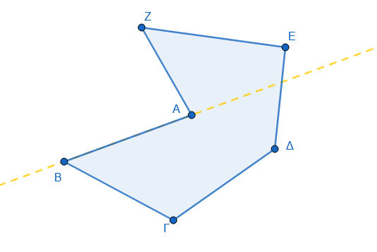{width="350"}

- **Ιδιότητες:**

  - Το τρίγωνο είναι πάντα επίπεδο και πάντα κυρτό.
  - Στα κυρτά πολύγωνα, όλες οι εσωτερικές γωνίες είναι μικρότερες από 180°.Μια μη κυρτή γωνία είναι μεγαλύτερη από μια ευθεία γωνία (180°) αλλά μικρότερη από μια πλήρη γωνία (360°).

- **Στοιχεία:** Τα πολύγωνα αποτελούνται από **πλευρές** και **κορυφές**.
  Ο αριθμός των κορυφών ή των πλευρών καθορίζει την ονομασία τους:

  - **Τρίγωνο:** 3 κορυφές.

  - **Τετράπλευρο:** 4 κορυφές.

  - **Πεντάγωνο:** 5 κορυφές.

  - **Εξάγωνο:** 6 κορυφές.

- **Κανονικό Πολύγωνο:** Ονομάζεται το πολύγωνο που έχει **όλες τις πλευρές του ίσες** και **όλες τις γωνίες του ίσες**.\
  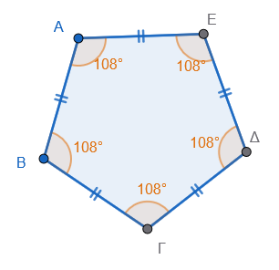

- **Περίμετρος (Π):** Είναι το **άθροισμα των μηκών** όλων των πλευρών του πολυγώνου.
:::

**Παραδείγματα**

1.  Το **τρίγωνο** ως το απλούστερο κυρτό πολύγωνο.
2.  Ένα **τετράπλευρο** κυρτό (π.χ. παραλληλόγραμμο).\
    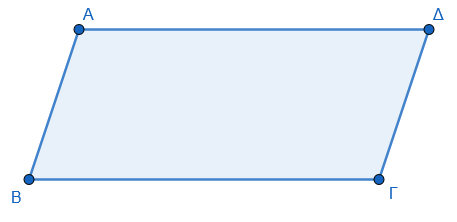
3.  Ένα **μη κυρτό τετράπλευρο** (Οι δύο πλευρές του τέμνονται).\
    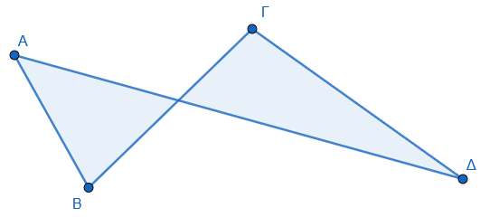{width="350"}
4.  Ένας **κυκλικός δίσκος** ως παράδειγμα κυρτού επιπέδου χωρίου (αν και δεν είναι ευθύγραμμο σχήμα).
5.  Ένα **μη κυρτό πεντάγωνο**.\
    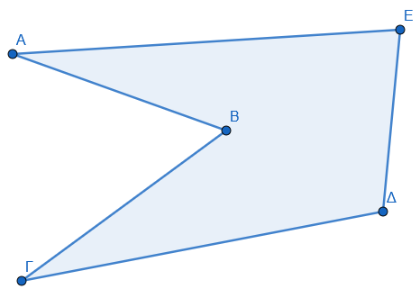{width="350"}

**Ασκήσεις**

1.  Σχεδιάστε ένα κυρτό και ένα μη κυρτό εξάγωνο.
2.  Σχεδιάστε ένα κυρτό τετράπλευρο και τις διαγωνίους του. Τέμνονται εσωτερικά;.
3.  Σχεδιάστε ένα μη κυρτό τετράπλευρο. Πού βρίσκεται η μία διαγώνιος;.
4.  Εξηγήστε γιατί κάθε τρίγωνο είναι κυρτό σχήμα.
5.  Πάρτε 5 σημεία και ενώστε τα ώστε να σχηματίσουν ένα κυρτό πολύγωνο.
6.  Σχεδιάστε ένα σχήμα μη κυρτό και κάντε έλεγχο φέρνοντας ένα τμήμα $AB$.
7.  Σχεδιάστε και ονομάστε ένα πολύγωνο με 8 πλευρές.
8.  Σχεδιάστε ένα κυρτό χωρίο $A$ και ένα μη κυρτό $B$ που να έχουν κοινή μια πλευρά.

------------------------------------------------------------------------

### **4. Ίσα Σχήματα (Ταυτότητα και Εφαρμογή)**

::: {style="background-color: #c0d4b8; border: 2px solid #2f3e50; color: #25188a; padding: 15px; border-radius: 5px;"}
**Θεωρία – Ορισμοί – Ιδιότητες**

- **Ορισμός:** Δύο σχήματα λέγονται **ίσα** όταν, αν τοποθετηθούν το ένα πάνω στο άλλο καταλλήλως, συμπίπτουν (εφαρμόζουν).
- **Τρόποι Εφαρμογής:**
  1.  **Κατ' ευθείαν ίσα:** Συμπίπτουν με απλή ολίσθηση (μετατόπιση) στο επίπεδο.
  2.  **Ίσα με αναστροφή:** Συμπίπτουν μόνο αν αναποδογυρίσουμε το ένα σχήμα.
- **Ιδιότητες Ίσων Τριγώνων:** Αν δύο τρίγωνα είναι ίσα, τότε όλα τα **ομόλογα** στοιχεία τους (πλευρές, γωνίες, ύψη) είναι ίσα.
:::

**Παραδείγματα**

1.  Δύο **κύκλοι** με την ίδια ακτίνα είναι ίσα σχήματα.
2.  Δύο **ευθύγραμμα τμήματα** με το ίδιο μήκος είναι ίσα.
3.  Δύο **γωνίες** που συμπίπτουν όταν τοποθετηθούν η μια πάνω στην άλλη.
4.  Δύο τρίγωνα που είναι **συμμετρικά** ως προς μια ευθεία (είναι ίσα με αναστροφή).
5.  Η διαγώνιος ενός παραλληλογράμμου το χωρίζει σε δύο **ίσα τρίγωνα**.

**Ασκήσεις**

1.  Σχεδιάστε δύο τμήματα $AB$ και $\Gamma\Delta$ χρησιμοποιώντας το άνοιγμα του διαβήτη.
2.  Σχεδιάστε δύο κύκλους $(O, R)$ και $(O', R')$. Πότε είναι ίσοι;.
3.  Σχεδιάστε δύο ίσα τρίγωνα και ονομάστε τα **ομόλογα** στοιχεία τους.
4.  Στ παρακάτω σχήμα χρησιμοποιήστε διαφανές χαρτί για να δείξτε ότι οι γωνίες και οι πλευρές του είναι ίσες.\
    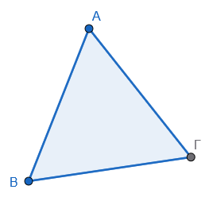
5.  Πάρτε ένα διαφανές χαρτί για να αντιγράψετε το σχήμα Α και ύστερα να ελέγξετε την ισότητα με το σχήμα Β.\
    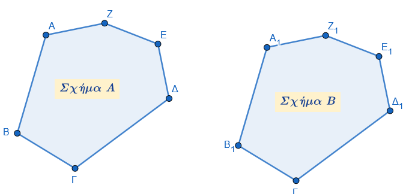{width="500"}
6.  Σχεδιάστε δύο **κατακορυφήν γωνίες** και αποδείξτε την ισότητά τους με αναστροφή.
7.  Αποδείξτε ότι οι ακτίνες δύο ίσων κύκλων είναι ίσες.
8.  Σχεδιάστε ένα ορθογώνιο και δείξτε ότι τα δύο τρίγωνα που σχηματίζει η διαγώνιος είναι ίσα.

------------------------------------------------------------------------

### **Ασκήσεις και Εφαρμογές**

**Άσκηση 1:** Για το παρακάτω σχήμα, ονομάστε τις σημαδεμένες γωνίες.

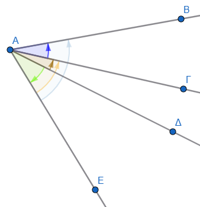

**Άσκηση 2 (Συμπλήρωση Κενών):** Στο τρίγωνο ΚΛΜ:

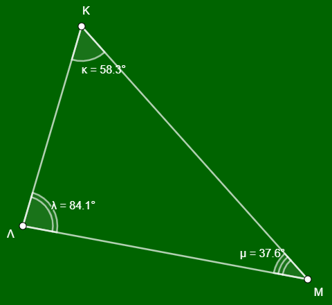{width="360"}

1\.
Η περιεχόμενη γωνία των πλευρών ΛΚ και ΛΜ είναι η γωνία **..........**.

2\.
Η πλευρά ΛΜ έχει απέναντι γωνία την **..........**.

3\.
Οι προσκείμενες γωνίες της πλευράς ΛΚ είναι οι **..........** και **..........**.

4\.
Η γωνία $\widehat{M}$ περιέχεται στις πλευρές **..........** και **..........**.

\* *(Λύσεις: 1.* $\widehat{\Lambda}$, 2. $\widehat{K}$, 3. $\widehat{K}$ και $\widehat{\Lambda}$, 4. ΜΚ και ΜΛ).

**Άσκηση 3 (Αναγνώριση σε Σχήμα):** Σε ένα τρίγωνο ΑΒΓ, (σχεδιάστε το τρίγωνο) βρείτε:

1\.
Ποια γωνία του τριγώνου περιέχεται στις πλευρές ΑΒ και ΓΑ;

2\.
Ποια πλευρά είναι απέναντι από τη γωνία $\widehat{B}$;

3\.
Ποιες γωνίες είναι προσκείμενες στην πλευρά ΓΒ;

\* *(Απαντήσεις: 1. Η* $\widehat{A}$, 2. Η πλευρά ΑΓ, 3. Οι γωνίες $\widehat{B}$ και $\widehat{\Gamma}$).

**Άσκηση 4 (Σωστό/Λάθος):**

1\.
Μια τεθλασμένη γραμμή ονομάζεται κυρτή όταν η προέκταση κάθε πλευράς της αφήνει όλες τις άλλες πλευρές της στο ίδιο ημιεπίπεδο.
**(Σ)**.

2\.
Σε ένα ισοσκελές τρίγωνο, οι προσκείμενες στη βάση γωνίες είναι άνισες.
**(Λ)**.

3\.
Μια μη κυρτή γωνία είναι πάντα μικρότερη από μια ορθή γωνία.
**(Λ)**.

4\.
Η γωνία που περιέχεται στις κάθετες πλευρές ενός ορθογωνίου τριγώνου είναι 90°.
**(Σ)**.

**Άσκηση 5 (Σύγκριση):** Δίνονται τρεις γωνίες: μία οξεία, μία ορθή και μία αμβλεία.
Ποια είναι η μεγαλύτερη και ποια η μικρότερη;

\* *Απάντηση: Μεγαλύτερη είναι η αμβλεία και μικρότερη η οξεία.*

**Άσκηση 6 (Κατασκευή):** Σχεδιάστε μια κυρτή γωνία 120° και ονομάστε την $\widehat{AOB}$.
Στη συνέχεια, σκιάστε την αντίστοιχη μη κυρτή γωνία.\

**Άσκηση 7:** Στο παρακάτω τρίγωνο να ονομάσεις $\hatΑ$ τη γωνία που είναι απέναντι στη μεγαλύτερη πλευρά, $\hatΒ$ τη γωνία που είναι απέναντι στη μικρότερη πλευρά και $\hatΓ$ την τρίτη γωνία.

α.
Ποιες γωνίες είναι προσκείμενες στην πλευρά ΒΓ;

β.
Ποια γωνία βρίσκεται απέναντι από την πλευρά ΑΒ;

γ.
Ποιά γωνία περιέχεται στις πλευρές ΑΓ και ΒΓ;

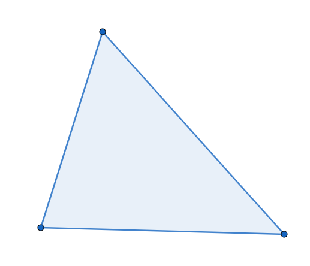{width="345"}

**Άσκηση 8 (Συμπλήρωση Κενών):**

1.  Δύο ευθύγραμμα σχήματα λέγονται ίσα αν **....................** όταν τοποθετήσουμε το ένα **....................**.

2.  Οι αντίστοιχες πλευρές και γωνίες των ίσων σχημάτων είναι **....................**.

3.  Ένα πολύγωνο ονομάζεται κανονικό, όταν έχει όλες τις **....................** του ίσες και όλες τις **....................** του ίσες.

- *(Λύσεις: 1. συμπίπτουν, πάνω στο άλλο, 2. ίσες, 3. πλευρές, γωνίες)*.

**Άσκηση 9 (Περίμετρος):** Να βρεθεί η περίμετρος ενός τριγώνου με πλευρές 2,3 dm, 45 mm και 5 cm.

- **Λύση:** Πρέπει πρώτα να μετατρέψουμε όλες τις μονάδες σε εκατοστά (cm): 2,3 dm = 23 cm και 45 mm = 4,5 cm. Περίμετρος Π = 23 + 4,5 + 5 = **32,5 cm**.

**Άσκηση 10 (Γεωμετρική Αναγνώριση):** Σε ένα παραλληλόγραμμο ΑΒΓΔ, αν η περίμετρος είναι 20 cm και η πλευρά ΑΒ είναι 5 cm, να βρεθούν οι υπόλοιπες πλευρές.

- **Λύση:** Στο παραλληλόγραμμο οι απέναντι πλευρές είναι ίσες, άρα ΓΔ = ΑΒ = 5 cm. Το άθροισμα των άλλων δύο ίσων πλευρών (ΑΔ + ΒΓ) είναι 20 - (5 + 5) = 10 cm, άρα ΑΔ = ΒΓ = **5 cm** (Στην περίπτωση αυτή το σχήμα είναι ρόμβος).
