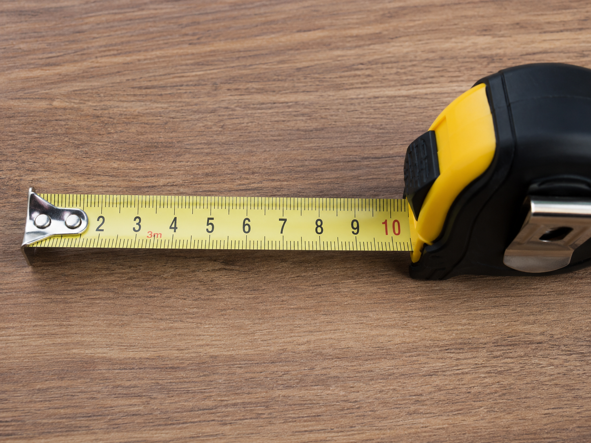
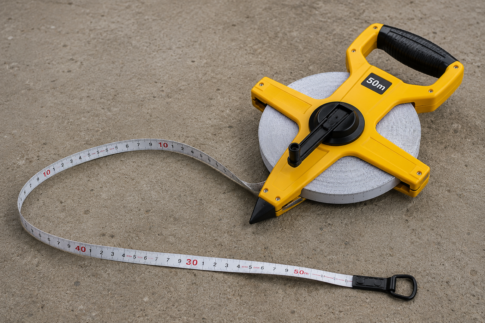
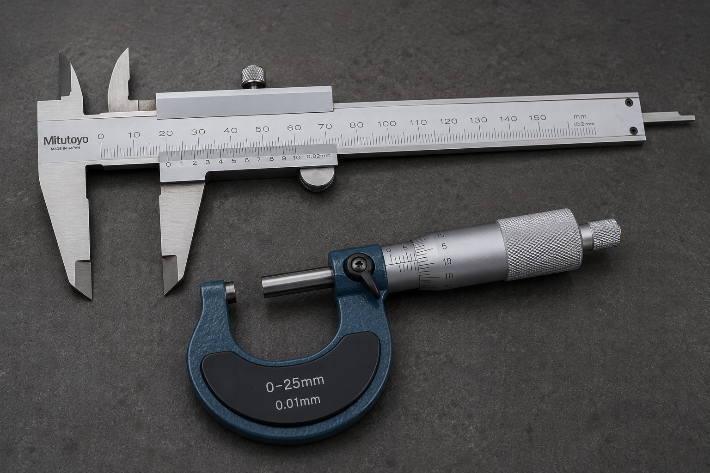
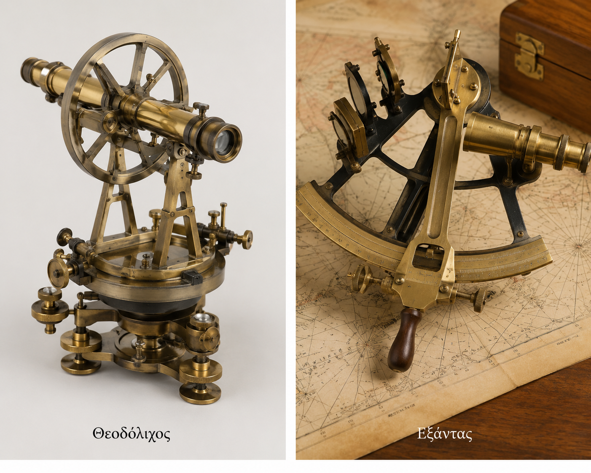
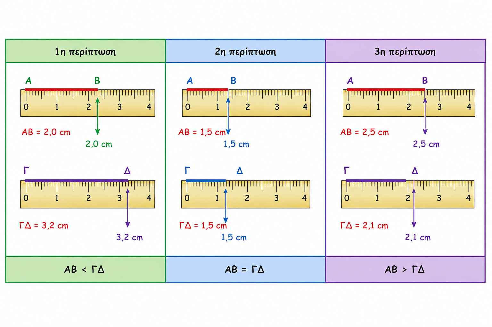
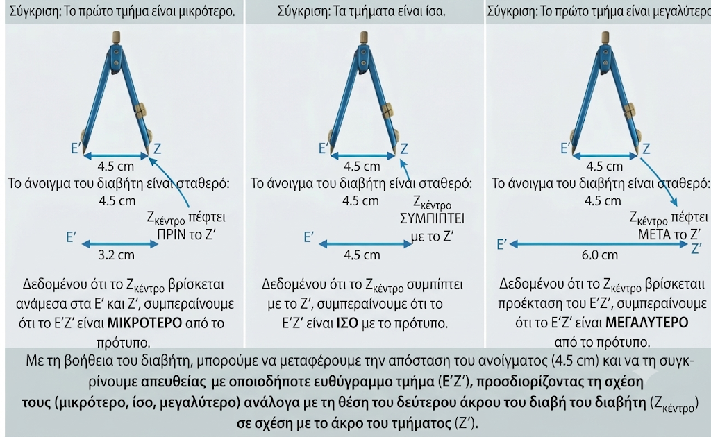
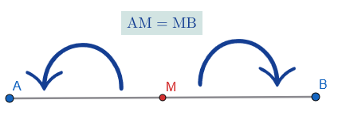
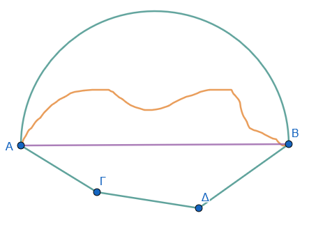

\usepackage{wasysym}

```{=html}
<!-- Φόρτωση βιβλιοθήκης GeoGebra -->
<script src="https://www.geogebra.org/apps/deployggb.js"</script>

<!-- Συνάρτηση δημιουργίας applets -->
<script>
function createGeoGebra(containerId, materialId, width = 700, height = 500) {
  var params = {
    "id": "ggb-" + containerId,
    "material_id": materialId,
    "width": width,
    "height": height,
    "showToolBar": true,
    "showMenuBar": false,
    "showAlgebraInput": true
  };
  
  var applet = new GGBApplet(params, '5.2');
  applet.inject(containerId);
}
</script>
```

------------------------------------------------------------------------

## Μέτρηση, σύγκριση και ισότητα ευθυγράμμων τμημάτων – Απόσταση σημείων – Μέσο ευθύγραμμου τμήματος

### **Μήκος Ευθυγράμμου Τμήματος και Μονάδες Μέτρησης**

::: {style="background-color: #c0d4b8; border: 2px solid #2f3e50; color: #25188a; padding: 15px; border-radius: 5px;"}
**Θεωρία – Ορισμοί – Ιδιότητες**

- **Μέτρηση** ενός ευθυγράμμου τμήματος ονομάζεται η σύγκρισή του με ένα άλλο τμήμα που λαμβάνεται ως **μονάδα μέτρησης**.

- **Μήκος** ενός τμήματος είναι ο αριθμός που προκύπτει από τη μέτρηση και δείχνει πόσες φορές περιέχεται η μονάδα στο τμήμα.

- Κάθε ευθύγραμμο τμήμα έχει ένα **ορισμένο μήκος** που είναι πάντα ένας θετικός αριθμός.

- **Βασική μονάδα** μέτρησης είναι το **μέτρο (m)**.

- **Πολλαπλάσια του μέτρου:** Το δεκάμετρο (dam=10m), το εκατόμετρο (hm=100m) και το χιλιόμετρο (km=1000m).

- **Υποδιαιρέσεις του μέτρου:** Το δεκατόμετρο (dm=0,1m), το εκατοστόμετρο (cm=0,01m) και το χιλιοστόμετρο (mm=0,001m).

- Στη φυσική χρησιμοποιούνται επίσης το μικρό (μ) και το άγκστρομ (Α).

- Για να μετρήσουμε σχετικά μικρά μήκη χρησιμοποιούμε, συνήθως, το **υποδεκάμετρο**, που είναι το ένα δέκατο (Εικόνα) του μέτρου.\
  {width="500"}

- Για μεγαλύτερα μήκη, όπως π.χ.
  έναν τοίχο ή τις διαστάσεις ενός οικοπέδου, χρησιμοποιούμε τη **μετροταινία**.\
  {width="500"}

- Για πολύ μικρά μήκη π.χ.
  τη διάμετρο μιας βίδας ή το πάχος μιας λαμαρίνας, χρησιμοποιούμε το **παχύμετρο** ή το **μικρόμετρο**, αντίστοιχα.\

  {width="500"}\

- Οι τοπογράφοι χρησιμοποιούν τον **θεοδόλιχο** και οι ναυτικοί τον **εξάντα**.\

  \
  {width="500"}
:::

**Διάταξη μετατροπής**

```{dot}
//| fig-width: 6
//| fig-height: 3
//| out-width: 100%

graph G {
  rankdir=LR;
  //layout=neato;
  size="6,3!";
  ratio=fill;
  pad=0.1;

  // Ρυθμίσεις Κόμβων: Χρώμα γεμίσματος και περίγραμμα
  node [shape=circle, 
        style=filled, 
        fillcolor="#E1F5FE", // Απαλό μπλε
        color="#01579B",     // Σκούρο μπλε περίγραμμα
        penwidth=2,          // Πάχος περιγράμματος
        fontname="Helvetica-Bold", 
        width=0.3];

  // Ρυθμίσεις Γραμμών: Πάχος και χρώμα
  edge [fontname="Helvetica-Bold", 
        fontsize=11,
        color="#424242",     // Σκούρο γκρι για τις γραμμές
        penwidth=1.5,        // Πάχος γραμμής
        len=1];

  // Σύνδεση Κόμβων
  
  km -- m [label="x 1000",dir=forward];
  m -- dm [label="x 10",dir=forward];
  dm -- cm [label="x 10",dir=forward];
  cm -- mm [label="x 10",dir=forward];
  NM -- m [label="x 1852",dir=forward];
  mm -- cm [label=": 10",dir=forward];
  cm -- dm [label=": 10",dir=forward];
  dm -- m [label=": 10",dir=forward];
  m -- km [label=": 1000",dir=forward];
  
  // Παράδειγμα έμφασης σε έναν συγκεκριμένο κόμβο (π.χ. ο Α)
  m [fillcolor="#FFE082", color="#FFA000"]; 
}

```

**Παραδείγματα**

1.  Το μήκος ενός θρανίου είναι 6 παλάμες (εδώ μονάδα είναι η παλάμη).
2.  Ένα τμήμα ΑΒ που περιέχει 5 φορές τη μονάδα μέτρησης έχει μήκος 5.
3.  Μετατροπή: 27 km ισούνται με 27.000 m.
4.  Μετατροπή: 8 m ισούνται με 80 dm.
5.  Ένας δεκαδικός αριθμός μήκους: 34,86 m σημαίνει 34 m και 86 cm.

**Ασκήσεις**

1.  Πόσα εκατοστόμετρα (cm) έχουν τα 15 m;
2.  Μετατρέψτε σε μέτρα (m) την απόσταση 3 km και 5 dam.
3.  Πόσα χιλιοστόμετρα (mm) είναι τα 8 m και τα 345 cm;
4.  Γράψτε με τη μορφή δεκαδικού αριθμού (σε μέτρα) το μήκος: 9 dm, 4 cm και 5 mm.
5.  Πόσα δεκάμετρα (dam) υπάρχουν σε 59 hm;
6.  Τρέψτε σε χιλιόμετρα (km) την απόσταση 54.702 m.
7.  Αν η μονάδα είναι το τμήμα ΑΒ, ποιο είναι το απόμετρο του τμήματος ΑΓ που αποτελείται από 2 τμήματα ίσα με το ΑΒ;
8.  Εκφράστε σε cm το άθροισμα: 15 m + 28 m + 300 cm.
9.  Ένα τμήμα έχει μήκος 250 yd (υάρδες). Πόσα μέτρα είναι περίπου; (1 yd $\approx$ 0,914 m).

------------------------------------------------------------------------

### **Σύγκριση και Ισότητα Ευθυγράμμων Τμημάτων**

::: {style="background-color: #c0d4b8; border: 2px solid #2f3e50; color: #25188a; padding: 15px; border-radius: 5px;"}
**Θεωρία – Ορισμοί – Ιδιότητες**

- **Ισότητα:** Δύο ευθύγραμμα τμήματα ΑΒ και ΓΔ είναι **ίσα** όταν, με κατάλληλη μετατόπιση, ταυτίζονται (εφαρμόζουν).

- Δύο τμήματα είναι ίσα αν και μόνο αν έχουν το **ίδιο μήκος**.

- **Σύγκριση:** Γίνεται με τη χρήση **υποδεκάμετρου, διαφανούς χαρτιού**, **χάρτινης λωρίδας** ή του **διαβήτη**.\

  {width="600"}\
  

- **Ιδιότητες Ισότητας:**

  1.  **Ανακλαστική:** ΑΒ = ΑΒ.
  2.  **Συμμετρική:** Αν ΑΒ = ΓΔ, τότε ΓΔ = ΑΒ.
  3.  **Μεταβατική:** Αν ΑΒ = ΓΔ και ΓΔ = ΕΖ, τότε ΑΒ = ΕΖ.

- Στην ανισότητα ισχύει μόνο η μεταβατική ιδιότητα: Αν ΑΒ \< ΓΔ και ΓΔ \< ΕΖ, τότε ΑΒ \< ΕΖ.
:::

**Παραδείγματα**

1.  Σύγκριση δύο ακτίνων της ίδιας περιφέρειας: Είναι πάντα ίσες.
2.  Χρήση διαβήτη: Αν τα άκρα του διαβήτη που αντιστοιχούν στο ΑΒ πέσουν ακριβώς στα Γ και Δ, τότε ΑΒ = ΓΔ.
3.  Αν το άκρο του διαβήτη πέσει μεταξύ των Γ και Δ, τότε ΑΒ \< ΓΔ.
4.  Όλες οι ακμές ενός κύβου είναι ίσα ευθύγραμμα τμήματα.
5.  Δύο τμήματα συμμετρικά ως προς κέντρο ή άξονα είναι ίσα.

**Ασκήσεις**

1.  Σχεδιάστε δύο τμήματα ΑΒ και ΓΔ και εξετάστε την ισότητά τους με διαβήτη.
2.  Αν ΑΒ = ΓΔ και ΓΔ = 5 cm, πόσο είναι το μήκος του ΑΒ;
3.  Χρησιμοποιήστε το σύμβολο $<$ ή $>$ για να συγκρίνετε ένα τμήμα 4 cm με ένα τμήμα 35 mm.
4.  Δείξτε με διαβήτη αν τα τμήματα που αποτελούν το κεφαλαίο γράμμα "Ν" είναι ίσα.
5.  Αν Α, Β, Γ είναι σημεία σε μια ευθεία και το Β είναι μεταξύ των Α και Γ, συγκρίνετε τα τμήματα ΑΒ και ΑΓ.
6.  Επαληθεύστε την ανακλαστική ιδιότητα για ένα τμήμα ΚΛ μήκους 3 cm.
7.  Σχεδιάστε τρία άνισα τμήματα και διατάξτε τα σε σειρά αυξανομένου μεγέθους.
8.  Μετρήστε με τον χάρακα δύο τμήματα και βρείτε τη διαφορά των μηκών τους.

------------------------------------------------------------------------

### **Κατασκευή Τμήματος ίσο με δοθέν και Απόσταση Σημείων**

::: {style="background-color: #c0d4b8; border: 2px solid #2f3e50; color: #25188a; padding: 15px; border-radius: 5px;"}
**Θεωρία – Ορισμοί – Ιδιότητες**

- **Κατασκευή (Μεταφορά):** Για να κατασκευάσουμε τμήμα ίσο με ένα δοσμένο ΑΒ πάνω σε μια ευθεία (ε) με αρχή το Γ, χρησιμοποιούμε τον **διαβήτη** ή μια **χάρτινη λωρίδα**.

- **Απόσταση δύο σημείων** Α και Β ονομάζεται το **μήκος** του ευθυγράμμου τμήματος ΑΒ που ορίζουν.
:::

**Παραδείγματα**

1.  Κατασκευή τμήματος ΓΔ = 4 cm πάνω σε μια ευθεία χρησιμοποιώντας υποδεκάμετρο.
2.  Βρείτε την απόσταση δύο πόλεων στο χάρτη χρησιμοποιώντας την κλίμακα.
3.  Η απόσταση ενός σημείου Ο από μια ευθεία xy είναι το τμήμα ΟΑ, όπου ΟΑ $\perp$ xy.
4.  Σχεδίαση τμήματος ΑΓ ως άθροισμα δύο διαδοχικών τμημάτων ΑΒ και ΒΓ.
5.  Χρήση διαβήτη για να μεταφέρετε το μήκος ενός τμήματος ΑΒ σε μια νέα θέση.

**Ασκήσεις**

1.  Σχεδιάστε μια ευθεία και πάνω σε αυτήν κατασκευάστε τμήμα ΑΒ = 5 cm.
2.  Σημειώστε δύο σημεία Α και Β και μετρήστε την απόστασή τους με τον χάρακα.
3.  Πάνω σε μια ευθεία, με αρχή το σημείο Ο, κατασκευάστε τμήμα ΟΑ = 3,6 cm και ΟΒ = 4,9 cm. Πόσο είναι το μήκος του ΑΒ;
4.  Σχεδιάστε μια ευθεία (ε) και ένα σημείο Α εκτός αυτής. Βρείτε την απόσταση του Α από την (ε).

> > κάντε ένα δικό σας σχήμα

5.  Κατασκευάστε ένα τμήμα ίσο με το άθροισμα δύο τμημάτων 3 cm και 4 cm.
6.  Πόσα σημεία μιας ευθείας xy απέχουν ακριβώς 3 cm από ένα σημείο Α της ευθείας;
7.  Μετρήστε την απόσταση μεταξύ δύο απέναντι κορυφών ενός τετραπλεύρου.

> > κάντε ένα δικό σας σχήμα

8.  Κατασκευάστε ένα τμήμα x τέτοιο ώστε x = 2$\alpha$ - $\beta$, όπου $\alpha$, $\beta$ γνωστά τμήματα.
9.  Βρείτε την απόσταση του κέντρου ενός κύκλου από ένα σημείο της περιφέρειας.

> > κάντε έναν δικό σας κύκλο

10. Σχεδιάστε τρία σημεία Α, Β, Γ και βρείτε τις αποστάσεις ΑΒ, ΒΓ και ΑΓ.

------------------------------------------------------------------------

### **Μέσο Ευθυγράμμου Τμήματος**

::: {style="background-color: #c0d4b8; border: 2px solid #2f3e50; color: #25188a; padding: 15px; border-radius: 5px;"}
**Θεωρία – Ορισμοί – Ιδιότητες**

- **Μέσο** ενός ευθυγράμμου τμήματος ΑΒ ονομάζεται το σημείο Μ του τμήματος που **απέχει εξίσου** από τα άκρα του (ΑΜ = ΜΒ).\
  

- Κάθε ευθύγραμμο τμήμα έχει **ένα και μόνο ένα** μέσο.

- Το μέσο διαιρεί το τμήμα σε δύο ίσα μέρη, που το καθένα είναι το **μισό** του όλου τμήματος.

- **Προσδιορισμός:** Μπορεί να βρεθεί με **μέτρηση** (διαιρώντας το μήκος δια 2) ή με **δίπλωση** χαρτιού.
:::

**Παραδείγματα**

1.  Αν το τμήμα ΑΒ έχει μήκος 10 cm, το μέσο του Μ βρίσκεται σε απόσταση 5 cm από το Α.
2.  Το κέντρο ενός κύκλου είναι το μέσο κάθε διαμέτρου του.
3.  Σε ένα παραλληλόγραμμο, το σημείο τομής των διαγωνίων είναι το μέσο κάθε διαγωνίου.
4.  Δίπλωση χαρτιού: Αν διπλώσουμε το χαρτί ώστε το Α να πέσει στο Β, η τσάκιση ορίζει το μέσο Μ.
5.  Η τετμημένη του μέσου Μ στον άξονα είναι το ημιάθροισμα των τετμημένων των άκρων Α και Β.

**Ασκήσεις**

1.  Σχεδιάστε τμήμα ΑΒ = 8 cm και σημειώστε το μέσο του Μ με τον χάρακα.
2.  Αν Μ είναι το μέσο του ΑΒ και ΑΜ = 4,5 cm, πόσο είναι το μήκος του ΑΒ;
3.  Σχεδιάστε δύο τμήματα που να έχουν το ίδιο μέσο αλλά διαφορετικούς φορείς.
4.  Προσδιορίστε το μέσο ενός τμήματος χρησιμοποιώντας μόνο δίπλωση χαρτιού.
5.  Αν Α, Β, Γ είναι διαδοχικά σημεία και ΑΒ = ΒΓ, είναι το Β το μέσο του ΑΓ;
6.  Βρείτε το μέσο μιας χορδής κύκλου χρησιμοποιώντας τo υποδεκάμετρο.
7.  Σε έναν άξονα, αν Α(-2) και Β(8), βρείτε την τετμημένη του μέσου Μ.
8.  Σχεδιάστε ένα ορθογώνιο και βρείτε το μέσο κάθε πλευράς του.
9.  Αν το Μ είναι μέσο του ΑΒ και το Ν μέσο του ΑΜ, πόσο είναι το ΑΝ αν ΑΒ = 12 cm;
10. Σχεδιάστε ένα τμήμα ΑΒ. βρείτε το μέσον με το υποδεκάμετρο και επαληθεύστε με διαβήτη ότι το σημείο που βρήκατε με τον χάρακα είναι πράγματι το μέσο.

------------------------------------------------------------------------

### **Το Τμήμα ως η Μικρότερη Γραμμή**

::: {style="background-color: #c0d4b8; border: 2px solid #2f3e50; color: #25188a; padding: 15px; border-radius: 5px;"}
**Θεωρία – Ορισμοί – Ιδιότητες**

- Ανάμεσα σε όλες τις γραμμές (τεθλασμένες, καμπύλες, μεικτές) που συνδέουν δύο σημεία Α και Β, το **ευθύγραμμο τμήμα ΑΒ** έχει το **μικρότερο μήκος**.\
  

- Αυτή η ιδιότητα αποτελεί τη βάση για τον ορισμό της απόστασης δύο σημείων.

- Σε κάθε τρίγωνο ΑΒΓ, ισχύει η τριγωνική ανισότητα: **ΒΓ \< ΒΑ + ΑΓ**, που επιβεβαιώνει ότι η ευθεία οδός είναι η συντομότερη.
:::

**Παραδείγματα**

1.  Ένα τεντωμένο νήμα μεταξύ δύο σημείων δείχνει τη συντομότερη διαδρομή.
2.  Η σύγκριση μιας τεθλασμένης γραμμής ΑΓΔΒ με το τμήμα ΑΒ δείχνει ότι ΑΒ \< ΑΓ + ΓΔ + ΔΒ.
3.  Μια οπτική ακτίνα ταξιδεύει σε ευθεία γραμμή, που είναι ο συντομότερος δρόμος.
4.  Η κάθετος από σημείο σε ευθεία είναι η μικρότερη από όλες τις πλάγιες.
5.  Σε μια περιφέρεια, η απόσταση ενός εξωτερικού σημείου Σ από το κέντρο Ο περνά από το σημείο Α, κάνοντας το ΣΑ το βραχύτερο τμήμα.

**Ασκήσεις**

1.  Σχεδιάστε δύο σημεία Α, Β και τρεις διαφορετικές γραμμές που να τα συνδέουν. Ποια είναι η μικρότερη;
2.  Αποδείξτε σχεδιάζοντας ότι μια τεθλασμένη γραμμή είναι μεγαλύτερη από το αντίστοιχο ευθύγραμμο τμήμα.
3.  Σχεδιάστε ένα τρίγωνο και επαληθεύστε με μέτρηση ότι κάθε πλευρά είναι μικρότερη από το άθροισμα των άλλων δύο.
4.  Γιατί όταν θέλουμε να μετρήσουμε την απόσταση δύο σημείων τεντώνουμε το μέτρο;
5.  Σχεδιάστε μια καμπύλη γραμμή και το ευθύγραμμο τμήμα που συνδέει τα άκρα της. Συγκρίνετε τα μήκη τους.
6.  Αν μια τεθλασμένη γραμμή ΑΓΒ έχει μήκος 10 cm, τι συμπεραίνετε για το μήκος του τμήματος ΑΒ;
7.  Σχεδιάστε μια ευθεία και ένα σημείο Α εκτός αυτής. Δείξτε με μέτρηση ότι η κάθετος είναι η συντομότερη γραμμή.
8.  Είναι δυνατόν μια καμπύλη γραμμή ΑΒ να είναι μικρότερη από το τμήμα ΑΒ; Εξηγήστε.
9.  Βρείτε στο περιβάλλον σας παραδείγματα όπου η ευθεία γραμμή χρησιμοποιείται ως ο συντομότερος δρόμος.
10. Σχεδιάστε μια κλειστή τεθλασμένη γραμμή (πολύγωνο) και συγκρίνετε μια πλευρά της με το άθροισμα των υπολοίπων.

### **Ασκήσεις και Εφαρμογές**

**Άσκηση 1 (Μετατροπές):** Να μετατραπούν τα 50 cm σε m, dm και mm.

- **Λύση:**

- Σε m: $50 : 100 = \mathbf{0,5 \, m}$.

- Σε dm: $50 : 10 = \mathbf{5 \, dm}$.

- Σε mm: $50 \times 10 = \mathbf{500 \, mm}$.

**Άσκηση 2 (Πρόσθεση Τμημάτων):** Σε μια ευθεία ε παίρνουμε τα διαδοχικά σημεία Α, Β, Γ και Δ τέτοια ώστε $ΑΒ = 2 \, cm$, $ΒΓ = 3 \, cm$ και $ΑΔ = 6 \, cm$.
Να βρείτε τα μήκη των τμημάτων ΑΓ και ΓΔ.

- **Λύση:**

- $ΑΓ = ΑΒ + ΒΓ = 2 + 3 = \mathbf{5 \, cm}$.

- $ΓΔ = ΑΔ - ΑΓ = 6 - 5 = \mathbf{1 \, cm}$.

**Άσκηση 3 (Κλασματικά μέρη):** Να βρείτε πόσα εκατοστά είναι τα $\dfrac{2}{5}$ του μέτρου.

- **Λύση:**

Το 1 μέτρο έχει 100 εκατοστά.
Το $\dfrac{1}{5}$ του μέτρου είναι $100 : 5 = 20 \, cm$.
Άρα τα $\dfrac{2}{5}$ είναι $2 \times 20 = \mathbf{40 \, cm}$.

**Άσκηση 4 (Σύγκριση):** Να συγκρίνετε τις ποσότητες:

α) $0,2 \, m$ και $30 \, cm$,

β) $24 \, cm^2$ και $30,004 \, mm^3$.

- **Λύση:**

- α) Μετατρέπουμε τα $30 \, cm$ σε $m$: $30 : 100 = 0,3 \, m$.
  Επειδή $0,3 > 0,2$, τότε $30 \, cm > 0,2 \, m$.

- β) **Δεν μπορούν να συγκριθούν**, γιατί το $cm^2$ είναι μονάδα εμβαδού και το $mm^3$ είναι μονάδα όγκου (ανόμοια μεγέθη).

**Άσκηση 5 (Απόσταση και Μέσο):** Αν το σημείο Μ είναι το μέσο του τμήματος $ΑΒ = 10 \, cm$ και το Ν είναι το μέσο του ΑΜ, ποια είναι η απόσταση ΑΝ;.

- **Λύση:**

- Η απόσταση ΑΜ είναι το μισό του ΑΒ: $10 : 2 = 5 \, cm$.

- Η απόσταση ΑΝ είναι το μισό του ΑΜ: $5 : 2 = \mathbf{2,5 \, cm}$.

**Άσκηση 6:** Ένας ιδιοκτήτης θέλει να περιφράξει τον κήπο του σχήματος ορθογωνίου, με πλευρές $12,8\text{ m}$ και $17,5\text{ m}$.
Διαθέτει συρματόπλεγμα, μήκους 60 m 7 dm 18 cm.
Να βρεθεί, αν θα του φτάσει το συρματόπλεγμα αν θα του περισέψει (αν ναι πόσο;) ή αν θα πρέπει να αγοράσει και άλλο (αν ναι πόσο;).

**Άσκηση 7:** Τα σημεία Α και Β απέχουν 8 cm μεταξύ τους.
Τοποθετήστε ένα σημεί Γ έτσι ώστε:\

1.  Το Γ να είναι μέσο του ΑΒ

2.  Το Α να είναι μέσο του ΓΒ

3.  Το Β να είναι μέσο του ΑΓ

**Άσκηση 8:** Ένα σχοινί μήκους $36\text{ m}$ κόπηκε σε τρία κομμάτια, το πρώτο κομμάτι είναι το μισό του δεύτερου, ενώ το τρίτο είναι κατά $1\text{ m}$ μεγαλύτερο από το διπλάσιο δεύτερου.
Να βρείτε το μήκος του μεγαλύτερου κομματιού.

*Υπόδειξη*: Αν το μήκος του πρώτου είναι $x$, τότε του δεύτερου θα είναι $2\cdot x$ και το τρίτο θα είναι $2\cdot(2\cdot x)+1$

::: {style="background-color: #f0f8cc; border: 2px solid #2f3e50; color: #25188a; padding: 15px; border-radius: 5px;"}
ΚΑΛΗ ΜΕΛΕΤΗ !
:::
