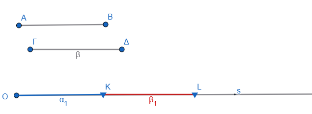
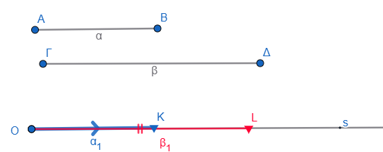

\usepackage{wasysym}

```{=html}
<!-- Φόρτωση βιβλιοθήκης GeoGebra -->
<script src="https://www.geogebra.org/apps/deployggb.js"</script>

<!-- Συνάρτηση δημιουργίας applets -->
<script>
function createGeoGebra(containerId, materialId, width = 700, height = 500) {
  var params = {
    "id": "ggb-" + containerId,
    "material_id": materialId,
    "width": width,
    "height": height,
    "showToolBar": true,
    "showMenuBar": false,
    "showAlgebraInput": true
  };
  
  var applet = new GGBApplet(params, '5.2');
  applet.inject(containerId);
}
</script>
```

------------------------------------------------------------------------

Η πρόσθεση και η αφαίρεση των ευθυγράμμων τμημάτων αποτελούν τις βασικές γεωμετρικές πράξεις που επιτρέπουν τον συνδυασμό μηκών και τη μελέτη πιο σύνθετων σχημάτων, όπως η περίμετρος των πολυγώνων.

### **Θεωρητικό Πλαίσιο**

**1. Πρόσθεση Ευθυγράμμων Τμημάτων**

::: {style="background-color: #f0f8cc; border: 2px solid #2f3e50; color: #25188a; padding: 15px; border-radius: 5px;"}
-   **Γεωμετρική Διαδικασία:** Για να προσθέσουμε δύο ευθύγραμμα τμήματα $AB$ και $\Gamma\Delta$, τα τοποθετούμε **διαδοχικά** πάνω σε μία ευθεία ή ημιευθεία.
-   Πρακτικά, χρησιμοποιώντας διαβήτη, σχεδιάζουμε μια ημιευθεία με αρχή $O$ και μεταφέρουμε το τμήμα $AB$ (ορίζοντας το $OK = AB$) και στη συνέχεια, με αρχή το $K$, μεταφέρουμε το τμήμα $\Gamma\Delta$ (ορίζοντας το $KL = \Gamma\Delta$). Το συνολικό τμήμα $OL$ αποτελεί το γεωμετρικό άθροισμα ($OL = AB + \Gamma\Delta$).
:::

\
\

-   **Ιδιότητες:** Στην πρόσθεση τμημάτων ισχύουν οι κανόνες της Αριθμητικής, δηλαδή η **αντιμεταθετική** ($AB + \Gamma\Delta = \Gamma\Delta + AB$) και η **προσεταιριστική** ιδιότητα.

**2. Αφαίρεση Ευθυγράμμων Τμημάτων**

::: {style="background-color: #f0f8cc; border: 2px solid #2f3e50; color: #25188a; padding: 15px; border-radius: 5px;"}
-   **Γεωμετρική Διαδικασία:** Για να αφαιρέσουμε το μικρότερο τμήμα $AB$ από το μεγαλύτερο $\Gamma\Delta$, τα τοποθετούμε πάνω σε μία ημιευθεία με **κοινή αρχή**.
-   Το τμήμα που ξεκινά από το τέλος του μικρότερου και καταλήγει στο τέλος του μεγαλύτερου αποτελεί τη **διαφορά** τους. Εναλλακτικά, αν μεταφέρουμε το $AB$ =ΟΚ και το $\Gamma\Delta$ =ΟL τότε το τμήμα $KL$ είναι η διαφορά ΓΔ-ΑΒ.
:::



-   Αν τα τμήματα είναι ίσα ($AB = \Gamma\Delta$), τότε η διαφορά τους ονομάζεται **μηδενικό ευθύγραμμο τμήμα**, καθώς τα άκρα του ταυτίζονται και το μήκος του είναι μηδέν.

**3. Εφαρμογή: Περίμετρος**

\* Η **περίμετρος** ενός ευθυγράμμου σχήματος είναι το **άθροισμα των μηκών όλων των πλευρών** του, αποτελώντας την κυριότερη εφαρμογή της πρόσθεσης ευθυγράμμων τμημάτων.

------------------------------------------------------------------------

### **Ασκήσεις και Εφαρμογές**

Ακολουθούν ενδεικτικά παραδείγματα :

1.  **Υπολογισμός διαδοχικών τμημάτων:** Πάνω σε μια ευθεία παίρνουμε τα διαδοχικά σημεία $A, B$ και $\Gamma$ έτσι ώστε $AB = 6 cm$ και $A\Gamma = 10 cm$. Βρείτε το μήκος του $B\Gamma$.
    -   *Λύση:* Το τμήμα $B\Gamma$ βρίσκεται από τη διαφορά: $B\Gamma = A\Gamma - AB = 10 - 6 = 4 cm$.
2.  **Σύνθεση με μέσο τμήματος:** Αν στο προηγούμενο παράδειγμα το $M$ είναι το **μέσο** του $AB$, να υπολογιστεί το μήκος του τμήματος $M\Gamma$.
    -   *Λύση:* Το $MB$ είναι το μισό του $AB$, δηλαδή $3 cm$. Το $M\Gamma$ προκύπτει από το άθροισμα: $M\Gamma = MB + B\Gamma = 3 + 4 = 7 cm$.
3.  **Αντικείμενες Ημιευθείες:** Θεωρούμε δύο αντικείμενες ημιευθείες $Ox$ και $O\psi$. Στην $Ox$ παίρνουμε το σημείο $A$ με $OA = 3 cm$ και στην $O\psi$ το σημείο $\Gamma$ με $O\Gamma = 2 cm$. Βρείτε την απόσταση $A\Gamma$.
    -   *Λύση:* Επειδή οι ημιευθείες είναι αντικείμενες, το $O$ βρίσκεται ανάμεσα στα σημεία. Άρα η συνολική απόσταση είναι το άθροισμα: $A\Gamma = AO + O\Gamma = 3 + 2 = 5 cm$.
4.  **Άσκηση Κρίσεως (Πολλαπλές Λύσεις):** Πάνω σε μια ευθεία βρίσκονται τα σημεία $A$ και $\Gamma$ με $A\Gamma = 8 cm$ και το μέσο τους $M$. Αν ένα σημείο $B$ απέχει $2 cm$ από το $M$, βρείτε τα μήκη $AB$ και $B\Gamma$.
    -   *Ανάλυση:* Υπάρχουν δύο περιπτώσεις ανάλογα με τη θέση του $B$:
        -   Αν το $B$ είναι ανάμεσα στα $A$ και $M$, τότε $AB = AM - BM = 4 - 2 = 2 cm$ και $B\Gamma = BM + M\Gamma = 2 + 4 = 6 cm$.
        -   Αν το $B$ είναι ανάμεσα στα $M$ και $\Gamma$, τότε $AB = AM + MB = 4 + 2 = 6 cm$ και $B\Gamma = M\Gamma - MB = 4 - 2 = 2 cm$.

Ακολουθεί μια συλλογή ασκήσεων για την πρόσθεση και αφαίρεση ευθυγράμμων τμημάτων, ταξινομημένη ανά επίπεδο δυσκολίας:

### **1. Ασκήσεις Βασικών Υπολογισμών**

-  **Διαδοχικά σημεία:** Πάνω σε μια ευθεία παίρνουμε τα διαδοχικά σημεία $A, B$ και $\Gamma$ έτσι ώστε $AB = 6\text{ cm}$ και $A\Gamma = 10\text{ cm}$.
    Αν $M$ είναι το μέσο του $AB$, να υπολογίσετε τα μήκη των τμημάτων $B\Gamma$, $AM$ και $M\Gamma$.

  - *Λύση:* $B\Gamma = A\Gamma - AB = 10 - 6 = 4\text{ cm}$.
        $AM = AB / 2 = 3\text{ cm}$.
        $M\Gamma = MB + B\Gamma = 3 + 4 = 7\text{ cm}$.

-  **Πολλαπλά διαδοχικά σημεία:** Σε μία ευθεία παίρνουμε με τη σειρά τα σημεία $A, B, \Gamma, \Delta, E$ ώστε $AB=2\text{ cm}$, $B\Gamma=4\text{ cm}$, $\Gamma\\Delta=1\text{ cm}$ και $\Delta E=5\text{ cm}$.

   - α) Συγκρίνετε τα τμήματα $A\Gamma$ με το $B\Delta$ και το $BE$ με το $A\Delta$.

   - β) Ποιο σημείο είναι το μέσο του $AE$;

- **Τεθλασμένη γραμμή:** Σχεδιάστε μια τεθλασμένη γραμμή $AB\Gamma\Delta$ έτσι ώστε $B\Gamma = 4AB$ και $\Gamma\Delta = 2AB$.
    Αν το μήκος $B\Gamma$ είναι $8\text{ cm}$, βρείτε το συνολικό μήκος της τεθλασμένης γραμμής.

   - *Υπόδειξη:* Πρώτα υπολογίστε το $AB$ ($8 : 4 = 2\text{ cm}$) και μετά το $\Gamma\Delta$ ($2 \times 2 = 4\text{ cm}$).

### **2. Ασκήσεις σε Ημιευθείες και Αντικείμενες Ημιευθείες**

-  **Πρόσθεση σε αντικείμενες ημιευθείες:** Θεωρούμε δύο αντικείμενες ημιευθείες 
$Ox$ και $O\psi$.
    Στην $Ox$ παίρνουμε σημεία $A$ και $B$ με $OA = 3\text{ cm}$ και $OB = 7\text{ cm}$.
    Στην $O\psi$ παίρνουμε σημείο $\Gamma$ με $O\Gamma = 2\text{ cm}$.
    Να βρεθούν οι αποστάσεις $\Gamma A$ και $\Gamma B$.

  - *Λύση:* Επειδή οι ημιευθείες είναι αντικείμενες, το $O$ είναι ανάμεσα στα σημεία.
        Άρα $\Gamma A = \Gamma O + OA = 2 + 3 = 5\text{ cm}$ και $\Gamma B = \Gamma O + OB = 2 + 7 = 9\text{ cm}$.

- **Μέσο σε ημιευθεία:** Σε μια ημιευθεία $Ox$ παίρνουμε τα σημεία $A$ και $B$ έτσι ώστε $OA = 1,6\text{ cm}$ και $OB = 3\text{ cm}$.
    Αν $M$ είναι το μέσο του $AB$, να βρεθεί το μήκος του $OM$.

  - *Λύση:* $AB = OB - OA = 1,4\text{ cm}$.
        Το $AM = 1,4 : 2 = 0,7\text{ cm}$.
        Τότε $OM = OA + AM = 1,6 + 0,7 = 2,3\text{ cm}$.

### **3. Ασκήσεις Κρίσεως και Πολλαπλών Λύσεων**

-  **Περίπτωση με δύο λύσεις:** Πάνω σε μια ευθεία παίρνουμε τα σημεία $A$ και $\Gamma$ με απόσταση $A\Gamma = 8\text{ cm}$ και το μέσο τους $M$.
    Αν ένα σημείο $B$ της ευθείας απέχει $2\text{ cm}$ από το $M$, να βρεθούν τα μήκη των $AB$ και $B\Gamma$.

  -  *Ανάλυση:* Υπάρχουν δύο περιπτώσεις για τη θέση του $B$ (είτε προς το μέρος του $A$ είτε προς το μέρος του $\Gamma$).

  - **Σύνθετη αφαίρεση:** Στο ευθύγραμμο τμήμα $AB = 16\text{ cm}$ παίρνουμε τα σημεία $\Gamma, \Delta$ και $O$ τέτοια ώστε $AB = 4A\Gamma$, $\Gamma B = 4\Delta B$ και $O$ το μέσο του $\Gamma\Delta$.
    Βρείτε το μήκος του $O\Delta$ και το μήκος του $AM$, αν $M$ είναι το μέσο του $AO$.

### **4. Ασκήσεις Θεωρητικής Επαλήθευσης**

- **Ιδιότητα αθροίσματος:** Σε ευθεία $\epsilon$ παίρνουμε τα διαδοχικά σημεία $A, B, \Gamma$ και $\Delta$ ώστε $AB = \Gamma\Delta$.
    Δικαιολογήστε γιατί $A\Gamma = B\Delta$.

  - *Απόδειξη:* $A\Gamma = AB + B\Gamma$ και $B\Delta = B\Gamma + \Gamma\Delta$.
        Αφού $AB = \Gamma\Delta$, τα αθροίσματα είναι ίσα.

- **Σχέση μέσων και συνολικού μήκους:** Σε ευθεία $\epsilon$ παίρνουμε τα διαδοχικά σημεία $A, B$ και $\Gamma$.
    Αν $M$ και $N$ είναι τα μέσα των $AB$ και $B\Gamma$ αντίστοιχα, δικαιολογήστε ότι $A\Gamma = 2MN$.

  - *Απόδειξη:* $MN = MB + BN = \frac{AB}{2} + \frac{B\Gamma}{2} = \frac{AB + B\Gamma}{2} = \frac{A\Gamma}{2}$.


**Πρακτική συμβουλή:** Κατά την επίλυση, είναι σημαντικό να γράφετε τις **μονάδες μέτρησης** σε όλες τις πράξεις και όχι μόνο στο αποτέλεσμα.
Επίσης, τα σχήματα πρέπει να γίνονται με **χάρακα** και τα γράμματα να είναι οριζόντια για να αποφεύγονται παρερμηνείες (π.χ. το $M$ να μη μοιάζει με $\Sigma$).

**Πρακτική Συμβουλή:** Κατά την επίλυση ασκήσεων, είναι απαραίτητο να αναγράφονται οι **μονάδες μέτρησης** (π.χ. cm, m) σε όλα τα βήματα των πράξεων για την αποφυγή λαθών.

::: {style="background-color: #f0f8cc; border: 2px solid #2f3e50; color: #25188a; padding: 15px; border-radius: 5px;"}
ΚΑΛΗ ΜΕΛΕΤΗ !
:::
