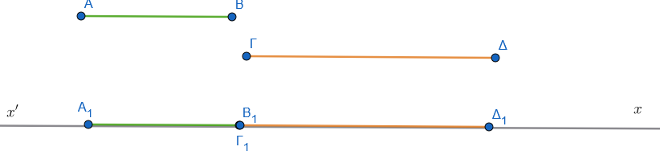
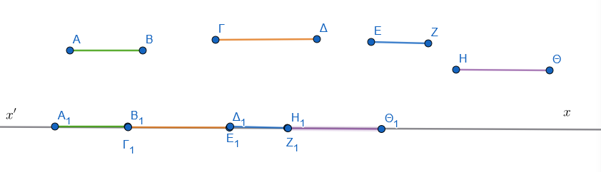
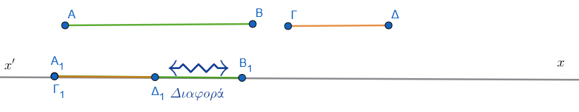

\usepackage{wasysym}

```{=html}
<!-- Φόρτωση βιβλιοθήκης GeoGebra -->
<script src="https://www.geogebra.org/apps/deployggb.js"</script>

<!-- Συνάρτηση δημιουργίας applets -->
<script>
function createGeoGebra(containerId, materialId, width = 700, height = 500) {
  var params = {
    "id": "ggb-" + containerId,
    "material_id": materialId,
    "width": width,
    "height": height,
    "showToolBar": true,
    "showMenuBar": false,
    "showAlgebraInput": true
  };
  
  var applet = new GGBApplet(params, '5.2');
  applet.inject(containerId);
}
</script>
```

------------------------------------------------------------------------

## Πρόσθεση και αφαίρεση ευθυγράμμων τμημάτων

### **Πρόσθεση και Αφαίρεση Ευθυγράμμων Τμημάτων**

::: {style="background-color: #c0d4b8; border: 2px solid #2f3e50; color: #25188a; padding: 15px; border-radius: 5px;"}
#### **Θεωρία – Ορισμοί – Ιδιότητες**

- **Πρόσθεση δύο τμημάτων:** Για να προσθέσουμε δύο ευθύγραμμα τμήματα $ΑΒ$ και $\Gamma\Delta$, τα μεταφέρουμε πάνω σε μία ευθεία $\chi'\chi$ έτσι ώστε να γίνουν **διαδοχικά**, δηλαδή η αρχή $\Gamma$ του δεύτερου να συμπέσει με το τέλος $Β$ του πρώτου. Το ευθύγραμμο τμήμα $Α\Delta= A_1Δ_1$ που ορίζεται από τα άκρα των δύο τμημάτων ονομάζεται **άθροισμα** και συμβολίζεται: $ΑΒ + \Gamma\Delta = Α\Delta$.\
  

<!-- -->

- **Πρόσθεση πολλών τμημάτων:** Γίνεται με τη διαδοχική πρόσθεση κάθε νέου τμήματος στο άθροισμα των προηγουμένων.\
  

- **Αφαίρεση τμημάτων:** Για να αφαιρέσουμε ένα τμήμα $\Gamma\Delta$ από ένα μεγαλύτερο $ΑΒ$, τα τοποθετούμε έτσι ώστε οι αρχές τους $Α$ και $\Gamma$ να συμπίπτουν πάνω στον ίδιο φορέα.
  Το τμήμα που περισσεύει ονομάζεται **διαφορά**.
  Εναλλακτικά, μπορούμε να ταυτίσουμε τα τέλη τους $Β$ και $\Delta$, οπότε η διαφορά είναι το τμήμα που απομένει στην αρχή.\
  

- Αν τα τμήματα είναι ίσα ($AB = \Gamma\Delta$), τότε η διαφορά τους ονομάζεται **μηδενικό ευθύγραμμο τμήμα**, καθώς τα άκρα του ταυτίζονται και το μήκος του είναι μηδέν.

- **Σχέση με το μήκος:** Το μήκος του αθροίσματος δύο τμημάτων ισούται με το άθροισμα των μηκών τους, ενώ το μήκος της διαφοράς ισούται με τη διαφορά των μηκών τους.

- **Περιορισμός αφαίρεσης:** Στη γεωμετρία, η αφαίρεση $ΑΒ - \Gamma\Delta$ είναι δυνατή μόνο όταν το $ΑΒ$ είναι μεγαλύτερο ή ίσο του $\Gamma\Delta$ ($ΑΒ \ge \Gamma\Delta$).

- **Ιδιότητες Πρόσθεσης:**

  1.  **Αντιμεταθετική:** Η σειρά των τμημάτων δεν αλλάζει το άθροισμα ($ΑΒ + \Gamma\Delta = \Gamma\Delta + ΑΒ$).
  2.  **Προσεταιριστική:** Μπορούμε να ομαδοποιούμε τα τμήματα όπως θέλουμε ($(ΑΒ + \Gamma\Delta) + ΕΖ = ΑΒ + (\Gamma\Delta + ΕΖ)$).
  3.  **Ουδέτερο στοιχείο:** Το μηδενικό τμήμα (σημείο) δεν αλλάζει το άθροισμα.

- Η **περίμετρος** ενός ευθυγράμμου σχήματος είναι το **άθροισμα των μηκών όλων των πλευρών** του, αποτελώντας την κυριότερη εφαρμογή της πρόσθεσης ευθυγράμμων τμημάτων.
:::

------------------------------------------------------------------------

**Παραδείγματα**

1.  **Κατασκευή Αθροίσματος:** Αν έχουμε $ΑΒ = 3\text{cm}$ και $\Gamma\Delta = 5\text{cm}$, τοποθετώντας τα διαδοχικά σε μια ευθεία, το συνολικό τμήμα $Α\Delta$ θα έχει μήκος $3 + 5 = 8\text{cm}$.
2.  **Χρήση Διαβήτη:** Με τον διαβήτη παίρνουμε το μήκος του $ΑΒ$, το μεταφέρουμε σε μια ευθεία $\chi'\chi$ και από το σημείο που τελειώνει (τέλος) μεταφέρουμε το μήκος του $\Gamma\Delta$.
3.  **Κατασκευή Διαφοράς:** Αν $ΑΒ = 10\text{cm}$ και $\Gamma\Delta = 4\text{cm}$, τοποθετούμε το $\Gamma\Delta$ πάνω στο $ΑΒ$ με κοινή αφετηρία. Το τμήμα που «περισσεύει» έχει μήκος $10 - 4 = 6\text{cm}$.
4.  **Σύνθετη Πράξη:** Αν ζητείται το τμήμα $\chi = 2\alpha - \beta$, τοποθετούμε δύο φορές διαδοχικά το τμήμα $\alpha$ και από το άκρο του αφαιρούμε το $\beta$.
5.  **Μηδενική Διαφορά:** Αν αφαιρέσουμε ένα τμήμα $ΑΒ$ από τον εαυτό του ($ΑΒ - ΑΒ$), το αποτέλεσμα είναι το μηδενικό τμήμα, δηλαδή ένα σημείο.

------------------------------------------------------------------------

**Ασκήσεις**

1.  Σχεδιάστε δύο τμήματα $ΑΒ = 4\text{cm}$ και $\Gamma\Delta = 3\text{cm}$. Κατασκευάστε το άθροισμά τους $ΑΒ + \Gamma\Delta$ και μετρήστε το τελικό μήκος.
2.  Πάρτε τρία τμήματα $\alpha, \beta, \gamma$. Σχεδιάστε το άθροισμα $(\alpha + \beta) + \gamma$ και το $\alpha + (\beta + \gamma)$. Είναι ίσα;.
3.  Δίνεται τμήμα $ΑΒ = 9\text{cm}$ και τμήμα $\Gamma\Delta = 5\text{cm}$. Κατασκευάστε τη διαφορά τους $ΑΒ - \Gamma\Delta$ και βρείτε το μήκος της με χάρακα.
4.  Πάνω σε μια ημιευθεία $Ο\chi$ πάρτε διαδοχικά τα σημεία $Α, Β, \Gamma$ ώστε $ΟΑ = 2\text{cm}, ΑΒ = 3\text{cm}$ και $Β\Gamma = 4\text{cm}$. Υπολογίστε το μήκος του $Ο\Gamma$.
5.  Αν $Α, Β, \Gamma$ είναι διαδοχικά σημεία μιας ευθείας, δείξτε ότι $Α\Gamma - Β\Gamma = ΑΒ$.
6.  Χρησιμοποιήστε μια χάρτινη λωρίδα για να μεταφέρετε και να προσθέσετε τρία τυχαία τμήματα που σχεδιάσατε στο τετράδιό σας.
7.  Δίνονται τμήματα με μήκη $15\text{mm}, 4\text{cm}$ και $2\text{cm}$. Κατασκευάστε το άθροισμά τους και εκφράστε το σε $\text{cm}$.
8.  Αν $ΑΒ = \Gamma\Delta$, αποδείξτε χρησιμοποιώντας τον νόμο της διαγραφής ότι $ΑΒ + Β\Gamma = \Gamma\Delta + Β\Gamma$.
9.  Σχεδιάστε ένα τμήμα $ΑΒ = 8\text{cm}$ και βρείτε το μέσο του $Μ$. Αποδείξτε με μέτρηση ότι $ΑΜ + ΜΒ = ΑΒ$.
10. Πάνω σε μια ευθεία πάρτε τα σημεία $Α, Β, \Gamma, \Delta$ στη σειρά. Αν $Α\Delta = 12\text{cm}$ και $Β\Gamma = 5\text{cm}$, υπολογίστε το άθροισμα των τμημάτων $ΑΒ + \Gamma\Delta$.

------------------------------------------------------------------------

### **Ασκήσεις και Εφαρμογές**

Ακολουθούν ενδεικτικά παραδείγματα :

1.  **Υπολογισμός διαδοχικών τμημάτων:** Πάνω σε μια ευθεία παίρνουμε τα διαδοχικά σημεία $A, B$ και $\Gamma$ έτσι ώστε $AB = 6 cm$ και $A\Gamma = 10 cm$. Βρείτε το μήκος του $B\Gamma$.
    - *Λύση:* Το τμήμα $B\Gamma$ βρίσκεται από τη διαφορά: $B\Gamma = A\Gamma - AB = 10 - 6 = 4 cm$.
2.  **Σύνθεση με μέσο τμήματος:** Αν στο προηγούμενο παράδειγμα το $M$ είναι το **μέσο** του $AB$, να υπολογιστεί το μήκος του τμήματος $M\Gamma$.
    - *Λύση:* Το $MB$ είναι το μισό του $AB$, δηλαδή $3 cm$. Το $M\Gamma$ προκύπτει από το άθροισμα: $M\Gamma = MB + B\Gamma = 3 + 4 = 7 cm$.
3.  **Αντικείμενες Ημιευθείες:** Θεωρούμε δύο αντικείμενες ημιευθείες $Ox$ και $O\psi$. Στην $Ox$ παίρνουμε το σημείο $A$ με $OA = 3 cm$ και στην $O\psi$ το σημείο $\Gamma$ με $O\Gamma = 2 cm$. Βρείτε την απόσταση $A\Gamma$.
    - *Λύση:* Επειδή οι ημιευθείες είναι αντικείμενες, το $O$ βρίσκεται ανάμεσα στα σημεία. Άρα η συνολική απόσταση είναι το άθροισμα: $A\Gamma = AO + O\Gamma = 3 + 2 = 5 cm$.
4.  **Άσκηση Κρίσεως (Πολλαπλές Λύσεις):** Πάνω σε μια ευθεία βρίσκονται τα σημεία $A$ και $\Gamma$ με $A\Gamma = 8 cm$ και το μέσο τους $M$. Αν ένα σημείο $B$ απέχει $2 cm$ από το $M$, βρείτε τα μήκη $AB$ και $B\Gamma$.
    - *Ανάλυση:* Υπάρχουν δύο περιπτώσεις ανάλογα με τη θέση του $B$:
      - Αν το $B$ είναι ανάμεσα στα $A$ και $M$, τότε $AB = AM - BM = 4 - 2 = 2 cm$ και $B\Gamma = BM + M\Gamma = 2 + 4 = 6 cm$.
      - Αν το $B$ είναι ανάμεσα στα $M$ και $\Gamma$, τότε $AB = AM + MB = 4 + 2 = 6 cm$ και $B\Gamma = M\Gamma - MB = 4 - 2 = 2 cm$.

### **1. Ασκήσεις Βασικών Υπολογισμών**

- **Διαδοχικά σημεία:** Πάνω σε μια ευθεία παίρνουμε τα διαδοχικά σημεία $A, B$ και $\Gamma$ έτσι ώστε $AB = 6\text{ cm}$ και $A\Gamma = 10\text{ cm}$.
  Αν $M$ είναι το μέσο του $AB$, να υπολογίσετε τα μήκη των τμημάτων $B\Gamma$, $AM$ και $M\Gamma$.

- *Λύση:* $B\Gamma = A\Gamma - AB = 10 - 6 = 4\text{ cm}$.
  $AM = AB / 2 = 3\text{ cm}$.
  $M\Gamma = MB + B\Gamma = 3 + 4 = 7\text{ cm}$.

- **Πολλαπλά διαδοχικά σημεία:** Σε μία ευθεία παίρνουμε με τη σειρά τα σημεία $A, B, \Gamma, \Delta, E$ ώστε $AB=2\text{ cm}$, $B\Gamma=4\text{ cm}$, $\Gamma\\Delta=1\text{ cm}$ και $\Delta E=5\text{ cm}$.

  - α) Συγκρίνετε τα τμήματα $A\Gamma$ με το $B\Delta$ και το $BE$ με το $A\Delta$.

  - β) Ποιο σημείο είναι το μέσο του $AE$;

- **Τεθλασμένη γραμμή:** Σχεδιάστε μια τεθλασμένη γραμμή $AB\Gamma\Delta$ έτσι ώστε $B\Gamma = 4AB$ και $\Gamma\Delta = 2AB$.
  Αν το μήκος $B\Gamma$ είναι $8\text{ cm}$, βρείτε το συνολικό μήκος της τεθλασμένης γραμμής.

  - *Υπόδειξη:* Πρώτα υπολογίστε το $AB$ ($8 : 4 = 2\text{ cm}$) και μετά το $\Gamma\Delta$ ($2 \times 2 = 4\text{ cm}$).

### **2. Ασκήσεις σε Ημιευθείες και Αντικείμενες Ημιευθείες**

- **Πρόσθεση σε αντικείμενες ημιευθείες:** Θεωρούμε δύο αντικείμενες ημιευθείες $Ox$ και $O\psi$.
  Στην $Ox$ παίρνουμε σημεία $A$ και $B$ με $OA = 3\text{ cm}$ και $OB = 7\text{ cm}$.
  Στην $O\psi$ παίρνουμε σημείο $\Gamma$ με $O\Gamma = 2\text{ cm}$.
  Να βρεθούν οι αποστάσεις $\Gamma A$ και $\Gamma B$.

- *Λύση:* Επειδή οι ημιευθείες είναι αντικείμενες, το $O$ είναι ανάμεσα στα σημεία.
  Άρα $\Gamma A = \Gamma O + OA = 2 + 3 = 5\text{ cm}$ και $\Gamma B = \Gamma O + OB = 2 + 7 = 9\text{ cm}$.

- **Μέσο σε ημιευθεία:** Σε μια ημιευθεία $Ox$ παίρνουμε τα σημεία $A$ και $B$ έτσι ώστε $OA = 1,6\text{ cm}$ και $OB = 3\text{ cm}$.
  Αν $M$ είναι το μέσο του $AB$, να βρεθεί το μήκος του $OM$.

  - *Λύση:* $AB = OB - OA = 1,4\text{ cm}$. Το $AM = 1,4 : 2 = 0,7\text{ cm}$. Τότε $OM = OA + AM = 1,6 + 0,7 = 2,3\text{ cm}$.

### **3. Ασκήσεις Κρίσεως και Πολλαπλών Λύσεων**

- **Περίπτωση με δύο λύσεις:** Πάνω σε μια ευθεία παίρνουμε τα σημεία $A$ και $\Gamma$ με απόσταση $A\Gamma = 8\text{ cm}$ και το μέσο τους $M$.
  Αν ένα σημείο $B$ της ευθείας απέχει $2\text{ cm}$ από το $M$, να βρεθούν τα μήκη των $AB$ και $B\Gamma$.

- *Ανάλυση:* Υπάρχουν δύο περιπτώσεις για τη θέση του $B$ (είτε προς το μέρος του $A$ είτε προς το μέρος του $\Gamma$).

- **Σύνθετη αφαίρεση:** Στο ευθύγραμμο τμήμα $AB = 16\text{ cm}$ παίρνουμε τα σημεία $\Gamma, \Delta$ και $O$ τέτοια ώστε $AB = 4A\Gamma$, $\Gamma B = 4\Delta B$ και $O$ το μέσο του $\Gamma\Delta$.
  Βρείτε το μήκος του $O\Delta$ και το μήκος του $AM$, αν $M$ είναι το μέσο του $AO$.

### **4. Ασκήσεις Θεωρητικής Επαλήθευσης**

- **Ιδιότητα αθροίσματος:** Σε ευθεία $\epsilon$ παίρνουμε τα διαδοχικά σημεία $A, B, \Gamma$ και $\Delta$ ώστε $AB = \Gamma\Delta$.
  Δικαιολογήστε γιατί $A\Gamma = B\Delta$.

  - *Απόδειξη:* $A\Gamma = AB + B\Gamma$ και $B\Delta = B\Gamma + \Gamma\Delta$. Αφού $AB = \Gamma\Delta$, τα αθροίσματα είναι ίσα.

- **Σχέση μέσων και συνολικού μήκους:** Σε ευθεία $\epsilon$ παίρνουμε τα διαδοχικά σημεία $A, B$ και $\Gamma$.
  Αν $M$ και $N$ είναι τα μέσα των $AB$ και $B\Gamma$ αντίστοιχα, δικαιολογήστε ότι $A\Gamma = 2MN$.

  - *Απόδειξη:* $MN = MB + BN = \frac{AB}{2} + \frac{B\Gamma}{2} = \frac{AB + B\Gamma}{2} = \frac{A\Gamma}{2}$.

**Πρακτική συμβουλή:** Κατά την επίλυση, είναι σημαντικό να γράφετε τις **μονάδες μέτρησης** σε όλες τις πράξεις και όχι μόνο στο αποτέλεσμα.
Επίσης, τα σχήματα πρέπει να γίνονται με **χάρακα** και τα γράμματα να είναι οριζόντια για να αποφεύγονται παρερμηνείες (π.χ. το $M$ να μη μοιάζει με $\Sigma$).

::: {style="background-color: #f0f8cc; border: 2px solid #2f3e50; color: #25188a; padding: 15px; border-radius: 5px;"}
ΚΑΛΗ ΜΕΛΕΤΗ !
:::
