\usepackage{wasysym}

```{=html}
<!-- Φόρτωση βιβλιοθήκης GeoGebra -->
<script src="https://www.geogebra.org/apps/deployggb.js"</script>

<!-- Συνάρτηση δημιουργίας applets -->
<script>
function createGeoGebra(containerId, materialId, width = 700, height = 500) {
  var params = {
    "id": "ggb-" + containerId,
    "material_id": materialId,
    "width": width,
    "height": height,
    "showToolBar": true,
    "showMenuBar": false,
    "showAlgebraInput": true
  };
  
  var applet = new GGBApplet(params, '5.2');
  applet.inject(containerId);
}
</script>
```

------------------------------------------------------------------------

## Μέτρηση, σύγκριση και ισότητα γωνιών – Διχοτόμος γωνίας

### **Μοναδικότητα και Εξάρτηση Μέτρου Γωνίας**

::: {style="background-color: #c0d4b8; border: 2px solid #2f3e50; color: #25188a; padding: 15px; border-radius: 5px;"}
**Θεωρία – Ορισμοί – Ιδιότητες**

- **Μέτρηση γωνίας:** Είναι η σύγκριση μιας γωνίας με μια άλλη που λαμβάνεται ως μονάδα μέτρησης.\
  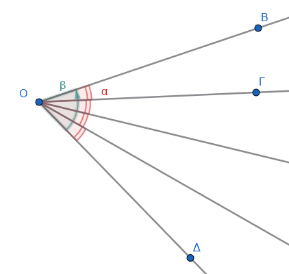

- **Μέτρο γωνίας:** Είναι ο αριθμός που εκφράζει από πόσες μονάδες αποτελείται η γωνία.

$$\hat β=4\cdot \hat a$$

- **Μοναδικότητα:** Κάθε γωνία έχει ένα ορισμένο μέτρο που αντιστοιχεί στο μέτρο του αντίστοιχου τόξου περιφέρειας, η οποία γράφεται με κέντρο την κορυφή της γωνίας.\
  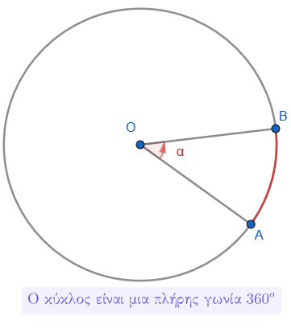

- **Εξάρτηση από το «άνοιγμα»:** Το μέγεθος μιας γωνίας εξαρτάται αποκλειστικά από το άνοιγμα των πλευρών της και όχι από το μήκος τους, καθώς οι πλευρές είναι ημιευθείες και μπορούν να επεκταθούν απεριόριστα.
:::

**Παραδείγματα**

1.  Μια γωνία που περιέχει ακριβώς 40 φορές τη μοναδιαία γωνία έχει μέτρο 40.
2.  Η ορθή γωνία έχει σταθερό μέτρο (90° ή 100 gr) ανεξάρτητα από το πώς σχεδιάζεται.
3.  Η πλήρης γωνία αντιστοιχεί σε ολόκληρη την περιφέρεια κύκλου (360° ή 400 gr).
4.  Η μηδενική γωνία έχει μέτρο 0, καθώς οι πλευρές της συμπίπτουν.
5.  Σε ομόκεντρους κύκλους, η ίδια γωνία ορίζει τόξα με διαφορετικά μήκη αλλά με το ίδιο μέτρο σε μοίρες.

**Ασκήσεις**

1.  Αν μια γωνία είναι το μισό της ορθής, ποιο είναι το μέτρο της σε μοίρες;
2.  Εξηγήστε γιατί η γωνία δεν αλλάζει αν προεκτείνουμε τις πλευρές της με χάρακα.
3.  Βρείτε το μέτρο μιας γωνίας που είναι τα 2/3 της ορθής.
4.  Υπολογίστε το μέτρο γωνίας που αντιστοιχεί στο 1/6 μιας πλήρους περιστροφής.
5.  Πόσες ορθές γωνίες περιέχονται σε μια γωνία 270°;
6.  Αν το άνοιγμα των πλευρών μιας γωνίας διπλασιαστεί, τι συμβαίνει στο μέτρο της;
7.  Χαρακτηρίστε ως οξεία ή αμβλεία μια γωνία 110°.
8.  Βρείτε το μέτρο της γωνίας που σχηματίζουν οι δείκτες του ρολογιού στις 6:00.

------------------------------------------------------------------------

### **Μονάδες Μέτρησης και Χρήση Μοιρογνωμονίου**

::: {style="background-color: #c0d4b8; border: 2px solid #2f3e50; color: #25188a; padding: 15px; border-radius: 5px;"}
**Θεωρία – Ορισμοί – Ιδιότητες**

- **Βασική μονάδα:** Η **μοίρα (°)**, που ορίζεται ως το \$\dfrac{1}{360} της περιφέρειας κύκλου.

- **Υποδιαιρέσεις μοίρας:** 1 μοίρα = 60 πρώτα λεπτά (60') και 1 πρώτο λεπτό = 60 δεύτερα λεπτά (60'').

- **Ο βαθμός :** Μονάδα του δεκαδικού συστήματος, όπου η περιφέρεια διαιρείται σε 400 ίσα μέρη.

- **Μοιρογνωμόνιο (γωνιόμετρο):** Όργανο σε σχήμα ημικυκλίου βαθμολογημένο από 0° έως 180°.\
  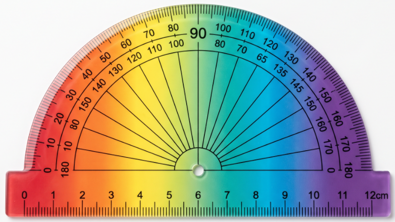{width="500"}

- **Διαδικασία μέτρησης:** Τοποθετούμε το κέντρο του οργάνου στην κορυφή της γωνίας και τη διάμετρό του πάνω στη μία πλευρά.
  Η άλλη πλευρά δείχνει το μέτρο στην κλίμακα.\
  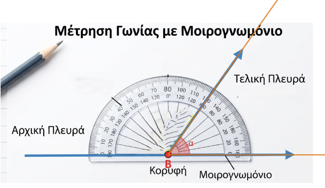{width="500"}

  $$\hat a=60^o$$
:::

**Παραδείγματα**

1.  Μετατροπή: 1 ορθή γωνία = 90° = 100 gr.
2.  Συμμιγής αριθμός: Μέτρο γωνίας 42° 15' 20''.
3.  Άθροισμα γωνιών: 30° 40' + 20° 30' = 51° 10'.
4.  Χρήση μοιρογνωμονίου για μέτρηση γωνίας 50°.
5.  Μετατροπή μοιρών σε βαθμούς χρησιμοποιώντας ειδικούς πίνακες.

**Ασκήσεις**

1.  Πόσα δεύτερα λεπτά ('') έχει μια γωνία 2°;
2.  Μετατρέψτε σε μοίρες τη γωνία των 50 gr.
3.  Υπολογίστε το άθροισμα: 15° 26' 34'' + 36° 42' 53''.
4.  Βρείτε τη διαφορά: 84° 32' – 47° 54' 26''.
5.  Σχεδιάστε μια τυχαία γωνία και μετρήστε την με το μοιρογνωμόνιο.
6.  Πόσες μοίρες είναι τα 0,6 της ορθής γωνίας;
7.  Εκφράστε σε βαθμούς (gr) τη γωνία των 180°.
8.  Πόσα πρώτα λεπτά (') περιέχονται σε 3 μοίρες;
9.  Μετρήστε τις γωνίες ενός τριγώνου και βρείτε το άθροισμά τους.
10. Μετατρέψτε τον συμμιγή 32° 16' 40'' σε κλασματική μορφή μοιρών.

------------------------------------------------------------------------

### **Σύγκριση και Ισότητα Γωνιών**

::: {style="background-color: #c0d4b8; border: 2px solid #2f3e50; color: #25188a; padding: 15px; border-radius: 5px;"}
**Θεωρία – Ορισμοί – Ιδιότητες**

- **Ισότητα:** Δύο γωνίες είναι ίσες αν, όταν τοποθετηθούν η μια πάνω στην άλλη, συμπίπτουν (εφαρμόζουν).\
  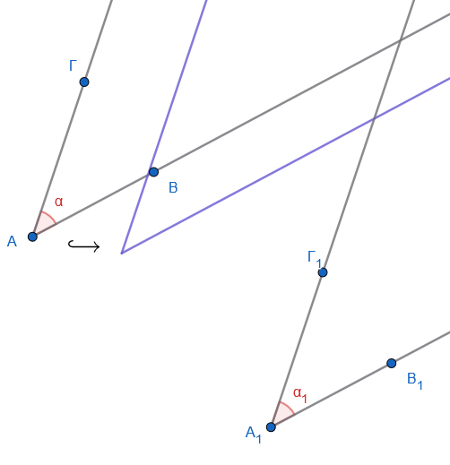{width="250"} 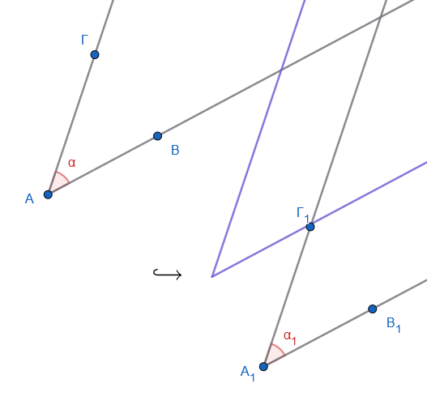{width="250"} 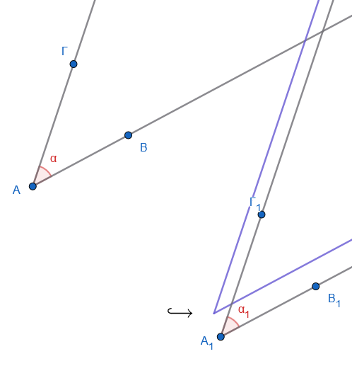{width="250"} 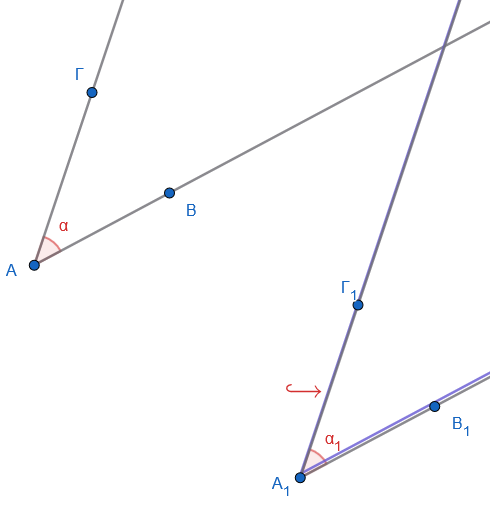{width="250"}

- **Μέθοδος διαφανούς χαρτιού:** Αποτυπώνουμε τη μια γωνία σε διαφανές χαρτί και τη μεταφέρουμε στην άλλη για έλεγχο σύμπτωσης.

- **Σχέση με το μέτρο:** Δύο γωνίες είναι ίσες αν και μόνο αν έχουν το ίδιο μέτρο.

- **Ανισότητα:** Μια γωνία είναι μεγαλύτερη από μια άλλη αν η δεύτερη είναι ίση με μέρος της πρώτης.
:::

------------------------------------------------------------------------

::: {style="background-color: #f0f8cc; border: 2px solid #2f3e50; color: #25188a; padding: 15px; border-radius: 5px;"}
Στο παρακάτω εφαρμογίδιο μετακινήστε τα σημεία Α,Β,Γ και Δ για να τους αλλάξετε θέση.

Τι παρατηρείτε για τις γωνίες; Πότε μια γωνία γίνεται μεγαλύτερη από την άλλη;Ποια είναι η θέση των πλευρών τους σε αυτή τη περίπτωση;

Πότε γίνονται ίσες; Ποια είναι η θέση των πλευρών τους σε αυτή τη περίπτωση;
:::

<iframe src="https://www.geogebra.org/calculator/qrkk8qzt?embed" width="730" height="600" allowfullscreen style="border: 1px solid #e4e4e4;border-radius: 4px;" frameborder="0">

</iframe>

**Παραδείγματα**

1.  Όλες οι ορθές γωνίες είναι ίσες μεταξύ τους.
2.  Οι γωνίες της βάσης ενός ισοσκελούς τριγώνου είναι ίσες.
3.  Σε δύο ίσους κύκλους, οι επίκεντρες γωνίες που βαίνουν σε ίσα τόξα είναι ίσες.
4.  Σύγκριση γωνιών ρολογιού: Η γωνία στις 3:00 είναι ίση με τη γωνία στις 9:00.

**Ασκήσεις**

1.  Σχεδιάστε δύο γωνίες και συγκρίνετέ τις χρησιμοποιώντας διαφανές χαρτί.
2.  Συγκρίνετε τις γωνίες που σχηματίζει μια τέμνουσα σε δύο παράλληλες ευθείες.
3.  Αν $\hat{A} = 60^\circ$ και $\hat{B} = 60^\circ$, είναι οι γωνίες ίσες;
4.  Σχεδιάστε ένα ισόπλευρο τρίγωνο και επαληθεύστε την ισότητα των γωνιών του.
5.  Χρησιμοποιήστε το σύμβολο $>$ ή $<$ για να συγκρίνετε γωνίες 30° και 70°.
6.  Συγκρίνετε τις γωνίες ενός ρόμβου.

------------------------------------------------------------------------

### **Σχεδίαση Γωνιών με Δοσμένο Μέτρο**

::: {style="background-color: #c0d4b8; border: 2px solid #2f3e50; color: #25188a; padding: 15px; border-radius: 5px;"}
**Θεωρία – Ορισμοί – Ιδιότητες**

- **Χρήση γωνιομέτρου:** Για να σχεδιάσουμε μια γωνία, χαράσσουμε την αρχική πλευρά, τοποθετούμε το κέντρο του γωνιομέτρου στην αρχή της, σημαδεύουμε την ένδειξη των μοιρών και ενώνουμε με την κορυφή.\

  \
  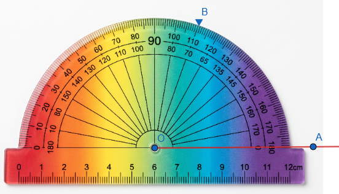{width="400"}\
  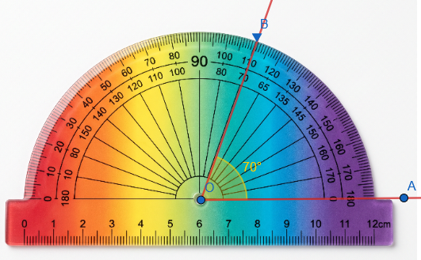{width="400"}

- **Χρήση γνώμονα:** Για τη σχεδίαση ορθών γωνιών (90°) χρησιμοποιούμε το όργανο «ορθογώνιο» ή γνώμονα.\
  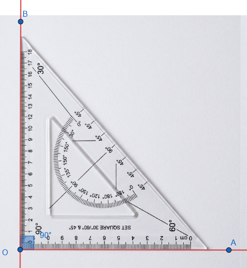{width="400"}

- **Κατασκευή με διαβήτη:** Μπορούμε να κατασκευάσουμε γωνίες 60°, 30°, 90°, 45° χρησιμοποιώντας μόνο διαβήτη και χάρακα μέσω ισοπλεύρων τριγώνων και διχοτομήσεων.
:::

**Παραδείγματα**

1.  Κατασκευή γωνίας 75° με μοιρογνωμόνιο.
2.  Σχεδίαση ορθής γωνίας με γνώμονα πάνω σε μια ημιευθεία.
3.  Κατασκευή γωνίας 300° σχεδιάζοντας την κυρτή των 60° και παίρνοντας τη μη κυρτή.
4.  Σχεδίαση γωνίας 60° με διαβήτη μέσω ισοπλεύρου τριγώνου.
5.  Σχεδίαση γωνίας ίσης με μια δοσμένη χωρίς μοιρογνωμόνιο.

**Ασκήσεις**

1.  Κατασκευάστε γωνίες 30°, 60° και 70° με μοιρογνωμόνιο.
2.  Σχεδιάστε μια ορθή γωνία χρησιμοποιώντας μόνο τον γνώμονα.
3.  Κατασκευάστε γωνίες 120° και 150°.
4.  Σχεδιάστε μια γωνία 240°.
5.  Κατασκευάστε μια γωνία 45° χωρίς μοιρογνωμόνιο (διχοτόμηση ορθής).
6.  Σχεδιάστε μια ημιευθεία $Οx$ και κατασκευάστε εκατέρωθεν αυτής δύο γωνίες 75°.
7.  Κατασκευάστε το άθροισμα δύο γωνιών 30° και 45°.
8.  Σχεδιάστε μια γωνία 60° χρησιμοποιώντας μόνο διαβήτη και χάρακα.
9.  Σχεδιάστε μια γωνία 22,5°.

------------------------------------------------------------------------

**Διχοτόμος Γωνίας (Ορισμός, Μοναδικότητα, Σχεδίαση)**

::: {style="background-color: #c0d4b8; border: 2px solid #2f3e50; color: #25188a; padding: 15px; border-radius: 5px;"}
**Θεωρία – Ορισμοί – Ιδιότητες**

- **Ορισμός:** Διχοτόμος μιας γωνίας ονομάζεται η ημιευθεία που έχει αρχή την κορυφή της γωνίας και τη χωρίζει σε δύο ίσες γωνίες.

- **Μοναδικότητα:** Κάθε γωνία έχει μία και μοναδική διχοτόμο.

- **Ιδιότητα:** Κάθε σημείο της διχοτόμου ισαπέχει από τις πλευρές της γωνίας.

- **Άξονας Συμμετρίας:** Η διχοτόμος είναι ο άξονας συμμετρίας της γωνίας.

- **Σχεδίαση:** Μπορεί να βρεθεί με μοιρογνωμόνιο, με δίπλωση χαρτιού, με το μέσο του αντίστοιχου τόξου ή με διαβήτη και χάρακα.\
  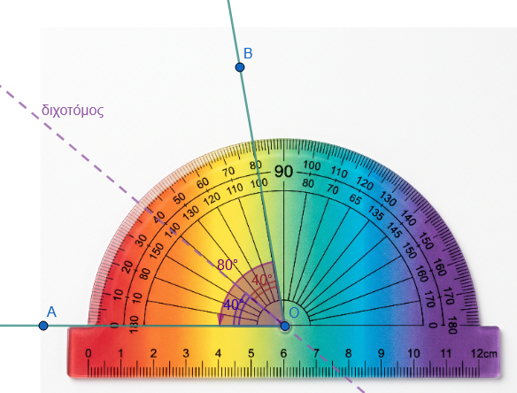{width="500"}
:::

------------------------------------------------------------------------

::: {style="background-color: #f0f8cc; border: 2px solid #2f3e50; color: #25188a; padding: 15px; border-radius: 5px;"}
Στο παρακάτω εφαρμογίδιο μετακινήστε τα σημεία Ο,Β και Γ για να τους αλλάξετε θέση.

Τι παρατηρείτε για την διχοτόμο;
:::

<iframe src="https://www.geogebra.org/calculator/y8kgkvfa?embed" width="730" height="600" allowfullscreen style="border: 1px solid #e4e4e4;border-radius: 4px;" frameborder="0">

</iframe>

**Παραδείγματα**

1.  Διχοτόμηση ορθής γωνίας: Προκύπτουν δύο γωνίες των 45° η καθεμία.
2.  Η διχοτόμος της γωνίας της κορυφής ισοσκελούς τριγώνου είναι και διάμεσος και ύψος.
3.  Αν διπλώσουμε μια γωνία ώστε οι πλευρές της να συμπέσουν, η τσάκιση είναι η διχοτόμος.
4.  Οι τρεις διχοτόμοι ενός τριγώνου συγκλίνουν σε ένα σημείο (έγκεντρο).
5.  Η διχοτόμος μιας επίκεντρης γωνίας περνά από το μέσο του αντίστοιχου τόξου.

**Ασκήσεις**

1.  Σχεδιάστε μια γωνία 64° και βρείτε τη διχοτόμο της με μοιρογνωμόνιο.
2.  Κατασκευάστε τη διχοτόμο μιας γωνίας χρησιμοποιώντας μόνο διαβήτη και χάρακα.
3.  Αποδείξτε σχεδιάζοντας ότι οι διχοτόμοι δύο κατακορυφήν γωνιών είναι αντίθετες ημιευθείες.
4.  Βρείτε τη γωνία που σχηματίζουν οι διχοτόμοι δύο εφεξής παραπληρωματικών γωνιών (είναι 90°).
5.  Σχεδιάστε τη διχοτόμο μιας γωνίας μέσω δίπλωσης χαρτιού.
6.  Χωρίστε μια γωνία σε 4 ίσες γωνίες με διαδοχικές διχοτομήσεις.
7.  Αν η διχοτόμος μιας γωνίας σχηματίζει με μια πλευρά γωνία 25°, πόσο είναι το μέτρο της αρχικής γωνίας;
8.  Σχεδιάστε ένα ισοσκελές τρίγωνο και τη διχοτόμο της κορυφής του. Δείξτε ότι είναι κάθετη στη βάση.
9.  Σχεδιάστε δύο ίσες εφεξής γωνίες και δείξτε ότι η κοινή τους πλευρά είναι η διχοτόμος της γωνίας που σχηματίζουν οι μη κοινές πλευρές.
10. Αποδείξτε με διαβήτη ότι ένα σημείο $M$ της διχοτόμου απέχει εξίσου από τις πλευρές της γωνίας.

------------------------------------------------------------------------

### **Σημαντικές Ιδιότητες και Θεωρήματα**

- **Στο Τρίγωνο:** Οι τρεις διχοτόμοι των γωνιών ενός τριγώνου διέρχονται από το ίδιο σημείο, το οποίο ονομάζεται **έγκεντρο** και είναι το κέντρο του εγγεγραμμένου κύκλου.

::: {style="background-color: #f0f8cc; border: 2px solid #2f3e50; color: #25188a; padding: 15px; border-radius: 5px;"}
Σύρετε τις κορυφές του τριγώνου.

Τι παρατηρείτε;

Τί συμβαίνει με το σημείο τομής των διχοτόμων;

Τι παρατηρείτε για τον κύκλο;
:::

<iframe src="https://www.geogebra.org/calculator/h5zxhrpf?embed" width="730" height="600" allowfullscreen style="border: 1px solid #e4e4e4;border-radius: 4px;" frameborder="0">

</iframe>

- **Στο Ισοσκελές Τρίγωνο:** Η διχοτόμος της γωνίας της κορυφής είναι ταυτόχρονα **διάμεσος και ύψος**. Επίσης οι **προσκείμενες στην βάση** του γωνίες είναι ίσες.

::: {style="background-color: #f0f8cc; border: 2px solid #2f3e50; color: #25188a; padding: 15px; border-radius: 5px;"}
Αλλάξτε την θέση των κορυφών του τριγώνου.

Τι παρατηρείτε για την διάμεσο ΑΜ και τις γωνίες του τριγώνου;

Είναι η ΑΜ διάμεσος; Γιατί;

Είναι η ΑΜ διχοτόμος; Γιατί;
:::

<iframe src="https://www.geogebra.org/calculator/k6gckxxk?embed" width="730" height="600" allowfullscreen style="border: 1px solid #e4e4e4;border-radius: 4px;" frameborder="0">

</iframe>

### Ασκήσεις

**1. Ασκήσεις Μέτρησης και Κατασκευής Γωνιών**

- **Χρήση Μοιρογνωμονίου:** Σχεδιάστε μια γωνία $30^\circ$ χρησιμοποιώντας το μοιρογνωμόνιο.
  Θυμηθείτε ότι το μοιρογνωμόνιο είναι βαθμολογημένο από $0^\circ$ έως $180^\circ$.

- **Μέτρηση σε Τρίγωνα:** Σχεδιάστε μια ορθή γωνία $xOy = 90^\circ$.
  Πάρτε σημείο $A$ στην $Ox$ ώστε $OA = 3,5 \text{ cm}$ και βρείτε σημείο $B$ στην $Oy$ ώστε $AB = 7 \text{ cm}$.
  Μετρήστε με το μοιρογνωμόνιο τις γωνίες $\hat{A}$ και $\hat{B}$ του τριγώνου $OAB$.

- **Πρακτική Εφαρμογή:** Ένα πλοίο διανύει $100 \text{ km}$ προς Βορρά και μετά στρίβει δεξιά κατά $60^\circ$.
  Μετά από $60 \text{ km}$ πορείας, στρίβει αριστερά κατά $25^\circ$.
  Χαράξτε την πορεία σε κλίμακα και μετρήστε τη γωνία της τελευταίας πορείας με τον άξονα Βορρά-Νότου.

**2. Ασκήσεις Σύγκρισης και Ισότητας Γωνιών**

- **Γεωμετρική Σύγκριση:** Συγκρίνετε τις προσκείμενες στη βάση γωνίες ενός **ισοσκελούς τριγώνου** χρησιμοποιώντας διαφανές χαρτί ή μοιρογνωμόνιο.
  Διαπιστώστε ότι είναι ίσες.

- **Ισόπλευρο Τρίγωνο:** Συγκρίνετε τις τρεις γωνίες ενός ισόπλευρου τριγώνου.
  Θυμηθείτε ότι κάθε γωνία ισοπλεύρου τριγώνου είναι $60^\circ$.

- **Σχέσεις Μεγεθών:** Αν έχετε δύο γωνίες $x\hat{O}y$ και $z\hat{O}t$ και η μία πλευρά της δεύτερης πέφτει στο εσωτερικό της πρώτης (με κοινή κορυφή και μία κοινή πλευρά), ποια γωνία είναι μεγαλύτερη;.

**3. Ασκήσεις για τη Διχοτόμο Γωνίας**

- **Κατασκευή με δύο Τρόπους:** Κατασκευάστε τη διχοτόμο μιας τυχαίας γωνίας $yOx$ με: (α) **δίπλωση** χαρτιού, (β) **μοιρογνωμόνιο** .

- **Διχοτόμοι Ειδικών Γωνιών:** Σχηματίστε γωνίες $46^\circ, 86^\circ, 100^\circ$ και $90^\circ$ και σχεδιάστε τις διχοτόμους τους με κανόνα και διαβήτη.

- **Υπολογισμός Μέτρου:** Πόσες μοίρες είναι οι γωνίες στις οποίες χωρίζεται από τη διχοτόμο της: (α) μια πλήρης γωνία, (β) μια ευθεία γωνία και (γ) μια ορθή γωνία;.

- **Ιδιότητες στο Τρίγωνο:** Σε ένα τρίγωνο $ABC$ με $\hat{A} = 40^\circ$ και $\hat{B} = 60^\circ$, βρείτε τη γωνία $\hat{C}$ και σχεδιάστε τις τρεις διχοτόμους του.
  Θυμηθείτε ότι οι τρεις διχοτόμοι κάθε τριγώνου διέρχονται από το ίδιο σημείο.

**4. Συνδυαστικές Ασκήσεις και Υπολογισμοί**

- **Συμπληρωματικές Γωνίες:** Υπολογίστε δύο γωνίες αν γνωρίζετε οτι έχουν άθροισμα 90 και η μία είναι **διπλάσια** ή **τριπλάσια** της άλλης.

- **Παραπληρωματικές Γωνίες:** Βρείτε δύο γωνίες που έχουν άθροσμα 180 και η μία είναι **τετραπλάσια** της άλλης.

- **Άθροισμα Εφεξής Γωνιών:** Δίνονται δύο γωνίες $x\hat{O}y = 30^\circ$ και $y\hat{O}z = 50^\circ$ που έχουν κοινή κορυφή και μία κοινή πλευρά και οι διχοτόμοι τους $O\delta_1$ και $O\delta_2$.
  Υπολογίστε τη γωνία $\hat{xO\delta_2}$ και συγκρίνετέ τη με τη $\hat{xOz}$.

**Πρακτική Συμβουλή:** Όταν γράφετε μια γωνία με τρία κεφαλαία γράμματα, το σύμβολο της γωνίας πρέπει να μπαίνει πάντα στο **μεσαίο γράμμα** που δείχνει την κορυφή.

::: {style="background-color: #f0f8cc; border: 2px solid #2f3e50; color: #25188a; padding: 15px; border-radius: 5px;"}
ΚΑΛΗ ΜΕΛΕΤΗ !
:::
