\usepackage{wasysym}

```{=html}
<!-- Φόρτωση βιβλιοθήκης GeoGebra -->
<script src="https://www.geogebra.org/apps/deployggb.js"</script>

<!-- Συνάρτηση δημιουργίας applets -->
<script>
function createGeoGebra(containerId, materialId, width = 700, height = 500) {
  var params = {
    "id": "ggb-" + containerId,
    "material_id": materialId,
    "width": width,
    "height": height,
    "showToolBar": true,
    "showMenuBar": false,
    "showAlgebraInput": true
  };
  
  var applet = new GGBApplet(params, '5.2');
  applet.inject(containerId);
}
</script>
```

------------------------------------------------------------------------

## Θέσεις ευθειών στο επίπεδο

### **Σχετικές Θέσεις Ευθειών: Τομή και Παραλληλία**

::: {style="background-color: #c0d4b8; border: 2px solid #2f3e50; color: #25188a; padding: 15px; border-radius: 5px;"}
**Θεωρία – Ορισμοί – Ιδιότητες**

- **Τομή δύο ευθειών:** Όταν δύο διαφορετικές ευθείες ενός επιπέδου έχουν ένα μόνο κοινό σημείο, λέμε ότι οι ευθείες αυτές **τέμνονται**.
  Το κοινό αυτό σημείο ονομάζεται **σημείο τομής**.\
  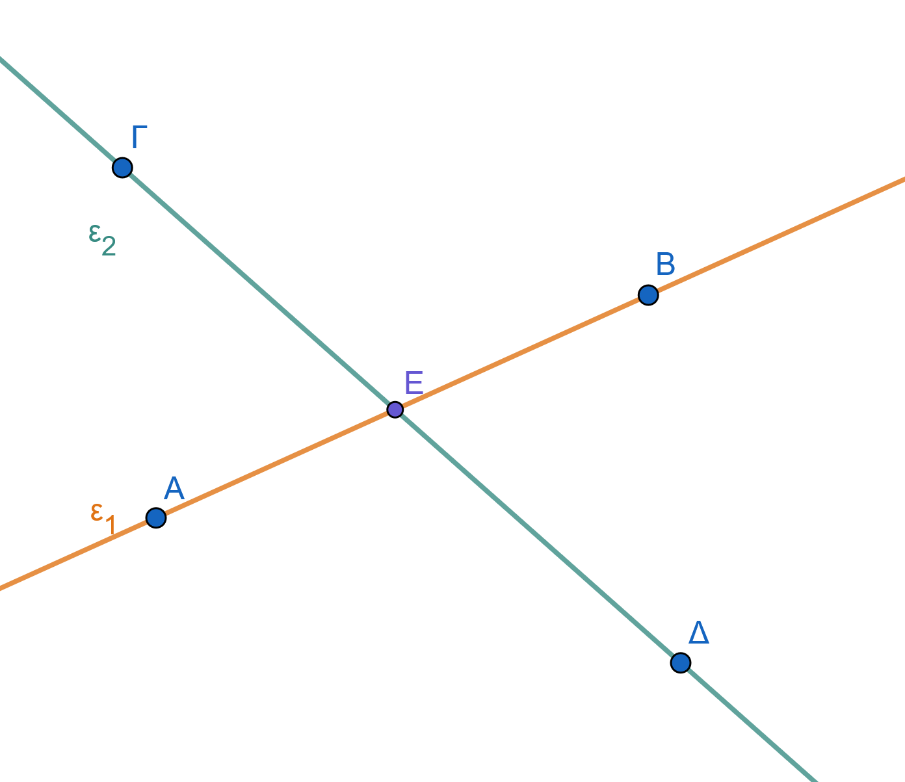{width="400"}

- **Παράλληλες ευθείες (στενή σημασία):** Δύο ευθείες του ίδιου επιπέδου που δεν έχουν κανένα κοινό σημείο, όσο κι αν προεκταθούν, ονομάζονται **παράλληλες**.\
  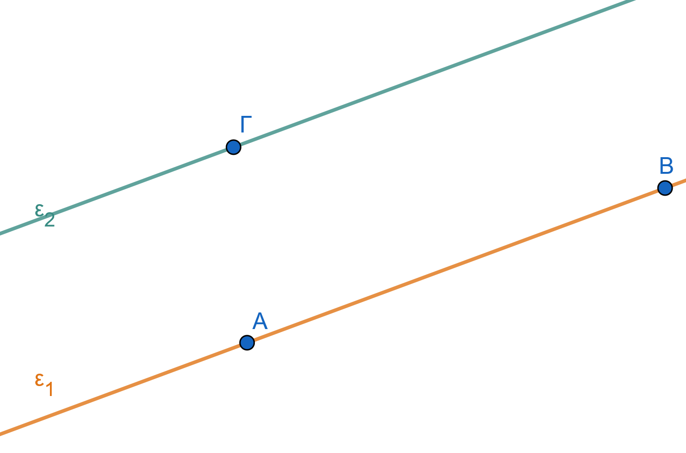{width="400"}

- **Ταυτιζόμενες ευθείες:** Αν δύο ευθείες έχουν δύο κοινά σημεία, τότε συμπίπτουν και αποτελούν την ίδια ευθεία.

- **Παράλληλες ευθείες (ευρεία σημασία):** Στα σύγχρονα μαθηματικά, δύο ευθείες θεωρούνται παράλληλες είτε όταν δεν έχουν κανένα κοινό σημείο είτε όταν συμπίπτουν.

- **Συγκλίνουσες ευθείες:** Περισσότερες από δύο ευθείες που διέρχονται από το ίδιο σημείο ονομάζονται συγκλίνουσες.\
  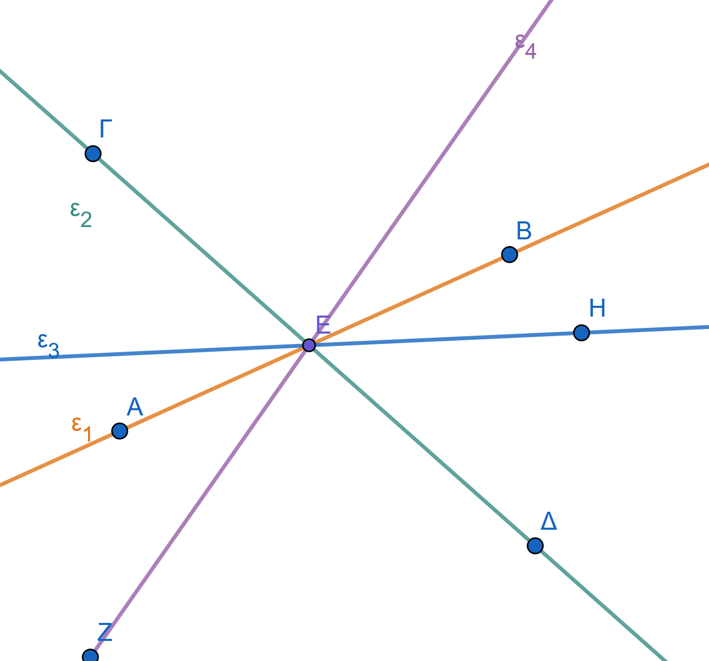{width="400"}
:::

> > Δύο ευθείες που βρίσκονται στο ίδιο επίπεδο ή θα είναι παράλληλες ή θα τέμνονται.

> > Δύο ευθύγραμμα τμήματα που βρίσκονται πάνω σε δύο παράλληλες ευθείες, θα λέγονται παράλληλα ευθύγραμμα τμήματα και γράφουμε ΑΒ//ΓΔ.

**Παραδείγματα**

1.  Οι δύο γραμμές ενός σταυρού ή του συμβόλου «+» είναι τεμνόμενες ευθείες.
2.  Οι **σιδηροδρομικές γραμμές** σε ένα ευθύγραμμο τμήμα αποτελούν εικόνα παράλληλων ευθειών.
3.  Οι **απέναντι πλευρές** ενός τετραδίου ή ενός θρανίου είναι παράλληλες.
4.  Οι ακτίνες μιας ρόδας ποδηλάτου είναι συγκλίνουσες ευθείες που τέμνονται στο κέντρο.
5.  Οι **οριζόντιες γραμμές** (χαράκια) ενός σχολικού τετραδίου είναι παράλληλες μεταξύ τους.

**Ασκήσεις**

1.  Σχεδιάστε δύο ευθείες $(\epsilon)$ και $(\delta)$ που να τέμνονται στο σημείο $A$.

2.  Πόσα κοινά σημεία έχουν δύο παράλληλες ευθείες (σε στενή σημασία);.

3.  Σχεδιάστε τρεις ευθείες που να συγκλίνουν στο σημείο $O$.

4.  Σε μια ευθεία $xy$, σημειώστε δύο σημεία $A$ και $B$.
    Πόσες ευθείες διέρχονται και από τα δύο;.

5.  Αναφέρετε τρία παραδείγματα παράλληλων ευθειών από το περιβάλλον της τάξης σας.

6.  Σχεδιάστε τρεις ευθείες $(\epsilon_1, \epsilon_2, \epsilon_3)$ που να τέμνονται ανά δύο σε διαφορετικά σημεία $A, B, \Gamma$.

7.  Χρησιμοποιήστε το σύμβολο $\cap$ για να δηλώσετε την τομή δύο παραλλήλων ευθειών $A$ και $B$.

8.  Σχεδιάστε 4 ευθείες που να τέμνονται ανά δύο.
    Ποιος είναι ο μέγιστος αριθμός σημείων τομής;.

9.  Αν οι ευθείες $(\epsilon)$ και $(\zeta)$ έχουν δύο κοινά σημεία, τι σχέση έχουν μεταξύ τους;

10. Στο παρακάτω σχήμα να ξεχωρίσετε ζεύγη ή ομάδες ευθειών που:

    α.
    είναι παράλληλες β.
    είναι συντρέχουσες γ.
    τέμνονται\
    \
    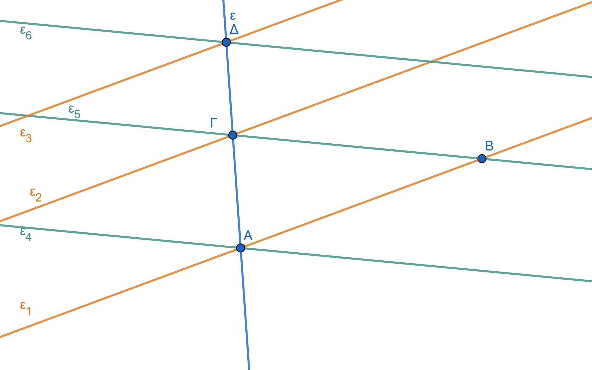{width="500"}

------------------------------------------------------------------------

### **2. Παραλληλία και Καθετότητα**

::: {style="background-color: #c0d4b8; border: 2px solid #2f3e50; color: #25188a; padding: 15px; border-radius: 5px;"}
**Θεωρία – Ορισμοί – Ιδιότητες**

- **Συμβολισμός:** Η παραλληλία δηλώνεται με το σύμβολο $\parallel$ (π.χ., $\epsilon_1 \parallel \epsilon_2$).

- **Ιδιότητα Παραλλήλων:**

  - Αν μια ευθεία είναι κάθετη σε μία από δύο παράλληλες ευθείες, τότε είναι υποχρεωτικά **κάθετη και στην άλλη**.\

    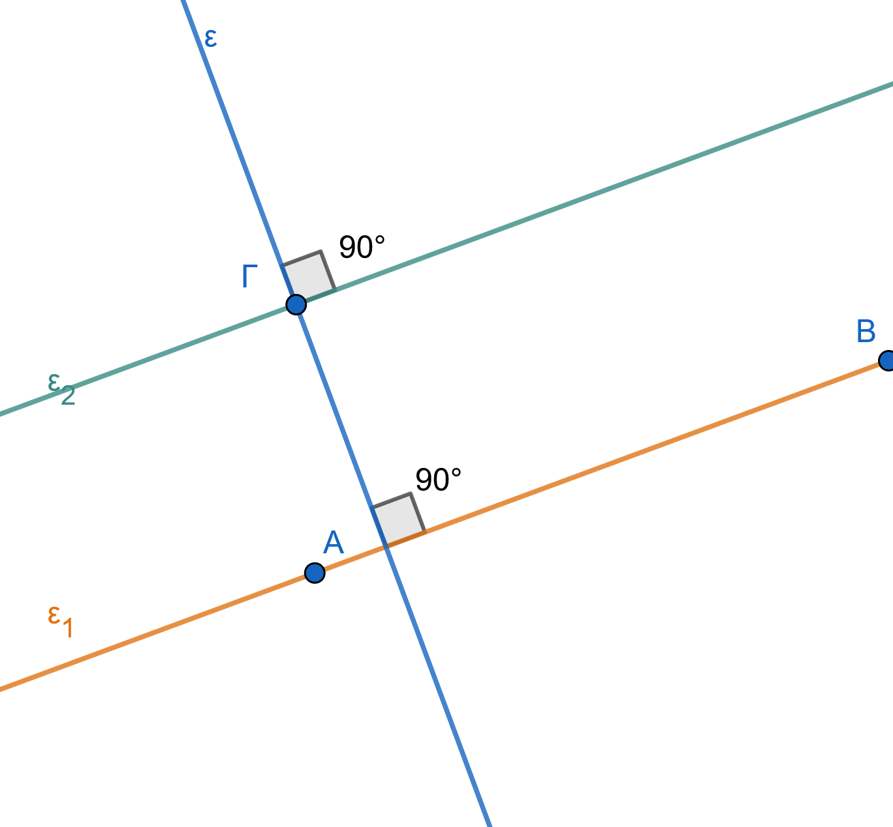{width="400"}

> > $ε_1\parallel ε_2 \ \ \ και \ \ \ ε \perp ε_1 \Rightarrow ε \perp ε_1$

- Δύο ευθείες του ίδιου επιπέδου που είναι **κάθετες στην ίδια τρίτη ευθεία**, είναι μεταξύ τους **παράλληλες**.

> > $ε_1\perp ε \ \ \ και \ \ \ ε_2 \perp ε \Rightarrow ε_1\parallel ε_2$

- **Αιτιολόγηση:** Αν οι δύο αυτές ευθείες τέμνονταν, τότε από το σημείο τομής τους θα περνούσαν δύο διαφορετικές κάθετοι προς την ίδια ευθεία, πράγμα που είναι γεωμετρικά αδύνατο.

- **Ορισμός Καθετότητας:** Δύο ευθείες είναι κάθετες όταν τέμνονται σχηματίζοντας μία ορθή γωνία ($90^\circ$ ή $100\text{ gr}$).

- **Συμβολισμός:** Η καθετότητα δηλώνεται με το σύμβολο $\perp$ (π.χ., $\epsilon_1 \perp \epsilon_2$).
:::

**Παραδείγματα**

1.  Οι **σιδηροδρομικές γραμμές** (σε ευθύγραμμο τμήμα) αποτελούν υλική εικόνα παράλληλων ευθειών.
2.  Οι **γραμμές (χαράκια)** ενός σχολικού τετραδίου είναι παράλληλες μεταξύ τους .
3.  Οι **απέναντι πλευρές** ενός ορθογωνίου ή ενός παραλληλογράμμου είναι παράλληλες.
4.  Σε μια ταινία (λωρίδα), οι δύο ευθείες που την ορίζουν (ακμές) είναι παράλληλες.
5.  Οι δύο **κάθετες πλευρές ενός ορθογωνίου** είναι κάθετες στην ίδια πλευρά, άρα είναι παράλληλες μεταξύ τους.
6.  Τα **σκαλοπάτια μιας σκάλας** είναι κάθετα στους δύο πλάγιους δοκούς, άρα είναι παράλληλα μεταξύ τους.
7.  Δύο **κατακόρυφοι στύλοι** της ΔΕΗ, θεωρούμενοι κάθετοι στο επίπεδο του εδάφους, είναι παράλληλοι.
8.  Σε μια **ταινία (λωρίδα)**, κάθε ευθεία που τέμνει κάθετα τη μία πλευρά, τέμνει κάθετα και την άλλη.
9.  Οι **άξονες των συντεταγμένων** ($x'x$ και $y'y$) είναι κάθετοι, και κάθε ευθεία παράλληλη στον $x'x$ είναι κάθετη στον $y'y$.

**Ασκήσεις**

1.  Σχεδιάστε μια ευθεία $(\epsilon)$ και δύο άλλες ευθείες $(\alpha)$ και $(\beta)$ κάθετες στην $(\epsilon)$. Τι σχέση έχουν οι $(\alpha)$ και $(\beta)$;
2.  Αν $\alpha \parallel \beta$ και $\gamma \perp \alpha$, αποδείξτε με μέτρηση γωνιών ότι $\gamma \perp \beta$ .
3.  Βρείτε μέσα στην τάξη σας τρία ζεύγη ευθειών που να είναι παράλληλες.
4.  Σχεδιάστε ένα παραλληλόγραμμο ΑΒΓΔ και ονομάστε τα ζεύγη των παράλληλων πλευρών του.
5.  Εξετάστε αν δύο ευθείες που τέμνονται από μια τρίτη και σχηματίζουν τις εντός εναλλάξ γωνίες ίσες είναι παράλληλες.
6.  Σχεδιάστε μια ταινία πλάτους $3\text{ cm}$ και ονομάστε τις πλευρές της.
7.  Αν τρεις ευθείες $\epsilon_1, \epsilon_2, \epsilon_3$ είναι τέτοιες ώστε $\epsilon_1 \perp \epsilon_2$ και $\epsilon_2 \perp \epsilon_3$, τι σχέση έχουν οι $\epsilon_1$ και $\epsilon_3$;
8.  Μπορούν δύο ευθείες που τέμνονται να είναι και οι δύο παράλληλες προς μια τρίτη; Αιτιολογήστε με βάση το αίτημα του Ευκλείδη.
9.  Σχεδιάστε ένα ορθογώνιο και ονομάστε τα ζεύγη των παράλληλων πλευρών του βάσει της καθετότητας.
10. Δείξτε με σχήμα ότι αν $\epsilon_1 \perp \epsilon_2$ και $\epsilon_2 \perp \epsilon_3$, τότε $\epsilon_1 \parallel \epsilon_3$.
11. Επαληθεύστε με τον γνώμονα ότι οι γραμμές ενός τετραδίου είναι κάθετες στην περιθωριακή γραμμή.
12. Μπορούν δύο ευθείες που τέμνονται πλάγια να είναι κάθετες στην ίδια τρίτη ευθεία;.

------------------------------------------------------------------------

### **Μοναδικότητα Παράλληλης (Αίτημα Ευκλείδη) και Χάραξη**

::: {style="background-color: #c0d4b8; border: 2px solid #2f3e50; color: #25188a; padding: 15px; border-radius: 5px;"}
**Θεωρία – Ορισμοί – Ιδιότητες**

- **Αίτημα του Ευκλείδη:** Από σημείο **εκτός ευθείας** διέρχεται **μία και μόνο μία** ευθεία παράλληλη προς αυτήν .

- **Μεταβατική Ιδιότητα:** Δύο ευθείες παράλληλες προς μια τρίτη είναι και **μεταξύ τους παράλληλες**.

- **Χάραξη με Γνώμονα και Χάρακα:** Τοποθετούμε τη μία κάθετη πλευρά του γνώμονα πάνω στην ευθεία και τον χάρακα στην άλλη κάθετη πλευρά.
  Ολισθαίνουμε τον γνώμονα κατά μήκος του σταθερού χάρακα μέχρι η πλευρά του να περάσει από το σημείο.

- **Μεταβατική Ιδιότητα:** Δύο ευθείες παράλληλες προς μια τρίτη είναι και **μεταξύ τους παράλληλες**.

- **Χάραξη με Διαβήτη/Μοιρογνωμόνιο:** Βασίζεται στη δημιουργία **ίσων γωνιών** (π.χ. εντός εναλλάξ) με τη βοήθεια μιας βοηθητικής τέμνουσας που διέρχεται από το σημείο.
:::

------------------------------------------------------------------------

### Για τη σχεδίαση ευθείας $\epsilon_1$ παράλληλης προς τη δοθείσα ευθεία $\epsilon$ που να διέρχεται από το σημείο $A$, έχουμε τις εξής μεθόδους:

::: {style="background-color: #c0d4b8; border: 2px solid #2f3e50; color: #25188a; padding: 15px; border-radius: 5px;"}
#### **Με τον κανόνα (χάρακα) και τον γνώμονα (Μέθοδος ολίσθησης)**

Αυτή η μέθοδος βασίζεται στην παράλληλη μετατόπιση του γνώμονα κατά μήκος ενός σταθερού χάρακα:

- **Τοποθέτηση:** Τοποθετούμε τη μία κάθετη πλευρά του **γνώμονα** έτσι ώστε να εφαρμόζει ακριβώς πάνω στην ευθεία $\epsilon$.\
  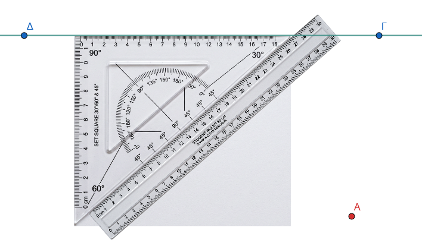{width="400"}

- **Στήριξη:** Τοποθετούμε τον **κανόνα (χάρακα)** σταθερά σε επαφή με την υποτείνουσα του γνώμονα.

- **Ολίσθηση:** **Γλιστράμε (ολισθαίνουμε)** τον γνώμονα μαζί με τον χάρακα κατά μήκος της ευθείας, μέχρι η πλευρά του χάρακα να φτάσει στο σημείο $A$.\
  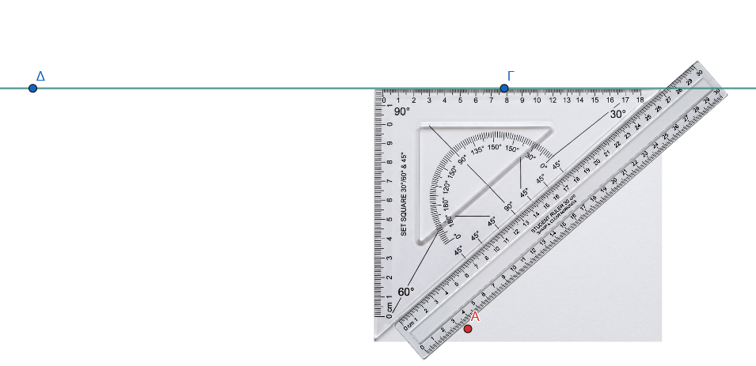{width="500"}

- **Χάραξη:** Ακινητοποιούμε τον χάρακα στη νέα του θέση και αφού γυρίσουμε τον γνώμονα να έρθει σε επαφή η υποτείνουσα του από την άλλη μεριά του χάρακα, (όπως φαίνεται στο σχήμα), χαράσσουμε τη γραμμή $\epsilon_1$ ([Κόκκινη]{style="color:red;"}) κατά μήκος της κάθετης πλευράς του γνώμονα που περνά από το $A$.\
  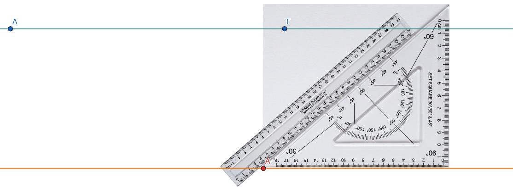{width="500"}

#### **Με τον γνώμονα (Μέθοδος της διπλής καθέτου)**

Αυτή η μέθοδος στηρίζεται στην ιδιότητα ότι **δύο ευθείες κάθετες στην ίδια τρίτη ευθεία είναι μεταξύ τους παράλληλες**.

- **Πρώτη κάθετος:** Τοποθετούμε τον γνώμονα έτσι ώστε η μία κάθετη πλευρά του να εφαρμόσει πάνω στην ευθεία $\epsilon$ και η άλλη κάθετη πλευρά του να περάσει από το σημείο Α.\

  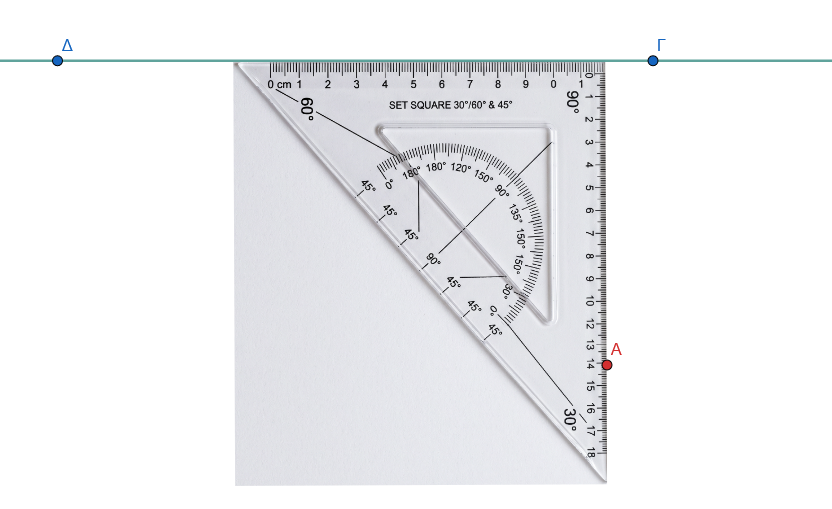{width="500"}\
  Από το Α χαράσουμε την βηθητική κάθετο ([πορτοκαλί]{style="color:orange;"}) προς την ε.\
  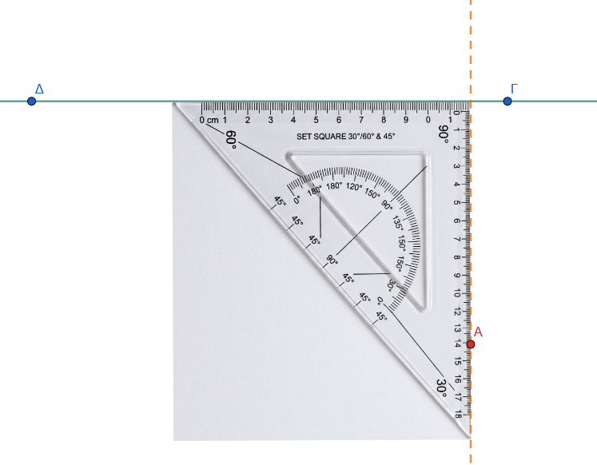{width="500"}

- **Δεύτερη κάθετος:** Τοποθετούμε τον γνώμονα έτσι ώστε η κορυφή της ορθής γωνία να περνάει από το σημείο $A$ και η μία κάθετη πλευρά να εφαρμόζει στην βοηθητική κάθετο ([ποροκαλί]{style="color:orange;"}).
  Ύστερα χαράσσουμε μια νέα ευθεία $\epsilon_1$ που να είναι **κάθετη στην πρώτη βοηθητική κάθετο** με την άλλη κάθετη πλευρά του γνώμονα ([Κόκκινη]{style="color:red;"}) στο σημείο $A$ η οποία είναι και η ζητούμενη παράλληλος.\
  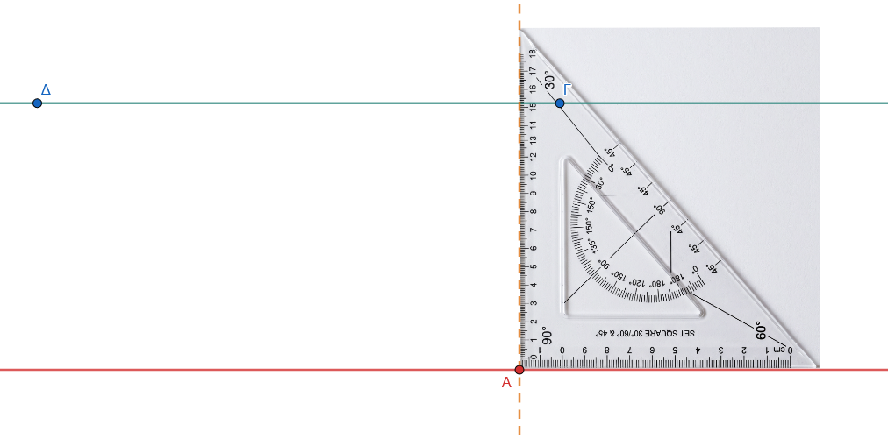{width="500"}

- **Συμπέρασμα:** Η ευθεία $\epsilon_1$ είναι η ζητούμενη παράλληλος, καθώς τόσο η $\epsilon$ όσο και η $\epsilon_1$ είναι κάθετες στην [πορτοκαλί]{style="color:orange;"} βοηθητική ευθεία.

**Σημείωση:** Η χρήση του γνώμονα από μόνη της για τη χάραξη καθέτων προϋποθέτει την εφαρμογή της μίας πλευράς του πάνω στην ευθεία-οδηγό.
Από ένα σημείο εκτός ευθείας μπορεί να αχθεί **μία μόνο κάθετος** και, αντίστοιχα, από ένα σημείο εκτός ευθείας διέρχεται **μία μόνο παράλληλος** (Αίτημα του Ευκλείδη).
:::

**Παραδείγματα**

1.  Χάραξη παράλληλης γραμμής σε ένα σχέδιο μηχανικού με τη χρήση του οργάνου **«ταυ»**.
2.  Σχεδίαση της **μεσοπαραλλήλου** μιας ταινίας (της ευθείας που ισαπέχει από τις δύο πλευρές).
3.  Χάραξη ευθείας που διέρχεται από την κορυφή τριγώνου και είναι παράλληλη προς την απέναντι πλευρά.
4.  Κατασκευή παραλληλογράμμου ξεκινώντας από δύο τεμνόμενες ευθείες και φέροντας παράλληλες από τα άκρα τους .
5.  Προσδιορισμός της θέσης ενός σημείου που κινείται παράλληλα προς έναν άξονα.
6.  Η δημιουργία ενός **πλέγματος (καννάβου)** με παράλληλες ευθείες που ισαπέχουν.

**Ασκήσεις**

1.  Σχεδιάστε μια ευθεία $(\epsilon)$ και ένα σημείο $M$ εκτός αυτής. Χαράξτε την παράλληλη από το $M$ με τη μέθοδο της ολίσθησης του γνώμονα .
2.  Πάρτε μια ευθεία $(\epsilon)$ και δύο σημεία $A, B$ στο ίδιο ημιεπίπεδο που απέχουν $3,5\text{ cm}$ από αυτήν. Είναι η ευθεία $AB \parallel \epsilon$;.
3.  Κατασκευάστε μια ταινία πλάτους $4\text{ cm}$ χρησιμοποιώντας χάρακα και γνώμονα.
4.  Σχεδιάστε τρεις παράλληλες ευθείες που να ισαπέχουν $2\text{ cm}$ η μία από την άλλη.
5.  Σε ένα τρίγωνο ΑΒΓ, βρείτε τα μέσα Δ και Ε των πλευρών ΑΒ και ΑΓ. Αποδείξτε με μέτρηση ότι ΔΕ $\parallel$ ΒΓ.
6.  Χαράξτε μια γωνία $60^\circ$ και από ένα σημείο της διχοτόμου της φέρτε παράλληλες προς τις πλευρές της.
7.  Πάρτε ένα σημείο Ο και τρεις ευθείες που διέρχονται από αυτό. Τέμνοντάς τες με δύο παράλληλες ευθείες, εξετάστε αν τα τμήματα που ορίζονται είναι ανάλογα.
8.  Χωρίστε ένα ευθύγραμμο τμήμα $8\text{ cm}$ σε 5 ίσα μέρη χρησιμοποιώντας τη μέθοδο των παραλλήλων ευθειών .
9.  Αν $\alpha \parallel \beta$ και $\beta \parallel \gamma$, δείξτε ότι $\alpha \parallel \gamma$ χρησιμοποιώντας το αίτημα του Ευκλείδη.

------------------------------------------------------------------------

::: {style="background-color: #f0f8cc; border: 2px solid #2f3e50; color: #25188a; padding: 15px; border-radius: 5px;"}
ΚΑΛΗ ΜΕΛΕΤΗ !
:::
