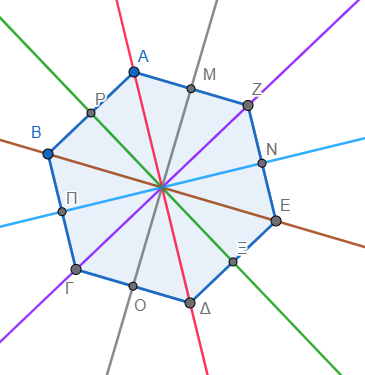
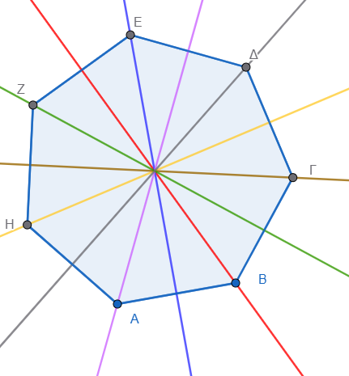

\usepackage{wasysym}

```{=html}
<!-- Φόρτωση βιβλιοθήκης GeoGebra -->
<script src="https://www.geogebra.org/apps/deployggb.js"</script>

<!-- Συνάρτηση δημιουργίας applets -->
<script>
function createGeoGebra(containerId, materialId, width = 700, height = 500) {
  var params = {
    "id": "ggb-" + containerId,
    "material_id": materialId,
    "width": width,
    "height": height,
    "showToolBar": true,
    "showMenuBar": false,
    "showAlgebraInput": true
  };
  
  var applet = new GGBApplet(params, '5.2');
  applet.inject(containerId);
}
</script>
```

------------------------------------------------------------------------

Για να βρούμε το συμμετρικό ενός σημείου $A$ ως προς μια ευθεία $ΑΒ=\epsilon$ (άξονας συμμετρίας), βασιζόμαστε στον ορισμό ότι η ευθεία $\epsilon$ πρέπει να είναι η **μεσοκάθετος** του ευθυγράμμου τμήματος $ΓΓ'$, όπου $Γ'$ είναι το ζητούμενο συμμετρικό σημείο.
Αυτό συνεπάγεται ότι το τμήμα $ΓΓ'$ είναι κάθετο στην ευθεία $\epsilon$ και η απόσταση του $Γ$ από την ευθεία είναι ίση με την απόσταση του $Γ'$ από αυτήν.

### **1. Γεωμετρική Κατασκευή**

-   **Με κανόνα και διαβήτη:** Φέρνουμε από το σημείο $Γ$ μια **κάθετη** προς την ευθεία $\epsilon$, η οποία την τέμνει σε ένα σημείο $M$. Στην προέκταση της καθέτου (προς το άλλο μέρος της ευθείας), παίρνουμε ένα σημείο $Γ'$ τέτοιο ώστε το τμήμα $MΓ'$ να είναι ίσο με το $MΓ$ ($MΓ' = MΓ$).
-   **Με διαβήτη μόνο:** Επιλέγουμε δύο τυχαία σημεία $U$ και $V$ πάνω στην ευθεία $\epsilon$. Γράφουμε δύο τόξα κύκλων με κέντρα τα $U$ και $V$ και ακτίνες $UΓ$ και $VΓ$ αντίστοιχα. Το σημείο όπου τέμνονται αυτά τα δύο τόξα στην αντίθετη πλευρά της ευθείας είναι το συμμετρικό σημείο $Γ'$.
-   **Δίπλωση χαρτιού:** Μια διαισθητική μέθοδος είναι να διπλώσουμε το χαρτί κατά μήκος της ευθείας $\epsilon$ έτσι ώστε τα δύο μέρη να συμπέσουν· η θέση που θα καταλάβει το σημείο $Γ$ στο απέναντι μέρος είναι το $Γ'$.

Αν το σημείο $Γ$ βρίσκεται **πάνω στην ευθεία** $\epsilon$, τότε το συμμετρικό του είναι το **ίδιο το σημείο** $Γ$.

::: {style="background-color: #f0f8cc; border: 2px solid #2f3e50; color: #25188a; padding: 15px; border-radius: 5px;"}
Αλλάξτε την θέση των σημείων ή του άξονα συμμετρίας.
:::

------------------------------------------------------------------------

<iframe src="https://www.geogebra.org/calculator/fm37scsr?embed" width="730" height="600" allowfullscreen style="border: 1px solid #e4e4e4;border-radius: 4px;" frameborder="0">

</iframe>

Δύο γεωμετρικά σχήματα $F$ και $F'$ θεωρούνται **συμμετρικά ως προς έναν άξονα** $\epsilon$ όταν για κάθε σημείο του σχήματος $F$, το συμμετρικό του σημείο ανήκει στο σχήμα $F'$, και αντίστροφα.
Στην ουσία, το συμμετρικό ενός σχήματος είναι το είδωλό του, όπως αυτό θα εμφανιζόταν σε έναν καθρέπτη που τοποθετείται κατά μήκος του άξονα.

::: {style="background-color: #f0f8cc; border: 2px solid #2f3e50; color: #25188a; padding: 15px; border-radius: 5px;"}
Αλλάξτε την θέση των σημείων, της εικόνας ή του άξονα συμμετρίας.
:::

------------------------------------------------------------------------

<iframe src="https://www.geogebra.org/calculator/czzpv58b?embed" width="730" height="600" allowfullscreen style="border: 1px solid #e4e4e4;border-radius: 4px;" frameborder="0">

</iframe>

Τα βασικά χαρακτηριστικά του συμμετρικού σχήματος είναι τα εξής:

-   **Σχέση μεσοκαθέτου:** Για κάθε ζεύγος αντίστοιχων σημείων $A$ (του αρχικού σχήματος) και $A'$ (του συμμετρικού), ο άξονας συμμετρίας $\epsilon$ είναι η **μεσοκάθετος** του ευθυγράμμου τμήματος $AA'$. Αυτό σημαίνει ότι το τμήμα $AA'$ είναι κάθετο στον άξονα και οι αποστάσεις των δύο σημείων από αυτόν είναι ίσες.
-   **Ισότητα και Συμφωνία (Congruence):** Τα συμμετρικά σχήματα είναι **ίσα**. Η αξονική συμμετρία είναι μια **ισομετρία**, δηλαδή ένας μετασχηματισμός που **διατηρεί τις αποστάσεις**, τα μήκη των πλευρών, τα μέτρα των γωνιών και το εμβαδόν των σχημάτων.
-   **Αντιστροφή Προσανατολισμού:** Αν και τα σχήματα είναι ίσα, η αξονική συμμετρία χαρακτηρίζεται ως **έμμεση ή αντίστροφη ισομετρία**. Αυτό σημαίνει ότι ο προσανατολισμός του σχήματος αντιστρέφεται· για παράδειγμα, μια δεξιόστροφη σειρά σημείων στο αρχικό σχήμα θα εμφανιστεί ως αριστερόστροφη στο συμμετρικό του.
-   **Η έννοια της "Δίπλωσης":** Διαισθητικά, αν διπλώσουμε το επίπεδο (π.χ. ένα χαρτί) κατά μήκος του άξονα συμμετρίας, το αρχικό σχήμα και το συμμετρικό του θα **συμπέσουν απόλυτα**.
-   **Σημεία επί του άξονα:** Αν το αρχικό σχήμα έχει σημεία που βρίσκονται πάνω στον άξονα συμμετρίας, αυτά τα σημεία παραμένουν **σταθερά** και ταυτίζονται με τα συμμετρικά τους.

Για να βρούμε το συμμετρικό ενός σύνθετου σχήματος (όπως ενός πολυγώνου), βρίσκουμε τα συμμετρικά σημεία των **κορυφών** του και στη συνέχεια τα ενώνουμε με ευθύγραμμα τμήματα.
Στην περίπτωση του κύκλου, βρίσκουμε το συμμετρικό του κέντρου του και σχεδιάζουμε έναν νέο κύκλο με την ίδια ακτίνα.

::: {style="background-color: #f0f8cc; border: 2px solid #2f3e50; color: #25188a; padding: 15px; border-radius: 5px;"}
Αλλάξτε την θέση των σημείων ή του άξονα συμμετρίας.
:::

------------------------------------------------------------------------

<iframe src="https://www.geogebra.org/calculator/pajwjf6t?embed" width="730" height="600" allowfullscreen style="border: 1px solid #e4e4e4;border-radius: 4px;" frameborder="0">

</iframe>

Η κατασκευή του συμμετρικού ενός τριγώνου $ABΓ$ ως προς έναν άξονα συμμετρίας $\epsilon$ βασίζεται στην εύρεση των συμμετρικών σημείων των **κορυφών** του και στην επακόλουθη σύνδεσή τους.

Ακολουθούν τα βήματα για την κατασκευή χρησιμοποιώντας κανόνα και διαβήτη:

### **1. Εύρεση των συμμετρικών κορυφών**

Για κάθε μία από τις τρεις κορυφές του τριγώνου (έστω την κορυφή $A$), μπορείτε να χρησιμοποιήσετε μία από τις παρακάτω μεθόδους:

-   **Μέθοδος με κάθετη ευθεία:**
    1.  Χρησιμοποιώντας τον κανόνα (ή γνώμονα), φέρνετε μια **κάθετη** ευθεία από την κορυφή $A$ προς τον άξονα $\epsilon$, η οποία τον τέμνει σε ένα σημείο $M$.
    2.  Με τη βοήθεια του διαβήτη, μετράτε την απόσταση $AM$ και τη μεταφέρετε στην προέκταση της κάθετης ευθείας στην απέναντι πλευρά του άξονα, ορίζοντας το σημείο $A'$ έτσι ώστε $MA' = MA$.
-   **Μέθοδος μόνο με διαβήτη:**
    1.  Επιλέγετε δύο τυχαία σημεία $P$ και $Q$ πάνω στον άξονα $\epsilon$.
    2.  Τοποθετείτε τη βελόνα του διαβήτη στο σημείο $P$ και ανοίγετε τον διαβήτη μέχρι την κορυφή $A$ (ακτίνα $PA$). Γράφετε ένα τόξο στην απέναντι πλευρά του άξονα.
    3.  Επαναλαμβάνετε τη διαδικασία τοποθετώντας τη βελόνα στο σημείο $Q$ με ακτίνα $QA$. Το σημείο όπου τέμνονται τα δύο τόξα είναι το συμμετρικό σημείο $A'$.

### **2. Ολοκλήρωση του σχήματος**

Αφού επαναλάβετε τη διαδικασία και για τις άλλες δύο κορυφές ($B$ και $Γ$), θα έχετε εντοπίσει τα σημεία $B'$ και $Γ'$ αντίστοιχα.
Στη συνέχεια, χρησιμοποιείτε τον κανόνα για να **συνδέσετε τα σημεία** $A', B'$ και $Γ'$ με ευθύγραμμα τμήματα.

::: {style="background-color: #f0f8cc; border: 2px solid #2f3e50; color: #25188a; padding: 15px; border-radius: 5px;"}
Αλλάξτε την θέση των σημείων ή του άξονα συμμετρίας.
:::

------------------------------------------------------------------------

<iframe src="https://www.geogebra.org/calculator/f9hxvbxx?embed" width="730" height="600" allowfullscreen style="border: 1px solid #e4e4e4;border-radius: 4px;" frameborder="0">

</iframe>

### **Βασικές Ιδιότητες**

-   **Ισότητα (Congruence):** Το τρίγωνο $A'B'C'$ που προκύπτει είναι **ίσο** με το αρχικό τρίγωνο $ABC$, καθώς η αξονική συμμετρία διατηρεί τα μήκη των πλευρών, τα μέτρα των γωνιών και το εμβαδόν.
-   **Προσανατολισμός:** Το συμμετρικό τρίγωνο έχει **αντίστροφο προσανατολισμό** σε σχέση με το αρχικό (εικόνα καθρέπτη).
-   **Μεσοκάθετος:** Ο άξονας $\epsilon$ λειτουργεί ως η **μεσοκάθετος** (perpendicular bisector) για καθένα από τα ευθύγραμμα τμήματα $AA', BB'$ και $ΓΓ'$.

------------------------------------------------------------------------

**Το συμμετρικό κύκλου**

::: {style="background-color: #f0f8cc; border: 2px solid #2f3e50; color: #25188a; padding: 15px; border-radius: 5px;"}
Αλλάξτε την θέση του κέντρου του κύκλου, του σημείου Α ή του άξονα συμμετρίας.
:::

<iframe src="https://www.geogebra.org/calculator/mcrdtx7q?embed" width="730" height="600" allowfullscreen style="border: 1px solid #e4e4e4;border-radius: 4px;" frameborder="0">

</iframe>

------------------------------------------------------------------------

Ο αριθμός των αξόνων συμμετρίας διαφέρει σημαντικά ανάμεσα στα βασικά γεωμετρικά σχήματα, με ορισμένα να έχουν μηδενικούς και άλλα άπειρους άξονες.
Ένας άξονας συμμετρίας είναι μια νοητή γραμμή που χωρίζει ένα σχήμα σε δύο πανομοιότυπα μισά, τα οποία συμπίπτουν αν διπλωθούν κατά μήκος αυτής της γραμμής.

Ακολουθεί ο αριθμός των αξόνων συμμετρίας για τα κυριότερα σχήματα:

### **Τρίγωνα**

-   **Ισόπλευρο τρίγωνο:** Έχει **3** άξονες συμμετρίας, καθένας από τους οποίους διέρχεται από μια κορυφή και το μέσο της απέναντι πλευράς.
-   **Ισοσκελές τρίγωνο:** Έχει **1** άξονα συμμετρίας, ο οποίος είναι η μεσοκάθετος της βάσης του.
-   **Σκαληνό τρίγωνο:** Έχει **0** άξονες συμμετρίας.

### **Τετράπλευρα**

-   **Τετράγωνο:** Έχει **4** άξονες συμμετρίας (τις δύο διαγωνίους και τις δύο μεσοκαθέτους των απέναντι πλευρών).
-   **Ορθογώνιο:** Έχει **2** άξονες συμμετρίας, οι οποίοι είναι οι μεσοκάθετοι των απέναντι πλευρών. Σημειώνεται ότι οι διαγώνιοί του δεν αποτελούν άξονες συμμετρίας, εκτός αν το ορθογώνιο είναι τετράγωνο.
-   **Ρόμβος:** Έχει **2** άξονες συμμετρίας, που συμπίπτουν με τις διαγωνίους του.
-   **Παραλληλόγραμμο:** Γενικά έχει **0** άξονες συμμετρίας (αν και διαθέτει κέντρο συμμετρίας).
-   **Ισοσκελές τραπεζιο:** Έχει **1** άξονα συμμετρίας, τη μεσοκάθετο των βάσεών του.
-   **Χαρταετός (Kite):** Έχει **1** άξονα συμμετρίας, τη διαγώνιο που ενώνει τις κορυφές των άνισων πλευρών.

### **Άλλα Σχήματα**

-   **Κύκλος:** Έχει **άπειρους** άξονες συμμετρίας, καθώς κάθε ευθεία που διέρχεται από το κέντρο του τον χωρίζει σε δύο ίσα μέρη.
-   **Έλλειψη:** Έχει **2** άξονες συμμετρίας, που ταυτίζονται με τον μεγάλο και τον μικρό άξονά της.
-   **Κανονικά Πολύγωνα:** Ένα κανονικό πολύγωνο με $n$ πλευρές έχειπάντα \$n \$ αξονες συμμετρίας.

Είναι σημαντικό να σημειωθεί ότι στα κανονικά πολύγωνα, αν ο αριθμός των πλευρών είναι περιττός, οι άξονες διέρχονται από τις κορυφές και τα μέσα των απέναντι πλευρών, ενώ αν είναι άρτιος, οι άξονες διέρχονται είτε από απέναντι κορυφές είτε από τα μέσα απέναντι πλευρών.

{width="311"}

{width="292"}

Ακολουθούν διάφοροι τύποι ασκήσεων και δραστηριοτήτων σχετικά με την αξονική συμμετρία, ταξινομημένοι ανάλογα με το επίπεδο δυσκολίας και το αντικείμενο μελέτης, όπως προκύπτουν από τις πηγές:

### **1. Ασκήσεις Αναγνώρισης Αξόνων Συμμετρίας**

Αυτές οι ασκήσεις εστιάζουν στον εντοπισμό και την καταμέτρηση των γραμμών που χωρίζουν ένα σχήμα σε δύο πανομοιότυπα μέρη.

\* **Γεωμετρικά σχήματα:** Σχεδιάστε τα παρακάτω σχήματα και βρείτε τον αριθμό των αξόνων συμμετρίας τους:

\* **Τετράγωνο** (έχει 4 άξονες: 2 διαγωνίους και 2 μεσοκαθέτους πλευρών).

\* **Ορθογώνιο** (έχει 2 άξονες: τις μεσοκαθέτους των πλευρών του).

\* **Ισόπλευρο τρίγωνο** (έχει 3 άξονες).

\* **Ισοσκελές τρίγωνο** (έχει 1 άξονα, τη μεσοκάθετο της βάσης).

\* **Κύκλος** (έχει άπειρους άξονες, κάθε διάμετρος είναι άξονας συμμετρίας).

\* **Φύση και περιβάλλον:** Εντοπίστε άξονες συμμετρίας σε αντικείμενα όπως μια πεταλούδα, μια νιφάδα χιονιού ή ένα φύλλο χαρτί διπλωμένο στα δύο.

### **2. Ασκήσεις Γεωμετρικής Κατασκευής**

Οι ασκήσεις αυτές απαιτούν τη χρήση **κανόνα και διαβήτη** για τη δημιουργία συμμετρικών ειδώλων.

\* **Συμμετρικό σημείου:** Δίνεται ευθεία $\epsilon$ και σημείο $A$.
Κατασκευάστε το συμμετρικό σημείο $A'$ έτσι ώστε η $\epsilon$ να είναι η **μεσοκάθετος** του τμήματος $AA'$.

\* **Συμμετρικό τριγώνου:** Δίνεται ένα τρίγωνο $ABC$ και ένας άξονας $\epsilon$.
Βρείτε τα συμμετρικά των τριών κορυφών και σχεδιάστε το συμμετρικό τρίγωνο $A'B'C'$.

\* **Συμμετρικό κύκλου:** Βρείτε το συμμετρικό του κέντρου ενός κύκλου ως προς άξονα και σχεδιάστε έναν νέο κύκλο με την ίδια ακτίνα.

### **3. Ασκήσεις σε Καρτεσιανό Επίπεδο (Αναλυτική Γεωμετρία)**

Ασκήσεις που χρησιμοποιούν συντεταγμένες $(x, y)$ για τον υπολογισμό συμμετρικών σημείων.

\* **Συμμετρία ως προς τον άξονα x:** Βρείτε το συμμετρικό του σημείου $P(2, 2)$, το οποίο είναι το $P'(2, -2)$.

\* **Συμμετρία ως προς τον άξονα y:** Βρείτε το συμμετρικό του $P(2, 2)$, το οποίο είναι το $P'(-2, 2)$.

\* **Συμμετρία ως προς την ευθεία y=x:** Δείξτε ότι το συμμετρικό του $(x, y)$ είναι το $(y, x)$.

### **4. Δημιουργικές και Ψηφιακές Δραστηριότητες**

-   **Δραστηριότητα "Χορογραφία" (Scratch):** Χρησιμοποιήστε περιβάλλον οπτικού προγραμματισμού για να κινήσετε δύο χαρακτήρες ταυτόχρονα και συμμετρικά ως προς μια κόκκινη γραμμή. Αν ο ένας κινείται "3 βήματα μπροστά και στρίβει 90° δεξιά", ο άλλος πρέπει να κάνει το ίδιο στρίβοντας "90° αριστερά". (Στο $1^\circ$ miniapp αυτής της σελίδας κινείστε το σημείο ή το άξονα)
-   **Δίπλωση χαρτιού:** Διπλώστε ένα χαρτί, σχεδιάστε ένα σχήμα και κόψτε το. Παρατηρήστε πώς ο άξονας δίπλωσης λειτουργεί ως άξονας συμμετρίας για το τελικό σχήμα.

------------------------------------------------------------------------

Σύνοψη και Συχνά Διδακτικά Λάθη Η κατανόηση της συμμετρίας απλοποιεί την επίλυση προβλημάτων φυσικής (οπτική ανάκλαση) και μηχανικής.
Ωστόσο, οι μαθητές συχνά υποπίπτουν στα εξής σφάλματα:

Λάθος μέτρηση απόστασης: Μέτρηση της απόστασης από τον άξονα κατά μήκος μη κάθετης γραμμής.

Σύγχυση Μετασχηματισμών: Ταύτιση της αξονικής με την κεντρική συμμετρία (παράλειψη της αναστροφής προσανατολισμού).

Αλγεβρικά Πρόσημα: Σφάλμα στην επιλογή του άξονα προς αλλαγή προσήμου (π.χ. αλλαγή του x για συμμετρία ως προς x′x).

------------------------------------------------------------------------

Οι εφαρμογές της συμμετρίας εκτείνονται από τη θεμελιώδη δομή της φύσης μέχρι τις πιο προηγμένες βιομηχανικές και επιστημονικές διαδικασίες.

### **Φύση και Βιολογία**

-   Η συμμετρία είναι πανταχού παρούσα στο φυσικό περιβάλλον, με χαρακτηριστικά παραδείγματα τα **φτερά της πεταλούδας**, τις **νιφάδες του χιονιού**, τους **θαλάσσιους αστερίες** και τα **άνθη**.
-   Οι επιστήμονες χρησιμοποιούν άξονες συμμετρίας για να απλοποιήσουν τα μοντέλα μελέτης φυσικών φαινομένων, από τις **μοριακές δομές** έως τις **πλανητικές τροχιές**.
-   Ακόμη και σε αντικείμενα που φαίνονται ασύμμετρα με την πρώτη ματιά, υπάρχουν συχνά υποκείμενες συμμετρικές αρχές και λεπτά μοτίβα που προσφέρουν ισορροπία.

### **Βιομηχανία και Μηχανική**

-   Στον τομέα της παραγωγής, η συμμετρία είναι ζωτικής σημασίας για τη λειτουργικότητα και τη συναρμολόγηση μηχανικών μερών μέσω του συστήματος **GD&T** (Geometric Dimensioning and Tolerancing).
-   Οι **ανοχές συμμετρίας** διασφαλίζουν ότι τα σημεία ενός εξαρτήματος είναι κεντραρισμένα ως προς έναν άξονα αναφοράς, κάτι που είναι απαραίτητο για εξαρτήματα που **περιστρέφονται χωρίς κραδασμούς**.
-   Η παραλληλία στη βιομηχανική σχεδίαση θεωρείται μια μορφή συμμετρικής μεταφοράς που εξασφαλίζει την ευθυγράμμιση των τμημάτων μιας μηχανής.

### **Φυσική και Επιστήμη**

-   Στη φυσική, η **περιστροφική συμμετρία** ενός συστήματος είναι ισοδύναμη με τον **νόμο διατήρησης της στροφορμής**.
-   Η έννοια της συμμετρίας χρησιμοποιείται στην υποατομική φυσική μέσω της **συμμετρίας P (parity)**, η οποία περιγράφει την κατοπτρική συμμετρία του χώρου.
-   Οι νόμοι της φυσικής θεωρούνται αναλλοίωτοι (invariant) όταν δεν διακρίνουν διαφορετικές κατευθύνσεις στον χώρο, ιδιότητα που πηγάζει από τη συμμετρία.

### **Αρχιτεκτονική και Τέχνη**

-   Οι αρχιτέκτονες ενσωματώνουν τη συμμετρία για να δημιουργήσουν κτίρια που είναι ταυτόχρονα **αισθητικά ελκυστικά και δομικά σταθερά**, όπως οι καθεδρικοί ναοί με κεντρικά κωδωνοστάσια.
-   Στην τέχνη, η συμμετρία επιτρέπει τη δημιουργία περίπλοκων μοτίβων, όπως στα **ψηφιδωτά (tessellations)**, και προσφέρει μια αίσθηση αρμονίας.
-   Η **συμμετρία κλίμακας** εμφανίζεται στα φράκταλ, τα οποία χρησιμοποιούνται στα εφέ κινηματογραφικών ταινιών για τη δημιουργία ρεαλιστικών εικονικών κόσμων και φυσικών τοπίων.

### **Τεχνολογία και Εκπαίδευση**

-   Στην πληροφορική, ο οπτικός προγραμματισμός (π.χ. **Scratch**) χρησιμοποιείται για τη δημιουργία «συμμετρικών χορογραφιών», όπου οι κινήσεις των χαρακτήρων αντικατοπτρίζονται ως προς έναν άξονα.
-   Η συμμετρία αποτελεί εργαλείο για την απλούστευση μαθηματικών προβλημάτων, όπως ο εντοπισμός της κορυφής των **παραβολών** στη γεωμετρία συντεταγμένων.
-   Στην καθημερινή ζωή, η συμμετρία συναντάται σε αντικείμενα όπως οι **έλικες αεροπλάνων**, οι **τροχοί λούνα παρκ** και τα **σήματα τροχαίας**.

::: {style="background-color: #f0f8cc; border: 2px solid #2f3e50; color: #25188a; padding: 15px; border-radius: 5px;"}
ΚΑΛΗ ΜΕΛΕΤΗ !
:::
