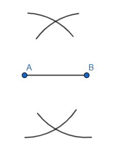
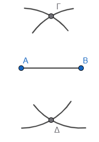
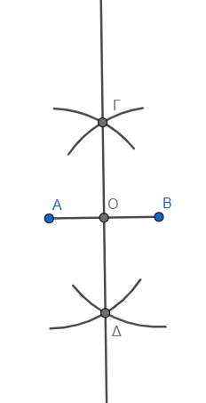
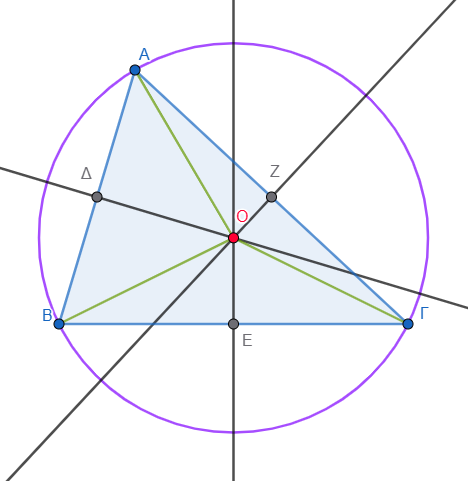
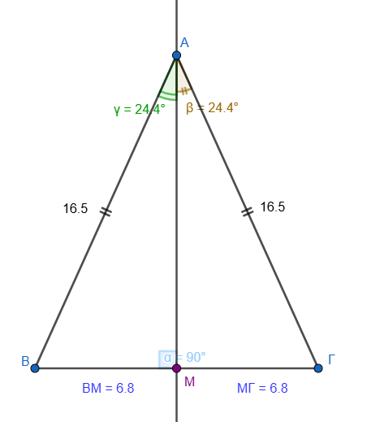
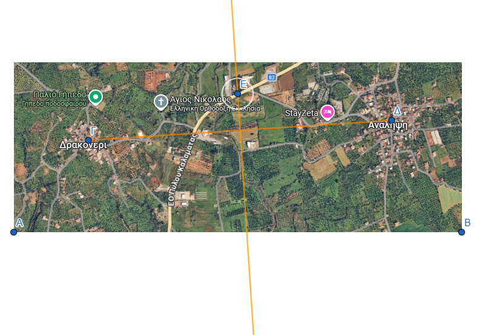
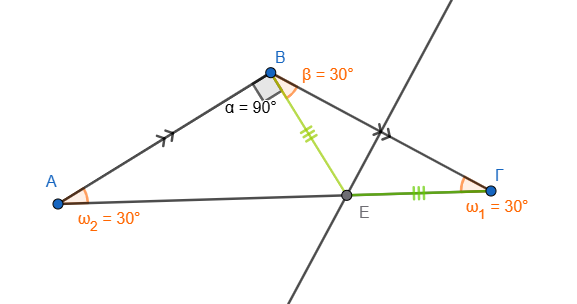

\usepackage{wasysym}

```{=html}
<!-- Φόρτωση βιβλιοθήκης GeoGebra -->
<script src="https://www.geogebra.org/apps/deployggb.js"</script>

<!-- Συνάρτηση δημιουργίας applets -->
<script>
function createGeoGebra(containerId, materialId, width = 700, height = 500) {
  var params = {
    "id": "ggb-" + containerId,
    "material_id": materialId,
    "width": width,
    "height": height,
    "showToolBar": true,
    "showMenuBar": false,
    "showAlgebraInput": true
  };
  
  var applet = new GGBApplet(params, '5.2');
  applet.inject(containerId);
}
</script>
```

------------------------------------------------------------------------

## Ο ορισμός και οι βασικές ιδιότητες της μεσοκαθέτου ενός ευθυγράμμου τμήματος συνοψίζονται στα εξής:

### **Ορισμός**

::: {style="background-color: #f0f8cc; border: 2px solid #2f3e50; color: #25188a; padding: 15px; border-radius: 5px;"}
**Μεσοκάθετος** ενός ευθυγράμμου τμήματος ονομάζεται η **ευθεία που διέρχεται από το μέσο του** και είναι **κάθετη** σε αυτό.
:::

### **Βασικές Ιδιότητες**

::: {style="background-color: #f0f8fc; border: 2px solid #2f3e50; color: #25188a; padding: 15px; border-radius: 5px;"}
Η μεσοκάθετος χαρακτηρίζεται από τις παρακάτω θεμελιώδεις ιδιότητες:

-   **Ιδιότητα Ισαπόστασης:** Κάθε σημείο της μεσοκαθέτου ενός ευθυγράμμου τμήματος **ισαπέχει από τα άκρα** του τμήματος.
-   **Αντίστροφη Ιδιότητα:** Αν ένα σημείο ισαπέχει από τα άκρα ενός ευθυγράμμου τμήματος, τότε το σημείο αυτό **ανήκει υποχρεωτικά στη μεσοκάθετο** του τμήματος.
-   **Άξονας Συμμετρίας:** Η μεσοκάθετος ενός ευθυγράμμου τμήματος αποτελεί **άξονα συμμετρίας** του.
-   **Γεωμετρικός Τόπος:** Με βάση τις παραπάνω ιδιότητες, η μεσοκάθετος ορίζεται ως ο **γεωμετρικός τόπος** των σημείων του επιπέδου που ισαπέχουν από δύο δεδομένα σημεία (τα άκρα του τμήματος).
:::

### **Σημασία στη Γεωμετρία**

-   **Στο Τρίγωνο:** Οι τρεις μεσοκάθετοι των πλευρών ενός τριγώνου διέρχονται από το ίδιο σημείο, το οποίο ονομάζεται **περίκεντρο** και είναι το κέντρο του περιγεγραμμένου κύκλου του τριγώνου.
-   **Συμμετρία Σημείων:** Αν δύο σημεία Α και Β είναι συμμετρικά ως προς μια ευθεία ε, τότε η ευθεία ε είναι η μεσοκάθετος του τμήματος ΑΒ.
-   **Κατασκευές:** Με την κατασκευή της μεσοκαθέτου (χρησιμοποιώντας κανόνα και διαβήτη) μπορούμε να προσδιορίσουμε με απόλυτη ακρίβεια το **μέσο** ενός ευθυγράμμου τμήματος.

## Η γεωμετρική κατασκευή της μεσοκαθέτου ενός ευθυγράμμου τμήματος ΑΒ με τη χρήση κανόνα και διαβήτη ακολουθεί τα εξής βήματα:

1.  **Σχεδίαση κύκλων:** Με τη βοήθεια του διαβήτη, γράφουμε **δύο κύκλους** (ή τόξα) που έχουν κέντρα τα άκρα του τμήματος, δηλαδή τα σημεία **Α και Β**, και την **ίδια ακτίνα ρ**.

2.  **Επιλογή ακτίνας:** Η ακτίνα ρ πρέπει απαραίτητα να είναι **μεγαλύτερη από το μισό του μήκους του τμήματος ΑΒ**, ώστε οι δύο κύκλοι να τέμνονται σε δύο σημεία.
    Μια συνηθισμένη πρακτική είναι να χρησιμοποιείται ακτίνα ίση με το ίδιο το τμήμα ΑΒ.



3.  **Εύρεση σημείων τομής:** Εντοπίζουμε τα **δύο σημεία τομής** των δύο κύκλων, έστω Γ και Δ.



4.  **Χάραξη ευθείας:** Χρησιμοποιώντας τον κανόνα (αβαθμολόγητο χάρακα), σχεδιάζουμε την **ευθεία που διέρχεται από τα σημεία Γ και Δ**.



Η ευθεία αυτή είναι η **μεσοκάθετος** του τμήματος ΑΒ.
Μέσω αυτής της διαδικασίας μπορούμε επίσης να προσδιορίσουμε με απόλυτη ακρίβεια το **μέσο** του ευθυγράμμου τμήματος, το οποίο είναι το σημείο τομής της μεσοκαθέτου με το τμήμα.
Η κατασκευή βασίζεται στο γεγονός ότι τα σημεία τομής των δύο ίσων κύκλων **ισαπέχουν από τα άκρα Α και Β**, οπότε αναγκαστικά ανήκουν στη μεσοκάθετο του τμήματος.

------------------------------------------------------------------------

## Το **περίκεντρο** ενός τριγώνου ορίζεται ως το **σημείο τομής των τριών μεσοκαθέτων** των πλευρών του.

Ο ρόλος και οι ιδιότητές του στο τρίγωνο συνοψίζονται στα εξής:

-   **Κέντρο Περιγεγραμμένου Κύκλου:** Το περίκεντρο αποτελεί το κέντρο του κύκλου που διέρχεται από όλες τις κορυφές του τριγώνου, ο οποίος ονομάζεται περιγεγραμμένος κύκλος.



-   **Ιδιότητα Ισαπόστασης:** Το σημείο αυτό **ισαπέχει από τις τρεις κορυφές** του τριγώνου. Αν ονομάσουμε $Ο$ το περίκεντρο ενός τριγώνου $ΑΒΓ$, τότε η ιδιότητα αυτή εκφράζεται με την ισότητα των τμημάτων $ΟΑ = ΟΒ = ΟΓ$, τα οποία αποτελούν και τις ακτίνες του περιγεγραμμένου κύκλου.
-   **Συντρέχουσες Ευθείες:** Είναι το μοναδικό σημείο του επιπέδου στο οποίο **συντρέχουν (τέμνονται) υποχρεωτικά** και οι τρεις μεσοκάθετοι των πλευρών του τριγώνου.
-   **Γεωμετρικός Προσδιορισμός:** Για να βρεθεί η θέση του περιεκέντρου, αρκεί να κατασκευαστούν οι μεσοκάθετοι δύο μόνο πλευρών του τριγώνου, καθώς η μεσοκάθετος της τρίτης πλευράς θα διέλθει αναγκαστικά από το σημείο τομής τους.

------------------------------------------------------------------------

## Η σύνδεση της μεσοκαθέτου με το ισοσκελές τρίγωνο είναι θεμελιώδης στη Γεωμετρία και βασίζεται στην ιδιότητα της ισαπόστασης.

Οι κυριότεροι τρόποι με τους οποίους συνδέονται είναι οι εξής:

### **1. Η Κορυφή του Ισοσκελούς Τριγώνου**

Η κορυφή ενός ισοσκελούς τριγώνου (το σημείο όπου ενώνονται οι δύο ίσες πλευρές) **ανήκει υποχρεωτικά στη μεσοκάθετο της βάσης του**.
Αυτό συμβαίνει διότι η κορυφή ισαπέχει από τα άκρα της βάσης (αφού οι πλευρές είναι ίσες), και σύμφωνα με την αντίστροφη ιδιότητα της μεσοκαθέτου, κάθε σημείο που ισαπέχει από τα άκρα ενός τμήματος βρίσκεται στη μεσοκάθετό του.



### **2. Ταύτιση Δευτερευόντων Στοιχείων**

Σε ένα ισοσκελές τρίγωνο, η μεσοκάθετος της βάσης του ταυτίζεται με τρία άλλα σημαντικά στοιχεία που ξεκινούν από την κορυφή:

\* Το **ύψος** που αντιστοιχεί στη βάση.
($\angle{AΜΓ}=90^\circ$)

\* τη **διάμεσο** προς τη βάση.(ΒΜ=ΜΓ)

\* τη **διχοτόμο** της γωνίας της κορυφής.
($\angle{BAM}=\angle{MAΓ}$)

Επομένως, αν φέρουμε τη μεσοκάθετο της βάσης ενός ισοσκελούς τριγώνου, αυτή θα διέλθει οπωσδήποτε από την απέναντι κορυφή και θα διχοτομήσει τη γωνία της.

### **3. Κατασκευή Ισοσκελών Τριγώνων**

Η μεσοκάθετος ενός ευθυγράμμου τμήματος ΑΒ είναι ο **γεωμετρικός τόπος** των κορυφών όλων των ισοσκελών τριγώνων που έχουν ως βάση το τμήμα ΑΒ.\
\* Αν πάρουμε οποιοδήποτε τυχαίο σημείο Μ πάνω στη μεσοκάθετο ενός τμήματος ΑΒ, το τρίγωνο ΜΑΒ που σχηματίζεται θα είναι **πάντα ισοσκελές** (ΜΑ=ΜΒ).\
\* Με αυτόν τον τρόπο, μπορούμε να κατασκευάσουμε **άπειρα ισοσκελή τρίγωνα** πάνω σε μια συγκεκριμένη βάση.

### **4. Άξονας Συμμετρίας**

Η μεσοκάθετος της βάσης αποτελεί τον **άξονα συμμετρίας** του ισοσκελούς τριγώνου.
Αυτό σημαίνει ότι αν διπλώσουμε το τρίγωνο κατά μήκος της μεσοκαθέτου της βάσης του, οι δύο ίσες πλευρές και οι δύο γωνίες της βάσης θα συμπέσουν απόλυτα.

## Η μεσοκάθετος ενός ευθυγράμμου τμήματος έχει πολλές πρακτικές εφαρμογές

σε προβλήματα της καθημερινής ζωής, οι οποίες βασίζονται κυρίως στην ιδιότητά της ότι κάθε σημείο της **ισαπέχει από δύο συγκεκριμένα σημεία**.
Μερικές από τις κυριότερες εφαρμογές είναι οι εξής:

-   **Χωροθέτηση δημόσιων κτιρίων και υπηρεσιών:** Όταν θέλουμε να βρούμε την κατάλληλη θέση για ένα κτίριο (π.χ. ένα σχολείο) ώστε να απέχει εξίσου από τρεις διαφορετικές τοποθεσίες (π.χ. τα σπίτια τριών μαθητών Α, Β και Γ), η θέση αυτή είναι το σημείο τομής των μεσοκαθέτων των τμημάτων ΑΒ και ΑΓ.
-   **Σχεδιασμός υποδομών σε οδικά δίκτυα:** Αν πρέπει να κατασκευαστεί μια εγκατάσταση (π.χ. μια στάση ή ένας σταθμός) πάνω σε έναν δρόμο, έτσι ώστε να εξυπηρετεί εξίσου δύο χωριά Α και Β, η ιδανική θέση είναι το σημείο όπου ο δρόμος τέμνεται από τη μεσοκάθετο του τμήματος ΑΒ.\
    Τα δύο χωριά Δρακονέρι και Ανάληψη αποφάσισαν φτιάξουν μαζί ένα νέο γήπεδο που θα εξηπηρετεί και τα δύο χωριά. Που θα το φτιάξουν;



-   **Τεχνικές εργασίες και ξυλουργική:** Ένας τεχνίτης (π.χ. ξυλουργός) μπορεί να προσδιορίσει με ακρίβεια το **κέντρο μιας κυκλικής επιφάνειας** τραπεζιού χρησιμοποιώντας μόνο κανόνα και διαβήτη. Αυτό επιτυγχάνεται σχεδιάζοντας δύο τυχαίες χορδές στον κύκλο και κατασκευάζοντας τις μεσοκαθέτους τους, οι οποίες τέμνονται υποχρεωτικά στο κέντρο του κύκλου.

<iframe src="https://www.geogebra.org/calculator/nzn2xwqt?embed" width="730" height="600" allowfullscreen style="border: 1px solid #e4e4e4;border-radius: 4px;" frameborder="0">

</iframe>

-   **Οικοδομικές και αρχιτεκτονικές μελέτες:** Κατά την προετοιμασία ενός οικοπέδου για ανέγερση οικοδομής, ο εργολάβος χρησιμοποιεί τις μεσοκαθέτους των πλευρών του οικοπέδου για να προσδιορίσει το κέντρο του και να τοποθετήσει με ακρίβεια τις βάσεις για τις δοκούς στήριξης.
-   **Κατασκευή παραθύρων και διακόσμηση:** Στην αρχιτεκτονική και την κατασκευή παραθύρων (π.χ. βιτρώ), οι ιδιότητες της μεσοκαθέτου χρησιμοποιούνται για την εγγραφή γεωμετρικών σχημάτων, όπως τετράγωνα πλαίσια, μέσα σε κυκλικά τμήματα παραθύρων.
-   **Επίλυση προβλημάτων απόστασης και ταχύτητας:** Η μεσοκάθετος χρησιμοποιείται για τον προσδιορισμό σημείων όπου δύο αντικείμενα που κινούνται με την ίδια ταχύτητα από διαφορετικές αφετηρίες θα συναντηθούν ταυτόχρονα (π.χ. πουλιά που πετούν από πύργους προς ένα συντριβάνι).

------------------------------------------------------------------------

## Ακολουθούν ενδεικτικές ασκήσεις για τη μεσοκάθετο, ταξινομημένες σε κατασκευαστικές και υπολογιστικές/αποδεικτικές:

### **1. Κατασκευαστικές Ασκήσεις**

Οι ασκήσεις αυτές επικεντρώνονται στη χρήση του **κανόνα και του διαβήτη** για τον προσδιορισμό σημείων και σχημάτων:

-   **Βασική Κατασκευή:** Σχεδιάστε τη μεσοκάθετο ενός ευθυγράμμου τμήματος ΑΒ χρησιμοποιώντας μόνο κανόνα και διαβήτη. Με την ίδια διαδικασία, προσδιορίστε με ακρίβεια το **μέσο** του τμήματος.
-   **Ισοσκελή Τρίγωνα:** Έστω ευθύγραμμο τμήμα ΑΒ = 3 cm. Κατασκευάστε **τρία διαφορετικά ισοσκελή τρίγωνα** που να έχουν ως βάση το ΑΒ. Πόσα τέτοια τρίγωνα μπορούν να υπάρξουν συνολικά;.
-   **Σημεία σε Κύκλο:** Σχεδιάστε έναν κύκλο και μια διάμετρο ΑΒ. Βρείτε τα σημεία πάνω στην περιφέρεια του κύκλου τα οποία **ισαπέχουν από τα άκρα Α και Β** της διαμέτρου.
-   **Εύρεση Σημείου σε Γωνία:** Σχεδιάστε μια οξεία γωνία xOy. Στην πλευρά Ox σημειώστε δύο σημεία Α και Β. Βρείτε ένα σημείο πάνω στην άλλη πλευρά (Oy) που να **ισαπέχει εξίσου** από τα Α και Β.
-   **Γεωμετρικός Τόπος:** Κατασκευάστε τον γεωμετρικό τόπο των κέντρων όλων των κύκλων που διέρχονται από δύο σταθερά σημεία Α και Β.

::: {style="background-color: #f0f8cc; border: 2px solid #2f3e50; color: #25188a; padding: 15px; border-radius: 5px;"}
Οδηγία!:
Για να δείτε τον γεωμετρικό τόπο (τι κατασκευάζουν τα σημεία των κέντρων όλων των διαφορετικών κύκλων), σύρετε το σημείο Γ στο παρακάτω εφαρμογίδιο (έτσι δημιουργείτε πολλούς διαφορετικούς κύκλους που περνάνε από τα Α και Β) Τι σχηματίζουν τα κέντρα τους; Για να σβήσετε τα ίχνη και να ξαναδοκιμάσετε, κέντε tap στην επιφάνεια εργασίας και μετακινήστε την λίγο.
:::

<iframe src="https://www.geogebra.org/calculator/hnyx5amm?embed" width="730" height="800" allowfullscreen style="border: 1px solid #e4e4e4;border-radius: 4px;" frameborder="0">

</iframe>

### **2. Υπολογιστικές και Αποδεικτικές Ασκήσεις**

Αυτές οι ασκήσεις απαιτούν την εφαρμογή των ιδιοτήτων της μεσοκαθέτου (κυρίως της ισαπόστασης) για υπολογισμούς γωνιών και μηκών:

-   **Υπολογισμός Γωνιών:** Δίνεται αμβλυγώνιο και ισοσκελές τρίγωνο ΑΒΓ (με βάση την ΑΓ). Η μεσοκάθετος της πλευράς ΒΓ τέμνει την πλευρά ΑΓ στο σημείο Ε. Αν η γωνία ΑΒΕ είναι ορθή (90°), **υπολογίστε τις γωνίες του τριγώνου ΑΒΓ**.

Η επίλυση της συγκεκριμένης άσκησης για τις γωνίες του ισοσκελούς τριγώνου $ΑΒΓ$ βασίζεται στις βασικές ιδιότητες της μεσοκαθέτου και των ισοσκελών τριγώνων.

Ακολουθεί η αναλυτική λύση βήμα προς βήμα:

### **1. Δεδομένα και Κατανόηση Σχήματος**

-   Το τρίγωνο $ΑΒΓ$ είναι ισοσκελές με βάση την $ΑΓ$, πράγμα που σημαίνει ότι οι πλευρές $ΑΒ$ και $ΒΓ$ είναι ίσες ($ΑΒ = ΒΓ$).
-   Ως ισοσκελές, οι γωνίες της βάσης του είναι ίσες: $\hat{A} = \hat{Γ}$. Ας ονομάσουμε αυτές τις γωνίες $\omega$.
-   Η **μεσοκάθετος της πλευράς** $ΒΓ$ τέμνει την $ΑΓ$ στο σημείο $Ε$.
-   Δίνεται ότι η γωνία $\angle ΑΒΕ$ είναι ορθή ($90^\circ$).



### **2. Χρήση της Ιδιότητας της Μεσοκαθέτου**

-   Επειδή το σημείο $Ε$ ανήκει στη μεσοκάθετο του τμήματος $ΒΓ$, **ισαπέχει από τα άκρα του**, δηλαδή $ΕΒ = ΕΓ$.
-   Επομένως, το τρίγωνο $ΕΒΓ$ είναι επίσης ισοσκελές με βάση τη $ΒΓ$.
-   Στο ισοσκελές τρίγωνο $ΕΒΓ$, οι γωνίες της βάσης του είναι ίσες, άρα $\angle ΕΒΓ = \hat{Γ} = \omega$.

### **3. Υπολογισμός των Γωνιών**

-   Η συνολική γωνία $\hat{B}$ του τριγώνου $ΑΒΓ$ αποτελείται από το άθροισμα των γωνιών $\angle ΑΒΕ$ και $\angle ΕΒΓ$: $\hat{B} = 90^\circ + \omega$.
-   Γνωρίζουμε ότι το **άθροισμα των γωνιών κάθε τριγώνου είναι** $180^\circ$. Εφαρμόζοντας αυτό στο τρίγωνο $ΑΒΓ$ έχουμε: $\hat{A} + \hat{B} + \hat{Γ} = 180^\circ$ $\omega + (90^\circ + \omega) + \omega = 180^\circ$ $3\omega + 90^\circ = 180^\circ$ $3\omega = 90^\circ$ $\omega = 30^\circ$.

### **4. Τελικά Αποτελέσματα**

Οι γωνίες του τριγώνου $ΑΒΓ$ είναι:

\* $\hat{A} = 30^\circ$

\* $\hat{Γ} = 30^\circ$

\* $\hat{B} = 90^\circ + 30^\circ = 120^\circ$

Το τρίγωνο είναι πράγματι **αμβλυγώνιο**, καθώς η γωνία $\hat{B}$ είναι μεγαλύτερη από $90^\circ$.

-   **Πρόβλημα Καθημερινής Ζωής (Χωροθέτηση):** Αν τα σπίτια τριών μαθητών (σημεία Α, Β, Γ) σχηματίζουν τρίγωνο, προσδιορίστε τη **θέση του σχολείου** αν γνωρίζουμε ότι αυτό ισαπέχει και από τους τρεις μαθητές.
-   **Απόδειξη Ισότητας:** Σε ισοσκελές τρίγωνο ΑΒΓ (ΑΒ = ΑΓ), η μεσοκάθετος της πλευράς ΑΓ τέμνει την προέκταση της ΒΓ στο Δ. Προεκτείνουμε τη ΔΑ κατά τμήμα ΑΕ = ΒΔ. **Αποδείξτε ότι το τρίγωνο ΔΑΓ είναι ισοσκελές**.
-   **Συμμετρία:** Δικαιολογήστε γιατί, αν δύο σημεία Μ και Μ' είναι συμμετρικά ως προς μια ευθεία ΑΒ, τότε η ευθεία ΑΒ είναι η **μεσοκάθετος του τμήματος ΜΜ'**.
-   **Πρακτική Εφαρμογή:** Ένας εργολάβος θέλει να βρει τη θέση μιας στάσης πάνω σε έναν δρόμο, ώστε να **απέχει εξίσου από δύο χωριά** Α και Β που βρίσκονται εκατέρωθεν του δρόμου. Πώς θα χρησιμοποιήσει τη μεσοκάθετο για να τη βρει;.

::: {style="background-color: #f0f8cc; border: 2px solid #2f3e50; color: #25188a; padding: 15px; border-radius: 5px;"}
ΚΑΛΗ ΜΕΛΕΤΗ !
:::
