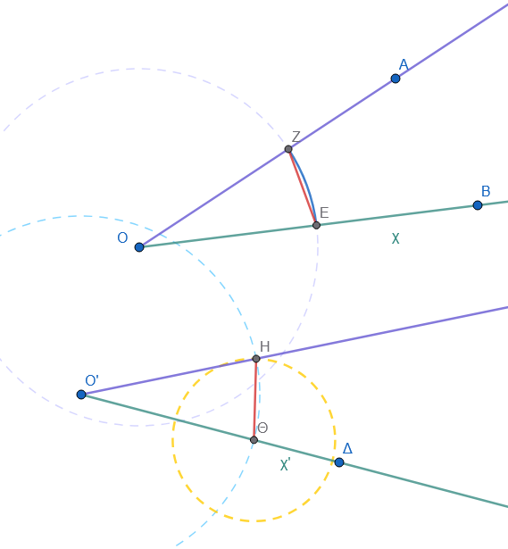

\usepackage{wasysym}

```{=html}
<!-- Φόρτωση βιβλιοθήκης GeoGebra -->
<script src="https://www.geogebra.org/apps/deployggb.js"</script>

<!-- Συνάρτηση δημιουργίας applets -->
<script>
function createGeoGebra(containerId, materialId, width = 700, height = 500) {
  var params = {
    "id": "ggb-" + containerId,
    "material_id": materialId,
    "width": width,
    "height": height,
    "showToolBar": true,
    "showMenuBar": false,
    "showAlgebraInput": true
  };
  
  var applet = new GGBApplet(params, '5.2');
  applet.inject(containerId);
}
</script>
```

------------------------------------------------------------------------

## Επίκεντρη γωνία – Σχέση επίκεντρης γωνίας και του αντίστοιχου τόξου – Μέτρηση τόξου

### **Επίκεντρη Γωνία – Σχέση με Τόξο – Μέτρηση Τόξου**

::: {style="background-color: #c0d4b8; border: 2px solid #2f3e50; color: #25188a; padding: 15px; border-radius: 5px;"}
**Θεωρία – Ορισμοί – Ιδιότητες**

- **Επίκεντρη γωνία** ονομάζεται κάθε γωνία που έχει την **κορυφή της στο κέντρο** ενός κύκλου.

- Οι πλευρές της επίκεντρης γωνίας τέμνουν την περιφέρεια σε δύο σημεία, ορίζοντας ένα **αντίστοιχο τόξο** που βρίσκεται στο εσωτερικό της γωνίας.

<iframe src="https://www.geogebra.org/calculator/pacpprmv?embed" width="730" height="600" allowfullscreen style="border: 1px solid #e4e4e4;border-radius: 4px;" frameborder="0">

</iframe>

- **Θεμελιώδης Σχέση:** Στον ίδιο κύκλο ή σε ίσους κύκλους, **ίσες επίκεντρες γωνίες βαίνουν σε ίσα τόξα** και αντιστρόφως, σε ίσα τόξα αντιστοιχούν ίσες επίκεντρες γωνίες.

<iframe src="https://www.geogebra.org/calculator/jxksxw53?embed" width="730" height="600" allowfullscreen style="border: 1px solid #e4e4e4;border-radius: 4px;" frameborder="0">

</iframe>

- Στον ίδιο ή σε ίσους κύκλους, στη **μεγαλύτερη επίκεντρη γωνία** αντιστοιχεί μεγαλύτερο τόξο.

- **Μέτρηση Τόξου:** Ως μέτρο ενός τόξου σε μοίρες ορίζεται το **μέτρο της αντίστοιχης επίκεντρης γωνίας**.

- Η **μονάδα μέτρησης τόξων** (μοίρα τόξου 1°) αντιστοιχεί στην επίκεντρη γωνία της 1°.
:::

**Παραδείγματα**

1.  Μια επίκεντρη γωνία 60° ορίζει στην περιφέρεια ένα τόξο μέτρου 60°.
2.  Σε δύο **ομόκεντρους κύκλους**, η ίδια επίκεντρη γωνία ορίζει τόξα με διαφορετικό μήκος αλλά με το ίδιο μέτρο σε μοίρες.
3.  Η επίκεντρη γωνία που αντιστοιχεί σε **ημιπεριφέρεια** είναι 180° ή 200 βαθμοί (gr).
4.  Η επίκεντρη γωνία ενός **τεταρτημορίου** κύκλου είναι ορθή (90° ή 100 gr).
5.  Αν σε έναν κύκλο έχουμε δύο χορδές ίσες, τότε και τα αντίστοιχα τόξα τους είναι ίσα, άρα και οι επίκεντρες γωνίες τους είναι ίσες.

**Ασκήσεις**

1.  Σχεδιάστε μια περιφέρεια και μια επίκεντρη γωνία 75°. Ποιο είναι το μέτρο του αντίστοιχου τόξου;.
2.  Σε κύκλο ακτίνας $R=3\text{ cm}$, σημειώστε δύο διαδοχικά τόξα $AB=45^\circ$ και $B\Gamma=60^\circ$. Υπολογίστε την επίκεντρη γωνία $AOC$.
3.  Αν μια επίκεντρη γωνία είναι ίση με το $1/6$ της πλήρους γωνίας, πόσες μοίρες είναι το αντίστοιχο τόξο;.
4.  Αποδείξτε με χρήση διαφανούς χαρτιού ότι ίσες επίκεντρες γωνίες στον ίδιο κύκλο ορίζουν ίσα τόξα.
5.  Πόσες μοίρες είναι η επίκεντρη γωνία που αντιστοιχεί σε τόξο ίσο με το $1/5$ της περιφέρειας;.
6.  Σε έναν κύκλο $(O, R)$, η γωνία $\widehat{AOB}$ είναι $120^\circ$. Τι μέρος της περιφέρειας είναι το τόξο $AB$;.
7.  Αν δύο τόξα $AB$ και $\Gamma\Delta$ έχουν μέτρο $50^\circ$ αλλά ανήκουν σε άνισους κύκλους, είναι ίσα; Αιτιολογήστε.
8.  Σχεδιάστε δύο κάθετες διαμέτρους $AB$ και $\Gamma\Delta$. Πόσες μοίρες είναι οι επίκεντρες γωνίες που σχηματίζονται;.
9.  Βρείτε το μέτρο του τόξου στο οποίο βαίνει μια επίκεντρη γωνία ίση με το $2/3$ της ορθής.
10. Χρησιμοποιήστε το μοιρογνωμόνιο για να ορίσετε σε μια περιφέρεια τόξο $135^\circ$.

------------------------------------------------------------------------

### **Κατασκευή Γωνίας Ίσης με Δοσμένη (Κανόνας & Διαβήτης)**

::: {style="background-color: #c0d4b8; border: 2px solid #2f3e50; color: #25188a; padding: 15px; border-radius: 5px;"}
**Θεωρία – Ορισμοί – Ιδιότητες**

Η κατασκευή μιας γωνίας ίσης με μια δεδομένη (έστω την $xOy$) πάνω σε μια νέα ημιευθεία ($O'x'$) πραγματοποιείται με τη χρήση κανόνα (χάρακα) και διαβήτη ακολουθώντας τα παρακάτω βήματα:

1.  **Σχεδίαση τόξου στην αρχική γωνία:** Με κέντρο την κορυφή $O$ της δεδομένης γωνίας και με οποιαδήποτε τυχαία ακτίνα, γράφουμε ένα τόξο που τέμνει τις δύο πλευρές της γωνίας στα σημεία $Ε$ και $Ζ$.
2.  **Μεταφορά ακτίνας στη νέα θέση:** Με κέντρο την αρχή $O'$ της νέας ημιευθείας $O'x'$ και με την **ίδια ακτίνα** που χρησιμοποιήσαμε στο πρώτο βήμα, γράφουμε ένα νέο τόξο που τέμνει την ημιευθεία $O'x'$ σε ένα σημείο $Θ$.
3.  **Μέτρηση και μεταφορά της χορδής:** Με τον διαβήτη παίρνουμε το άνοιγμα που αντιστοιχεί στην απόσταση (χορδή) μεταξύ των σημείων $Ε$ και $Ζ$ της αρχικής γωνίας. Στη συνέχεια, τοποθετούμε τη βελόνα του διαβήτη στο σημείο $Θ$ και γράφουμε ένα μικρό τόξο που να τέμνει το τόξο της νέας θέσης στο σημείο $Η$.
4.  **Χάραξη της δεύτερης πλευράς:** Χαράσσουμε με τον χάρακα την ημιευθεία $O'y'$ που ξεκινά από το $O'$ και διέρχεται από το σημείο $Η$. Η γωνία $x'O'y'$ που σχηματίστηκε είναι ίση με την αρχική $xOy$.\
    {width="400"}

**Σημαντικές Παρατηρήσεις:**

- **Αιτιολόγηση:** Η κατασκευή αυτή στηρίζεται στη γεωμετρική ιδιότητα ότι σε ίσους κύκλους (ή στον ίδιο κύκλο), **ίσες χορδές αντιστοιχούν σε ίσες επίκεντρες γωνίες**.

- **Πλήθος λύσεων:** Το πρόβλημα έχει δύο λύσεις, καθώς μπορούμε να σημειώσουμε το σημείο $B'$ εκατέρωθεν της ημιευθείας $O'x'$, δημιουργώντας έτσι δύο πιθανές θέσεις για τη γωνία.

- **Επαλήθευση:** Η ισότητα των γωνιών μπορεί να επαληθευτεί πρακτικά με τη χρήση διαφανούς χαρτιού.

- **Εναλλακτική μέθοδος:** Εάν είναι γνωστό το μέτρο της γωνίας σε μοίρες, η κατασκευή μπορεί να γίνει και με τη χρήση **μοιρογνωμονίου**, τοποθετώντας το κέντρο του στην κορυφή και τη διάμετρό του πάνω στην αρχική πλευρά.
:::

**Παραδείγματα**

1.  Μεταφορά γωνίας $45^\circ$ από μια ημιευθεία $Ox$ σε μια νέα ημιευθεία $O'x'$.
2.  Κατασκευή γωνίας ίσης με τη γωνία ενός τριγώνου σε άλλη θέση στο επίπεδο.
3.  Σχεδίαση της **κατακορυφήν** γωνίας μιας δοσμένης $xOy$.
4.  Κατασκευή γωνίας ίσης με το άθροισμα δύο άλλων γωνιών.
5.  Χρήση της μεθόδου για τη σχεδίαση **παράλληλης ευθείας** μέσω ίσων εντός εναλλάξ γωνιών.

**Ασκήσεις**

1.  Σχεδιάστε μια τυχαία γωνία $\phi$ και κατασκευάστε μια ίση της με κανόνα και διαβήτη.
2.  Δίνεται γωνία $60^\circ$. Κατασκευάστε μια ίση της χωρίς μοιρογνωμόνιο.
3.  Κατασκευάστε γωνία ίση με μια δοσμένη αμβλεία γωνία $120^\circ$.
4.  Σχεδιάστε μια γωνία και κατασκευάστε τη διπλάσια της χρησιμοποιώντας δύο φορές τη μέθοδο μεταφοράς.
5.  Επαληθεύστε την κατασκευή σας χρησιμοποιώντας διαφανές χαρτί.
6.  Κατασκευάστε γωνία ίση με τη διαφορά δύο δοσμένων γωνιών.
7.  Σχεδιάστε ένα τρίγωνο και κατασκευάστε μια γωνία ίση με το άθροισμα των τριών γωνιών του. Τι παρατηρείτε;.
8.  Κατασκευάστε γωνία ίση με μια δοσμένη ορθή γωνία.
9.  Δίνεται ημιευθεία $Ax$. Κατασκευάστε γωνία $\widehat{xAy}$ ίση με μια γωνία $\omega$ και από την άλλη μεριά της $Ax$ τη γωνία $\widehat{xAz} = \omega$.
10. Κατασκευάστε γωνία ίση με τα $3/4$ μιας ορθής γωνίας.

------------------------------------------------------------------------

### **Κατασκευή Τριγώνου (SAS & ASA)**

#### **(α) Δύο πλευρές και η περιεχόμενη γωνία (SAS)**

**Θεωρία – Ορισμοί – Ιδιότητες**

Η κατασκευή τριγώνου όταν είναι γνωστές **δύο πλευρές και η περιεχομένη γωνία τους (γνωστή ως περίπτωση SAS - Side-Angle-Side)** αποτελεί μία από τις βασικές περιπτώσεις κατασκευής, καθώς τα στοιχεία αυτά ορίζουν το τρίγωνο πλήρως και μοναδικά.

- **Μοναδικότητα:** Ένα τρίγωνο είναι τελείως ορισμένο όταν δοθούν δύο πλευρές του και η περιεχομένη από αυτές γωνία.
  Αυτό σημαίνει ότι οποιοδήποτε τρίγωνο κατασκευαστεί με τα ίδια στοιχεία θα είναι ίσο με το αρχικό (κριτήριο ισότητας SAS).

- **Περιορισμός:** Η περιεχομένη γωνία πρέπει να είναι μικρότερη από $180^\circ$ (ευθεία ή πεπλατυσμένη γωνία).

#### **Διαδικασία Κατασκευής**

Για να κατασκευάσουμε το τρίγωνο $ΑΒΓ$ όταν δίνονται οι πλευρές $γ$ (ΑΒ) και $β$ (ΑΓ) και η γωνία $A$, ακολουθούμε τα εξής βήματα:

1.  **Σχεδίαση Γωνίας:** Σχεδιάζουμε μια ημιευθεία Αχ.
    - ***α τρόπος***. Με κορυφή το σημείο $A$ και τη βοήθεια μοιρογνωμονίου, κατασκευάζουμε μια γωνία $\widehat{xAy}$ ίση με τη δοσμένη γωνία $A$.
    - ***β τρόπος***. Στην ημιευθεία (που θα σχεδιάσουμε την νέα γωνία) και στην δοσμένη γωνία σχεδιάζουμε τόξο με την ίδια ακτίνα και κέντρο την κορυφή των γωνιών. Στην δοσμένη γωνία με το άνοιγμα του διαβήτη παίρνουμε το μέτρο του τόξου που ορίζεται από τα σημεία τομής και το ματαφέρουμε στην γωνία που θα σχεδιάσουμε.
    
> > Δες την παράγραφο $\rightarrow$ Κατασκευή Γωνίας Ίσης με Δοσμένη (Κανόνας & Διαβήτης)

<iframe src="https://www.geogebra.org/calculator/tbanuf36?embed" width="730" height="600" allowfullscreen style="border: 1px solid #e4e4e4;border-radius: 4px;" frameborder="0"></iframe>

2.  **Μεταφορά Μηκών:** Πάνω στις ημιευθείες $Ax$ και $Ay$ της γωνίας, ορίζουμε με τον διαβήτη ή τον χάρακα τμήματα $ΑΒ$ και $ΑΓ$ ίσα με τα δοσμένα μήκη των πλευρών αντίστοιχα.
3.  **Σχεδίαση Τρίτης Πλευράς:** Ενώνουμε τα σημεία $B$ και $Γ$ με ένα ευθύγραμμο τμήμα. Το τμήμα αυτό αποτελεί την τρίτη πλευρά του τριγώνου $ΑΒΓ$.

Η ορθότητα της κατασκευής μπορεί να επαληθευτεί πρακτικά με τη χρήση διαφανούς χαρτιού, όπου διαπιστώνεται ότι κάθε άλλο τρίγωνο με τα ίδια στοιχεία συμπίπτει με το αρχικό.

**Παραδείγματα**

1.  Κατασκευή τριγώνου $AB\Gamma$ με $AB=4\text{ cm}, A\Gamma=3\text{ cm}$ και $\hat{A}=50^\circ$.
2.  Κατασκευή ορθογωνίου τριγώνου με κάθετες πλευρές $25\text{ mm}$ και $35\text{ mm}$ (η περιεχόμενη γωνία είναι $90^\circ$).
3.  Σχεδίαση **ισοσκελούς** τριγώνου με ίσες πλευρές $5\text{ cm}$ και γωνία κορυφής $70^\circ$.
4.  Κατασκευή τριγώνου με $AB=3\text{ cm}, A\Gamma=4,5\text{ cm}$ και $\hat{A}=60^\circ$.
5.  Σχεδίαση τριγώνου $AB\Gamma$ με $AB=6\text{ cm}, B\Gamma=3\text{ cm}$ και $\hat{B}=60^\circ$.
6.  Κατασκευή τριγώνου $ΑΒΓ$ με $ΑΒ=3\text{ cm}$, $ΑΓ=5\text{ cm}$ και γωνία $A=70^\circ$.
7.  Κατασκευή τριγώνου με πλευρές $4\text{ cm}$ και $3\text{ cm}$ και περιεχόμενη γωνία $50^\circ$.
8.  Κατασκευή τριγώνου με $ΑΒ=3\text{ cm}$, $ΑΓ=4,5\text{ cm}$ και γωνία $A=60^\circ$.
9.  Κατασκευή τριγώνου $ΑΒΓ$ με $ΑΒ=72\text{ mm}$, $ΑΓ=52\text{ mm}$ και γωνία $A=40^\circ$.
10. Κατασκευή ορθογωνίου τριγώνου (ειδική περίπτωση SAS όπου η γωνία είναι $90^\circ$) με κάθετες πλευρές $25\text{ mm}$ και $35\text{ mm}$.

**Ασκήσεις**

1.  Κατασκευάστε τρίγωνο με πλευρές $5\text{ cm}, 4\text{ cm}$ και περιεχόμενη γωνία $70^\circ$.
2.  Σχεδιάστε ορθογώνιο τρίγωνο με κάθετες πλευρές $3\text{ cm}$ και $4\text{ cm}$. Μετρήστε την υποτείνουσα.
3.  Κατασκευάστε ισοσκελές τρίγωνο με πλευρές $62\text{ mm}$ και γωνία κορυφής $50^\circ$.
4.  Σχεδιάστε τρίγωνο με πλευρές $0,04\text{ m}, 0,25\text{ dm}$ και γωνία $120^\circ$.
5.  Κατασκευάστε τρίγωνο $AB\Gamma$ με $AB=72\text{ mm}, A\Gamma=52\text{ mm}$ και περιεχόμενη γωνία $40^\circ$.
6.  Σχεδιάστε δύο τρίγωνα με τα ίδια SAS στοιχεία και ελέγξτε αν συμπίπτουν.
7.  Κατασκευάστε τρίγωνο με πλευρές $4,2\text{ cm}, 3,6\text{ cm}$ και γωνία $57^\circ$.
8.  Σχεδιάστε τρίγωνο με πλευρές $5\text{ cm}, 8\text{ cm}$ και γωνία $55^\circ$.
9.  Κατασκευάστε τρίγωνο $AB\Gamma$ με $AB=36\text{ mm}, A\Gamma=40\text{ mm}$ και $\hat{A}=90^\circ$.
10. Σχεδιάστε ρόμβο πλευράς $5\text{ cm}$ και γωνίας $60^\circ$ (αποτελείται από δύο SAS τρίγωνα).

------------------------------------------------------------------------

#### **(β) Μία πλευρά και οι προσκείμενες γωνίες (ASA)**

**Θεωρία – Ορισμοί – Ιδιότητες**

Για την κατασκευή ενός τριγώνου $ΑΒΓ$, όταν είναι γνωστά μία πλευρά του (έστω η $α$) και οι δύο προσκείμενες σε αυτήν γωνίες (έστω οι $\hat{B}$ και $\hat{\Gamma}$), ακολουθείται η παρακάτω διαδικασία με τη χρήση κανόνα (χάρακα) και μοιρογνωμονίου:

#### **Διαδικασία Κατασκευής**

1.  **Σχεδίαση της Πλευράς:** Πάνω σε μια ευθεία $χ'χ$, ορίζουμε με τον διαβήτη ή τον χάρακα ένα ευθύγραμμο τμήμα $ΒΓ$ ίσο με το δοσμένο μήκος $α$.
2.  **Κατασκευή της Πρώτης Γωνίας:** Με κορυφή το σημείο $Β$ και πλευρά την ημιευθεία $ΒΓ$, κατασκευάζουμε με το μοιρογνωμόνιο μια γωνία $\widehat{\Gamma Bx}$ ίση με τη δοσμένη γωνία $\hat B=\hatγ$.
3.  **Κατασκευή της Δεύτερης Γωνίας:** Με κορυφή το σημείο $\Gamma$, πλευρά την ημιευθεία $\Gamma Β$ και στο ίδιο ημιεπίπεδο ως προς τη $ΒΓ$, κατασκευάζουμε μια γωνία $\widehat{B\Gamma y}$ ίση με τη δοσμένη γωνία $\hat Γ=\hat β$.
4.  **Προσδιορισμός της Τρίτης Κορυφής:** Οι δύο ημιευθείες ($Bx$ και $\Gamma y$) που σχεδιάστηκαν θα τμηθούν σε ένα σημείο. Το σημείο τομής τους είναι η τρίτη κορυφή $Α$ του τριγώνου.
5.  **Ολοκλήρωση:** Το σχήμα $ΑΒΓ$ που προκύπτει είναι το ζητούμενο τρίγωνο.

<iframe src="https://www.geogebra.org/calculator/bfpbjqph?embed" width="730" height="600" allowfullscreen style="border: 1px solid #e4e4e4;border-radius: 4px;" frameborder="5"></iframe>

#### **Βασικές Παρατηρήσεις**

- **Περιορισμός Δυνατότητας Κατασκευής:** Για να είναι δυνατή η κατασκευή και να τέμνονται οι ημιευθείες, πρέπει **το άθροισμα των δύο δοσμένων γωνιών να είναι μικρότερο από 180°** (δύο ορθές γωνίες). Αν το άθροισμα είναι ίσο ή μεγαλύτερο από 180°, οι ημιευθείες δεν θα συναντηθούν ποτέ και το τρίγωνο δεν μπορεί να σχηματιστεί.
- **Μοναδικότητα:** Το τρίγωνο είναι **τελείως ορισμένο** από αυτά τα στοιχεία. Αυτό σημαίνει ότι οποιοδήποτε άλλο τρίγωνο κατασκευαστεί με την ίδια πλευρά και τις ίδιες προσκείμενες γωνίες θα είναι ίσο με το αρχικό (κριτήριο ισότητας ASA).
- **Υπολογισμός Τρίτης Γωνίας:** Η τρίτη γωνία $Α$ του τριγώνου μπορεί να υπολογιστεί εύκολα, καθώς το άθροισμα των γωνιών κάθε τριγώνου είναι πάντα 180° ($A = 180° - (B + \Gamma)$).

**Παραδείγματα**

1.  Κατασκευή τριγώνου $AB\Gamma$ με $B\Gamma=4\text{ cm}, \hat{B}=40^\circ$ και $\hat{\Gamma}=60^\circ$.
2.  Κατασκευή τριγώνου με πλευρά $6\text{ cm}$ και προσκείμενες γωνίες $40^\circ$ και $75^\circ$.
3.  Σχεδίαση τριγώνου με πλευρά $4\text{ cm}$ και γωνίες $45^\circ$ και $30^\circ$.
4.  Κατασκευή τριγώνου με πλευρά $6\text{ cm}$ και γωνίες $35^\circ$ και $50^\circ$.
5.  Σχεδίαση τριγώνου με πλευρά $6,3\text{ cm}$ και γωνίες $60^\circ$ και $45^\circ$.

**10 Ασκήσεις**

1.  Κατασκευάστε τρίγωνο με πλευρά $5\text{ cm}$ και γωνίες $75^\circ$ και $50^\circ$.
2.  Σχεδιάστε τρίγωνο με πλευρά $70\text{ mm}$ και γωνίες $110^\circ$ και $30^\circ$. Είναι δυνατή η κατασκευή;.
3.  Κατασκευάστε τρίγωνο με πλευρά $52\text{ mm}$ και γωνίες $105^\circ$ και $90^\circ$. Γιατί είναι αδύνατη;.
4.  Σχεδιάστε ισοσκελές τρίγωνο με βάση $6\text{ cm}$ και γωνίες βάσης $40^\circ$ η καθεμία.
5.  Κατασκευάστε τρίγωνο με πλευρά $56\text{ mm}$ και γωνίες $64^\circ$ και $75^\circ$.
6.  Σχεδιάστε τρίγωνο $AB\Gamma$ με $B\Gamma=4\text{ cm}, \hat{B}=60^\circ$ και $\hat{\Gamma}=45^\circ$. Υπολογίστε την τρίτη γωνία.
7.  Κατασκευάστε τρίγωνο με πλευρά $8\text{ cm}$ και γωνίες $54^\circ$ και $68^\circ$.
8.  Σχεδιάστε τρίγωνο με πλευρά $4,8\text{ cm}$ και γωνίες $55^\circ$ και $55^\circ$.
9.  Κατασκευάστε τρίγωνο $AB\Gamma$ με $B\Gamma=6,3\text{ cm}$ και γωνίες $45^\circ$ και $60^\circ$.
10. Σχεδιάστε δύο τρίγωνα με τα ίδια ASA στοιχεία και δείξτε ότι είναι ίσα.

------------------------------------------------------------------------


::: {style="background-color: #f0f8cc; border: 2px solid #2f3e50; color: #25188a; padding: 15px; border-radius: 5px;"}
ΚΑΛΗ ΜΕΛΕΤΗ !
:::
