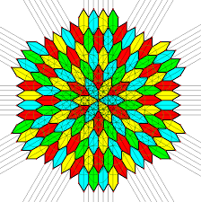
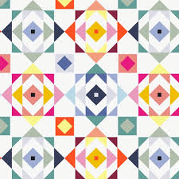
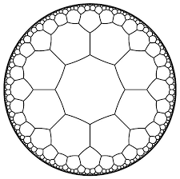
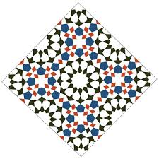

\usepackage{wasysym}

```{=html}
<!-- Φόρτωση βιβλιοθήκης GeoGebra -->
<script src="https://www.geogebra.org/apps/deployggb.js"</script>

<!-- Συνάρτηση δημιουργίας applets -->
<script>
function createGeoGebra(containerId, materialId, width = 700, height = 500) {
  var params = {
    "id": "ggb-" + containerId,
    "material_id": materialId,
    "width": width,
    "height": height,
    "showToolBar": true,
    "showMenuBar": false,
    "showAlgebraInput": true
  };
  
  var applet = new GGBApplet(params, '5.2');
  applet.inject(containerId);
}
</script>
```

------------------------------------------------------------------------

## Η συμμετρία ως προς σημείο (ή κεντρική συμμετρία) ορίζεται με βάση τις παρακάτω έννοιες:

::: {style="background-color: #f0f8cc; border: 2px solid #2f3e50; color: #25188a; padding: 15px; border-radius: 5px;"}
1.  **Συμμετρικά Σημεία:**

-   Δύο σημεία Α και Α' ονομάζονται **συμμετρικά ως προς ένα σημείο Ο**, όταν το Ο είναι το **μέσο** του ευθύγραμμου τμήματος ΑΑ'.
-   Για κάθε σημείο Α του επιπέδου, υπάρχει μοναδικό σημείο Α' που είναι συμμετρικό του ως προς το Ο.
-   Το σημείο Ο (το κέντρο) είναι το μοναδικό σημείο που συμπίπτει με τον εαυτό του, δηλαδή το συμμετρικό του Ο ως προς το Ο είναι το ίδιο το Ο.

2.  **Συμμετρικά Σχήματα**

-   Δύο σχήματα Σ και Σ' λέγονται συμμετρικά ως προς ένα σημείο Ο, όταν **κάθε σημείο του Σ' είναι συμμετρικό ενός σημείου του Σ** ως προς το Ο και αντίστροφα.
-   Τα συμμετρικά σχήματα ως προς σημείο είναι πάντα **ίσα** μεταξύ τους.

3.  **Κέντρο Συμμετρίας και Κεντρική Συμμετρία**

-   **Κέντρο συμμετρίας** ενός σχήματος ονομάζεται ένα σημείο Ο, όταν για κάθε σημείο Α του σχήματος, το συμμετρικό του Α' ως προς το Ο είναι επίσης σημείο του ίδιου σχήματος.
-   Ένα σχήμα που διαθέτει τέτοιο σημείο λέμε ότι παρουσιάζει **κεντρική συμμετρία**.
-   Αν ένα σχήμα έχει κέντρο συμμετρίας το Ο, τότε το συμμετρικό ολόκληρου του σχήματος ως προς το Ο είναι ο εαυτός του.

4.  **Γεωμετρική Ερμηνεία** (Περιστροφή)

-   Η κεντρική συμμετρία αντιστοιχεί σε μια **περιστροφή του σχήματος κατά 180°** γύρω από το κέντρο συμμετρίας Ο.
-   Μετά από αυτή την περιστροφή, το σχήμα συμπίπτει απόλυτα με την αρχική του θέση.
:::

**Παραδείγματα σχημάτων με κέντρο συμμετρίας:**

\* Το **ευθύγραμμο τμήμα** (έχει κέντρο το μέσο του).

\* Η **ευθεία** (έχει κέντρο οποιοδήποτε σημείο της).

\* Ο **κύκλος** (έχει κέντρο το κέντρο του).

\* Το **παραλληλόγραμμο**, το **ορθογώνιο**, ο **ρόμβος** και το **τετράγωνο** (έχουν κέντρο το σημείο τομής των διαγωνίων τους).

------------------------------------------------------------------------

## Για να κατασκευάσουμε το συμμετρικό ενός σχήματος ως προς ένα σημείο (κεντρική συμμετρία),

η βασική διαδικασία στηρίζεται στην εύρεση των συμμετρικών των επιμέρους σημείων που ορίζουν το σχήμα.

### Κατασκευή συμμετρικού σημείου

Η βάση κάθε κατασκευής είναι η εύρεση του συμμετρικού ενός σημείου Α ως προς ένα κέντρο Ο:

\* **Σχεδιάζουμε τη γραμμή:** Ενώνουμε το σημείο Α με το κέντρο συμμετρίας Ο.

::: callout-tip
Αλάξτε την θέση του σημείου Α.

Παρατηρήστε τι συμβαίνει με το Α'.
:::

<iframe src="https://www.geogebra.org/calculator/grbpvqte?embed" width="730" height="600" allowfullscreen style="border: 1px solid #e4e4e4;border-radius: 4px;" frameborder="0">

</iframe>

-   **Προεκτείνουμε:** Προεκτείνουμε το τμήμα ΑΟ προς το μέρος του Ο.
-   **Μεταφέρουμε την απόσταση:** Πάνω στην προέκταση, παίρνουμε ένα τμήμα ΟΑ' ίσο με το ΑΟ. Το σημείο Α' είναι το συμμετρικό του Α ως προς το Ο, και το Ο είναι το **μέσο** του ευθύγραμμου τμήματος ΑΑ'.

### 2. Κατασκευή συμμετρικού για σύνθετα σχήματα

Για να βρούμε το συμμετρικό ολόκληρου του σχήματος, επαναλαμβάνουμε την παραπάνω διαδικασία για τα κύρια σημεία του:

-   **Ευθύγραμμο τμήμα ΑΒ:** Βρίσκουμε τα συμμετρικά σημεία Α' και Β' των άκρων του Α και Β. Το τμήμα Α'Β' είναι το ζητούμενο. Το συμμετρικό τμήμα είναι **ίσο και παράλληλο** με το αρχικό.

<iframe src="https://www.geogebra.org/calculator/qsmaykmh?embed" width="730" height="600" allowfullscreen style="border: 1px solid #e4e4e4;border-radius: 4px;" frameborder="0">

</iframe>

-   **Γωνία** $\hat{ΑΟΒ}$

::: callout-tip
Αλάξτε την θέση των σημείων Α,Ο ή Β.

Παρατηρείστε τι συμβαίνει.

Επιλέξτε με <kbd>Ctrl</kbd> + τα σημεία Α και Ο και Β, μετά αφήστε το <kbd>Ctrl</kbd> και tap σε ένα από τα σημεία και μετακινήστε.

Το ίδιο μπορείτε να κάνετε επιλέγοντας με πορόμοιο τρόπο τις πλευρές της γωνίας, έτσι αλλάζετε ολόκληρη την γωνία.
:::

<iframe src="https://www.geogebra.org/calculator/eamwg2rj?embed" width="730" height="600" allowfullscreen style="border: 1px solid #e4e4e4;border-radius: 4px;" frameborder="0">

</iframe>

-   **Τρίγωνο ΑΒΓ:** Κατασκευάζουμε τα συμμετρικά των τριών κορυφών του (Α', Β', Γ') και τα ενώνουμε για να σχηματίσουμε το συμμετρικό τρίγωνο Α'Β'Γ'.

::: callout-tip
Αλάξτε την θέση των σημείων Α, Β ή Γ.

Παρατηρείστε τι συμβαίνει.

Επιλέξτε το τρίγωνο ΑΒΓ (tap στο εσωτερικό χρωματισμένο μέρος) και μετακινήστε.

Μετακινήστε το κέντρο συμμετρίας Ο, βάλτετο σε μια πλευρά του τριγώνου, στο εσωτερικό του τριγώνου ή σε μια κορυφή και δείτε τι συμβαίνει.
:::

<iframe src="https://www.geogebra.org/calculator/uaqmqzpn?embed" width="7300" height="600" allowfullscreen style="border: 1px solid #e4e4e4;border-radius: 4px;" frameborder="0">

</iframe>

-   **Πολύγωνο:** Βρίσκουμε τα συμμετρικά όλων των κορυφών του και τα συνδέουμε με τη σειρά.

::: callout-tip
Μετακινήστε σημεία, πλευρές, κορυφές του πολυγώνου ή ολόκληρο το πολύγωνο.
Τι παρατηρήτε;
:::

<iframe src="https://www.geogebra.org/calculator/zsh7df9b?embed" width="730" height="600" allowfullscreen style="border: 1px solid #e4e4e4;border-radius: 4px;" frameborder="0">

</iframe>

-   **Κύκλος (Κ, ρ):** Βρίσκουμε το συμμετρικό σημείο Κ' του κέντρου Κ και σχεδιάζουμε έναν νέο κύκλο με κέντρο το Κ' και την **ίδια ακτίνα** ρ.

::: callout-tip
Κάντε το ίδιο για τον κύκλο.

Τι συμβαίνει αν το κέντρο Ο συμπέσει με το κέντρο του κύκλου;
:::

<iframe src="https://www.geogebra.org/calculator/dkywagpp?embed" width="800" height="600" allowfullscreen style="border: 1px solid #e4e4e4;border-radius: 4px;" frameborder="0">

</iframe>

### Βασικές Ιδιότητες

-   Τα συμμετρικά σχήματα ως προς σημείο είναι πάντα **ίσα** μεταξύ τους.
-   Η κεντρική συμμετρία αντιστοιχεί σε **περιστροφή του σχήματος κατά 180°** γύρω από το κέντρο συμμετρίας.
-   Αν ένα σημείο ανήκει στο κέντρο συμμετρίας, το συμμετρικό του είναι ο εαυτός του.

------------------------------------------------------------------------

## Η συμμετρία ως προς σημείο (κεντρική συμμετρία) είναι πολύ συχνή στην καθημερινότητά μας,

από τον αθλητισμό και τη φύση μέχρι τα γράμματα που χρησιμοποιούμε.
Ακολουθούν μερικά χαρακτηριστικά παραδείγματα:

-   **Αθλητικοί χώροι:** Τα γήπεδα του **μπάσκετ** και του **τένις** παρουσιάζουν κεντρική συμμετρία. Στο τένις, για παράδειγμα, το μέσο του φιλέ λειτουργεί ως κέντρο συμμετρίας για τις θέσεις των παικτών και τις γραμμές του γηπέδου.
-   **Το ελληνικό αλφάβητο:** Πολλά κεφαλαία γράμματα έχουν κέντρο συμμετρίας, δηλαδή αν τα περιστρέψουμε κατά 180° παραμένουν ίδια. Αυτά είναι τα: **Ζ, Η, Θ, Ι, Ν, Ξ, Ο, Φ και Χ**.
-   **Τραπουλόχαρτα:** Τα περισσότερα τραπουλόχαρτα (εκτός από εξαιρέσεις όπως το "9") είναι σχεδιασμένα με κέντρο συμμετρίας το σημείο τομής των διαγωνίων τους, ώστε να φαίνονται ίδια ακόμα και αν κρατηθούν ανάποδα.
-   **Φύση και Βιολογία:**
    -   Οι **κερήθρες** των μελισσών αποτελούνται από τέλεια εξάγωνα, σχήματα που διαθέτουν κέντρο συμμετρίας.
    -   Στο **ανθρώπινο σώμα**, αν και κυριαρχεί η αξονική συμμετρία, ο **ομφαλός** θεωρείται το κεντρικό σημείο σε γεωμετρικά μοντέλα (όπως στον "Άνθρωπο του Βιτρούβιου"), καθώς ένας κύκλος με κέντρο αυτόν μπορεί να εφάπτεται στα άκρα των χεριών και των ποδιών σε συγκεκριμένη στάση.
-   **Σύμβολα και Σήματα:** Σύμβολα όπως ο **σταυρός** (π.χ. του Ερυθρού Σταυρού) ή το προειδοποιητικό σήμα της **ραδιενέργειας** παρουσιάζουν κεντρική συμμετρία.
-   **Γεωμετρικά αντικείμενα:** Οποιοδήποτε αντικείμενο καθημερινής χρήσης έχει σχήμα **παραλληλογράμμου** (π.χ. ένα τραπέζι ή ένα παράθυρο), **ρόμβου**, **κύκλου** ή **τετραγώνου**, διαθέτει κέντρο συμμετρίας το σημείο τομής των διαγωνίων του ή το κέντρο του.
-   **Σχέδια με κέντρο σημμετρίας**









------------------------------------------------------------------------

Ακολουθούν διάφοροι τύποι ασκήσεων πάνω στην κεντρική συμμετρία (συμμετρία ως προς σημείο), ταξινομημένοι ανάλογα με τον βαθμό δυσκολίας και το αντικείμενό τους:

### 1. Βασικές Κατασκευαστικές Ασκήσεις

Αυτές οι ασκήσεις εστιάζουν στη διαδικασία εύρεσης της εικόνας ενός σχήματος.

\* **Κατασκευή Συμμετρικού Σημείου:** Δίνεται σημείο Α και κέντρο Ο.
Σχεδιάστε το συμμετρικό του Α' ως προς το Ο.

\* *Μέθοδος:* Ενώστε το Α με το Ο, προεκτείνετε και πάρτε τμήμα ΟΑ' = ΟΑ.

\* **Συμμετρικό Ευθυγράμμου Τμήματος:** Σχεδιάστε το συμμετρικό τμήμα ΡΣ ενός τμήματος ΛΧ ως προς ένα σημείο Φ.

\* **Συμμετρικό Τριγώνου:** Δίνεται τρίγωνο ΑΒΓ και σημείο Ο εξωτερικό αυτού.
Κατασκευάστε το συμμετρικό του τρίγωνο Α'Β'Γ'.

\* **Συμμετρικό Κύκλου:** Βρείτε το συμμετρικό ενός κύκλου (Κ, ρ) ως προς κέντρο Ο.

\* *Μέθοδος:* Βρίσκουμε το συμμετρικό Κ' του κέντρου Κ και σχεδιάζουμε νέο κύκλο με την ίδια ακτίνα ρ.

### 2. Αποδεικτικές Ασκήσεις (Γεωμετρική Τεκμηρίωση)

-   **Ισότητα Σχημάτων:** Αποδείξτε ότι το συμμετρικό ενός τριγώνου ΑΒΓ ως προς ένα σημείο Ο είναι ένα **τρίγωνο ίσο** με το αρχικό.
-   **Ιδιότητα Μέσου:** Αν Μ είναι το μέσο ενός τμήματος ΒΓ και Μ' το συμμετρικό του ως προς ένα σημείο Α, αποδείξτε ότι το Μ' είναι το **μέσο του συμμετρικού τμήματος** Β'Γ'.
-   **Σχηματισμός Παραλληλογράμμου:** Σχεδιάστε τρίγωνο ΑΒΔ και το συμμετρικό σημείο Γ της κορυφής Α ως προς το μέσο Ο της πλευράς ΒΔ. Αποδείξτε ότι το τετράπλευρο ΑΒΓΔ είναι **παραλληλόγραμμο**.
-   **Διάμετροι Κύκλου:** Αν ΑΑ', ΒΒ' και ΓΓ' είναι τρεις διάμετροι ενός κύκλου, αποδείξτε ότι τα τρίγωνα ΑΒΓ και Α'Β'Γ' είναι ίσα (εφαρμογή κεντρικής συμμετρίας με κέντρο το κέντρο του κύκλου).

### 3. Ασκήσεις με Κέντρα Συμμετρίας Γνωστών Σχημάτων

-   **Αναζήτηση Κέντρου:** Εξετάστε ποια από τα παρακάτω τετράπλευρα έχουν κέντρο συμμετρίας και ποιο είναι αυτό: **παραλληλόγραμμο, ορθογώνιο, ρόμβος, τετράγωνο, τραπεζιο**.
    -   *Απάντηση:* Το σημείο τομής των διαγωνίων είναι κέντρο συμμετρίας για το παραλληλόγραμμο και τα ειδικά είδη του.
-   **Το Ελληνικό Αλφάβητο:** Γράψτε τα κεφαλαία γράμματα του αλφαβήτου και βρείτε ποια έχουν κέντρο συμμετρίας (π.χ. Ζ, Η, Θ, Ι, Ν, Ξ, Ο, Φ, Χ).
-   **Τραπουλόχαρτα:** Εξετάστε αν συγκεκριμένα τραπουλόχαρτα παρουσιάζουν κεντρική συμμετρία. Παρατηρήστε ότι το "9" συνήθως δεν έχει κέντρο συμμετρίας, ενώ το "8" έχει.

### 4. Σύνθετα Θέματα

-   **Συμμετρικό Τετραγώνου:** Σχεδιάστε το συμμετρικό ενός τετραγώνου ως προς το **μέσο μιας πλευράς του**.
-   **Συμμετρικό Ορθογωνίου Τριγώνου:** Βρείτε το συμμετρικό ενός ορθογωνίου τριγώνου ΑΒΓ ως προς το **μέσο Μ της υποτείνουσάς του**.
-   **Κατακορυφήν Γωνίες:** Αποδείξτε ότι η κορυφή Ο δύο κατακορυφήν γωνιών είναι το κέντρο συμμετρίας τους.

::: {style="background-color: #f0f8cc; border: 2px solid #2f3e50; color: #25188a; padding: 15px; border-radius: 5px;"}
ΚΑΛΗ ΜΕΛΕΤΗ !
:::
