\usepackage{wasysym}

```{=html}
<!-- Φόρτωση βιβλιοθήκης GeoGebra -->
<script src="https://www.geogebra.org/apps/deployggb.js"</script>

<!-- Συνάρτηση δημιουργίας applets -->
<script>
function createGeoGebra(containerId, materialId, width = 700, height = 500) {
  var params = {
    "id": "ggb-" + containerId,
    "material_id": materialId,
    "width": width,
    "height": height,
    "showToolBar": true,
    "showMenuBar": false,
    "showAlgebraInput": true
  };
  
  var applet = new GGBApplet(params, '5.2');
  applet.inject(containerId);
}
</script>
```

------------------------------------------------------------------------

## Η θεωρία για τις παράλληλες ευθείες που τέμνονται από μια τρίτη ευθεία (τέμνουσα)

αποτελεί βασικό κεφάλαιο της Γεωμετρίας, καθώς ορίζει τις σχέσεις των γωνιών που σχηματίζονται και τους τρόπους απόδειξης της παραλληλίας.

### **Θεωρία και Ορισμοί**

-   **Παράλληλες ευθείες:** Είναι οι ευθείες που βρίσκονται στο ίδιο επίπεδο και **δεν έχουν κανένα κοινό σημείο**, όσο κι αν προεκταθούν.

-   **Τέμνουσα ευθεία:** Όταν μια τρίτη ευθεία ($\delta$) τέμνει δύο άλλες ευθείες ($\epsilon_1, \epsilon_2$), σχηματίζονται **οκτώ γωνίες**.
    Αυτές οι γωνίες ονομάζονται ανάλογα με τη θέση τους:

-   **Εντός:** Οι γωνίες που βρίσκονται στη ζώνη ανάμεσα στις δύο ευθείες.

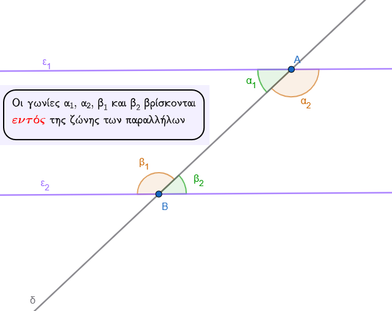{width="480"}

-   **Εκτός:** Οι γωνίες που βρίσκονται έξω από τη ζώνη των δύο ευθειών.

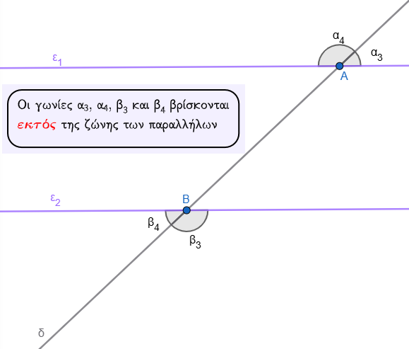{width="483"}

-   **Επί τα αυτά:** Οι γωνίες που βρίσκονται προς το **ίδιο μέρος** (ημιεπίπεδο) της τέμνουσας $\delta$.

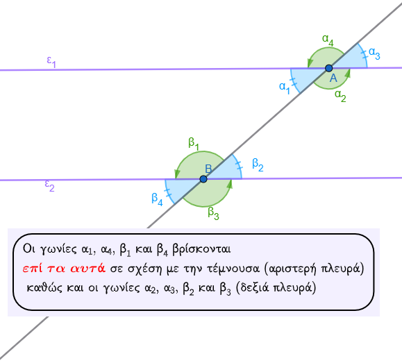{width="475"}

-   **Εναλλάξ:** Οι γωνίες που βρίσκονται **εκατέρωθεν** (σε διαφορετικά μέρη) της τέμνουσας $\delta$.

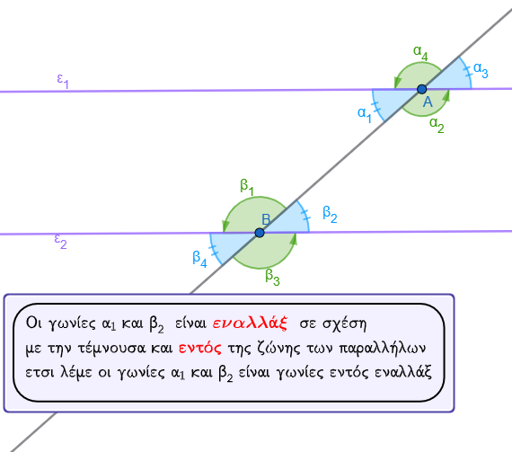{width="492"}

### **Ιδιότητες Γωνιών (Όταν οι ευθείες είναι παράλληλες)**

Αν δύο παράλληλες ευθείες τέμνονται από μια τρίτη, τότε ισχύουν οι εξής κανόνες για τα ζεύγη των γωνιών:

1\.
Οι **εντός εναλλάξ** γωνίες είναι **ίσες**.

2\.
Οι **εκτός εναλλάξ** γωνίες είναι **ίσες**.

3\.
Οι **εντός εκτός και επί τα αυτά** (αντίστοιχες) γωνίες είναι **ίσες**.

4\.
Οι **εντός και επί τα αυτά** γωνίες είναι **παραπληρωματικές** (άθροισμα 180°).

5\.
Οι **εκτός και επί τα αυτά** γωνίες είναι **παραπληρωματικές**.

::: callout-tip
Να θυμάστε ότι πάντα:

\- όλες οι οξείες γωνίες του σχήματος είναι ίσες μεταξύ τους

\- όλες οι αμβλείες γωνίες του σχήματος είναι ίσες μεταξύτους

\- μια αξεία και μια αμβλεία είναι μεταξύ τους παραπληρωματικές
:::

::: callout-tip
Να θυμάστε κάθε ζευγάρι γωνιών ονοματίζονται με τις λέξεις

1\.
**ΕΝΤΟΣ** αν είναι εντός της ζώνης των παραλλήλων ή **ΕΚΤΟΣ** αν είναι εκτός της ζώνης των παραλλήλων και

2\.
**ΕΠΙ ΤΑ ΑΥΤΑ** αν είναι από την ίδια πλευρά σε σχέση με την τέμνουσα ή **ΕΝΑΛΛΑΞ** αν βρίσκονται εκατέρωθεν της τέμνουσας.

Έτσι έχουμε γωνίες

**εντός εναλλάξ**

**εκτός εναλλάξ**

**εντός εκτός εναλλάξ**

**εκτός και επι τα αυτά**

**εντός εκτός και επί τα αυτά** κ.τ.λ.
:::

### **Κριτήρια Παραλληλίας (Πώς αποδεικνύουμε ότι δύο ευθείες είναι παράλληλες)**

Δύο ευθείες είναι παράλληλες αν τεμνόμενες από μια τρίτη σχηματίζουν:

\* Δύο γωνίες **εντός εναλλάξ ίσες**.

\* Δύο γωνίες **εντός εκτός και επί τα αυτά ίσες**.

\* Δύο γωνίες **εντός και επί τα αυτά παραπληρωματικές**.

\* Επίσης, δύο ευθείες **κάθετες στην ίδια ευθεία** (σε διαφορετικά σημεία) είναι μεταξύ τους παράλληλες.

**Αίτημα Παραλληλίας (Ευκλείδειο):** Από σημείο εκτός ευθείας άγεται **μία μόνο** παράλληλη προς αυτή.

------------------------------------------------------------------------

------------------------------------------------------------------------

### **Ασκήσεις**

**Άσκηση 1 (Υπολογισμός γωνιών):** Σε δύο παράλληλες ευθείες $\epsilon_1$ και $\epsilon_2$ που τέμνονται από ευθεία $\delta$, μια γωνία $\hat{A}_1$ είναι $42^\circ$.
Να βρεθούν οι υπόλοιπες γωνίες.

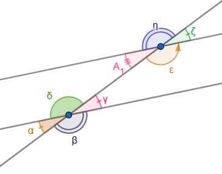

\* **Λύση:** Η γωνία $\hat{ε}$ είναι παραπληρωματική της $\hat{A}_1$, άρα $\hat{ε} = 180^\circ - 42^\circ = 138^\circ$.
Οι γωνίες $\hat{η}, \hat{ζ}$ προκύπτουν ως κατακορυφήν ($\hat{ζ}=42^\circ, \hat{η}=138^\circ$).
Λόγω παραλληλίας, οι αντίστοιχες γωνίες στην $\epsilon_2$ θα είναι ίδιες ($\hat{α}=\hat{γ}=42^\circ, \hat{β}=\hat{δ}=138^\circ$ κτλ.).

**Άσκηση 2 (Σε τρίγωνο):** Δίνεται τρίγωνο $ΑΒΓ$ και ευθεία $xy$ που διέρχεται από το $Α$ και είναι παράλληλη στη $ΒΓ$.
Να αποδείξετε ότι το άθροισμα των γωνιών του τριγώνου είναι $180^\circ$.

\* **Λύση:** Επειδή $xy // ΒΓ$, η γωνία $\omega$ είναι ίση με τη γωνία $\hat{B}$ και η γωνία $\phi$ ίση με τη γωνία $\hat{\Gamma}$ ως **εντός εναλλάξ**.
Επειδή οι $\omega, \hat{A}, \phi$ σχηματίζουν ευθεία γωνία ($180^\circ$), τότε και $\hat{A} + \hat{B} + \hat{\Gamma} = 180^\circ$.

**Άσκηση 3 (Υπολογισμός Γωνιών)** Σε ένα σχήμα, οι ευθείες $\epsilon_1$ και $\epsilon_2$ είναι παράλληλες ($\epsilon_1 // \epsilon_2$) και τέμνονται από μια ευθεία $AB$.
Η ημιευθεία $A\delta$ είναι η **διχοτόμος** της γωνίας $\widehat{\Gamma AB}$ και γνωρίζουμε ότι η γωνία $\widehat{\Gamma A\delta}$ είναι ίση με $75^\circ$.

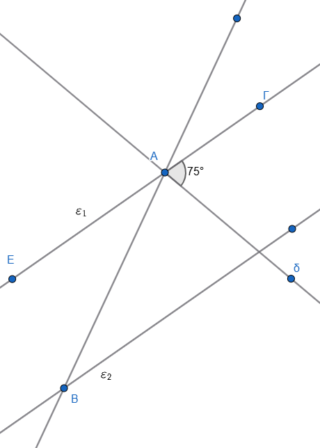{width="366"}

**Ζητούμενα:**

1\.
Να υπολογίσετε το μέτρο της γωνίας $\widehat{\Gamma AB}$.

2.  Να βρείτε τη γωνία $\omega$, η οποία βρίσκεται στην ευθεία $\epsilon_2$ και είναι **εντός εναλλάξ** της γωνίας $\widehat{\Gamma AB}$.

3\.
Αν υπάρχει μια άλλη ημιευθεία $B\zeta$ στην $\epsilon_2$ που είναι διχοτόμος της γωνίας $\widehat{KB\Delta}$ (όπου $\widehat{KB\Delta}$ είναι κατακορυφήν της $\omega$), να αποδείξετε ότι η γωνία $\widehat{\zeta B\Delta}$ είναι $75^\circ$.

------------------------------------------------------------------------

**Προτεινόμενη Λύση**

-   **Ερώτημα 1:** Εφόσον η $A\delta$ είναι διχοτόμος της γωνίας $\widehat{\Gamma AB}$, την χωρίζει σε δύο ίσες γωνίες. Επομένως, η συνολική γωνία $\widehat{\Gamma AB}$ είναι το διπλάσιο της $\widehat{\Gamma A\delta}$, δηλαδή: $\widehat{\Gamma AB} = 2 \cdot 75^\circ = 150^\circ$.
-   **Ερώτημα 2:** Επειδή οι ευθείες $\epsilon_1$ και $\epsilon_2$ είναι παράλληλες και τέμνονται από την $AB$, οι **εντός εναλλάξ** γωνίες τους είναι **ίσες**. Άρα, η γωνία $\omega$ είναι ίση με τη γωνία $\widehat{\Gamma AB}$, οπότε: $\omega = 150^\circ$.
-   **Ερώτημα 3:** Οι γωνίες $\widehat{KB\Delta}$ και $\omega$ είναι **κατακορυφήν**, άρα είναι ίσες: $\widehat{KB\Delta} = \omega = 150^\circ$. Επειδή η $B\zeta$ είναι διχοτόμος της $\widehat{KB\Delta}$, η γωνία $\widehat{\zeta B\Delta}$ θα είναι το μισό της, δηλαδή: $150^\circ / 2 = \mathbf{75^\circ}$.

**Επιπλέον Ιδιότητα (για προχωρημένους)** αν φέραμε τις διχοτόμους δύο **εντός εναλλάξ** γωνιών (όπως η $A\delta$ και η $B\zeta$ στην παραπάνω άσκηση), αυτές οι διχοτόμοι θα ήταν **παράλληλες μεταξύ τους**.
Αντίστοιχα, οι διχοτόμοι δύο **εντός και επί τα αυτά** γωνιών είναι πάντοτε **κάθετες** μεταξύ τους.

**Άσκηση 4** : Να βρείτε τις σημειωμένες γωνίες στα παρακάτω σχήματα.

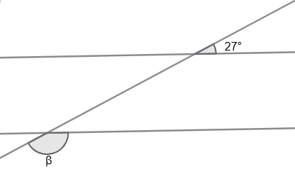{width="246"}

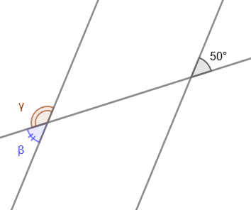{width="226"}

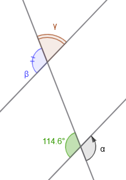{width="173"}

**Άσκηση 5**: Ναυπολογίσετε τους αγνώστους στα παρακάτω σχήματα.

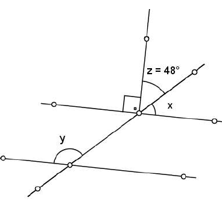

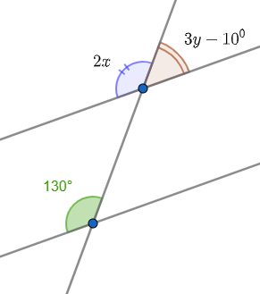

**Άσκηση 6**: Να υπολογίσετε τις άγνωστες γωνίες στο παρακάτω σχήμα.

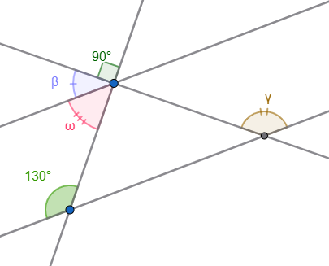

::: {style="background-color: #f0f8cc; border: 2px solid #2f3e50; color: #25188a; padding: 15px; border-radius: 5px;"}
ΚΑΛΗ ΜΕΛΕΤΗ !
:::
