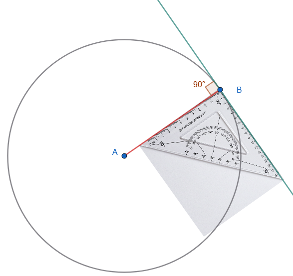

\usepackage{wasysym}

```{=html}
<!-- Φόρτωση βιβλιοθήκης GeoGebra -->
<script src="https://www.geogebra.org/apps/deployggb.js"</script>

<!-- Συνάρτηση δημιουργίας applets -->
<script>
function createGeoGebra(containerId, materialId, width = 700, height = 500) {
  var params = {
    "id": "ggb-" + containerId,
    "material_id": materialId,
    "width": width,
    "height": height,
    "showToolBar": true,
    "showMenuBar": false,
    "showAlgebraInput": true
  };
  
  var applet = new GGBApplet(params, '5.2');
  applet.inject(containerId);
}
</script>
```

------------------------------------------------------------------------

## Θέσεις ευθείας και κύκλου

### **Διάκριση Τέμνουσας και Εφαπτομένης Κύκλου**

:::: {style="background-color: #c0d4b8; border: 2px solid #2f3e50; color: #25188a; padding: 15px; border-radius: 5px;"}
**Θεωρία – Ορισμοί – Ιδιότητες**

- **Σχετικές Θέσεις:** Μια ευθεία (ε) και μια περιφέρεια κύκλου $(K, R)$ που βρίσκονται στο ίδιο επίπεδο μπορούν να έχουν τρεις θέσεις μεταξύ τους, οι οποίες εξαρτώνται από τη σύγκριση της απόστασης ($d$) του κέντρου από την ευθεία και της ακτίνας ($ρ$).

- **Τέμνουσα:** Μια ευθεία ονομάζεται τέμνουσα όταν έχει **δύο κοινά σημεία** με την περιφέρεια.
  Αυτό συμβαίνει όταν η απόσταση του κέντρου από την ευθεία είναι **μικρότερη από την ακτίνα** ($d < ρ$).
  Το τμήμα της ευθείας που βρίσκεται στο εσωτερικό του κύκλου ονομάζεται χορδή.

- **Εφαπτομένη:** Μια ευθεία ονομάζεται εφαπτομένη όταν έχει **ένα μόνο κοινό σημείο** με την περιφέρεια, το οποίο λέγεται σημείο επαφής.
  Αυτό συμβαίνει όταν η απόσταση του κέντρου από την ευθεία είναι **ίση με την ακτίνα** ($d = ρ$).

- **Εξωτερική Ευθεία:** Όταν η ευθεία δεν έχει κανένα κοινό σημείο με την περιφέρεια.
  Αυτό συμβαίνει όταν η απόσταση του κέντρου από την ευθεία είναι **μεγαλύτερη από την ακτίνα** ($d > ρ$).

- **Βασική Ιδιότητα Εφαπτομένης:** Η εφαπτομένη είναι **κάθετη** στην ακτίνα που καταλήγει στο σημείο επαφής.

::: {style="background-color: #f0f8cc; border: 2px solid #2f3e50; color: #25188a; padding: 15px; border-radius: 5px;"}
Για να μπορέσετε να δείτε την στιγμή που κύκλος και ευθεία εφάπτονται κάντε το εξής:

αφού **επιλέξετε** την ευθεία μετακινήστε την με πολύ μικρά βήματα κάνοντας αυτό:

κρατώντας πατημένο το [Shift]{.kbd-1} και συνχρόνως το **βέλος δεξιά [\>]{.kbd-1} ή βέλος αριστερά [\<]{.kbd-1}** μετακινήστε την αυθεία μέχρι να γίνει εφαπτομένη
:::

<iframe src="https://www.geogebra.org/calculator/r5vsuwzx?embed" width="730" height="600" allowfullscreen style="border: 1px solid #e4e4e4;border-radius: 4px;" frameborder="0">

</iframe>
::::

**Παραδείγματα**

1.  Σε κύκλο με ακτίνα $R = 5\text{ cm}$, μια ευθεία που απέχει $d = 3\text{ cm}$ από το κέντρο είναι **τέμνουσα** ($3 < 5$).
2.  Σε κύκλο με ακτίνα $R = 4\text{ cm}$, μια ευθεία που απέχει $d = 4\text{ cm}$ από το κέντρο είναι **εφαπτομένη** ($4 = 4$).
3.  Σε κύκλο με ακτίνα $R = 2\text{ cm}$, μια ευθεία που απέχει $d = 2,5\text{ cm}$ από το κέντρο είναι **εξωτερική** ($2,5 > 2$).
4.  Η ακμή ενός χάρακα που εφάπτεται σε ένα νόμισμα (κύκλο) αποτελεί υλική εικόνα **εφαπτομένης**.
5.  Οι γραμμές ενός τετραδίου που διασταυρώνονται με ένα σχήμα κύκλου που σχεδιάσατε είναι **τέμνουσες**.

**Ασκήσεις**

1.  Πόσα κοινά σημεία έχει μια τέμνουσα με έναν κύκλο και πόσα μια εφαπτομένη;.
2.  Αν η απόσταση του κέντρου από μια ευθεία είναι $d = 15\text{ mm}$ και η ακτίνα $R = 2\text{ cm}$, τι θέση έχει η ευθεία;.
3.  Μπορεί μια ευθεία να έχει τρία κοινά σημεία με έναν κύκλο; Αιτιολογήστε.
4.  Σχεδιάστε έναν κύκλο και μια ευθεία που να ορίζει μια χορδή. Πώς ονομάζεται αυτή η ευθεία;.
5.  Συγκρίνετε την ακτίνα $R$ και την απόσταση $d$ για μια ευθεία που δεν τέμνει τον κύκλο.
6.  Χαρακτηρίστε ως τέμνουσα ή εφαπτομένη μια ευθεία αν $d = 0,028\text{ m}$ και $R = 28\text{ mm}$.
7.  Αν μια ευθεία είναι κάθετη στην ακτίνα στο άκρο της, τι είδους ευθεία είναι;.
8.  Σε κύκλο $R = 10\text{ cm}$, πού βρίσκεται μια ευθεία αν $d = 15\text{ cm}$;.
9.  Σχεδιάστε έναν κύκλο και δύο παράλληλες τέμνουσες. Τι παρατηρείτε για τα τόξα που περικλείονται;.
10. Αν μια ευθεία διέρχεται από το κέντρο του κύκλου, είναι τέμνουσα; Ποια είναι η χορδή που ορίζει;.

------------------------------------------------------------------------

### **Σχεδίαση Εφαπτομένης Κύκλου σε Σημείο του**

::: {style="background-color: #c0d4b8; border: 2px solid #2f3e50; color: #25188a; padding: 15px; border-radius: 5px;"}
**Θεωρία – Ορισμοί – Ιδιότητες**

- **Ορισμός:** Η εφαπτομένη σε ένα σημείο $A$ της περιφέρειας είναι η ευθεία που διέρχεται από το $A$ και είναι **κάθετη στην ακτίνα** $KA$ (όπου $K$ το κέντρο).

- **Μοναδικότητα:** Σε κάθε σημείο μιας περιφέρειας υπάρχει **μία και μόνο μία** εφαπτομένη.

- **Κατασκευή με Γνώμονα:** Για να σχεδιάσουμε την εφαπτομένη στο σημείο $Β$, φέρουμε την ακτίνα $AΒ$ και χρησιμοποιούμε τον γνώμονα (ορθογώνιο τρίγωνο) για να χαράξουμε την κάθετη ευθεία στο άκρο $Β$.\
  {width="400"}

- **Ιδιότητα:** Όλα τα σημεία της εφαπτομένης, εκτός από το σημείο επαφής $A$, βρίσκονται στο **εξωτερικό** του κύκλου.
:::

**Παραδείγματα**

1.  Σχεδίαση κύκλου $(K, 3\text{ cm})$, ορισμός σημείου $A$ στην περιφέρεια και χάραξη της εφαπτομένης με γνώμονα.
2.  Κατασκευή δύο εφαπτομένων στα άκρα μιας διαμέτρου $AB$· οι ευθείες αυτές θα είναι **παράλληλες** μεταξύ τους.
3.  Χρήση διαβήτη και χάρακα για την κατασκευή κάθετης στο άκρο ακτίνας $OA$ χωρίς τη χρήση γνώμονα.
4.  Σχεδίαση εφαπτομένης σε κύκλο $R = 2,5\text{ cm}$ στο σημείο $M$ και επαλήθευση της καθετότητας με το μοιρογνωμόνιο.
5.  Σχεδίαση μιας διαμέτρου και των εφαπτομένων στα άκρα της για τη δημιουργία μιας **ταινίας** πλάτους $2R$.

**Ασκήσεις**

1.  Σχεδιάστε έναν κύκλο $(K, 4\text{ cm})$ και μια εφαπτομένη σε τυχαίο σημείο $A$ χρησιμοποιώντας τον γνώμονα.

2.  Χαράξτε μια διάμετρο $AB$ και κατασκευάστε τις εφαπτόμενες στα $A$ και $B$.
    Τι σχέση έχουν αυτές οι ευθείες;.

3.  Πάρτε ένα σημείο $A$ και σχεδιάστε όλους τους κύκλους ακτίνας $4\text{ cm}$ που εφάπτονται σε μια ευθεία στο σημείο αυτό.

4.  Σχεδιάστε δύο κάθετες διαμέτρους και τις εφαπτόμενες στα άκρα τους.
    Τι σχήμα σχηματίζεται;.

5.  Αποδείξτε με μέτρηση ότι η απόσταση του κέντρου από την εφαπτομένη είναι ίση με την ακτίνα.

6.  Σχεδιάστε μια εφαπτομένη και πάρτε ένα σημείο $M$ πάνω της (εκτός του σημείου επαφής).
    Είναι το $M$ εσωτερικό ή εξωτερικό σημείο του κύκλου;.

7.  Κατασκευάστε μια εφαπτομένη σε κύκλο $(O, 35\text{ mm})$ παράλληλη προς μια δοσμένη διεύθυνση.

8.  Σχεδιάστε τη διχοτόμο μιας επίκεντρης γωνίας $60^\circ$ και την εφαπτομένη στο σημείο που η διχοτόμος τέμνει την περιφέρεια.
    Τι σχέση έχει με τη χορδή της γωνίας;.

9.  Πόσες εφαπτόμενες μπορούν να αχθούν από ένα σημείο που βρίσκεται στο εσωτερικό του κύκλου;.

10. Σχεδιάστε έναν κύκλο και μια εφαπτομένη.
    Χαράξτε μια τυχαία άλλη ευθεία από το σημείο επαφής και δείξτε ότι είναι τέμνουσα.

11. Να σχεδιάσεις ένα ευθύγραμμο τμήμα ΑΒ = 3,6 cm και έναν κύκλο με διάμετρο την ΑΒ.
    Να χαράξεις τις εφαπτόμενες του κύκλου που διέρχονται από τα Α και Β.
    Να δικαιολογήσεις γιατί οι εφαπτόμενες αυτές είναι ευθείες παράλληλες.

12. Να σχεδιάσεις δύο κάθετες ευθείες $ε_1$ και $ε_2$ και να ονομάσεις Α το σημείο τομής τους.
    Να πάρεις ένα σημείο Κ της $ε_1$, ώστε να είναι ΚΑ = 3,1 cm.
    Να φέρεις τους κύκλους (Κ, 2,1cm), (K, 3,1cm) και (K, 36mm).
    Να βρεις ποια είναι η θέση της $ε_2$ ως προς τους κύκλους αυτούς.

13. Να σχεδιάσεις δύο παράλληλες ευθείες $ε_1$ και $ε_2$ που να απέχουν μεταξύ τους 2,5 cm.
    Να πάρεις ένα σημείο Μ της $ε_1$ και να βρεις σημεία της $ε_2$ που απέχουν 3,6 cm από το Μ.

14. Σε κύκλο Μία (𝐾, 6 cm) να κατασκευάσετε: Μια διάμετρο ΑΒ

- Μία επίκεντρη γωνία(ΓΚΔ)

- Δύο ακτίνες ΚΕ και ΚΖ

- Μία χορδή ΕΘ.

- Ένα τόξο $\overset{\frown}{ΒΖΗ}$ .

15.  **Διαδοχικά Τόξα:** Σε έναν κύκλο με διάμετρο $AB$, θεωρούμε στο ίδιο ημικύκλιο τρία σημεία $K, \Lambda, M$ έτσι ώστε τα τόξα $AK = K\Lambda = \Lambda M = 20^\circ$. Να βρείτε πόσες μοίρες είναι το τόξο $MB$.
16.  **Άθροισμα Επίκεντρων Γωνιών:** Σχεδιάστε δύο διαδοχικές επίκεντρες γωνίες $A\hat{O}B = 80^\circ$ και $B\hat{O}\Gamma = 115^\circ$. Υπολογίστε το μέτρο της κυρτής γωνίας $A\hat{O}\Gamma$.
17.  **Σχέση Διαμέτρων:** Σε έναν κύκλο φέρτε δύο διαμέτρους $AB$ και $\Gamma\Delta$. Αν το τόξο $\overset{\frown}{A\Delta} = 60^\circ$, βρείτε τις γωνίες που σχηματίζουν οι δύο διάμετροι.
18. **Σωστό ή Λάθος:**
    - «Μια χορδή κύκλου είναι πάντα μικρότερη ή ίση από τη διάμετρο».
    - «Το κέντρο ενός κύκλου είναι το μέσο κάθε διαμέτρου του».
    - «Κάθε επίκεντρη γωνία που βαίνει σε ημικύκλιο είναι $180^\circ$».

------------------------------------------------------------------------

## Παράρτημα για την Β τάξη

- **Εγγεγραμμένη Γωνία:** Η γωνία που η κορυφή της είναι σημείο του κύκλου και οι πλευρές της τέμνουν τον κύκλο.
  Ισούται με το **μισό** της αντίστοιχης επίκεντρης γωνίας ή το μισό του αντίστοιχου τόξου.

  <iframe src="https://www.geogebra.org/calculator/hv7xwfyt?embed" width="730" height="600" allowfullscreen style="border: 1px solid #e4e4e4;border-radius: 4px;" frameborder="0">

  </iframe>

- **Γωνία σε Ημικύκλιο:** Κάθε εγγεγραμμένη γωνία που βαίνει σε ημικύκλιο είναι **ορθή** (90°).
  Εξετάστε αυτή την περίπτωση σαν εργασία.

### **Ενδεικτικές Ασκήσεις**

1.  **Υπολογισμός Γωνιών:** Αν μια επίκεντρη γωνία είναι 110°, η αντίστοιχη εγγεγραμμένη γωνία που βαίνει στο ίδιο τόξο θα είναι $110 / 2 = 55^\circ$.

2.  **Εφαπτόμενα Τμήματα:** Από εξωτερικό σημείο $M$ φέρνουμε εφαπτόμενα τμήματα $ΜΑ$ και $ΜΒ$.
    Αυτά είναι **ίσα** μεταξύ τους ($ΜΑ = ΜΒ$).

### **3. Ασκήσεις Κρίσεως και Πράξεων**

::: {style="background-color: #f0f8cc; border: 2px solid #2f3e50; color: #25188a; padding: 15px; border-radius: 5px;"}
ΚΑΛΗ ΜΕΛΕΤΗ !
:::
