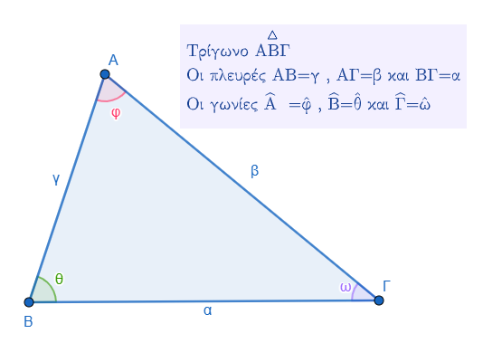
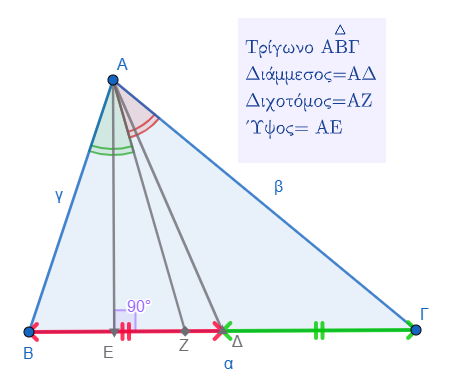
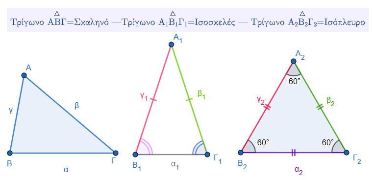
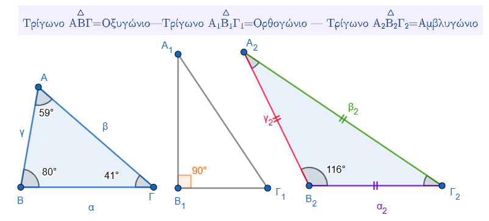

\usepackage{wasysym}

```{=html}
<!-- Φόρτωση βιβλιοθήκης GeoGebra -->
<script src="https://www.geogebra.org/apps/deployggb.js"</script>

<!-- Συνάρτηση δημιουργίας applets -->
<script>
function createGeoGebra(containerId, materialId, width = 700, height = 500) {
  var params = {
    "id": "ggb-" + containerId,
    "material_id": materialId,
    "width": width,
    "height": height,
    "showToolBar": true,
    "showMenuBar": false,
    "showAlgebraInput": true
  };
  
  var applet = new GGBApplet(params, '5.2');
  applet.inject(containerId);
}
</script>
```

------------------------------------------------------------------------

Τα στοιχεία ενός τριγώνου χωρίζονται σε δύο βασικές κατηγορίες: τα κύρια και τα δευτερεύοντα.

### **Κύρια Στοιχεία**

::: {style="background-color: #f0f8cc; border: 2px solid #2f3e50; color: #25188a; padding: 15px; border-radius: 5px;"}
Τα κύρια στοιχεία ενός τριγώνου είναι εκείνα που ορίζουν τη βασική του δομή και είναι τα εξής:

\* **Κορυφές:** Είναι τα τρία σημεία (π.χ. Α, Β, Γ) που ορίζουν το τρίγωνο.

\* **Πλευρές:** Είναι τα ευθύγραμμα τμήματα που ενώνουν τις κορυφές (π.χ. ΑΒ, ΒΓ, ΓΑ).
Συχνά συμβολίζονται και με τα μικρά γράμματα **α, β, γ** ανάλογα με την απέναντι κορυφή.

\* **Γωνίες:** Είναι οι εσωτερικές γωνίες που σχηματίζονται από τις πλευρές του τριγώνου.
Το άθροισμά τους είναι πάντοτε **180°**.
:::



### **Δευτερεύοντα Στοιχεία**

::: {style="background-color: #f0f8cc; border: 2px solid #2f3e50; color: #25188a; padding: 15px; border-radius: 5px;"}
Τα δευτερεύοντα στοιχεία είναι ειδικά ευθύγραμμα τμήματα που βοηθούν στη μελέτη των ιδιοτήτων του τριγώνου και περιλαμβάνουν:

\* **Διάμεσος:** Το ευθύγραμμο τμήμα που **ενώνει μια κορυφή με το μέσο της απέναντι πλευράς**.

\* **Ύψος:** Το ευθύγραμμο τμήμα που φέρεται από μια κορυφή και είναι **κάθετο στην ευθεία της απέναντι πλευράς**.

\* **Διχοτόμος:** Το ευθύγραμμο τμήμα της διχοτόμου μιας γωνίας που ξεκινά από την κορυφή και **καταλήγει στην απέναντι πλευρά**, χωρίζοντας τη γωνία σε δύο ίσα μέρη.

Αξίζει να σημειωθεί ότι σε κάθε τρίγωνο υπάρχουν τρεις διάμεσοι, τρεις διχοτόμοι και τρία ύψη, τα οποία διέρχονται από το ίδιο σημείο για κάθε κατηγορία (βαρύκεντρο, έκκεντρο και ορθόκεντρο αντίστοιχα).
:::



------------------------------------------------------------------------

------------------------------------------------------------------------

### Τα τρίγωνα ταξινομούνται με βάση δύο βασικά κριτήρια: το μήκος των πλευρών τους και το είδος των εσωτερικών τους γωνιών.

::: {style="background-color: #f0f8cc; border: 2px solid #2f3e50; color: #25188a; padding: 15px; border-radius: 5px;"}
**1. Ταξινόμηση με βάση τις πλευρές**

Ανάλογα με τη σχέση μεταξύ των μηκών των πλευρών τους, τα τρίγωνα διακρίνονται σε τρία είδη:

\* **Σκαληνό:** Είναι το τρίγωνο που έχει και τις **τρεις πλευρές του άνισες**.

\* **Ισοσκελές:** Είναι το τρίγωνο που έχει **δύο πλευρές ίσες**.
Στο ισοσκελές τρίγωνο, η πλευρά που δεν είναι ίση με τις άλλες δύο ονομάζεται **βάση** και η απέναντι κορυφή της ονομάζεται **κορυφή** του τριγώνου.

\* **Ισόπλευρο:** Είναι το τρίγωνο που έχει και τις **τρεις πλευρές του ίσες**.
Σε ένα ισόπλευρο τρίγωνο, όλες οι γωνίες του είναι επίσης ίσες και η καθεμία έχει μέτρο **60°**.

**2. Ταξινόμηση με βάση τις γωνίες**

Ανάλογα με το μέτρο των γωνιών τους, τα τρίγωνα κατατάσσονται στις εξής κατηγορίες:

\* **Οξυγώνιο:** Ονομάζεται το τρίγωνο του οποίου **όλες οι γωνίες είναι οξείες**, δηλαδή μικρότερες από 90°.

\* **Ορθογώνιο:** Ονομάζεται το τρίγωνο που έχει **μία γωνία ορθή** (90°).
Οι δύο πλευρές που σχηματίζουν την ορθή γωνία λέγονται **κάθετες πλευρές**, ενώ η πλευρά που βρίσκεται απέναντι από την ορθή γωνία ονομάζεται **υποτείνουσα**.

\* **Αμβλυγώνιο:** Ονομάζεται το τρίγωνο που έχει **μία γωνία αμβλεία**, δηλαδή μεγαλύτερη από 90°.

Αξίζει να σημειωθεί ότι ένα τρίγωνο μπορεί να χαρακτηρίζεται ταυτόχρονα και από τα δύο κριτήρια· για παράδειγμα, ένα τρίγωνο μπορεί να είναι **ορθογώνιο και ισοσκελές** ταυτόχρονα.
:::





------------------------------------------------------------------------

### Το ισοσκελές τρίγωνο, δηλαδή το τρίγωνο που έχει **δύο πλευρές ίσες**, παρουσιάζει τις εξής ειδικές ιδιότητες:

::: {style="background-color: #f0f8cc; border: 2px solid #2f3e50; color: #25188a; padding: 15px; border-radius: 5px;"}
-   **Ισότητα γωνιών:** Οι γωνίες που βρίσκονται απέναντι από τις ίσες πλευρές (οι **προσκείμενες στη βάση γωνίες**) είναι **ίσες** μεταξύ τους. Ως βάση ορίζεται η πλευρά που δεν είναι ίση με τις άλλες δύο.
-   **Σύμπτωση δευτερευόντων στοιχείων:** Στο ισοσκελές τρίγωνο, η **διχοτόμος** της γωνίας της κορυφής είναι ταυτόχρονα **διάμεσος** και **ύψος** προς τη βάση,. Αντίστοιχα, το ύψος ή η διάμεσος που αντιστοιχεί στη βάση λειτουργούν και ως τα υπόλοιπα δύο δευτερεύοντα στοιχεία.
-   **Άξονας συμμετρίας:** Η ευθεία στην οποία ανήκει η διάμεσος που αντιστοιχεί στη βάση αποτελεί **άξονα συμμετρίας** του ισοσκελούς τριγώνου.

Είναι ενδιαφέρον να σημειωθεί ότι αν ένα τρίγωνο έχει δύο γωνίες ίσες, τότε συμπεραίνουμε αυτόματα ότι είναι ισοσκελές.
Επίσης, ένα ισοσκελές τρίγωνο μπορεί ανάλογα με τις γωνίες του να είναι ταυτόχρονα ορθογώνιο, οξυγώνιο ή αμβλυγώνιο.
:::

------------------------------------------------------------------------

## **Ασκήσεις**

### **Α. Συμπλήρωση Κενών & Αντιστοίχιση**

1.  **Συμπληρώστε τα κενά:**
    -   Κάθε ορθογώνιο τρίγωνο έχει μία ............. γωνία.
    -   ............ λέγεται το τρίγωνο που έχει όλες τις πλευρές του άνισες.
    -   Το άθροισμα των γωνιών κάθε τριγώνου είναι ............ μοίρες.
    -   Ύψος τριγώνου λέγεται το κάθετο ευθύγραμμο τμήμα που φέρνουμε από μια ............ στην ............ της απέναντι πλευράς.
2.  **Αντιστοίχιση:** Αντιστοιχίστε το είδος του τριγώνου με την ιδιότητά του:
    -   **Ισόπλευρο:** α) Έχει δύο πλευρές ίσες.
    -   **Ισοσκελές:** β) Έχει όλες τις πλευρές άνισες.
    -   **Σκαληνό:** γ) Έχει όλες τις πλευρές ίσες.

### **Β. Ερωτήσεις Σωστού/Λάθους**

-   ( ) Κάθε τρίγωνο έχει τρεις κορυφές.
-   ( ) Το αμβλυγώνιο τρίγωνο έχει μία μόνο διάμεσο.
-   ( ) Στο ορθογώνιο τρίγωνο όλες οι γωνίες είναι ορθές.
-   ( ) Το ισόπλευρο τρίγωνο είναι πάντα οξυγώνιο.
-   ( ) Ένα σκαληνό τρίγωνο δεν μπορεί να είναι ορθογώνιο.

### **Γ. Υπολογιστικές & Σχεδιαστικές Ασκήσεις**

1.  **Εύρεση γωνίας:** Σε ένα τρίγωνο οι δύο γωνίες είναι 70° και 50°. Βρείτε την τρίτη γωνία.
2.  **Κατάταξη:** Ένα τρίγωνο έχει πλευρές 5 cm, 5 cm και 8 cm. Τι είδους τρίγωνο είναι;
3.  **Σχεδιασμός:** Σχεδιάστε ένα τρίγωνο ΑΒΓ και φέρτε από την κορυφή Α τη διάμεσο ΑΜ και το ύψος ΑΔ. Τι παρατηρείτε αν το τρίγωνο είναι ισοσκελές με βάση τη ΒΓ;
4.  **Υπολογισμός Μήκους:** Σε τρίγωνο ΑΒΓ με πλευρά ΒΓ = 4,4 cm, φέρτε τη διάμεσο ΑΜ. Ποιο είναι το μήκος των τμημάτων ΒΜ και ΜΓ;

### **Ασκήσεις Σχεδιασμού & Παρατήρησης**

-   **Σχεδιασμός Δευτερευόντων Στοιχείων:** Σχεδιάστε ένα τυχαίο τρίγωνο ΑΒΓ. Από την κορυφή Α, φέρτε και ονομάστε τη διάμεσο ΑΜ και το ύψος ΑΔ.
-   **Ισοσκελές Τρίγωνο:** Σχεδιάστε ένα τρίγωνο ΑΒΓ με πλευρά ΒΓ = 3 cm και γωνίες $\hat{B}$ = 45° και $\hat{\Gamma}$ = 45°. Φέρτε τη διάμεσο και το ύψος από την κορυφή Α. **Τι παρατηρείτε** για αυτά τα δύο τμήματα;.
-   **Ορθογώνιο Τρίγωνο:** Σχεδιάστε ένα ορθογώνιο τρίγωνο ΑΒΓ (με ορθή τη γωνία Α) και φέρτε τη διάμεσο ΑΜ προς την υποτείνουσα ΒΓ. Χρησιμοποιήστε έναν διαβήτη για να συγκρίνετε τα τμήματα ΑΜ, ΒΜ και ΓΜ. Τι συμπεραίνετε;.

### **Ερωτήσεις Σωστού ή Λάθους**

Χαρακτηρίστε τις παρακάτω προτάσεις:

\* ( ) Κάθε τρίγωνο έχει τρεις κορυφές.

\* ( ) Υπάρχει τρίγωνο που δεν έχει ύψη.

\* ( ) Το αμβλυγώνιο τρίγωνο έχει μία μόνο διάμεσο.

\* ( ) Στο ορθογώνιο τρίγωνο όλες οι γωνίες είναι ορθές.

\* ( ) Το ύψος τριγώνου είναι πάντα εσωτερικό τμήμα του τριγώνου.

\* ( ) Σε ένα ισόπλευρο τρίγωνο, κάθε διάμεσος είναι ταυτόχρονα ύψος και διχοτόμος.

### **Υπολογιστικές Ασκήσεις**

-   **Μήκη Τμημάτων:** Σε ένα τρίγωνο ΑΒΓ, η πλευρά ΒΓ έχει μήκος 4,4 cm.
    Αν φέρουμε τη διάμεσο ΑΜ, ποιο είναι το μήκος των τμημάτων ΒΜ και ΜΓ;.

-   **Εύρεση Γωνίας:** Σε ένα τρίγωνο, οι δύο γωνίες είναι 60° και 50°.
    Υπολογίστε το μέτρο της τρίτης γωνίας.

### **Συμπλήρωση Κενών**

-   Διάμεσος τριγώνου λέγεται το τμήμα που ενώνει μία ............ με το ............ της απέναντι πλευράς.
-   Ύψος τριγώνου λέγεται το ............ ευθύγραμμο τμήμα που φέρνουμε από μία κορυφή στην ............ της απέναντι πλευράς.
-   Το σημείο στο οποίο τέμνονται τα τρία ύψη ενός τριγώνου ονομάζεται .............

### **Ερωτήσεις Συμπλήρωσης Κενών**

Συμπληρώστε τις παρακάτω προτάσεις για να ελέγξετε τις γνώσεις σας στη θεωρία:

\* Κάθε ορθογώνιο τρίγωνο έχει μία **....................** γωνία.

\* **....................** λέγεται το τρίγωνο που έχει όλες τις πλευρές του άνισες.

\* **....................** είναι το τρίγωνο στο οποίο όλες οι γωνίες είναι οξείες.

\* **Ύψος** τριγώνου λέγεται το **....................** ευθύγραμμο τμήμα που φέρνουμε από μία κορυφή στην **....................** της απέναντι πλευράς.

\* **Διάμεσος** τριγώνου λέγεται το τμήμα που **....................** μία κορυφή με το **....................** της απέναντι πλευράς.

### **Ερωτήσεις Σωστού ή Λάθους**

Χαρακτηρίστε τις παρακάτω προτάσεις με (Σ) αν είναι σωστές ή (Λ) αν είναι λανθασμένες:

\* ( ) Το ισόπλευρο τρίγωνο είναι πάντα οξυγώνιο.

\* ( ) Ένα σκαληνό τρίγωνο δεν μπορεί να είναι ορθογώνιο.

### **Ασκήσεις Υπολογισμού και Κατάταξης**

Εφαρμόστε τις ιδιότητες των τριγώνων για να λύσετε τα παρακάτω:

\* **Εύρεση γωνίας:** Σε ένα τρίγωνο οι δύο γωνίες είναι 52° και 63°.
Υπολογίστε την τρίτη γωνία.
(Υπόδειξη: Το άθροισμα των γωνιών κάθε τριγώνου είναι 180°).

\* **Αναγνώριση είδους:**

1\.
Ένα τρίγωνο έχει πλευρές 5 cm, 5 cm και 8 cm.
Τι είδους είναι ως προς τις πλευρές του;

2\.
Ένα τρίγωνο έχει γωνίες 120°, 30° και 30°.
Τι είδους είναι ως προς τις γωνίες και τις πλευρές του;

\* **Μήκος τμημάτων:** Σε ένα τρίγωνο ΑΒΓ με πλευρά ΒΓ = 5,6 cm, φέρνουμε τη διάμεσο ΑΜ.
Ποιο είναι το μήκος των τμημάτων ΒΜ και ΜΓ;

### **Ασκήσεις Σχεδιασμού και Παρατήρησης**

Χρησιμοποιήστε τα γεωμετρικά σας όργανα (χάρακα, μοιρογνωμόνιο, γνώμονα) για τις παρακάτω κατασκευές:

\* **Σύμπτωση στοιχείων:** Σχεδιάστε ένα τρίγωνο ΑΒΓ με ΒΓ = 3 cm και τις γωνίες Β και Γ ίσες με 45° η καθεμία.
Φέρτε τη διάμεσο και το ύψος από την κορυφή Α.
**Τι παρατηρείτε** για αυτά τα δύο τμήματα;

\* **Ορθογώνιο τρίγωνο:** Σχεδιάστε ένα ορθογώνιο τρίγωνο ΑΒΓ με υποτείνουσα τη ΒΓ.
Φέρτε τη διάμεσο ΑΜ προς την υποτείνουσα και συγκρίνετε με τον διαβήτη τα τμήματα ΑΜ, ΒΜ και ΓΜ.
**Τι συμπεραίνετε** για τα μήκη τους;

\* **Ύψη αμβλυγωνίου:** Σχεδιάστε ένα αμβλυγώνιο τρίγωνο και φέρτε τα τρία ύψη του.
Πόσα από αυτά βρίσκονται **εκτός** του τριγώνου;

### **Ασκήσεις Σχεδιασμού και Υπολογισμού**

-   **Υπολογισμός Μηκών:** Σε ένα τρίγωνο ΑΒΓ, η πλευρά ΒΓ είναι 6,4 cm. Φέρτε τη διάμεσο ΑΜ. Στη συνέχεια, φέρτε τις διαμέσους ΑΚ και ΑΛ των τριγώνων ΑΒΜ και ΑΓΜ αντίστοιχα και βρείτε το μήκος των τμημάτων **ΚΜ** και **ΛΓ**.
-   **Συνδυαστική Κατασκευή:** Σχεδιάστε ένα ορθογώνιο τρίγωνο ΑΒΓ με υποτείνουσα τη ΒΓ. Βρείτε τα μέσα Μ και Ν των κάθετων πλευρών ΑΒ και ΑΓ, ενώστε τα και συγκρίνετε το τμήμα ΜΝ με τη διάμεσο που αντιστοιχεί στην υποτείνουσα. Τι παρατηρείτε;.

### **Ασκήσεις για το Ισοσκελές Τρίγωνο**

-   **Ιδιότητες Γωνιών:** Σε ένα ισοσκελές τρίγωνο ΑΒΓ (ΑΒ=ΑΓ) η γωνία $\hat{A}$ είναι 80°. Έστω Ε ένα τυχαίο σημείο στη βάση ΒΓ. Αν πάρουμε σημεία Δ στην ΑΒ και Ζ στην ΑΓ τέτοια ώστε ΒΔ=ΒΕ και ΓΕ=ΓΖ, υπολογίστε τις γωνίες των τριγώνων ΒΔΕ και ΓΖΕ, καθώς και τη γωνία $\Delta\hat{E}Z$.
-   **Διχοτόμοι:** Σε ισοσκελές τρίγωνο ΑΒΓ (ΑΒ=ΑΓ), φέρτε τις διχοτόμους των γωνιών της βάσης, ΒΔ και ΓΕ. Αν φέρουμε κάθετες από τα Ε και Δ προς τη βάση ΒΓ (τα τμήματα ΕΗ και ΔΖ αντίστοιχα), μετρήστε με το άνοιγμα του διαβήτη ή με υποδεκάμετρο τις πλευρές των τριγώνων ΒΓΔ και ΓΒΕ και εξετάστε αν είναι ίσα, και επίσης τα τμήματα ΕΗ και ΔΖ.

::: {style="background-color: #f0f8cc; border: 2px solid #2f3e50; color: #25188a; padding: 15px; border-radius: 5px;"}
Το **ισόπλευρο τρίγωνο**, δηλαδή το τρίγωνο που έχει και τις **τρεις πλευρές του ίσες**, παρουσιάζει τις εξής βασικές ιδιότητες:

-   **Ισότητα Πλευρών και Γωνιών:** Όλες οι πλευρές του είναι ίσες μεταξύ τους και **όλες οι γωνίες του είναι ίσες**, με την καθεμία να έχει μέτρο **60°**.
-   **Σύμπτωση Δευτερευόντων Στοιχείων:** Σε κάθε κορυφή του ισόπλευρου τριγώνου, **το ύψος, η διάμεσος και η διχοτόμος ταυτίζονται**. Αυτό σημαίνει ότι κάθε διάμεσος είναι ταυτόχρονα ύψος και διχοτόμος, και το ίδιο ισχύει για όλα τα ύψη και τις διχοτόμους του τριγώνου.
-   **Αξονική Συμμετρία:** Το ισόπλευρο τρίγωνο έχει **τρεις άξονες συμμετρίας**, οι οποίοι είναι οι ευθείες (φορείς) των τριών υψών του.
-   **Ειδική Συνθήκη:** Αν σε ένα ισοσκελές τρίγωνο μία οποιαδήποτε γωνία του είναι 60°, τότε το τρίγωνο αυτό είναι απαραίτητα **ισόπλευρο**.
-   **Κέντρο Τριγώνου:** Λόγω της σύμπτωσης των δευτερευόντων στοιχείων, το σημείο τομής τους (που είναι ταυτόχρονα βαρύκεντρο, ορθόκεντρο, έγκεντρο και περίκεντρο) αποτελεί το κέντρο του τριγώνου.

Επιπλέον, σημειώνεται ότι αν ένα τρίγωνο έχει όλες τις γωνίες του ίσες, τότε είναι οπωσδήποτε ισόπλευρο.
:::

::: callout-tip
:::

::: {style="background-color: #f0f8cc; border: 2px solid #2f3e50; color: #25188a; padding: 15px; border-radius: 5px;"}
ΚΑΛΗ ΜΕΛΕΤΗ !
:::
