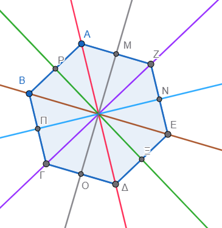
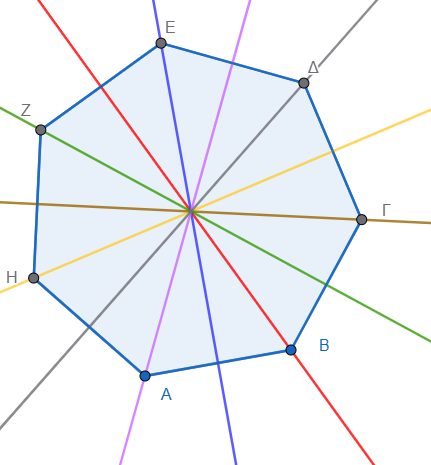

\usepackage{wasysym}

```{=html}
<!-- Φόρτωση βιβλιοθήκης GeoGebra -->
<script src="https://www.geogebra.org/apps/deployggb.js"</script>

<!-- Συνάρτηση δημιουργίας applets -->
<script>
function createGeoGebra(containerId, materialId, width = 700, height = 500) {
  var params = {
    "id": "ggb-" + containerId,
    "material_id": materialId,
    "width": width,
    "height": height,
    "showToolBar": true,
    "showMenuBar": false,
    "showAlgebraInput": true
  };
  
  var applet = new GGBApplet(params, '5.2');
  applet.inject(containerId);
}
</script>
```

------------------------------------------------------------------------


## Άξονας συμμετρίας

### **Άξονας Συμμετρίας Σχήματος**

::: {style="background-color: #c0d4b8; border: 2px solid #2f3e50; color: #25188a; padding: 15px; border-radius: 5px;"}

**Θεωρία – Ορισμοί – Ιδιότητες**

*   **Συμμετρικά σημεία ως προς ευθεία:** Δύο σημεία $M$ και $M'$ ονομάζονται συμμετρικά ως προς μια ευθεία $\chi'\chi$, όταν η ευθεία αυτή είναι η **μεσοκάθετος** του ευθυγράμμου τμήματος $MM'$.

*   **Ορισμός Άξονα Συμμετρίας:** Μια ευθεία λέγεται **άξονας συμμετρίας** ενός σχήματος, όταν το συμμετρικό αυτού του σχήματος ως προς την ευθεία αυτή είναι το ίδιο το σχήμα.

*   **Βασική Ιδιότητα:** Ένα σχήμα που έχει άξονα συμμετρίας, αν διπλωθεί κατά μήκος αυτού του άξονα, τα δύο μέρη του συμπίπτουν ακριβώς (ταυτίζονται).

*   **Γεωμετρικός Μετασχηματισμός:** Η συμμετρία ως προς ευθεία (αξονική συμμετρία) είναι ένας γεωμετρικός μετασχηματισμός που απεικονίζει το επίπεδο στον εαυτό του.

*   **Ισότητα:** Τα δύο σχήματα που είναι συμμετρικά ως προς άξονα είναι **ίσα με αναστροφή**.


:::

---

**Παραδείγματα σχημάτων με άξονες συμμετρίας**

1.  **Η Γωνία:** Έχει έναν μοναδικό άξονα συμμετρίας, τον φορέα της **διχοτόμου** της.
2.  **Ο Κύκλος:** Έχει **άπειρους** άξονες συμμετρίας, οι οποίοι είναι όλες οι ευθείες που διέρχονται από το κέντρο του (οι φορείς των διαμέτρων του).
3.  **Το Ισοσκελές Τρίγωνο:** Έχει έναν άξονα συμμετρίας, τη διχοτόμο της γωνίας της κορυφής του (που συμπίπτει με το ύψος και τη διάμεσο προς τη βάση).
4.  **Το Ορθογώνιο:** Έχει **δύο** άξονες συμμετρίας, τις μεσοπαράλληλες των πλευρών του.
5.  **Το Τετράγωνο:** Έχει **τέσσερις** άξονες συμμετρίας: τους φορείς των δύο διαγωνίων του και τις δύο μεσοπαράλληλες των πλευρών του.

---

**Ασκήσεις**

1.  Σχεδιάστε μια γωνία $60^{\circ}$ και κατασκευάστε τον άξονα συμμετρίας της με κανόνα και διαβήτη.
2.  Ποια από τα κεφαλαία γράμματα του ελληνικού αλφαβήτου (π.χ. Α, Β, Γ, Δ, Ε, Η, Θ, Ι, Κ, Λ, Μ, Ξ, Ο, Π, Σ, Τ, Υ, Φ, Χ, Ψ, Ω) έχουν έναν άξονα και ποια δύο ή περισσότερους;.
3.  Σχεδιάστε ένα **ισόπλευρο τρίγωνο** και χαράξτε όλους τους άξονες συμμετρίας του. Πόσοι είναι;.
4.  Αποδείξτε με δίπλωση χαρτιού ότι η μεσοκάθετος ενός ευθυγράμμου τμήματος είναι άξονας συμμετρίας του.
5.  Σχεδιάστε έναν **ρόμβο** και βρείτε τους άξονες συμμετρίας του. Είναι οι πλευρές του ή οι διαγώνιοί του;.
6.  Κατασκευάστε το συμμετρικό ενός τυχαίου τριγώνου $ΑΒΓ$ ως προς μια ευθεία $(\epsilon)$ που δεν τέμνει το τρίγωνο.
7.  Σχεδιάστε μια **ημιπεριφέρεια** με διάμετρο $ΑΒ$. Ποιος είναι ο άξονας συμμετρίας της;.
8.  Δίνεται ένα **ισοσκελές τραπέζιο**. Προσδιορίστε τον άξονα συμμετρίας του και εξηγήστε γιατί οι διαγώνιοί του είναι ίσες λόγω αυτής της συμμετρίας.
9.  Σχεδιάστε δύο τεμνόμενες ευθείες και βρείτε τους άξονες συμμετρίας του σχήματος που δημιουργούν.
10. Πάρτε μια ευθεία $(\epsilon)$ και ένα σημείο $Α$ πάνω σε αυτήν. Ποιο είναι το συμμετρικό του $Α$ ως προς άξονα την $(\epsilon)$;.


### Ο αριθμός των αξόνων συμμετρίας 
διαφέρει σημαντικά ανάμεσα στα βασικά γεωμετρικά σχήματα, με ορισμένα να έχουν μηδενικούς και άλλα άπειρους άξονες.
Ένας άξονας συμμετρίας είναι μια νοητή γραμμή που χωρίζει ένα σχήμα σε δύο πανομοιότυπα μισά, τα οποία συμπίπτουν αν διπλωθούν κατά μήκος αυτής της γραμμής.

Ακολουθεί ο αριθμός των αξόνων συμμετρίας για τα κυριότερα σχήματα:

#### **Τρίγωνα**

-   **Ισόπλευρο τρίγωνο:** Έχει **3** άξονες συμμετρίας, καθένας από τους οποίους διέρχεται από μια κορυφή και το μέσο της απέναντι πλευράς.
-   **Ισοσκελές τρίγωνο:** Έχει **1** άξονα συμμετρίας, ο οποίος είναι η μεσοκάθετος της βάσης του.
-   **Σκαληνό τρίγωνο:** Έχει **0** άξονες συμμετρίας.

#### **Τετράπλευρα**

-   **Τετράγωνο:** Έχει **4** άξονες συμμετρίας (τις δύο διαγωνίους και τις δύο μεσοκαθέτους των απέναντι πλευρών).
-   **Ορθογώνιο:** Έχει **2** άξονες συμμετρίας, οι οποίοι είναι οι μεσοκάθετοι των απέναντι πλευρών. Σημειώνεται ότι οι διαγώνιοί του δεν αποτελούν άξονες συμμετρίας, εκτός αν το ορθογώνιο είναι τετράγωνο.
-   **Ρόμβος:** Έχει **2** άξονες συμμετρίας, που συμπίπτουν με τις διαγωνίους του.
-   **Παραλληλόγραμμο:** Γενικά έχει **0** άξονες συμμετρίας (αν και διαθέτει κέντρο συμμετρίας).
-   **Ισοσκελές τραπεζιο:** Έχει **1** άξονα συμμετρίας, τη μεσοκάθετο των βάσεών του.
-   **Χαρταετός (Kite):** Έχει **1** άξονα συμμετρίας, τη διαγώνιο που ενώνει τις κορυφές των άνισων πλευρών.

#### **Άλλα Σχήματα**

-   **Κύκλος:** Έχει **άπειρους** άξονες συμμετρίας, καθώς κάθε ευθεία που διέρχεται από το κέντρο του τον χωρίζει σε δύο ίσα μέρη.
-   **Έλλειψη:** Έχει **2** άξονες συμμετρίας, που ταυτίζονται με τον μεγάλο και τον μικρό άξονά της.
-   **Κανονικά Πολύγωνα:** Ένα κανονικό πολύγωνο με $n$ πλευρές έχειπάντα $n$ αξονες συμμετρίας.

Είναι σημαντικό να σημειωθεί ότι στα κανονικά πολύγωνα, αν ο αριθμός των πλευρών είναι περιττός, οι άξονες διέρχονται από τις κορυφές και τα μέσα των απέναντι πλευρών, ενώ αν είναι άρτιος, οι άξονες διέρχονται είτε από απέναντι κορυφές είτε από τα μέσα απέναντι πλευρών.

{width="311"}

{width="292"}


------------------------------------------------------------------------


::: {style="background-color: #f0f8cc; border: 2px solid #2f3e50; color: #25188a; padding: 15px; border-radius: 5px;"}
ΚΑΛΗ ΜΕΛΕΤΗ !
:::
