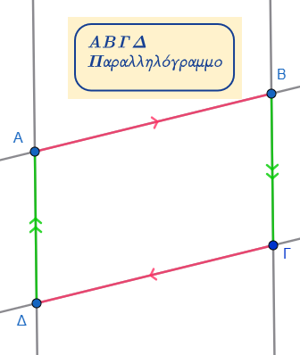
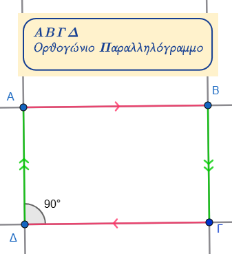
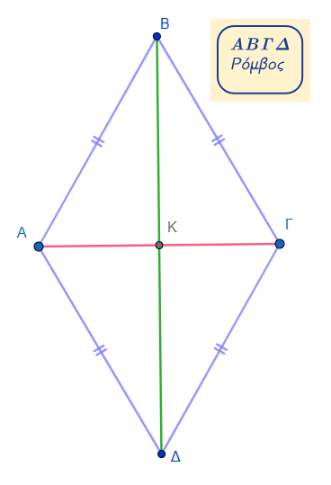
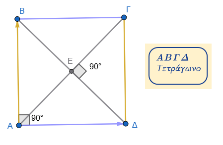
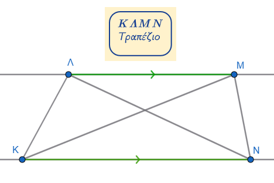
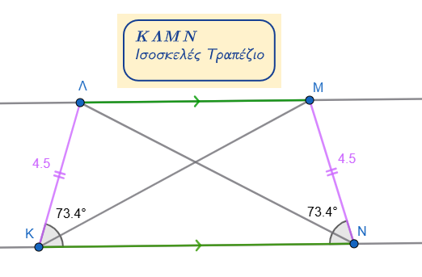

\usepackage{wasysym}

```{=html}
<!-- Φόρτωση βιβλιοθήκης GeoGebra -->
<script src="https://www.geogebra.org/apps/deployggb.js"</script>

<!-- Συνάρτηση δημιουργίας applets -->
<script>
function createGeoGebra(containerId, materialId, width = 700, height = 500) {
  var params = {
    "id": "ggb-" + containerId,
    "material_id": materialId,
    "width": width,
    "height": height,
    "showToolBar": true,
    "showMenuBar": false,
    "showAlgebraInput": true
  };
  
  var applet = new GGBApplet(params, '5.2');
  applet.inject(containerId);
}
</script>
```

------------------------------------------------------------------------

## Ακολουθούν οι ορισμοί των βασικών γεωμετρικών σχημάτων:

::: {style="background-color: #f0f8cc; border: 2px solid #2f3e50; color: #25188a; padding: 15px; border-radius: 5px;"}
-   **Παραλληλόγραμμο:** Ονομάζεται το τετράπλευρο που έχει τις **απέναντι πλευρές του παράλληλες**.
:::

::: callout-note
Σε όλα τα σχήματα που έχουμε παράλληλες που τέμνονται από άλλες ευθείες ισχύουν αυτά που γνωρίζουμε από την αντίστοιχη θεωρία και άρα μπορούν να χρησιμοποιηθούν για υπολογισμους γωνιών , για παράδειγμα **"οι εντός εναλλάξ γωνίες είναι ίσες"** κτλπ
:::



::: {style="background-color: #f0f8cc; border: 2px solid #2f3e50; color: #25188a; padding: 15px; border-radius: 5px;"}
-   **Ορθογώνιο (ή ορθογώνιο παραλληλόγραμμο):** Είναι το παραλληλόγραμμο το οποίο έχει **μία γωνία ορθή**. Λόγω της ιδιότητας του παραλληλογράμμου, προκύπτει ότι στην περίπτωση αυτή όλες οι γωνίες του είναι ορθές.
:::



::: {style="background-color: #f0f8cc; border: 2px solid #2f3e50; color: #25188a; padding: 15px; border-radius: 5px;"}
-   **Ρόμβος:** Είναι το παραλληλόγραμμο που έχει **δύο διαδοχικές πλευρές ίσες**. Επειδή είναι παραλληλόγραμμο, αυτό συνεπάγεται ότι όλες οι πλευρές του είναι ίσες μεταξύ τους.
:::



::: {style="background-color: #f0f8cc; border: 2px solid #2f3e50; color: #25188a; padding: 15px; border-radius: 5px;"}
-   **Τετράγωνο:** Ονομάζεται το παραλληλόγραμμο που είναι **ταυτόχρονα ορθογώνιο και ρόμβος**. Έχει, δηλαδή, όλες τις γωνίες του ορθές και όλες τις πλευρές του ίσες.
:::



::: {style="background-color: #f0f8cc; border: 2px solid #2f3e50; color: #25188a; padding: 15px; border-radius: 5px;"}
-   **Τραπέζιο:** Είναι το κυρτό τετράπλευρο που έχει **μόνο δύο πλευρές παράλληλες**. Οι παράλληλες πλευρές του ονομάζονται **βάσεις**, ενώ η απόστασή τους ονομάζεται **ύψος** του τραπεζίου.
:::



::: {style="background-color: #f0f8cc; border: 2px solid #2f3e50; color: #25188a; padding: 15px; border-radius: 5px;"}
-   **Ισοσκελές τραπέζιο:** Ονομάζεται το τραπέζιο του οποίου οι **μη παράλληλες πλευρές είναι ίσες**. Στο σχήμα αυτό, οι προσκείμενες σε κάθε βάση γωνίες είναι ίσες και οι διαγώνιοί του είναι επίσης ίσες.
:::



## Οι ιδιότητες και τα χαρακτηριστικά των βασικών γεωμετρικών σχημάτων:

### **1. Παραλληλόγραμμο**

Το παραλληλόγραμμο είναι το τετράπλευρο που έχει τις **απέναντι πλευρές του παράλληλες**.

\* **Πλευρές:** Οι απέναντι πλευρές του είναι **ίσες**.

\* **Γωνίες:** Οι απέναντι γωνίες του είναι **ίσες** και οι διαδοχικές γωνίες είναι **παραπληρωματικές** (άθροισμα 180°).

\* **Διαγώνιοι:** Οι διαγώνιοί του **διχοτομούνται** (το σημείο τομής τους είναι το μέσο καθεμιάς).

\* **Συμμετρία:** Το σημείο τομής των διαγωνίων είναι το **κέντρο συμμετρίας** του παραλληλογράμμου.

::: callout-note
Εξετάστε και δικαιολογήστε τις παραπάνω ιδιότητες
:::

### **2. Ορθογώνιο (ή Ορθογώνιο Παραλληλόγραμμο)**

Είναι το παραλληλόγραμμο που έχει **μία γωνία ορθή** (90°).

\* **Γωνίες:** Όλες οι γωνίες του είναι **ορθές**.

\* **Διαγώνιοι:** Εκτός από το ότι διχοτομούνται, οι διαγώνιοι ενός ορθογωνίου είναι **ίσες** μεταξύ τους.

\* **Συμμετρία:** Έχει δύο **άξονες συμμετρίας**, οι οποίοι είναι οι μεσοκάθετοι των πλευρών του.
Το σημείο τομής των διαγωνίων είναι το κέντρο συμμετρίας του.

::: callout-note
Εξετάστε και δικαιολογήστε τις παραπάνω ιδιότητες
:::

### **3. Ρόμβος**

Είναι το παραλληλόγραμμο που έχει **δύο διαδοχικές πλευρές ίσες**.

\* **Πλευρές:** Όλες οι πλευρές του ρόμβου είναι **ίσες** μεταξύ τους.

\* **Διαγώνιοι:** Οι διαγώνιοι του ρόμβου **τέμνονται κάθετα** και **διχοτομούν τις γωνίες** του.

\* **Συμμετρία:** Οι φορείς των διαγωνίων του είναι **άξονες συμμετρίας**.
Το σημείο τομής των διαγωνίων είναι το κέντρο συμμετρίας του.

::: callout-note
Εξετάστε και δικαιολογήστε τις παραπάνω ιδιότητες
:::

### **4. Τετράγωνο**

Το τετράγωνο είναι παραλληλόγραμμο που είναι **ταυτόχρονα ορθογώνιο και ρόμβος**.

\* **Χαρακτηριστικά:** Συνδυάζει όλες τις ιδιότητες των προηγουμένων: έχει όλες τις πλευρές ίσες και όλες τις γωνίες ορθές.

\* **Διαγώνιοι:** Είναι **ίσες, κάθετες, διχοτομούνται** και **διχοτομούν τις γωνίες** του τετραγώνου (σχηματίζοντας γωνίες 45°).

\* **Συμμετρία:** Έχει **τέσσερις άξονες συμμετρίας**: τις δύο διαγωνίους και τις δύο μεσοκαθέτους των πλευρών του.
Το σημείο τομής των διαγωνίων είναι το κέντρο συμμετρίας του.

::: callout-note
Εξετάστε και δικαιολογήστε τις παραπάνω ιδιότητες
:::

### **5. Τραπέζιο**

Είναι το κυρτό τετράπλευρο που έχει **μόνο δύο πλευρές παράλληλες**.

\* **Βάσεις & Ύψος:** Οι παράλληλες πλευρές ονομάζονται **βάσεις**, ενώ η απόστασή τους ονομάζεται **ύψος**.
::: callout-note Σχεδιάστε ένα τραπέζιο και το ύψος του.
:::

\* **Διάμεσος:** Το τμήμα που ενώνει τα μέσα των μη παράλληλων πλευρών ονομάζεται **διάμεσος** του τραπεζίου.
Είναι παράλληλη προς τις βάσεις και ίση με το **ημιάθροισμά** τους ($ΣΤ = \frac{ΛΜ + ΚΝ}{2}$), Σ μέσο της ΚΛ και Τ μέσο της ΜΝ.

::: callout-note
Σχεδιάστε το τραπέζιο και την διαμεσό του και διαπιστώστε οτι ισχύει η παραπάνω ιδιότητα.
:::

\* **Διαγώνιοι:** Το τμήμα που ενώνει τα μέσα των διαγωνίων βρίσκεται πάνω στη διάμεσο και είναι ίσο με την **ημιδιαφορά** των βάσεων.

### **6. Ισοσκελές Τραπέζιο**

Είναι το τραπέζιο του οποίου οι **μη παράλληλες πλευρές είναι ίσες**.

\* **Γωνίες:** Οι γωνίες που πρόσκεινται σε οποιαδήποτε από τις δύο βάσεις είναι **ίσες**.

\* **Διαγώνιοι:** Οι διαγώνιοί του είναι **ίσες** μεταξύ τους.

::: callout-note
Εξετάστε και δικαιολογήστε την παραπάνω ιδιότητα.
(Χρησιμοποιήστε διαβήτη , υποδεκάμετρο)
:::

\* **Συμμετρία:** Έχει **έναν άξονα συμμετρίας**, ο οποίος είναι η ευθεία που διέρχεται από τα μέσα των βάσεών του (η κοινή μεσοκάθετος των βάσεων).

## **Β. Ασκήσεις**

#### **Ερωτήσεις Κατανόησης & Θεωρίας**

1.  **(Σωστό/Λάθος):**

α) Ένα τετράγωνο είναι ρόμβος,

β) Ένας ρόμβος είναι τετράγωνο,

γ) Κάθε διαγώνιος ρόμβου τον χωρίζει σε δύο ισόπλευρα τρίγωνα.

2.  **Συμπλήρωση Κενών:**

α) Το παραλληλόγραμμο με ίσες διαγώνιους λέγεται \_\_\_\_\_\_\_,

β) Οι διαγώνιοι του τετραγώνου είναι μεταξύ τους \_\_\_\_\_\_\_ και \_\_\_\_\_\_\_.

#### **Ασκήσεις Υπολογισμού & Εφαρμογής Ιδιοτήτων**

3.  **Γωνίες Παραλληλογράμμου:** Σε παραλληλόγραμμο $ΑΒΓΔ$, η γωνία $Α$ είναι $120^\circ$.
    Υπολογίστε όλες τις υπόλοιπες γωνίες του σχήματος.

4.  **Γωνίες Ισοσκελούς Τραπεζίου:** Σε ισοσκελές τραπέζιο η γωνία $Β$ είναι διπλάσια από τη γωνία $\Gamma$.
    Υπολογίστε και τις τέσσερις γωνίες του τραπεζίου.

5.  **Ύψη Ρόμβου:** Δείξτε με χρήση διαβήτη ή διαφανούς χαρτιού ότι τα δύο ύψη ενός ρόμβου που ξεκινούν από την ίδια κορυφή είναι ίσια μεταξύ τους.

6.  **Περίμετρος Τραπεζίου:** Δίνεται τραπέζιο με βάσεις $4$ και $6$.
    Αν η διάμεσος $MN$ συνδέει τα μέσα των μη παράλληλων πλευρών, υπολογίστε το μήκος της.

7.  **Διαγώνιοι Τετραγώνου:** Σε τετράγωνο $ΑΒΓΔ$, φέρνουμε τις διαγωνίους που τέμνονται στο $Ο$.
    Δείξτε ότι τα τέσσερα τρίγωνα που σχηματίζονται είναι ορθογώνια και ισοσκελή.

#### **Αποδεικτικές Ασκήσεις (Τράπεζα Θεμάτων)**

8.  **Απόδειξη Ορθογωνίου:** Δείξτε ότι αν οι διαγώνιοι ενός παραλληλογράμμου είναι ίσες, τότε το σχήμα είναι ορθογώνιο.

9.  **Σχηματισμός Ρόμβου:** Δείξτε ότι το τετράπλευρο που σχηματίζεται ενώνοντας τα μέσα των πλευρών ενός ορθογωνίου είναι ρόμβος.

10. **Διχοτόμοι Παραλληλογράμμου:** Αποδείξτε ότι οι διχοτόμοι των γωνιών ενός παραλληλογράμμου, όταν τέμνονται, σχηματίζουν ένα ορθογώνιο.

11. **Ισοσκελές Τραπέζιο & Τρίγωνα:** Σε ισοσκελές τραπέζιο με τρεις πλευρές ίσες, αποδείξτε ότι σχηματίζονται τέσσερα ισοσκελή τρίγωνα όταν φέρουμε τις διαγωνίους.

12. **Κριτήριο Τετραγώνου:** Δίνεται παραλληλόγραμμο με γωνία $45^\circ$.
    Από το μέσο μιας πλευράς φέρνουμε κάθετη.
    Αποδείξτε υπό ποιες συνθήκες το νέο σχήμα που προκύπτει είναι τετράγωνο.

13. Σχεδίασε ένα παραλληλόγραμμο και από τις κορυφές του σχεδίασε παράλληλες ευθείες προς τις διαγωνίους του.
    Τι σχήμα δημιουργείτε από τις τομές αυτών των παραλήλων; Δικαιολογήστε την απάντησή σας

14. Σχεδίασε τις διχοτόμους των γωνιών ενός παραλληλογράμμου.
    τι σχήμα δημιουργείτε; εξηγείστε γιατί.

15. Παραλληλόγραμμο (Γωνίες) Σε ένα παραλληλόγραμμο $ABCD$, η γωνία $\hat{A}$ είναι $70^{\circ}$.
    Βρείτε τις υπόλοιπες γωνίες $\hat{B}$, $\hat{\Gamma}$ και $\hat{\Delta}$.

**Σκέψη:** Στο παραλληλόγραμμο, οι απέναντι γωνίες είναι ίσες και οι διαδοχικές γωνίες έχουν άθροισμα $180^{\circ}$.

16. Ορθογώνιο (Διαγώνιοι) Σε ένα ορθογώνιο $ABΓΔ$, οι διαγώνιοι $AΓ$ και $BΔ$ τέμνονται στο σημείο $O$. Αν η διαγώνιος $AΓ$ είναι $10 \text{ cm}$, πόσο είναι το μήκος του τμήματος $OB$;

**Σκέψη:** Στο ορθογώνιο, οι διαγώνιοι είναι ίσες και διχοτομούνται (κόβονται στη μέση).

\* Αφού $AΓ = 10 \text{ cm}$, τότε ........

17. Ρόμβος (Πλευρές) Ένας ρόμβος έχει περίμετρο $32 \text{ cm}$. Πόσο μήκος έχει η κάθε πλευρά του;

**Σκέψη:** Ο ρόμβος έχει όλες τις πλευρές του ίσες (σαν το τετράγωνο).

\* Πλευρά $= \text{Περίμετρος} : 4$ =..............................
=..............

\* ..........

18. Τετράγωνο (Γωνίες Διαγωνίων) Σχεδιάζουμε τις διαγωνίους ενός τετραγώνου. Με τι γωνία τέμνονται μεταξύ τους;

**Σκέψη:** Το τετράγωνο είναι και ρόμβος.
Μία από τις ιδιότητες του ρόμβου (και του τετραγώνου) είναι ................
άρα

\* Η γωνία τομής είναι .......................

19. Ισοσκελές Τραπέζιο (Γωνίες Βάσης) Σε ένα ισοσκελές τραπέζιο $ABΓΔ$ (με $AB$ παράλληλη στη $\Gamma\Delta$), η γωνία $\hat{\Gamma}$ στη μεγάλη βάση είναι $60^{\circ}$. Πόσο είναι η γωνία $\hat{\Delta}$;

**Σκέψη:** Στο ισοσκελές τραπέζιο, οι γωνίες που βρίσκονται στην ίδια βάση είναι ................

\* $\hat{\Delta} = .................$

20. Παραλληλόγραμμο (Πλευρές) Σε ένα παραλληλόγραμμο $ABΓΔ$, η πλευρά $AB$ είναι $8 \text{ cm}$ και η $BΓ$ είναι $5 \text{ cm}$. Πόση είναι η περίμετρος;

**Σκέψη:** Οι απέναντι πλευρές είναι ίσες.
Άρα $AB = ................$ και $BC = ..............$.

\* $\text{Περίμετρος} = .....................{ cm}$

21. Ρόμβος (Διαγώνιοι και Γωνίες) Αν μία διαγώνιος ενός ρόμβου σχηματίζει με μία πλευρά του γωνία $30^{\circ}$, πόσο είναι ολόκληρη η γωνία του ρόμβου;

**Σκέψη:** Στο ρόμβο, οι διαγώνιοι είναι διχοτόμοι των γωνιών του .

\* Ολόκληρη η γωνία $= .............................$

22. Τραπέζιο (Άθροισμα Γωνιών) Σε ένα τραπέζιο $ABΓΔ$, οι γωνίες $\hat{A}$ και $\hat{\Delta}$ βρίσκονται στις πλευρές που δεν είναι παράλληλες. Αν $\hat{A} = 120^{\circ}$, πόσο είναι η $\hat{\Delta}$;

**Σκέψη:** Σε κάθε τραπέζιο, οι γωνίες που πρόσκεινται σε μία μη παράλληλη πλευρά έχουν άθροισμα $180^{\circ}$.

\* άρα $\hat{\Delta} = .............................$

23. Τετράγωνο (Εμβαδόν και Πλευρά) Αν ένα τετράγωνο έχει πλευρά $6 \text{ cm}$, πόση είναι η περίμετρος και πόσο το εμβαδόν του;

**Σκέψη:** \* $\text{Περίμετρος} = 4 \times \text{πλευρά} =       ...............$

\* $\text{Εμβαδόν} = \text{πλευρά} \times \text{πλευρά} =$...................................${cm}^2$

24. Ορθογώνιο (Ιδιότητες) Ποιες από τις παρακάτω προτάσεις είναι σωστές για ένα ορθογώνιο;
    - Οι διαγώνιοι είναι κάθετες.
    - Όλες οι γωνίες είναι $90^{\circ}$.
    - Οι απέναντι πλευρές είναι παράλληλες.

**Σκέψη:** 
1........... (αυτό ισχύει στο ρόμβο και το τετράγωνο).

2. ............

3........... (αφού το ορθογώνιο είναι ένα είδος παραλληλογράμμου).

::: callout-tip
### Μελέτησε αυτόν τον πίνακα για βοήθεια:

| Σχήμα | Πλευρές | Γωνίες | Διαγώνιοι |
|:-----------------|:-----------------|:-----------------|:-----------------|
| **Παραλληλόγραμμο** | Απέναντι ίσες & παράλληλες | Απέναντι ίσες | Διχοτομούνται |
| **Ορθογώνιο** | Απέναντι ίσες & παράλληλες | Όλες $90^{\circ}$ | Ίσες & Διχοτομούνται |
| **Ρόμβος** | Όλες ίσες | Απέναντι ίσες | Κάθετες & Διχοτόμοι των γωνιών |
| **Τετράγωνο** | Όλες ίσες | Όλες $90^{\circ}$ | Ίσες, Κάθετες & Διχοτόμοι |
| **Ισοσκελές Τραπέζιο** | Μη παράλληλες πλευρές ίσες | Γωνίες βάσης ίσες | Ίσες |
:::

::: callout-tip
:::

::: {style="background-color: #f0f8cc; border: 2px solid #2f3e50; color: #25188a; padding: 15px; border-radius: 5px;"}
ΚΑΛΗ ΜΕΛΕΤΗ !
:::
