\usepackage{wasysym}

```{=html}
<!-- Φόρτωση βιβλιοθήκης GeoGebra -->
<script src="https://www.geogebra.org/apps/deployggb.js"</script>

<!-- Συνάρτηση δημιουργίας applets -->
<script>
function createGeoGebra(containerId, materialId, width = 700, height = 500) {
  var params = {
    "id": "ggb-" + containerId,
    "material_id": materialId,
    "width": width,
    "height": height,
    "showToolBar": true,
    "showMenuBar": false,
    "showAlgebraInput": true
  };
  
  var applet = new GGBApplet(params, '5.2');
  applet.inject(containerId);
}
</script>
```

------------------------------------------------------------------------

## Mεσοκάθετος ευθυγράμμου τμήματος


### **Χάραξη μεσοκαθέτου με βαθμολογημένο κανόνα και γνώμονα**

::: {style="background-color: #c0d4b8; border: 2px solid #2f3e50; color: #25188a; padding: 15px; border-radius: 5px;"}

**Θεωρία – Ορισμοί – Ιδιότητες**

*   **Μέσον ευθυγράμμου τμήματος:** Είναι το σημείο (ένα και μοναδικό) που διαιρεί το τμήμα σε δύο ίσα μέρη.

*   **Μεσοκάθετος:** Ονομάζεται η ευθεία που είναι **κάθετη** στο ευθύγραμμο τμήμα στο **μέσον** του.

*   **Κάθετες ευθείες:** Δύο ευθείες που τέμνονται σχηματίζοντας τέσσερις ίσες (ορθές) γωνίες.

*   **Διαδικασία χάραξης:** 
    1. Χρησιμοποιούμε τον βαθμολογημένο κανόνα (υποδεκάμετρο) για να μετρήσουμε το μήκος του τμήματος και να σημειώσουμε το μέσον του διαιρώντας το μήκος δια 2.
    2. Τοποθετούμε τη μία κάθετη πλευρά του γνώμονα (ορθογώνιο τρίγωνο) πάνω στο τμήμα, ώστε η κορυφή της ορθής γωνίας να συμπίπτει με το μέσον.
    3. Χαράσσουμε την κάθετη γραμμή κατά μήκος της άλλης πλευράς του γνώμονα.


:::

**5 Παραδείγματα**

1. Τμήμα $ΑΒ = 8\text{ cm}$. Σημειώνουμε το μέσον $Μ$ στα $4\text{ cm}$ και φέρουμε την κάθετη με τον γνώμονα.
2. Σε ένα ορθογώνιο, οι μεσοκάθετοι των πλευρών είναι οι άξονες συμμετρίας του.
3. Η απόσταση ενός σημείου $Ο$ από μια ευθεία βρίσκεται φέροντας την κάθετο με τον γνώμονα.
4. Το ύψος ενός ισοσκελούς τριγώνου συμπίπτει με τη μεσοκάθετο της βάσης του.
5. Κατασκευή τετραγώνου πλευράς $5\text{ cm}$ χρησιμοποιώντας τον γνώμονα για τις γωνίες.

**Ασκήσεις**

1. Σχεδιάστε τμήμα $ΑΒ = 6\text{ cm}$ και βρείτε το μέσον του $Μ$ με τον χάρακα. Χαράξτε τη μεσοκάθετο με τον γνώμονα.
2. Σχεδιάστε ένα ορθογώνιο τρίγωνο και χαράξτε τις μεσοκαθέτους των κάθετων πλευρών του με τον γνώμονα.
3. Πάρτε τρία σημεία $Α, Β, Γ$ σε μια ευθεία ($ΑΒ=4\text{ cm}, ΒΓ=2\text{ cm}$) και χαράξτε τις μεσοκαθέτους των $ΑΒ$ και $ΒΓ$.
4. Σχεδιάστε μια ευθεία $xy$ και ένα σημείο $Α$ πάνω της. Χαράξτε την κάθετη στο $Α$ με τον γνώμονα.
5. Σχεδιάστε κύκλο και μια διάμετρο. Χαράξτε με τον γνώμονα τη μεσοκάθετο της διαμέτρου. Τι παρατηρείτε;.
6. Βρείτε το μέσο μιας σελίδας χαρτιού μετρώντας τις πλευρές και χαράξτε τους άξονες συμμετρίας με τον γνώμονα.
7. Σχεδιάστε τμήμα $12\text{ cm}$ και χωρίστε το σε 4 ίσα μέρη χρησιμοποιώντας διαδοχικά τον χάρακα και τον γνώμονα.
8. Σχεδιάστε δύο παράλληλες ευθείες και χαράξτε μια κοινή μεσοκάθετο σε αυτές.
9. Σε ένα ισοσκελές τρίγωνο με βάση $4\text{ cm}$, χαράξτε το ύψος με τον γνώμονα και επαληθεύστε ότι είναι μεσοκάθετος.
10. Σχεδιάστε ένα τμήμα $ΑΒ$ και πάρτε ένα σημείο $Γ$ εκτός αυτού. Χαράξτε την κάθετο από το $Γ$ προς την $ΑΒ$.

---

### **Χαρακτηριστική ιδιότητα της μεσοκαθέτου**

::: {style="background-color: #c0d4b8; border: 2px solid #2f3e50; color: #25188a; padding: 15px; border-radius: 5px;"}

**Θεωρία – Ορισμοί – Ιδιότητες**

*   **Χαρακτηριστική Ιδιότητα:** Κάθε σημείο της μεσοκαθέτου ενός ευθυγράμμου τμήματος **ισαπέχει** από τα άκρα του τμήματος.

*   **Αντίστροφη Ιδιότητα:** Κάθε σημείο που ισαπέχει από τα άκρα ενός τμήματος ανήκει υποχρεωτικά στη μεσοκάθετό του.

*   **Γεωμετρικός Τόπος:** Η μεσοκάθετος είναι ο γεωμετρικός τόπος των σημείων του επιπέδου που έχουν την ιδιότητα να ισαπέχουν από δύο σταθερά σημεία.

*   **Άξονας Συμμετρίας:** Η μεσοκάθετος είναι ο άξονας συμμετρίας του τμήματος.

:::


**Παραδείγματα**

1. Αν $Μ$ είναι σημείο της μεσοκαθέτου του $ΑΒ$, τότε $ΜΑ = ΜΒ$.
2. Το κέντρο ενός κύκλου ισαπέχει από οποιαδήποτε δύο σημεία της περιφέρειας, άρα ανήκει στη μεσοκάθετο της χορδής που ορίζουν.
3. Η κορυφή ισοσκελούς τριγώνου ανήκει στη μεσοκάθετο της βάσης του.
4. Το σημείο τομής των μεσοκαθέτων ενός τριγώνου (περίκεντρο) ισαπέχει από τις τρεις κορυφές.
5. Δύο σημεία $Α$ και $Α'$ είναι συμμετρικά ως προς ευθεία $xy$, όταν η $xy$ είναι η μεσοκάθετος του $ΑΑ'$.

**Ασκήσεις**

1. Πάρτε ένα σημείο $Σ$ στη μεσοκάθετο του $ΑΒ$ και αποδείξτε με τον διαβήτη ότι $ΣΑ = ΣΒ$.
2. Βρείτε τον γεωμετρικό τόπο των σημείων που ισαπέχουν από δύο χωριά $Α$ και $Β$.
3. Αν ένα σημείο $Π$ απέχει $5\text{ cm}$ από το $Α$ και $5\text{ cm}$ από το $Β$, πού βρίσκεται το $Π$ σε σχέση με το $ΑΒ$;.
4. Αποδείξτε ότι η διάμετρος ενός κύκλου που είναι κάθετη σε μια χορδή, τη διχοτομεί.
5. Σχεδιάστε ένα τρίγωνο και βρείτε το σημείο που ισαπέχει από τις τρεις κορυφές του.
6. Σε ένα παραλληλόγραμμο $ΑΒΓΔ$, πάρτε ένα σημείο $Μ$ που να ισαπέχει από τα $Α$ και $Β$. Πάνω σε ποια γραμμή κινείται το $Μ$;
7. Δείξτε ότι αν οι διαγώνιοι ενός τετραπλεύρου είναι μεσοκάθετες μεταξύ τους, τότε το σχήμα είναι ρόμβος.
8. Πάρτε ένα τμήμα $ΑΒ$ και βρείτε τρία σημεία που να ισαπέχουν από τα άκρα του. Είναι συνευθειακά;
9. Χαράξτε μια γωνία και τη διχοτόμο της. Πάρτε ένα σημείο στη διχοτόμο και δείξτε ότι ισαπέχει από τις πλευρές (σχετική ιδιότητα).
10. Εξηγήστε γιατί η μεσοκάθετος της βάσης ενός ισοσκελούς τραπεζίου είναι άξονας συμμετρίας του.

---

### **Χάραξη μεσοκαθέτου με κανόνα και διαβήτη**

::: {style="background-color: #c0d4b8; border: 2px solid #2f3e50; color: #25188a; padding: 15px; border-radius: 5px;"}

#### **Θεωρία – Ορισμοί – Ιδιότητες**

*   **Αρχή κατασκευής:** Βασίζεται στην εύρεση δύο σημείων που ισαπέχουν από τα άκρα του τμήματος.

*   **Διαδικασία:**
    
    1.  **Σχεδίαση κύκλων:** Με τη βοήθεια του διαβήτη, γράφουμε **δύο κύκλους** (ή τόξα) που έχουν κέντρα τα άκρα του τμήματος, δηλαδή τα σημεία **Α και Β**, και την **ίδια ακτίνα ρ**.

2.  **Επιλογή ακτίνας:** Η ακτίνα ρ πρέπει απαραίτητα να είναι **μεγαλύτερη από το μισό του μήκους του τμήματος ΑΒ**, ώστε οι δύο κύκλοι να τέμνονται σε δύο σημεία.
    Μια συνηθισμένη πρακτική είναι να χρησιμοποιείται ακτίνα ίση με το ίδιο το τμήμα ΑΒ.

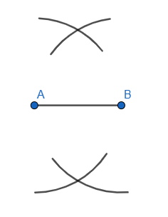

3.  **Εύρεση σημείων τομής:** Εντοπίζουμε τα **δύο σημεία τομής** των δύο κύκλων, έστω Γ και Δ.

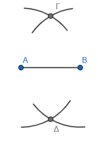

4.  **Χάραξη ευθείας:** Χρησιμοποιώντας τον κανόνα (αβαθμολόγητο χάρακα), σχεδιάζουμε την **ευθεία που διέρχεται από τα σημεία Γ και Δ**.

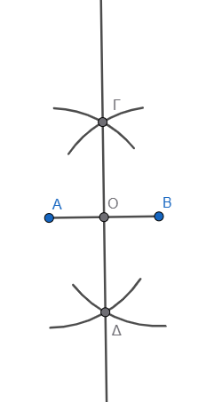

Η ευθεία αυτή είναι η **μεσοκάθετος** του τμήματος ΑΒ.
Μέσω αυτής της διαδικασίας μπορούμε επίσης να προσδιορίσουμε με απόλυτη ακρίβεια το **μέσο** του ευθυγράμμου τμήματος, το οποίο είναι το σημείο τομής της μεσοκαθέτου με το τμήμα.
Η κατασκευή βασίζεται στο γεγονός ότι τα σημεία τομής των δύο ίσων κύκλων **ισαπέχουν από τα άκρα Α και Β**, οπότε αναγκαστικά ανήκουν στη μεσοκάθετο του τμήματος.


*   **Προσδιορισμός μέσου:** Το σημείο τομής της μεσοκαθέτου με το τμήμα είναι το μέσον του.

:::

**Παραδείγματα**

1. Χάραξη μεσοκαθέτου χορδής κύκλου για την εύρεση του μέσου του τόξου.
2. Κατασκευή της κάθετης σε σημείο ευθείας μετατρέποντας το σημείο σε μέσο ενός βοηθητικού τμήματος.
3. Κατασκευή ορθής γωνίας μέσω της μεσοκαθέτου.
4. Εύρεση του κέντρου ενός κύκλου ως τομή δύο μεσοκαθέτων χορδών.
5. Κατασκευή ισοσκελούς τριγώνου με βάση $5\text{ cm}$ και ύψος $4\text{ cm}$.

**Ασκήσεις**

1. Χαράξτε ένα τμήμα $ΑΒ = 5\text{ cm}$ και κατασκευάστε τη μεσοκάθετό του με τον διαβήτη.
2. Χρησιμοποιήστε τον διαβήτη για να βρείτε το μέσο μιας χορδής σε έναν κύκλο.
3. Κατασκευάστε την κάθετη σε μια ευθεία από ένα σημείο που βρίσκεται πάνω σε αυτήν χρησιμοποιώντας μόνο κανόνα και διαβήτη.
4. Κατασκευάστε την κάθετη σε μια ευθεία από ένα σημείο εκτός αυτής με τον διαβήτη.
5. Σχεδιάστε ένα τμήμα $ΑΒ = 7\text{ cm}$ και βρείτε το σημείο $Μ$ έτσι ώστε $ΑΜ = \frac{1}{4} ΑΒ$ με διαδοχικές μεσοκαθέτους.
6. Κατασκευάστε ισόπλευρο τρίγωνο και χαράξτε τις τρεις μεσοκαθέτους του με τον διαβήτη. Πού τέμνονται;.
7. Σχεδιάστε μια γωνία και βρείτε τη διχοτόμο της χρησιμοποιώντας την κατασκευή της μεσοκαθέτου σε μια χορδή της.
8. Κατασκευάστε ένα τμήμα $10\text{ cm}$ και χωρίστε το σε δύο ίσα μέρη χωρίς να χρησιμοποιήσετε τη βαθμολογία του χάρακα.
9. Σχεδιάστε δύο κύκλους που τέμνονται και αποδείξτε ότι η διάκεντρος είναι μεσοκάθετος της κοινής χορδής.
10. Κατασκευάστε τη μεσοκάθετο ενός τμήματος $ΑΒ$ και πάρτε πάνω της ένα σημείο $Γ$ που να απέχει από το $Α$ απόσταση ίση με το $ΑΒ$. Τι τρίγωνο είναι το $ΑΒΓ$;.


### **Σημασία στη Γεωμετρία**

- **Στο Τρίγωνο:** Οι τρεις μεσοκάθετοι των πλευρών ενός τριγώνου διέρχονται από το ίδιο σημείο, το οποίο ονομάζεται **περίκεντρο** και είναι το κέντρο του περιγεγραμμένου κύκλου του τριγώνου.
- **Συμμετρία Σημείων:** Αν δύο σημεία Α και Β είναι συμμετρικά ως προς μια ευθεία ε, τότε η ευθεία ε είναι η μεσοκάθετος του τμήματος ΑΒ.
- **Κατασκευές:** Με την κατασκευή της μεσοκαθέτου (χρησιμοποιώντας κανόνα και διαβήτη) μπορούμε να προσδιορίσουμε με απόλυτη ακρίβεια το **μέσο** ενός ευθυγράμμου τμήματος.


### Για να κατασκευάσετε μια ευθεία $\delta$ κάθετη σε μια ευθεία $\varepsilon$ στο σημείο της $Α$, ακολουθείτε τη διαδικασία που βασίζεται στην κατασκευή της μεσοκαθέτου ενός ευθυγράμμου τμήματος.

Τα βήματα της κατασκευής με τη χρήση **κανόνα και διαβήτη** είναι τα εξής:

1.  **Ορισμός ευθυγράμμου τμήματος:** Με κέντρο το σημείο $Α$ και μια τυχαία ακτίνα $\rho$, σχεδιάζετε έναν κύκλο (ή δύο τόξα) που να τέμνει την ευθεία $\varepsilon$ σε δύο σημεία, έστω $Β$ και $Γ$. Με αυτόν τον τρόπο, το σημείο $Α$ γίνεται το **μέσο** του ευθυγράμμου τμήματος $ΒΓ$.

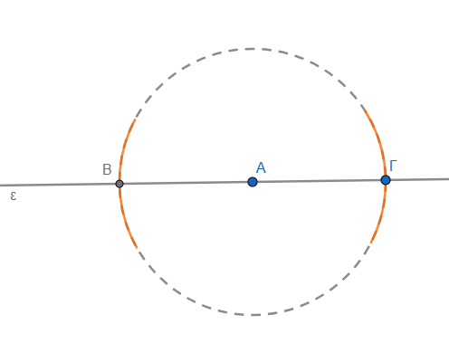

2.  **Σχεδίαση τόξων:** Με κέντρα τα σημεία $Β$ και $Γ$ και ακτίνα μεγαλύτερη από το μισό του τμήματος $ΒΓ$ (δηλαδή μεγαλύτερη από το $ΑΒ$), σχεδιάζετε δύο τόξα που να τέμνονται σε ένα σημείο, έστω $\Sigma$, σε ένα από τα δύο ημιεπίπεδα που ορίζει η ευθεία $\varepsilon$.

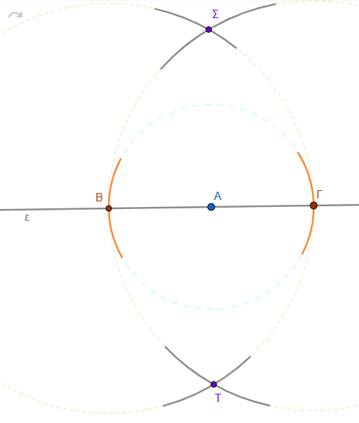{width="462"}

3.  **Χάραξη της κάθετης:** Χρησιμοποιώντας τον κανόνα, σχεδιάζετε την ευθεία που διέρχεται από τα σημεία $Α$ και $\Sigma$.

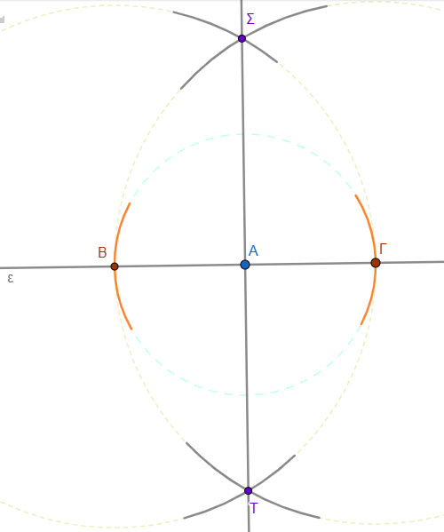{width="447"}

Η ευθεία αυτή είναι η ζητούμενη ευθεία $\delta$, η οποία είναι κάθετη στην $\varepsilon$ στο σημείο $Α$.

**Γεωμετρική Τεκμηρίωση:** Η κατασκευή αυτή στηρίζεται στο ότι το σημείο $\Sigma$ ισαπέχει από τα άκρα $Β$ και $Γ$, επομένως ανήκει στη **μεσοκάθετο** του τμήματος $ΒΓ$.
Εφόσον το $Α$ είναι το μέσο του $ΒΓ$, η ευθεία που ενώνει το $Α$ με το $\Sigma$ είναι η μεσοκάθετος του τμήματος, άρα και η κάθετη ευθεία στην $\varepsilon$ στο συγκεκριμένο σημείο.

### Για να κατασκευάσετε την ευθεία $\delta$ που είναι **κάθετη** σε μια ευθεία $\varepsilon$ από ένα σημείο $Α$ το οποίο βρίσκεται **εκτός** αυτής, ακολουθείτε τα εξής βήματα με τη χρήση κανόνα και διαβήτη:

1.  **Προσδιορισμός τμήματος στην** $\varepsilon$: Με κέντρο το σημείο $Α$ και ακτίνα κατάλληλου μήκους (αρκετά μεγάλη ώστε να φτάνει την ευθεία), σχεδιάζετε έναν κύκλο ή ένα τόξο που να τέμνει την ευθεία $\varepsilon$ σε δύο σημεία, έστω $Β$ και $Γ$.

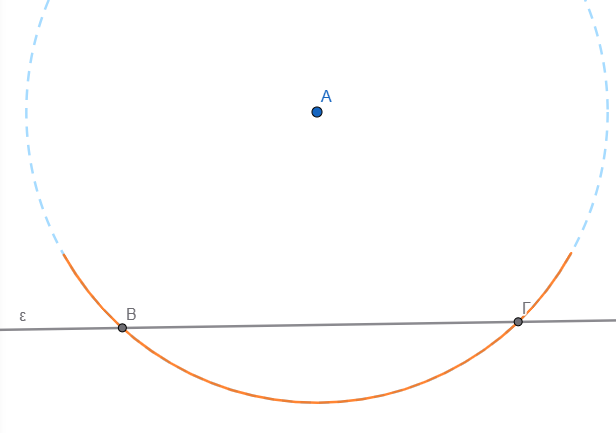{width="495"}

2.  **Κατασκευή μεσοκαθέτου:** Στη συνέχεια, κατασκευάζετε τη **μεσοκάθετο** του ευθυγράμμου τμήματος $ΒΓ$ που ορίστηκε πάνω στην ευθεία όπως προηγουμένως.
3.  **Σχεδίαση τόξων:** Με κέντρα τα σημεία $Β$ και $Γ$ και την ίδια ακτίνα (μεγαλύτερη από το μισό του μήκους του $ΒΓ$), σχεδιάζετε δύο τόξα που να τέμνονται σε ένα σημείο, έστω $\Delta$. Το σημείο $\Delta$ επιλέγεται συνήθως στο ημιεπίπεδο όπου δεν βρίσκεται το $Α$.

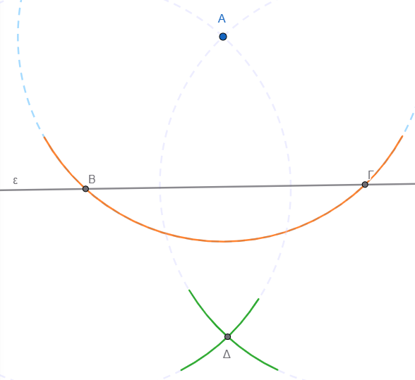{width="502"}

4.  **Χάραξη της κάθετης:** Με τον κανόνα (χάρακα), σχεδιάζετε την ευθεία που διέρχεται από τα σημεία $Α$ και $\Delta$.

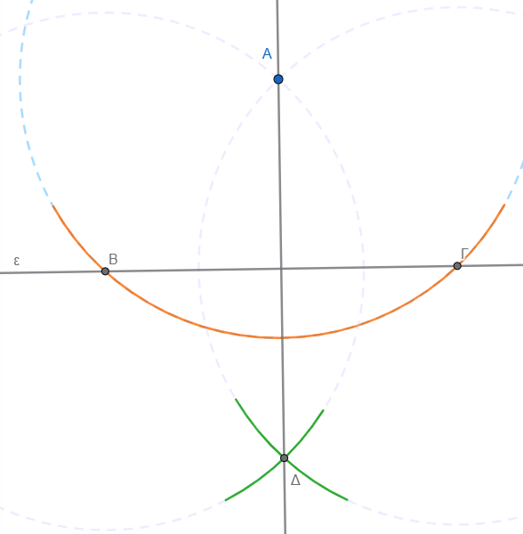{width="509"}

Η ευθεία αυτή είναι η ζητούμενη $\delta$, η οποία είναι κάθετη στην $\varepsilon$ και διέρχεται από το $Α$.

**Γεωμετρική Τεκμηρίωση**

- Το σημείο $Α$ ανήκει στη μεσοκάθετο του τμήματος $ΒΓ$, επειδή από την αρχική κατασκευή ισαπέχει από τα άκρα του ($ΑΒ = ΑΓ$).
- Το σημείο $\Delta$ ανήκει επίσης στη μεσοκάθετο του $ΒΓ$, αφού κατασκευάστηκε ώστε να ισαπέχει από τα $Β$ και $Γ$.
- Επειδή η μεσοκάθετος ενός τμήματος είναι **εξ ορισμού κάθετη** σε αυτό, η ευθεία που ορίζουν τα $Α$ και $\Delta$ είναι η κάθετη ευθεία προς την $\varepsilon$.

------------------------------------------------------------------------

### Το **περίκεντρο** ενός τριγώνου ορίζεται ως το **σημείο τομής των τριών μεσοκαθέτων** των πλευρών του.

Ο ρόλος και οι ιδιότητές του στο τρίγωνο συνοψίζονται στα εξής:

- **Κέντρο Περιγεγραμμένου Κύκλου:** Το περίκεντρο αποτελεί το κέντρο του κύκλου που διέρχεται από όλες τις κορυφές του τριγώνου, ο οποίος ονομάζεται περιγεγραμμένος κύκλος.

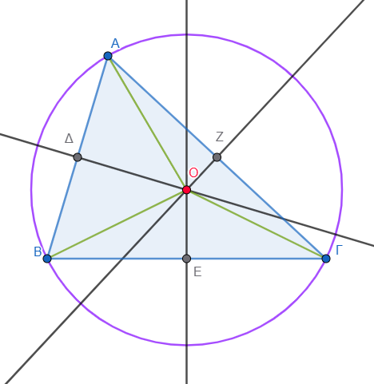

- **Ιδιότητα Ισαπόστασης:** Το σημείο αυτό **ισαπέχει από τις τρεις κορυφές** του τριγώνου. Αν ονομάσουμε $Ο$ το περίκεντρο ενός τριγώνου $ΑΒΓ$, τότε η ιδιότητα αυτή εκφράζεται με την ισότητα των τμημάτων $ΟΑ = ΟΒ = ΟΓ$, τα οποία αποτελούν και τις ακτίνες του περιγεγραμμένου κύκλου.
- **Συντρέχουσες Ευθείες:** Είναι το μοναδικό σημείο του επιπέδου στο οποίο **συντρέχουν (τέμνονται) υποχρεωτικά** και οι τρεις μεσοκάθετοι των πλευρών του τριγώνου.
- **Γεωμετρικός Προσδιορισμός:** Για να βρεθεί η θέση του περιεκέντρου, αρκεί να κατασκευαστούν οι μεσοκάθετοι δύο μόνο πλευρών του τριγώνου, καθώς η μεσοκάθετος της τρίτης πλευράς θα διέλθει αναγκαστικά από το σημείο τομής τους.

------------------------------------------------------------------------

### Η σύνδεση της μεσοκαθέτου με το ισοσκελές τρίγωνο είναι θεμελιώδης στη Γεωμετρία και βασίζεται στην ιδιότητα της ισαπόστασης.

Οι κυριότεροι τρόποι με τους οποίους συνδέονται είναι οι εξής:

**1. Η Κορυφή του Ισοσκελούς Τριγώνου**

Η κορυφή ενός ισοσκελούς τριγώνου (το σημείο όπου ενώνονται οι δύο ίσες πλευρές) **ανήκει υποχρεωτικά στη μεσοκάθετο της βάσης του**.
Αυτό συμβαίνει διότι η κορυφή ισαπέχει από τα άκρα της βάσης (αφού οι πλευρές είναι ίσες), και σύμφωνα με την αντίστροφη ιδιότητα της μεσοκαθέτου, κάθε σημείο που ισαπέχει από τα άκρα ενός τμήματος βρίσκεται στη μεσοκάθετό του.

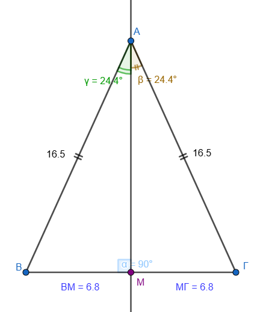

**2. Ταύτιση Δευτερευόντων Στοιχείων**

Σε ένα ισοσκελές τρίγωνο, η μεσοκάθετος της βάσης του ταυτίζεται με τρία άλλα σημαντικά στοιχεία που ξεκινούν από την κορυφή:

\* Το **ύψος** που αντιστοιχεί στη βάση.
($\angle{AΜΓ}=90^\circ$)

\* τη **διάμεσο** προς τη βάση.(ΒΜ=ΜΓ)

\* τη **διχοτόμο** της γωνίας της κορυφής.
($\angle{BAM}=\angle{MAΓ}$)

Επομένως, αν φέρουμε τη μεσοκάθετο της βάσης ενός ισοσκελούς τριγώνου, αυτή θα διέλθει οπωσδήποτε από την απέναντι κορυφή και θα διχοτομήσει τη γωνία της.

**3. Κατασκευή Ισοσκελών Τριγώνων**

Η μεσοκάθετος ενός ευθυγράμμου τμήματος ΑΒ είναι ο **γεωμετρικός τόπος** των κορυφών όλων των ισοσκελών τριγώνων που έχουν ως βάση το τμήμα ΑΒ.\
\* Αν πάρουμε οποιοδήποτε τυχαίο σημείο Μ πάνω στη μεσοκάθετο ενός τμήματος ΑΒ, το τρίγωνο ΜΑΒ που σχηματίζεται θα είναι **πάντα ισοσκελές** (ΜΑ=ΜΒ).\
\* Με αυτόν τον τρόπο, μπορούμε να κατασκευάσουμε **άπειρα ισοσκελή τρίγωνα** πάνω σε μια συγκεκριμένη βάση.

**4. Άξονας Συμμετρίας**

Η μεσοκάθετος της βάσης αποτελεί τον **άξονα συμμετρίας** του ισοσκελούς τριγώνου.
Αυτό σημαίνει ότι αν διπλώσουμε το τρίγωνο κατά μήκος της μεσοκαθέτου της βάσης του, οι δύο ίσες πλευρές και οι δύο γωνίες της βάσης θα συμπέσουν απόλυτα.

### Η μεσοκάθετος ενός ευθυγράμμου τμήματος έχει πολλές πρακτικές εφαρμογές

σε προβλήματα της καθημερινής ζωής, οι οποίες βασίζονται κυρίως στην ιδιότητά της ότι κάθε σημείο της **ισαπέχει από δύο συγκεκριμένα σημεία**.
Μερικές από τις κυριότερες εφαρμογές είναι οι εξής:

- **Χωροθέτηση δημόσιων κτιρίων και υπηρεσιών:** Όταν θέλουμε να βρούμε την κατάλληλη θέση για ένα κτίριο (π.χ. ένα σχολείο) ώστε να απέχει εξίσου από τρεις διαφορετικές τοποθεσίες (π.χ. τα σπίτια τριών μαθητών Α, Β και Γ), η θέση αυτή είναι το σημείο τομής των μεσοκαθέτων των τμημάτων ΑΒ και ΑΓ.
- **Σχεδιασμός υποδομών σε οδικά δίκτυα:** Αν πρέπει να κατασκευαστεί μια εγκατάσταση (π.χ. μια στάση ή ένας σταθμός) πάνω σε έναν δρόμο, έτσι ώστε να εξυπηρετεί εξίσου δύο χωριά Α και Β, η ιδανική θέση είναι το σημείο όπου ο δρόμος τέμνεται από τη μεσοκάθετο του τμήματος ΑΒ.\
  Τα δύο χωριά Δρακονέρι και Ανάληψη αποφάσισαν φτιάξουν μαζί ένα νέο γήπεδο που θα εξηπηρετεί και τα δύο χωριά. Που θα το φτιάξουν;

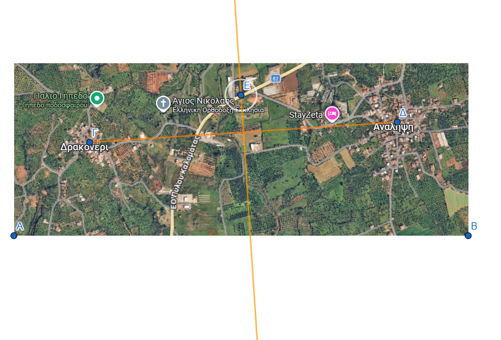

- **Τεχνικές εργασίες και ξυλουργική:** Ένας τεχνίτης (π.χ. ξυλουργός) μπορεί να προσδιορίσει με ακρίβεια το **κέντρο μιας κυκλικής επιφάνειας** τραπεζιού χρησιμοποιώντας μόνο κανόνα και διαβήτη. Αυτό επιτυγχάνεται σχεδιάζοντας δύο τυχαίες χορδές στον κύκλο και κατασκευάζοντας τις μεσοκαθέτους τους, οι οποίες τέμνονται υποχρεωτικά στο κέντρο του κύκλου.

::: {style="background-color: #f0f8cc; border: 2px solid #2f3e50; color: #25188a; padding: 15px; border-radius: 5px;"}
Οδηγία !:
μετακινήστε ένα από τα σημεία και παρατηρείστε.
Που τέμνονται πάντα οι μεσοκάθετοι των χορδών;
:::

<iframe src="https://www.geogebra.org/calculator/nzn2xwqt?embed" width="730" height="600" allowfullscreen style="border: 1px solid #e4e4e4;border-radius: 4px;" frameborder="0">

</iframe>

- **Οικοδομικές και αρχιτεκτονικές μελέτες:** Κατά την προετοιμασία ενός οικοπέδου για ανέγερση οικοδομής, ο εργολάβος χρησιμοποιεί τις μεσοκαθέτους των πλευρών του οικοπέδου για να προσδιορίσει το κέντρο του και να τοποθετήσει με ακρίβεια τις βάσεις για τις δοκούς στήριξης.
- **Κατασκευή παραθύρων και διακόσμηση:** Στην αρχιτεκτονική και την κατασκευή παραθύρων (π.χ. βιτρώ), οι ιδιότητες της μεσοκαθέτου χρησιμοποιούνται για την εγγραφή γεωμετρικών σχημάτων, όπως τετράγωνα πλαίσια, μέσα σε κυκλικά τμήματα παραθύρων.
- **Επίλυση προβλημάτων απόστασης και ταχύτητας:** Η μεσοκάθετος χρησιμοποιείται για τον προσδιορισμό σημείων όπου δύο αντικείμενα που κινούνται με την ίδια ταχύτητα από διαφορετικές αφετηρίες θα συναντηθούν ταυτόχρονα (π.χ. πουλιά που πετούν από πύργους προς ένα συντριβάνι).

------------------------------------------------------------------------
### Ασκήσεις

- **Ισοσκελή Τρίγωνα:** Έστω ευθύγραμμο τμήμα ΑΒ = 3 cm. Κατασκευάστε **τρία διαφορετικά ισοσκελή τρίγωνα** που να έχουν ως βάση το ΑΒ. Πόσα τέτοια τρίγωνα μπορούν να υπάρξουν συνολικά;.
- **Σημεία σε Κύκλο:** Σχεδιάστε έναν κύκλο και μια διάμετρο ΑΒ. Βρείτε τα σημεία πάνω στην περιφέρεια του κύκλου τα οποία **ισαπέχουν από τα άκρα Α και Β** της διαμέτρου.
- **Εύρεση Σημείου σε Γωνία:** Σχεδιάστε μια οξεία γωνία xOy. Στην πλευρά Ox σημειώστε δύο σημεία Α και Β. Βρείτε ένα σημείο πάνω στην άλλη πλευρά (Oy) που να **ισαπέχει εξίσου** από τα Α και Β.
- **Γεωμετρικός Τόπος:** Βρείτε τα κέντρα όλων των κύκλων που διέρχονται από δύο σταθερά σημεία Α και Β. Τι σχηματίζουν;

::: {style="background-color: #f0f8cc; border: 2px solid #2f3e50; color: #25188a; padding: 15px; border-radius: 5px;"}
Οδηγία!:
Για να δείτε τον γεωμετρικό τόπο (τι κατασκευάζουν τα σημεία των κέντρων όλων των διαφορετικών κύκλων), σύρετε το σημείο Γ στο παρακάτω εφαρμογίδιο (έτσι δημιουργείτε πολλούς διαφορετικούς κύκλους που περνάνε από τα Α και Β) Τι σχηματίζουν τα κέντρα τους; Για να σβήσετε τα ίχνη και να ξαναδοκιμάσετε, κέντε tap στην επιφάνεια εργασίας και μετακινήστε την λίγο.
Αν το σχήμα δεν είναι στο κέντρο tap και μετακινήστε.
:::

<iframe src="https://www.geogebra.org/calculator/hnyx5amm?embed" width="730" height="800" allowfullscreen style="border: 1px solid #e4e4e4;border-radius: 4px;" frameborder="0">

</iframe>

- Nα χαράξεις ένα ευθύγραμμο τμήμα ΑΒ και με τη χρήση του κανόνα και του διαβήτη να το χωρίσεις σε δύο ίσα τμήματα και στη συνέχεια σε τέσσερα ίσα τμήματα.

::: callout-tip
Σχεδιάστε πρώτα την μεσοκάθετο του ΑΒ και ύστερα την μεσοκάθετο των των δύο τμημάτων στα οποία χωρίστηκε το ΑΒ από την πρώτη φάση.
:::

1.   **Υπολογισμός Γωνιών:** Δίνεται αμβλυγώνιο και ισοσκελές τρίγωνο ΑΒΓ (με βάση την ΑΓ). Η μεσοκάθετος της πλευράς ΒΓ τέμνει την πλευρά ΑΓ στο σημείο Ε. Αν η γωνία ΑΒΕ είναι ορθή (90°), **υπολογίστε τις γωνίες του τριγώνου ΑΒΓ**.

Η επίλυση της συγκεκριμένης άσκησης για τις γωνίες του ισοσκελούς τριγώνου $ΑΒΓ$ βασίζεται στις βασικές ιδιότητες της μεσοκαθέτου και των ισοσκελών τριγώνων.

Ακολουθεί η αναλυτική λύση βήμα προς βήμα:

- **Δεδομένα και Κατανόηση Σχήματος**

  - Το τρίγωνο $ΑΒΓ$ είναι ισοσκελές με βάση την $ΑΓ$, πράγμα που σημαίνει ότι οι πλευρές $ΑΒ$ και $ΒΓ$ είναι ίσες ($ΑΒ = ΒΓ$).
  - Ως ισοσκελές, οι γωνίες της βάσης του είναι ίσες: $\hat{A} = \hat{Γ}$. Ας ονομάσουμε αυτές τις γωνίες $\omega$.
  - Η **μεσοκάθετος της πλευράς** $ΒΓ$ τέμνει την $ΑΓ$ στο σημείο $Ε$.
  - Δίνεται ότι η γωνία $\angle ΑΒΕ$ είναι ορθή ($90^\circ$).

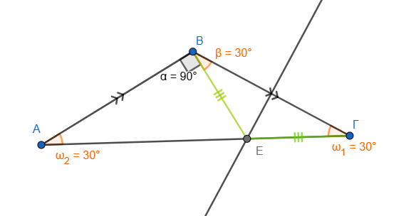

- **Χρήση της Ιδιότητας της Μεσοκαθέτου**

  - Επειδή το σημείο $Ε$ ανήκει στη μεσοκάθετο του τμήματος $ΒΓ$, **ισαπέχει από τα άκρα του**, δηλαδή $ΕΒ = ΕΓ$.
  - Επομένως, το τρίγωνο $ΕΒΓ$ είναι επίσης ισοσκελές με βάση τη $ΒΓ$.
  - Στο ισοσκελές τρίγωνο $ΕΒΓ$, οι γωνίες της βάσης του είναι ίσες, άρα $\angle ΕΒΓ = \hat{Γ} = \omega$.

- **Υπολογισμός των Γωνιών**

  - Η συνολική γωνία $\hat{B}$ του τριγώνου $ΑΒΓ$ αποτελείται από το άθροισμα των γωνιών $\angle ΑΒΕ$ και $\angle ΕΒΓ$: $\hat{B} = 90^\circ + \omega$.
  - Γνωρίζουμε ότι το **άθροισμα των γωνιών κάθε τριγώνου είναι** $180^\circ$. Εφαρμόζοντας αυτό στο τρίγωνο $ΑΒΓ$ έχουμε: $\hat{A} + \hat{B} + \hat{Γ} = 180^\circ$ $\omega + (90^\circ + \omega) + \omega = 180^\circ$ $3\omega + 90^\circ = 180^\circ$ $3\omega = 90^\circ$ $\omega = 30^\circ$.

- **Τελικά Αποτελέσματα**

Οι γωνίες του τριγώνου $ΑΒΓ$ είναι:

\* $\hat{A} = 30^\circ$

\* $\hat{Γ} = 30^\circ$

\* $\hat{B} = 90^\circ + 30^\circ = 120^\circ$

Το τρίγωνο είναι πράγματι **αμβλυγώνιο**, καθώς η γωνία $\hat{B}$ είναι μεγαλύτερη από $90^\circ$.

2.  **Πρόβλημα Καθημερινής Ζωής (Χωροθέτηση):** Αν τα σπίτια τριών μαθητών (σημεία Α, Β, Γ) σχηματίζουν τρίγωνο, προσδιορίστε τη **θέση του σχολείου** αν γνωρίζουμε ότι αυτό ισαπέχει και από τους τρεις μαθητές.

3.  **Απόδειξη Ισότητας:** Σε ισοσκελές τρίγωνο ΑΒΓ (ΑΒ = ΑΓ), η μεσοκάθετος της πλευράς ΑΓ τέμνει την προέκταση της ΒΓ στο Δ.
  Προεκτείνουμε τη ΔΑ κατά τμήμα ΑΕ = ΒΔ.
  **Αποδείξτε ότι το τρίγωνο ΔΑΓ είναι ισοσκελές**.

4.  **Συμμετρία:** Δικαιολογήστε γιατί, αν δύο σημεία Μ και Μ' είναι συμμετρικά ως προς μια ευθεία ΑΒ, τότε η ευθεία ΑΒ είναι η **μεσοκάθετος του τμήματος ΜΜ'**.

5.  **Πρακτική Εφαρμογή:** Ένας εργολάβος θέλει να βρει τη θέση μιας στάσης πάνω σε έναν δρόμο, ώστε να **απέχει εξίσου από δύο χωριά** Α και Β που βρίσκονται εκατέρωθεν του δρόμου.
  Πώς θα χρησιμοποιήσει τη μεσοκάθετο για να τη βρει;

6.  Σχεδίασε έναν κύκλο με κέντρο Κ και μια χορδή του ΑΒ.
  Να κατασκευάσεις τη μεσοκάθετο της χορδής ΑΒ και να ονομάσεις Μ και Ν τα σημεία στα οποία τέμνει τον κύκλο.

  - (α) Σύγκρινε τις χορδές ΜΑ και ΜΒ και δικαιολόγησε το αποτέλεσμα της σύγκρισης,

  - (β) κάνε το ίδιο και για τις χορδές ΝΑ και ΝΒ,

  - (γ) βρες εάν το κέντρο Κ του κύκλου είναι σημείο της μεσοκαθέτου και δικαιολόγησε την απάντησή σου.

::: {style="background-color: #f0f8cc; border: 2px solid #2f3e50; color: #25188a; padding: 15px; border-radius: 5px;"}
ΚΑΛΗ ΜΕΛΕΤΗ !
:::
