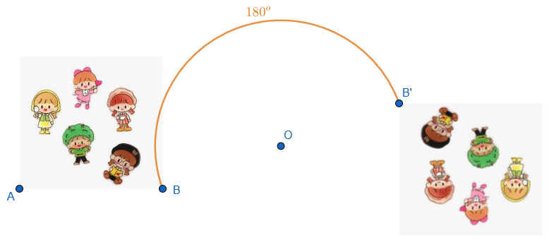
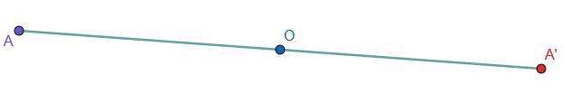
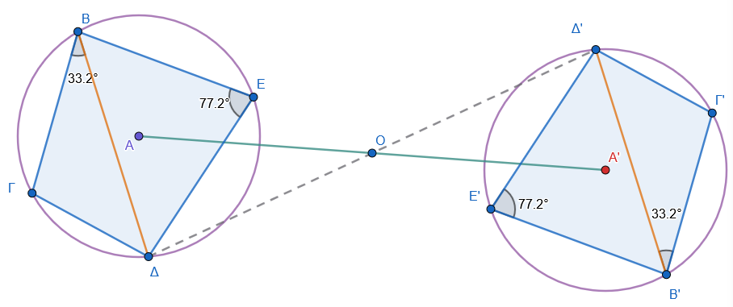

\usepackage{wasysym}

```{=html}
<!-- Φόρτωση βιβλιοθήκης GeoGebra -->
<script src="https://www.geogebra.org/apps/deployggb.js"</script>

<!-- Συνάρτηση δημιουργίας applets -->
<script>
function createGeoGebra(containerId, materialId, width = 700, height = 500) {
  var params = {
    "id": "ggb-" + containerId,
    "material_id": materialId,
    "width": width,
    "height": height,
    "showToolBar": true,
    "showMenuBar": false,
    "showAlgebraInput": true
  };
  
  var applet = new GGBApplet(params, '5.2');
  applet.inject(containerId);
}
</script>
```

------------------------------------------------------------------------

## Η συμμετρία ως προς σημείο

### **Η συμμετρία ως στροφή 180°**

::: {style="background-color: #c0d4b8; border: 2px solid #2f3e50; color: #25188a; padding: 15px; border-radius: 5px;"}
**Θεωρία – Ορισμοί – Ιδιότητες**

- **Ορισμός:** Η μετάβαση από ένα επίπεδο σχήμα στο συμμετρικό του ως προς ένα σημείο $O$ πραγματοποιείται με τη **στροφή του σχήματος γύρω από το** $O$ κατά γωνία 180° πάνω στο επίπεδό του.\
  {width="500"}

- **Γεωμετρικός Μετασχηματισμός:** Κάθε κεντρική συμμετρία είναι ένας μετασχηματισμός **κεντρικής στροφής κατά γωνία 180°**.

- **Αποτέλεσμα στροφής:** Με τη στροφή αυτή, κάθε σημείο $Β$ του επιπέδου έρχεται στη θέση του συμμετρικού του σημείου $Β'$.

- **Ιδιότητα:** Κατά τη στροφή 180°, το κέντρο $O$ παραμένει **σταθερό (αμετάβλητο)**, ενώ όλα τα άλλα σημεία μετατοπίζονται πάνω σε ομόκεντρες περιφέρειες.
:::

**Παραδείγματα**

1.  Αν στρέψουμε ένα ευθύγραμμο τμήμα κατά 180° γύρω από το μέσο του, αυτό συμπίπτει με τον εαυτό του.
2.  Δύο **κατά κορυφήν γωνίες** συμπίπτουν αν η μία στραφεί κατά 180° γύρω από την κορυφή τους.
3.  Ένα **παραλληλόγραμμο** συμπίπτει με τον εαυτό του αν στραφεί κατά 180° γύρω από το σημείο τομής των διαγωνίων του.
4.  Σε έναν κύκλο, μια διάμετρος συμπίπτει με τον εαυτό της μετά από στροφή 180° γύρω από το κέντρο.
5.  Το γράμμα **«Ο»** ή **«Ι»** παραμένει οπτικά το ίδιο μετά από στροφή 180° γύρω από το κέντρο του.

**Ασκήσεις**

1.  Σχεδιάστε ένα τυχαίο σημείο $A$ και στρέψτε το κατά 180° γύρω από κέντρο $O$.
2.  Πάρτε ένα τμήμα $AB$ και στρέψτε το κατά 180° ως προς σημείο $O$ εκτός αυτού.
3.  Αποδείξτε πειραματικά με διαφανές χαρτί ότι η στροφή 180° ταυτίζεται με την κεντρική συμμετρία.
4.  Στρέψτε μια ορθή γωνία κατά 180° γύρω από την κορυφή της. Τι παρατηρείτε για τις πλευρές της;.
5.  Σχεδιάστε έναν κύκλο και στρέψτε τον κατά 180° γύρω από ένα σημείο της περιφέρειάς του.
6.  Βρείτε τη θέση των δεικτών του ρολογιού στις 12:00 και στρέψτε τον λεπτοδείκτη κατά 180°. Τι ώρα δείχνει;.
7.  Σχεδιάστε το γράμμα **«Ν»** και εξετάστε αν συμπίπτει με τον εαυτό του μετά από στροφή 180°.
8.  Πάρτε ένα τρίγωνο $AB\Gamma$ και στρέψτε το κατά 180° γύρω από μια κορυφή του.
9.  Σχεδιάστε δύο παράλληλες ευθείες και στρέψτε τες κατά 180° ως προς το μέσο ενός τμήματος που τις συνδέει.
10. Επαληθεύστε ότι η στροφή 180° μετατρέπει μια ημιευθεία στην αντίθετή της.

------------------------------------------------------------------------

### **Συμμετρικά σημεία ως προς σημείο**

::: {style="background-color: #c0d4b8; border: 2px solid #2f3e50; color: #25188a; padding: 15px; border-radius: 5px;"}
**Θεωρία – Ορισμοί – Ιδιότητες**

- **Ορισμός:** Δύο σημεία $Α, Α'$ ονομάζονται **συμμετρικά ως προς ένα σημείο** $O$, όταν το $O$ είναι το **μέσον** του ευθυγράμμου τμήματος $ΑΑ'$.\
  

- **Κέντρο Συμμετρίας:** Το σταθερό σημείο $O$ ονομάζεται κέντρο της συμμετρίας.

- **Συμμετρικό του κέντρου:** Το συμμετρικό του σημείου $O$ ως προς το $O$ είναι το ίδιο το σημείο $O$ ($O'=O$).

- **Αμφιμονοσήμαντη σχέση:** Αν το $Α'$ είναι συμμετρικό του $Α$, τότε και το $Α$ είναι συμμετρικό του $Α'$ ως προς το ίδιο κέντρο $O$.
:::

**Παραδείγματα**

1.  Τα άκρα μιας διαμέτρου κύκλου είναι συμμετρικά ως προς το κέντρο του.
2.  Οι απέναντι κορυφές ενός παραλληλογράμμου είναι συμμετρικές ως προς το σημείο τομής των διαγωνίων του.
3.  Αν $A(3)$ και $A'(-3)$ σε έναν άξονα, τότε τα σημεία είναι συμμετρικά ως προς την αρχή $O(0)$.
4.  Σε ένα ευθύγραμμο τμήμα $AB$, τα σημεία $A$ και $B$ είναι συμμετρικά ως προς το μέσον του $M$.
5.  Το είδωλο ενός σημείου στον φακό μιας κάμερας (ως προς το κέντρο του φακού).

**Ασκήσεις**

1.  Σχεδιάστε σημείο $M$ και βρείτε το συμμετρικό του $M'$ ως προς κέντρο $O$.
2.  Σε έναν άξονα με $O(0)$, βρείτε το συμμετρικό του σημείου με τετμημένη $+4$.
3.  Αν $O$ είναι το μέσον του $AA'$, υπολογίστε την απόσταση $AA'$ αν $OA = 5\text{ cm}$.
4.  Πάρτε τρία σημεία $A, B, \Gamma$ και βρείτε τα συμμετρικά τους ως προς κέντρο $O$.
5.  Σχεδιάστε δύο σημεία \$A, B\$ και βρείτε το κέντρο συμμετρίας τους.
6.  Βρείτε το συμμετρικό του $A(3, 4)$ ως προς την αρχή των αξόνων $(0,0)$.
7.  Αν $M'$ είναι το συμμετρικό του $M$ και $M$ το συμμετρικό του $K$, τι σχέση έχει το $O$ με τα $M, M'$ και $K$;.
8.  Πάνω σε μια ευθεία πάρτε διαδοχικά τμήματα $OA=AB=B\Gamma$. Βρείτε τα συμμετρικά των $A, B, \Gamma$ ως προς $O$.
9.  Σχεδιάστε κύκλο $(K, R)$ και βρείτε το συμμετρικό του κέντρου $K$ ως προς σημείο της περιφέρειας.
10. Εξετάστε αν δύο σημεία που απέχουν ίσα από το $O$ είναι πάντα συμμετρικά ως προς αυτό.

------------------------------------------------------------------------

### **Συμμετρικά σχήματα και Ισότητα**

::: {style="background-color: #c0d4b8; border: 2px solid #2f3e50; color: #25188a; padding: 15px; border-radius: 5px;"}
**Θεωρία – Ορισμοί – Ιδιότητες**

- **Ορισμός:** Δύο σχήματα $\Sigma$ και $\Sigma'$ είναι συμμετρικά ως προς σημείο $O$, όταν το συμμετρικό κάθε σημείου του $\Sigma$ ανήκει στο $\Sigma'$ και αντιστρόφως.\
  {width="500"}

- **Ισότητα:** Δύο σχήματα συμμετρικά ως προς σημείο είναι **ίσα**.

- **Φύση ισότητας:** Τα σχήματα αυτά είναι **κατ' ευθείαν ίσα**, δηλαδή συμπίπτουν με απλή ολίσθηση και στροφή, χωρίς αναστροφή (σε αντίθεση με την αξονική συμμετρία).

- **Κέντρο συμμετρίας σχήματος:** Ένα σημείο $O$ λέγεται κέντρο συμμετρίας ενός σχήματος, όταν το συμμετρικό του σχήματος ως προς το $O$ ταυτίζεται με το ίδιο το σχήμα.
:::

**Παραδείγματα**

1.  Δύο τρίγωνα που προκύπτουν από συμμετρία ως προς σημείο είναι ίσα.
2.  Το **παραλληλόγραμμο** έχει κέντρο συμμετρίας την τομή των διαγωνίων του.
3.  Ο **κύκλος** έχει κέντρο συμμετρίας το γεωμετρικό του κέντρο.
4.  Τα κεφαλαία γράμματα **Η, Θ, Ι, Ξ, Ο, Φ, Χ** έχουν κέντρο συμμετρίας.
5.  Η λέξη **«ΔΙΟ»** και η συμμετρική της ως προς σημείο $O$ είναι σχήματα ίσα.

**Ασκήσεις**

1.  Σχεδιάστε ένα τυχαίο σχήμα και κατασκευάστε το συμμετρικό του ως προς κέντρο $O$.
2.  Αποδείξτε με διαφανές χαρτί ότι δύο συμμετρικά ως προς σημείο τρίγωνα είναι ίσα.
3.  Βρείτε το κέντρο συμμετρίας ενός ευθυγράμμου τμήματος.
4.  Σχεδιάστε ένα τετράπλευρο και το συμμετρικό του ως προς μια κορυφή του.
5.  Εξετάστε ποια από τα ψηφία 0-9 έχουν κέντρο συμμετρίας.
6.  Κατασκευάστε το συμμετρικό της λέξης **«ΦΩΣ»** ως προς σημείο $O$.
7.  Σε ένα παραλληλόγραμμο $AB\Gamma\Delta$, δείξτε ότι τα τρίγωνα $AB\Delta$ και $\Gamma\Delta B$ είναι συμμετρικά ως προς το κέντρο του.
8.  Σχεδιάστε ένα σχήμα που να έχει κέντρο συμμετρίας αλλά κανέναν άξονα συμμετρίας.
9.  Αποδείξτε ότι η περίμετρος δύο συμμετρικών πολυγώνων είναι ίση.
10. Συμπληρώστε ένα ημιτελές σχήμα ώστε να αποκτήσει κέντρο συμμετρίας το δοσμένο $O$.

------------------------------------------------------------------------

### **Κατασκευές συμμετρικών ως προς σημείο**

**Θεωρία – Ορισμοί – Ιδιότητες**

- **Σημείο:**

Η βάση κάθε κατασκευής είναι η εύρεση του συμμετρικού ενός σημείου Α ως προς ένα κέντρο Ο:

- **Σχεδιάζουμε τη γραμμή:** Ενώνουμε το σημείο Α με το κέντρο συμμετρίας Ο.

::: callout-tip
Αλάξτε την θέση του σημείου Α.

Παρατηρήστε τι συμβαίνει με το Α'.
:::

<iframe src="https://www.geogebra.org/calculator/grbpvqte?embed" width="730" height="600" allowfullscreen style="border: 1px solid #e4e4e4;border-radius: 4px;" frameborder="0">

</iframe>

- **Προεκτείνουμε:** Προεκτείνουμε το τμήμα ΑΟ προς το μέρος του Ο.

- **Μεταφέρουμε την απόσταση:** Πάνω στην προέκταση, παίρνουμε ένα τμήμα ΟΑ' ίσο με το ΑΟ.
  Το σημείο Α' είναι το συμμετρικό του Α ως προς το Ο, και το Ο είναι το **μέσο** του ευθύγραμμου τμήματος ΑΑ'.

- **Ευθύγραμμο Τμήμα:** Το συμμετρικό ενός τμήματος $AB$ είναι ένα **ίσο και παράλληλο** τμήμα $A'B'$.

Βρίσκουμε τα συμμετρικά σημεία Α' και Β' των άκρων του Α και Β.
Το τμήμα Α'Β' είναι το ζητούμενο.

<iframe src="https://www.geogebra.org/calculator/qsmaykmh?embed" width="730" height="600" allowfullscreen style="border: 1px solid #e4e4e4;border-radius: 4px;" frameborder="0">

</iframe>

- **Ευθεία:** Το συμμετρικό ευθείας που διέρχεται από το $O$ είναι η ίδια η ευθεία.
  Αν δεν διέρχεται, είναι μια **παράλληλη ευθεία**.

- **Ημιευθεία:** Το συμμετρικό ημιευθείας ως προς την αρχή της είναι η **αντίθετη ημιευθεία**.

- **Γωνία:** Το συμμετρικό γωνίας ως προς την κορυφή της είναι η **κατακορυφήν** της γωνία.
  Ως προς άλλο σημείο, είναι μια ίση γωνία με πλευρές παράλληλες και αντίρροπες.

::: callout-tip
Αλάξτε την θέση των σημείων Α,Ο ή Β.

Παρατηρείστε τι συμβαίνει.

Επιλέξτε με <kbd>Ctrl</kbd> + τα σημεία Α και Ο και Β, μετά αφήστε το <kbd>Ctrl</kbd> και tap σε ένα από τα σημεία και μετακινήστε.

Το ίδιο μπορείτε να κάνετε επιλέγοντας με πορόμοιο τρόπο τις πλευρές της γωνίας, έτσι αλλάζετε ολόκληρη την γωνία.
:::

<iframe src="https://www.geogebra.org/calculator/eamwg2rj?embed" width="730" height="600" allowfullscreen style="border: 1px solid #e4e4e4;border-radius: 4px;" frameborder="0">

</iframe>

- **Κύκλος:** Το συμμετρικό κύκλου είναι **ίσος κύκλος** με κέντρο το συμμετρικό του αρχικού κέντρου.

**Κύκλος (Κ, ρ):** Βρίσκουμε το συμμετρικό σημείο Κ' του κέντρου Κ και σχεδιάζουμε έναν νέο κύκλο με κέντρο το Κ' και την **ίδια ακτίνα** ρ.

::: callout-tip
Κάντε το ίδιο για τον κύκλο.

Τι συμβαίνει αν το κέντρο Ο συμπέσει με το κέντρο του κύκλου;
:::

<iframe src="https://www.geogebra.org/calculator/dkywagpp?embed" width="800" height="600" allowfullscreen style="border: 1px solid #e4e4e4;border-radius: 4px;" frameborder="0">

</iframe>

- **Τρίγωνο ΑΒΓ:** Κατασκευάζουμε τα συμμετρικά των τριών κορυφών του (Α', Β', Γ') και τα ενώνουμε για να σχηματίσουμε το συμμετρικό τρίγωνο Α'Β'Γ'.

::: callout-tip
Αλάξτε την θέση των σημείων Α, Β ή Γ.

Παρατηρείστε τι συμβαίνει.

Επιλέξτε το τρίγωνο ΑΒΓ (tap στο εσωτερικό χρωματισμένο μέρος) και μετακινήστε.

Μετακινήστε το κέντρο συμμετρίας Ο, βάλτετο σε μια πλευρά του τριγώνου, στο εσωτερικό του τριγώνου ή σε μια κορυφή και δείτε τι συμβαίνει.
:::

<iframe src="https://www.geogebra.org/calculator/uaqmqzpn?embed" width="730" height="600" allowfullscreen style="border: 1px solid #e4e4e4;border-radius: 4px;" frameborder="0">

</iframe>

- **Πολύγωνο:** Βρίσκουμε τα συμμετρικά όλων των κορυφών του και τα συνδέουμε με τη σειρά.

::: callout-tip
Μετακινήστε σημεία, πλευρές, κορυφές του πολυγώνου ή ολόκληρο το πολύγωνο.
Τι παρατηρήτε;
:::

<iframe src="https://www.geogebra.org/calculator/zsh7df9b?embed" width="730" height="600" allowfullscreen style="border: 1px solid #e4e4e4;border-radius: 4px;" frameborder="0">

</iframe>


**Παραδείγματα**

1.  Κατασκευή συμμετρικού τριγώνου $AB\Gamma$ ως προς σημείο $O$: βρίσκουμε τα $A', B', \Gamma'$ και τα ενώνουμε.
2.  Συμμετρικό τμήματος $AB$ ως προς σημείο $O$ στην προέκτασή του: δημιουργείται ένα μεγαλύτερο τμήμα που περιέχει τα συμμετρικά άκρα.
3.  Κατασκευή συμμετρικής γωνίας $107^\circ$ ως προς την κορυφή της (παραμένει $107^\circ$).
4.  Συμμετρικό κύκλου ως προς σημείο της περιφέρειάς του: οι δύο κύκλοι εφάπτονται εξωτερικά στο κέντρο συμμετρίας.
5.  Συμμετρικό παραλλήλων ευθειών που τέμνονται από τρίτη: οι γωνίες που σχηματίζονται είναι ίσες (εντός εναλλάξ) λόγω συμμετρίας.

**Ασκήσεις**

1.  Κατασκευάστε το συμμετρικό τμήματος $AB = 4\text{cm}$ ως προς σημείο $O$ εκτός αυτού.
2.  Σχεδιάστε ευθεία $(\epsilon)$ και βρείτε τη συμμετρική της $(\epsilon')$ ως προς σημείο $K$ που δεν ανήκει στην $(\epsilon)$.
3.  Κατασκευάστε το συμμετρικό τριγώνου $AB\Gamma$ ως προς το μέσον $M$ της πλευράς $B\Gamma$.
4.  Σχεδιάστε γωνία $60^\circ$ και κατασκευάστε τη συμμετρική της ως προς την κορυφή της.
5.  Βρείτε το συμμετρικό κύκλου ακτίνας $R=3\text{cm}$ ως προς εξωτερικό σημείο $O$.
6.  Κατασκευάστε το συμμετρικό ενός τυχαίου πολυγώνου ως προς μια κορυφή του.
7.  Δίνεται γωνία $(Ax, Ay) = 80^\circ$. Κατασκευάστε τη συμμετρική της ως προς σημείο $O$.
8.  Σχεδιάστε δύο παράλληλα διανύσματα και βρείτε το κέντρο συμμετρίας τους.
9.  Κατασκευάστε το συμμετρικό ενός ορθογωνίου τριγώνου ως προς το μέσο της υποτείνουσας.
10. Πάνω σε μια ευθεία $(\epsilon)$ πάρτε σημεία $O, A, B, \Gamma$. Κατασκευάστε τα συμμετρικά τους ως προς $O$ και συγκρίνετε τα τμήματα που προκύπτουν.

------------------------------------------------------------------------

::: {style="background-color: #f0f8cc; border: 2px solid #2f3e50; color: #25188a; padding: 15px; border-radius: 5px;"}
ΚΑΛΗ ΜΕΛΕΤΗ !
:::
