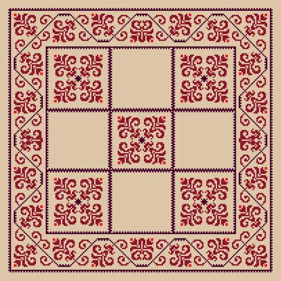
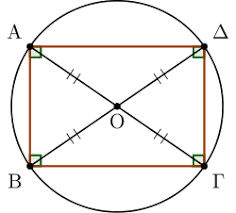
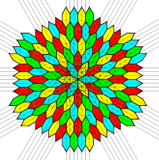
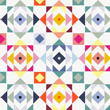
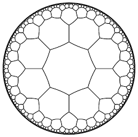
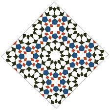

\usepackage{wasysym}

```{=html}
<!-- Φόρτωση βιβλιοθήκης GeoGebra -->
<script src="https://www.geogebra.org/apps/deployggb.js"</script>

<!-- Συνάρτηση δημιουργίας applets -->
<script>
function createGeoGebra(containerId, materialId, width = 700, height = 500) {
  var params = {
    "id": "ggb-" + containerId,
    "material_id": materialId,
    "width": width,
    "height": height,
    "showToolBar": true,
    "showMenuBar": false,
    "showAlgebraInput": true
  };
  
  var applet = new GGBApplet(params, '5.2');
  applet.inject(containerId);
}
</script>
```

------------------------------------------------------------------------

## Κέντρο συμμετρίας

### **Αναγνώριση Σχημάτων με Κέντρο Συμμετρίας**

::: {style="background-color: #c0d4b8; border: 2px solid #2f3e50; color: #25188a; padding: 15px; border-radius: 5px;"}
**Θεωρία – Ορισμοί – Ιδιότητες**

- **Ορισμός Κέντρου Συμμετρίας:** Ένα σημείο $O$ ονομάζεται κέντρο συμμετρίας ενός σχήματος $(\Sigma)$, όταν το συμμετρικό του σχήματος αυτού ως προς το $O$ συμπίπτει με το ίδιο το σχήμα.\
   {width="269"} 

- **Σχέση με τη Στροφή:** Η συμμετρία ως προς κέντρο $O$ ισοδυναμεί με μια στροφή του επιπέδου (και του σχήματος) γύρω από το $O$ κατά γωνία $180^\circ$.

- **Αναγνώριση:** Αν στρέψουμε ένα σχήμα κατά μισή στροφή γύρω από το κέντρο συμμετρίας του, αυτό θα εφαρμόσει ακριβώς πάνω στον εαυτό του.

- **Συμμετρικά Σημεία:** Σε ένα σχήμα με κέντρο συμμετρίας $O$, για κάθε σημείο του $M$ υπάρχει ένα αντίστοιχο σημείο $M'$ του ίδιου σχήματος τέτοιο ώστε το $O$ να είναι το μέσον του τμήματος $MM'$.
:::

**Παραδείγματα**

1.  **Το ευθύγραμμο τμήμα:** Έχει κέντρο συμμετρίας το μέσον του.
2.  **Ο κύκλος:** Έχει κέντρο συμμετρίας το γεωμετρικό του κέντρο.
3.  **Το παραλληλόγραμμο:** Έχει κέντρο συμμετρίας το σημείο τομής των διαγωνίων του.
4.  **Κεφαλαία γράμματα:** Τα γράμματα **Η, Θ, Ι, Ξ, Ο, Φ, Χ** διαθέτουν κέντρο συμμετρίας.
5.  **Κανονικά πολύγωνα με άρτιο αριθμό πλευρών:** Το τετράγωνο, το κανονικό εξάγωνο και το οκτάγωνο έχουν κέντρο συμμετρίας.

**Ασκήσεις**

1.  Εξηγήστε γιατί ένα ισόπλευρο τρίγωνο **δεν** έχει κέντρο συμμετρίας.
2.  Προσδιορίστε αν το γράμμα **«Ν»** έχει κέντρο συμμετρίας και πού βρίσκεται αυτό.
3.  Από τα ψηφία 0 έως 9, ποια έχουν κέντρο συμμετρίας;.
4.  Σχεδιάστε δύο τεμνόμενες ευθείες. Έχει το σχήμα τους κέντρο συμμετρίας;.
5.  Σχεδιάστε μια ημιπεριφέρεια. Διαθέτει κέντρο συμμετρίας; Αιτιολογήστε.
6.  Βρείτε το κέντρο συμμετρίας ενός ρόμβου χρησιμοποιώντας τις διαγώνιους του.
7.  Εξετάστε αν μια ταινία (λωρίδα) έχει κέντρα συμμετρίας και σε ποια γραμμή βρίσκονται.
8.  Σχεδιάστε ένα κανονικό πεντάγωνο και εξετάστε αν έχει κέντρο συμμετρίας.
9.  Σε ένα σύστημα αξόνων, ποιο σημείο είναι το κέντρο συμμετρίας των δύο αξόνων $x'x$ και $y'y$;.
10. Αναγνωρίστε ποιο από τα σχήματα του σχολικού σας βιβλίου (σχήμα 183) έχει κέντρο συμμετρίας.

------------------------------------------------------------------------

### **Βασικά Γεωμετρικά Σχήματα και Ιδιότητες**

::: {style="background-color: #c0d4b8; border: 2px solid #2f3e50; color: #25188a; padding: 15px; border-radius: 5px;"}
**Θεωρία – Ορισμοί – Ιδιότητες**

- **Ισότητα Σχημάτων:** Δύο σχήματα που είναι συμμετρικά μεταξύ τους ως προς κέντρο $O$ είναι πάντοτε ίσα.

- **Ιδιότητα Τμημάτων:** Δύο ευθύγραμμα τμήματα συμμετρικά ως προς κέντρο είναι **ίσα και παράλληλα**.

- **Ιδιότητα Γωνιών:** Το συμμετρικό μιας γωνίας ως προς την κορυφή της είναι η **κατακορυφήν** της γωνία, η οποία είναι ίση με την αρχική.

- **Ιδιότητα Ευθείας:** Το συμμετρικό μιας ευθείας ως προς σημείο εκτός αυτής είναι μια άλλη **ευθεία παράλληλη** προς την αρχική.
  Αν το σημείο ανήκει στην ευθεία, το συμμετρικό της είναι η ίδια η ευθεία.
:::

**Παραδείγματα**

1.  **Διανύσματα:** Δύο ίσα διανύσματα είναι συμμετρικά ως προς το μέσον του τμήματος που ενώνει την αρχή του ενός με το τέλος του άλλου.
2.  **Παραλληλόγραμμο:** Λόγω του κέντρου συμμετρίας, οι απέναντι πλευρές και γωνίες του είναι ίσες.
3.  **Κύκλος:** Κάθε διάμετρος του κύκλου έχει ως κέντρο συμμετρίας το κέντρο του κύκλου, το οποίο είναι και μέσον της διαμέτρου.
4.  **Ημιευθείες:** Δύο συμμετρικές ως προς την αρχή τους ημιευθείες είναι αντίθετες.
5.  **Τρίγωνα:** Δύο τρίγωνα συμμετρικά ως προς σημείο $O$ είναι κατευθείαν ίσα (συμπίπτουν με απλή ολίσθηση και στροφή).

**Ασκήσεις**

1.  Αποδείξτε ότι σε κάθε παραλληλόγραμμο οι διαγώνιοι διχοτομούνται χρησιμοποιώντας την κεντρική συμμετρία.
2.  Αν $A(3, 4)$ είναι ένα σημείο, βρείτε το συμμετρικό του ως προς την αρχή των αξόνων $O(0, 0)$.
3.  Δείξτε ότι οι διχοτόμοι δύο κατακορυφήν γωνιών είναι αντίθετες ημιευθείες.
4.  Σχεδιάστε ένα τρίγωνο $AB\Gamma$ και βρείτε το συμμετρικό του ως προς το μέσον $M$ της πλευράς $B\Gamma$.
5.  Αποδείξτε ότι αν δύο τμήματα $AB$ και $A'B'$ είναι ίσα και παράλληλα, τότε έχουν κέντρο συμμετρίας.
6.  Υπολογίστε τις γωνίες που σχηματίζονται από την τομή δύο παραλλήλων με μια τρίτη, χρησιμοποιώντας την κεντρική συμμετρία.
7.  Βρείτε το κέντρο συμμετρίας δύο ίσων και αντίρροπων διανυσμάτων.
8.  Σχεδιάστε έναν κύκλο και μια εφαπτομένη του. Κατασκευάστε τη συμμετρική εφαπτομένη ως προς το κέντρο του κύκλου.
9.  Σε ένα ισόπλευρο τρίγωνο, δείξτε ότι το σημείο τομής των υψών είναι κέντρο συμμετρίας μόνο για συγκεκριμένα στοιχεία του σχήματος.
10. Δίνεται γωνία $80^\circ$. Κατασκευάστε τη συμμετρική της ως προς ένα εξωτερικό σημείο $O$ και συγκρίνετε τα μέτρα τους.

------------------------------------------------------------------------

### Η συμμετρία ως προς σημείο (κεντρική συμμετρία) είναι πολύ συχνή στην καθημερινότητά μας,

από τον αθλητισμό και τη φύση μέχρι τα γράμματα που χρησιμοποιούμε.
Ακολουθούν μερικά χαρακτηριστικά παραδείγματα:

- **Αθλητικοί χώροι:** Τα γήπεδα του **μπάσκετ** και του **τένις** παρουσιάζουν κεντρική συμμετρία. Στο τένις, για παράδειγμα, το μέσο του φιλέ λειτουργεί ως κέντρο συμμετρίας για τις θέσεις των παικτών και τις γραμμές του γηπέδου.
- **Το ελληνικό αλφάβητο:** Πολλά κεφαλαία γράμματα έχουν κέντρο συμμετρίας, δηλαδή αν τα περιστρέψουμε κατά 180° παραμένουν ίδια. Αυτά είναι τα: **Ζ, Η, Θ, Ι, Ν, Ξ, Ο, Φ και Χ**.
- **Τραπουλόχαρτα:** Τα περισσότερα τραπουλόχαρτα (εκτός από εξαιρέσεις όπως το "9") είναι σχεδιασμένα με κέντρο συμμετρίας το σημείο τομής των διαγωνίων τους, ώστε να φαίνονται ίδια ακόμα και αν κρατηθούν ανάποδα.
- **Φύση και Βιολογία:**
  - Οι **κερήθρες** των μελισσών αποτελούνται από τέλεια εξάγωνα, σχήματα που διαθέτουν κέντρο συμμετρίας.
  - Στο **ανθρώπινο σώμα**, αν και κυριαρχεί η αξονική συμμετρία, ο **ομφαλός** θεωρείται το κεντρικό σημείο σε γεωμετρικά μοντέλα (όπως στον "Άνθρωπο του Βιτρούβιου"), καθώς ένας κύκλος με κέντρο αυτόν μπορεί να εφάπτεται στα άκρα των χεριών και των ποδιών σε συγκεκριμένη στάση.
- **Σύμβολα και Σήματα:** Σύμβολα όπως ο **σταυρός** (π.χ. του Ερυθρού Σταυρού) ή το προειδοποιητικό σήμα της **ραδιενέργειας** παρουσιάζουν κεντρική συμμετρία.
- **Γεωμετρικά αντικείμενα:** Οποιοδήποτε αντικείμενο καθημερινής χρήσης έχει σχήμα **παραλληλογράμμου** (π.χ. ένα τραπέζι ή ένα παράθυρο), **ρόμβου**, **κύκλου** ή **τετραγώνου**, διαθέτει κέντρο συμμετρίας το σημείο τομής των διαγωνίων του ή το κέντρο του.
- **Σχέδια με κέντρο σημμετρίας**









------------------------------------------------------------------------

::: {style="background-color: #f0f8cc; border: 2px solid #2f3e50; color: #25188a; padding: 15px; border-radius: 5px;"}
ΚΑΛΗ ΜΕΛΕΤΗ !
:::
