\usepackage{wasysym}

```{=html}
<!-- Φόρτωση βιβλιοθήκης GeoGebra -->
<script src="https://www.geogebra.org/apps/deployggb.js"</script>

<!-- Συνάρτηση δημιουργίας applets -->
<script>
function createGeoGebra(containerId, materialId, width = 700, height = 500) {
  var params = {
    "id": "ggb-" + containerId,
    "material_id": materialId,
    "width": width,
    "height": height,
    "showToolBar": true,
    "showMenuBar": false,
    "showAlgebraInput": true
  };
  
  var applet = new GGBApplet(params, '5.2');
  applet.inject(containerId);
}
</script>
```

------------------------------------------------------------------------

## Παράλληλες ευθείες που τέμνονται από μια άλλη ευθεία

### **Ονομασίες Ζευγών Γωνιών**

::: {style="background-color: #c0d4b8; border: 2px solid #2f3e50; color: #25188a; padding: 15px; border-radius: 5px;"}
**Θεωρία και Ορισμοί**

Όταν δύο ευθείες (ε) και (ε') τέμνονται από μια τρίτη ευθεία (δ) σε δύο σημεία Α και Β, σχηματίζονται οκτώ γωνίες.
Αυτές οι γωνίες παίρνουν ειδικά ονόματα ανάλογα με τη θέση τους ως προς τις δύο ευθείες και την τέμνουσα:

- **Εντός:** Οι γωνίες που βρίσκονται στη ζώνη ανάμεσα στις δύο παράλληλες ευθείες.

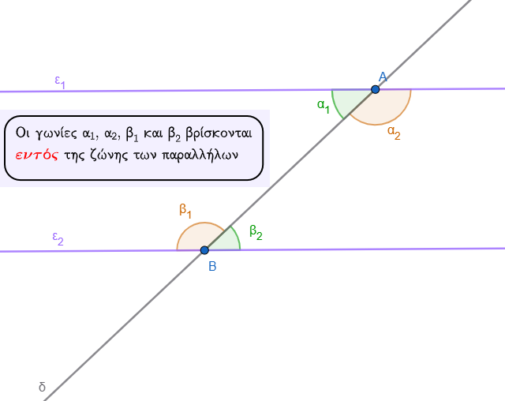{width="480"}

- **Εκτός:** Οι γωνίες που βρίσκονται έξω από τη ζώνη των δύο παραλλήλων ευθειών.

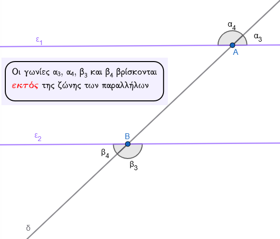{width="483"}

- **Επί τα αυτά:** Οι γωνίες που βρίσκονται προς το **ίδιο μέρος** (ημιεπίπεδο) της τέμνουσας $\delta$.

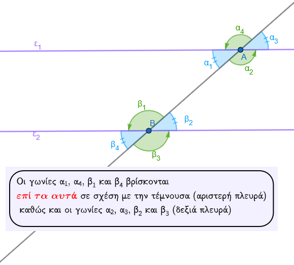{width="475"}

- **Εναλλάξ:** Οι γωνίες που βρίσκονται **εκατέρωθεν** (σε διαφορετικά μέρη) της τέμνουσας $\delta$.

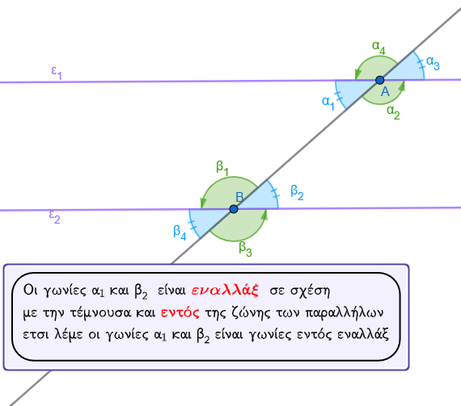{width="492"}

**Συνδυασμοί ονομασιών:**

- **Εντός εναλλάξ:** Βρίσκονται μεταξύ των ευθειών και εκατέρωθεν της τέμνουσας.\
  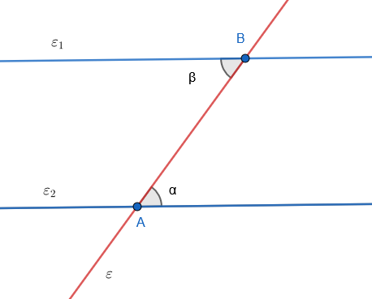{width="230"} ή
  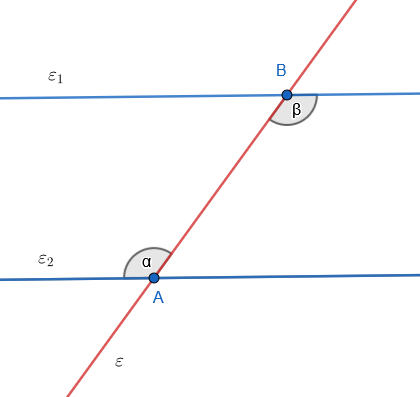{width="230"}

- **Εκτός εναλλάξ:** Βρίσκονται εκτός των ευθειών και εκατέρωθεν της τέμνουσας.\
  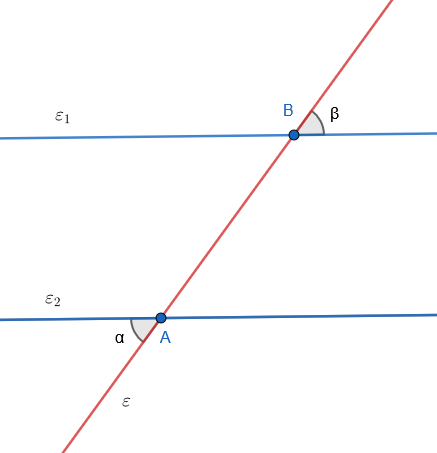{width="230"} ή
  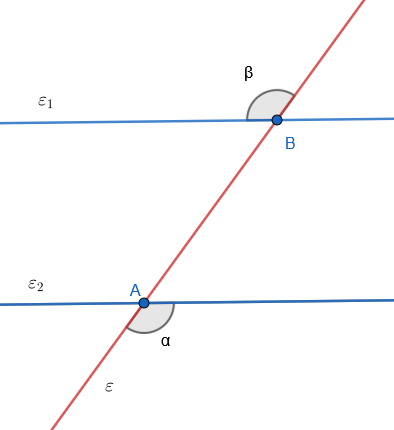{width="230"}

- **Εντός εκτός και επί τα αυτά (Αντίστοιχες):** Η μία είναι εντός, η άλλη εκτός και βρίσκονται προς το ίδιο μέρος της τέμνουσας.\
  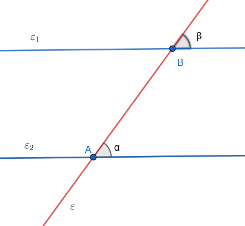{width="230"} ή 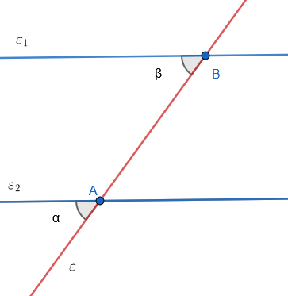{width="230"}\
  Υπάρχουν και άλλοι συνδυασμοί
  .

- **Εντός και επί τα αυτά:** Βρίσκονται και οι δύο εντός και προς το ίδιο μέρος της τέμνουσας.\
  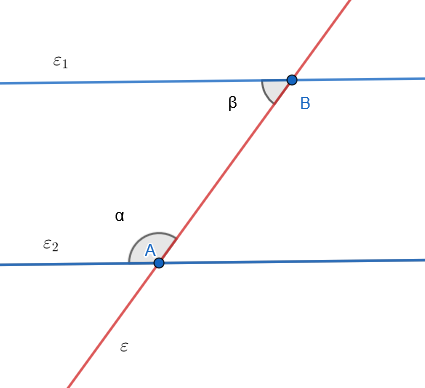{width="230"} ή
  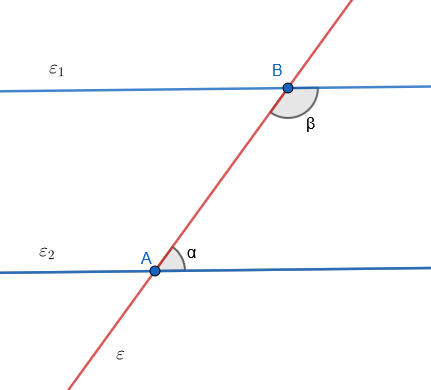{width="230"}

- **Εκτός και επί τα αυτά:** Βρίσκονται και οι δύο εκτός και προς το ίδιο μέρος της τέμνουσας.\
  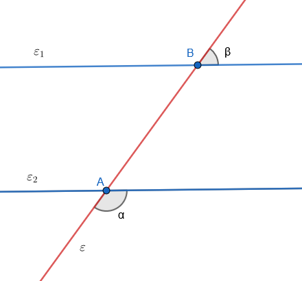{width="230"} ή
  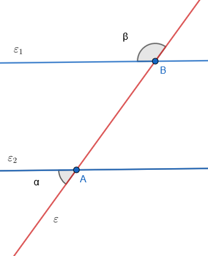{width="230"}

- **Εντός Εκτός εναλλάξ :** Η μία εντός η άλλη εκτός και εκατέρωθεν της τέμνουσας.
  Υπάρχουν διάφορς περιπτώσεις.\
  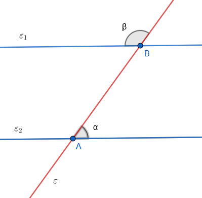{width="230"} ή ...................................
:::

**Παραδείγματα**

1.  Αν ονομάσουμε τις γωνίες στην κορυφή Α ως $A_1, A_2, A_3, A_4$ και στην Β ως $B_1, B_2, B_3, B_4$,\
    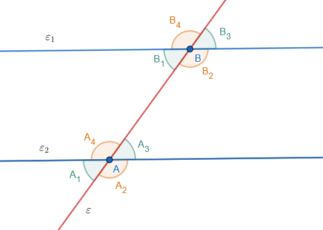{width="450"}\
    τότε οι $A_3$ και $B_1$ είναι **εντός εναλλάξ**.
2.  Οι γωνίες $A_2$ και $B_4$ ονομάζονται **εκτός εναλλάξ**.
3.  Οι γωνίες $A_3$ και $B_3$ είναι **αντίστοιχες** (εντός εκτός και επί τα αυτά).
4.  Οι γωνίες $A_3$ και $B_2$ είναι **εντός και επί τα αυτά**.
5.  Οι γωνίες $A_2$ και $B_3$ είναι **εκτός και επί τα αυτά**.

**Ασκήσεις**

1.  Σχεδιάστε δύο ευθείες που τέμνονται από μια τρίτη και κυκλώστε ένα ζεύγος εντός εναλλάξ γωνιών.
2.  Ονομάστε όλα τα ζεύγη εντός εκτός και επί τα αυτά γωνιών σε ένα σχήμα δύο ευθειών και μιας τέμνουσας.

> > κάντε το σχήμα

3.  Ποια η διαφορά μεταξύ εντός εναλλάξ και εκτός εναλλάξ γωνιών;.
4.  Σε σχήμα με δύο ευθείες $xx'$ και $yy'$ και τέμνουσα $zz'$, εντοπίστε τις γωνίες εντός και επί τα αυτά.

> > Κάντε το σχήμα

5.  Αν δύο γωνίες είναι κατά κορυφήν, μπορούν να είναι και εντός εναλλάξ;.
6.  Σχεδιάστε δύο παράλληλες ευθείες και ονομάστε τις 8 γωνίες που σχηματίζονται με μια τέμνουσα.
7.  Προσδιορίστε τη θέση των γωνιών "εκτός και επί τα αυτά" σε ένα σχήμα.

> > κάντε το σχήμα

8.  Αν μια γωνία είναι "εντός", πού πρέπει να βρίσκεται η άλλη για να είναι "εντός εναλλάξ";.

> > Σχεδιάστε το

9.  Σχεδιάστε τρεις συγκλίνουσες ευθείες. Σχηματίζουν ζεύγη "εντός εναλλάξ";
10. Σχεδιάστε μια τέμνουσα που να τέμνει κάθετα δύο ευθείες. Ονομάστε τα ζεύγη των γωνιών.

------------------------------------------------------------------------

### **Ισότητα Οξειών ή Αμβλειών Γωνιών**

::: {style="background-color: #c0d4b8; border: 2px solid #2f3e50; color: #25188a; padding: 15px; border-radius: 5px;"}
**Θεωρία και Ιδιότητες**

Όταν δύο παράλληλες ευθείες τέμνονται από μια τρίτη, ισχύουν οι εξής ιδιότητες ισότητας:\
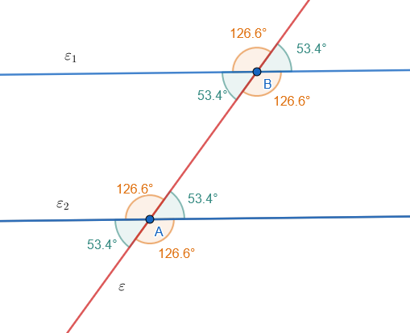{width="450"}

1.  Οι **εντός εναλλάξ** γωνίες είναι ίσες.

2.  Οι **εκτός εναλλάξ** γωνίες είναι ίσες.

3.  Οι **αντίστοιχες** (***εντός εκτός και επί τα αυτά***) γωνίες είναι ίσες.

4.  Επειδή οι κατά κορυφήν γωνίες είναι πάντα ίσες, όλες οι οξείες γωνίες του συστήματος είναι ίσες μεταξύ τους και όλες οι αμβλείες είναι επίσης ίσες μεταξύ τους.

5.  Μια οξεία και μια αμβλεία γωνία στο σύστημα αυτό είναι πάντα **παραπληρωματικές**.

**Κριτήριο παραλληλίας:** Αν δύο ευθείες τεμνόμενες από τρίτη σχηματίζουν τις εντός εναλλάξ γωνίες ίσες, τότε οι ευθείες είναι παράλληλες.
:::

**Παραδείγματα**

1.  Αν μια οξεία γωνία είναι $60^\circ$, τότε όλες οι άλλες τρεις οξείες γωνίες είναι επίσης $60^\circ$.
2.  Σε δύο παράλληλες ευθείες, αν οι εντός εναλλάξ γωνίες είναι $A_3$ και $B_1$, τότε $A_3 = B_1$.
3.  Αν σε εντός εκτός και επί τα αυτά γωνίες μια γωνία είναι $50^\circ$ και η άλλη είναι επίσης $50^\circ$, οι ευθείες είναι παράλληλες.
4.  Οι κατά κορυφήν γωνίες $A_1$ και $A_3$ είναι ίσες ανεξάρτητα από την παραλληλία, αλλά αν οι ευθείες είναι παράλληλες, είναι ίσες και με τις $B_1$ και $B_3$.
5.  Αν δύο γωνίες έχουν τις πλευρές τους παράλληλες και είναι και οι δύο οξείες, τότε είναι ίσες.

**Ασκήσεις**

1.  Δίνονται δύο παράλληλες ευθείες και μια οξεία γωνία $39^\circ 16' 40"$. Βρείτε όλες τις οξείες γωνίες του σχήματος.
2.  Αποδείξτε ότι αν οι εκτός εναλλάξ γωνίες είναι ίσες, οι ευθείες είναι παράλληλες.
3.  Σε παράλληλες ευθείες $xx' // yy'$, αν μια γωνία είναι $60^\circ 10'$, πόσες μοίρες είναι η εντός εναλλάξ της;.
4.  Υπολογίστε τις 8 γωνίες αν η μία είναι τα $2/3$ της ορθής και οι ευθείες είναι παράλληλες.
5.  Σχεδιάστε δύο γωνίες με πλευρές παράλληλες και ομόρροπες και διαπιστώστε την ισότητά τους.
6.  Αν δύο ευθείες τέμνονται από τρίτη και οι εντός εκτός και επί τα αυτά γωνίες είναι $75^\circ$, είναι οι ευθείες παράλληλες;.
7.  Σε ένα παραλληλόγραμμο, εξηγήστε γιατί οι απέναντι γωνίες είναι ίσες χρησιμοποιώντας την ιδιότητα των παραλλήλων.
8.  Αν οι διχοτόμοι δύο εντός εναλλάξ γωνιών παραλλήλων είναι παράλληλες, αποδείξτε το.
9.  Βρείτε το μέτρο των 8 γωνιών αν η μία οξεία είναι $58^\circ$.

------------------------------------------------------------------------

### **Παραπληρωματικές Γωνίες (Οξεία + Αμβλεία)**

::: {style="background-color: #c0d4b8; border: 2px solid #2f3e50; color: #25188a; padding: 15px; border-radius: 5px;"}
**Θεωρία και Ιδιότητες**

Όταν δύο παράλληλες ευθείες τέμνονται από μια τρίτη, μια οξεία και μια αμβλεία γωνία είναι παραπληρωματικές, δηλαδή το άθροισμά τους είναι $180^\circ$ (ή 2 ορθές).
Αυτό συμβαίνει επειδή:

1.  Οι **εντός και επί τα αυτά** μέρη γωνίες είναι παραπληρωματικές.

2.  Οι **εκτός και επί τα αυτά** μέρη γωνίες είναι παραπληρωματικές.

3.  Κάθε οξεία γωνία είναι παραπληρωματική με την εφεξής της αμβλεία γωνία, η οποία λόγω παραλληλίας είναι ίση με όλες τις άλλες αμβλείες γωνίες του συστήματος.

> > Δείτε τα παραπάνω σχήματα
:::

**Παραδείγματα**

1.  Αν μια οξεία γωνία είναι $40^\circ$, η παραπληρωματική της αμβλεία είναι $180^\circ - 40^\circ = 140^\circ$.
2.  Σε ένα παραλληλόγραμμο, οι διαδοχικές γωνίες είναι παραπληρωματικές (π.χ. $A + B = 180^\circ$).
3.  Αν μια γωνία είναι $35^\circ 56' 42"$, η παραπληρωματική της είναι $144^\circ 3' 18"$.
4.  Οι γωνίες "εντός και επί τα αυτά" $A_3$ και $B_2$ έχουν άθροισμα 2 ορθές.
5.  Αν δύο γωνίες έχουν πλευρές παράλληλες, η μία οξεία και η άλλη αμβλεία, τότε είναι παραπληρωματικές.

**Ασκήσεις**

1.  Αν μια γωνία σε σύστημα παραλλήλων είναι $60^\circ 10'$, βρείτε την παραπληρωματική της.
2.  Αποδείξτε ότι αν οι εντός και επί τα αυτά γωνίες είναι παραπληρωματικές, οι ευθείες είναι παράλληλες.
3.  Σε παραλληλόγραμμο $ΑΒΓΔ$, αν $A = 136^\circ 20'$, βρείτε τη γωνία $B$.
4.  Βρείτε το παραπλήρωμα μιας γωνίας που είναι τα $3/5$ της ορθής σε σύστημα παραλλήλων.
5.  Αν η διαφορά δύο παραπληρωματικών γωνιών σε παράλληλες είναι $50^\circ$, βρείτε τις γωνίες.
6.  Δείξτε ότι οι διχοτόμοι δύο εντός και επί τα αυτά γωνιών είναι κάθετοι μεταξύ τους.
7.  Υπολογίστε όλες τις γωνίες αν μια αμβλεία είναι $120^\circ$.
8.  Αν μια γωνία είναι $73^\circ 52' 20"$, πόσο είναι το μέτρο της εντός και επί τα αυτά γωνίας της;.
9.  Αν μια γωνία $x$ είναι πενταπλάσια της παραπληρωματικής της, βρείτε τις γωνίες σε σχήμα παραλλήλων.

::: callout-tip
Να θυμάστε ότι πάντα:

- όλες οι οξείες γωνίες του σχήματος είναι ίσες μεταξύ τους

- όλες οι αμβλείες γωνίες του σχήματος είναι ίσες μεταξύ τους

- μια αξεία και μια αμβλεία είναι μεταξύ τους παραπληρωματικές
:::

::: callout-tip
Να θυμάστε κάθε ζευγάρι γωνιών ονοματίζονται με τις λέξεις

1.  **ΕΝΤΟΣ** αν είναι εντός της ζώνης των παραλλήλων ή **ΕΚΤΟΣ** αν είναι εκτός της ζώνης των παραλλήλων και

2.  **ΕΠΙ ΤΑ ΑΥΤΑ** αν είναι από την ίδια πλευρά σε σχέση με την τέμνουσα ή **ΕΝΑΛΛΑΞ** αν βρίσκονται εκατέρωθεν της τέμνουσας.

Έτσι έχουμε γωνίες

**εντός εναλλάξ**

**εκτός εναλλάξ**

**εντός εκτός εναλλάξ**

**εκτός και επι τα αυτά**

**εντός εκτός και επί τα αυτά** κ.τ.λ.
:::

### **Κριτήρια Παραλληλίας (Πώς αποδεικνύουμε ότι δύο ευθείες είναι παράλληλες)**

Δύο ευθείες είναι παράλληλες αν τεμνόμενες από μια τρίτη σχηματίζουν:

- Δύο γωνίες **εντός εναλλάξ ίσες**.

- Δύο γωνίες **εντός εκτός και επί τα αυτά ίσες**.

- Δύο γωνίες **εντός και επί τα αυτά παραπληρωματικές**.

- Επίσης, δύο ευθείες **κάθετες στην ίδια ευθεία** (σε διαφορετικά σημεία) είναι μεταξύ τους παράλληλες.

------------------------------------------------------------------------

### **Ασκήσεις**

**Άσκηση 1 (Υπολογισμός γωνιών):** Σε δύο παράλληλες ευθείες $\epsilon_1$ και $\epsilon_2$ που τέμνονται από ευθεία $\delta$, μια γωνία $\hat{A}_1$ είναι $42^\circ$.
Να βρεθούν οι υπόλοιπες γωνίες.

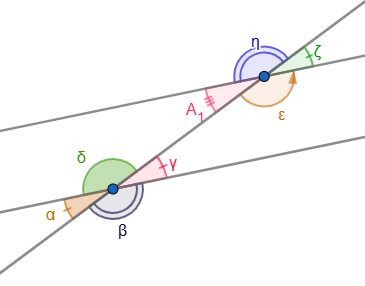

- **Λύση:**

Η γωνία $\hat{ε}$ είναι παραπληρωματική της $\hat{A}_1$, άρα $\hat{ε} = 180^\circ - 42^\circ = 138^\circ$.
Οι γωνίες $\hat{η}, \hat{ζ}$ προκύπτουν ως κατακορυφήν ($\hat{ζ}=42^\circ, \hat{η}=138^\circ$).
Λόγω παραλληλίας, οι αντίστοιχες γωνίες στην $\epsilon_2$ θα είναι ίδιες ($\hat{α}=\hat{γ}=42^\circ, \hat{β}=\hat{δ}=138^\circ$ κτλ.).

**Άσκηση 2 (Σε τρίγωνο):** Δίνεται τρίγωνο $ΑΒΓ$ και ευθεία $ε_1$ που διέρχεται από το $Α$ και είναι παράλληλη στη $ΒΓ$.
Να αποδείξετε ότι το άθροισμα των γωνιών του τριγώνου είναι $180^\circ$.\
{width="400"}

- **Λύση:**

Επειδή $ε_1 // ΒΓ$, η γωνία $φ$ είναι ίση με τη γωνία $\hat{B}$ ώς εντός εναλλάξ και η γωνία $ω$ ίση με τη γωνία $\hat{\Gamma}$ ως **εντός εναλλάξ**.
Επειδή οι $\hat ω, \hat{A}, \hat φ$ σχηματίζουν ευθεία γωνία ($180^\circ$), τότε και $\hat{A} + \hat{B} + \hat{\Gamma} = 180^\circ$.

**Άσκηση 3 (Υπολογισμός Γωνιών)** Σε ένα σχήμα, οι ευθείες $\epsilon_1$ και $\epsilon_2$ είναι παράλληλες ($\epsilon_1 // \epsilon_2$) και τέμνονται από μια ευθεία $AB$.
Η ημιευθεία $A\delta$ είναι η **διχοτόμος** της γωνίας $\widehat{\Gamma AB}$ και γνωρίζουμε ότι η γωνία $\widehat{\Gamma A\delta}$ είναι ίση με $75^\circ$.

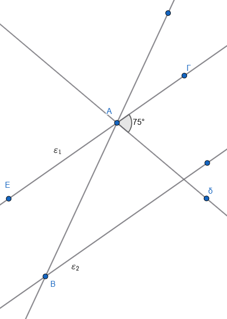{width="366"}

**Ζητούμενα:**

1.  Να υπολογίσετε το μέτρο της γωνίας $\widehat{\Gamma AB}$.

2.  Να βρείτε τη γωνία $\omega$, η οποία βρίσκεται στην ευθεία $\epsilon_2$ και είναι **εντός εναλλάξ** της γωνίας $\widehat{\Gamma AB}$.

3.  Αν υπάρχει μια άλλη ημιευθεία $B\zeta$ στην $\epsilon_2$ που είναι διχοτόμος της γωνίας $\widehat{KB\Delta}$ (όπου $\widehat{KB\Delta}$ είναι κατακορυφήν της $\omega$), να αποδείξετε ότι η γωνία $\widehat{\zeta B\Delta}$ είναι $75^\circ$.

**Προτεινόμενη Λύση**

- **Ερώτημα 1:** Εφόσον η $A\delta$ είναι διχοτόμος της γωνίας $\widehat{\Gamma AB}$, την χωρίζει σε δύο ίσες γωνίες.
  Επομένως, η συνολική γωνία $\widehat{\Gamma AB}$ είναι το διπλάσιο της $\widehat{\Gamma A\delta}$, δηλαδή: $\widehat{\Gamma AB} = 2 \cdot 75^\circ = 150^\circ$.

- **Ερώτημα 2:** Επειδή οι ευθείες $\epsilon_1$ και $\epsilon_2$ είναι παράλληλες και τέμνονται από την $AB$, οι **εντός εναλλάξ** γωνίες τους είναι **ίσες**.
  Άρα, η γωνία $\omega$ είναι ίση με τη γωνία $\widehat{\Gamma AB}$, οπότε: $\omega = 150^\circ$.

- **Ερώτημα 3:** Οι γωνίες $\widehat{KB\Delta}$ και $\omega$ είναι **κατακορυφήν**, άρα είναι ίσες: $\widehat{KB\Delta} = \omega = 150^\circ$.
  Επειδή η $B\zeta$ είναι διχοτόμος της $\widehat{KB\Delta}$, η γωνία $\widehat{\zeta B\Delta}$ θα είναι το μισό της, δηλαδή: $150^\circ / 2 = \mathbf{75^\circ}$.

**Επιπλέον Ιδιότητα (για προχωρημένους)** αν φέραμε τις διχοτόμους δύο **εντός εναλλάξ** γωνιών (όπως η $A\delta$ και η $B\zeta$ στην παραπάνω άσκηση), αυτές οι διχοτόμοι θα ήταν **παράλληλες μεταξύ τους**.

Αντίστοιχα, οι διχοτόμοι δύο **εντός και επί τα αυτά** γωνιών είναι πάντοτε **κάθετες** μεταξύ τους.

**Άσκηση 4** : Να βρείτε τις σημειωμένες γωνίες στα παρακάτω σχήματα.

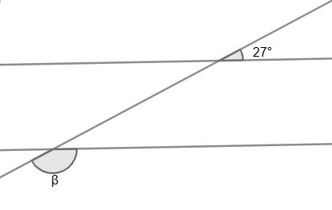{width="246"}

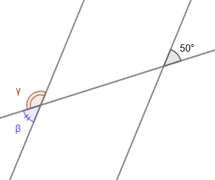{width="226"}

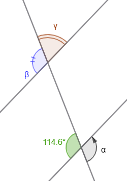{width="173"}

**Άσκηση 5**: Να υπολογίσετε τους αγνώστους στα παρακάτω σχήματα.

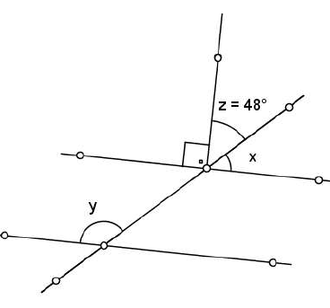

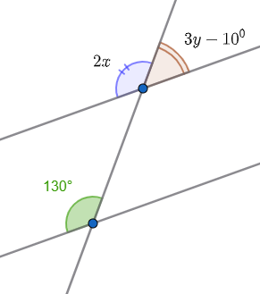

**Άσκηση 6**: Να υπολογίσετε τις άγνωστες γωνίες στο παρακάτω σχήμα.

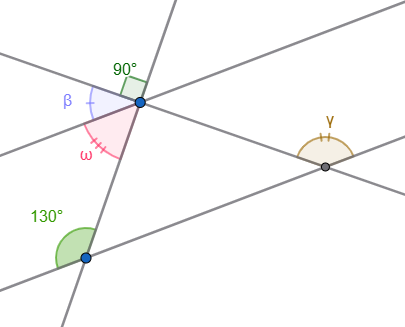

**Άσκηση 7**: Σχεδιάστε ένα παραλληλόγραμμο.
Αν ή μία ογεία γωνία του είναι $38^ο$, να υπολογίσετε τις άλλες γωνίες του παραλληλογράμμου.

**Άσκηση 8**: Στό παρακάτω παραλληλόγραμμο ΑΒΓΔ, να υπολογίσετε τις γωνίες $\hatγ$, $\hatφ$, $\hatθ$ και $\hatω$.

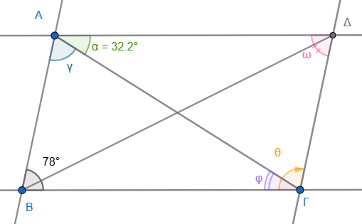{width="399"}

**Άσκηση 9**: Στο παρακάτω σχήμα η ΒΕ είναι διχοτόμος της γωνίας ΑΒΓ

1.  Να υπολογίσετε τις γωνίες που είναι σημειωμένες με μικρά γράμματα.
2.  Τι τρίγωνο είναι το $\overset{\triangle}{ABΕ}$ ώς προς το είδος των πλερών;
3.  Τι τρίγωνο είναι το $\overset{\triangle}{ΕΔΖ}$ ώς προς το είδος των πλευρών;
4.  Τι τρίγωνο είναι το $\overset{\triangle}{ΒΓΖ}$ ώς προς το είδος των πλευρών;

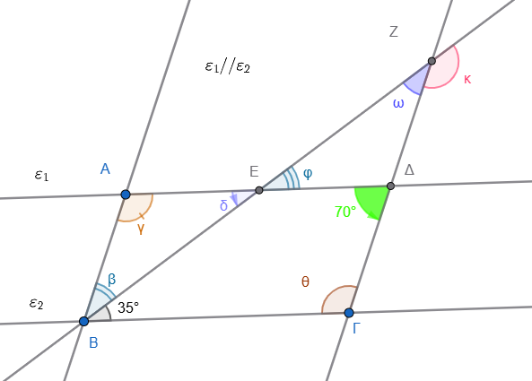{width="497"}

**Άσκηση10**: Να υπολογίσετε την γωνία $\hatθ$ στο παρακάτω σχήμα.

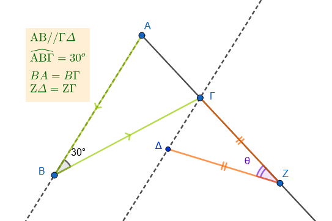

**Άσκηση 11 :** Να υπολογίσετε τις γωνίες $\hatβ, \hatγ, \hatδ, \hatε, \hatζ, \hatθ$ στο παρακάτω σχήμα

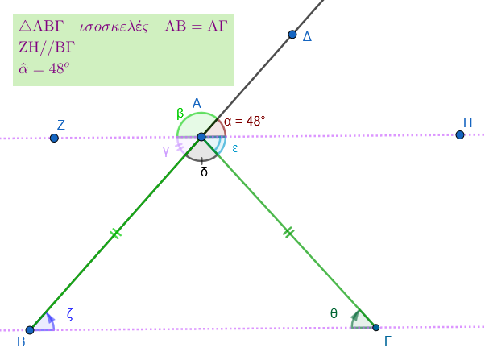{width="415"}

**Ασκηση 12**: Να υπολογίσετε τις γωνίες $\hatε, \hatζ, \hatη, \hatθ$ στο παρακάτω σχήμα.

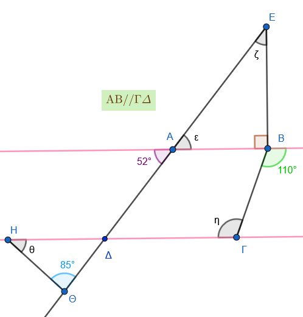{width="374"}

**Ασκηση 13**: Να υπολογίσετε την γωνία $\hatφ$ στο παρακάτω σχήμα.

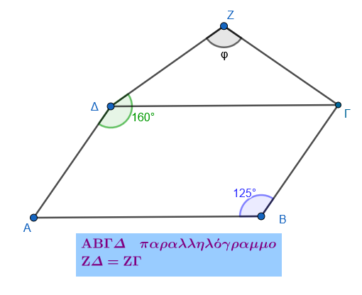{width="350"}

**Ασκηση 14**: Να υπολογίσετε τις γωνίες $\hatγ, \hatδ, \hatε, \hatζ$ στο παρακάτω σχήμα.

Τι συμπεραίνετε για την γωνία $\hatζ$

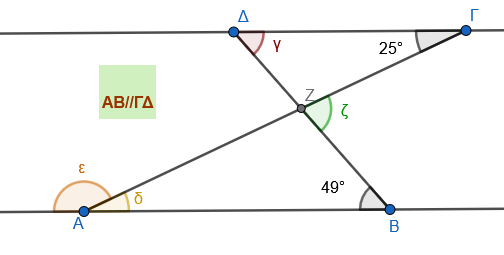{width="389"}

**Ασκηση 15**: Να υπολογίσετε τις γωνίες $\hatβ, \hatδ, \hatε, \hatζ$ στο παρακάτω σχήμα.

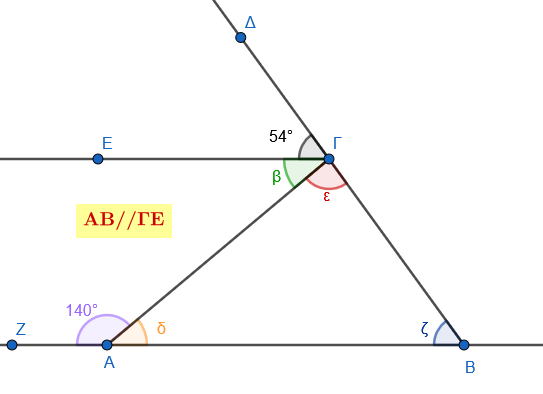{width="369"}

::: {style="background-color: #f0f8cc; border: 2px solid #2f3e50; color: #25188a; padding: 15px; border-radius: 5px;"}
ΚΑΛΗ ΜΕΛΕΤΗ !
:::
