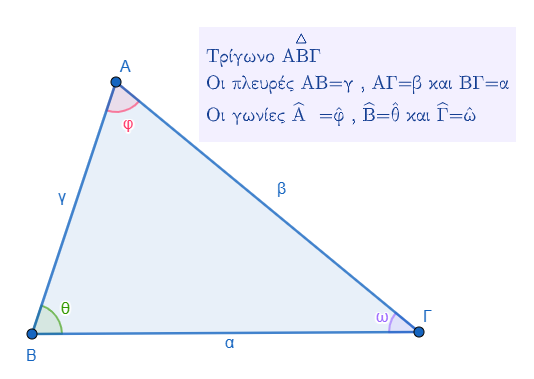
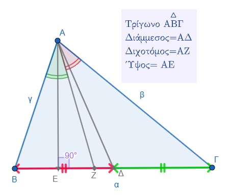
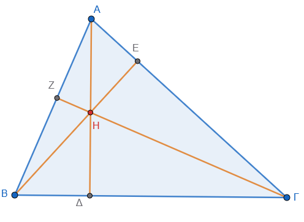
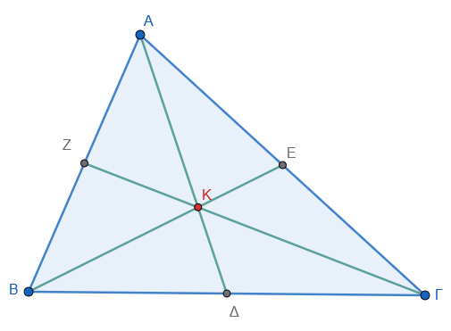
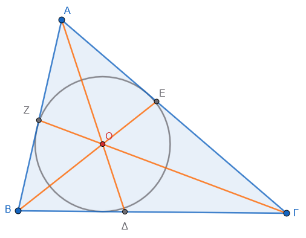
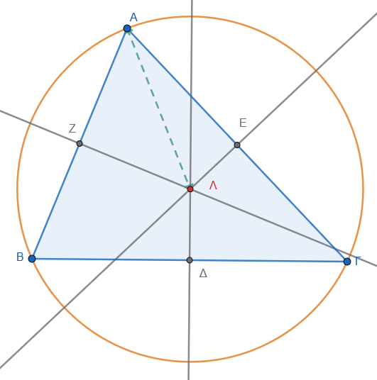
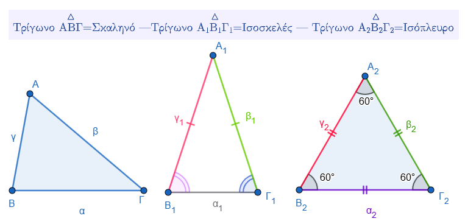
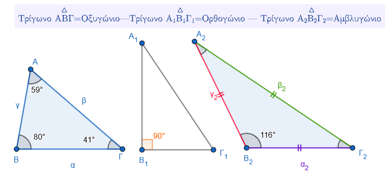

\usepackage{wasysym}

```{=html}
<!-- Φόρτωση βιβλιοθήκης GeoGebra -->
<script src="https://www.geogebra.org/apps/deployggb.js"</script>

<!-- Συνάρτηση δημιουργίας applets -->
<script>
function createGeoGebra(containerId, materialId, width = 700, height = 500) {
  var params = {
    "id": "ggb-" + containerId,
    "material_id": materialId,
    "width": width,
    "height": height,
    "showToolBar": true,
    "showMenuBar": false,
    "showAlgebraInput": true
  };
  
  var applet = new GGBApplet(params, '5.2');
  applet.inject(containerId);
}
</script>
```

------------------------------------------------------------------------

## Στοιχεία τριγώνου - Είδη τριγώνων

### **Ενότητα 1: Στοιχεία του Τριγώνου**

::: {style="background-color: #c0d4b8; border: 2px solid #2f3e50; color: #25188a; padding: 15px; border-radius: 5px;"}
**Θεωρία και Ορισμοί**

Το τρίγωνο είναι το **απλούστερο από τα πολύγωνα** και ορίζεται ως μια κλειστή τεθλασμένη γραμμή με τρεις πλευρές.
Σχηματίζεται από τρία σημεία (κορυφές) που δεν βρίσκονται στην ίδια ευθεία, τα οποία συνδέονται με τρία ευθύγραμμα τμήματα (πλευρές).
Είναι πάντα επίπεδο και κυρτό σχήμα και δεν διαθέτει διαγώνιους.

**Κύρια και Δευτερεύοντα Στοιχεία**

1.  **Κύρια Στοιχεία:** Οι 3 κορυφές (Α, Β, Γ), οι 3 πλευρές (ΑΒ, ΒΓ, ΓΑ) και οι 3 γωνίες (Α, Β, Γ).



2.  **Δευτερεύοντα Στοιχεία:**



- **Ύψη:** Οι κάθετοι από μια κορυφή προς την απέναντι πλευρά. Το σημείο τομής τους λέγεται **ορθόκεντρο**.

{width="350"}

- **Διάμεσοι:** Τα τμήματα που ενώνουν μια κορυφή με το μέσο της απέναντι πλευράς. Το σημείο τομής τους λέγεται **βαρύκεντρο** ή κέντρο βάρους.

{width="350"}

  $ΑΚ=2ΚΔ$
  
  
- **Διχοτόμοι:** Τα τμήματα που χωρίζουν τις γωνίες σε δύο ίσα μέρη. Το σημείο τομής τους είναι το κέντρο του εγγεγραμμένου κύκλου.

 {width="350"}
 
- **Μεσοκάθετοι:** Οι ευθείες που είναι κάθετες στα μέσα των πλευρών. Το σημείο τομής τους είναι το κέντρο του περιγεγραμμένου κύκλου.

{width="350"}


**Ιδιότητες**

- Το **άθροισμα των γωνιών** κάθε τριγώνου είναι 180° (ή 2 ορθές).
- **Τριγωνική Ανισότητα:** Κάθε πλευρά είναι μικρότερη από το άθροισμα των άλλων δύο και μεγαλύτερη από τη διαφορά τους.
- Η **περίμετρος (2τ)** ισούται με το άθροισμα των πλευρών: $2\tau = \alpha + \beta + \gamma$.
:::

**Παραδείγματα**

1.  Στο τρίγωνο ΑΒΓ, η πλευρά που βρίσκεται απέναντι από την κορυφή Α ονομάζεται α.
2.  Αν ένα τρίγωνο έχει πλευρές 5cm, 7cm και 4cm, η περίμετρός του είναι 16cm.
3.  Σε τρίγωνο με γωνίες Α=50° και Β=60°, η τρίτη γωνία Γ είναι 70°.
4.  Σε ένα αμβλυγώνιο τρίγωνο, δύο από τα ύψη του βρίσκονται εκτός του τριγώνου.
5.  Ένα τρίγωνο με πλευρές 12cm, 8cm και 25cm δεν μπορεί να κατασκευαστεί γιατί $25 \> 12+8$.

**Ασκήσεις**

1.  Κατονομάστε τα κύρια στοιχεία ενός τριγώνου ΔΕΖ.
2.  Αν Α=72° και Β=47°, υπολογίστε τη γωνία Γ.
3.  Εξετάστε αν υπάρχει τρίγωνο με πλευρές 5, 4 και 10.
4.  Σχεδιάστε ένα τρίγωνο και τις τρεις διαμέσους του.
5.  Ορίστε τι είναι το ύψος ενός τριγώνου.
6.  Ποιο είναι το άθροισμα των γωνιών ενός τριγώνου σε μοίρες;.
7.  Αν μια πλευρά είναι 10m, τι πρέπει να ισχύει για το άθροισμα των άλλων δύο;.
8.  Βρείτε την εξωτερική γωνία μιας κορυφής αν οι άλλες δύο εσωτερικές είναι 40° και 70°.
9.  Τι ονομάζουμε βαρύκεντρο τριγώνου;.
10. Κατασκευάστε τρίγωνο με πλευρές 3cm, 4cm, 5cm χρησιμοποιώντας διαβήτη.

------------------------------------------------------------------------

### **Είδη Τριγώνων**

::: {style="background-color: #c0d4b8; border: 2px solid #2f3e50; color: #25188a; padding: 15px; border-radius: 5px;"}
**Θεωρία και Ορισμοί**

Τα τρίγωνα ταξινομούνται με δύο τρόπους: βάσει των γωνιών τους και βάσει των πλευρών τους.

1.  **Ως προς τις πλευρές:**

    - **Σκαληνό:** Και οι τρεις πλευρές είναι άνισες.
    - **Ισοσκελές:** Έχει δύο πλευρές ίσες.
    - **Ισόπλευρο:** Και οι τρεις πλευρές είναι ίσες.

    

2.  **Ως προς τις γωνίες:**

    - **Ορθογώνιο:** Έχει μία γωνία ορθή (90°). Η απέναντι πλευρά λέγεται **υποτείνουσα** και οι άλλες δύο **κάθετες πλευρές**.
    - **Αμβλυγώνιο:** Έχει μία γωνία αμβλεία (\>90°).
    - **Οξυγώνιο:** Έχει και τις τρεις γωνίες οξείες (\<90°).

    

**Ιδιότητες**

- Στο **ισοσκελές τρίγωνο**, οι γωνίες της βάσης είναι ίσες.
- Στο **ισόπλευρο τρίγωνο**, κάθε γωνία είναι 60° και έχει 3 άξονες συμμετρίας.
- Στο **ορθογώνιο τρίγωνο**, οι δύο οξείες γωνίες είναι συμπληρωματικές (άθροισμα 90°).
- Κάθε ισόπλευρο τρίγωνο είναι και ισοσκελές.
:::

**Παραδείγματα**

1.  Ένα τρίγωνο με γωνίες 90°, 45° και 45° είναι ορθογώνιο και ισοσκελές.
2.  Ένα τρίγωνο με πλευρές 5cm, 5cm και 5cm είναι ισόπλευρο.
3.  Αν η γωνία κορυφής ενός ισοσκελούς τριγώνου είναι 100°, οι γωνίες βάσης είναι από 40°.
4.  Σε ένα ορθογώνιο τρίγωνο, αν η μία οξεία γωνία είναι 30°, η άλλη είναι 60°.
5.  Στο διάγραμμα Venn, το σύνολο των ισοπλεύρων τριγώνων είναι υποσύνολο των ισοσκελών.

**Ασκήσεις**

1.  Ορίστε το οξυγώνιο τρίγωνο.
2.  Πόσες μοίρες είναι κάθε γωνία ενός ισοπλεύρου τριγώνου;.
3.  Αν ένα ισοσκελές τρίγωνο έχει γωνία κορυφής 40°, βρείτε τις γωνίες της βάσης.
4.  Τι ονομάζουμε υποτείνουσα;.
5.  Μπορεί ένα τρίγωνο να είναι ταυτόχρονα ορθογώνιο και αμβλυγώνιο; Αιτιολογήστε.
6.  Σχεδιάστε ένα σκαληνό τρίγωνο.
7.  Αν δύο γωνίες ενός τριγώνου είναι 45° και 45°, τι είδους τρίγωνο είναι ως προς τις πλευρές και ως προς τις γωνίες;.
8.  Πόσους άξονες συμμετρίας έχει το ισόπλευρο τρίγωνο;.
9.  Σε ένα ορθογώνιο τρίγωνο, η μία οξεία γωνία είναι 58° 20'. Βρείτε την άλλη.
10. Εξηγήστε τη σχέση μεταξύ ισοσκελούς και ισοπλεύρου τριγώνου χρησιμοποιώντας σύνολα.


------------------------------------------------------------------------

## **Ασκήσεις**

**Αντιστοίχιση**

1.  **Αντιστοίχιση:** Αντιστοιχίστε το είδος του τριγώνου με την ιδιότητά του:
    - **Ισόπλευρο:** α) Έχει δύο πλευρές ίσες.
    - **Ισοσκελές:** β) Έχει όλες τις πλευρές άνισες.
    - **Σκαληνό:** γ) Έχει όλες τις πλευρές ίσες.


**Υπολογιστικές & Σχεδιαστικές Ασκήσεις**

2.  **Εύρεση γωνίας:** Σε ένα τρίγωνο οι δύο γωνίες είναι 70° και 50°. Βρείτε την τρίτη γωνία.
3.  **Κατάταξη:** Ένα τρίγωνο έχει πλευρές 5 cm, 5 cm και 8 cm. Τι είδους τρίγωνο είναι;
4.  **Σχεδιασμός:** Σχεδιάστε ένα τρίγωνο ΑΒΓ και φέρτε από την κορυφή Α τη διάμεσο ΑΜ και το ύψος ΑΔ. Τι παρατηρείτε αν το τρίγωνο είναι ισοσκελές με βάση τη ΒΓ;
5.  **Υπολογισμός Μήκους:** Σε τρίγωνο ΑΒΓ με πλευρά ΒΓ = 4,4 cm, φέρτε τη διάμεσο ΑΜ. Ποιο είναι το μήκος των τμημάτων ΒΜ και ΜΓ;

**Ασκήσεις Σχεδιασμού & Παρατήρησης**

6.  **Σχεδιασμός Δευτερευόντων Στοιχείων:** Σχεδιάστε ένα τυχαίο τρίγωνο ΑΒΓ. Από την κορυφή Α, φέρτε και ονομάστε τη διάμεσο ΑΜ και το ύψος ΑΔ.
7.  **Ισοσκελές Τρίγωνο:** Σχεδιάστε ένα τρίγωνο ΑΒΓ με πλευρά ΒΓ = 3 cm και γωνίες $\hat{B}$ = 45° και $\hat{\Gamma}$ = 45°. Φέρτε τη διάμεσο και το ύψος από την κορυφή Α. **Τι παρατηρείτε** για αυτά τα δύο τμήματα;.
8.  **Ορθογώνιο Τρίγωνο:** Σχεδιάστε ένα ορθογώνιο τρίγωνο ΑΒΓ (με ορθή τη γωνία Α) και φέρτε τη διάμεσο ΑΜ προς την υποτείνουσα ΒΓ. Χρησιμοποιήστε έναν διαβήτη για να συγκρίνετε τα τμήματα ΑΜ, ΒΜ και ΓΜ. Τι συμπεραίνετε;.

**Ερωτήσεις Σωστού ή Λάθους**

9.  Χαρακτηρίστε τις παρακάτω προτάσεις **Σ**ωστό - **Λ**άθος:

  * ( ) Το ισόπλευρο τρίγωνο είναι πάντα οξυγώνιο.

  * ( ) Ένα σκαληνό τρίγωνο δεν μπορεί να είναι ορθογώνιο.

  - ( ) Το αμβλυγώνιο τρίγωνο έχει μία μόνο διάμεσο.

  - ( ) Το ισόπλευρο τρίγωνο είναι πάντα οξυγώνιο.

  * ( ) Κάθε τρίγωνο έχει τρεις κορυφές.

  * ( ) Υπάρχει τρίγωνο που δεν έχει ύψη.

  * ( ) Στο ορθογώνιο τρίγωνο όλες οι γωνίες είναι ορθές.

* ( ) Το ύψος τριγώνου είναι πάντα εσωτερικό τμήμα του τριγώνου.\


>> Σκεφτείτε το αμβλυγώνιο τρίγωνο

  * ( ) Σε ένα ισόπλευρο τρίγωνο, κάθε διάμεσος είναι ταυτόχρονα ύψος και διχοτόμος.

10. **Υπολογιστικές Ασκήσεις**

*   **Εύρεση Γωνίας:** Σε ένα τρίγωνο, οι δύο γωνίες είναι 60° και 50°.
  Υπολογίστε το μέτρο της τρίτης γωνίας.

11. Συμπληρώστε τα κενά 

  - Ύψος τριγώνου λέγεται το ............ ευθύγραμμο τμήμα που φέρνουμε από μία κορυφή στην ............ της απέναντι πλευράς.
  - Το σημείο στο οποίο τέμνονται τα τρία ύψη ενός τριγώνου ονομάζεται .............


  * Κάθε ορθογώνιο τρίγωνο έχει μία **....................** γωνία.

  * **....................** λέγεται το τρίγωνο που έχει όλες τις πλευρές του άνισες.

  * **....................** είναι το τρίγωνο στο οποίο όλες οι γωνίες είναι οξείες.


  * **Διάμεσος** τριγώνου λέγεται το τμήμα που **....................** μία κορυφή με το **....................** της απέναντι πλευράς.


12. **Ασκήσεις Υπολογισμού και Κατάταξης**

Εφαρμόστε τις ιδιότητες των τριγώνων για να λύσετε τα παρακάτω:

  * **Εύρεση γωνίας:** Σε ένα τρίγωνο οι δύο γωνίες είναι 52° και 63°.
Υπολογίστε την τρίτη γωνία.
(Υπόδειξη: Το άθροισμα των γωνιών κάθε τριγώνου είναι 180°).

  * **Αναγνώριση είδους:**

    1.  Ένα τρίγωνο έχει πλευρές 5 cm, 5 cm και 8 cm.
Τι είδους είναι ως προς τις πλευρές του;

    2.  Ένα τρίγωνο έχει γωνίες 120°, 30° και 30°.
Τι είδους είναι ως προς τις γωνίες και τις πλευρές του;

  
13. **Ασκήσεις Σχεδιασμού και Παρατήρησης**

Χρησιμοποιήστε τα γεωμετρικά σας όργανα (χάρακα, μοιρογνωμόνιο, γνώμονα) για τις παρακάτω κατασκευές:

  * **Σύμπτωση στοιχείων:** Σχεδιάστε ένα τρίγωνο ΑΒΓ με ΒΓ = 3 cm και τις γωνίες Β και Γ ίσες με 45° η καθεμία.
Φέρτε τη διάμεσο και το ύψος από την κορυφή Α.
**Τι παρατηρείτε** για αυτά τα δύο τμήματα;

  * **Ορθογώνιο τρίγωνο:** Σχεδιάστε ένα ορθογώνιο τρίγωνο ΑΒΓ με υποτείνουσα τη ΒΓ.
Φέρτε τη διάμεσο ΑΜ προς την υποτείνουσα και συγκρίνετε με τον διαβήτη τα τμήματα ΑΜ, ΒΜ και ΓΜ.
**Τι συμπεραίνετε** για τα μήκη τους;

  * **Ύψη αμβλυγωνίου:** Σχεδιάστε ένα αμβλυγώνιο τρίγωνο και φέρτε τα τρία ύψη του.
Πόσα από αυτά βρίσκονται **εκτός** του τριγώνου;

14. **Ασκήσεις Σχεδιασμού και Υπολογισμού**

  - **Υπολογισμός Μηκών:** Σε ένα τρίγωνο ΑΒΓ, η πλευρά ΒΓ είναι 6,4 cm. Φέρτε τη διάμεσο ΑΜ. Στη συνέχεια, φέρτε τις διαμέσους ΑΚ και ΑΛ των τριγώνων ΑΒΜ και ΑΓΜ αντίστοιχα και βρείτε το μήκος των τμημάτων **ΚΜ** και **ΛΓ**.
  - **Συνδυαστική Κατασκευή:** Σχεδιάστε ένα ορθογώνιο τρίγωνο ΑΒΓ με υποτείνουσα τη ΒΓ. Βρείτε τα μέσα Μ και Ν των κάθετων πλευρών ΑΒ και ΑΓ, ενώστε τα και συγκρίνετε το τμήμα ΜΝ με τη διάμεσο που αντιστοιχεί στην υποτείνουσα. Τι παρατηρείτε;.

15. **Ασκήσεις για το Ισοσκελές Τρίγωνο**

- **Ιδιότητες Γωνιών:** Σε ένα ισοσκελές τρίγωνο ΑΒΓ (ΑΒ=ΑΓ) η γωνία $\hat{A}$ είναι 80°. Έστω Ε ένα τυχαίο σημείο στη βάση ΒΓ. Αν πάρουμε σημεία Δ στην ΑΒ και Ζ στην ΑΓ τέτοια ώστε ΒΔ=ΒΕ και ΓΕ=ΓΖ, υπολογίστε τις γωνίες των τριγώνων ΒΔΕ και ΓΖΕ, καθώς και τη γωνία $\Delta\hat{E}Z$.
- **Διχοτόμοι:** Σε ισοσκελές τρίγωνο ΑΒΓ (ΑΒ=ΑΓ), φέρτε τις διχοτόμους των γωνιών της βάσης, ΒΔ και ΓΕ. Αν φέρουμε κάθετες από τα Ε και Δ προς τη βάση ΒΓ (τα τμήματα ΕΗ και ΔΖ αντίστοιχα), μετρήστε με το άνοιγμα του διαβήτη ή με υποδεκάμετρο τις πλευρές των τριγώνων ΒΓΔ και ΓΒΕ και εξετάστε αν είναι ίσα, και επίσης τα τμήματα ΕΗ και ΔΖ.

::: {style="background-color: #f0f8cc; border: 2px solid #2f3e50; color: #25188a; padding: 15px; border-radius: 5px;"}
ΚΑΛΗ ΜΕΛΕΤΗ !
:::
