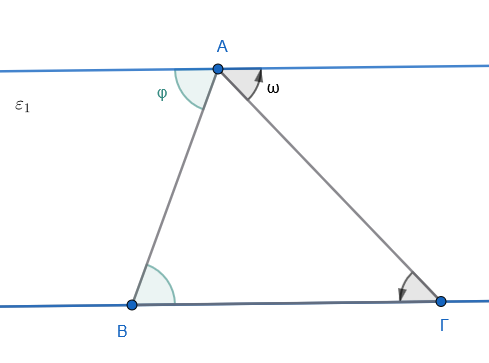
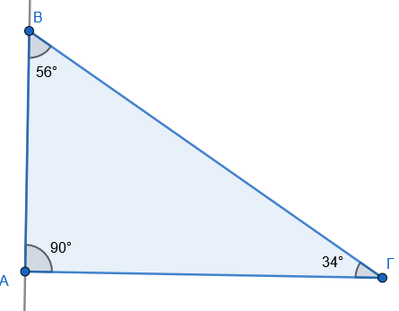
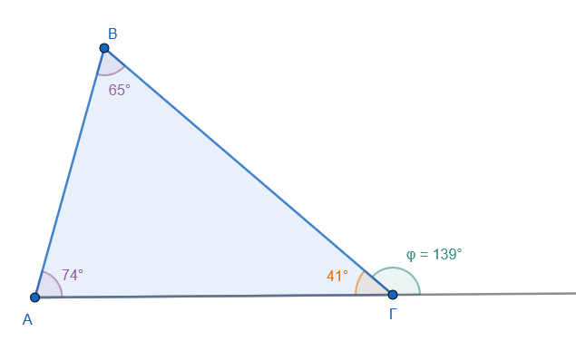

\usepackage{wasysym}

```{=html}
<!-- Φόρτωση βιβλιοθήκης GeoGebra -->
<script src="https://www.geogebra.org/apps/deployggb.js"</script>

<!-- Συνάρτηση δημιουργίας applets -->
<script>
function createGeoGebra(containerId, materialId, width = 700, height = 500) {
  var params = {
    "id": "ggb-" + containerId,
    "material_id": materialId,
    "width": width,
    "height": height,
    "showToolBar": true,
    "showMenuBar": false,
    "showAlgebraInput": true
  };
  
  var applet = new GGBApplet(params, '5.2');
  applet.inject(containerId);
}
</script>
```

------------------------------------------------------------------------

## Άθροισμα γωνιών τριγώνου - Ιδιότητες ισοσκελούς τριγώνου

### **Άθροισμα Γωνιών Τριγώνου**

::: {style="background-color: #c0d4b8; border: 2px solid #2f3e50; color: #25188a; padding: 15px; border-radius: 5px;"}
**Θεωρία και Ορισμοί**

Το άθροισμα των τριών εσωτερικών γωνιών οποιουδήποτε τριγώνου είναι πάντοτε σταθερό και ισούται με **180°** (ή 2 ορθές γωνίες).
Η ιδιότητα αυτή αποτελεί θεμελιώδες θεώρημα της Γεωμετρίας και ισχύει για κάθε είδος τριγώνου (οξυγώνιο, ορθογώνιο ή αμβλυγώνιο).

------------------------------------------------------------------------

{width="400"}

- **Λύση:**

Επειδή $ε_1 // ΒΓ$, η γωνία $φ$ είναι ίση με τη γωνία $\hat{B}$ ώς εντός εναλλάξ και η γωνία $ω$ ίση με τη γωνία $\hat{\Gamma}$ ως **εντός εναλλάξ**.
Επειδή οι $\hat ω, \hat{A}, \hat φ$ σχηματίζουν ευθεία γωνία ($180^\circ$), τότε και $\hat{A} + \hat{B} + \hat{\Gamma} = 180^\circ$.

------------------------------------------------------------------------

**Ιδιότητες και Πορίσματα**

1.  **Ορθογώνιο Τρίγωνο:** Οι δύο οξείες γωνίες ενός ορθογωνίου τριγώνου είναι πάντοτε **συμπληρωματικές**, δηλαδή το άθροισμά τους είναι 90°.\
    {width="350"}

$$\hat B + \hat Γ= 90^ο$$

2.  **Ισόπλευρο Τρίγωνο:** Κάθε γωνία ενός ισοπλεύρου τριγώνου ισούται με **60°** ($180° : 3 = 60°$).

3.  **Εξωτερική Γωνία:** Κάθε εξωτερική γωνία ενός τριγώνου ισούται με το άθροισμα των δύο απέναντι εσωτερικών γωνιών του.\

    \
    {width="450"}

$$\hat φ = \hat Α + \hat Β$$

4.  **Σύγκριση Τριγώνων:** Αν δύο τρίγωνα έχουν δύο γωνίες τους ίσες μία προς μία, τότε αναγκαστικά θα έχουν και την τρίτη γωνία τους ίση.
:::

**Παραδείγματα**

1.  Στο τρίγωνο ΑΒΓ, αν **Α=72°** και **Β=47°**, τότε η γωνία **Γ = 180° - (72° + 47°) = 61°**.
2.  Αν σε ένα τρίγωνο είναι **Β=23° 50'** και **Γ=107° 40'**, τότε η γωνία **Α = 180° - 131° 30' = 48° 30'**.
3.  Σε ορθογώνιο τρίγωνο, αν η μία οξεία γωνία είναι **58° 20'**, η άλλη είναι **90° - 58° 20' = 31° 40'**.
4.  Αν η εξωτερική γωνία στην κορυφή Γ είναι **130°** και το τρίγωνο είναι ορθογώνιο στην κορυφή Α (90°), τότε η εσωτερική γωνία **Β = 130° - 90° = 40°**.
5.  Σε ένα τρίγωνο με γωνίες **38°** και **115° 30'**, η τρίτη γωνία υπολογίζεται αφαιρώντας το άθροισμά τους από τις 180°.

**Ασκήσεις**

1.  Υπολογίστε την τρίτη γωνία τριγώνου ΑΒΓ αν είναι **Α = 32°** και **Γ = 46°** .
2.  Η μία γωνία ενός τριγώνου είναι **70°** και η άλλη είναι τα **2/7** αυτής. Βρείτε όλες τις γωνίες του τριγώνου.
3.  Στο τρίγωνο ΑΒΓ είναι **Α = 23°** και η γωνία **Β = 4Γ**. Υπολογίστε τις γωνίες του.
4.  Αποδείξτε ότι αν σε ένα τρίγωνο ισχύει η σχέση **Α = Β + Γ**, τότε το τρίγωνο είναι ορθογώνιο.
5.  Αν σε ένα τρίγωνο έχουμε  $Β + Γ=78^ο$, εξετάστε τι τρίγωνο είναι.
6.  Αποδείξτε ότι το άθροισμα των εξωτερικών γωνιών κάθε τριγώνου είναι **360°** (4 ορθές).
7.  Βρείτε τις γωνίες ενός τριγώνου αν αυτές είναι ανάλογες προς τους αριθμούς **1, 1** και **4** (εκφρασμένες ως α°, α°, 4α°).
8.  Σε ορθογώνιο τρίγωνο η μία οξεία γωνία είναι **58°**. Πόση είναι η άλλη οξεία γωνία;.
9.  Σε τρίγωνο ΑΒΓ ισχύει **Β - Γ = 90°**. Δείξτε ότι η διχοτόμος της γωνίας Α σχηματίζει γωνία **45°** με την πλευρά ΒΓ.

------------------------------------------------------------------------

### **Ιδιότητες Ισοσκελούς και Ισοπλεύρου Τριγώνου**

::: {style="background-color: #c0d4b8; border: 2px solid #2f3e50; color: #25188a; padding: 15px; border-radius: 5px;"}
**Θεωρία και Ορισμοί**

- **Ισοσκελές Τρίγωνο:** Είναι το τρίγωνο που έχει δύο πλευρές ίσες (ΑΒ = ΑΓ).
  Η τρίτη πλευρά ονομάζεται **βάση** και η απέναντι κορυφή ονομάζεται **κορυφή** του τριγώνου.

- **Ισόπλευρο Τρίγωνο:** Είναι το τρίγωνο που έχει και τις τρεις πλευρές του ίσες (ΑΒ = ΒΓ = ΓΑ).
  Το ισόπλευρο τρίγωνο είναι υποσύνολο των ισοσκελών.

**Ιδιότητες Ισοσκελούς Τριγώνου**

1.  **Ισότητα Γωνιών:** Οι γωνίες της βάσης ενός ισοσκελούς τριγώνου είναι πάντοτε **ίσες**.

2.  **Άξονας Συμμετρίας:** Η διχοτόμος της γωνίας της κορυφής είναι ο άξονας συμμετρίας του τριγώνου.

3.  **Σύμπτωση Γραμμών:** Στην κορυφή ισοσκελούς τριγώνου, η διχοτόμος, η διάμεσος και το ύψος προς τη βάση **συμπίπτουν** στο ίδιο ευθύγραμμο τμήμα.

4.  **Δευτερεύοντα Στοιχεία:** Τα ύψη, οι διάμεσοι και οι διχοτόμοι που αντιστοιχούν στις ίσες πλευρές είναι επίσης **ίσα** μεταξύ τους.

**Ιδιότητες Ισοπλεύρου Τριγώνου**

1.  **Ισογωνιότητα:** Κάθε ισόπλευρο τρίγωνο είναι και **ισογώνιο** με κάθε γωνία του ίση με 60°.

2.  **Άξονες Συμμετρίας:** Έχει **τρεις άξονες συμμετρίας**, που είναι τα ύψη, οι διάμεσοι και οι διχοτόμοι των τριών γωνιών του.

3.  **Ομοιότητα:** Όλα τα ισόπλευρα τρίγωνα είναι **όμοια** μεταξύ τους.
:::

**Παραδείγματα**

1.  Σε ισοσκελές τρίγωνο ΑΒΓ με κορυφή Α, αν η γωνία **Α = 53°**, οι γωνίες της βάσης είναι **(180° - 53°) / 2 = 63,5°**.
2.  Αν η γωνία της βάσης ενός ισοσκελούς είναι **73° 20'**, τότε η γωνία της κορυφής είναι **180° - (2 \* 73° 20') = 33° 20'**.
3.  Αν η γωνία της κορυφής ισοσκελούς τριγώνου είναι **68°'**, τότε κάθε γωνία της βάσης είναι **56**.
4.  Κατασκευή ισοπλεύρου τριγώνου πλευράς **5cm** χρησιμοποιώντας διαβήτη και κανόνα.

**Ασκήσεις**

1.  Σε ισοσκελές τρίγωνο, η γωνία της κορυφής Α είναι κατά **12°** μεγαλύτερη από κάθε γωνία της βάσης. Υπολογίστε τη γωνία που σχηματίζουν οι διχοτόμοι των γωνιών της βάσης.
2.  Αιτιολογήστε γιατί οι γωνίες της βάσης ενός ισοσκελούς τριγώνου είναι πάντοτε **οξείες**.
3.  Αποδείξτε ότι οι **διχοτόμοι** των γωνιών της βάσης ισοσκελούς τριγώνου είναι ίσες.

> > αποδείξτε οτι οι γωνίες της βάσης του τριγώνου που σχηματίζεται είναι ίσες.

4.  Σε ισόπλευρο τρίγωνο ΑΒΓ παίρνουμε στις πλευρές του τμήματα **ΑΑ' = ΒΒ' = ΓΓ'**. Δείξτε ότι το τρίγωνο Α'Β'Γ' είναι ισόπλευρο.
5.  Αποδείξτε ότι σε κάθε ορθογώνιο τρίγωνο η διάμεσος της υποτείνουσας ισούται με το **μισό** της υποτείνουσας.

> > Σχρδιάστε ένα ορθογώνιο τρίγωνο και μετρήστε.

::: {style="background-color: #f0f8cc; border: 2px solid #2f3e50; color: #25188a; padding: 15px; border-radius: 5px;"}
ΚΑΛΗ ΜΕΛΕΤΗ !
:::
