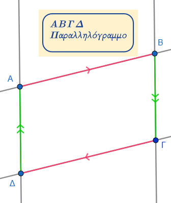
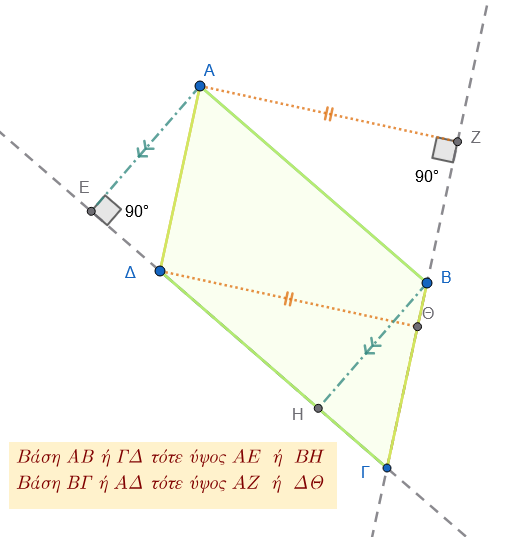
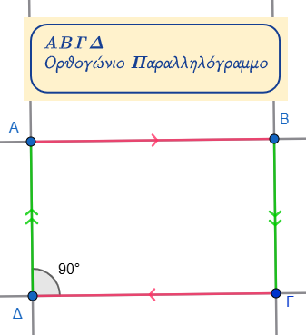
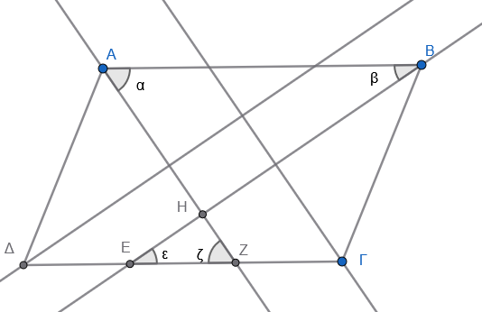
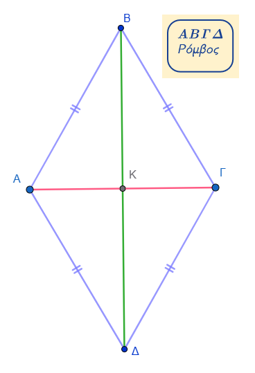
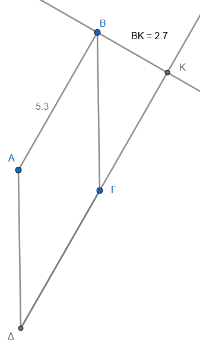
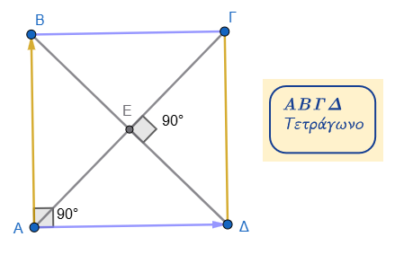
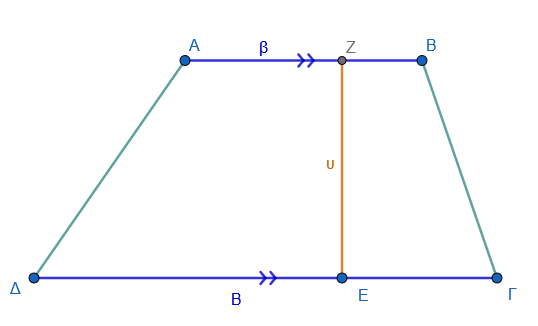
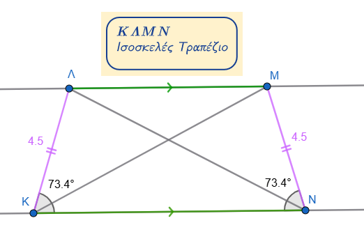

\usepackage{wasysym}

```{=html}
<!-- Φόρτωση βιβλιοθήκης GeoGebra -->
<script src="https://www.geogebra.org/apps/deployggb.js"</script>

<!-- Συνάρτηση δημιουργίας applets -->
<script>
function createGeoGebra(containerId, materialId, width = 700, height = 500) {
  var params = {
    "id": "ggb-" + containerId,
    "material_id": materialId,
    "width": width,
    "height": height,
    "showToolBar": true,
    "showMenuBar": false,
    "showAlgebraInput": true
  };
  
  var applet = new GGBApplet(params, '5.2');
  applet.inject(containerId);
}
</script>
```

------------------------------------------------------------------------

## Παραλληλόγραμμο - Ορθογώνιο - Ρόμβος - Τετράγωνο - Τραπέζιο - Ισοσκελές τραπέζιο

### **Παραλληλόγραμμο**

::: {style="background-color: #c0d4b8; border: 2px solid #2f3e50; color: #25188a; padding: 15px; border-radius: 5px;"}
**Θεωρία και Ορισμοί**

**Παραλληλόγραμμο** ονομάζεται το τετράπλευρο που έχει τις απέναντι πλευρές του παράλληλες ανά δύο.
Είναι πάντοτε ένα κυρτό τετράπλευρο.

- **Ύψος:** Όταν ορίσουμε μια πλευρά ως βάση, **ύψος** είναι η απόσταση της βάσης από την απέναντι πλευρά (το πλάτος της αντίστοιχης ταινίας). Ένα παραλληλόγραμμο έχει δύο ύψη, ανάλογα με τη βάση που επιλέγουμε.\
  {width="250"} {width="350"}\
  \
:::

**Παραδείγματα**

1.  Παραλληλόγραμμο ΑΒΓΔ με πλευρές AB=6cm, ΑΔ=4cm και γωνία Α=75°.
2.  Αν η γωνία Α είναι 60°, τότε η Β=120°, η Γ=60° και η Δ=120°.
3.  Σε παραλληλόγραμμο ΑΒΓΔ, για την βάση ΑΒ, το ύψος είναι το κάθετο τμήμα ΔΕ από την κορυφή Δ προς την ΑΒ.
4.  Αν η μία γωνία είναι 50°, οι υπόλοιπες υπολογίζονται από τις ιδιότητες των παραλλήλων.

**Ασκήσεις**

1.  Κατασκευάστε παραλληλόγραμμο με πλευρές 3cm και 5cm και μία γωνία 45°.
2.  Βρείτε τις γωνίες παραλληλογράμμου αν η μία είναι τριπλάσια της άλλης.
3.  Αν η περίμετρος είναι 18cm και η μία πλευρά διπλάσια της άλλης, βρείτε τις πλευρές.
4.  Αν η γωνία Α είναι τα 3/5 της ορθής, υπολογίστε όλες τις γωνίες.
5.  Βρείτε την περίμετρο αν οι πλευρές είναι 10m και 14m.
6.  Αν το άθροισμα τριών γωνιών είναι 234°, βρείτε τις γωνίες.

------------------------------------------------------------------------

### **Ορθογώνιο**

::: {style="background-color: #c0d4b8; border: 2px solid #2f3e50; color: #25188a; padding: 15px; border-radius: 5px;"}
**Θεωρία και Ορισμοί**

**Ορθογώνιο** ονομάζεται το παραλληλόγραμμο που έχει τις γωνίες του ορθές.

- **Διαστάσεις:** Το μήκος και το πλάτος του ορθογωνίου τα οποία είναι και τα ύψη του.

{width="300"}
:::

**Παραδείγματα**

1.  Ορθογώνιο με διαστάσεις 5cm και 3cm.
2.  Ένα γήπεδο με μήκος 150m και πλάτος 96m.
3.  Φύλλο χαρτιού 30cm x 20cm.

**Ασκήσεις**

1.  Βρείτε τις διαστάσεις ένος ορθογωνίου αν η περίμετρος είναι 300m και το μήκος είναι κατά 10m μεγαλύτερο από το πλάτος.
2.  Αποδείξτε ότι οι διχοτόμοι των γωνιών παραλληλογράμμου σχηματίζουν ορθογώνιο.\
    {width="400"}

> > Απόδείξτε ότι η γωνία Η στο τρίγωνο ΕΖΗ είναι $90^ο$

------------------------------------------------------------------------

### **Ρόμβος**

::: {style="background-color: #c0d4b8; border: 2px solid #2f3e50; color: #25188a; padding: 15px; border-radius: 5px;"}
**Θεωρία και Ορισμοί**

**Ρόμβος** ονομάζεται το παραλληλόγραμμο που έχει όλες τις πλευρές του ίσες.

{width="250"}
:::

**Παραδείγματα**

1.  Ρόμβος με πλευρά 5cm και γωνία 40°.
2.  Ρόμβος με πλευρά 5,3 cm και ύψος 2,7 cm .\
    {width="300"}

**Ασκήσεις**

1.  Αν η μία γωνία ενός ρόμβου είναι 66°, βρείτε όλες τις άλλες γωνίες.
2.  Υπολογίστε την πλευρά ρόμβου αν η περίμετρός του είναι ίση με την περίμετρο ορθογωνίου 18m x 12m.
3.  Κατασκευάστε ρόμβο με πλευρά 4cm και γωνία 60°.

------------------------------------------------------------------------

### **Τετράγωνο**

**Θεωρία και Ορισμοί**

::: {style="background-color: #c0d4b8; border: 2px solid #2f3e50; color: #25188a; padding: 15px; border-radius: 5px;"}
**Τετράγωνο** ονομάζεται το παραλληλόγραμμο που είναι ταυτόχρονα ορθογώνιο και ρόμβος (έχει όλες τις γωνίες ορθές και όλες τις πλευρές ίσες).


:::

**Παραδείγματα**

1.  Τετράγωνο με πλευρά 4cm.
2.  Τετράγωνο με περίμετρο 44,8m.
3.  Τετράγωνο που σχηματίζεται από τα μέσα των πλευρών άλλου τετραγώνου.

**Ασκήσεις**

1.  

------------------------------------------------------------------------

### **Τραπέζιο**

::: {style="background-color: #c0d4b8; border: 2px solid #2f3e50; color: #25188a; padding: 15px; border-radius: 5px;"}
**Θεωρία και Ορισμοί**

**Τραπέζιο** ονομάζεται το τετράπλευρο που έχει μόνο δύο πλευρές παράλληλες.

- **Στοιχεία:** Οι παράλληλες πλευρές λέγονται **βάσεις**.

- **Ύψος:** Η απόσταση μεταξύ των δύο βάσεων.


:::

**Παραδείγματα**

1.  Τραπέζιο με βάσεις 213m και 612m και ύψος 50m.
2.  Χωράφι σε σχήμα τραπεζίου με βάσεις 128m και 94m και ύψος 76m.

**Ασκήσεις**

1.  Κατασκευάστε τραπέζιο με βάση 6cm, γωνίες 50° και 70° και ύψος 3cm.
2.  Σε ορθογώνιο τραπέζιο (Α=Δ=90°), αν Β=45°, βρείτε τη γωνία Γ.
3.  Βρείτε την περίμετρο αν οι πλευρές είναι 17m, 10m, 11m και 15m.

------------------------------------------------------------------------

### **Ισοσκελές Τραπέζιο**

::: {style="background-color: #c0d4b8; border: 2px solid #2f3e50; color: #25188a; padding: 15px; border-radius: 5px;"}
**Θεωρία και Ορισμοί**

**Ισοσκελές τραπέζιο** ονομάζεται το τραπέζιο που έχει τις μη παράλληλες πλευρές του ίσες.


:::

**Παραδείγματα**

1.  Ισοσκελές τραπέζιο με γωνία βάσης 74°.
2.  Ισοσκελές τραπέζιο με βάσεις 36cm και 20cm και ίσες πλευρές 17cm.
3.  Τραπέζιο όπου η βάση ΔΓ είναι ίση με τα 2/3 της ΑΒ.
4.  Κατασκευή ισοσκελούς τραπεζίου από βάσεις 6cm και 3cm και πλευρά 4cm.

**Ασκήσεις**

1.  Αν η μία γωνία είναι 74°, υπολογίστε όλες τις άλλες γωνίες.
2.  Βρείτε την περίμετρο αν η βάση ΓΔ είναι κατά 12m μεγαλύτερη από τα 3/5 των ίσων πλευρών.
3.  Αποδείξτε ότι η ευθεία των μέσων των βάσεων είναι άξονας συμμετρίας.
4.  Αν οι αμβλείες γωνίες είναι διπλάσιες των οξειών, υπολογίστε τις γωνίες.

::: callout-note
Σε όλα τα σχήματα που έχουμε παράλληλες που τέμνονται από άλλες ευθείες ισχύουν αυτά που γνωρίζουμε από την αντίστοιχη θεωρία και άρα μπορούν να χρησιμοποιηθούν για υπολογισμους γωνιών , για παράδειγμα **"οι εντός εναλλάξ γωνίες είναι ίσες"** κτλπ
:::

### **Ασκήσεις**

**Ερωτήσεις Κατανόησης & Θεωρίας**

1.  **(Σωστό/Λάθος):**

α) Ένα τετράγωνο είναι ρόμβος,

β) Ένας ρόμβος είναι τετράγωνο,

2.  **Γωνίες Παραλληλογράμμου:** Σε παραλληλόγραμμο $ΑΒΓΔ$, η γωνία $Α$ είναι $120^\circ$.
    Υπολογίστε όλες τις υπόλοιπες γωνίες του σχήματος.

3.  **Γωνίες Ισοσκελούς Τραπεζίου:** Σε ισοσκελές τραπέζιο η γωνία $Β$ είναι διπλάσια από τη γωνία $\Gamma$.
    Υπολογίστε και τις τέσσερις γωνίες του τραπεζίου.

4.  **Ύψη Ρόμβου:** Δείξτε με χρήση διαβήτη ή διαφανούς χαρτιού ότι τα δύο ύψη ενός ρόμβου που ξεκινούν από την ίδια κορυφή είναι ίσια μεταξύ τους.

5.  Ρόμβος (Πλευρές) Ένας ρόμβος έχει περίμετρο $32 \text{ cm}$.
    Πόσο μήκος έχει η κάθε πλευρά του;

6.  Τραπέζιο (Άθροισμα Γωνιών) Σε ένα τραπέζιο $ABΓΔ$, οι γωνίες $\hat{A}$ και $\hat{\Delta}$ βρίσκονται στις πλευρές που δεν είναι παράλληλες.
    Αν $\hat{A} = 120^{\circ}$, πόσο είναι η $\hat{\Delta}$;
    
    
---

## Η ταξινόμηση των τετραπλεύρων
έχει εξελιχθεί σημαντικά από την κλασική αρχαιότητα έως την Αναγέννηση. Η προσέγγιση του Ευκλείδη ήταν αυστηρά ιεραρχική και βασισμένη στις ιδιότητες των πλευρών και των γωνιών, ενώ ο Petrus Ramus εισήγαγε μια πιο λογική και «συστηματική» ταξινόμηση.

### Η Ταξινόμηση του Ευκλείδη (Στοιχεία, Βιβλίο Ι)

Ο Ευκλείδης δεν χρησιμοποιεί έναν ενιαίο ορισμό για τα "τετράπλευρα", αλλά τα ταξινομεί με βάση τη συμμετρία και τον παραλληλισμό των πλευρών τους:

*   **Τετράγωνο (Tetragōnon):** Ισόπλευρο και ορθογώνιο.
*   **Ορθογώνιο (Heteromēkes):** Ορθογώνιο αλλά όχι ισόπλευρο.
*   **Ρόμβος (Rhombos):** Ισόπλευρο αλλά όχι ορθογώνιο.
*   **Ρομβοειδές (Rhomboeidēs):** Ούτε ισόπλευρο ούτε ορθογώνιο, αλλά με απέναντι πλευρές και γωνίες ίσες (αυτό που σήμερα ονομάζουμε γενικό παραλληλόγραμμο).
*   **Τραπέζιο (Trapezion):** Τετράπλευρο με δύο πλευρές παράλληλες (στον Ευκλείδη, ο όρος κάλυπτε και τα μη παράλληλα τετράπλευρα, δηλαδή τα «τραπεζοειδή»).

**Χαρακτηριστικό:** Η προσέγγιση είναι **συνθετική**. Ο Ευκλείδης ξεκινά από το τετράγωνο και εξειδικεύει τις ιδιότητες, αντιμετωπίζοντας κάθε είδος ως ξεχωριστή οντότητα.

---

### Η Ταξινόμηση του Petrus Ramus (16ος αιώνας)

Ο Pierre de la Ramée (Ramus), στο έργο του *Scholarum Mathematicarum*, προσπάθησε να απλοποιήσει και να αναδιαρθρώσει τη γεωμετρία, απορρίπτοντας τη δομή του Ευκλείδη. Η ταξινόμησή του είναι πιο **λογική/διχοτομική**:

*   **Παραλληλόγραμμο (Parallelogrammum):** Τετράπλευρο με απέναντι πλευρές παράλληλες.
    *   *Ορθογώνιο (Rectangulum):* Όλες οι γωνίες ίσες.
    *   *Μη Ορθογώνιο (Obliquangulum):* Οι γωνίες δεν είναι ίσες.
*   **Μη Παραλληλόγραμμο (Non-parallelogrammum):** Τετράπλευρο όπου δεν είναι όλες οι απέναντι πλευρές παράλληλες.
    *   *Τραπέζιο (Trapezium):* Μόνο δύο πλευρές παράλληλες.
    *   *Τραπεζοειδές (Trapezoides):* Καμία πλευρά παράλληλη.

**Χαρακτηριστικό:** Η προσέγγιση του Ramus είναι **διαγραμματική και ιεραρχική**. Χρησιμοποιεί τη λογική του "γένους και είδους" (διαίρεση ανά δύο), η οποία αποτελεί τον πρόδρομο της σύγχρονης ταξινόμησης των σχολικών εγχειριδίων.

---

### Συγκριτικός Πίνακας

| Χαρακτηριστικό | Ευκλείδης | Petrus Ramus |
| :--- | :--- | :--- |
| **Βάση** | Ιδιότητες (γωνίες/πλευρές) | Λογική ταξινόμηση (γένους/είδους) |
| **Δομή** | Παράθεση ορισμών | Δένδρο διακλάδωσης (διχοτομική) |
| **Εστίαση** | Γεωμετρική κατασκευή | Συστηματική κατηγοριοποίηση |
| **Τραπέζια** | Περιλαμβάνει όλα τα μη παραλληλόγραμμα | Διαχωρίζει βάσει παραλληλίας |

**Συμπέρασμα:** Ενώ ο Ευκλείδης έθεσε τα γεωμετρικά θεμέλια, ο Ramus εισήγαγε τη **συστηματική ταξινόμηση**, η οποία διευκόλυνε τη διδασκαλία και την κατανόηση των σχέσεων μεταξύ των διαφορετικών τύπων τετραπλεύρων, οδηγώντας απευθείας στη σύγχρονη γεωμετρία.


------------------------------------------------------------------------

::: {style="background-color: #f0f8cc; border: 2px solid #2f3e50; color: #25188a; padding: 15px; border-radius: 5px;"}
ΚΑΛΗ ΜΕΛΕΤΗ !
:::
