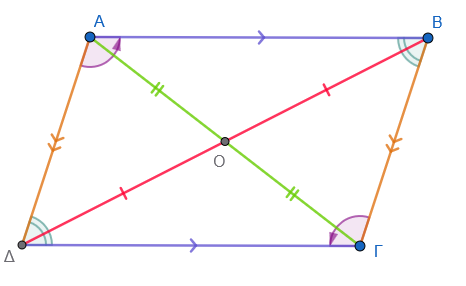
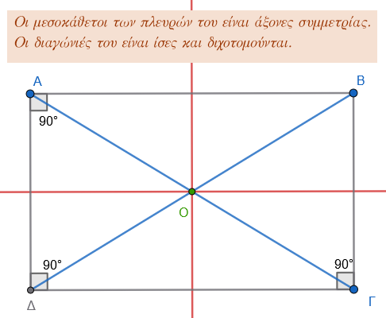
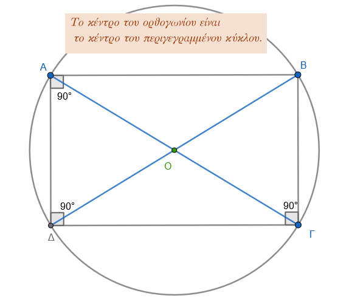
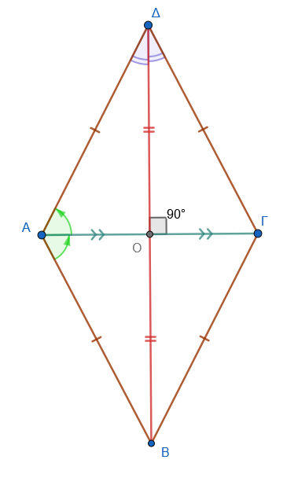
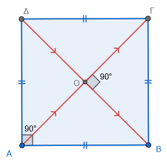
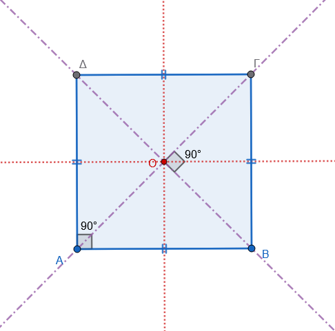
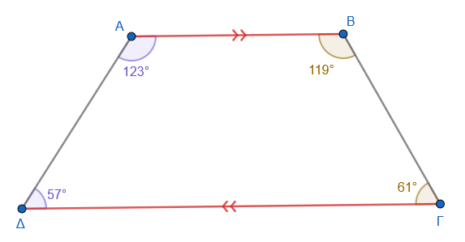
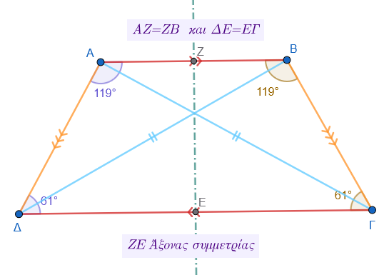

\usepackage{wasysym}

```{=html}
<!-- Φόρτωση βιβλιοθήκης GeoGebra -->
<script src="https://www.geogebra.org/apps/deployggb.js"</script>

<!-- Συνάρτηση δημιουργίας applets -->
<script>
function createGeoGebra(containerId, materialId, width = 700, height = 500) {
  var params = {
    "id": "ggb-" + containerId,
    "material_id": materialId,
    "width": width,
    "height": height,
    "showToolBar": true,
    "showMenuBar": false,
    "showAlgebraInput": true
  };
  
  var applet = new GGBApplet(params, '5.2');
  applet.inject(containerId);
}
</script>
```

------------------------------------------------------------------------

## Ιδιότητες Παραλληλογράμμου-Ορθογωνίου-Ρόμβου-Τετραγώνου-Τραπεζίου-Ισοσκελούς τραπεζίου

### **Παραλληλόγραμμο**

::: {style="background-color: #c0d4b8; border: 2px solid #2f3e50; color: #25188a; padding: 15px; border-radius: 5px;"}
**Ιδιότητες**

- **Ορισμός:** Τετράπλευρο που έχει τις **απέναντι πλευρές παράλληλες** ανά δύο.

- **Πλευρές:** Οι απέναντι πλευρές είναι **ίσες**.

- **Γωνίες:** Οι απέναντι γωνίες είναι **ίσες** και οι διαδοχικές γωνίες είναι **παραπληρωματικές** (άθροισμα 180°).
  Το άθροισμα όλων των γωνιών είναι 360°.

- **Διαγώνιοι:** Οι διαγώνιοι **διχοτομούνται** (τέμνονται στο μέσο τους).

- **Συμμετρία:** Το σημείο τομής των διαγωνίων είναι το **κέντρο συμμετρίας** του σχήματος.\
  {width="400"}
:::

**Παραδείγματα**

1.  Στο παραλληλόγραμμο ΑΒΓΔ, αν η γωνία Α = 60°, τότε η Γ = 60° και η Β = 120°.
2.  Αν οι πλευρές είναι 6cm και 4cm, η περίμετρος είναι 20cm.
3.  Παραλληλόγραμμο με διαγώνιες 6cm και 8cm που τέμνονται στο μέσο τους.
4.  Σε παραλληλόγραμμο με γωνία 50°, οι υπόλοιπες γωνίες υπολογίζονται μέσω της παραπληρωματικότητας.

**Ασκήσεις**

1.  Κατασκευάστε παραλληλόγραμμο με πλευρές 3cm, 5cm και γωνία 45°.
2.  Βρείτε τις γωνίες παραλληλογράμμου αν η μία είναι τριπλάσια της άλλης.
3.  Αν η περίμετρος είναι 18cm και η μία πλευρά διπλάσια της άλλης, βρείτε τις πλευρές.
4.  Αν το άθροισμα τριών γωνιών ενός παραλληλογράμμου είναι 260, υπολογίστε τις γωνίες.
5.  Σε παραλληλόγραμμο η πλευρά ΑΒ είναι 107m και η ΓΔ είναι κατά 49m μικρότερη από το διπλάσιο της ΑΒ. Βρείτε τις πλευρές.
6.  Δείξτε ότι οι διχοτόμοι των γωνιών παραλληλογράμμου σχηματίζουν ορθογώνιο.

------------------------------------------------------------------------

### **Ορθογώνιο**

::: {style="background-color: #c0d4b8; border: 2px solid #2f3e50; color: #25188a; padding: 15px; border-radius: 5px;"}
**Ιδιότητες**

- **Ορισμός:** Το παραλληλόγραμμο που έχει τις **γωνίες του ορθές** (90°).

- **Γωνίες:** Και οι τέσσερις γωνίες είναι 90°.

- **Διαγώνιοι:** Οι διαγώνιοι είναι **ίσες** και διχοτομούνται.

- **Συμμετρία:** Έχει **δύο άξονες συμμετρίας** (τις μεσοκάθετες των πλευρών του) και ένα κέντρο συμμετρίας.\
  {width="400"}

- **Κύκλος:** Το σημείο τομής των διαγωνίων είναι το κέντρο του **περιγεγραμμένου κύκλου**.\
  {width="400"}
:::

**Παραδείγματα**

1.  Ορθογώνιο με διαστάσεις 5cm και 3cm.
2.  Ορθογώνιο με διαγώνιες 8cm που σχηματίζουν γωνία 45°.

**Ασκήσεις**

1.  Κατασκευάστε ορθογώνιο με πλευρά 4cm και διαγώνιο 5cm.
2.  Υπολογίστε τη γωνία των διαγωνίων αν η μία διαγώνιος σχηματίζει 38° με τη μεγάλη πλευρά.
3.  Κατασκευάστε ορθογώνιο με περίμετρο 20cm και μία πλευρά 6cm.
4.  Βρείτε τις διαστάσεις ορθογωνίου αν η περίμετρος είναι 579,04m και το πλάτος είναι τα 3/8 του μήκους.

------------------------------------------------------------------------

### **Ρόμβος**

::: {style="background-color: #c0d4b8; border: 2px solid #2f3e50; color: #25188a; padding: 15px; border-radius: 5px;"}
**Ιδιότητες**

- **Ορισμός:** Το παραλληλόγραμμο που έχει **όλες τις πλευρές του ίσες**.

- **Πλευρές:** Και οι τέσσερις πλευρές είναι ίσες.

- **Διαγώνιοι:** Τέμνονται **κάθετα** και **διχοτομούν τις γωνίες** του.

- **Συμμετρία:** Οι φορείς των διαγωνίων είναι **άξονες συμμετρίας**.

- **Ύψος:** Η απόσταση μεταξύ δύο απέναντι πλευρών είναι σταθερή.\
  {width="300"}
:::

**Παραδείγματα**

1.  Ρόμβος με πλευρά 5cm και γωνία 40°.
2.  Ρόμβος με διαγώνιες 6cm και 4cm.
3.  Κατασκευή ρόμβου από δύο κάθετες ευθείες και τμήματα 4cm και 2,5cm από το κέντρο.

**Ασκήσεις**

1.  Κατασκευάστε ρόμβο με διαγώνιες 72mm και 40mm.
2.  Αν η μία γωνία είναι 66°, βρείτε όλες τις άλλες γωνίες.
3.  Υπολογίστε την πλευρά αν η περίμετρος είναι ίση με την περίμετρο ορθογωνίου 18m x 12m.
4.  Κατασκευάστε ρόμβο με πλευρά 4cm και γωνία 60°.
5.  Σε ρόμβο ΑΒΓΔ, αν η γωνία Α = 70°, υπολογίστε τις υπόλοιπες γωνίες.

------------------------------------------------------------------------

### **Τετράγωνο**

::: {style="background-color: #c0d4b8; border: 2px solid #2f3e50; color: #25188a; padding: 15px; border-radius: 5px;"}
**Ιδιότητες**

- **Ορισμός:** Το παραλληλόγραμμο που είναι ταυτόχρονα **ορθογώνιο και ρόμβος** (όλες οι γωνίες 90° και όλες οι πλευρές ίσες).

- **Διαγώνιοι:** Είναι **ίσες, κάθετες** και διχοτομούν τις γωνίες του (45°).\
  

- **Συμμετρία:** Έχει **τέσσερις άξονες συμμετρίας** και ένα κέντρο συμμετρίας.\
  {width="400"}
:::

**Παραδείγματα**

1.  Τετράγωνο με πλευρά 4cm.
2.  Τετράγωνο με διαγώνιο 6cm.

**Ασκήσεις**

1.  Κατασκευάστε τετράγωνο από τη διαγώνιό του 5cm χρησιμοποιώντας διαβήτη.
2.  Σχεδιάστε τετράγωνο εγγεγραμμένο σε κύκλο ακτίνας 2,5cm.
3.  Ποιο είναι το είδος του τετραπλεύρου που σχηματίζεται αν ενώσουμε τα μέσα των πλευρών τετραγώνου;.

------------------------------------------------------------------------

### **Τραπέζιο**

::: {style="background-color: #c0d4b8; border: 2px solid #2f3e50; color: #25188a; padding: 15px; border-radius: 5px;"}
**Ιδιότητες**

- **Ορισμός:** Τετράπλευρο που έχει **μόνο δύο πλευρές παράλληλες** (βάσεις).

- **Γωνίες:** Οι γωνίες που πρόσκεινται σε κάθε μη παράλληλη πλευρά είναι **παραπληρωματικές**.

- **Διάμεσος:** Το τμήμα που ενώνει τα μέσα των μη παραλλήλων πλευρών είναι παράλληλο προς τις βάσεις και ίσο με το **ημιάθροισμά** τους.\
  

- **Ύψος:** Η απόσταση μεταξύ των δύο βάσεων.
:::

**Παραδείγματα**

1.  Τραπέζιο με βάσεις 213m και 612m και ύψος 50m.
2.  Ορθογώνιο τραπέζιο με βάσεις 10,5cm και 27,5cm και ύψος 12cm.
3.  Χωράφι σε σχήμα τραπεζίου με βάσεις 136m και 48m και ύψος 106m.
4.  Σε ορθογώνιο τραπέζιο αν η μία γωνία είναι 45°, η άλλη είναι 135°.

**Ασκήσεις**

1.  Κατασκευάστε τραπέζιο με βάση 6cm, γωνίες 50°, 70° και ύψος 3cm.
2.  Βρείτε την περίμετρο αν οι πλευρές είναι 17m, 10m, 11m και 15m.

------------------------------------------------------------------------

### **Ισοσκελές Τραπέζιο**

::: {style="background-color: #c0d4b8; border: 2px solid #2f3e50; color: #25188a; padding: 15px; border-radius: 5px;"}
**Ιδιότητες**

- **Ορισμός:** Το τραπέζιο που έχει τις **μη παράλληλες πλευρές ίσες**.

- **Γωνίες:** Οι γωνίες που πρόσκεινται σε κάθε βάση είναι **ίσες**.

- **Διαγώνιοι:** Οι διαγώνιοι του ισοσκελούς τραπεζίου είναι **ίσες**.

- **Συμμετρία:** Η ευθεία που ενώνει τα μέσα των βάσεων είναι **άξονας συμμετρίας**.\
  {width="450"}
:::

**Παραδείγματα**

1.  Ισοσκελές τραπέζιο με γωνία βάσης 74°.
2.  Ισοσκελές τραπέζιο με βάσεις 36cm και 20cm και ίσες πλευρές 17cm.

**Ασκήσεις**

1.  Αν η γωνία Α είναι 68°, υπολογίστε τις υπόλοιπες τρεις γωνίες.
2.  Αν οι αμβλείες γωνίες είναι διπλάσιες των οξειών, υπολογίστε τις γωνίες.
3.  Κατασκευάστε ισοσκελές τραπέζιο από τις βάσεις του 3cm και 6cm και τη διαγώνιο 5cm.

::: callout-note
Σε όλα τα σχήματα που έχουμε παράλληλες που τέμνονται από άλλες ευθείες ισχύουν αυτά που γνωρίζουμε από την αντίστοιχη θεωρία και άρα μπορούν να χρησιμοποιηθούν για υπολογισμους γωνιών , για παράδειγμα **"οι εντός εναλλάξ γωνίες είναι ίσες"** κτλπ
:::

------------------------------------------------------------------------

::: callout-tip
## Μελέτησε αυτόν τον πίνακα για βοήθεια:

| Σχήμα | Πλευρές | Γωνίες | Διαγώνιοι |
|:-----------------|:-----------------|:-----------------|:-----------------|
| **Παραλληλόγραμμο** | Απέναντι ίσες & παράλληλες | Απέναντι ίσες | Διχοτομούνται |
| **Ορθογώνιο** | Απέναντι ίσες & παράλληλες | Όλες $90^{\circ}$ | Ίσες & Διχοτομούνται |
| **Ρόμβος** | Όλες ίσες | Απέναντι ίσες | Κάθετες & Διχοτόμοι των γωνιών |
| **Τετράγωνο** | Όλες ίσες | Όλες $90^{\circ}$ | Ίσες, Κάθετες & Διχοτόμοι |
| **Ισοσκελές Τραπέζιο** | Μη παράλληλες πλευρές ίσες | Γωνίες βάσης ίσες | Ίσες |
:::

------------------------------------------------------------------------

::: {style="background-color: #f0f8cc; border: 2px solid #2f3e50; color: #25188a; padding: 15px; border-radius: 5px;"}
ΚΑΛΗ ΜΕΛΕΤΗ !
:::
