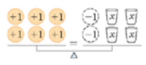
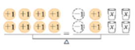
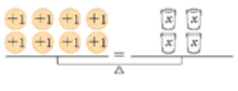
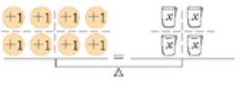
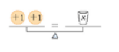
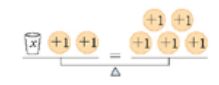
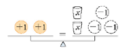

\usepackage{wasysym}

```{=html}
<!-- Φόρτωση βιβλιοθήκης GeoGebra -->
<script src="https://www.geogebra.org/apps/deployggb.js"</script>

<!-- Συνάρτηση δημιουργίας applets -->
<script>
function createGeoGebra(containerId, materialId, width = 700, height = 500) {
  var params = {
    "id": "ggb-" + containerId,
    "material_id": materialId,
    "width": width,
    "height": height,
    "showToolBar": true,
    "showMenuBar": false,
    "showAlgebraInput": true
  };
  
  var applet = new GGBApplet(params, '5.2');
  applet.inject(containerId);
}
</script>
```

::: {style="background-color: #f0f8cc; border: 2px solid #2f3e50; color: #25188a; padding: 15px; border-radius: 5px;"}
## Ως **εξίσωση**

ορίζεται η **ισότητα δύο αλγεβρικών παραστάσεων** οι οποίες περιέχουν τουλάχιστον μία μεταβλητή, η οποία ονομάζεται **άγνωστος**.
Η δομή μιας εξίσωσης αποτελεί μια δήλωση ισορροπίας, παρόμοια με τη λειτουργία ενός ζυγού, όπου η ισότητα διατηρείται μόνο όταν τα δύο μέλη είναι ίσα.
:::

### Βασικά Στοιχεία της Εξίσωσης

-   **Μέλη της εξίσωσης:** Η αλγεβρική παράσταση στα αριστερά του ίσον ονομάζεται **πρώτο μέλος**, ενώ η παράσταση στα δεξιά **δεύτερο μέλος**.
-   **Όροι:** Οι όροι που περιέχουν τη μεταβλητή (συνήθως το γράμμα $x$, αλλά και $y, \omega, \psi$ κ.λπ.) ονομάζονται **άγνωστοι όροι**, ενώ οι όροι που αποτελούνται μόνο από αριθμούς ονομάζονται **γνωστοί όροι**.
-   **Λύση ή Ρίζα:** Είναι η συγκεκριμένη τιμή του αγνώστου η οποία, όταν αντικατασταθεί στην εξίσωση, επαληθεύει την ισότητα.
-   **Βαθμός της εξίσωσης:** Καθορίζεται από τον **μεγαλύτερο εκθέτη** στον οποίο είναι υψωμένη η μεταβλητή (π.χ. εξίσωση πρώτου βαθμού αν ο εκθέτης είναι 1).

### Κατηγορίες Εξισώσεων ως προς τις Λύσεις

Ανάλογα με τις τιμές των συντελεστών, μια εξίσωση μπορεί να είναι:

1.**Ορισμένη:** Έχει **μία και μοναδική λύση** (π.χ. όταν ο συντελεστής του αγνώστου είναι διάφορος του μηδενός).

2.**Αδύνατη:** Δεν έχει **καμία λύση**, καθώς κανένας αριθμός δεν μπορεί να την επαληθεύσει (π.χ. η μορφή $0x = \alpha$, όπου $\alpha \neq 0$).

3.**Αόριστη ή Ταυτότητα:** Επαληθεύεται για **οποιονδήποτε αριθμό** (π.χ. η μορφή $0x = 0$).

### Παραδείγματα

-   **Απλή εξίσωση:** $3 + x = 5$, με λύση το $x = 2$.
-   **Εξίσωση με πολλαπλασιασμό:** $2x = 6$, με λύση το $x = 3$.
-   **Σύνθετη εξίσωση πρώτου βαθμού:** $3x + 200 = x + 600$.
-   **Εξίσωση ανώτερου βαθμού:** $2x^2 + 5x - 3 = 8(x^3 + 2)$ (τρίτου βαθμού λόγω του $x^3$).
-   **Αδύνατη εξίσωση:** $0x = 8$.
-   **Ταυτότητα:** $x + 1 = x + 1$.
-   **Κλασματική εξίσωση:** $\frac{4}{x + 2} + \frac{4}{x} = \frac{x + 8}{x^2}$ (περιέχει τον άγνωστο στον παρονομαστή).

### Το μοντέλο της ζυγαριάς

αποτελεί ένα εξαιρετικά χρήσιμο εργαλείο για την κατανόηση των εξισώσεων, καθώς μια **εξίσωση λειτουργεί ακριβώς όπως ένας ζυγός ισορροπίας με δύο τάσια**.

Συγκεκριμένα, η χρήση αυτού του μοντέλου βασίζεται στις εξής αρχές:

-   **Αναπαράσταση της Ισότητας:** Το **πρώτο μέλος** της εξίσωσης αντιστοιχεί στο αριστερό τάσι της ζυγαριάς και το **δεύτερο μέλος** στο δεξί. Η ισορροπία της ζυγαριάς συμβολίζει το **σύμβολο της ισότητας (=)**, δηλώνοντας ότι τα βάρη (οι τιμές) στις δύο πλευρές είναι ακριβώς ίσα.

Ενα παράδειγμα.

+--------------------------------------+----------------------------------------+
| Εξίσωση - Ζυγαριά                    | Εξίσωση - Μαθηματικό μοντέλο           |
+:====================================:+:======================================:+
|   | $6=-2+4x$                              |
+--------------------------------------+----------------------------------------+
|   | Προσθέτουμε και στα δύο μέλη 2 μονάδες |
|                                      |                                        |
|                                      |  $6+2=-2+4x+2$                         |
+--------------------------------------+----------------------------------------+
|  | κάνουμε πράξεις                        |
|                                      |                                        |
|                                      |  $8=4x$                                |
+--------------------------------------+----------------------------------------+
|  | Διαιρούμε δια τέσσερα                  |
|                                      |                                        |
|                                      |  $\frac{8}{4}=\frac{4x}{4}$            |
+--------------------------------------+----------------------------------------+
|  | Αρα                                    |
|                                      |                                        |
|                                      | $\color{red}{x=2}$                     |
+--------------------------------------+----------------------------------------+

Κάντε το ίδιο για την ζυγαριά 

και επίσης για την ζυγαριά 

-   **Διατήρηση της Ισορροπίας:** Για να παραμείνει η ζυγαριά σε ισορροπία, οποιαδήποτε μεταβολή πραγματοποιείται στη μία πλευρά πρέπει να πραγματοποιηθεί ταυτόχρονα και στην άλλη. Αυτό αντιστοιχεί στις **ιδιότητες της ισότητας**:
    -   **Πρόσθεση/Αφαίρεση:** Αν προσθέσουμε ή αφαιρέσουμε το ίδιο «βάρος» (αριθμό) και από τα δύο μέλη, η ισορροπία διατηρείται.
    -   **Πολλαπλασιασμός/Διαίρεση:** Αν πολλαπλασιάσουμε ή διαιρέσουμε (με μη μηδενικό αριθμό) τα βάρη και στις δύο πλευρές, η ζυγαριά συνεχίζει να ισορροπεί.
-   **Οπτικοποίηση του Αγνώστου:** Ο άγνωστος ($x$) μπορεί να φανταστεί κανείς ότι είναι ένα **κλειστό κουτί ή αντικείμενο** (π.χ. ένας κύβος) με άγνωστο βάρος, ενώ οι γνωστοί αριθμοί είναι **βαρίδια συγκεκριμένου βάρους**.
-   **Διαδικασία Επίλυσης:** Η επίλυση της εξίσωσης μέσω της ζυγαριάς γίνεται με τη σταδιακή αφαίρεση ίδιων αντικειμένων και από τις δύο πλευρές μέχρι να απομονωθεί ο άγνωστος. Για παράδειγμα, αν έχουμε κύβους και στις δύο πλευρές, αφαιρούμε τον ίδιο αριθμό κύβων μέχρι να μείνουν κύβοι μόνο στη μία πλευρά.

Αυτό το νοητικό μοντέλο βοηθά τους μαθητές να κατανοήσουν ότι η **αλλαγή προσήμου** κατά τη μεταφορά ενός όρου είναι στην πραγματικότητα η προσθήκη του αντίθετου αριθμού και στα δύο μέλη για τη **διατήρηση της ισορροπίας**.

------------------------------------------------------------------------

## Η επίλυση μιας εξίσωσης πρώτου βαθμού

ακολουθεί μια συγκεκριμένη αλγοριθμική σειρά πέντε βημάτων, η οποία επιτρέπει τη μετατροπή μιας σύνθετης έκφρασης στην τελική της λύση.
Τα βήματα αυτά είναι τα εξής:

1.  **Απαλοιφή Παρονομαστών:** Εάν η εξίσωση περιέχει κλάσματα, βρίσκουμε το Ελάχιστο Κοινό Πολλαπλάσιο (Ε.Κ.Π.) όλων των παρονομαστών και πολλαπλασιάζουμε κάθε όρο της εξίσωσης με αυτό. Στη συνέχεια, εκτελούμε τις απλοποιήσεις για να διώξουμε τους παρονομαστές, φροντίζοντας να βάζουμε σε παρένθεση τους αριθμητές που αποτελούνται από περισσότερους από έναν όρους.
2.  **Απαλοιφή Παρενθέσεων:** Χρησιμοποιούμε την επιμεριστική ιδιότητα για να πολλαπλασιάσουμε τον συντελεστή έξω από κάθε παρένθεση με όλους τους όρους που βρίσκονται μέσα σε αυτή. Ιδιαίτερη προσοχή απαιτείται όταν υπάρχει αρνητικό πρόσημο έξω από την παρένθεση, καθώς τότε πρέπει να αλλάξουν όλα τα πρόσημα των όρων εντός αυτής κατά την απαλοιφή.
3.  **Χωρισμός Γνωστών από Αγνώστους:** Μεταφέρουμε όλους τους όρους που περιέχουν τη μεταβλητή (αγνώστους) στο ένα μέλος της εξίσωσης (συνήθως το αριστερό) και όλους τους αριθμούς (γνωστούς) στο άλλο μέλος (συνήθως το δεξί). **Βασικός κανόνας** σε αυτό το στάδιο είναι ότι κάθε όρος που αλλάζει μέλος πρέπει υποχρεωτικά να αλλάζει και το πρόσημό του.
4.  **Αναγωγή Ομοίων Όρων:** Εκτελούμε τις προσθέσεις και τις αφαιρέσεις σε κάθε μέλος ξεχωριστά, ώστε η εξίσωση να πάρει την απλοποιημένη μορφή $\alpha x = \beta$. Σκοπός αυτού του βήματος είναι να συγκεντρώσουμε όλη την πληροφορία σε δύο μόνο τιμές: τον συντελεστή του αγνώστου και τον σταθερό όρο.
5.  **Διαίρεση με τον Συντελεστή του Αγνώστου:** Εφόσον ο συντελεστής $\alpha$ είναι διάφορος του μηδενός, διαιρούμε και τα δύο μέλη της εξίσωσης με τον αριθμό αυτό για να απομονώσουμε τη μεταβλητή. Το αποτέλεσμα αυτής της διαίρεσης αποτελεί τη **λύση ή ρίζα** της εξίσωσης.

Αν κατά τη διαδικασία ο συντελεστής του αγνώστου είναι μηδέν ($\alpha = 0$), η εξίσωση μπορεί να είναι είτε **αδύνατη** (αν ο σταθερός όρος δεν είναι μηδέν) είτε **ταυτότητα/αόριστη** (αν ο σταθερός όρος είναι επίσης μηδέν).

### παραδείγματα για κάθε περίπτωση επίλυσης εξίσωσης πρώτου βαθμού με έναν άγνωστο:

1.  **Εξισώσεις με Μοναδική Λύση (Ορισμένες)** Όταν ο συντελεστής του αγνώστου είναι διάφορος του μηδενός ($\alpha \neq 0$), η εξίσωση έχει μία ακριβώς λύση.

-   **Παράδειγμα Α:** Η εξίσωση $3x - 7 = 5$.

Προσθέτοντας το 7 και στα δύο μέλη έχουμε $3x = 12$ και διαιρώντας με τον συντελεστή 3, βρίσκουμε τη μοναδική λύση $x = 4$.

-   **Παράδειγμα Β:** Η εξίσωση $4x + 3 = 2x + 17$.

Χωρίζοντας γνωστούς από αγνώστους προκύπτει $4x - 2x = 17 - 3$,

άρα $2x = 14$, οπότε διαιρώντας με το 2 έχουμε τη λύση $x = 7$.

2.  **Αδύνατες Εξισώσεις** Μια εξίσωση είναι αδύνατη όταν καταλήγει στη μορφή $0x = \beta$ (με $\beta \neq 0$), καθώς κανένας αριθμός πολλαπλασιαζόμενος με το μηδέν δεν δίνει αποτέλεσμα διαφορετικό του μηδενός.

-   **Παράδειγμα Α:** Η εξίσωση $x + 1 = x + 5$.

Αν αφαιρέσουμε το $x$ και από τα δύο μέλη, καταλήγουμε στην ψευδή ισότητα $1 = 5$ (ή $0x = 4$), η οποία δεν επαληθεύεται για καμία τιμή του $x$.

-   **Παράδειγμα Β:** Στην παραμετρική εξίσωση $(\lambda-1)x = \lambda+1$ για την τιμή $\lambda = 1$.

Αντικαθιστώντας το $\lambda$, η εξίσωση γίνεται $0x = 2$, μορφή η οποία είναι προφανώς αδύνατη.

3.  **Αόριστες Εξισώσεις ή Ταυτότητες** Μια εξίσωση ονομάζεται αόριστη ή ταυτότητα όταν καταλήγει στη μορφή $0x = 0$, γεγονός που σημαίνει ότι επαληθεύεται για οποιαδήποτε τιμή του αγνώστου.

-   **Παράδειγμα Α:** Η εξίσωση $x + 1 = x + 1$.
    Η ισότητα αυτή είναι πάντα αληθής για κάθε πραγματικό αριθμό $x$.

-   **Παράδειγμα Β:** Η εξίσωση $2(x + 1) = 2x + 2$.
    Εφαρμόζοντας την επιμεριστική ιδιότητα στο πρώτο μέλος, προκύπτει $2x + 2 = 2x + 2$, δηλαδή $0x = 0$.

## Ασκήσεις

για την επίλυση εξισώσεων πρώτου βαθμού, ταξινομημένες ανά κατηγορία:

### Εξισώσεις με Μοναδική Λύση (Ορισμένες)

Αυτές οι εξισώσεις καταλήγουν στη μορφή $x = \frac{\beta}{\alpha}$, όπου ο συντελεστής $\alpha$ είναι διάφορος του μηδενός.

1.  $3x = 21$.

2.  $4x + 3 = 2x + 17$.

3.  $3x + 2x - 2 = x - 10$.

4.  $6x + 4 - 12x + 12 = 5$.

5.  $5 - 6 + 2x = 8 - x + 3$.

6.  $10 - 2x - 9(-x + 2) = 5(x - 2) + 2(1 - x)$

(Λύση: $x = 0$).

7.  $2 - (8x - 3) - (-3x + 2) = 10 - 3(2x - 4) - (-2x + 3)$

(Λύση: $x = -16$).

8.  $10x - [3x - 2(1 - 2x) - 5] = 15 - (x - 4)$

(Λύση: $x = 3$).

### Αδύνατες Εξισώσεις

Μια εξίσωση είναι αδύνατη όταν καταλήγει στη μορφή $0x = \beta$ (με $\beta \neq 0$), καθώς κανένας αριθμός δεν μπορεί να την επαληθεύσει.

9.  $x + 1 = x + 5$.

10. $9(x - 3) - 3(x - 1) - (x - 2) = 10 - 5(2 - x)$.

11. $5x - 7 = 2(2x + 3) + x$.

12. $\frac{x-5}{2} - \frac{2x-1}{3} = \frac{1-x}{6}$.

### Αόριστες Εξισώσεις ή Ταυτότητες

Οι εξισώσεις αυτές καταλήγουν στη μορφή $0x = 0$ και επαληθεύονται για κάθε πραγματικό αριθμό $x$.

13. $2(x + 1) = 2x + 2$.

14. $(x - 4) \cdot 3 - (-2x + 1) \cdot 4 - 5(x - 2) = x - 5(2 - x) + 4$.

15. $3(2x - 5) + 15 = 6x$.

16. $2(x + 3) + 4(x - 1) + 8 = 6(x + 1) + 4$ (Βασισμένη στην αναγωγή ομοίων όρων που οδηγεί σε ταυτότητα).

### Εξισώσεις με Κλάσματα (Αριθμητικοί Παρονομαστές)

Για την επίλυσή τους απαιτείται πρώτα η **απαλοιφή παρονομαστών** με τον πολλαπλασιασμό κάθε όρου με το **Ε.Κ.Π.**.

17. $\frac{3x}{2} - \frac{2(x-2)}{3} = -\frac{x}{6}$.

18. $\frac{2x+1}{2} - \frac{x-3}{8} = 1 + \frac{3x-2}{3}$.

19. $\frac{6x-1}{2} + \frac{5x+3}{10} = \frac{16x-1}{5}$.

20. $\frac{x-4}{2} + \frac{3-x}{10} = -2 + \frac{3x-6}{2}$.

::: callout-tip
Κατά την επίλυση εξισώσεων με κλάσματα, προσέξτε να βάζετε σε παρένθεση τους αριθμητές που έχουν περισσότερους από έναν όρους μετά τον πολλαπλασιασμό με το Ε.Κ.Π.
για να αποφύγετε λάθη στα πρόσημα.
:::

### Ασκήσεις

**Να λύσετε τις εξισώσεις**

1.  $-5x+12=-13$

2.  $-7x+1=-20$

3.  $4x=63-3x$

4.  $10x=60-5x$

5.  $3(2x-3)-9x-4=2x+12$

6.  $16(x-1)=12x+36$

7.  $6x+2(x+7)=46$

8.  $-2x-18=6(1-2x)+4x$

9.  $12=5+\frac{x}{3}$

10. $\frac{x-7}{8}=-3$

11. $\frac{x+5}{3}=9$

12. $\frac{x-8}{33}=40$

13. $\frac{3(x-5)}{2}=9$

14. $\frac{2(x+8)}{3}=6$

15. $\frac{3(2x-1)}{7}=9$

16. $\frac{2y-3}{3}+\frac{y+1}{2}=6$

17. Βρείτε τρεις διαδοχικούς ακεραίους οι οποίοι έχουν άθροισμα -45

18. $\frac{α+5}{7}+\frac{α-3}{4}=\frac{5}{14}$

19. $\frac{2θ-3}{6}+\frac{3θ-2}{4}+\frac{5θ+6}{12}=4$

20. $\frac{2x+1}{14}-\frac{3x+4}{7}=\frac{x-1}{2}$

21. $\frac{2x+7}{9}-4=\frac{x-7}{12}$

22. $0,8x+0,9(850-x)=715$

23. $5-(\frac{r+1}{2}+\frac{1+2r}{3})=12-(r-\frac{r+5}{6})$

24. $3x-(\frac{2x}{3}-5)=6-(\frac{x}{3}-2)$

::: {style="background-color: #f0f8cc; border: 2px solid #2f3e50; color: #25188a; padding: 15px; border-radius: 5px;"}
ΚΑΛΗ ΜΕΛΕΤΗ !
:::
