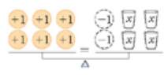
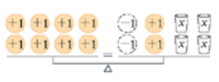
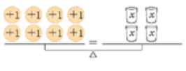
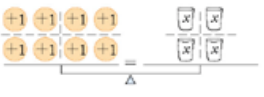
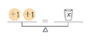
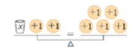
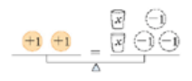

\usepackage{wasysym}

```{=html}
<!-- Φόρτωση βιβλιοθήκης GeoGebra -->
<script src="https://www.geogebra.org/apps/deployggb.js"</script>

<!-- Συνάρτηση δημιουργίας applets -->
<script>
function createGeoGebra(containerId, materialId, width = 700, height = 500) {
  var params = {
    "id": "ggb-" + containerId,
    "material_id": materialId,
    "width": width,
    "height": height,
    "showToolBar": true,
    "showMenuBar": false,
    "showAlgebraInput": true
  };
  
  var applet = new GGBApplet(params, '5.2');
  applet.inject(containerId);
}
</script>
```


## Eξισώσεις α βαθμού


### **Ιδιότητες ισοτήτων**

::: {style="background-color: #e0d6b8; border: 2px solid #2f3e50; color: #25188a; padding: 15px; border-radius: 5px;"}

**Θεωρία και Ορισμοί**

*   **Ισότητα** σχετικών αριθμών υφίσταται όταν αυτοί έχουν την **ίδια απόλυτη τιμή** και το **ίδιο πρόσημο**.

*   Οι βασικές ιδιότητες της ισότητας (που ισχύουν και στα σύνολα) είναι
    * η **ανακλαστική** ($\alpha=\alpha$), 
    * η **συμμετρική** (αν $\alpha=\beta$ τότε $\beta=\alpha$) και η 
    * **μεταβατική** (αν $\alpha=\beta$ και $\beta=\gamma$ τότε $\alpha=\gamma$).

**Ιδιότητες**

1.  **Πρόσθεση/Αφαίρεση:** Μπορούμε να προσθέσουμε ή να αφαιρέσουμε τον ίδιο αριθμό και στα δύο μέλη μιας ισότητας, οπότε προκύπτει πάλι ισότητα ($$\alpha=\beta \Leftrightarrow \alpha\pm\gamma = \beta\pm\gamma$$).
2.  **Πολλαπλασιασμός/Διαίρεση:** Μπορούμε να πολλαπλασιάσουμε ή να διαιρέσουμε (με αριθμό $\neq 0$) και τα δύο μέλη μιας ισότητας ($$\alpha=\beta \Leftrightarrow \alpha\gamma = \beta\gamma$$ και $$\dfrac{\alpha}{\gamma} = \dfrac{\beta}{\gamma}$$).
3.  **Μεταφορά Όρων:** Σε μια ισότητα μπορούμε να μεταφέρουμε έναν όρο από το ένα μέλος στο άλλο, αρκεί να **αλλάξουμε το πρόσημό του**. $$α+β+γ=δ+ε \Leftrightarrow α+β=δ+ε-γ$$ ή $$α+β+γ=δ+ε \Leftrightarrow α+γ-δ=ε-β$$  κτλπ....
4.  **Ύψωση σε δύναμη/Ρίζα:** Αν $\alpha=\beta$ (και $\alpha, \beta \ge 0$), τότε $$\alpha^2 = \beta^2$$   και $$\sqrt{\alpha}=\sqrt{\beta}$$ οι δύο τελευταίες δεν θα χρειαστουν προς το παρόν.
5.  **Πρόσθεση/Πολλαπλασιασμός κατά μέλη:** Δύο ή περισσότερες ισότητες μπορούν να προστεθούν ή να πολλαπλασιαστούν κατά μέλη.

$$
\begin{cases}
α=β \\ γ=δ 
\end{cases} 
\Rightarrow 
\begin{cases}
a+γ=β+δ \\ α\cdotγ=β\cdotδ
\end{cases}
$$

:::


**Παραδείγματα**

1.  Αν $x - 5 = 10$, τότε $x - 5 + 5 = 10 + 5$, άρα $x = 15$.
2.  Αν $3x = 12$, τότε $\dfrac{3x}{3} = \dfrac{12}{3}$, άρα $x = 4$.
3.  Αν $a = \beta$ και $\beta = \lambda$, τότε $a = \lambda$ (μεταβατική).
4.  Από την ισότητα $a - \beta = \gamma + \delta$ προκύπτει η $a - \delta = \gamma + \beta$ (μεταφορά όρων).
5.  Αν $x = y$, τότε $(-1) \cdot x = (-1) \cdot y$, άρα $-x = -y$.

**Ασκήσεις**

1.  Επαληθεύστε τη μεταβατική ιδιότητα για $\alpha = 5$ και $5 = \lambda$.
2.  Αν $2x = 46$, βρείτε το $x$ χρησιμοποιώντας τις ιδιότητες.
3.  Αποδείξτε ότι αν $\alpha = \beta$, τότε $3\alpha = 3\beta$.
4.  Συμπληρώστε την ισότητα $x + 12 - y = x - (\dots)$.
5.  Αν $\alpha = \beta$, δείξτε ότι $\alpha - \gamma = \beta - \gamma$.
6.  Μεταφέρετε τους γνωστούς όρους στο β' μέλος: $x + 10 = 7$.
7.  Απλοποιήστε την παράσταση $\alpha - \beta + (\beta - \alpha)$ βάσει ιδιοτήτων.


---

### **Η έννοια της εξίσωσης**

::: {style="background-color: #e0d6b8; border: 2px solid #2f3e50; color: #25188a; padding: 15px; border-radius: 5px;"}

**Θεωρία και Ορισμοί**

*   **Εξίσωση** ονομάζεται κάθε ισότητα η οποία **αληθεύει μόνο για ορισμένες τιμές** των γραμμάτων που περιέχει (άγνωστοι).

*   **Μέλη της εξίσωσης:** Η έκφραση αριστερά του «$=$» λέγεται **πρώτο μέλος** και η έκφραση δεξιά **δεύτερο μέλος**.

*   **Ρίζα ή λύση:** Η τιμή εκείνη του αγνώστου που, όταν αντικατασταθεί στην εξίσωση, τη μετατρέπει σε αληθή αριθμητική ισότητα.

**Ιδιότητες**

*   **Βαθμός εξίσωσης:** Είναι ο μεγαλύτερος εκθέτης του αγνώστου στην αναγμένη μορφή της (π.χ. πρωτοβάθμια $ax+\beta=0$).

*   **Αδύνατη εξίσωση:** Αυτή που δεν έχει καμία λύση ($0x = \beta$, με $\beta \neq 0$).

*   **Αόριστη εξίσωση ή Ταυτότητα:** Αυτή που αληθεύει για κάθε τιμή του αγνώστου ($0x = 0$).


---

- **Απλή εξίσωση:** $3 + x = 5$, με λύση το $x = 2$.
- **Εξίσωση με πολλαπλασιασμό:** $2x = 6$, με λύση το $x = 3$.
- **Σύνθετη εξίσωση πρώτου βαθμού:** $3x + 200 = x + 600$.
- **Εξίσωση ανώτερου βαθμού:** $2x^2 + 5x - 3 = 8(x^3 + 2)$ (τρίτου βαθμού λόγω του $x^3$).
- **Αδύνατη εξίσωση:** $0x = 8$.
- **Ταυτότητα:** $x + 1 = x + 1$.
- **Κλασματική εξίσωση:** $\dfrac{4}{x + 2} + \dfrac{4}{x} = \dfrac{x + 8}{x^2}$ (περιέχει τον άγνωστο στον παρονομαστή).


:::

---

### Το μοντέλο της ζυγαριάς

αποτελεί ένα εξαιρετικά χρήσιμο εργαλείο για την κατανόηση των εξισώσεων, καθώς μια **εξίσωση λειτουργεί ακριβώς όπως ένας ζυγός ισορροπίας με δύο τάσια**.

Συγκεκριμένα, η χρήση αυτού του μοντέλου βασίζεται στις εξής αρχές:

- **Αναπαράσταση της Ισότητας:** Το **πρώτο μέλος** της εξίσωσης αντιστοιχεί στο αριστερό τάσι της ζυγαριάς και το **δεύτερο μέλος** στο δεξί. Η ισορροπία της ζυγαριάς συμβολίζει το **σύμβολο της ισότητας (=)**, δηλώνοντας ότι τα βάρη (οι τιμές) στις δύο πλευρές είναι ακριβώς ίσα.

Ενα παράδειγμα.

+----------------------------------------------------------------------------------------------+---------------------------------------------------------------------------------+-----------+
|                                                                                              |                                                                                 |           |
+==============================================================================================+=================================================================================+===========+
| Εξίσωση - Ζυγαριά :====================================:  | Εξίσωση - Μαθηματικό μοντέλο :======================================: $6=-2+4x$ |           |
+----------------------------------------------------------------------------------------------+---------------------------------------------------------------------------------+-----------+
|                                                                                              |                                                                                 |           |
+----------------------------------------------------------------------------------------------+---------------------------------------------------------------------------------+-----------+
|                                                           | Προσθέτουμε και στα δύο μέλη 2 μονάδες                                          |           |
|                                                                                              |                                                                                 |           |
|                                                                                              |  $6+2=-2+4x+2$                                                                  |           |
+----------------------------------------------------------------------------------------------+---------------------------------------------------------------------------------+-----------+
|                                                          | κάνουμε πράξεις                                                                 |           |
|                                                                                              |                                                                                 |           |
|                                                                                              |  $8=4x$                                                                         |           |
+----------------------------------------------------------------------------------------------+---------------------------------------------------------------------------------+-----------+
|                                                          | Διαιρούμε δια τέσσερα \| \|  $\dfrac{8}{4}=\dfrac{4x}{4}$                       |           |
+----------------------------------------------------------------------------------------------+---------------------------------------------------------------------------------+-----------+
|                                                          | Αρα                                                                             |           |
|                                                                                              |                                                                                 |           |
|                                                                                              | $\color{red}{x=2}$                                                              |           |
+----------------------------------------------------------------------------------------------+---------------------------------------------------------------------------------+-----------+

Κάντε το ίδιο για την ζυγαριά 

και επίσης για την ζυγαριά 

- **Διατήρηση της Ισορροπίας:** Για να παραμείνει η ζυγαριά σε ισορροπία, οποιαδήποτε μεταβολή πραγματοποιείται στη μία πλευρά πρέπει να πραγματοποιηθεί ταυτόχρονα και στην άλλη. Αυτό αντιστοιχεί στις **ιδιότητες της ισότητας**:
  - **Πρόσθεση/Αφαίρεση:** Αν προσθέσουμε ή αφαιρέσουμε το ίδιο «βάρος» (αριθμό) και από τα δύο μέλη, η ισορροπία διατηρείται.
  - **Πολλαπλασιασμός/Διαίρεση:** Αν πολλαπλασιάσουμε ή διαιρέσουμε (με μη μηδενικό αριθμό) τα βάρη και στις δύο πλευρές, η ζυγαριά συνεχίζει να ισορροπεί.
- **Οπτικοποίηση του Αγνώστου:** Ο άγνωστος ($x$) μπορεί να φανταστεί κανείς ότι είναι ένα **κλειστό κουτί ή αντικείμενο** (π.χ. ένας κύβος) με άγνωστο βάρος, ενώ οι γνωστοί αριθμοί είναι **βαρίδια συγκεκριμένου βάρους**.
- **Διαδικασία Επίλυσης:** Η επίλυση της εξίσωσης μέσω της ζυγαριάς γίνεται με τη σταδιακή αφαίρεση ίδιων αντικειμένων και από τις δύο πλευρές μέχρι να απομονωθεί ο άγνωστος. Για παράδειγμα, αν έχουμε κύβους και στις δύο πλευρές, αφαιρούμε τον ίδιο αριθμό κύβων μέχρι να μείνουν κύβοι μόνο στη μία πλευρά.

Αυτό το νοητικό μοντέλο βοηθά τους μαθητές να κατανοήσουν ότι η **αλλαγή προσήμου** κατά τη μεταφορά ενός όρου είναι στην πραγματικότητα η προσθήκη του αντίθετου αριθμού και στα δύο μέλη για τη **διατήρηση της ισορροπίας**.


---

**Παραδείγματα**

1.  $3x = -24$ (εξίσωση με ρίζα $x = -8$).
2.  $\sqrt{x+3} = x + 1$ (εξίσωση με άγνωστο το $x$).
3.  $3x - 1 = 2x + 1$.
4.  $(3x - 1)(x + 2) = 0$ (παραγοντοποιημένη εξίσωση).
5.  $0x = 5$ (αδύνατη εξίσωση).

**Ασκήσεις**

1.  Βρείτε τη ρίζα της εξίσωσης $3x + 15 = 0$.
2.  Ελέγξτε αν το $x = 3$ είναι ρίζα της $5(x-2) - 3(3-x) = 3x - 4$.
3.  Προσδιορίστε τα μέλη της εξίσωσης $5x - 3 = -x + 4$.
4.  Γράψτε μια εξίσωση που να είναι ταυτότητα.
5.  Βρείτε για ποια τιμή του $\lambda$ το κλάσμα $\dfrac{\lambda+1}{3-\lambda}$ ισούται με τη μονάδα.
6.  Είναι η σχέση $x + y = 5$ εξίσωση με έναν ή δύο αγνώστους;.
7.  Προσδιορίστε τον βαθμό της εξίσωσης $3xy^2 - 2xy + 5x - 3 = 0$ ως προς $x$ και ως προς $y$.
8.  Λύστε την εξίσωση $12(x-1) = 24$.
9.  Βρείτε τη ρίζα της $0,5x - 3 = 0,25x + 0,2x$.
10. Εξηγήστε γιατί η $0x = 0$ λέγεται αόριστη.

---

### **Η λύση της βήμα-βήμα και η επαλήθευση**

::: {style="background-color: #e0d6b8; border: 2px solid #2f3e50; color: #25188a; padding: 15px; border-radius: 5px;"}


**Θεωρία και Ορισμοί**

*   **Επίλυση εξίσωσης** είναι η διαδικασία εύρεσης όλων των ριζών της.

*   **Επαλήθευση** είναι ο έλεγχος της ορθότητας της λύσης μέσω αντικατάστασης του αγνώστου με τη βρεθείσα τιμή στην αρχική εξίσωση.


**Ας λύσουμε βήμα-βήμα την εξίσωση $\dfrac{x+4}{5}-\dfrac{x-4}{3}=\dfrac{1-3x}{15}-2$**

1.  **Απαλοιφή Παρονομαστών:** Εάν η εξίσωση περιέχει κλάσματα, βρίσκουμε το Ελάχιστο Κοινό Πολλαπλάσιο (Ε.Κ.Π.) όλων των παρονομαστών και πολλαπλασιάζουμε κάθε όρο της εξίσωσης με αυτό. Στη συνέχεια, εκτελούμε τις απλοποιήσεις για να διώξουμε τους παρονομαστές, φροντίζοντας να βάζουμε σε παρένθεση τους αριθμητές που αποτελούνται από περισσότερους από έναν όρους.

E.K.Π(5,3,15)=15. ----->   Άρα θα έχουμε

$$15\cdot\dfrac{x+4}{5}-15\cdot\dfrac{x-4}{3}=15\cdot\dfrac{1-3x}{15}-15\cdot2$$

$$\require{cancel}\cancelto{3}{15}\cdot\dfrac{x+4}{\cancel{5}}-\cancelto{5}{15}\cdot\dfrac{x-4}{\cancel{3}}=\cancelto{1}{15}\cdot\dfrac{1-3x}{\cancel{15}}-15\cdot2$$

2.  **Απαλοιφή Παρενθέσεων:** Χρησιμοποιούμε την επιμεριστική ιδιότητα για να πολλαπλασιάσουμε τον συντελεστή έξω από κάθε παρένθεση με όλους τους όρους που βρίσκονται μέσα σε αυτή. Ιδιαίτερη προσοχή απαιτείται όταν υπάρχει αρνητικό πρόσημο έξω από την παρένθεση, καθώς τότε πρέπει να αλλάξουν όλα τα πρόσημα των όρων εντός αυτής κατά την απαλοιφή.

$$3(x+4)-5(x-4)=1-3x-30 \ \ \ ή \ \ \ \ 3x+12-5x+20=1-3x-30$$

3.  **Χωρισμός Γνωστών από Αγνώστους:** Μεταφέρουμε όλους τους όρους που περιέχουν τη μεταβλητή (αγνώστους) στο ένα μέλος της εξίσωσης (συνήθως το αριστερό) και όλους τους αριθμούς (γνωστούς) στο άλλο μέλος (συνήθως το δεξί). **Βασικός κανόνας** σε αυτό το στάδιο είναι ότι κάθε όρος που αλλάζει μέλος πρέπει υποχρεωτικά να αλλάζει και το πρόσημό του.

$$3x-5x+3x=-12-20+1-30$$

4.  **Αναγωγή Ομοίων Όρων:** Εκτελούμε τις προσθέσεις και τις αφαιρέσεις σε κάθε μέλος ξεχωριστά, ώστε η εξίσωση να πάρει την απλοποιημένη μορφή $\alpha x = \beta$. Σκοπός αυτού του βήματος είναι να συγκεντρώσουμε όλη την πληροφορία σε δύο μόνο τιμές: τον συντελεστή του αγνώστου και τον σταθερό όρο.

$$1x=-61$$

5.  **Διαίρεση με τον Συντελεστή του Αγνώστου:** Εφόσον ο συντελεστής $\alpha$ είναι διάφορος του μηδενός, διαιρούμε και τα δύο μέλη της εξίσωσης με τον αριθμό αυτό για να απομονώσουμε τη μεταβλητή. Το αποτέλεσμα αυτής της διαίρεσης αποτελεί τη **λύση ή ρίζα** της εξίσωσης.


$$\require{cancel}\dfrac{1x}{1}=-\dfrac{61}{1} \ \ \ ή \ \  \ \cancel{1}\dfrac{x}{\cancel{1}}=-61 \ \ \ ή \ \ \ x=-61$$

Αν κατά τη διαδικασία ο συντελεστής του αγνώστου είναι μηδέν ($\alpha = 0$), η εξίσωση μπορεί να είναι είτε **αδύνατη** (αν ο σταθερός όρος δεν είναι μηδέν) είτε **ταυτότητα/αόριστη** (αν ο σταθερός όρος είναι επίσης μηδέν).

:::


**Παραδείγματα λύσης και επαλήθευσης**

1.  $7x = 14 \Rightarrow x = \dfrac{14}{7} = 2$. **Επαλήθευση:** $7 \cdot 2 = 14$ (Ισχύει).
2.  $3x - 2 = 5x + 8 \Rightarrow 3x - 5x = 8 + 2 \Rightarrow -2x = 10 \Rightarrow x = -5$.
3.  $\dfrac{x+1}{2} - \dfrac{x}{3} = \dfrac{3}{4}$. 

Πολλαπλασιάζουμε με το Ε.Κ.Π =12 και απλοποιούμε

$6(x+1) - 4x = 9 \Rightarrow 6x + 6 - 4x = 9 \Rightarrow 2x = 3 \Rightarrow x = \dfrac{3}{2}$.
4.  $2(x-1) = x + 5 \Rightarrow 2x - 2 = x + 5 \Rightarrow 2x - x = 5 + 2 \Rightarrow x = 7$. **Επαλήθευση:** $2(7-1) = 12$ και $7+5 = 12$.
5.  $2x + 1 = 3x - 9$. Λύση: $x = 10$. **Επαλήθευση:** $2(10)+1 = 21$ και $3(10)-9 = 21$.

#### παραδείγματα για κάθε περίπτωση επίλυσης εξίσωσης πρώτου βαθμού με έναν άγνωστο:

1.  **Εξισώσεις με Μοναδική Λύση (Ορισμένες)** Όταν ο συντελεστής του αγνώστου είναι διάφορος του μηδενός ($\alpha \neq 0$), η εξίσωση έχει μία ακριβώς λύση.

- **Παράδειγμα Α:** Η εξίσωση $3x - 7 = 5$.

Προσθέτοντας το 7 και στα δύο μέλη έχουμε $3x = 12$ και διαιρώντας με τον συντελεστή 3, βρίσκουμε τη μοναδική λύση $x = 4$.

- **Παράδειγμα Β:** Η εξίσωση $4x + 3 = 2x + 17$.

Χωρίζοντας γνωστούς από αγνώστους προκύπτει $4x - 2x = 17 - 3$,

άρα $2x = 14$, οπότε διαιρώντας με το 2 έχουμε τη λύση $x = 7$.

2.  **Αδύνατες Εξισώσεις** Μια εξίσωση είναι αδύνατη όταν καταλήγει στη μορφή $0x = \beta$ (με $\beta \neq 0$), καθώς κανένας αριθμός πολλαπλασιαζόμενος με το μηδέν δεν δίνει αποτέλεσμα διαφορετικό του μηδενός.

- **Παράδειγμα Α:** Η εξίσωση $x + 1 = x + 5$.

Αν αφαιρέσουμε το $x$ και από τα δύο μέλη, καταλήγουμε στην ψευδή ισότητα $1 = 5$ (ή $0x = 4$), η οποία δεν επαληθεύεται για καμία τιμή του $x$.

- **Παράδειγμα Β:** Στην παραμετρική εξίσωση $(\lambda-1)x = \lambda+1$ για την τιμή $\lambda = 1$.

Αντικαθιστώντας το $\lambda$, η εξίσωση γίνεται $0x = 2$, μορφή η οποία είναι προφανώς αδύνατη.

3.  **Αόριστες Εξισώσεις ή Ταυτότητες** Μια εξίσωση ονομάζεται αόριστη ή ταυτότητα όταν καταλήγει στη μορφή $0x = 0$, γεγονός που σημαίνει ότι επαληθεύεται για οποιαδήποτε τιμή του αγνώστου.

- **Παράδειγμα Α:** Η εξίσωση $x + 1 = x + 1$.
  Η ισότητα αυτή είναι πάντα αληθής για κάθε πραγματικό αριθμό $x$.

- **Παράδειγμα Β:** Η εξίσωση $2(x + 1) = 2x + 2$.
  Εφαρμόζοντας την επιμεριστική ιδιότητα στο πρώτο μέλος, προκύπτει $2x + 2 = 2x + 2$, δηλαδή $0x = 0$.


**Ασκήσεις**

1.  Λύστε βήμα-βήμα την $x - 3x - 6 = 5x + 8$.
2.  Κάντε απαλοιφή παρονομαστών στην $\dfrac{7x+2}{3} - \dfrac{4x-1}{2} = 5$.
3.  Λύστε και επαληθεύστε την $2,8x - 1,6 = 0,8x + 2,4$.
4.  Εκτελέστε τις πράξεις: $x - 2(3-x) + 3(x-1) = 9$.
5.  Λύστε την $\dfrac{x-1}{2} + \dfrac{x-2}{3} + \dfrac{x-3}{4} = 0$.
6.  Βρείτε τον αριθμό που αν αυξηθεί κατά 12 γίνεται ίσος με το τριπλάσιό του (κατασκευή και λύση εξίσωσης).
7.  Κάντε επαλήθευση για την εξίσωση $5x + 60 = 25 - 2x$ με $x = -5$.
8.  Λύστε την $3(x-8) - 5(2x+1) = 54$.
9.  Λύστε την $\dfrac{2(3x-5)}{5} - \dfrac{5(5x+10)}{12} = \dfrac{7(3x+2)}{4}$.
10. Ένας πατέρας 43 ετών έχει παιδιά 12 και 14 ετών. Μετά από πόσα χρόνια ($x$) η ηλικία του θα ισούται με το άθροισμα των ηλικιών των παιδιών;.


#### Εξισώσεις με Μοναδική Λύση (Ορισμένες)

Αυτές οι εξισώσεις καταλήγουν στη μορφή $x = \dfrac{\beta}{\alpha}$, όπου ο συντελεστής $\alpha$ είναι διάφορος του μηδενός.

1.  $3x = 21$.

2.  $4x + 3 = 2x + 17$.

3.  $3x + 2x - 2 = x - 10$.

4.  $6x + 4 - 12x + 12 = 5$.

5.  $5 - 6 + 2x = 8 - x + 3$.

6.  $10 - 2x - 9(-x + 2) = 5(x - 2) + 2(1 - x)$

(Λύση: $x = 0$).

7.  $2 - (8x - 3) - (-3x + 2) = 10 - 3(2x - 4) - (-2x + 3)$

(Λύση: $x = -16$).

8.  $10x - [3x - 2(1 - 2x) - 5] = 15 - (x - 4)$

(Λύση: $x = 3$).

#### Αδύνατες Εξισώσεις

Μια εξίσωση είναι αδύνατη όταν καταλήγει στη μορφή $0x = \beta$ (με $\beta \neq 0$), καθώς κανένας αριθμός δεν μπορεί να την επαληθεύσει.

9.  $x + 1 = x + 5$.

10. $9(x - 3) - 3(x - 1) - (x - 2) = 10 - 5(2 - x)$.

11. $5x - 7 = 2(2x + 3) + x$.

12. $\dfrac{x-5}{2} - \dfrac{2x-1}{3} = \dfrac{1-x}{6}$.

#### Αόριστες Εξισώσεις ή Ταυτότητες

Οι εξισώσεις αυτές καταλήγουν στη μορφή $0x = 0$ και επαληθεύονται για κάθε πραγματικό αριθμό $x$.

13. $2(x + 1) = 2x + 2$.

14. $(x - 4) \cdot 3 - (-2x + 1) \cdot 4 - 5(x - 2) = x - 5(2 - x) + 4$.

15. $3(2x - 5) + 15 = 6x$.

16. $2(x + 3) + 4(x - 1) + 8 = 6(x + 1) + 4$ (Βασισμένη στην αναγωγή ομοίων όρων που οδηγεί σε ταυτότητα).

#### Εξισώσεις με Κλάσματα (Αριθμητικοί Παρονομαστές)

Για την επίλυσή τους απαιτείται πρώτα η **απαλοιφή παρονομαστών** με τον πολλαπλασιασμό κάθε όρου με το **Ε.Κ.Π.**.

17. $\dfrac{3x}{2} - \dfrac{2(x-2)}{3} = -\dfrac{x}{6}$.

18. $\dfrac{2x+1}{2} - \dfrac{x-3}{8} = 1 + \dfrac{3x-2}{3}$.

19. $\dfrac{6x-1}{2} + \dfrac{5x+3}{10} = \dfrac{16x-1}{5}$.

20. $\dfrac{x-4}{2} + \dfrac{3-x}{10} = -2 + \dfrac{3x-6}{2}$.

::: callout-tip
Κατά την επίλυση εξισώσεων με κλάσματα, προσέξτε να βάζετε σε παρένθεση τους αριθμητές που έχουν περισσότερους από έναν όρους μετά τον πολλαπλασιασμό με το Ε.Κ.Π.
για να αποφύγετε λάθη στα πρόσημα.
:::


------------------------------------------------------------------------


### ...... Ασκήσεων συνέχεια

**Να λύσετε τις εξισώσεις**

1.  $-5x+12=-13$

2.  $-7x+1=-20$

3.  $4x=63-3x$

4.  $10x=60-5x$

5.  $3(2x-3)-9x-4=2x+12$

6.  $16(x-1)=12x+36$

7.  $6x+2(x+7)=46$

8.  $-2x-18=6(1-2x)+4x$

9.  $12=5+\dfrac{x}{3}$

10. $\dfrac{x-7}{8}=-3$

11. $\dfrac{x+5}{3}=9$

12. $\dfrac{x-8}{33}=40$

13. $\dfrac{3(x-5)}{2}=9$

14. $\dfrac{2(x+8)}{3}=6$

15. $\dfrac{3(2x-1)}{7}=9$

16. $\dfrac{2y-3}{3}+\dfrac{y+1}{2}=6$

17. Βρείτε τρεις διαδοχικούς ακεραίους οι οποίοι έχουν άθροισμα -45

18. $\dfrac{α+5}{7}+\dfrac{α-3}{4}=\dfrac{5}{14}$

19. $\dfrac{2θ-3}{6}+\dfrac{3θ-2}{4}+\dfrac{5θ+6}{12}=4$

20. $\dfrac{2x+1}{14}-\dfrac{3x+4}{7}=\dfrac{x-1}{2}$

21. $\dfrac{2x+7}{9}-4=\dfrac{x-7}{12}$

22. $0,8x+0,9(850-x)=715$

23. $5-(\dfrac{r+1}{2}+\dfrac{1+2r}{3})=12-(r-\dfrac{r+5}{6})$

24. $3x-(\dfrac{2x}{3}-5)=6-(\dfrac{x}{3}-2)$

::: {style="background-color: #f0f8cc; border: 2px solid #2f3e50; color: #25188a; padding: 15px; border-radius: 5px;"}
ΚΑΛΗ ΜΕΛΕΤΗ !
:::
