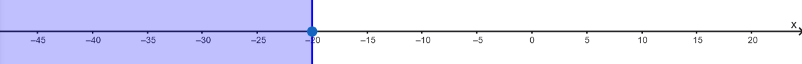
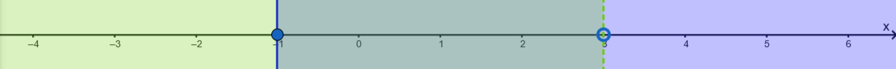

\usepackage{wasysym}

```{=html}
<!-- Φόρτωση βιβλιοθήκης GeoGebra -->
<script src="https://www.geogebra.org/apps/deployggb.js"</script>

<!-- Συνάρτηση δημιουργίας applets -->
<script>
function createGeoGebra(containerId, materialId, width = 700, height = 500) {
  var params = {
    "id": "ggb-" + containerId,
    "material_id": materialId,
    "width": width,
    "height": height,
    "showToolBar": true,
    "showMenuBar": false,
    "showAlgebraInput": true
  };
  
  var applet = new GGBApplet(params, '5.2');
  applet.inject(containerId);
}
</script>
```

## Ανισώσεις α βαθμού

Οι **ανισώσεις α' βαθμού με μία μεταβλητή** αποτελούν ένα θεμελιώδες κεφάλαιο των Μαθηματικών, που μας επιτρέπει να συγκρίνουμε αλγεβρικές παραστάσεις και να προσδιορίζουμε το σύνολο των τιμών που τις επαληθεύουν.

::: {style="background-color: #f0f8cc; border: 2px solid #2f3e50; color: #25188a; padding: 15px; border-radius: 5px;"}
### **1. Θεωρία Ανισώσεων**

#### **Βασικοί Ορισμοί**

-   **Ανίσωση** ονομάζεται μια σχέση ανισότητας (χρησιμοποιώντας τα σύμβολα $<, >, \leq, \geq$) που περιέχει μια μεταβλητή (συνήθως το $x$).
-   **Λύση μιας ανίσωσης** είναι κάθε τιμή της μεταβλητής που την επαληθεύει. Σε αντίθεση με τις εξισώσεις, μια ανίσωση έχει συνήθως **άπειρες λύσεις**, οι οποίες αποτελούν ένα σύνολο.
:::

#### **Ιδιότητες της Ανισότητας**

Για να λύσουμε μια ανίσωση, χρησιμοποιούμε τις παρακάτω βασικές ιδιότητες:

1\.
**Πρόσθεση/Αφαίρεση:** Αν προσθέσουμε ή αφαιρέσουμε τον ίδιο αριθμό και στα δύο μέλη μιας ανίσωσης, προκύπτει μια νέα ανίσωση με την **ίδια φορά**.

\* *Αν* $\alpha < \beta$, τότε $\alpha \pm \gamma < \beta \pm \gamma$.

2\.
**Πολλαπλασιασμός/Διαίρεση με θετικό αριθμό:** Η φορά της ανίσωσης **παραμένει η ίδια**.
\*Αν\* $\alpha < \beta$, και $γ>0$ τότε $\alpha \times \gamma < \beta \times \gamma$.

3\.
**Πολλαπλασιασμός/Διαίρεση με αρνητικό αριθμό:** Η φορά της ανίσωσης **πρέπει να αλλάξει** (το $>$ γίνεται $<$ και αντίστροφα).
 *Αν* $\alpha < \beta$, και $γ<0$ τότε $\alpha \times \gamma > \beta \times \gamma$.

\* *Προσοχή: Αυτό είναι το πιο συχνό σημείο λάθους*.

#### **Βήματα Επίλυσης**

Παράδειγμα: Να λυθεί η ανίσωση $$\frac{3x}{5}-\frac{2(x+5)}{5}\ge \frac{x}{2}+4$$

Η διαδικασία είναι παρόμοια με αυτή των εξισώσεων:

1\.
**Απαλοιφή παρονομαστών** (αν υπάρχουν) πολλαπλασιάζοντας όλα τα μέλη με το Ε.Κ.Π..

Ε.Κ.Π(5,2)=10 Άρα θα έχουμε\
$$10\times\frac{3x}{5}-10\times\frac{2(x+5)}{5}\ge 10\times\frac{x}{2}+10\times4$$ ή

$$2\times{3x}-2\times{2(x+5)}\ge 5\times{x}+10\times4$$

2\.
**Απαλοιφή παρενθέσεων** με την επιμεριστική ιδιότητα.

$$6\cdot x-4\cdot(x+5)\ge 5\cdot{x}+40$$ ή $$2x-4x-20 \ge5x+40$$

3\.
**Χωρισμός γνωστών από αγνώστους** (μεταφορά όρων με αλλαγή προσήμου).

$$6x-4x-5x\ge20+40$$

4\.
**Αναγωγή ομοίων όρων**.

$$-3x \ge 60$$

5\.
**Διαίρεση με τον συντελεστή του αγνώστου** (προσοχή στη φορά αν ο συντελεστής είναι αρνητικός).

$$\frac{-3x}{-3} \le \frac{60}{-3}$$ η $$x\le-\frac{60}{3}  \quad  \text{    ή   }  \quad x\le=-20$$

Γραφική απεικόνιση της λύσης



ή $x \in (-\infty,-20]$

------------------------------------------------------------------------

### **2. Ειδικές Περιπτώσεις & Συστήματα**

-   **Αδύνατη Ανίσωση:** Όταν καταλήγουμε σε μια ψευδή σχέση, όπως $0x > 8$, η ανίσωση δεν έχει λύση.

**Παράδειγμα Αδύνατης Ανίσωσης**

Μια ανίσωση ονομάζεται **αδύνατη** όταν δεν επαληθεύεται για καμία τιμή της μεταβλητής.

**Άσκηση:** Να λυθεί η ανίσωση $x + 2 + 2(x - 3) > 3x + 4$.

\* **Βήμα 1 (Επιμεριστική):** $x + 2 + 2x - 6 > 3x + 4$.

\* **Βήμα 2 (Χωρισμός όρων):** $x + 2x - 3x > 4 - 2 + 6$.

\* **Βήμα 3 (Αναγωγή ομοίων όρων):** $0x > 8$.

\* **Συμπέρασμα:** Επειδή το γινόμενο $0x$ είναι πάντα ίσο με $0$, η σχέση $0 > 8$ είναι ψευδής για κάθε τιμή του $x$.
Επομένως, η ανίσωση είναι **αδύνατη**.

-   **Αόριστη Ανίσωση (Ταυτότητα):** Όταν καταλήγουμε σε μια πάντα αληθή σχέση, όπως $0x < 8$, η ανίσωση αληθεύει για κάθε πραγματική τιμή του $x$.

**Παράδειγμα Αόριστης Ανίσωσης (Ταυτότητα)**

Μια ανίσωση είναι **αόριστη** (ή αληθής για κάθε τιμή) όταν επαληθεύεται από κάθε πραγματικό αριθμό.

**Άσκηση:** Να λυθεί η ανίσωση $3x - 5 + x < 4x + 3$.

\* **Βήμα 1 (Χωρισμός όρων):** $3x + x - 4x < 3 + 5$.

\* **Βήμα 2 (Αναγωγή ομοίων όρων):** $0x < 8$.

\* **Συμπέρασμα:** Η σχέση $0 < 8$ ισχύει πάντα, ανεξάρτητα από την τιμή που θα δώσουμε στο $x$.
Άρα, η ανίσωση αληθεύει για **κάθε τιμή της μεταβλητής** $x$.

-   **Συναλήθευση (Συστήματα):** Για να βρούμε τις κοινές λύσεις δύο ή περισσότερων ανισώσεων, τις λύνουμε χωριστά και αναπαριστούμε τις λύσεις τους στην ίδια ευθεία αριθμών. Οι κοινές λύσεις αποτελούν τη λύση του συστήματος.
-   **Διαστήματα:** Οι λύσεις μπορούν να γραφτούν συμβολικά ως διαστήματα (π.χ. $x \in (3, +\infty)$ για $x > 3$) ή γραφικά στην ευθεία των αριθμών με κυκλάκια
    -   (ανοικτό $\circ$ αν η τιμή δεν συμπεριλαμβάνεται,
    -   κλειστό $\bullet$ αν συμπεριλαμβάνεται).

**Παράδειγμα Συστήματος Ανισώσεων**

Για να λύσουμε ένα σύστημα, βρίσκουμε τις **κοινές λύσεις** (συναλήθευση) των ανισώσεων που το αποτελούν.

**Άσκηση:** Να βρεθούν οι κοινές λύσεις των ανισώσεων $2x - 1 \geq x - 2$ και $\frac{x+6}{3} < 3$.

\* **Λύση 1ης ανίσωσης:** $2x - 1 \geq x - 2 \implies 2x - x \geq 1 - 2 \implies \mathbf{x \geq -1}$.

\* **Λύση 2ης ανίσωσης:** $\frac{x+6}{3} < 3 \implies x + 6 < 9 \implies x < 9 - 6 \implies \mathbf{x < 3}$.

\* **Συναλήθευση:** Αναπαριστούμε τις λύσεις στην ίδια ευθεία αριθμών.



Οι κοινές λύσεις είναι οι αριθμοί που είναι μεγαλύτεροι ή ίσοι του $-1$ και ταυτόχρονα μικρότεροι του $3$.
\* **Τελικό Αποτέλεσμα:** Το σύνολο των λύσεων είναι $-1 \leq x < 3$ ή συμβολικά το διάστημα $x \in [-1, 3)$.

------------------------------------------------------------------------

### **3. Ασκήσεις για Εξάσκηση**

#### **Α. Βασικές Ανισώσεις**

1.  Να λύσετε την ανίσωση: $8x + 4 \geq 16 + 5x$.
2.  Να λύσετε την ανίσωση: $2(x - 1) - 3(x + 1) \geq 4(x + 2) + 12$ και να παραστήσετε τη λύση στην ευθεία των αριθμών.
3.  Να λύσετε την ανίσωση με παρονομαστές: $\frac{2(x-4)}{3} \leq \frac{x+8}{2} - \frac{4x-5}{6}$.

#### **Β. Συστήματα Ανισώσεων**

4.  Να βρείτε τις κοινές λύσεις των ανισώσεων: $2x - 1 \geq x - 2$ και $\frac{x+6}{3} < 3$.
5.  Να βρείτε το σύνολο των λύσεων που ικανοποιούν ταυτόχρονα τις: $x - 4 < 1$ και $2 - x < 3$.

#### **Γ. Προβλήματα με Ανισώσεις**

6.  **Κόστος Διαδρομών:** Μια μηνιαία κάρτα λεωφορείου κοστίζει €40, ενώ η απλή διαδρομή €1,50. Πόσες διαδρομές πρέπει να κάνει κάποιος το μήνα ώστε να τον συμφέρει η κάρτα;.
7.  **Μισθός και Προμήθεια:** Ένας υπάλληλος έχει βασικό μισθό €700 και παίρνει 8% προμήθεια επί των πωλήσεων. Πόσες πωλήσεις πρέπει να κάνει για να λάβει τουλάχιστον €2300 το μήνα;.

------------------------------------------------------------------------

### **4. Ερωτήσεις Κατανόησης (Σωστό/Λάθος)**

-   Αν $\alpha < \beta$, τότε $-\alpha < -\beta$. (**Λάθος**, η φορά αλλάζει).
-   Η ανίσωση $0x = 0$ είναι αόριστη. (**Σωστό**).
-   Αν $\alpha > 1$, τότε $1 > \frac{1}{\alpha}$. (**Σωστό**).

### **Ασκήσεις Ανισώσεων (Για επίλυση)**

1.  Να λύσετε την ανίσωση: $8x + 4 \geq 16 + 5x$.
2.  Να εξετάσετε αν η ανίσωση $x + 2 + 2(x - 3) > 3x + 4$ έχει λύσεις.
3.  Να βρείτε τις κοινές λύσεις των ανισώσεων: $x - 4 < 1$ και $2 - x < 3$.
4.  Να προσδιορίσετε το σύνολο λύσεων της ανίσωσης: $3x - 5 + x < 4x + 3$.
5.  Να λύσετε την ανίσωση και να παραστήσετε τη λύση γραφικά: $x + 3 > -2$.
6.  Να δείξετε αν η ανίσωση $2(\kappa - 1) - 3\kappa \geq 5 - \kappa$ είναι αδύνατη.
7.  Να λύσετε το σύστημα: $3x - 5 \geq x + 3$ και $4 < 14 + 5x$.
8.  Να χαρακτηρίσετε την ανίσωση: $x + 500 > x + 499$.
9.  Να λύσετε την ανίσωση με παρονομαστές: $\frac{3x - 4}{4} - \frac{2 - x}{3} > 1$.
10. Να βρείτε το διάστημα των κοινών λύσεων για τις ανισώσεις: $x < 5$ και $x \geq -2$.
11. Να εξετάσετε την ανίσωση: $3y - 5 + y > 4y + 3$.
12. Να λύσετε την ανίσωση: $2(x - 1) - 3(x + 2) < 4(x + 1) - 5(x - 2)$.
13. Να βρείτε τις κοινές λύσεις του συστήματος: $2x - 1 \geq x - 2$ και $\frac{x+6}{3} < 3$.
14. Να λύσετε την ανίσωση: $-(1 - x) > 2x - 1$.
15. Να αποδείξετε ότι η ανίσωση $5x + 3 < 5x - 2$ είναι αδύνατη.
16. Να λύσετε την ανίσωση: $2(x + 4) - 4x \leq 8 - 2x$.
17. Να προσδιορίσετε τις κοινές λύσεις: $3(x + 2) < x - 4$ και $3x + 2 \geq 5x - 6$.
18. Να λύσετε την ανίσωση: $-7x + 3 \geq 4 - x$.
19. Να εξετάσετε αν η ανίσωση $0x \geq 10$ έχει λύση.
20. Να βρείτε το σύνολο λύσεων της ανίσωσης: $5(x + 3) \geq 5x + 3$.
21. Να λύσετε το σύστημα: $2(x + 1) + x > 6 - 2x$ και $7x - 8 > 3(x + 3) + 7$.
22. Να λύσετε την ανίσωση: $3(\omega - 1) > \omega - 2$.
23. Να χαρακτηρίσετε την ανίσωση $x - (x + 5) > 0$ ως προς το πλήθος των λύσεών της.
24. Να λύσετε την ανίσωση: $0x < 8$.
25. Να βρείτε τις κοινές λύσεις των ανισώσεων: $3x - 1 > 2(1 - x) + 7$ και $3(1 - x) \geq 6$.
26. Να λύσετε την ανίσωση: $2x + 2 - (x - 2) \geq 4 - x$.
27. Να εξετάσετε αν η ανίσωση $\frac{x}{2} + 1 > \frac{x+5}{2}$ είναι αδύνατη.
28. Να λύσετε την ανίσωση: $x - 2 < x + 5$.
29. Να βρείτε τις τιμές που συναληθεύουν στις: $y \geq 2$ και $y \leq 7 \frac{1}{2}$.
30. Να λύσετε την ανίσωση: $3y - 1 - (y + 2) < 2(y + 2) + 1$.
31. Να αποδείξετε ότι η ανίσωση $3(x + 2) - 3x < -4$ δεν έχει λύση.
32. Να λύσετε την ανίσωση: $4x + 1 > 4x - 10$.
33. Να βρείτε τις κοινές λύσεις για το σύστημα τριών ανισώσεων: $2x - 1 < 7$, $3(x - 1) > -6$ και $x \geq 3(x - 2)$.
34. Να λύσετε την ανίσωση: $4(t + 5) < t - 4$.
35. Να εξετάσετε αν η ανίσωση $4(x - 1) + 2 \geq 4x + 7$ είναι αδύνατη.
36. Να λύσετε την ανίσωση: $3(x - 1) \leq 3x + 2$.
37. Να βρείτε τις κοινές λύσεις των ανισώσεων: $x < -3$ και $x \geq -1$.
38. Να λύσετε την ανίσωση: $x - 1 \geq 2x$.
39. Να αποδείξετε ότι η ανίσωση $\frac{2x+4}{2} \geq x - 1$ αληθεύει για κάθε τιμή του $x$.
40. Να λύσετε την ανίσωση: $2(x - 1) - 3(x + 1) \geq 4(x + 2) + 12$.

Ακολουθούν **10 προβλήματα** από την καθημερινή ζωή και τα Μαθηματικά που επιλύονται με τη χρήση **ανισώσεων α' βαθμού**:

1.  **Κόστος Διαδρομών με Λεωφορείο:** Μια μηνιαία κάρτα λεωφορείου κοστίζει **€40**, ενώ η απλή διαδρομή χωρίς κάρτα κοστίζει **€1,50**.
    Πόσες διαδρομές το μήνα πρέπει να κάνει κάποιος ώστε να τον συμφέρει οικονομικά η αγορά της κάρτας;

2.  **Μισθός με Προμήθεια Πωλήσεων:** Ένας υπάλληλος έχει σταθερό μηνιαίο μισθό **€700** και λαμβάνει **8% προμήθεια** επί των πωλήσεων που πραγματοποιεί.
    Πόσες πωλήσεις πρέπει να κάνει ώστε ο συνολικός του μισθός να είναι **τουλάχιστον €2300** το μήνα;

3.  **Υπολογισμός Φωτογραφιών Περιοδικού:** Ένας φωτογράφος έχει βασικό μισθό **€500** και αμείβεται με επιπλέον **€20 για κάθε φωτογραφία** που δημοσιεύεται.
    Αν η διεύθυνση διαθέτει έως **€2250** το μήνα για αυτόν, πόσες φωτογραφίες πρέπει να δημοσιευθούν ώστε ο μισθός του να είναι **μεγαλύτερος από €1200**;

4.  **Όριο Ενοικίασης Αυτοκινήτου:** Μια εταιρεία ενοικίασης χρεώνει **€19,50 τη μέρα** και **€0,20 ανά χιλιόμετρο**.
    Αν ο εργοδότης καλύπτει μέχρι **€35 την ημέρα**, ποιος είναι ο **μέγιστος αριθμός χιλιομέτρων** που μπορεί να διανύσει ο ενοικιαστής ημερησίως;

5.  **Σύγκριση Χρημάτων:** Η Άννα είχε **τριπλάσια χρήματα** από τη Μαρία.
    Αφού όμως δαπάνησε **€14**, τώρα έχει **λιγότερα χρήματα** από τη Μαρία.
    Πόσα χρήματα (το πολύ) μπορεί να έχει η Μαρία;

6.  **Μέσος Όρος Βαθμολογίας:** Ο Γιώργος έχει γράψει δύο διαγωνίσματα με βαθμούς **12 και 14**.
    Τι βαθμό πρέπει να γράψει στο τρίτο διαγώνισμα ώστε ο **μέσος όρος** του να είναι **πάνω από 14**;

7.  **Επιλογή Πακέτου Τηλεφωνίας:** Η εταιρεία "Parlanet" προσφέρει δύο πακέτα: το 1ο με πάγιο **€7,50** και χρέωση **€0,254/λεπτό**, και το 2ο με πάγιο **€15** και χρέωση **€0,204/λεπτό**.
    Από ποιο **χρόνο ομιλίας** και πάνω συμφέρει το 2ο πακέτο;

8.  **Διαστάσεις Οικοπέδου:** Ένα ορθογώνιο οικόπεδο έχει μήκος **80 m**.
    Αν η **περίμετρός** του πρέπει να είναι **μικρότερη από 240 m** και το **εμβαδόν** του **μεγαλύτερο από 3000 m²**, ποιες είναι οι δυνατές τιμές για το πλάτος του;

9.  **Αντοχή Γέφυρας και Φορτίο:** Ένα φορτηγό με απόβαρο **3 τόνων** μεταφέρει βαρέλια των **200 kg** το καθένα.
    Πόσα βαρέλια μπορεί να μεταφέρει το πολύ ώστε να περάσει με ασφάλεια μια γέφυρα με **αντοχή 8 τόνων**;

10. **Συνδρομή Γυμναστηρίου:** Το πακέτο Α χρεώνει **€10 πάγιο** και **€2 ανά επίσκεψη**, ενώ το πακέτο Β **€17,50 πάγιο** και **€1,50 ανά επίσκεψη**.
    Πόσες επισκέψεις το μήνα πρέπει να κάνει κάποιος ώστε να τον **συμφέρει το πακέτο Β**;

::: callout-important
:::

::: {style="background-color: #f0f8cc; border: 2px solid #2f3e50; color: #25188a; padding: 15px; border-radius: 5px;"}
ΚΑΛΗ ΜΕΛΕΤΗ !
:::
