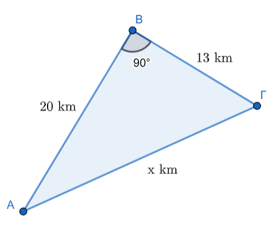
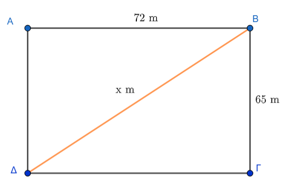

\usepackage{wasysym}

```{=html}
<!-- Φόρτωση βιβλιοθήκης GeoGebra -->
<script src="https://www.geogebra.org/apps/deployggb.js"</script>

<!-- Συνάρτηση δημιουργίας applets -->
<script>
function createGeoGebra(containerId, materialId, width = 700, height = 500) {
  var params = {
    "id": "ggb-" + containerId,
    "material_id": materialId,
    "width": width,
    "height": height,
    "showToolBar": true,
    "showMenuBar": false,
    "showAlgebraInput": true
  };
  
  var applet = new GGBApplet(params, '5.2');
  applet.inject(containerId);
}
</script>
```

## Τετραγωνική ρίζα ενός θετικού αριθμού

Η **τετραγωνική ρίζα ενός θετικού αριθμού** είναι μια βασική έννοια της Άλγεβρας που συνδέεται άμεσα με το εμβαδόν του τετραγώνου και το Πυθαγόρειο θεώρημα.

### **1. Θεωρία Τετραγωνικής Ρίζας**

::: {style="background-color: #f0f8cc; border: 2px solid #2f3e50; color: #25188a; padding: 15px; border-radius: 5px;"}
#### **Ορισμός και Συμβολισμός**

-   **Τετραγωνική ρίζα** ενός θετικού αριθμού $\alpha$ ονομάζεται ο **θετικός αριθμός x**, ο οποίος, όταν υψωθεί στο τετράγωνο, δίνει τον αριθμό $\alpha$. δηλαδή $$\sqrt{a}=x \quad \text {αν } \quad x^2=α$$
-   Συμβολίζεται με $\sqrt{\alpha}$.
-   Ο αριθμός $\alpha$ κάτω από τη ρίζα ονομάζεται **υπόρριζη ποσότητα**, ενώ το σύμβολο $\sqrt{ \quad}$ ονομάζεται **ριζικό**.
-   Επειδή $0^2 = 0$, ορίζουμε ότι $\sqrt{0} = 0$.
:::

#### **Βασικές Ιδιότητες**

-   Αν $\sqrt{\alpha} = x$, τότε πρέπει υποχρεωτικά ο $x$ να είναι **θετικός ή μηδέν** ($x \geq 0$) και το τετράγωνό του να ισούται με την υπόρριζη ποσότητα ($x^2 = \alpha$).
-   Για κάθε θετικό αριθμό $\alpha$, ισχύει η σχέση: $(\sqrt{\alpha})^2 = \alpha$.
-   **Δεν ορίζεται ρίζα αρνητικού αριθμού**, καθώς δεν υπάρχει πραγματικός αριθμός που το τετράγωνό του να είναι αρνητικός (π.χ. η $\sqrt{-25}$ δεν έχει νόημα).
-   **Προσοχή:** Είναι λάθος να γράφουμε $\sqrt{25} = -5$, διότι η τετραγωνική ρίζα εξ ορισμού είναι θετικός αριθμός. Επίσης, $\sqrt{(-5)^2} = \sqrt{25} = 5$.

#### **Πράξεις με Ρίζες**

-   **Γινόμενο:** Η ρίζα ενός γινομένου ισούται με το γινόμενο των ριζών: $\sqrt{\alpha \cdot \beta} = \sqrt{\alpha} \cdot \sqrt{\beta}$.
-   **Πηλίκο:** Η ρίζα ενός πηλίκου ισούται με το πηλίκο των ριζών: $\sqrt{\frac{\alpha}{\beta}} = \frac{\sqrt{\alpha}}{\sqrt{\beta}}$.
-   **Άθροισμα (Προσοχή!):** Γενικά ισχύει ότι $\sqrt{\alpha + \beta} \neq \sqrt{\alpha} + \sqrt{\beta}$.

------------------------------------------------------------------------

### Παραδείγματα

#### **Λυμένες Ασκήσεις**

1.  **Υπολογισμός Ριζών Φυσικών Αριθμών:** Να βρεθούν οι αριθμοί $\sqrt{25}, \sqrt{49}, \sqrt{64}, \sqrt{121}$.
    -   **Λύση:** Αναζητούμε θετικούς αριθμούς που το τετράγωνό τους δίνει την υπόρριζη ποσότητα.
        -   $5^2 = 25$, άρα $\sqrt{25} = 5$.
        -   $7^2 = 49$, άρα $\sqrt{49} = 7$.
        -   $8^2 = 64$, άρα $\sqrt{64} = 8$.
        -   $11^2 = 121$, άρα $\sqrt{121} = 11$.
2.  **Υπολογισμός Ριζών Δεκαδικών Αριθμών:** Να υπολογιστούν οι ρίζες $\sqrt{16}, \sqrt{0,16}, \sqrt{0,0016}$.
    -   **Λύση:**
        -   $4^2 = 16$, άρα $\sqrt{16} = 4$.
        -   $(0,4)^2 = 0,16$, άρα $\sqrt{0,16} = 0,4$.
        -   $(0,04)^2 = 0,0016$, άρα $\sqrt{0,0016} = 0,04$.
3.  **Εύρεση Πλευράς σε Ορθογώνιο Τρίγωνο:** Σε ορθογώνιο τρίγωνο η υποτείνουσα είναι $3,5$ και η μία κάθετη πλευρά $2,8$. Να βρεθεί η άλλη κάθετη πλευρά $\beta$.
    -   **Λύση:** Από το **Πυθαγόρειο θεώρημα** ισχύει $\beta^2 + 2,8^2 = 3,5^2$.
        -   $\beta^2 + 7,84 = 12,25 \Rightarrow \beta^2 = 4,41$.
        -   Επομένως, $\beta = \sqrt{4,41} = 2,1$.
4.  **Υπολογισμός Υποτείνουσας:** Σε ορθογώνιο τρίγωνο οι κάθετες πλευρές είναι $15\text{ cm}$ και $20\text{ cm}$. Να υπολογιστεί η υποτείνουσα $B\Gamma$.
    -   **Λύση:** Από το Πυθαγόρειο θεώρημα έχουμε $B\Gamma^2 = 15^2 + 20^2$.
        -   $B\Gamma^2 = 225 + 400 = 625$.
        -   Άρα, $B\Gamma = \sqrt{625} = 25\text{ cm}$.
5.  **Προσέγγιση Άρρητου Αριθμού:** Να βρεθεί η ρητή προσέγγιση του $\sqrt{13}$ με τρία δεκαδικά ψηφία.
    -   **Λύση:** Με διαδοχικές δοκιμές τετραγώνων βρίσκουμε ότι $3,605^2 = 12,996$ και $3,606^2 = 13,003$.
    -   Άρα, η προσέγγιση του $\sqrt{13}$ είναι $3,605$.

------------------------------------------------------------------------

### **Προβλήματα Καθημερινής Πρακτικής & Επιστημών**

1.  **Αρχιτεκτονική (Τετραγωνική Βάση):** Μια αρχιτέκτων πρέπει να χτίσει σπίτι με τετραγωνική βάση εμβαδού $289\text{ m}^2$.
    Ποιο πρέπει να είναι το μήκος $x$ κάθε πλευράς;

    -   **Λύση:** Το εμβαδό τετραγώνου είναι $E = x^2$.
    -   Πρέπει $x^2 = 289$, οπότε αναζητούμε την τετραγωνική ρίζα του $289$.
    -   Με δοκιμές βρίσκουμε ότι $17^2 = 289$, άρα $x = \sqrt{289} = 17\text{ m}$.

2.  **Χωροταξία (Μεταφορά Επίπλου):** Μπορούμε να σηκώσουμε όρθιο ένα ντουλάπι ύψους $2,1\text{ m}$ και πλάτους $0,7\text{ m}$ σε ένα δωμάτιο ύψους $2,2\text{ m}$;

    -   **Λύση:** Για να σηκωθεί, πρέπει η διαγώνιος $\delta$ του ντουλαπιού να είναι μικρότερη ή ίση με το ύψος του δωματίου ($2,2\text{ m}$).
    -   $\delta^2 = 2,1^2 + 0,7^2 = 4,41 + 0,49 = 4,90$.
    -   $\delta = \sqrt{4,90} \approx 2,21\text{ m}$.
    -   Επειδή $2,21 > 2,2$, **δεν μπορούμε** να σηκώσουμε όρθιο το ντουλάπι.

3.  **Γεωγραφία/Αποστάσεις (Οδοιπορικό):** Κατά τη μετακίνηση από την πόλη Α στην πόλη Β ($20\text{ km}$) και μετά στο χωριό Γ ($13\text{ km}$), όπου οι διαδρομές είναι κάθετες, ποια είναι η απόσταση ΑΓ;

{width="279"}

-   **Λύση:** Η απόσταση ΑΓ είναι η υποτείνουσα ορθογωνίου τριγώνου.
-   $A\Gamma^2 = 20^2 + 13^2 = 400 + 169 = 569$.
-   Άρα, $A\Gamma = \sqrt{569} \approx 23,85\text{ km}$.

------------------------------------------------------------------------

### **2. Ασκήσεις για Εξάσκηση**

#### **Α. Υπολογισμός Ριζών**

1.  Να υπολογίσετε τις ρίζες: $\sqrt{81}$, $\sqrt{0,81}$ και $\sqrt{8100}$.

2.  Να βρείτε τις τιμές: $\sqrt{121}$, $\sqrt{1,21}$ και $\sqrt{0,0121}$.

3.  Να υπολογίσετε τα πηλίκα: $\sqrt{\frac{9}{4}}$ και $\sqrt{\frac{144}{25}}$.

4.  **Υπολογίστε τις τιμές:** $\sqrt{4}$, $\sqrt{0,04}$, $\sqrt{400}$ και $\sqrt{40000}$.

5.  **Υπολογίστε τις τιμές των παραστάσεων:** $\sqrt{\frac{400}{49}}$ και $\sqrt{\frac{36}{121}}$.

6.  **Υπολογίστε τους αριθμούς:** $\sqrt{36}$ και $\sqrt{18+18}$.

7.  **Βρείτε το αποτέλεσμα των πράξεων:** $\sqrt{18 \cdot 18}$ και $(\sqrt{18})^2$.

8.  **Λύστε τις παρακάτω εξισώσεις για θετικό** $x$:\

-   $x^2 = 16$\

-   $x^2 = 121$.

12. **Υπολογίστε με προσέγγιση τριών δεκαδικών ψηφίων τις ρίζες:** $\sqrt{3}$, $\sqrt{50}$ και $\sqrt{72}$.

13. **Υπολογίστε την τιμή της σύνθετης παράστασης:** $\sqrt{7+\sqrt{2+\sqrt{1+\sqrt{9}}}}$

14. Να υπολογίσετε το αποτέλεσμα της παράστασης: $\sqrt{32+32}$ και $\sqrt{12 \cdot 12}$.

15. Να αποδείξετε ότι: $\sqrt{\sqrt{4} + \sqrt{9} + 2} = 2$.

16. Να συμπληρώσετε τον κατάλληλο αριθμό στο κουτάκι ώστε να ισχύει: $(\sqrt{x})^2 = 5$.

17. Να λύσετε τις εξισώσεις: (α) $x^2 = 9$, (β) $x^2 = 64$, (γ) $x^2 = \frac{100}{81}$.

### Β. Προβλήματα

1.  **Πρόβλημα Κατασκευής:** Μια αρχιτέκτονας πρέπει να χτίσει ένα σπίτι με τετραγωνική βάση εμβαδού 289 $m^2$.
    Ποιο πρέπει να είναι το μήκος $x$ κάθε πλευράς της βάσης;.

2.  **Προσέγγιση Πλευράς:** Ένα τετράγωνο έχει εμβαδόν 12 $cm^2$.
    Να βρείτε, με προσέγγιση εκατοστού, το μήκος της πλευράς του.

3.  **Πυθαγόρειο Θεώρημα:** Σε ένα ορθογώνιο τρίγωνο η υποτείνουσα είναι 13 cm και η μία κάθετη πλευρά έχει μήκος 5 cm.
    Χρησιμοποιήστε την τετραγωνική ρίζα για να βρείτε το μήκος της άλλης κάθετης πλευράς.

4.  **Πυθαγόρειο Θεώρημα:** Σε ορθογώνιο τρίγωνο οι κάθετες πλευρές είναι $3\text{ cm}$ και $4\text{ cm}$.
    Να υπολογίσετε την υποτείνουσα χρησιμοποιώντας ρίζα.

5.  Να βρείτε τη διαγώνιο ενός ορθογωνίου γηπέδου με διαστάσεις $65\text{ m}$ και $72\text{ m}$.

{width="328"}

### **Ερωτήσεις Κατανόησης (Σωστό/Λάθος)**

-   Η σχέση $\sqrt{16} = 8$ είναι σωστή; (**Λάθος**, είναι 4).
-   Ισχύει ότι $\sqrt{16+9} = 5$; (**Σωστό**, γιατί $\sqrt{25} = 5$).
-   Υπάρχει η ρίζα $\sqrt{-9}$; (**Λάθος**, δεν υπάρχει για αρνητικούς).
-   Αν $x > 1$, τότε $\sqrt{x} < x < x^2$; (**Σωστό**)

1.  **Σχέση** $y = \sqrt{x}$: Αν $y = \sqrt{x}$ για δύο αριθμούς $x, y$, ο αριθμός $x$ πρέπει να είναι πάντα θετικός ή μηδέν. Στην περίπτωση αυτή, επιλέξτε ποια από τις παρακάτω σχέσεις ισχύει: α) $x^2 = y$, β) $y^2 = x$ ή γ) $x^2 = y^2$.
2.  **Λύσεις Εξίσωσης**: Η εξίσωση $x^2 = 16$ έχει ως λύσεις: α) μόνο το 4, β) μόνο το -4, ή γ) το 4 και το -4;.
3.  **Αντιστοίχιση Ριζών**: Αντιστοιχίστε τους αριθμούς της πρώτης στήλης με την τετραγωνική τους ρίζα στη δεύτερη στήλη:

| Αριθμοί | Τετραγωνική ρίζα |
|:-------:|:----------------:|
|   81    |        7         |
|   16    |        9         |
|   49    |        4         |
|   25    |        12        |
|   144   |        5         |

4.  **Έλεγχος Ισοτήτων**: Χαρακτηρίστε τις παρακάτω προτάσεις ως Σωστές (Σ) ή Λανθασμένες (Λ):
    -   $\sqrt{16} = 8$.
    -   $\sqrt{9} = 3$.
    -   $\sqrt{0,4} = 0,2$.
    -   $\sqrt{100} = 50$.
5.  **Ρίζα Αθροίσματος**: Εξετάστε αν η πρόταση $\sqrt{16+9} = 5$ είναι σωστή και εξηγήστε αν το αποτέλεσμα της ρίζας ενός αθροίσματος ισούται με το άθροισμα των ριζών των προσθετέων.
6.  **Ρίζες Αρνητικών Αριθμών**: Εξηγήστε γιατί η παράσταση $\sqrt{-9}$ δεν έχει νόημα στο σύνολο των πραγματικών αριθμών.
7.  **Εύρεση Αγνώστου** $x$: Αν γνωρίζετε ότι $\sqrt{x} = 9$, ποια είναι η τιμή του $x$; Επιλέξτε ανάμεσα στα:
    -   α) 3,
    -   β) 81,
    -   γ) ±81,
    -   ή δ) η σχέση είναι αδύνατη.
8.  **Ύπαρξη Λύσης**: Είναι δυνατόν να βρεθεί θετικός αριθμός $x$ τέτοιος ώστε $\sqrt{x} = -16$; Δικαιολογήστε την απάντησή σας.
9.  **Προσέγγιση Άρρητων**: Αν ο αριθμός $\sqrt{2}$ βρίσκεται ανάμεσα στο 1,41 και το 1,42, πώς ονομάζονται οι αριθμοί 1,41 και 1,42 σε σχέση με τη $\sqrt{2}$;.
10. **Σύγκριση Μεγεθών**: Αν ένας αριθμός $a$ είναι μεγαλύτερος από το 1 (π.χ. $a=9$), τοποθετήστε σε σειρά από τον μικρότερο στον μεγαλύτερο τους αριθμούς $\sqrt{a}, a, a^2$.

::: callout-important
:::

::: {style="background-color: #f0f8cc; border: 2px solid #2f3e50; color: #25188a; padding: 15px; border-radius: 5px;"}
ΚΑΛΗ ΜΕΛΕΤΗ !
:::
