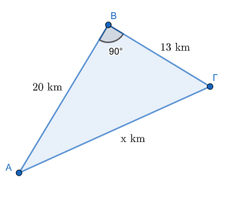
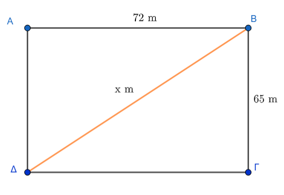

\usepackage{wasysym}

```{=html}
<!-- Φόρτωση βιβλιοθήκης GeoGebra -->
<script src="https://www.geogebra.org/apps/deployggb.js"</script>

<!-- Συνάρτηση δημιουργίας applets -->
<script>
function createGeoGebra(containerId, materialId, width = 700, height = 500) {
  var params = {
    "id": "ggb-" + containerId,
    "material_id": materialId,
    "width": width,
    "height": height,
    "showToolBar": true,
    "showMenuBar": false,
    "showAlgebraInput": true
  };
  
  var applet = new GGBApplet(params, '5.2');
  applet.inject(containerId);
}
</script>
```

## Τετραγωνική ρίζα ενός θετικού αριθμού


### **Τετραγωνική Ρίζα Θετικού Αριθμού**

::: {style="background-color: #e0d6b8; border: 2px solid #2f3e50; color: #25188a; padding: 15px; border-radius: 5px;"}

**Θεωρία και Ορισμοί**

*   **Ορισμός:** Για κάθε πραγματικό αριθμό $\alpha \ge 0$, υπάρχει ένας και μόνο ένας μη αρνητικός πραγματικός αριθμός $\beta \ge 0$, τέτοιος ώστε $\beta^2 = \alpha$,. Αυτός ο μοναδικός αριθμός $\beta$ ονομάζεται **τετραγωνική ρίζα** του $\alpha$ και συμβολίζεται με $\sqrt{\alpha}$,.

*   **Ορολογία:** Στην έκφραση $\sqrt{\alpha}$, το σύμβολο $\sqrt{}$ ονομάζεται **ριζικό** και ο αριθμός $\alpha$ που βρίσκεται κάτω από αυτό ονομάζεται **υπόρριζο**.

*   **Πραγματικές τετραγωνικές ρίζες:** Κάθε πραγματικός αριθμός $x$ που ικανοποιεί τη σχέση $x^2 = \alpha$ ονομάζεται πραγματική τετραγωνική ρίζα του $\alpha$. 
    *   Αν **$\alpha < 0$**, δεν υπάρχει πραγματική τετραγωνική ρίζα, καθώς το τετράγωνο κάθε πραγματικού αριθμού είναι μη αρνητικό ($x^2 \ge 0$).
    *   Αν **$\alpha = 0$**, υπάρχει μία μόνο ρίζα, το $0$ ($\sqrt{0}=0$).
    *   Αν **$\alpha > 0$**, υπάρχουν **δύο αντίθετες** πραγματικές τετραγωνικές ρίζες, οι $\sqrt{\alpha}$ και $-\sqrt{\alpha}$,. Για παράδειγμα, οι ρίζες του $4$ είναι το $2$ και το $-2$, όμως το σύμβολο $\sqrt{4}$ παριστάνει αποκλειστικά τη θετική τιμή, δηλαδή $\sqrt{4} = 2$,.

**Ιδιότητες**

Για κάθε πραγματικό αριθμό $\alpha \ge 0$ και $\beta > 0$ ισχύουν τα εξής:

1.  **Θεμελιώδης ιδιότητα:** $(\sqrt{\alpha})^2 = \alpha$ και $\sqrt{\alpha^2} = \alpha$ (εφόσον $\alpha \ge 0$),.

2.  **Γενική περίπτωση:** Για κάθε πραγματικό αριθμό $\alpha$ (θετικό ή αρνητικό), ισχύει $\sqrt{\alpha^2} = |\alpha|$.

3.  **Γινόμενο ριζών:** $\sqrt{\alpha} \cdot \sqrt{\beta} = \sqrt{\alpha \cdot \beta}$.

4.  **Πηλίκο ριζών:** $\dfrac{\sqrt{\alpha}}{\sqrt{\beta}} = \sqrt{\dfrac{\alpha}{\beta}}$.

5.  **Εισαγωγή παράγοντα:** $\beta\sqrt{\alpha} = \sqrt{\beta^2\alpha}$ (αν $\beta \ge 0$) και $\beta\sqrt{\alpha} = -\sqrt{\beta^2\alpha}$ (αν $\beta < 0$),.

6.  **Δύναμη ρίζας:** $(\sqrt{\alpha})^\nu = \sqrt{\alpha^\nu}$ για κάθε φυσικό αριθμό $\nu$.

7.  **Τέλεια τετράγωνα:** Οι αριθμοί των οποίων η τετραγωνική ρίζα είναι ακέραιος (π.χ. $1, 4, 9, 16, \dots$) ονομάζονται τέλεια τετράγωνα. Αν ένας φυσικός αριθμός $k$ δεν είναι τέλειο τετράγωνο, τότε η $\sqrt{k}$ είναι **άρρητος αριθμός**,.

:::

**Παραδείγματα**

1.  **Υπολογισμός:** $\sqrt{49} = 7$, επειδή $7^2 = 49$ και $7 > 0$.
2.  **Απόλυτη τιμή:** $\sqrt{(-5)^2} = |-5| = 5$.
3.  **Γινόμενο:** $\sqrt{2} \cdot \sqrt{8} = \sqrt{2 \cdot 8} = \sqrt{16} = 4$,.
4.  **Πηλίκο:** $\dfrac{\sqrt{18}}{\sqrt{2}} = \sqrt{\dfrac{18}{2}} = \sqrt{9} = 3$.
5.  **Εξίσωση:** Η εξίσωση $x^2 = 36$ έχει δύο λύσεις, τις $x = \sqrt{36} = 6$ και $x = -\sqrt{36} = -6$.
1.  **Υπολογισμός Ριζών Φυσικών Αριθμών:** Να βρεθούν οι αριθμοί $\sqrt{25}, \sqrt{49}, \sqrt{64}, \sqrt{121}$.
    -   **Λύση:** Αναζητούμε θετικούς αριθμούς που το τετράγωνό τους δίνει την υπόρριζη ποσότητα.
        -   $5^2 = 25$, άρα $\sqrt{25} = 5$.
        -   $7^2 = 49$, άρα $\sqrt{49} = 7$.
        -   $8^2 = 64$, άρα $\sqrt{64} = 8$.
        -   $11^2 = 121$, άρα $\sqrt{121} = 11$.
2.  **Υπολογισμός Ριζών Δεκαδικών Αριθμών:** Να υπολογιστούν οι ρίζες $\sqrt{16}, \sqrt{0,16}, \sqrt{0,0016}$.
    -   **Λύση:**
        -   $4^2 = 16$, άρα $\sqrt{16} = 4$.
        -   $(0,4)^2 = 0,16$, άρα $\sqrt{0,16} = 0,4$.
        -   $(0,04)^2 = 0,0016$, άρα $\sqrt{0,0016} = 0,04$.
3.  **Εύρεση Πλευράς σε Ορθογώνιο Τρίγωνο:** Σε ορθογώνιο τρίγωνο η υποτείνουσα είναι $3,5$ και η μία κάθετη πλευρά $2,8$. Να βρεθεί η άλλη κάθετη πλευρά $\beta$.
    -   **Λύση:** Από το **Πυθαγόρειο θεώρημα** ισχύει $\beta^2 + 2,8^2 = 3,5^2$.
        -   $\beta^2 + 7,84 = 12,25 \Rightarrow \beta^2 = 4,41$.
        -   Επομένως, $\beta = \sqrt{4,41} = 2,1$.
4.  **Υπολογισμός Υποτείνουσας:** Σε ορθογώνιο τρίγωνο οι κάθετες πλευρές είναι $15\text{ cm}$ και $20\text{ cm}$. Να υπολογιστεί η υποτείνουσα $B\Gamma$.
    -   **Λύση:** Από το Πυθαγόρειο θεώρημα έχουμε $B\Gamma^2 = 15^2 + 20^2$.
        -   $B\Gamma^2 = 225 + 400 = 625$.
        -   Άρα, $B\Gamma = \sqrt{625} = 25\text{ cm}$.
5.  **Προσέγγιση Άρρητου Αριθμού:** Να βρεθεί η ρητή προσέγγιση του $\sqrt{13}$ με τρία δεκαδικά ψηφία.
    -   **Λύση:** Με διαδοχικές δοκιμές τετραγώνων βρίσκουμε ότι $3,605^2 = 12,996$ και $3,606^2 = 13,003$.
    -   Άρα, η προσέγγιση του $\sqrt{13}$ είναι $3,605$.

**Ασκήσεις**

1.  Βρείτε την τετραγωνική ρίζα των αριθμών: $1764, 3844, 5625$.
2.  Υπολογίστε τις ρίζες των κλασμάτων: $\dfrac{81}{256}$ και $\dfrac{1296}{1681}$.
3.  Βρείτε την τιμή της $\sqrt{13,69}$ και της $\sqrt{0,0361}$.
4.  Απλοποιήστε την παράσταση: $2\sqrt{27} - \sqrt{12} + 2\sqrt{3} - 3\sqrt{48}$.
5.  Υπολογίστε το εξαγόμενο: $\sqrt{3\sqrt{2}+2\sqrt{3}} \cdot \sqrt{3\sqrt{2}-2\sqrt{3}}$.
6.  Μετατρέψτε το κλάσμα $\dfrac{6}{\sqrt{3}}$ σε ισοδύναμο με ρητό παρονομαστή.
7.  Απλοποιήστε την έκφραση: $\sqrt{(1-\sqrt{2})^2} - \sqrt{(1+\sqrt{2})^2}$.
8.  Βρείτε την πλευρά τετραγώνου που έχει εμβαδόν $2809\ \text{m}^2$.
9.  Αν $x = \sqrt{12} - \sqrt{6}$, υπολογίστε την τιμή του $x^2$.
10. Υπολογίστε κατά προσέγγιση εκατοστού την $\sqrt{62}$ (γνωρίζοντας ότι $7 < \sqrt{62} < 8$).


---


### Λυμένα Προβλήματα

1.  **Αρχιτεκτονική (Τετραγωνική Βάση):** Μια αρχιτέκτων πρέπει να χτίσει σπίτι με τετραγωνική βάση εμβαδού $289\text{ m}^2$.
    Ποιο πρέπει να είναι το μήκος $x$ κάθε πλευράς;

    -   **Λύση:** Το εμβαδό τετραγώνου είναι $E = x^2$.
    -   Πρέπει $x^2 = 289$, οπότε αναζητούμε την τετραγωνική ρίζα του $289$.
    -   Με δοκιμές βρίσκουμε ότι $17^2 = 289$, άρα $x = \sqrt{289} = 17\text{ m}$.

2.  **Χωροταξία (Μεταφορά Επίπλου):** Μπορούμε να σηκώσουμε όρθιο ένα ντουλάπι ύψους $2,1\text{ m}$ και πλάτους $0,7\text{ m}$ σε ένα δωμάτιο ύψους $2,2\text{ m}$;

    -   **Λύση:** Για να σηκωθεί, πρέπει η διαγώνιος $\delta$ του ντουλαπιού να είναι μικρότερη ή ίση με το ύψος του δωματίου ($2,2\text{ m}$).
    -   $\delta^2 = 2,1^2 + 0,7^2 = 4,41 + 0,49 = 4,90$.
    -   $\delta = \sqrt{4,90} \approx 2,21\text{ m}$.
    -   Επειδή $2,21 > 2,2$, **δεν μπορούμε** να σηκώσουμε όρθιο το ντουλάπι.

3.  **Γεωγραφία/Αποστάσεις (Οδοιπορικό):** Κατά τη μετακίνηση από την πόλη Α στην πόλη Β ($20\text{ km}$) και μετά στο χωριό Γ ($13\text{ km}$), όπου οι διαδρομές είναι κάθετες, ποια είναι η απόσταση ΑΓ;

{width="279"}

-   **Λύση:** Η απόσταση ΑΓ είναι η υποτείνουσα ορθογωνίου τριγώνου.
-   $A\Gamma^2 = 20^2 + 13^2 = 400 + 169 = 569$.
-   Άρα, $A\Gamma = \sqrt{569} \approx 23,85\text{ km}$.

------------------------------------------------------------------------

### **Ασκήσεις για Εξάσκηση**

#### **Α. Υπολογισμός Ριζών**

1.  Να υπολογίσετε τις ρίζες: $\sqrt{81}$, $\sqrt{0,81}$ και $\sqrt{8100}$.

2.  Να βρείτε τις τιμές: $\sqrt{121}$, $\sqrt{1,21}$ και $\sqrt{0,0121}$.

3.  Να υπολογίσετε τα πηλίκα: $\sqrt{\dfrac{9}{4}}$ και $\sqrt{\dfrac{144}{25}}$.

4.  **Υπολογίστε τις τιμές:** $\sqrt{4}$, $\sqrt{0,04}$, $\sqrt{400}$ και $\sqrt{40000}$.

5.  **Υπολογίστε τις τιμές των παραστάσεων:** $\sqrt{\dfrac{400}{49}}$ και $\sqrt{\dfrac{36}{121}}$.

6.  **Υπολογίστε τους αριθμούς:** $\sqrt{36}$ και $\sqrt{18+18}$.

7.  **Βρείτε το αποτέλεσμα των πράξεων:** $\sqrt{18 \cdot 18}$ και $(\sqrt{18})^2$.

8.  **Λύστε τις παρακάτω εξισώσεις για θετικό** $x$:\

-   $x^2 = 16$\

-   $x^2 = 121$.

12. **Υπολογίστε με προσέγγιση τριών δεκαδικών ψηφίων τις ρίζες:** $\sqrt{3}$, $\sqrt{50}$ και $\sqrt{72}$.

13. **Υπολογίστε την τιμή της σύνθετης παράστασης:** $\sqrt{7+\sqrt{2+\sqrt{1+\sqrt{9}}}}$

14. Να υπολογίσετε το αποτέλεσμα της παράστασης: $\sqrt{32+32}$ και $\sqrt{12 \cdot 12}$.

15. Να αποδείξετε ότι: $\sqrt{\sqrt{4} + \sqrt{9} + 2} = 2$.

16. Να συμπληρώσετε τον κατάλληλο αριθμό στο κουτάκι ώστε να ισχύει: $(\sqrt{x})^2 = 5$.

17. Να λύσετε τις εξισώσεις: (α) $x^2 = 9$, (β) $x^2 = 64$, (γ) $x^2 = \dfrac{100}{81}$.

### Β. Προβλήματα

1.  **Πρόβλημα Κατασκευής:** Μια αρχιτέκτονας πρέπει να χτίσει ένα σπίτι με τετραγωνική βάση εμβαδού 289 $m^2$.
    Ποιο πρέπει να είναι το μήκος $x$ κάθε πλευράς της βάσης;.

2.  **Προσέγγιση Πλευράς:** Ένα τετράγωνο έχει εμβαδόν 12 $cm^2$.
    Να βρείτε, με προσέγγιση εκατοστού, το μήκος της πλευράς του.

3.  **Πυθαγόρειο Θεώρημα:** Σε ένα ορθογώνιο τρίγωνο η υποτείνουσα είναι 13 cm και η μία κάθετη πλευρά έχει μήκος 5 cm.
    Χρησιμοποιήστε την τετραγωνική ρίζα για να βρείτε το μήκος της άλλης κάθετης πλευράς.

4.  **Πυθαγόρειο Θεώρημα:** Σε ορθογώνιο τρίγωνο οι κάθετες πλευρές είναι $3\text{ cm}$ και $4\text{ cm}$.
    Να υπολογίσετε την υποτείνουσα χρησιμοποιώντας ρίζα.

5.  Να βρείτε τη διαγώνιο ενός ορθογωνίου γηπέδου με διαστάσεις $65\text{ m}$ και $72\text{ m}$.

{width="328"}

### **Ερωτήσεις Κατανόησης (Σωστό/Λάθος)**

-   Η σχέση $\sqrt{16} = 8$ είναι σωστή; (**Λάθος**, είναι 4).
-   Ισχύει ότι $\sqrt{16+9} = 5$; (**Σωστό**, γιατί $\sqrt{25} = 5$).
-   Υπάρχει η ρίζα $\sqrt{-9}$; (**Λάθος**, δεν υπάρχει για αρνητικούς).
-   Αν $x > 1$, τότε $\sqrt{x} < x < x^2$; (**Σωστό**)

1.  **Σχέση** $y = \sqrt{x}$: Αν $y = \sqrt{x}$ για δύο αριθμούς $x, y$, ο αριθμός $x$ πρέπει να είναι πάντα θετικός ή μηδέν. Στην περίπτωση αυτή, επιλέξτε ποια από τις παρακάτω σχέσεις ισχύει: α) $x^2 = y$, β) $y^2 = x$ ή γ) $x^2 = y^2$.
2.  **Λύσεις Εξίσωσης**: Η εξίσωση $x^2 = 16$ έχει ως λύσεις: α) μόνο το 4, β) μόνο το -4, ή γ) το 4 και το -4;.
3.  **Αντιστοίχιση Ριζών**: Αντιστοιχίστε τους αριθμούς της πρώτης στήλης με την τετραγωνική τους ρίζα στη δεύτερη στήλη:

| Αριθμοί | Τετραγωνική ρίζα |
|:-------:|:----------------:|
|   81    |        7         |
|   16    |        9         |
|   49    |        4         |
|   25    |        12        |
|   144   |        5         |

4.  **Έλεγχος Ισοτήτων**: Χαρακτηρίστε τις παρακάτω προτάσεις ως Σωστές (Σ) ή Λανθασμένες (Λ):
    -   $\sqrt{16} = 8$.
    -   $\sqrt{9} = 3$.
    -   $\sqrt{0,4} = 0,2$.
    -   $\sqrt{100} = 50$.
5.  **Ρίζα Αθροίσματος**: Εξετάστε αν η πρόταση $\sqrt{16+9} = 5$ είναι σωστή και εξηγήστε αν το αποτέλεσμα της ρίζας ενός αθροίσματος ισούται με το άθροισμα των ριζών των προσθετέων.
6.  **Ρίζες Αρνητικών Αριθμών**: Εξηγήστε γιατί η παράσταση $\sqrt{-9}$ δεν έχει νόημα στο σύνολο των πραγματικών αριθμών.
7.  **Εύρεση Αγνώστου** $x$: Αν γνωρίζετε ότι $\sqrt{x} = 9$, ποια είναι η τιμή του $x$; Επιλέξτε ανάμεσα στα:
    -   α) 3,
    -   β) 81,
    -   γ) ±81,
    -   ή δ) η σχέση είναι αδύνατη.
8.  **Ύπαρξη Λύσης**: Είναι δυνατόν να βρεθεί θετικός αριθμός $x$ τέτοιος ώστε $\sqrt{x} = -16$; Δικαιολογήστε την απάντησή σας.
9.  **Προσέγγιση Άρρητων**: Αν ο αριθμός $\sqrt{2}$ βρίσκεται ανάμεσα στο 1,41 και το 1,42, πώς ονομάζονται οι αριθμοί 1,41 και 1,42 σε σχέση με τη $\sqrt{2}$;.
10. **Σύγκριση Μεγεθών**: Αν ένας αριθμός $a$ είναι μεγαλύτερος από το 1 (π.χ. $a=9$), τοποθετήστε σε σειρά από τον μικρότερο στον μεγαλύτερο τους αριθμούς $\sqrt{a}, a, a^2$.


::: {style="background-color: #f0f8cc; border: 2px solid #2f3e50; color: #25188a; padding: 15px; border-radius: 5px;"}
ΚΑΛΗ ΜΕΛΕΤΗ !
:::
