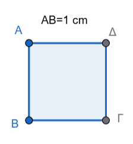
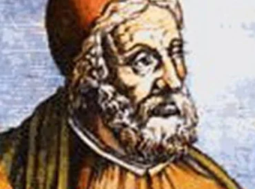
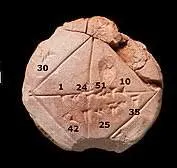
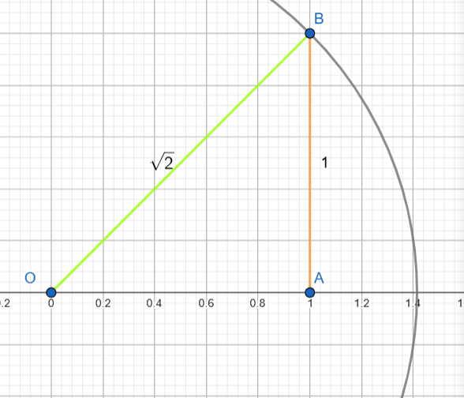
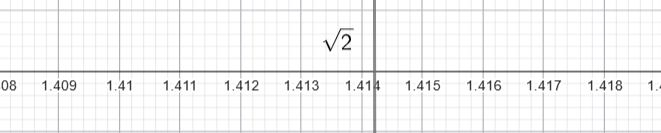
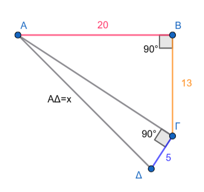

\usepackage{wasysym}

```{=html}
<!-- Φόρτωση βιβλιοθήκης GeoGebra -->
<script src="https://www.geogebra.org/apps/deployggb.js"</script>

<!-- Συνάρτηση δημιουργίας applets -->
<script>
function createGeoGebra(containerId, materialId, width = 700, height = 500) {
  var params = {
    "id": "ggb-" + containerId,
    "material_id": materialId,
    "width": width,
    "height": height,
    "showToolBar": true,
    "showMenuBar": false,
    "showAlgebraInput": true
  };
  
  var applet = new GGBApplet(params, '5.2');
  applet.inject(containerId);
}
</script>
```

## Γνωρίζουμε ότι

::: {style="background-color: #f0f8cc; border: 2px solid #2f3e50; color: #25188a; padding: 15px; border-radius: 5px;"}
Οι **ρητοί αριθμοί** (συμβολίζονται με το γράμμα $\mathbb{Q}$) αποτελούν μια βασική κατηγορία αριθμών στα Μαθηματικά, η οποία περιλαμβάνει όλους τους αριθμούς που μπορούν να εκφραστούν ως πηλίκο δύο ακεραίων.

-   **Ορισμός:** Ρητός είναι κάθε αριθμός που μπορεί να γραφτεί στη μορφή κλάσματος $\frac{\mu}{\nu}$, όπου ο αριθμητής $\mu$ είναι ακέραιος και ο παρονομαστής $\nu$ είναι φυσικός αριθμός (ή ακέραιος) διάφορος του μηδενός.
-   **Ακέραιοι και Ρητοί:** Όλοι οι ακέραιοι αριθμοί (π.χ. -3, 0, 7) είναι ρητοί, καθώς μπορούν να γραφτούν ως κλάσμα με παρονομαστή τη μονάδα (π.χ. $7 = \frac{7}{1}$).
-   **Δεκαδική Μορφή:** Οι ρητοί αριθμοί έχουν συγκεκριμένη δεκαδική παράσταση, η οποία είναι είτε **πεπερασμένη** (π.χ. $0,45$) είτε **απλή ή περιοδική δεκαδική μορφή** (π.χ. $0,181818...$ ή $0,\overline{18}$).
    -   Αν ένας δεκαδικός αριθμός τελειώνει, είναι ρητός.
    -   Αν συνεχίζεται επ' άπειρον αλλά έχει ένα επαναλαμβανόμενο μοτίβο ψηφίων, είναι επίσης ρητός.
-   **Θέση στον Άξονα:** Οι ρητοί αριθμοί τοποθετούνται πάνω στην ευθεία των αριθμών και την «γεμίζουν», αλλά όχι πλήρως, καθώς ανάμεσά τους υπάρχουν και οι άρρητοι αριθμοί. Το σύνολο που περιλαμβάνει τόσο τους ρητούς όσο και τους άρρητους ονομάζεται σύνολο των **πραγματικών αριθμών** ($\mathbb{R}$).
-   **Συμβολισμοί:**
    -   $\mathbb{Q}$: Το σύνολο των ρητών αριθμών.
    -   $\mathbb{Q}^{+}$: Οι θετικοί ρητοί αριθμοί.
    -   $\mathbb{Q}^{-}$: Οι αρνητικοί ρητοί αριθμοί.
:::

#### ***Θυμίζουμε μερικές ασκήσεις:***

**Άσκηση 1: Αναγνώριση Ρητών και Αρρήτων** Να εξετάσετε ποιοι από τους παρακάτω αριθμούς είναι ρητοί: α) $\sqrt{2}$ β) $(\sqrt{2})^2$ γ) $-\frac{4}{9}$ δ) $\sqrt{18}$ ε) $\frac{18}{2}$ στ) $\sqrt{18^2}$

**Άσκηση 2: Μετατροπή σε Κλάσμα** Να γράψετε τους παρακάτω δεκαδικούς αριθμούς σε μορφή κλάσματος (δηλαδή να δείξετε ότι είναι ρητοί): α) $0,1$ β) $0,12$ γ) $0,58$ δ) $0,2589$

**Άσκηση 3: Σύγκριση και Κατάταξη** : Για τους αριθμούς $\frac{27}{7},\quad \sqrt{19}, \quad2\pi,  \quad0,45,\quad - \sqrt{\frac{9}{4}}, \quad6,\quad -\sqrt{8},\quad \sqrt{51}$.
Χωρίς τη χρήση υπολογιστή, τοποθετήστε τους αριθμούς σε αύξουσα σειρά.

------------------------------------------------------------------------

### Απαντήσεις Ασκήσεων

**Απάντηση στην Άσκηση 1:**

\* α) **Δεν είναι ρητος** ($\sqrt{2}$)

\* β) **Ρητός** (γιατί $(\sqrt{2})^2 = 2$)

\* γ) **Ρητός** (μορφή κλάσματος ακεραίων)

\* δ) **Δεν είναι ρητος**

\* ε) **Ρητός** (γιατί $\frac{18}{2} = 9$)

\* στ) **Ρητός** (γιατί $\sqrt{18^2} = 18$)

**Απάντηση στην Άσκηση 2:**

\* α) $\frac{1}{10}$

\* β) $\frac{3}{25}$ (μετά από απλοποίηση του $\frac{12}{100}$)

\* γ) $\frac{29}{50}$ (μετά από απλοποίηση του $\frac{58}{100}$)

\* δ) $\frac{2589}{10000}$

**Απάντηση στην Άσκηση 3:** Η σειρά σε αύξουσα μορφή είναι: $-\sqrt{8},\quad -\sqrt{\frac{9}{4}},\quad 0,45,\quad 0,4\overline{5}, \quad\frac{27}{7},\quad \sqrt{19},\quad 6, \quad2\pi$.

### Πως μετατρέπουμε έναν περιοδικό αριθμό σε κλάσμα

Για να μετατρέψετε έναν περιοδικό δεκαδικό αριθμό σε κλάσμα, ακολουθείτε την εξής διαδικασία:

1\.
**Ορίστε μια εξίσωση:** Θέστε $x$ ίσο με τον περιοδικό αριθμό (π.χ. $$x = 0,333...$$).

2.  **Πολλαπλασιάστε με δύναμη του 10:** Πολλαπλασιάστε και τα δύο μέλη της εξίσωσης

    -   με το 10 αν επαναλαμβάνεται ένα ψηφίο,
    -   με το 100 αν επαναλαμβάνονται δύο, ή
    -   με το 1000 αν επαναλαμβάνονται τρία κ.ο.κ. (π.χ. $$10x = 3,333...$$).

3.  **Αφαιρέστε τις εξισώσεις:** Αφαιρέστε την πρώτη εξίσωση από τη δεύτερη.
    Με αυτόν τον τρόπο, το άπειρο επαναλαμβανόμενο μέρος εξαλείφεται (π.χ. $$9x = 3$$).

4.  **Λύστε ως προς x:** Υπολογίστε την τιμή του $x$ και απλοποιήστε το κλάσμα που προκύπτει (π.χ. $$x = \frac{3}{9} = \frac{1}{3}$$).

Αυτή η μέθοδος επιβεβαιώνει ότι ο αριθμός είναι **ρητός**, καθώς μπορεί να εκφραστεί ως πηλίκο δύο ακεραίων.

### Ας μετατρέψουμε και αυτούς τους περιοδικούς δεκαδικούς σε κλάσματα:

1.  Για τον αριθμό $0,353535...$ (ή $0,\overline{35}$) Επειδή επαναλαμβάνονται **δύο ψηφία** (το 3 και το 5), πολλαπλασιάζουμε με το **100**:

-   Έστω $x = 0,353535...$
-   Τότε $100x = 35,353535...$
-   Αφαιρούμε την πρώτη εξίσωση από τη δεύτερη: $100x - x = 35,353535... - 0,353535...$
-   Άρα $99x = 35$, οπότε $x = \frac{35}{99}$.

2.  Για τον αριθμό $8,42737373...$ (ή $8,42\overline{73}$) Εδώ έχουμε ένα μη περιοδικό μέρος (42) και ένα περιοδικό (73). Η διαδικασία προσαρμόζεται ως εξής:

-   Έστω $x = 8,427373...$
-   Πολλαπλασιάζουμε με το 100 για να μεταφέρουμε την υποδιαστολή μετά το μη περιοδικό μέρος: $100x = 842,7373...$ και μετά πάλι με 100 γιατί το δεκαδικό μέρος έχει δύ ψηφία που επαναλαμβάνονται, άρα τελικά
-   Πολλαπλασιάζουμε την αρχική εξίσωση με το 10.000 : $10.000x = 84.273,7373...$
-   Αφαιρούμε τις δύο νέες εξισώσεις: $10.000x - 100x = 84.273,7373... - 842,7373...$

::: callout-important
Προσοχή!
δεν αφαιρούμε την αρχική από την τελική αλλά τις δύο νέες εξισώσεις.
:::

-   Άρα $9.900x = 83.431$, οπότε $x = \frac{83.431}{9.900}$.

Και οι δύο αριθμοί είναι **ρητοί**, αφού εκφράζονται ως πηλίκο ακεραίων.

::: {style="background-color: #f0f8cc; border: 2px solid #2f3e50; color: #25188a; padding: 15px; border-radius: 5px;"}
Οι **άρρητοι αριθμοί** αποτελούν ένα σύνολο αριθμών που δεν μπορούν να εκφραστούν ως κλάσμα δύο ακεραίων και έχουν ιδιαίτερη σημασία στην ιστορία και την ανάπτυξη των Μαθηματικών.

### Θεωρία Αρρήτων Αριθμών

-   **Ορισμός:** Άρρητος ονομάζεται κάθε αριθμός που **δεν μπορεί να γραφτεί στη μορφή κλάσματος** $\frac{\mu}{\nu}$, όπου $\mu, \nu$ είναι ακέραιοι και $\nu \neq 0$.

-   **Δεκαδική Μορφή:** Ένας άρρητος αριθμός έχει **άπειρα δεκαδικά ψηφία** τα οποία δεν επαναλαμβάνονται περιοδικά (μη περιοδικοί δεκαδικοί).
    Επειδή δεν μπορούμε να τους υπολογίσουμε με απόλυτη ακρίβεια, χρησιμοποιούμε συχνά **ρητές προσεγγίσεις** (π.χ. $\sqrt{2} \approx 1,414$).

-   **Παραδείγματα:**

    -   Οι τετραγωνικές ρίζες θετικών αριθμών που δεν είναι τέλεια τετράγωνα, όπως οι $\sqrt{2}, \sqrt{3}, \sqrt{5}, \sqrt{7}, \sqrt{8}$.
    -   Ο αριθμός $\pi$, ο οποίος προκύπτει από τον λόγο του μήκους ενός κύκλου προς τη διάμετρό του ($\pi \approx 3,14159...$).

-   **Πραγματικοί Αριθμοί (**$\mathbb{R}$): Το σύνολο που περιλαμβάνει όλους τους **ρητούς** και όλους τους **άρρητους** αριθμούς ονομάζεται σύνολο των πραγματικών αριθμών.
    Οι πραγματικοί αριθμοί καλύπτουν πλήρως την ευθεία των αριθμών (άξονας των πραγματικών αριθμών), δηλαδή κάθε σημείο της αντιστοιχεί σε έναν πραγματικό αριθμό.
:::

------------------------------------------------------------------------

Η ανακάλυψη των άρρητων αριθμών προήλθε από ένα γεωμετρικό πρόβλημα που κλόνισε την κοσμοθεωρία των Πυθαγόρειων.

### Η Ιστορική Ανακάλυψη

Οι Πυθαγόρειοι πίστευαν ότι τα πάντα στον κόσμο μπορούν να εκφραστούν ως λόγος (κλάσμα) φυσικών αριθμών.
Η «κρίση» ξέσπασε όταν ο **Ίππασος ο Μεταπόντιος** (περίπου το 450 π.Χ.) απέδειξε ότι η διαγώνιος ενός τετραγώνου με πλευρά 1 δεν μπορεί να γραφτεί ως κλάσμα.

### Πώς προκύπτει η $\sqrt{2}$;

Αν θεωρήσουμε ένα τετράγωνο με πλευρά 1 cm, η διαγώνιος $x$ υπολογίζεται από το **Πυθαγόρειο Θεώρημα** ως εξής: 

\* $x^2 = 1^2 + 1^2$

\* $x^2 = 2$

\* Άρα, $x = \sqrt{2}$.

Οι Πυθαγόρειοι απέδειξαν ότι αυτός ο αριθμός δεν είναι ρητός, δηλαδή δεν υπάρχει κλάσμα $\frac{\mu}{\nu}$ που να ισούται ακριβώς με τη $\sqrt{2}$.
Αργότερα, ο Εύδοξος ο Κνίδιος[^1] θεμελίωσε τη μελέτη αυτών των «άλογων» μεγεθών, λύνοντας το αδιέξοδο[^2]
.[^3]

[^1]: Ο **Εύδοξος ο Κνίδιος** (περ. 408–355 π.Χ.) ήταν ένας από τους σημαντικότερους αρχαίους Έλληνες επιστήμονες, με πολυδιάστατη συνεισφορά στα μαθηματικά και την αστρονομία.
    Θεωρείται εφάμιλλος του Αρχιμήδη για τη μαθηματική του ιδιοφυΐα.

[^2]: **Η λύση του Ευδόξου**

    Αντί να προσπαθήσει να βρει μια αριθμητική τιμή για τους άρρητους, ο Εύδοξος εισήγαγε τη **Θεωρία των Αναλογιών**:

    1.  **Αποδέσμευση από τους αριθμούς**: Μετέφερε το πρόβλημα από την αριθμητική στη **γεωμετρία**.
        Αντί για «αριθμούς», μίλησε για «μεγέθη» (γραμμές, επιφάνειες).

    2.  **Νέος Ορισμός Ισότητας**: Διατύπωσε έναν ιδιοφυή ορισμό για το πότε δύο λόγοι μεγεθών είναι ίσοι, χωρίς να χρειάζεται να ξέρουμε αν οι λόγοι αυτοί είναι ρητοί ή άρρητοι.

    3.  **Αυστηρότητα**: Ο ορισμός του ήταν τόσο τέλειος που άντεξε πάνω από 2.000 χρόνια, μέχρι που οι μαθηματικοί του 19ου αιώνα (όπως ο Dedekind) τον χρησιμοποίησαν για να δώσουν τον σύγχρονο ορισμό των πραγματικών αριθμών.

    Με απλά λόγια, ο Εύδοξος έδωσε στους μαθηματικούς τα εργαλεία να δουλεύουν με **άπειρες διαδικασίες** και άρρητες ποσότητες με απόλυτη λογική ακρίβεια.

[^3]: Η **Μέθοδος της Εξάντλησης** και η **Θεωρία των Αναλογιών** του Ευδόξου είναι οι δύο όψεις του ίδιου νομίσματος.
    Χωρίς τη θεωρία του για τους άρρητους, η μέθοδος της εξάντλησης δεν θα είχε τη μαθηματική αυστηρότητα που τη χαρακτηρίζει.

**Πώς συνδέονται;**

Όταν ο Εύδοξος ήθελε να υπολογίσει, για παράδειγμα, το **εμβαδόν ενός κύκλου**, χρησιμοποιούσε κανονικά πολύγωνα εγγεγραμμένα μέσα σε αυτόν.
Αυξάνοντας τον αριθμό των πλευρών των πολυγώνων, αυτά «εξαντλούσαν» σταδιακά την επιφάνεια του κύκλου.

Η σύνδεση με τους άρρητους βρίσκεται στο εξής:

-   **Το πρόβλημα**: Ο λόγος του εμβαδού ενός κύκλου προς το τετράγωνο της ακτίνας του είναι ένας άρρητος αριθμός (το γνωστό μας $\pi$).

-   **Η λύση**: Με τη **Θεωρία των Αναλογιών**, ο Εύδοξος μπορούσε να συγκρίνει τέτοιους «δύσκολους» λόγους χρησιμοποιώντας μόνο ρητές προσεγγίσεις.
    Απέδειξε αυστηρά ότι:

    > "Οι λόγοι των εμβαδών δύο κύκλων είναι ίσοι με τους λόγους των τετραγώνων των διαμέτρων τους".

Αυτό το πέτυχε χωρίς να χρειαστεί ποτέ να ορίσει την ακριβή "τιμή" του $\pi$, παρακάμπτοντας έτσι το αδιέξοδο των άρρητων αριθμών.

**Γιατί θεωρείται «πρόδρομος του Ολοκληρωτικού Λογισμού»;**

Η μέθοδος αυτή χρησιμοποιεί τη λογική των **ορίων** 2.000 χρόνια πριν τον Newton και τον Leibniz:

1.  **Προσέγγιση**: Φτιάχνουμε μια ακολουθία σχημάτων που πλησιάζουν όλο και περισσότερο το τελικό σχήμα.

2.  **Απόδειξη με άτοπο**: Αντί να πει "στο άπειρο οι πλευρές γίνονται κύκλος", ο Εύδοξος αποδείκνυε ότι η διαφορά μεταξύ του πολυγώνου και του κύκλου μπορεί να γίνει **μικρότερη από οποιοδήποτε μέγεθος** επιλέξουμε.

**Τι απέδειξε με αυτή τη μέθοδο;**

Χρησιμοποιώντας τον συνδυασμό των δύο θεωριών του, απέδειξε πρώτος ότι:

-   Ο όγκος της **πυραμίδας** είναι το $\frac{1}{3}$ του πρίσματος με την ίδια βάση και ύψος.

-   Ο όγκος του **κώνου** είναι το $\frac{1}{3}$ του αντίστοιχου κυλίνδρου.



### **Ο Αρχιμήδης**


Ο Αρχιμήδης πήρε τη «σκυτάλη» από τον Εύδοξο και μετέτρεψε τη θεωρητική μέθοδο της εξάντλησης σε ένα πανίσχυρο εργαλείο υπολογισμού.

## Η στρατηγική του Αρχιμήδη για το $\pi$

Ενώ ο Εύδοξος απέδειξε τη σχέση των εμβαδών, ο Αρχιμήδης θέλησε να βρει την ακριβή τιμή του λόγου της περιφέρειας προς τη διάμετρο.

Για να το καταφέρει:

1.  Διπλή Πολυγωνική Προσέγγιση: Δεν χρησιμοποίησε μόνο εγγεγραμμένα πολύγωνα (μέσα στον κύκλο), αλλά και περιγεγραμμένα (έξω από τον κύκλο).
2.  Ο εγκλωβισμός: Κατάλαβε ότι η περιφέρεια του κύκλου βρίσκεται πάντα ανάμεσα στην περίμετρο του εσωτερικού και του εξωτερικού πολυγώνου.
3.  Εξάντληση μέχρι 96 πλευρές: Ξεκίνησε από το εξάγωνο και διπλασίαζε τις πλευρές (12, 24, 48...) μέχρι να φτάσει σε πολύγωνα με 96 πλευρές.

## Το αποτέλεσμα

Μέσα από επίπονους υπολογισμούς (χωρίς δεκαδικούς αριθμούς!), ο Αρχιμήδης απέδειξε ότι η τιμή του $\pi$ βρίσκεται μεταξύ: $$3 \frac{10}{71} < \pi < 3 \frac{1}{7}$$ (δηλαδή περίπου $3,1408 < 3,1415 < 3,1428$).

## Η καινοτομία

Η διαφορά με τον Εύδοξο είναι ότι ο Αρχιμήδης εισήγαγε την έννοια των ορίων στην πράξη.

Είπε ουσιαστικά: «δεν ξέρω ακριβώς τι είναι ο άρρητος $\pi$, αλλά μπορώ να τον "φυλακίσω" σε ένα διάστημα τόσο μικρό, που για κάθε πρακτικό σκοπό είναι σαν να τον ξέρω».
Αυτή η προσέγγιση θεωρείται η κορυφαία στιγμή των αρχαίων μαθηματικών πριν την έλευση του σύγχρονου Απειροστικού Λογισμού.

### Πριν τους Έλληνες

Αξίζει να σημειωθεί ότι οι Βαβυλώνιοι (περίπου το 1800-1600 π.Χ.) γνώριζαν τη $\sqrt{2}$ και είχαν βρει εξαιρετικά ακριβείς **ρητές προσεγγίσεις** της, όπως φαίνεται στην περίφημη πήλινη πλακέτα YBC 7289.



------------------------------------------------------------------------

### Ασκήσεις για Εμπέδωση

**Άσκηση 1: Ταξινόμηση Αριθμών** Να χαρακτηρίσετε τους παρακάτω αριθμούς ως ρητούς ή άρρητους:

α) $\sqrt{2}$

β) $(\sqrt{2})^2$

γ) $-\frac{4}{9}$

δ) $\sqrt{18}$

ε) $\sqrt{18^2}$

στ) $\pi$

ζ) $3,3231089...$ (χωρίς περιοδικότητα)

**Άσκηση 2: Σύγκριση και Διάταξη** Τοποθετήστε τους παρακάτω αριθμούς σε αύξουσα σειρά (από τον μικρότερο στον μεγαλύτερο): $\sqrt{5}, \quad\sqrt{7}, \quad\sqrt{3},\quad 1,\quad \sqrt{2}$

**Άσκηση 3: Προσέγγιση με Ακεραίους** Χωρίς τη χρήση υπολογιστή, βρείτε μεταξύ ποιων διαδοχικών ακεραίων βρίσκονται οι παρακάτω άρρητοι: α) $\sqrt{18}$    β) $\sqrt{29}$    γ) $\sqrt{5}$

**Άσκηση 4: Επίλυση Εξισώσεων** Να βρείτε τις λύσεις των παρακάτω εξισώσεων στο σύνολο των πραγματικών αριθμών:

α) $x^2 = 5$

β) $x^2 = 17$

γ) $x^2 = -3$

------------------------------------------------------------------------

### Απαντήσεις Ασκήσεων

**Απάντηση στην Άσκηση 1:**\
\* **Άρρητοι:** $\sqrt{2}$, $\sqrt{18}$, $\pi$, $3,3231089...$.\
\* **Ρητοί:** $(\sqrt{2})^2$ (είναι ίσο με 2), $-\frac{4}{9}$, $\sqrt{18^2}$ (είναι ίσο με 18).

**Απάντηση στην Άσκηση 2:** Η σειρά είναι: $1 < \sqrt{2} < \sqrt{3} < \sqrt{5} < \sqrt{7}$.

**Απάντηση στην Άσκηση 3:**\

-   α) $4 < \sqrt{18} < 5$ (γιατί $16 < 18 < 25$).\
-   β) $5 < \sqrt{29} < 6$ (γιατί $25 < 29 < 36$).\
-   γ) $2 < \sqrt{5} < 3$ (γιατί $4 < 5 < 9$).

**Απάντηση στην Άσκηση 4:**\
\* α) $x = \sqrt{5}$ ή $x = -\sqrt{5}$.\
\* β) $x = \sqrt{17}$ ή $x = -\sqrt{17}$.\
\* γ) **Αδύνατη** (δεν υπάρχει πραγματικός αριθμός που το τετράγωνό του να είναι αρνητικός).

------------------------------------------------------------------------

### Για τον υπολογισμό της προσέγγισης μιας τετραγωνικής ρίζας

χωρίς τη χρήση υπολογιστή, μπορείτε να ακολουθήσετε δύο βασικές μεθόδους:

#### 1. Μέθοδος Διαδοχικών Δοκιμών

Αυτή η μέθοδος βασίζεται στον εντοπισμό της ρίζας ανάμεσα σε γνωστά τετράγωνα αριθμών και στη σταδιακή στένωση των ορίων.

\* **Βήμα 1:** Βρείτε τους δύο διαδοχικούς ακεραίους των οποίων τα τετράγωνα «κλείνουν» μέσα τους τον αριθμό.
Για παράδειγμα, για την $\sqrt{13}$, επειδή $3^2 = 9$ και $4^2 = 16$, η ρίζα βρίσκεται μεταξύ του 3 και του 4.

\* **Βήμα 2:** Δοκιμάστε δεκαδικούς αριθμούς στο διάστημα αυτό (π.χ. $3,6^2 = 12,96$ και $3,7^2 = 13,69$), άρα η ρίζα είναι περίπου $3,6$.

\* **Βήμα 3:** Συνεχίστε με περισσότερα δεκαδικά ψηφία για μεγαλύτερη ακρίβεια (π.χ. προσέγγιση χιλιοστού).

#### 2. Βαβυλώνια Μέθοδος (ή Μέθοδος του Ήρωνα)

Είναι ένας πιο γρήγορος αλγεβρικός τρόπος υπολογισμού.

\* Αν έχουμε έναν αριθμό $N$ και μια αρχική προσέγγιση $a$ (ώστε $N = a^2 \pm B$), τότε μια καλύτερη προσέγγιση δίνεται από τον τύπο: $a \pm \frac{B}{2a}$.

\* Για παράδειγμα, στην $\sqrt{17}$, αν πάρουμε $a=4$ (αφού $4^2=16$), τότε $N=16+1$.
Η νέα προσέγγιση θα είναι $4 + \frac{1}{2 \cdot 4} = 4,125$.

#### 3. Χρήση Τεχνολογίας

Σήμερα, η προσέγγιση γίνεται άμεσα με **επιστημονικές αριθμομηχανές**.
Πατώντας τον αριθμό και το σύμβολο της ρίζας ($\sqrt{x}$), εμφανίζεται η τιμή με ακρίβεια πολλών δεκαδικών ψηφίων (π.χ. για τη $\sqrt{2} \approx 1,414213$).

Ας υπολογίσουμε και την προσέγγιση της $\sqrt{5}$ βήμα-βήμα, χρησιμοποιώντας τη μέθοδο των διαδοχικών δοκιμών:

1.  **Βρίσκουμε τους ακέραιους:** Γνωρίζουμε ότι $2^2 = 4$ και $3^2 = 9$. Επειδή το 5 βρίσκεται ανάμεσα στο 4 και το 9, η $\sqrt{5}$ βρίσκεται μεταξύ των ακεραίων **2 και 3**.
2.  **Δοκιμάζουμε ένα δεκαδικό ψηφίο:**
    -   $2,2^2 = 4,84$ (πολύ κοντά στο 5).
    -   $2,3^2 = 5,29$ (ξεπερνάει το 5).
    -   Άρα, η προσέγγιση με ένα δεκαδικό είναι **2,2**.
3.  **Προχωράμε σε δεύτερο δεκαδικό ψηφίο:**
    -   $2,23^2 = 4,9729$.
    -   $2,24^2 = 5,0176$.
    -   Επειδή το $4,9729$ είναι πιο κοντά στο 5, η προσέγγιση με δύο δεκαδικά είναι **2,23**.

Για ακόμα μεγαλύτερη ακρίβεια, μια αριθμομηχανή δίνει $\sqrt{5} \approx 2,236067$.

Η **Μέθοδος του Ήρωνα** (ή Βαβυλώνια μέθοδος) είναι ένας ταχύτατος αλγεβρικός τρόπος για να βρίσκουμε πολύ καλές προσεγγίσεις.

Ας υπολογίσουμε τη $\sqrt{5}$ με αυτή τη μέθοδο:

1.  **Επιλέγουμε μια αρχική προσέγγιση** $a$: Το πλησιέστερο τέλειο τετράγωνο στο 5 είναι το 4, που έχει ρίζα το **2**. Άρα $a = 2$.
2.  **Βρίσκουμε το υπόλοιπο** $b$: Ο αριθμός μας (5) γράφεται ως $2^2 + 1$, οπότε το υπόλοιπο είναι $b = 1$.
3.  **Εφαρμόζουμε τον τύπο** $a + \frac{b}{2a}$:
    -   $\sqrt{5} \approx 2 + \frac{1}{2 \cdot 2}$.
    -   $\sqrt{5} \approx 2 + \frac{1}{4} = 2 + 0,25$.
    -   $\sqrt{5} \approx 2,25$.

Παρατηρήστε ότι με ένα μόνο βήμα φτάσαμε στο 2,25, που είναι πολύ κοντά στην πραγματική τιμή (2,236...).
Αν θέλαμε ακόμα μεγαλύτερη ακρίβεια, θα παίρναμε το 2,25 ως νέο $a$ και θα επαναλαμβάναμε τη διαδικασία.

------------------------------------------------------------------------

## Η τοποθέτηση των αριθμών πάνω στον άξονα των πραγματικών αριθμών

βασίζεται στην αρχή ότι κάθε πραγματικός αριθμός αντιστοιχεί σε ένα μοναδικό σημείο της ευθείας και αντίστροφα.

### Τοποθέτηση Ρητών Αριθμών

Οι ρητοί αριθμοί, όπως οι φυσικοί, οι ακέραιοι και τα κλάσματα, γεμίζουν την ευθεία αλλά όχι πλήρως.

\* **Ακέραιοι:** Τοποθετούνται σε ίσες αποστάσεις από την αρχή Ο (μηδέν), με τους θετικούς στα δεξιά και τους αρνητικούς στα αριστερά.

\* **Κλάσματα και Δεκαδικοί:** Χρησιμοποιούμε τη δεκαδική τους μορφή για να προσδιορίσουμε τη θέση τους ανάμεσα στους ακεραίους.
Για παράδειγμα, ο αριθμός $\frac{4}{9} \approx 0,44$ τοποθετείται ανάμεσα στο 0 και το 1.

### Τοποθέτηση Αρρήτων Αριθμών

Επειδή οι άρρητοι έχουν άπειρα μη περιοδικά δεκαδικά ψηφία, η τοποθέτησή τους γίνεται με δύο τρόπους:

**1. Γεωμετρική Κατασκευή (με κανόνα και διαβήτη)** Αυτή η μέθοδος επιτρέπει τον ακριβή εντοπισμό ριζών όπως η $\sqrt{2}$ χρησιμοποιώντας το Πυθαγόρειο Θεώρημα:

\* Στον άξονα των πραγματικών αριθμών, βρίσκουμε το σημείο **1** και υψώνουμε ένα κάθετο τμήμα **ΑΒ** με μήκος επίσης **1**.



-   Σχηματίζεται το ορθογώνιο τρίγωνο **ΟΑΒ**. Η υποτείνουσα **ΟΒ** έχει μήκος $\sqrt{2}$, αφού $OB^2 = 1^2 + 1^2 = 2$.
-   Με το διαβήτη παίρνουμε την ακτίνα **ΟΒ** και σχεδιάζουμε έναν κύκλο με κέντρο το **Ο**.\
    \
    \
-   Το σημείο όπου ο κύκλος τέμνει τον άξονα στα δεξιά είναι ο αριθμός $\sqrt{2}$, ενώ το σημείο τομής στα αριστερά είναι ο $-\sqrt{2}$.

**2. Μέθοδος των Ρητών Προσεγγίσεων** Αν δεν μπορούμε να κάνουμε γεωμετρική κατασκευή, χρησιμοποιούμε δεκαδικές προσεγγίσεις για να περιορίσουμε τη θέση του αριθμού:

\* Για τη $\sqrt{13}$, γνωρίζουμε ότι $3 < \sqrt{13} < 4$.

\* Μεγαλύτερη ακρίβεια μας δίνει το $3,6 < \sqrt{13} < 3,7$ και στη συνέχεια το $3,605 < \sqrt{13} < 3,606$.

\* Έτσι, τοποθετούμε το σημείο "κλεισμένο" ανάμεσα σε όλο και στενότερα διαστήματα ρητών αριθμών.

### Η Ευθεία των Πραγματικών Αριθμών

Όταν τοποθετήσουμε όλους τους ρητούς και όλους τους άρρητους, η ευθεία καλύπτεται **πλήρως**.
Αν ένας αριθμός $α$ είναι μικρότερος από τον $β$, τότε ο $α$ βρίσκεται πάντα «πιο αριστερά» στον άξονα.

Το σύνολο των πραγματικών αριθμών συμβολίζεται με το $\mathbb{R}$

Προέρχεται από την αγγλική λέξη Real (πραγματικός) και συνήθως γράφεται με διπλή κατακόρυφη γραμμή (blackboard bold) για να ξεχωρίζει από τις μεταβλητές.
Μερικές παραλλαγές του συμβόλου που μπορεί να συναντήσετε:

-   $\mathbb{R}^*$: Το σύνολο των πραγματικών αριθμών χωρίς το μηδέν ($\mathbb{R} \setminus \{0\}$).
-   $\mathbb{R}^+$: Το σύνολο των θετικών πραγματικών αριθμών.
-   $\mathbb{R}^-$: Το σύνολο των αρνητικών πραγματικών αριθμών. \[4\]

------------------------------------------------------------------------

## Ασκήσεις και προβλήματα:

### 3 Ασκήσεις Κατανόησης

1.  **Ταξινόμηση:** Να χαρακτηρίσετε τους παρακάτω αριθμούς ως ρητούς ή άρρητους: $\sqrt{8}$, $(\sqrt{2})^2$, $-\frac{4}{9}$, $\pi$, $\sqrt{18}$, $\sqrt{18^2}$,.
2.  **Σωστό/Λάθος:** «Κάθε σημείο της ευθείας των αριθμών αντιστοιχεί σε έναν πραγματικό αριθμό και κάθε πραγματικός αριθμός αντιστοιχεί σε μοναδικό σημείο της ευθείας». Εξηγήστε αν η πρόταση είναι αληθής,.
3.  **Εκτίμηση:** Χωρίς υπολογιστή, προσδιορίστε μεταξύ ποιων διαδοχικών ακεραίων βρίσκονται οι αριθμοί: $\sqrt{5}$, $\sqrt{10}$ και $\sqrt{20}$,.

### 5 Ασκήσεις Εξάσκησης

1.  **Υπολογισμός Ριζών:** Να βρείτε τις τετραγωνικές ρίζες των αριθμών: $81$, $0,81$, $8100$ , $1,21$ και $0,0121$.
2.  **Προσέγγιση:** Να υπολογίσετε με προσέγγιση δύο δεκαδικών ψηφίων τις ρίζες: $\sqrt{6}$, $\sqrt{5}$, $\sqrt{7}$ , $\sqrt{32}$, $\sqrt{52}$ και $\sqrt{84}$,.
3.  **Επίλυση Εξισώσεων:** Να λύσετε τις εξισώσεις:

α) $x^2 = 25$,

β) $x^2 = 5$,

γ) $x^2 = -3$ στο σύνολο των πραγματικών αριθμών.

4.  **Σύγκριση:** Να τοποθετήσετε σε αύξουσα σειρά τους αριθμούς: $\sqrt{5}, \quad\sqrt{7}, \quad-\sqrt{3},\quad1, \quad\sqrt{2},\quad -\sqrt{8}, \quad\sqrt{30}, \quad-\frac{8}{5},\quad-4,\overline{56},\quad 0.053$.
5.  **Ιδιότητες:** Να υπολογίσετε το αποτέλεσμα των παραστάσεων: $(\sqrt{28})^2$ και $\sqrt{28 \cdot 28}$.

### 5 Προβλήματα

1.  **Εμβαδόν Τετραγώνου:** Ένα τετράγωνο έχει εμβαδόν $12 \text{ cm}^2$. Να βρείτε με προσέγγιση εκατοστού το μήκος της πλευράς του,.
2.  **Απόσταση Πόλεων:** Μια πόλη Α απέχει από μια πόλη Γ $15\text{ km}$ και η πόλη Γ από την πόλη Β $17\text{ km}$. Αν η γωνία στο Γ είναι ορθή, πόσο απέχει η πόλη Α από την Β;.
3.  **Διαγώνιος Γηπέδου:** Να υπολογίσετε τη διαγώνιο ενός ορθογωνίου γηπέδου που έχει διαστάσεις $60\text{ m}$ και $80\text{ m}$.
4.  **Γεωμετρική Κατασκευή:** Χρησιμοποιώντας ένα πλέγμα με κουκκίδες που απέχουν $1\text{ cm}$, ενώστε δύο κουκκίδες ώστε το τμήμα να έχει μήκος $\sqrt{2}\text{ cm}$, $\sqrt{5}\text{ cm}$ και $\sqrt{13}\text{ cm}$.
5.  **Μετακίνηση:** Κατά τη μετακίνηση από την πόλη Α στην πόλη Β ($20\text{ km}$), μετά στο χωριό Γ ($13\text{ km}$) και μετά στο Δ ($5\text{ km}$), υπολογίστε την απόσταση ΑΔ χρησιμοποιώντας το Πυθαγόρειο Θεώρημα, με προσέγγιση εκατοστού.\
    \
    

::: callout-important
:::

::: {style="background-color: #f0f8cc; border: 2px solid #2f3e50; color: #25188a; padding: 15px; border-radius: 5px;"}
ΚΑΛΗ ΜΕΛΕΤΗ !
:::
