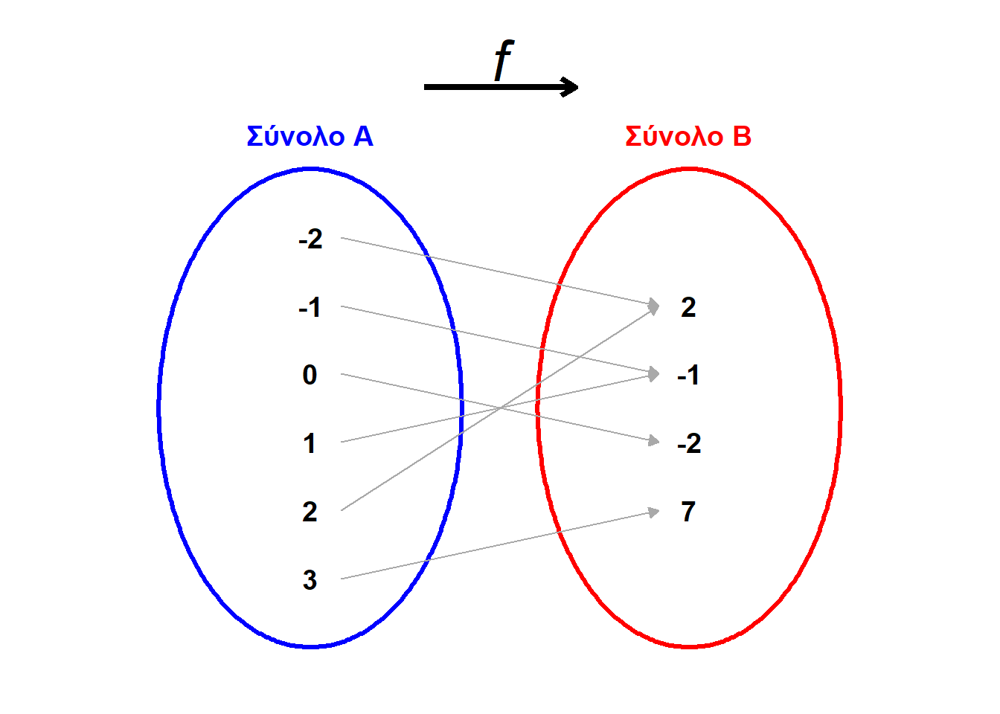
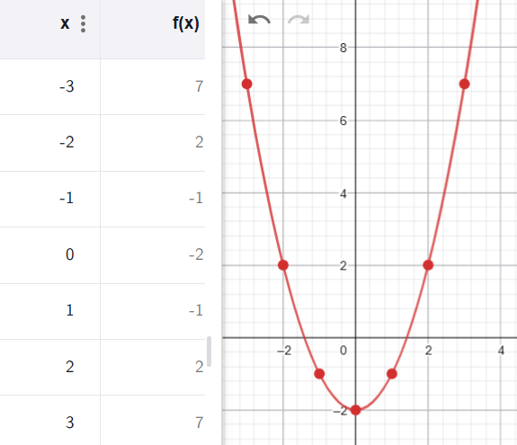
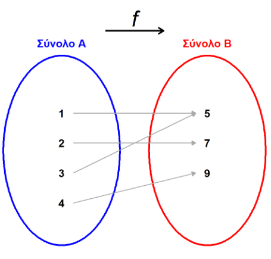
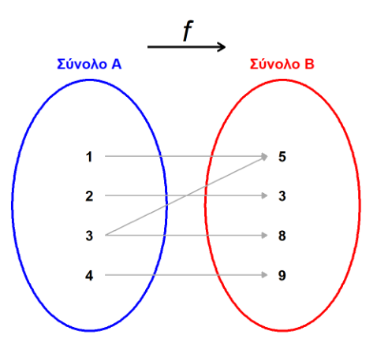
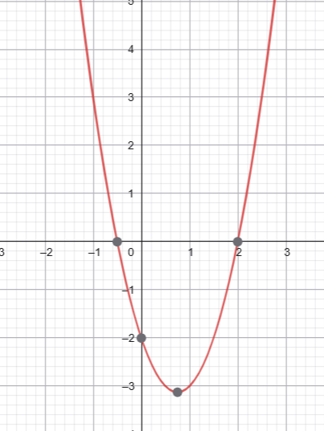
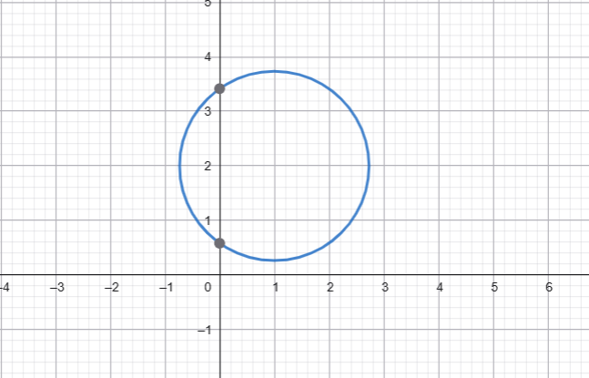
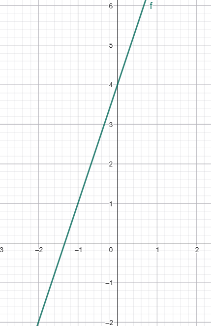
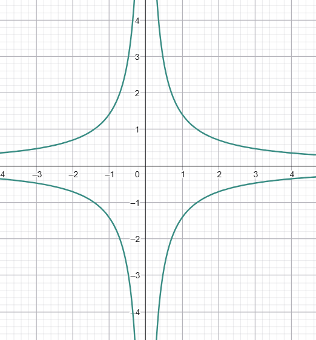

\usepackage{wasysym}

```{=html}
<!-- Φόρτωση βιβλιοθήκης GeoGebra -->
<script src="https://www.geogebra.org/apps/deployggb.js"></script>

<!-- Συνάρτηση δημιουργίας applets -->
<script>
function createGeoGebra(containerId, materialId, width = 700, height = 500) {
  var params = {
    "id": "ggb-" + containerId,
    "material_id": materialId,
    "width": width,
    "height": height,
    "showToolBar": true,
    "showMenuBar": false,
    "showAlgebraInput": true
  };
  
  var applet = new GGBApplet(params, '5.2');
  applet.inject(containerId);
}
</script>
```

::: {style="background-color: #f0f8cc; border: 2px solid #2f3e50; color: #25188a; padding: 15px; border-radius: 5px;"}
Η έννοια της συνάρτησης και η γραφική της παράσταση αποτελούν θεμελιώδη κεφάλαια των Μαθηματικών, καθώς χρησιμοποιούνται για την περιγραφή σχέσεων μεταξύ μεταβαλλόμενων μεγεθών σε όλες τις θετικές επιστήμες.

## Θεωρία: Η Έννοια της Συνάρτησης

**Ορισμός και Βασικές Έννοιες**

\* **Συνάρτηση** ονομάζεται μια αντιστοιχία από ένα σύνολο $Α$ σε ένα σύνολο $Β$, όπου κάθε στοιχείο του συνόλου $Α$ αντιστοιχίζεται με **ένα μόνο** στοιχείο του συνόλου $Β$.
$$ f : A \rightarrow B $$

-   **Μεταβλητή** είναι ένα γράμμα (π.χ. $x, y, t$) που χρησιμοποιούμε για να παραστήσουμε οποιοδήποτε στοιχείο ενός συνόλου. Στις συναρτήσεις, η μεταβλητή $y$ εκφράζεται ως συνάρτηση της μεταβλητής $x$ ($y = f(x)$).
-   **Πεδίο Ορισμού** είναι το σύνολο $Α$ των τιμών εισόδου.
-   **Πεδίο Τιμών** είναι το σύνολο των στοιχείων του $Β$ που αντιστοιχίζονται με τα στοιχεία του $Α$.
:::

**Τρόποι Αναπαράστασης** Μια συνάρτηση μπορεί να δοθεί με:

1\.
**Λεκτική περιγραφή** ή κανόνα.
Παράδειγμα: "κάθε στοιχείο του συνόλου Α αντιστοιχίζεται με το τετράγωνό του μειωμένο κατά 2"

2\.
**Βελοειδές διάγραμμα**.\

\
{width="541"}

3\.
**Πίνακα τιμών**, που δείχνει τα ζεύγη των μεταβλητών $x$ και $y=f(x)$.\

\


4\.
**Μαθηματικό τύπο** (π.χ. $y = x^2 -2$).

5\.
**Γραφική παράσταση**.
παραπάνω εικόνα στο 3.

------------------------------------------------------------------------

::: {style="background-color: #f0f8cc; border: 2px solid #2f3e50; color: #25188a; padding: 15px; border-radius: 5px;"}
## Θεωρία: Γραφική Παράσταση

**Καρτεσιανές Συντεταγμένες** Για να σχεδιάσουμε μια συνάρτηση, χρησιμοποιούμε ένα **σύστημα ορθογωνίων αξόνων**.

\* Ο οριζόντιος άξονας $x'x$ λέγεται **άξονας των τετμημένων**.

\* Ο κατακόρυφος άξονας $y'y$ λέγεται **άξονας των τεταγμένων**.

\* Κάθε σημείο $Μ$ στο επίπεδο προσδιορίζεται από ένα ζεύγος αριθμών $(x, y)$, τις **συντεταγμένες** του.

**Χαρακτηριστικά Γραφικών Παραστάσεων**

\* **Γραφική παράσταση** μιας συνάρτησης είναι το σύνολο όλων των σημείων του επιπέδου με συντεταγμένες $(x, y)$ που επαληθεύουν τον τύπο της.

\* **Γραμμική Συνάρτηση (**$y = \alpha x + \beta$): Η γραφική της παράσταση είναι μια **ευθεία γραμμή**.

\* Αν $\beta = 0$, η ευθεία $y = \alpha x$ διέρχεται από την **αρχή των αξόνων** $O(0,0)$.

\* Ο αριθμός $\alpha$ ονομάζεται **κλίση** της ευθείας και ισούται με τον λόγο της κατακόρυφης μεταβολής $\Delta y$ προς την οριζόντια μεταβολή $\Delta x$.

\* Η ευθεία $y = \alpha x + \beta$ τέμνει τον άξονα $y'y$ στο σημείο $(0, \beta)$.
:::

<iframe src="https://www.geogebra.org/calculator/dnnp9zy9?embed" width="730" height="600" allowfullscreen style="border: 1px solid #e4e4e4;border-radius: 4px;" frameborder="0">

</iframe>

::: {style="background-color: #f0f8cc; border: 2px solid #2f3e50; color: #25188a; padding: 15px; border-radius: 5px;"}
\* **Συνάρτηση Αντιστρόφως Ανάλογων Ποσών (**$y = \frac{\alpha}{x}$): Η γραφική της παράσταση ονομάζεται **υπερβολή** και αποτελείται από δύο κλάδους.
:::

<iframe src="https://www.geogebra.org/calculator/resmrqvy?embed" width="730" height="600" allowfullscreen style="border: 1px solid #e4e4e4;border-radius: 4px;" frameborder="0">

</iframe>

------------------------------------------------------------------------

## Ασκήσεις και Εφαρμογές

1.  Ένας φούρναρης έχει υπολογίσει ότι από 10 κιλά αλεύρι φτιάχνει13 κιλά φωμί.
    Πόσα κιλά ψωμί θα κάνει με 210 κιλά αλεύρι; Να εκφράσετε την ποσότητα του ψωμιού που φτιάχνεται ως συνάρτησης της ποσότητας του αλευριού που χρησημοποιείται.

2.  **(Αντιστοιχίες)**\*\*

Ποια από τα παρακάτω βελοειδή διαγράμματα παριστάνουν συνάρτηση;

α) {width="298"}

β) {width="300"}

------------------------------------------------------------------------

3.  **(Γραφική παράσταση - Κατακόρυφη γραμμή)**\*\*

Ποιες από τις παρακάτω γραφικές παραστάσεις **δεν** παριστάνουν συνάρτηση;

α) Μια παραβολή που ανοίγει προς τα πάνω {width="275"}

β) Ένας κύκλος {width="427"}

γ) Μια ευθεία γραμμή με κλίση {width="335"}

δ) Η διπλή υπερβολή {width="376"}

::: {style="background-color: #f0f8cc; border: 2px solid #2f3e50; color: #25188a; padding: 15px; border-radius: 5px;"}
**Για να ελέγξεις αν ένα γράφημα είναι συνάρτηση:** Φέρε νοερά μια κατακόρυφη γραμμή – αν τέμνει το γράφημα σε περισσότερα από ένα σημεία, **δεν είναι συνάρτηση**.
:::

------------------------------------------------------------------------

### Τύπος - Πίνακας Τιμών - Γράφημα

------------------------------------------------------------------------

4.  **(Συμπλήρωση πίνακα)**

Δίνεται η συνάρτηση ( f(x) = 2x + 1 ).

| x          | -2  | -1  | 0   | 1   | 2   | 3   |
|------------|-----|-----|-----|-----|-----|-----|
| (y = f(x)) |     |     |     |     |     |     |

α) Να συμπληρώσεις τον πίνακα.

β) Να σχεδιάσεις τη γραφική παράσταση σε ορθογώνιο σύστημα αξόνων.

γ) Τι είδους γραμμή είναι;

------------------------------------------------------------------------

5.  **(Αντίστροφη διαδικασία - Εύρεση τύπου)**

Μια ευθεία γραμμή διέρχεται από τα σημεία ( A(0, 2) ) και ( B(2, 8) ).

α) Να βρεις τον τύπο της συνάρτησης $y = \alpha x + \beta$.

β) Να βρεις την τιμή της συνάρτησης στο ( x = 5 ).

γ) Να βρεις το ( x ) όταν ( y = 20 ).

::: {style="background-color: #f0f8cc; border: 2px solid #2f3e50; color: #25188a; padding: 15px; border-radius: 5px;"}
**Για να βρεις τον τύπο ευθείας από δύο σημεία:** Υπολόγισε $\alpha = \dfrac{y_2 - y_1}{x_2 - x_1}$ και μετά βρες το $\beta$ από το $\beta = y - \alpha x$ .
:::

------------------------------------------------------------------------

6.  **(Σύγκριση συναρτήσεων)**

Δίνονται οι συναρτήσεις: $f(x) = 2x \quad \text{και} \quad g(x) = 2x + 3$

α) Να κάνεις πίνακες τιμών για ( x = -2, -1, 0, 1, 2 ).

β) Να τις σχεδιάσεις στο ίδιο σύστημα αξόνων.

γ) Ποια σχέση έχουν οι δύο ευθείες;

------------------------------------------------------------------------

### Προβλήματα Καθημερινής Ζωής

------------------------------------------------------------------------

7.  **(Ταξί)**

Σε μια εταιρεία ταξί, η χρέωση δίνεται από τον τύπο:

$K=0,80+0,60\cdot x$, οπου x είναι τα χιλιόμετρα που διανύει.

α) Να γράψεις τον τύπο ως συνάρτηση ( K(x) ), όπου ( x ) τα χιλιόμετρα.

β) Πόσο κοστίζει μια διαδρομή 5 χιλιομέτρων;

γ) Αν κάποιος πλήρωσε 4,40€, πόσα χιλιόμετρα έκανε;

------------------------------------------------------------------------

8.  **(Δεξαμενή νερού)**

Μια δεξαμενή έχει 500 λίτρα νερό.
Ανοίγουμε μια βρύση που αδειάζει 20 λίτρα το λεπτό.

α) Να εκφράσεις τα λίτρα νερού ( V(t) ) που μένουν στη δεξαμενή ως συνάρτηση του χρόνου ( t ) (σε λεπτά).

γ) Μετά από 15 λεπτά, πόσα λίτρα έχουν μείνει;

δ) Σε πόσα λεπτά αδειάζει τελείως η δεξαμενή;

------------------------------------------------------------------------

### Γραφικές Παραστάσεις - Ανάλυση

------------------------------------------------------------------------

9.  **(Διάβασμα γραφικής παράστασης)**

Στη γραφική παράσταση μιας συνάρτησης ( f ) βλέπουμε τα σημεία: ( A(-2, 1) ), ( B(0, 3) ), ( C(2, 5) ), ( D(4, 7) )

α) Να βρεις τον τύπο της συνάρτησης.
β) Να υπολογίσεις την τιμή ( f(6) ).
γ) Να βρεις το ( x ) για το οποίο ( f(x) = 11 ).

------------------------------------------------------------------------

10. **(Αντίστροφα ανάλογα)**

Δίνεται η συνάρτηση $f(x) = \dfrac{6}{x}$.

α) Να συμπληρώσεις τον πίνακα:

| \(x\)  | -3  | -2  | -1  | 1   | 2   | 3   | 6   |
|--------|-----|-----|-----|-----|-----|-----|-----|
| (f(x)) |     |     |     |     |     |     |     |

β) Να σχεδιάσεις τη γραφική παράσταση.

γ) Πώς λέγεται αυτή η γραμμή;

δ) Τι παρατηρείς για τα σημεία της όταν το ( x ) μεγαλώνει;

------------------------------------------------------------------------

::: callout-important
:::

::: {style="background-color: #f0f8cc; border: 2px solid #2f3e50; color: #25188a; padding: 15px; border-radius: 5px;"}
ΚΑΛΗ ΜΕΛΕΤΗ !
:::
