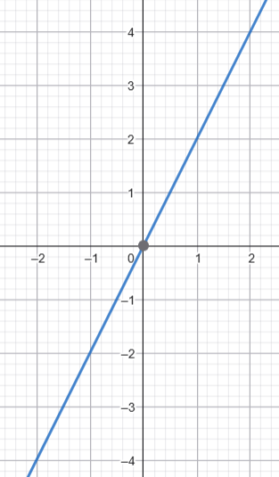
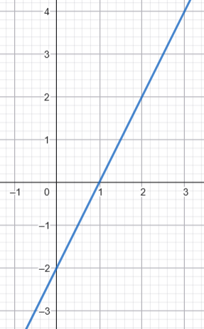
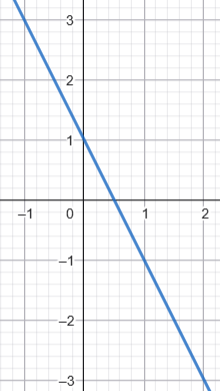
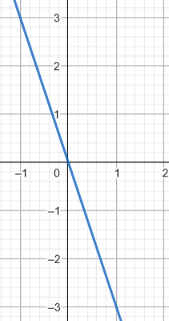

\usepackage{wasysym}
\usepackage{eurosym}
```{=html}
<!-- Φόρτωση βιβλιοθήκης GeoGebra -->
<script src="https://www.geogebra.org/apps/deployggb.js"></script>

<!-- Συνάρτηση δημιουργίας applets -->
<script>
function createGeoGebra(containerId, materialId, width = 700, height = 500) {
  var params = {
    "id": "ggb-" + containerId,
    "material_id": materialId,
    "width": width,
    "height": height,
    "showToolBar": true,
    "showMenuBar": false,
    "showAlgebraInput": true
  };
  
  var applet = new GGBApplet(params, '5.2');
  applet.inject(containerId);
}
</script>
```

## Η συνάρτηση της μορφής $y = \alpha x$ εκφράζει τη σχέση μεταξύ δύο **ανάλογων ποσών**.

::: {style="background-color: #f0f8cc; border: 2px solid #2f3e50; color: #25188a; padding: 15px; border-radius: 5px;"}
### Θεωρία

-   **Ορισμός:** Δύο ποσά $x$ και $y$ είναι ανάλογα όταν ο λόγος των αντίστοιχων τιμών τους είναι σταθερός: $\frac{y}{x} = \alpha$. Ο αριθμός $\alpha$ ονομάζεται συντελεστής αναλογίας ή **κλίση** της ευθείας.
-   **Γραφική Παράσταση:** Είναι πάντοτε μια **ευθεία γραμμή** που διέρχεται από την αρχή των αξόνων $O(0,0)$.
:::

\
<iframe src="https://www.geogebra.org/calculator/ycbdnurh?embed" width="730" height="600" allowfullscreen style="border: 1px solid #e4e4e4;border-radius: 4px;" frameborder="0"></iframe>

\

::: callout-tip
Μετακινήστε (κλικ και σύρτε) τον δρομέα α για να αλλάξετε την τιμή του α.

Τι παρατηρείτε;

-   Όταν το α είναι θετικό

-   Όταν το α είναι αρνητικό
:::

-   **Η σημασία του** $\alpha$:
    -   Αν $\alpha > 0$, η ευθεία βρίσκεται στο 1ο και 3ο τεταρτημόριο.
    -   Αν $\alpha < 0$, η ευθεία βρίσκεται στο 2ο και 4ο τεταρτημόριο.
    -   Η κλίση υπολογίζεται από το λόγο της κατακόρυφης μεταβολής προς την οριζόντια μεταβολή: $\alpha = \frac{\Delta y}{\Delta x}=εφ \hat{θ}$.
-   **Ειδικές Περιπτώσεις:** Η ευθεία $y = x$ είναι η διχοτόμος των γωνιών του 1ου και 3ου τεταρτημορίου, ενώ η $y = -x$ του 2ου και 4ου.

### ασκήσεις και προβλήματα για τη συνάρτηση $y = \alpha x$ και τα ανάλογα ποσά:

1.  **Συμπλήρωση Πίνακα:** Αν τα ποσά $x$ και $y$ είναι ανάλογα με συντελεστή $\alpha=3$ ($y=3x$), συμπλήρωσε τον παρακάτω πίνακα και στη συνέχεια κάνε την γραφική παράσταση.

```{mermaid}

block-beta
  
  block:group
  columns 8
    a["x"] b["-3"] c["-2"] d["-1"] e["0"] f["1"] g["2"] h["3"]
    k["y"] l["   "] m["  "] n["  "] p["  "] s["  "] t["  "] q["  "]
  end

```

2.  **Εύρεση Εξίσωσης:** Βρες την εξίσωση της ευθείας που διέρχεται από την αρχή των αξόνων $O(0,0)$ και από το σημείο $A(2, 6)$.
3.  **Πρόβλημα Ταχύτητας:** Ένα αυτοκίνητο κινείται με σταθερή ταχύτητα $70$ χλμ/ώρα. Εκφράστε την απόσταση $S$ ως συνάρτηση του χρόνου $t$. Κάντε την γραφική παράσταση της $S$ συναρτήσει του χρόνου $t$
4.  **Αύξηση Τιμών:** Οι τιμές των προϊόντων αυξήθηκαν κατά $20\%$. Βρες τη σχέση που εκφράζει τη νέα τιμή $y$ ως συνάρτηση της παλιάς τιμής $x$ και αφού συμπληρώσετε τον πίνακα, να κάνετε την γραφική παράστασταση.

```{mermaid}

block-beta
  
  block:group
  columns 8
    a["x €"] b["20 €"] c["60 €"] d["100"] e["110"] f["140"] g["200"] h["300"]
    k["y €"] l["   "] m["  "] n["  "] p["  "] s["  "] t["  "] q["  "]
  end

```

5.  **Γραφική Παράσταση:** Σχεδίασε σε ορθογώνιο σύστημα αξόνων την ευθεία $y = -0,82x$, βρίσκοντας ένα επιπλέον σημείο εκτός από την αρχή των αξόνων.
6.  **Παραγωγή Προϊόντος:** Μια εταιρεία παράγει $0,4$ λίτρα χυμό από κάθε κιλό πορτοκάλια.

-   Εκφράστε την ποσότητα χυμού $y$ ως συνάρτηση των κιλών πορτοκαλιών $x$.
-   Κάντε ένα πίνακα τιμών με 4 διαφορετικές τιμές του $x$.
-   Κάντε την γραφική παράσταση.

7.  **Γεωμετρία:** Εκφράστε την περίμετρο $Π$ ενός τετραγώνου ως συνάρτηση της πλευράς του $x$ και εξήγησε γιατί τα ποσά αυτά είναι ανάλογα.
8.  **Ισοτιμία Νομισμάτων:** Αν η ισοτιμία είναι $100$ € προς $108$ \$, βρες τη συνάρτηση $y = \alpha x$ που μετατρέπει τα ευρώ ($x$) σε δολάρια ($y$).

-   Πόσα € είναι τα 238 \$.
-   Πόσα \$ είναι τα 340 €.

9.  **Υπολογισμός Κλίσης:** Βρες την κλίση $\alpha$ μιας ευθείας που διέρχεται από την αρχή των αξόνων και το σημείο $A(-1, 3)$.
10. **Θεωρία Τεταρτημορίων:** Εξήγησε σε ποια τεταρτημόρια βρίσκεται η ευθεία $y = \alpha x$ όταν ο συντελεστής $\alpha$ είναι θετικός και σε ποια όταν είναι αρνητικός.
11. Αν τα ποσά κ και λ είναι ανάλογα , να συμπληρώσετε τον πίνακα.

```{mermaid}

block-beta
  
  block:group
  columns 8
    a["κ"] b["5 "] c["12"] d[" "] e["16"] f[" "] g["28"] h[" "]
    k["λ"] l[" 4"] m["  "] n[" 12 "] p["  "] s["16"] t["  "] q["18"]
  end

```

12. Ποιά από τα παρακάτω γραφήματα είναι γραφήματα ανάλογων ποσών

| Γράφημα 1 | Γράφημα 2 | Γράφημα 3 | Γράφημα 4 |
|:--:|:--:|:--:|:--:|
|  |  |  |  |


13. Να σχεδιάσετε σε ορθογώνιο σύστημα αξόνων μια ευθεία η οποία να διέρχεται
από την αρχή Ο των αξόνων και να έχει κλίση $a=1,2$

14. Ποιά ευθεία από τις πατακάτω έχει κλίση α=0,8

| Ευθεία 1 | Ευθεία 2 | Ευθεία 3 | Ευθεία 4 |
|:--:|:--:|:--:|:--:|
| $y=\frac{4}{5}x$ | $y=-0,8x$ | $y=\frac{8}{5}x$ |$y=-\frac{8}{10}x$ |


::: callout-important
:::

::: {style="background-color: #f0f8cc; border: 2px solid #2f3e50; color: #25188a; padding: 15px; border-radius: 5px;"}
ΚΑΛΗ ΜΕΛΕΤΗ !
:::
