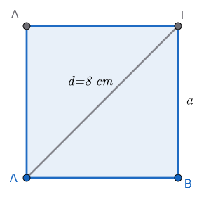
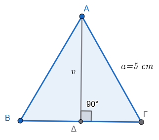
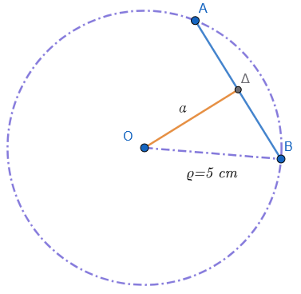
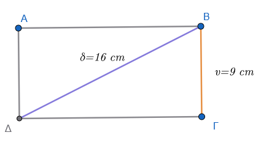
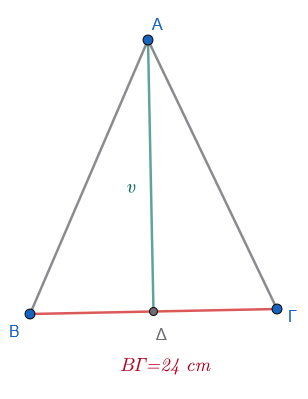
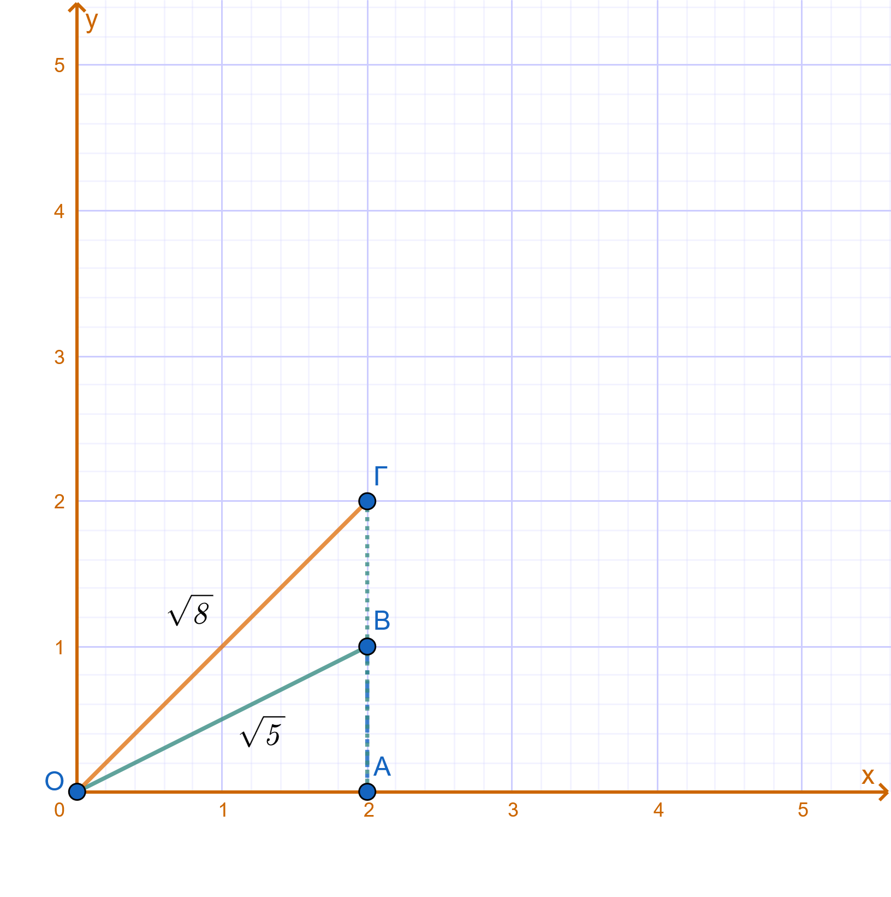
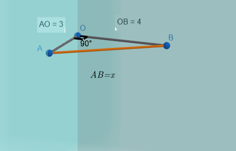

\usepackage{wasysym}

```{=html}
<!-- Φόρτωση βιβλιοθήκης GeoGebra -->
<script src="https://www.geogebra.org/apps/deployggb.js"</script>

<!-- Συνάρτηση δημιουργίας applets -->
<script>
function createGeoGebra(containerId, materialId, width = 700, height = 500) {
  var params = {
    "id": "ggb-" + containerId,
    "material_id": materialId,
    "width": width,
    "height": height,
    "showToolBar": true,
    "showMenuBar": false,
    "showAlgebraInput": true
  };
  
  var applet = new GGBApplet(params, '5.2');
  applet.inject(containerId);
}
</script>
```

## Προβλήματα

### **Α. Λυμένα Προβλήματα**

:::: {style="background-color: #e0d6b8; border: 2px solid #2f3e50; color: #25188a; padding: 15px; border-radius: 5px;"}
1.  **Πρόβλημα Γεωμετρίας (Πλευρά Τετραγώνου):** Να βρείτε την πλευρά ενός τετραγώνου, του οποίου η διαγώνιος είναι 8 cm.\
    

**Λύση:**

Έστω $a$ η πλευρά του τετραγώνου.
Σύμφωνα με το Πυθαγόρειο θεώρημα στο ορθογώνιο τρίγωνο που σχηματίζεται από δύο πλευρές και τη διαγώνιο $d$, ισχύει: $a^2 + a^2 = d^2$.
Άρα $2a^2 = 8^2 \Rightarrow 2a^2 = 64 \Rightarrow a^2 = 32$.
Η πλευρά θα είναι η τετραγωνική ρίζα $a = \sqrt{32}$.
Από τους πίνακες ή με υπολογισμό, βρίσκουμε $a \approx 5,65$ cm.

2.  **Πρόβλημα Ζωής (Εμβαδόν Οικοπέδου):** Ένα οικόπεδο σχήματος τετραγώνου έχει εμβαδόν $E = 2809\ \text{m}^2$. Πόση είναι η πλευρά του και πόση η περίμετρός του;.

**Λύση:**

Το εμβαδόν τετραγώνου δίνεται από τον τύπο $E = a^2$, επομένως η πλευρά είναι $a = \sqrt{2809}$.
Εκτελώντας τον αλγόριθμο της ρίζας ή αναζητώντας στον πίνακα, βρίσκουμε $a = 53$ m.
Η περίμετρος είναι $P = 4a = 4 \cdot 53 = 212$ m.

3.  **(Ύψος Ισοπλεύρου Τριγώνου):** Να υπολογιστεί το ύψος ενός ισοπλεύρου τριγώνου αν γνωρίζουμε ότι η πλευρά του είναι $a = 5$ cm.\
    

**Λύση:**

Το ύψος $v$ ενός ισοπλεύρου τριγώνου δίνεται από τον τύπο $v = \dfrac{a\sqrt{3}}{2}$.
Αντικαθιστώντας το $a = 5$, έχουμε $v = \dfrac{5\sqrt{3}}{2}$.
Επειδή η $\sqrt{3} \approx 1,732$, το ύψος είναι $v \approx \dfrac{5 \cdot 1,732}{2} = 4,33$ cm.

4.  **Πρόβλημα Γεωμετρίας (Ορθογώνιο Τρίγωνο):** Σε ορθογώνιο τρίγωνο οι κάθετες πλευρές είναι $20$ m και $15$ m. Να βρεθεί η υποτείνουσα.

**Λύση:**

Σύμφωνα με το Πυθαγόρειο θεώρημα $\alpha^2 = \beta^2 + \gamma^2$.
Άρα $\alpha^2 = 20^2 + 15^2 = 400 + 225 = 625$.
Η υποτείνουσα είναι $\alpha = \sqrt{625} = 25$ m.

5.  **Πρόβλημα Κύκλου (Ακτίνα από Εμβαδόν):** Ένας κυκλικός δίσκος έχει εμβαδόν $E = 314\ \text{cm}^2$. Να βρεθεί η ακτίνα του (χρησιμοποιήστε $\pi \approx 3,14$).

**Λύση:**

Ο τύπος του εμβαδού είναι $E = \pi R^2$.
Άρα $314 = 3,14 \cdot R^2 \Rightarrow R^2 = \dfrac{314}{3,14} = 100$.
Η ακτίνα είναι $R = \sqrt{100} = 10$ cm.

------------------------------------------------------------------------

### **Β. Προβλήματα για λύση (Ασκήσεις)**

1.  Να βρείτε τη διαγώνιο ενός τετραγώνου που έχει πλευρά $6$ cm.
2.  Η υποτείνουσα ενός ορθογωνίου τριγώνου είναι $12$ cm και η μία κάθετη πλευρά του είναι $9$ cm. Να βρείτε την άλλη κάθετη πλευρά και το εμβαδό του.
3.  Μια χορδή $ΑΒ$ απέχει από το κέντρο κύκλου $3$ cm. Αν η ακτίνα του κύκλου είναι $5$ cm, να βρείτε το μήκος της χορδής $ΑΒ$.\
    {width="300"}
4.  Να υπολογιστεί το εμβαδόν ενός ορθογωνίου παραλληλογράμμου που έχει διαγώνιο $16$ cm και ύψος $9$ cm.\
    {width="350"}
5.  Η περίμετρος ενός ισοσκελούς τριγώνου είναι $54$ cm και η βάση του $24$ cm. Να υπολογίσετε το ύψος και το εμβαδό του.\
    {width="250"}
6.  Αν αυξήσουμε την πλευρά ενός τετραγώνου κατά $5$ m, το εμβαδόν του αυξάνει κατά $605\ \text{m}^2$. Να βρείτε την αρχική πλευρά του τετραγώνου.
7.  Αν ελαττώσουμε την πλευρά ενός τετραγώνου κατά $4$ m, το εμβαδόν του ελαττώνεται κατά $368\ \text{m}^2$. Πόση είναι η πλευρά του τετραγώνου;.
8.  Στην εξίσωση $y = \sqrt{(x+2)^2 - 8}$, να βρείτε την τιμή του $y$ όταν $x = 5$.
9.  Να κατασκευαστεί ορθογώνιο τρίγωνο που να έχει κάθετες πλευρές τις $\sqrt{5}$ cm και $\sqrt{8}$ cm.\
    {width="500"}
10. Ένας εργάτης θέλει να χτίσει δύο κάθετους μεταξύ τους τοίχους. Για να βεβαιωθεί ότι ο ένας τοίχος είναι κάθετος στον άλλο, μέτρησε τμήμα $3$ m στον έναν τοίχο από την ευθεία τομής τους και $4$ m στον άλλον. Πόση πρέπει να είναι η απόσταση μεταξύ των δύο σημείων ώστε η γωνία να είναι ορθή;.\
    
11. Να υπολογιστεί η πλευρά ισοπλεύρου τριγώνου που έχει ύψος $7$ cm (δώστε το αποτέλεσμα με τη χρήση ριζικού).
12. Ποιος είναι ο μικρότερος ακέραιος αριθμός που πρέπει να αφαιρέσουμε από τον $32874$ για να γίνει τέλειο τετράγωνο;.

>> Σκεφτείτε ότι $181^2=32761$ και $182^2=33124$

13. Να βρείτε την ακτίνα ενός κύκλου αν το εμβαδόν του είναι ίσο με το εμβαδόν τετραγώνου πλευράς $a$.
14. Δύο κάθετοι δρόμοι ξεκινούν από το ίδιο σημείο. Ένας πεζός διανύει $1,2$ km στον πρώτο και ένας άλλος $1,6$ km στον δεύτερο. Πόση είναι η ευθεία απόσταση μεταξύ τους;.
15. Να υπολογιστεί η πλευρά ενός τετραγώνου που είναι ισοδύναμο (έχει ίσο εμβαδόν) με ένα τρίγωνο βάσης $17,375$ m και ύψους $1,39$ m.

::: {style="background-color: #f0f8cc; border: 2px solid #2f3e50; color: #25188a; padding: 15px; border-radius: 5px;"}
ΚΑΛΗ ΜΕΛΕΤΗ !
:::
::::
