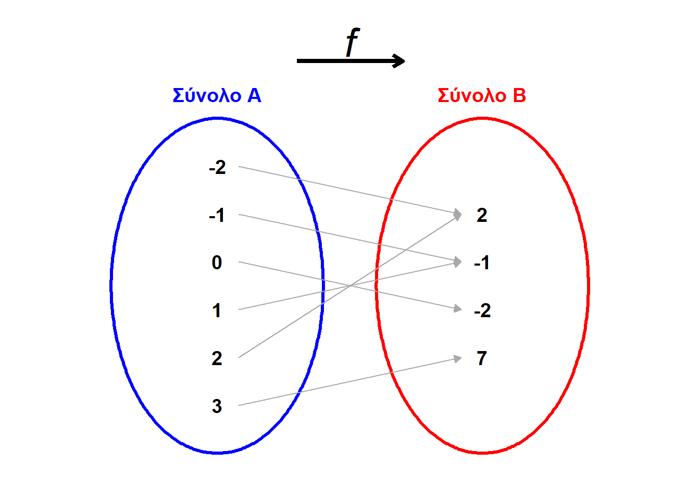
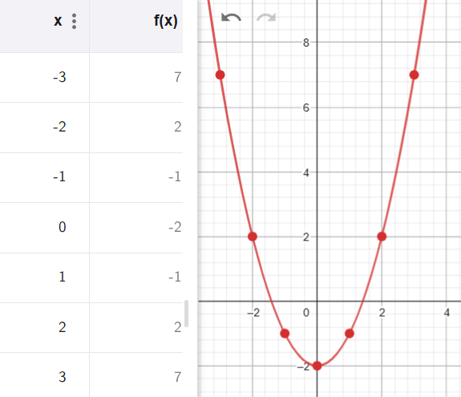
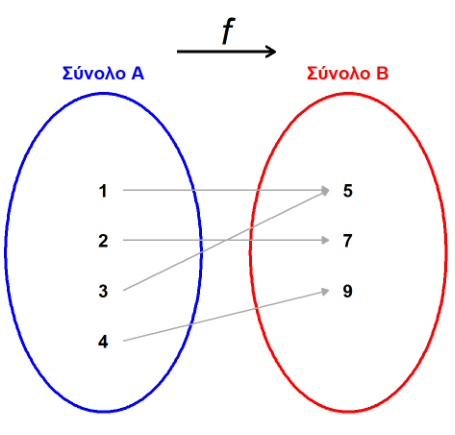
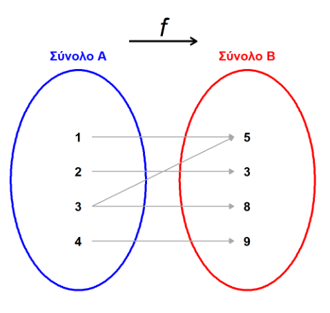

\usepackage{wasysym}

```{=html}
<!-- Φόρτωση βιβλιοθήκης GeoGebra -->
<script src="https://www.geogebra.org/apps/deployggb.js"></script>

<!-- Συνάρτηση δημιουργίας applets -->
<script>
function createGeoGebra(containerId, materialId, width = 700, height = 500) {
  var params = {
    "id": "ggb-" + containerId,
    "material_id": materialId,
    "width": width,
    "height": height,
    "showToolBar": true,
    "showMenuBar": false,
    "showAlgebraInput": true
  };
  
  var applet = new GGBApplet(params, '5.2');
  applet.inject(containerId);
}
</script>
```

## Η έννοια της συνάρτησης

### **Η έννοια της συνάρτησης**

::: {style="background-color: #e0d6b8; border: 2px solid #2f3e50; color: #25188a; padding: 15px; border-radius: 5px;"}
**Θεωρία και Ορισμοί**

- **Ορισμός:** Μια απεικόνιση $f: A \to B$ ονομάζεται **συνάρτηση**, όταν κάθε στοιχείο $x$ του συνόλου $A$ (αρχέτυπο) αντιστοιχίζεται σε **ένα και μόνο ένα** στοιχείο $y$ του συνόλου $B$ (εικόνα).

- **Πεδίο Ορισμού:** Το σύνολο $A$ ονομάζεται σύνολο αφετηρίας ή πεδίο ορισμού της συνάρτησης.

- **Πεδίο Τιμών:** Το σύνολο των εικόνων όλων των στοιχείων του $A$ ονομάζεται πεδίο τιμών και συμβολίζεται με $f(A)$.

- **Μεταβλητές:** Το γράμμα $x$, που παριστάνει ένα οποιοδήποτε στοιχείο του πεδίου ορισμού, λέγεται **ανεξάρτητη μεταβλητή**, ενώ το $y$ (ή $f(x)$) λέγεται **εξαρτημένη μεταβλητή** ή συνάρτηση του $x$.

- **Τύπος:** Η μαθηματική έκφραση (π.χ. $f(x) = 3x + 1$) που δείχνει πώς υπολογίζεται η εικόνα κάθε αρχετύπου ονομάζεται τύπος της συνάρτησης.

**Ιδιότητες**

1.  **Πλήρης Ορισμός:** Μια συνάρτηση είναι πλήρως ορισμένη όταν γνωρίζουμε το πεδίο ορισμού της, το σύνολο τιμών της και τον τύπο της.
2.  **Μονοσήμαντη Αντιστοιχία:** Σε κάθε $x$ αντιστοιχεί αυστηρά μία τιμή $y$. Αν ένα $x$ έχει δύο εικόνες, τότε η σχέση δεν είναι συνάρτηση.
:::

**Τρόποι Αναπαράστασης** Μια συνάρτηση μπορεί να δοθεί με:

1.  **Λεκτική περιγραφή** ή κανόνα.
    Παράδειγμα: "κάθε στοιχείο του συνόλου Α αντιστοιχίζεται με το τετράγωνό του μειωμένο κατά 2"

2.  **Βελοειδές διάγραμμα**.

\
{width="541"}

3.  **Πίνακα τιμών**, που δείχνει τα ζεύγη των μεταβλητών $x$ και $y=f(x)$.

\


4.  **Μαθηματικό τύπο** (π.χ. $y = x^2 -2$).

5.  **Γραφική παράσταση**.
    παραπάνω εικόνα στο 3.

\

**Παραδείγματα**

1.  $f(x) = 3x$: Η τιμή $y$ είναι τριπλάσια της μεταβλητής $x$.
2.  $f(x) = x^2$: Η συνάρτηση που αντιστοιχίζει κάθε αριθμό στο τετράγωνό του.
3.  $y = 5x$: Η αξία υφάσματος σε σχέση με το μήκος $x$ .
4.  $y = ax + \beta$: Η γενική μορφή της γραμμικής συνάρτησης.
5.  $s = v \cdot t$: Το διανυόμενο διάστημα ως συνάρτηση του χρόνου στην ομαλή κίνηση.

**Ασκήσεις**

1.  Προσδιορίστε το πεδίο ορισμού και το σύνολο τιμών στη συνάρτηση $f: N \to Q$ με $f(x) = 3x - 4$.

2.  Εξετάστε αν η σχέση «...........είναι μητέρα του..........» σε ένα σύνολο ανθρώπων είναι συνάρτηση.

3.  Αν $f(x) = 3x^2 - 1$, υπολογίστε την τιμή $f(2)$.

4.  Βρείτε την εικόνα του 8 για τη συνάρτηση $y = 2x + 1$.

5.  Στη συνάρτηση $y = 5 - x$, ποια είναι η ανεξάρτητη μεταβλητή;.

6.  Βρείτε το $x$ για το οποίο $f(x) = 18$ στη συνάρτηση $y = 2x$.

7.  Υπολογίστε το $f(1,3)$ για τη συνάρτηση $f(x) = 2x + 3$.

8.  Αν $f(x) = x + 5$ και $f(a) = 87$, βρείτε την τιμή του $a$.

9.  Ελέγξτε αν ένα βελοειδές διάγραμμα (Venn) παριστάνει συνάρτηση βάσει του αριθμού των βελών που ξεκινούν από κάθε στοιχείο.

10. Ένας φούρναρης έχει υπολογίσει ότι από 10 κιλά αλεύρι φτιάχνει 13 κιλά φωμί.
    Πόσα κιλά ψωμί θα κάνει με 210 κιλά αλεύρι; Να εκφράσετε την ποσότητα του ψωμιού που φτιάχνεται ως συνάρτησης της ποσότητας του αλευριού που χρησημοποιείται.

11. **(Αντιστοιχίες)**

Ποια από τα παρακάτω βελοειδή διαγράμματα παριστάνουν συνάρτηση;

α) {width="298"}

β) {width="300"}

12. Να βρείτε την συνάρτηση που εκφράζει τον νέο μισθό ενός υπαλλήλου όταν αυτός
    α.  Πάρει αύξηση 32 €
    β.  Πάρει αύξηση 14%.
    
13. Αν ένα κατάστημα παιχνιδιών κάνει έκπτωση 15% στα προιόντα του.

Να εκφράσετε τις τιμές y με έκπτωση, ως συνάρτηση των τιμών x χωρίς έκπτωση.

14. Ένας υπάλληλος παίρνει μισθό 830 € το μήνα και ποσοστό 5% επί του ποσού των πωλήσεων που πραγματοποιεί. Να βρείτε την συνάρτηση που εκφράζει το συνολικό ποσό y, που παίρνει το μήνα, ως συνάρτηση του ποσού x των πωλήσεων.

------------------------------------------------------------------------

### **Πίνακας Τιμών συνάρτησης**

::: {style="background-color: #e0d6b8; border: 2px solid #2f3e50; color: #25188a; padding: 15px; border-radius: 5px;"}
**Θεωρία και Ορισμοί**

- **Ορισμός:** **Πίνακας Τιμών** είναι η παραστατική απεικόνιση της αντιστοιχίας μεταξύ των αρχετύπων και των εικόνων μιας συνάρτησης.

- **Δομή:** Συνήθως αποτελείται από δύο σειρές (ή στήλες).
  Στην πρώτη σειρά αναγράφονται επιλεγμένες τιμές της ανεξάρτητης μεταβλητής $x$ και στη δεύτερη οι αντίστοιχες τιμές της συνάρτησης $f(x)$ ή $y$.

- **Σκοπός:** Χρησιμοποιείται για την καλύτερη κατανόηση της μεταβολής της συνάρτησης και ως απαραίτητο στάδιο για τη δημιουργία της γραφικής της παράστασης.

**Ιδιότητες**

1.  **Διατεταγμένα Ζεύγη:** Κάθε στήλη του πίνακα αντιστοιχεί σε ένα διατεταγμένο ζεύγος $(x, y)$, το οποίο αποτελεί σημείο (κόμβο) στο επίπεδο των αξόνων.
2.  **Υπολογιστική Βάση:** Ο πίνακας προκύπτει με τη διαδοχική αντικατάσταση τιμών του $x$ στον τύπο της συνάρτησης και την εκτέλεση των πράξεων.
3.  **Γραφική Σύνδεση:** Αν ενώσουμε τα σημεία που προκύπτουν από τον πίνακα τιμών, σχηματίζεται η γραφική παράσταση (ευθεία ή καμπύλη).
:::

**Παραδείγματα**

1.  **Για την** $y = 3x$: Ο πίνακας τιμών για $x = 1, 2, 3, 4$ είναι:


\begin{array}{| c | c | c | c | c |} 
\hline
x & 1 & 2 & 3 & 4 \\
\hline
y & 3 & 6 & 9 & 12 \\
\hline
\end{array}


2.  **Για την** $y = 20x + 30$: Για $x = 0, 1, 2, 3$, οι τιμές $y$ είναι $30, 50, 70, 90$.


\begin{array}{| c | c | c | c | c |} 
\hline
x & 0 & 1 & 2 & 3 \\
\hline
y & 30 & 50 & 70 & 90 \\
\hline
\end{array}


3.  **Για την** $y = 2x + 1$: Για $x = 0, 1, 2, 3$, οι τιμές $y$ είναι $1, 3, 5, 7$.


\begin{array}{| c | c | c | c | c |} 
\hline
x & 0 & 1 & 2 & 3 \\
\hline
y & 1 & 3 & 5 & 7 \\
\hline
\end{array}


4.  **Για την** $y = 50x$: Ο Πίνακας τιμών είναι:


\begin{array}{| c | c | c | c | c |} 
\hline
x & 1 & 1,2 & 3,5 & 4,8 \\
\hline
y & 50 & 60 & 175 & 240 \\
\hline
\end{array}


5.  **Για την** $y = 12/x$: Ο Πίνακας για  $x = 1, 2, 3, 4$ έχουμε $y = 12, 6, 4, 3$.


\begin{array}{| c | c | c | c | c |} 
\hline
x & 1 & 2 & 3 & 4 \\
\hline
y & 12 & 6 & 4 & 3 \\
\hline
\end{array}


---

**Ασκήσεις**

1.  Συντάξτε πίνακα τιμών για τη συνάρτηση $f(x) = 3x + 4$ με $x \in \{-2, -1, 0, 1\}$.
2.  Δημιουργήστε πίνακα τιμών για την $y = 3x - 2$ για τις πρώτες πέντε φυσικές τιμές του $x$.
3.  Κατασκευάστε πίνακα τιμών για την $f(x) = x^2 - x + 1$ με $x \in \{-1, 0, 1, 2\}$.
4.  Συμπληρώστε τα κενά σε πίνακα τιμών για την $y = 4x$ .


\begin{array}{| c | c | c | c | c |} 
\hline
x & -2 & -1 & 1 & 2 \\
\hline
y &  &  &  &  \\
\hline
\end{array}


5.  Σχηματίστε πίνακα τιμών για τη σχέση $xy = 240$ .
6.  Φτιάξτε πίνακα τιμών για την $y = x^2$ για $x$ από 0 έως 5.
7.  Δημιουργήστε πίνακα για την $y = 5/x$ με $x \in \{-2, -1, 1, 2, 5, 10\}$.
8.  Υπολογίστε τις τιμές και φτιάξτε πίνακα για την $y = 2x^2 + 1$ για $x = -2, -1, 0, 1, 2$.
9.  Συντάξτε πίνακα για την $y = 3x - 4$ με $x \in \{-3, -2, -1, 0, 1, 2, 3\}$.
10. Από τον πίνακα τιμών της $y = 2x + 1$, βρείτε ποια τιμή $y$ αντιστοιχεί στο $x = 3$.
11. **(Συμπλήρωση πίνακα)**

Δίνεται η συνάρτηση ( f(x) = 2x + 1 ).

| x          | -2  | -1  | 0   | 1   | 2   | 3   |
|------------|-----|-----|-----|-----|-----|-----|
| (y = f(x)) |     |     |     |     |     |     |

Να συμπληρώσεις τον πίνακα.

12. **(Αντίστροφη διαδικασία - Εύρεση τύπου)**

Μια ευθεία γραμμή διέρχεται από τα σημεία ( A(0, 2) ) και ( B(2, 8) ).

α) Να βρεις τον τύπο της συνάρτησης $y = \alpha x + \beta$.

β) Να βρεις την τιμή της συνάρτησης στο ( x = 5 ).

γ) Να βρεις το ( x ) όταν ( y = 20 ).

13. **(Ταξί)**

Σε μια εταιρεία ταξί, η χρέωση δίνεται από τον τύπο:

$K=0,80+0,60\cdot x$, οπου x είναι τα χιλιόμετρα που διανύει.

α) Να γράψεις τον τύπο ως συνάρτηση ( K(x) ), όπου ( x ) τα χιλιόμετρα.

β) Πόσο κοστίζει μια διαδρομή 5 χιλιομέτρων;

γ) Αν κάποιος πλήρωσε 4,40€, πόσα χιλιόμετρα έκανε;

14. **(Δεξαμενή νερού)**

Μια δεξαμενή έχει 500 λίτρα νερό.
Ανοίγουμε μια βρύση που αδειάζει 20 λίτρα το λεπτό.

α) Να εκφράσεις τα λίτρα νερού ( V(t) ) που μένουν στη δεξαμενή ως συνάρτηση του χρόνου ( t ) (σε λεπτά).

γ) Μετά από 15 λεπτά, πόσα λίτρα έχουν μείνει;

δ) Σε πόσα λεπτά αδειάζει τελείως η δεξαμενή;


------------------------------------------------------------------------


::: {style="background-color: #f0f8cc; border: 2px solid #2f3e50; color: #25188a; padding: 15px; border-radius: 5px;"}
ΚΑΛΗ ΜΕΛΕΤΗ !
:::
