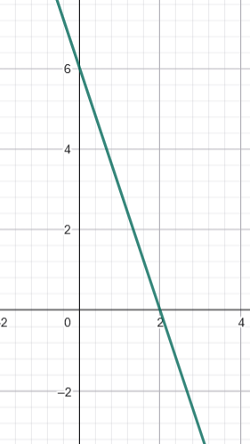
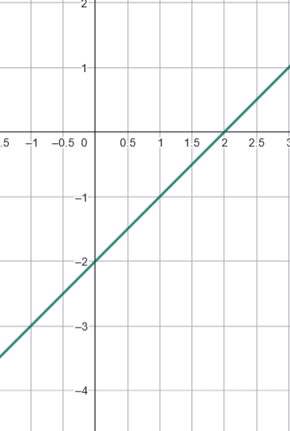
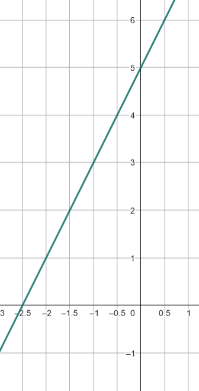

\usepackage{wasysym}
\usepackage{eurosym}
```{=html}
<!-- Φόρτωση βιβλιοθήκης GeoGebra -->
<script src="https://www.geogebra.org/apps/deployggb.js"></script>

<!-- Συνάρτηση δημιουργίας applets -->
<script>
function createGeoGebra(containerId, materialId, width = 700, height = 500) {
  var params = {
    "id": "ggb-" + containerId,
    "material_id": materialId,
    "width": width,
    "height": height,
    "showToolBar": true,
    "showMenuBar": false,
    "showAlgebraInput": true
  };
  
  var applet = new GGBApplet(params, '5.2');
  applet.inject(containerId);
}
</script>
```

## Η συνάρτηση της μορφής $y = \alpha x+β$.

::: {style="background-color: #f0f8cc; border: 2px solid #2f3e50; color: #25188a; padding: 15px; border-radius: 5px;"}
Αφού είδαμε τη συνάρτηση $y = \alpha x$, η οποία εκφράζει τα ανάλογα ποσά, ήρθε η ώρα να προχωρήσουμε στη γενικότερη μορφή της, τη **γραμμική συνάρτηση** $y = \alpha x + \beta$.
:::

::: {style="background-color: #f0f8cc; border: 2px solid #2f3e50; color: #25188a; padding: 15px; border-radius: 5px;"}
### **Θεωρία: Η Ευθεία** $y = \alpha x + \beta$

1.  **Ορισμός & Μορφή:** Μια συνάρτηση της μορφής $y = \alpha x + \beta$ ονομάζεται γραμμική συνάρτηση και η γραφική της παράσταση είναι πάντα μια **ευθεία γραμμή**. Ο τύπος αυτός ονομάζεται και εξίσωση της ευθείας.
2.  **Η σημασία των παραμέτρων** $\alpha$ και $\beta$:
    -   **Η κλίση (**$\alpha$): Ο αριθμός $\alpha$ ονομάζεται κλίση της ευθείας. Εκφράζει τον λόγο της κατακόρυφης μεταβολής ($\Delta y$) προς την οριζόντια μεταβολή ($\Delta x$). Αν $\alpha > 0$, η συνάρτηση αυξάνεται, ενώ αν $\alpha < 0$, η συνάρτηση μειώνεται.
    -   **Η τεταγμένη επί την αρχή (**$\beta$): Η ευθεία τέμνει τον άξονα των τεταγμένων ($y'y$) στο σημείο $(0, \beta)$.
    -   **Τομή με τον άξονα x'x** : Άν y=0 ==\> αx+β=0 και άρα $x=-\frac{β}{α}$. Αυτό σημαίνει ότι η ευθεία y=αx+β τέμνει τον άξονα x'x στο σημείο ($-\frac{β}{α},0$)
3.  **Σχέση με την** $y = \alpha x$: Η γραφική παράσταση της $y = \alpha x + \beta$ είναι μια ευθεία **παράλληλη** προς την ευθεία $y = \alpha x$, μετατοπισμένη κατά $\beta$ μονάδες στον άξονα $y'y$.
4.  **Παράλληλες Ευθείες:** Δύο ευθείες είναι παράλληλες μεταξύ τους όταν έχουν την **ίδια κλίση** $\alpha$.
5.  **Ειδικές Περιπτώσεις:**
    -   Όταν $\alpha = 0$, η συνάρτηση γίνεται $y = \beta$ και είναι μια **σταθερή συνάρτηση** (οριζόντια ευθεία παράλληλη στον άξονα $x'x$).
    -   Η εξίσωση $x = \kappa$ παριστάνει μια κατακόρυφη ευθεία παράλληλη στον άξονα $y'y$, αλλά αυτή **δεν ορίζει συνάρτηση**.
:::

\

<iframe src="https://www.geogebra.org/calculator/dnnp9zy9?embed" width="730" height="600" allowfullscreen style="border: 1px solid #e4e4e4;border-radius: 4px;" frameborder="0">

</iframe>

\

::: callout-tip
Αλλάξτε την τιμή των δρομέων α και β (κλίκ και σύρτε)

-   Τι συμβαίνει όταν μεταβάλεται το α;
-   Τι συμβαίνει όταν μεταβάλλεται το β;

Εξετάστε αν ισχύουν όσα είπαμε παραπάνω για τα α και β.
:::

::: {style="background-color: #f0f8cc; border: 2px solid #2f3e50; color: #25188a; padding: 15px; border-radius: 5px;"}


### Γενική εξίσωση ευθείας

Η εξίσωση της μορφής $\alpha x + \beta y = \gamma$ (με $\alpha \neq 0$ ή $\beta \neq 0$) αποτελεί τη γενική μορφή εξίσωσης μιας ευθείας στο επίπεδο.

#### **Σχέση με τη μορφή** $y = \alpha x + \beta$

Για να συνδέσουμε τις δύο μορφές, αρκεί να λύσουμε τη γενική εξίσωση ως προς $y$ (εφόσον $\beta \neq 0$):

1\.
**Απομόνωση του όρου** $y$: Μεταφέρουμε το $\alpha x$ στο δεύτερο μέλος αλλάζοντας το πρόσημό του: $\beta y = -\alpha x + \gamma$.

2\.
**Διαίρεση με το** $\beta$: Διαιρούμε όλα τα μέλη με τον συντελεστή του $y$: $y = -\frac{\alpha}{\beta}x + \frac{\gamma}{\beta}$.

Με αυτή τη μετατροπή, η **κλίση** της ευθείας είναι το πηλίκο $-\frac{\alpha}{\beta}$ .

:::


#### **Ειδικές Περιπτώσεις**

-   **Οριζόντια Ευθεία (**$\alpha = 0$): Η εξίσωση παίρνει τη μορφή $y = \kappa$ (όπου $\kappa = \frac{\gamma}{\beta}$). Είναι μια ευθεία παράλληλη στον άξονα $x'x$.
-   **Κατακόρυφη Ευθεία (**$\beta = 0$): Η εξίσωση παίρνει τη μορφή $x = \kappa$ (όπου $\kappa = \frac{\gamma}{\alpha}$). Αυτή η ευθεία είναι παράλληλη στον άξονα $y'y$, αλλά **δεν ορίζει συνάρτηση**.

### **Προτεινόμενες Ασκήσεις**

**Άσκηση 1: Εύρεση Σημείων Τομής** Δίνεται η ευθεία $y = 2x - 4$.
Να βρείτε τα σημεία στα οποία η ευθεία τέμνει τους άξονες $x'x$ και $y'y$ και στη συνέχεια να τη σχεδιάσετε.

**Άσκηση 2: Υπολογισμός Κλίσης** Να βρείτε την κλίση της ευθείας που διέρχεται από τα σημεία $A(1, 1)$ και $B(2, 3)$.

**Άσκηση 3: Εύρεση Εξίσωσης από Σημεία** Να βρείτε την εξίσωση της ευθείας που περνά από τα σημεία $(0, 3)$ και $(1, 5)$.

**Άσκηση 4: Έλεγχος Σημείου** Να εξετάσετε ποιό από τα παρακάτω σημεία ανήκουν στην γραφική παράσταση της συνάρτησης $y = 2x - 1$.

| Σημείο Α | Σημείο Β | Σημείο Γ | Σημείο Δ |
|:--------:|:--------:|:--------:|:--------:|
|  (-1,1)  |  (3,6)   |  (4,7)   | (-2,-5)  |

**Άσκηση 5: Πρόβλημα Καθημερινότητας (Ταξί)** Για τη χρήση ενός ταξί πληρώνουμε $1,8$ € για τη «σημαία» και $0,8$ € για κάθε χιλιόμετρο διαδρομής.

-   Να βρείτε τη συνάρτηση που εκφράζει το συνολικό ποσό $y$ για μια διαδρομή $x$ χιλιομέτρων.
-   Να βρείτε πόσα χιλιόμετρα θα κάνει κάποιος με 16 €.
-   Πόσα χρήματα θα χρειαστεί κάποιος για να κάνει 22 χιλιόμετρα.

**Άσκηση 6: Παράλληλες Ευθείες** Ποια από τις παρακάτω ευθείες είναι παράλληλη στην $y = 3x$;

α) $y = x + 3$

β) $y = 3x - 7$

γ) $y = -3x + 5$

7.  **Γραφική Παράσταση:** Να σχεδιάσετε στο ίδιο σύστημα αξόνων τις ευθείες $y = \frac{1}{4}x$, $y = \frac{1}{4}x + 3$ και $y = \frac{1}{4}x - 2$.

8.  **Σημεία Τομής με Άξονες:** Να βρείτε τα σημεία στα οποία η ευθεία $y = 2x - 4$ τέμνει τους άξονες $x'x$ και $y'y$.

9.  **Εύρεση Παραμέτρου:** Η γραφική παράσταση της ευθείας $y = -2x + \beta$ διέρχεται από το σημείο $A(-2, 6)$.
    Να βρείτε την τιμή του $\beta$.

10. **Τηλεφωνική Χρέωση:** Μια εταιρεία χρεώνει πάγιο $15$ € τον μήνα και $3$ σεντ ($0,03$ €) ανά λεπτό ομιλίας.
    Βρείτε τον τύπο της μηνιαίας χρέωσης.

11. **Υπολογισμός Κλίσης:** Να βρείτε την κλίση της ευθείας που δίνεται από την εξίσωση $2y = 4x - 1$.

12. **Κόστος Επίσκεψης:** Μια σχολική εκδρομή σε μουσείο κοστίζει $8,50$ € ανά μαθητή για την είσοδο και $50$ € συνολικά για το λεωφορείο.
    Εκφράστε το συνολικό κόστος $y$ ως συνάρτηση του αριθμού των μαθητών $x$.

13. **Ειδικές Μορφές:** Να βρείτε την εξίσωση της ευθείας που διέρχεται από το σημείο $(-2, 4)$ και είναι κάθετη στον άξονα $y'y$.

14. Να αντιστοιχίσετε τις ευθείες με τα γραφήματα

| Ευθείες |                     Γραφήματα                     |
|:-------:|:-------------------------------------------------:|
| y=-3x+6 | {width="213"} |
| y=2x-5  | {width="223"} |
|  y=x-2  | {width="215"} |

15. Σχεδιάστε την ευθεία $2x+4y=-1$
16. Βρείτε την κλίση της ευθείας $5x-3y=4$
17. Βρείτε που τέμνει τους άξονες η ευθεία $2x-6y=-5$.
18. Για την ευθεία $-x+2y=-4$ να επιλέξετε την σωστή απάντηση από τον παρακάτω πίνακα

|                      |   Α    |       Β       |   Γ    |
|:--------------------:|:------:|:-------------:|:------:|
|      Έχει κλίση      |   3    | $\frac{1}{2}$ |   -4   |
| Τέμνει τον άξονα x'x | (4,0)  |    (-2,0)     | (3,-3) |
| Τέμνει τον άξονα y'y | (0,-2) |    (-2,0)     | (-2,2) |

::: callout-important
:::

::: {style="background-color: #f0f8cc; border: 2px solid #2f3e50; color: #25188a; padding: 15px; border-radius: 5px;"}
ΚΑΛΗ ΜΕΛΕΤΗ !
:::
