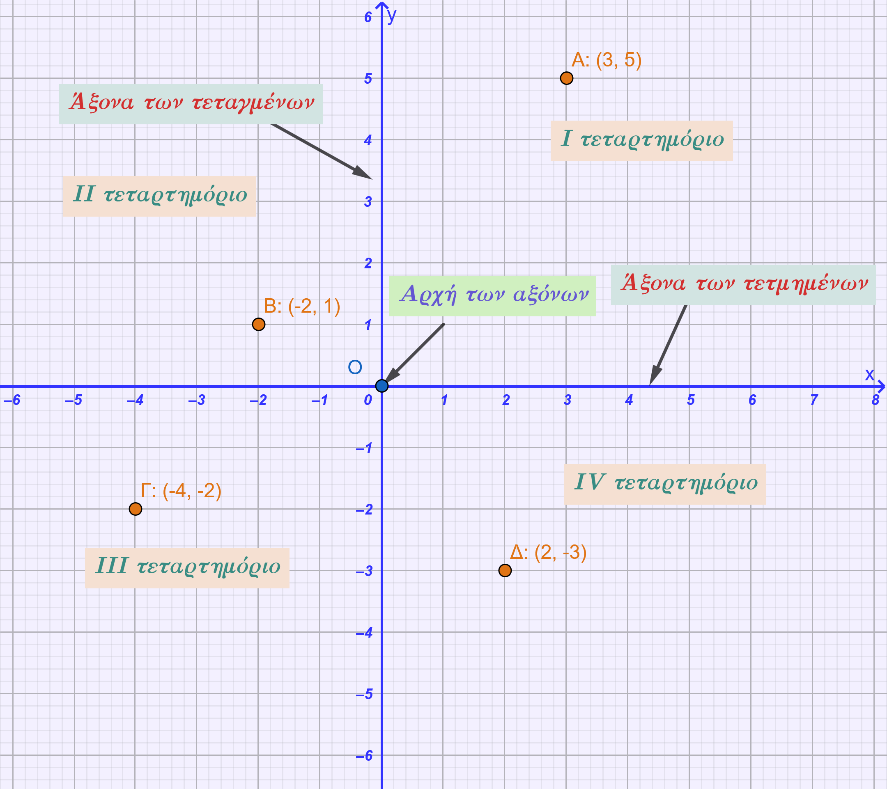
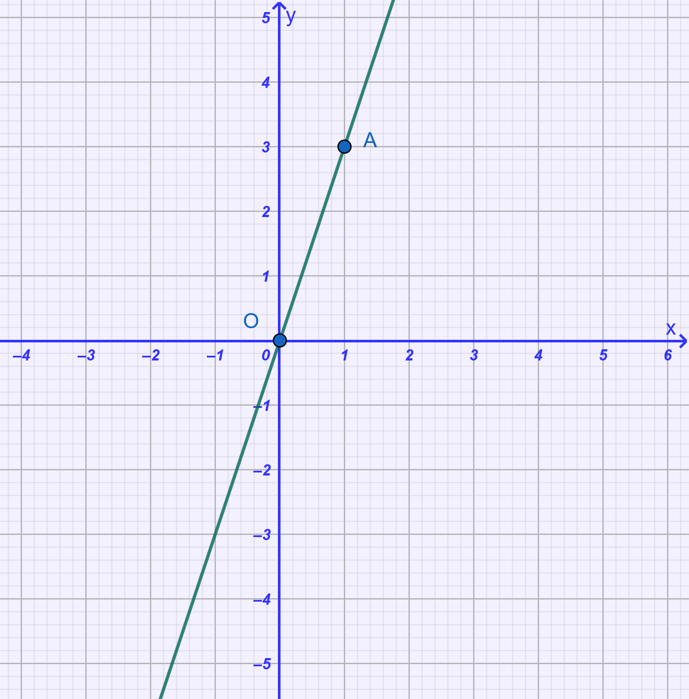
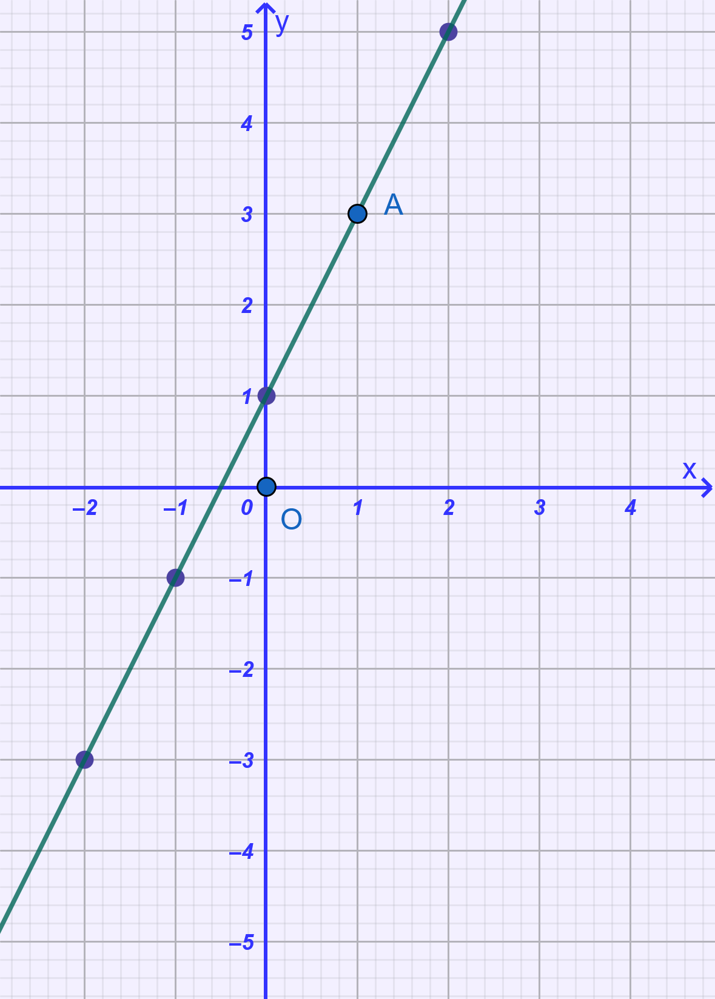
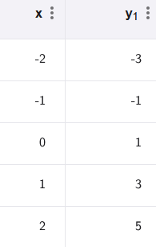
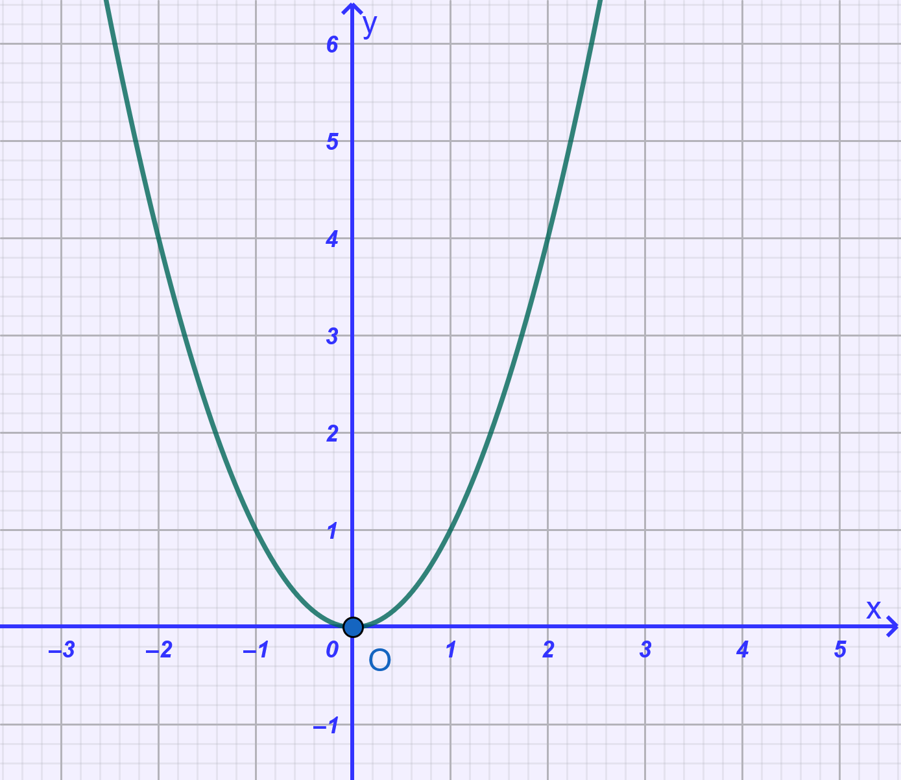
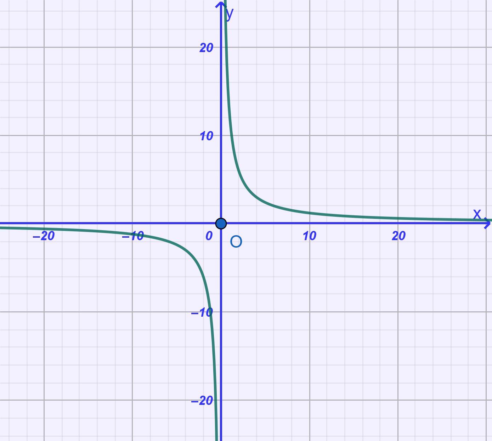
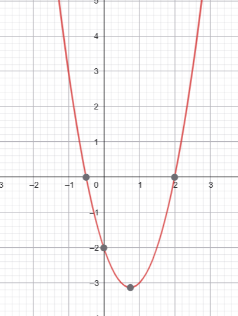
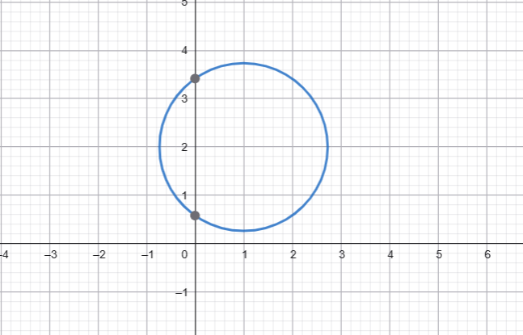
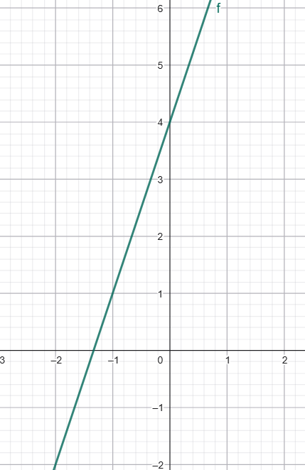
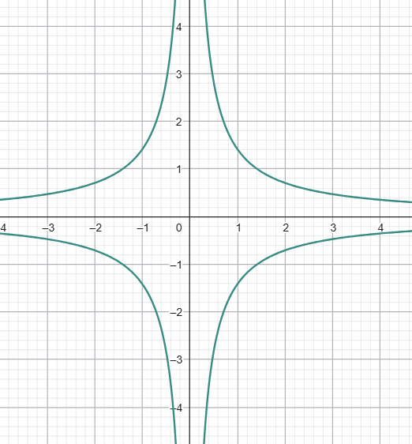

\usepackage{wasysym}

```{=html}
<!-- Φόρτωση βιβλιοθήκης GeoGebra -->
<script src="https://www.geogebra.org/apps/deployggb.js"></script>

<!-- Συνάρτηση δημιουργίας applets -->
<script>
function createGeoGebra(containerId, materialId, width = 700, height = 500) {
  var params = {
    "id": "ggb-" + containerId,
    "material_id": materialId,
    "width": width,
    "height": height,
    "showToolBar": true,
    "showMenuBar": false,
    "showAlgebraInput": true
  };
  
  var applet = new GGBApplet(params, '5.2');
  applet.inject(containerId);
}
</script>
```

## Καρτεσιανές συντεταγμένες - Γραφική παράσταση συνάρτησης

### **Η έννοια της μεταβλητής**

::: {style="background-color: #e0d6b8; border: 2px solid #2f3e50; color: #25188a; padding: 15px; border-radius: 5px;"}
**Θεωρία και Ορισμοί**

- **Μεταβλητή** ονομάζεται ένα γράμμα (συνήθως το $x$), το οποίο χρησιμοποιείται για να παριστάνει ένα οποιοδήποτε στοιχείο ενός μη κενού συνόλου $A$.

- Το σύνολο $A$ ονομάζεται **πεδίο ορισμού** ή **πεδίο μεταβολής** της μεταβλητής.

- Σε αντίθεση με τη μεταβλητή, κάθε συγκεκριμένο στοιχείο του συνόλου $A$ ονομάζεται **σταθερά** ή **τιμή** της μεταβλητής.

- Στις μαθηματικές συναρτήσεις, όπως η $y = f(x)$, το $x$ ονομάζεται **ανεξάρτητη μεταβλητή**, ενώ το $y$ ονομάζεται **εξαρτημένη μεταβλητή** ή συνάρτηση του $x$.

**Ιδιότητες**

- Τα **μεταβλητά ποσά** μπορούν να παίρνουν διάφορες τιμές, ενώ τα **σταθερά ποσά** διατηρούν πάντα μια μόνο, αμετάβλητη τιμή.

- Μια μεταβλητή μπορεί να οριστεί πάνω σε οποιοδήποτε σύνολο (π.χ. φυσικούς, ρητούς ή πραγματικούς αριθμούς).

- Η μεταβολή της ανεξάρτητης μεταβλητής επιφέρει μια ορισμένη μεταβολή στην τιμή της εξαρτημένης μεταβλητής.
:::

**Παραδείγματα**

1.  Η **ακτίνα ενός κύκλου** είναι μεταβλητή, καθώς μπορεί να πάρει οποιαδήποτε θετική τιμή.
2.  Το **ύψος ενός τριγώνου** είναι μεταβλητό μέγεθος.
3.  Ο χρόνος περιφοράς της Γης γύρω από τον Ήλιο είναι σταθερός, αλλά η **απόσταση της Γης από τον Ήλιο** είναι μεταβλητή.
4.  Στη σχέση $y = 50x$ (αξία υφάσματος), το μήκος $x$ είναι η ανεξάρτητη μεταβλητή.
5.  Το **άθροισμα των γωνιών** ενός τριγώνου είναι σταθερό ποσό ($180^\circ$), αλλά οι **ίδιες οι γωνίες** είναι μεταβλητές.

**Ασκήσεις**

1.  Προσδιορίστε τις μεταβλητές στον τύπο του εμβαδού τραπεζίου $E = \dfrac{(B+\beta)\upsilon}{2}$.
2.  Αν το ημερομίσθιο ενός εργάτη είναι 80 €, γράψτε τη συνάρτηση της αμοιβής του $y$ σε σχέση με τις ημέρες εργασίας $x$.
3.  Στη συνάρτηση $y = 3x^2 + 4$, βρείτε τις τιμές του $y$ για $x = -4, -2,2, 5, 7$.
4.  Προσδιορίστε το πεδίο ορισμού της μεταβλητής $x$ στην έκφραση $f(x) = \frac{1}{x} + \sqrt{x-3}$.
5.  Στη σχέση $x + y = 5$, αν ο $x$ πάρει την τιμή 2, ποια είναι η τιμή του $y$;.
6.  Αν $f(x) = x + 5$ και $f(a) = 87$, βρείτε την τιμή της σταθεράς $a$.
7.  Ποια είναι η ανεξάρτητη και ποια η εξαρτημένη μεταβλητή στη συνάρτηση $s = v \cdot t$;.
8.  Αναφέρετε τρία παραδείγματα σταθερών μεγεθών από τη Γεωμετρία.
9.  Στην κίνηση ενός αυτοκινήτου με σταθερή ταχύτητα, ποια μεγέθη είναι μεταβλητά;.
10. Από τη λίστα: ηλικία, ύψος, απόσταση Αθηνών-Θεσσαλονίκης, βάρος, πλευρά τετραγώνου, αθροισμα γωνιών τριγώνου, ξεχωρίστε τα σταθερά και τα μεταβλητά ποσά.

------------------------------------------------------------------------

### **Καρτεσιανές συντεταγμένες**

::: {style="background-color: #e0d6b8; border: 2px solid #2f3e50; color: #25188a; padding: 15px; border-radius: 5px;"}
**Θεωρία και Ορισμοί**

- Για να σχεδιάσουμε μια συνάρτηση, χρησιμοποιούμε ένα **σύστημα ορθογωνίων αξόνων**.

- **Καρτεσιανές ή ορθογώνιοι συντεταγμένες** ενός σημείου $M$ στο επίπεδο ονομάζονται οι δύο αριθμοί $(x, y)$ που προσδιορίζουν τη θέση του.

- Ο άξονας $x'x$ ονομάζεται **άξονας των τετμημένων** και ο άξονας $y'y$ **άξονας των τεταγμένων**.

- Το σημείο τομής των αξόνων $O$ ονομάζεται **αρχή των συντεταγμένων** και έχει συντεταγμένες $(0, 0)$.

- Το επίπεδο χωρίζεται από τους άξονες σε **τέσσερις γωνίες (τεταρτημόρια)**, που συμβολίζονται με I, II, III και IV.\
  {width="500"}

**Ιδιότητες**

- Υπάρχει **αμφιμονοσήμαντη αντιστοιχία** μεταξύ των διατεταγμένων ζευγών $(x, y)$ και των σημείων του επιπέδου.

- Κάθε σημείο πάνω στον άξονα $x'x$ έχει τεταγμένη $y = 0$.

- Κάθε σημείο πάνω στον άξονα $y'y$ έχει τετμημένη $x = 0$.

- Τα πρόσημα των συντεταγμένων καθορίζουν τη θέση του σημείου: στο I είναι $(+, +)$, στο II είναι $(-, +)$, στο III είναι $(-, -)$ και στο IV είναι $(+, -)$.
:::

**Παραδείγματα**

1.  Το σημείο $A(4, 3)$ βρίσκεται στο πρώτο τεταρτημόριο.
2.  Το σημείο $B(-3, 4)$ βρίσκεται στο δεύτερο τεταρτημόριο.
3.  Το σημείο $Γ(-2, -3)$ βρίσκεται στο τρίτο τεταρτημόριο.
4.  Το σημείο $Δ(5, -2)$ βρίσκεται στο τέταρτο τεταρτημόριο.
5.  Το σημείο $E(0, -2)$ βρίσκεται πάνω στον άξονα των τεταγμένων.

**Ασκήσεις**

1.  Τοποθετήστε σε καρτεσιανό σύστημα τα σημεία: $A(3, 5), B(-2, 1), \Gamma(-3, -4), \Delta(0, -2)$.
2.  Βρείτε το μήκος των πλευρών του τριγώνου με κορυφές $A(1, -1), B(1, 3), \Gamma(4, -1)$.
3.  Σε ποιο τεταρτημόριο ανήκει το σημείο $M(-3, -5)$;.
4.  Προσδιορίστε τα πρόσημα των συντεταγμένων στις τέσσερις γωνίες του επιπέδου.
5.  Ποια είναι η τεταγμένη κάθε σημείου που βρίσκεται στον άξονα των τετμημένων;.
6.  Βρείτε τις συντεταγμένες του συμμετρικού του σημείου $A(3, 4)$ ως προς τον άξονα $x'x$.
7.  Υπολογίστε την περίμετρο του τετραπλεύρου με κορυφές $Z(0, -4), H(3, 0), \Theta(0, 4), K(-3, 0)$.
8.  Βρείτε την τετμημένη του μέσου $M$ του τμήματος με άκρα $A(-2, 8)$ και $B(8, 0)$.
9.  Τι σχήμα σχηματίζουν τα σημεία που έχουν τετμημένη ίση με $+4$;.
10. Προσδιορίστε τις συντεταγμένες των σημείων τομής του κύκλου κέντρου $O$ και ακτίνας 3 με τους άξονες.

------------------------------------------------------------------------

### **Γραφική παράσταση συνάρτησης**

::: {style="background-color: #e0d6b8; border: 2px solid #2f3e50; color: #25188a; padding: 15px; border-radius: 5px;"}
**Θεωρία και Ορισμοί**

- **Γραφική παράσταση** μιας συνάρτησης $f$ είναι το σύνολο όλων των σημείων του επιπέδου που έχουν συντεταγμένες $(x, f(x))$, όπου $x$ είναι στοιχείο του πεδίου ορισμού.

- Η γραφική παράσταση δίνει μια **γεωμετρική εικόνα** της μεταβολής της συνάρτησης.

- Για τις γραμμικές συναρτήσεις της μορφής $y = ax + \beta$, η γραφική παράσταση είναι μια **ευθεία γραμμή**.
:::

**Παραδείγματα**

1.  Η γραφική παράσταση της $y = 3x$ είναι μια ήμιευθεία που περνά από το $(0, 0)$ και το $(1, 3)$.\
    {width="400"}
2.  Η συνάρτηση $y = 2x + 1$ παριστάνεται από ευθεία που περνά από τα σημεία $(0, 1)$ και $(1, 3)$.\
    {width="300"} 
3.  Η γραφική παράσταση της $y = x^2$ είναι μια καμπύλη (παραβολή).\
    {width="400"}
4.  Η συνάρτηση $y = \dfrac{12}{x}$ παριστάνεται από μια καμπύλη που πλησιάζει τους άξονες χωρίς να τους τέμνει.\
    {width="400"}
5.  Η συνάρτηση $y = 50x$ (αξία υφάσματος) παριστάνεται από μια ήμιευθεία στο πρώτο τεταρτημόριο.

**Ασκήσεις**

1.  Σχεδιάστε τη γραφική παράσταση της συνάρτησης $y = 2x$.
2.  Σχεδιάστε την ευθεία που αντιστοιχεί στη συνάρτηση $y = -x + 3$.
3.  Κατασκευάστε τη γραφική παράσταση της συνάρτησης $y = \dfrac{10}{x}$ για $x > 0$.
4.  Βρείτε το σημείο τομής της ευθείας $y = 2x - 4$ με τον άξονα $x'x$.
5.  Χρησιμοποιώντας τη γραφική παράσταση της $y = 5x$, βρείτε ποια τιμή του $y$ αντιστοιχεί στο $x = 2,5$.
6.  Σχεδιάστε τη συνάρτηση $y = x^2-2$ χρησιμοποιώντας τιμές από το -4 έως το 4.
7.  Από τη γραφική παράσταση της $y = 20x + 30$, προσδιορίστε το $y$ για $x = 2$.
8.  Βρείτε τις συντεταγμένες των σημείων τομής της ευθείας $y = 3x - 2$ με τους άξονες.
9.  Σχεδιάστε σε ένα σχήμα τις γραφικές παραστάσεις των $y = x$ και $y = -x$.
10. Γράψτε τη συνάρτηση που συνδέει την πλευρά $x$ ενός τετραγώνου με την περίμετρο $y$ και παραστήστε την γραφικά.
11. **(Γραφική παράσταση - Κατακόρυφη γραμμή)**

Ποιες από τις παρακάτω γραφικές παραστάσεις **δεν** παριστάνουν συνάρτηση;

α) Μια παραβολή που ανοίγει προς τα πάνω {width="275"}

β) Ένας κύκλος {width="427"}

γ) Μια ευθεία γραμμή με κλίση {width="335"}

δ) Η διπλή υπερβολή {width="376"}

::: {style="background-color: #f0f8cc; border: 2px solid #2f3e50; color: #25188a; padding: 15px; border-radius: 5px;"}
**Για να ελέγξεις αν ένα γράφημα είναι συνάρτηση:** Φέρε νοερά μια κατακόρυφη γραμμή – αν τέμνει το γράφημα σε περισσότερα από ένα σημεία, **δεν είναι συνάρτηση**.
:::

12. **(Συμπλήρωση πίνακα)**

Δίνεται η συνάρτηση ( f(x) = -2x + 1 ).

| x          | -2  | -1  | 0   | 1   | 2   | 3   |
|------------|-----|-----|-----|-----|-----|-----|
| (y = f(x)) |     |     |     |     |     |     |

α) Να συμπληρώσεις τον πίνακα.

β) Να σχεδιάσεις τη γραφική παράσταση σε ορθογώνιο σύστημα αξόνων.

13. **(Αντίστροφη διαδικασία - Εύρεση τύπου)**

Μια ευθεία γραμμή διέρχεται από τα σημεία ( A(0, 2) ) και ( B(2, 8) ).

α) Να βρεις τον τύπο της συνάρτησης $y = \alpha x + \beta$.

> > > Αφού το σημείο Α(0,2) είναι σημείο της ευθείας σημαίνει ότι για x=0 , y=2 δηλαδή $2=α\cdot 0+β \Rightarrow β=2$ .........................

β) Να βρεις την τιμή της συνάρτησης στο ( x = 5 ).

γ) Να βρεις το ( x ) όταν ( y = 20 ).

------------------------------------------------------------------------


::: {style="background-color: #f0f8cc; border: 2px solid #2f3e50; color: #25188a; padding: 15px; border-radius: 5px;"}
ΚΑΛΗ ΜΕΛΕΤΗ !
:::
