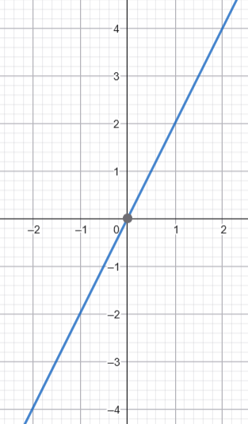
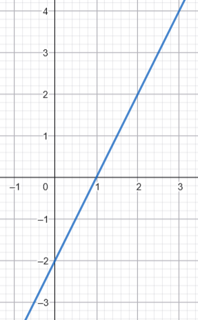
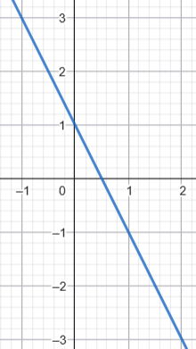
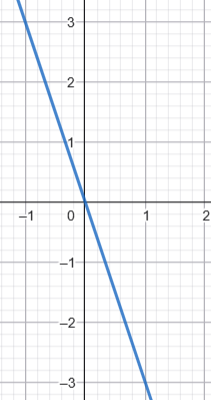

\usepackage{wasysym}
\usepackage{eurosym}
```{=html}
<!-- Φόρτωση βιβλιοθήκης GeoGebra -->
<script src="https://www.geogebra.org/apps/deployggb.js"></script>

<!-- Συνάρτηση δημιουργίας applets -->
<script>
function createGeoGebra(containerId, materialId, width = 700, height = 500) {
  var params = {
    "id": "ggb-" + containerId,
    "material_id": materialId,
    "width": width,
    "height": height,
    "showToolBar": true,
    "showMenuBar": false,
    "showAlgebraInput": true
  };
  
  var applet = new GGBApplet(params, '5.2');
  applet.inject(containerId);
}
</script>
```

## Η συνάρτηση y = αx

### **Ποσά ανάλογα – Η συνάρτηση** $y = \alpha x$

::: {style="background-color: #e0d6b8; border: 2px solid #2f3e50; color: #25188a; padding: 15px; border-radius: 5px;"}
**Θεωρία και Ορισμοί**

- **Ορισμός Ανάλογων Ποσών:** Δύο συμμεταβλητά ποσά $x$ και $y$ ονομάζονται **κατευθείαν ανάλογα** (ή απλώς ανάλογα), όταν ο πολλαπλασιασμός της τιμής του ενός επί έναν αριθμό συνεπάγεται τον πολλαπλασιασμό της αντίστοιχης τιμής του άλλου επί τον ίδιο αριθμό.

- **Συντελεστής Αναλογίας:** Σε δύο ανάλογα ποσά, ο λόγος των αντίστοιχων τιμών τους είναι πάντοτε σταθερός.
  Ο σταθερός αυτός αριθμός $\alpha$ (όπου $y/x = \alpha$) ονομάζεται **συντελεστής αναλογικότητας**.

- **Η Συνάρτηση** $y = \alpha x$: Η μαθηματική σχέση που συνδέει δύο ανάλογα ποσά εκφράζεται από τη συνάρτηση της μορφής $y = \alpha x$.
  Εδώ, το $x$ είναι η **ανεξάρτητη μεταβλητή** και το $y$ η **εξαρτημένη μεταβλητή** ή συνάρτηση του $x$.

**Ιδιότητες**

- **Λογική Αναλογία:** Αν $(x_1, y_1)$ και $(x_2, y_2)$ είναι δύο ζεύγη αντίστοιχων τιμών, τότε σχηματίζουν την αναλογία $\dfrac{x_1}{x_2} = \dfrac{y_1}{y_2}$.

- **Διέλευση από το Μηδέν:** Αν η τιμή της μίας μεταβλητής είναι μηδέν, τότε και η άλλη είναι μηδέν.

- **Γραφική Παράσταση:** Η γραφική παράσταση της συνάρτησης $y = \alpha x$ είναι πάντοτε μια **ευθεία γραμμή** (ή ημιευθεία αν περιοριζόμαστε σε θετικές τιμές) που διέρχεται από την **αρχή των αξόνων** $(0,0)$.

\
<iframe src="https://www.geogebra.org/calculator/ycbdnurh?embed" width="730" height="600" allowfullscreen style="border: 1px solid #e4e4e4;border-radius: 4px;" frameborder="0"></iframe>

\


:::

::: callout-tip
Μετακινήστε (κλικ και σύρτε) τον δρομέα α για να αλλάξετε την τιμή του α.

Τι παρατηρείτε;

- Όταν το α είναι θετικό

- Όταν το α είναι αρνητικό
:::


**Παραδείγματα**

1.  Η χρηματική αξία ενός υφάσματος σε σχέση με το μήκος του (π.χ. αν το μέτρο κοστίζει 8 €, $y = 8x$).
2.  Το ημερομίσθιο ενός εργάτη σε σχέση με τις ημέρες εργασίας του (π.χ. αν παίρνει 100 € την ημέρα, $y = 100x$).
3.  Το διανυόμενο διάστημα $s$ στην ομαλή κίνηση σε σχέση με το χρόνο $t$ ($s = vt$).
4.  Η περίμετρος ενός τετραγώνου $y$ σε σχέση με την πλευρά του $x$ ($y = 4x$).
5.  Η αξία αγοράς ποσοτήτων ψωμιού αν η τιμή ανά κιλό είναι σταθερή (π.χ. 2 €/kg, $y = 2x$).

**Ασκήσεις**

1.  Αν 1 kg πορτοκάλια κοστίζει 1,75 €, γράψτε τη συνάρτηση της αξίας $y$ για $x$ κιλά.
2.  Συντάξτε πίνακα τιμών για τη συνάρτηση $y = 40x$ για $x =-4, -3, -2, -1, 0, 1, 2, 3, 4$.
3.  Σχεδιάστε τη γραφική παράσταση της συνάρτησης $y = -2x$.
4.  Βρείτε τον συντελεστή αναλογίας αν για $x = 3$ η τιμή της συνάρτησης είναι $y = 15$.
5.  Ελέγξτε αν τα ποσά $x$ και $y$ στους παρακάτω πίνακες είναι ανάλογα εξετάζοντας το λόγο $\dfrac{y}{x}$.

A.

```{mermaid}

block-beta
  
  block:group
  columns 7
    a["x"] b["-3"] c["-2"] d["-1"]  f["1"] g["2"] h["3"]
    k["y"] l[" -9  "] m[" -6 "] n[" -3 "] p[" 3 "] s["  6"] t[" 9 "] 
  end

```

\
B.

```{mermaid}

block-beta
  
  block:group
  columns 7
    a["x"] b["-3"] c["-2"] d["-1"]  f["1"] g["2"] h["3"]
    k["y"] l[" -12  "] m[" -8 "] n[" 5 "] p[" 6 "] s["  8"] t[" 12 "] 
  end

```

6.  Αν $y = 30x$, βρείτε το $y$ για $x = 4,5$ και το $x$ για $y = 120$.
7.  Εξετάστε αν η περίμετρος ισοπλεύρου τριγώνου είναι ανάλογη της πλευράς του και βρείτε τον συντελεστή αναλογίας.
8.  Εξηγήστε γιατί το εμβαδόν τετραγώνου **δεν** είναι ανάλογο της πλευράς του.
9.  Δείξτε ότι τα σημεία $(1, 50), (2, 100), (3, 150)$ ανήκουν σε γραφική παράσταση ανάλογων ποσών.
10. Ένας τεχνίτης αμείβεται με 14 € την ώρα. Γράψτε τη συνάρτηση και βρείτε την αμοιβή για 8 ώρες.

------------------------------------------------------------------------

### **Η κλίση της ευθείας** $y = \alpha x$

::: {style="background-color: #e0d6b8; border: 2px solid #2f3e50; color: #25188a; padding: 15px; border-radius: 5px;"}
**Θεωρία και Ορισμοί**

- **Γεωμετρική Ερμηνεία:** Η γραφική παράσταση της $y = \alpha x$ είναι ευθεία που διέρχεται από το $(0,0)$.

- **Η έννοια της Κλίσης:** Ο συντελεστής αναλογικότητας $\alpha$ καθορίζει τη "στροφή" ή την κλίση της ευθείας ως προς τους άξονες.

- **Ρυθμός Μεταβολής:** Ο αριθμός $\alpha$ δείχνει πόσο γρήγορα μεταβάλλεται το $y$ σε σχέση με το $x$.
  Για κάθε μονάδα αύξησης του $x$, το $y$ αυξάνεται κατά $\alpha$ μονάδες.

- **Η σημασία του** $\alpha$:
  - Αν $\alpha > 0$, η ευθεία βρίσκεται στο 1ο και 3ο τεταρτημόριο.
  - Αν $\alpha < 0$, η ευθεία βρίσκεται στο 2ο και 4ο τεταρτημόριο.
  - Η κλίση υπολογίζεται από το λόγο της κατακόρυφης μεταβολής προς την οριζόντια μεταβολή: $\alpha = \dfrac{\Delta y}{\Delta x}=εφ \hat{θ}$.
- **Ειδικές Περιπτώσεις:** Η ευθεία $y = x$ είναι η διχοτόμος των γωνιών του 1ου και 3ου τεταρτημορίου, ενώ η $y = -x$ του 2ου και 4ου.

**Ιδιότητες**

- **Σημείο Αναφοράς:** Η ευθεία διέρχεται πάντοτε από το σημείο $(1, \alpha)$.

- **Μονοτονία:** Αν ο συντελεστής $\alpha$ είναι θετικός, η συνάρτηση είναι **αύξουσα**.

- **Εξάρτηση από τη Σταθερά:** Όσο μεγαλύτερη είναι η απόλυτη τιμή του $\alpha$, τόσο πιο "απότομη" είναι η κλίση της ευθείας ως προς τον άξονα των τετμημένων.

- **Σταθερότητα:** Σε κάθε σημείο $(x, y)$ της ευθείας (εκτός της αρχής), ο λόγος $\dfrac{y}{x}$ παραμένει σταθερός και ίσος με την κλίση $\alpha$.
:::

**Παραδείγματα**

1.  Στη συνάρτηση $y = 30x$, η ευθεία περνά από το $(0,0)$ και το $(1, 30)$.
2.  Στη συνάρτηση $y = x$, η κλίση είναι 1 και η ευθεία διχοτομεί τη γωνία των αξόνων.
3.  Στη συνάρτηση $y = 5x$, για κάθε αύξηση του $x$ κατά 1, το $y$ "ανεβαίνει" κατά 5 μονάδες.
4.  Σύγκριση των $y = 2x$ και $y = 4x$: η δεύτερη ευθεία έχει μεγαλύτερη κλίση και είναι πιο κοντά στον άξονα $y'y$.
5.  Η συνάρτηση κόστους ρεύματος $y = 1,50x$ δείχνει γραφικά την κλίση που ορίζει η τιμή ανά kwh.

**Ασκήσεις**

1.  Ποια είναι η κλίση $\alpha$ της ευθείας που διέρχεται από το $(0,0)$ και το σημείο $(2, 10)$;.
2.  Σχεδιάστε την ευθεία $y = 3x$ και προσδιορίστε ένα σημείο της εκτός της αρχής.
3.  Αν μια ευθεία $y = \alpha x$ διέρχεται από το σημείο $(1, 5)$, ποια είναι η τιμή του $\alpha$;.
4.  Σχεδιάστε σε κοινό σύστημα τις $y = 2,5x$ και $y = 5,2x$. Ποια πλησιάζει περισσότερο τον άξονα των τεταγμένων;.
5.  Εξετάστε αν το σημείο $(3, 9)$ ανήκει στην ευθεία με κλίση $\alpha = 3$.
6.  Σχεδιάστε τη γραφική παράσταση της $y = x$ και αναφέρετε τη γωνία που σχηματίζει με τον $x'x$.
7.  Χρησιμοποιώντας τη γραφική παράσταση της $y = 5x$, βρείτε το $y$ για $x = 2,5$.
8.  Αν $\alpha = -2$, σχεδιάστε την ευθεία $y = -2x$. Σε ποία τεταρτημόρια βρίσκεται:
9.  Στη συνάρτηση αμοιβής $y = 100x$, τι αντιπροσωπεύει γεωμετρικά ο αριθμός 100 για την ευθεία;.
10. Βρείτε τον τύπο της ευθείας που διέρχεται από το $(0,0)$ και το σημείο $(5, 1)$.


### ασκήσεις και προβλήματα για τη συνάρτηση $y = \alpha x$ και τα ανάλογα ποσά:

1.  **Συμπλήρωση Πίνακα:** Αν τα ποσά $x$ και $y$ είναι ανάλογα με συντελεστή $\alpha=-2,5$ ($y=3x$), συμπλήρωσε τον παρακάτω πίνακα και στη συνέχεια κάνε την γραφική παράσταση.

```{mermaid}

block-beta
  
  block:group
  columns 8
    a["x"] b["-3"] c["-2"] d["-1"] e["0"] f["1"] g["2"] h["3"]
    k["y"] l["   "] m["  "] n["  "] p["  "] s["  "] t["  "] q["  "]
  end

```

2.  **Εύρεση Εξίσωσης:** Βρες την εξίσωση της ευθείας που διέρχεται από την αρχή των αξόνων $O(0,0)$ και από το σημείο $A(2, 6)$.
3.  **Πρόβλημα Ταχύτητας:** Ένα αυτοκίνητο κινείται με σταθερή ταχύτητα $70$ χλμ/ώρα. Εκφράστε την απόσταση $S$ ως συνάρτηση του χρόνου $t$. Κάντε την γραφική παράσταση της $S$ συναρτήσει του χρόνου $t$
4.  **Αύξηση Τιμών:** Οι τιμές των προϊόντων αυξήθηκαν κατά $20\%$. Βρες τη σχέση που εκφράζει τη νέα τιμή $y$ ως συνάρτηση της παλιάς τιμής $x$ και αφού συμπληρώσετε τον πίνακα, να κάνετε την γραφική παράστασταση.

```{mermaid}

block-beta
  
  block:group
  columns 8
    a["x €"] b["20 €"] c["60 €"] d["100"] e["110"] f["140"] g["200"] h["300"]
    k["y €"] l["   "] m["  "] n["  "] p["  "] s["  "] t["  "] q["  "]
  end

```

5.  **Γραφική Παράσταση:** Σχεδίασε σε ορθογώνιο σύστημα αξόνων την ευθεία $y = -0,82x$, βρίσκοντας ένα επιπλέον σημείο εκτός από την αρχή των αξόνων.
6.  **Παραγωγή Προϊόντος:** Μια εταιρεία παράγει $0,4$ λίτρα χυμό από κάθε κιλό πορτοκάλια.

- Εκφράστε την ποσότητα χυμού $y$ ως συνάρτηση των κιλών πορτοκαλιών $x$.
- Κάντε ένα πίνακα τιμών με 4 διαφορετικές τιμές του $x$.
- Κάντε την γραφική παράσταση.

7.  **Γεωμετρία:** Εκφράστε την περίμετρο $Π$ ενός τετραγώνου ως συνάρτηση της πλευράς του $x$ και εξήγησε γιατί τα ποσά αυτά είναι ανάλογα.
8.  **Ισοτιμία Νομισμάτων:** Αν η ισοτιμία είναι $100$ € προς $108$ \$, βρες τη συνάρτηση $y = \alpha x$ που μετατρέπει τα ευρώ ($x$) σε δολάρια ($y$).

- Πόσα € είναι τα 238 \$.
- Πόσα \$ είναι τα 340 €.

9.  **Υπολογισμός Κλίσης:** Βρες την κλίση $\alpha$ μιας ευθείας που διέρχεται από την αρχή των αξόνων και το σημείο $A(-1, 3)$.
10. **Θεωρία Τεταρτημορίων:** Εξήγησε σε ποια τεταρτημόρια βρίσκεται η ευθεία $y = \alpha x$ όταν ο συντελεστής $\alpha$ είναι θετικός και σε ποια όταν είναι αρνητικός.
11. Αν τα ποσά κ και λ είναι ανάλογα , να συμπληρώσετε τον πίνακα.

```{mermaid}

block-beta
  
  block:group
  columns 8
    a["κ"] b["5 "] c["12"] d[" "] e["16"] f[" "] g["28"] h[" "]
    k["λ"] l[" 4"] m["  "] n[" 12 "] p["  "] s["16"] t["  "] q["18"]
  end

```

12. Ποιά από τα παρακάτω γραφήματα είναι γραφήματα ανάλογων ποσών

| Γράφημα 1 | Γράφημα 2 | Γράφημα 3 | Γράφημα 4 |
|:----------------:|:----------------:|:----------------:|:----------------:|
|  |  |  |  |

13. Να σχεδιάσετε σε ορθογώνιο σύστημα αξόνων μια ευθεία η οποία να διέρχεται από την αρχή Ο των αξόνων και να έχει κλίση $a=1,2$

14. Ποιά ευθεία από τις πατακάτω έχει κλίση α=0,8

|     Ευθεία 1     | Ευθεία 2  |     Ευθεία 3     |      Ευθεία 4      |
|:----------------:|:---------:|:----------------:|:------------------:|
| $y=\dfrac{4}{5}x$ | $y=-0,8x$ | $y=\dfrac{8}{5}x$ | $y=-\dfrac{8}{10}x$ |


::: {style="background-color: #f0f8cc; border: 2px solid #2f3e50; color: #25188a; padding: 15px; border-radius: 5px;"}
ΚΑΛΗ ΜΕΛΕΤΗ !
:::
