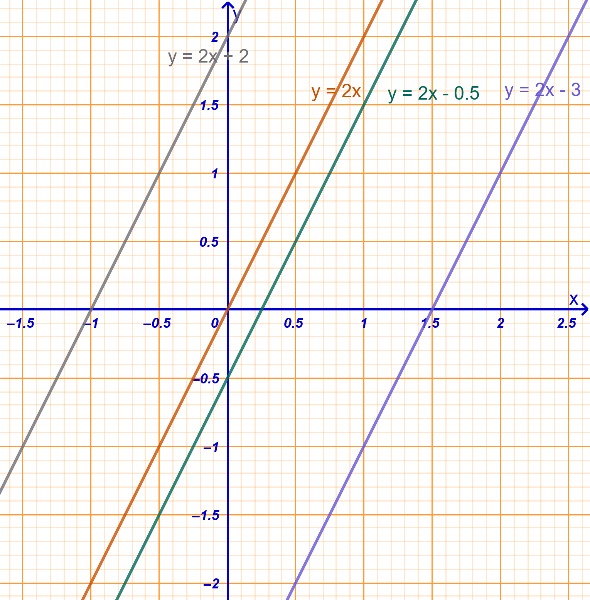
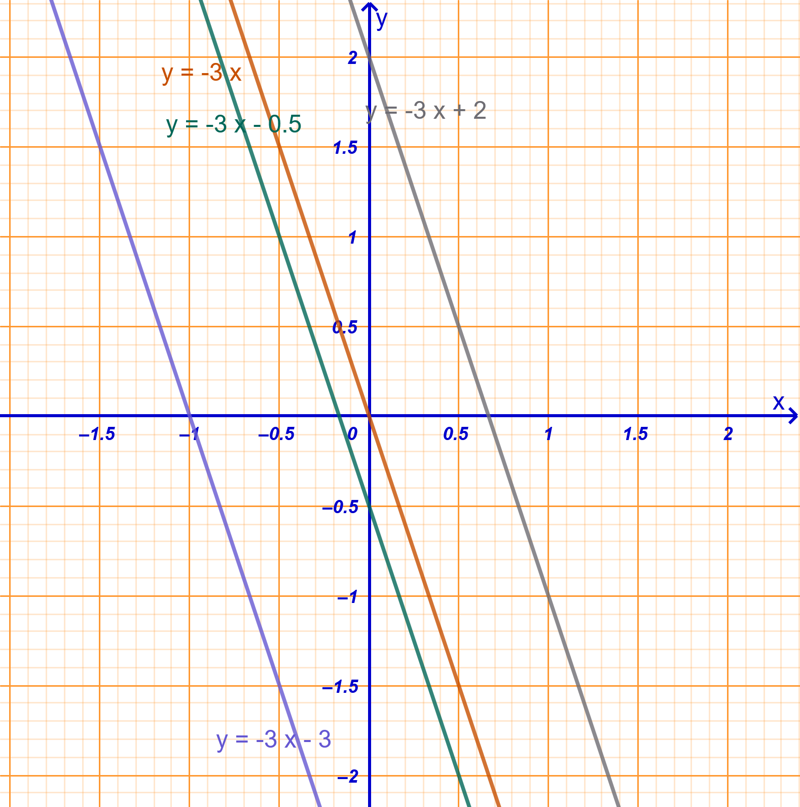
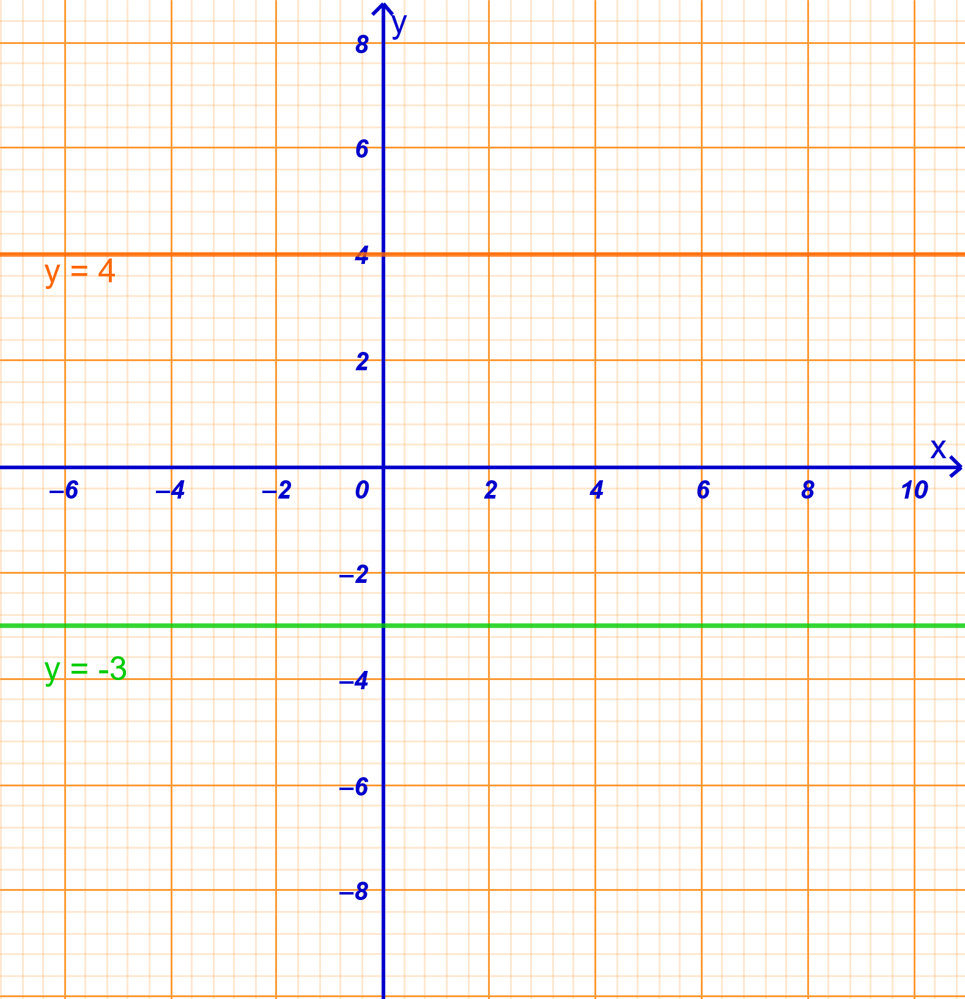
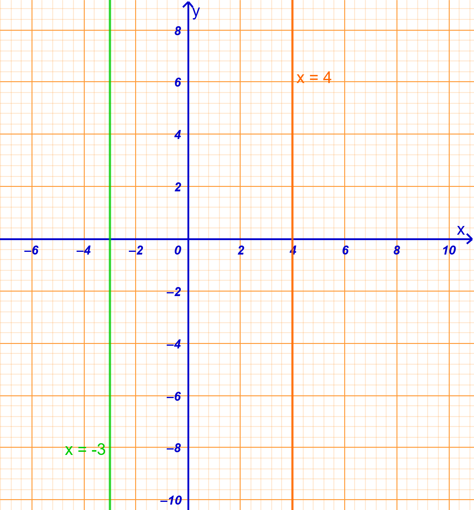
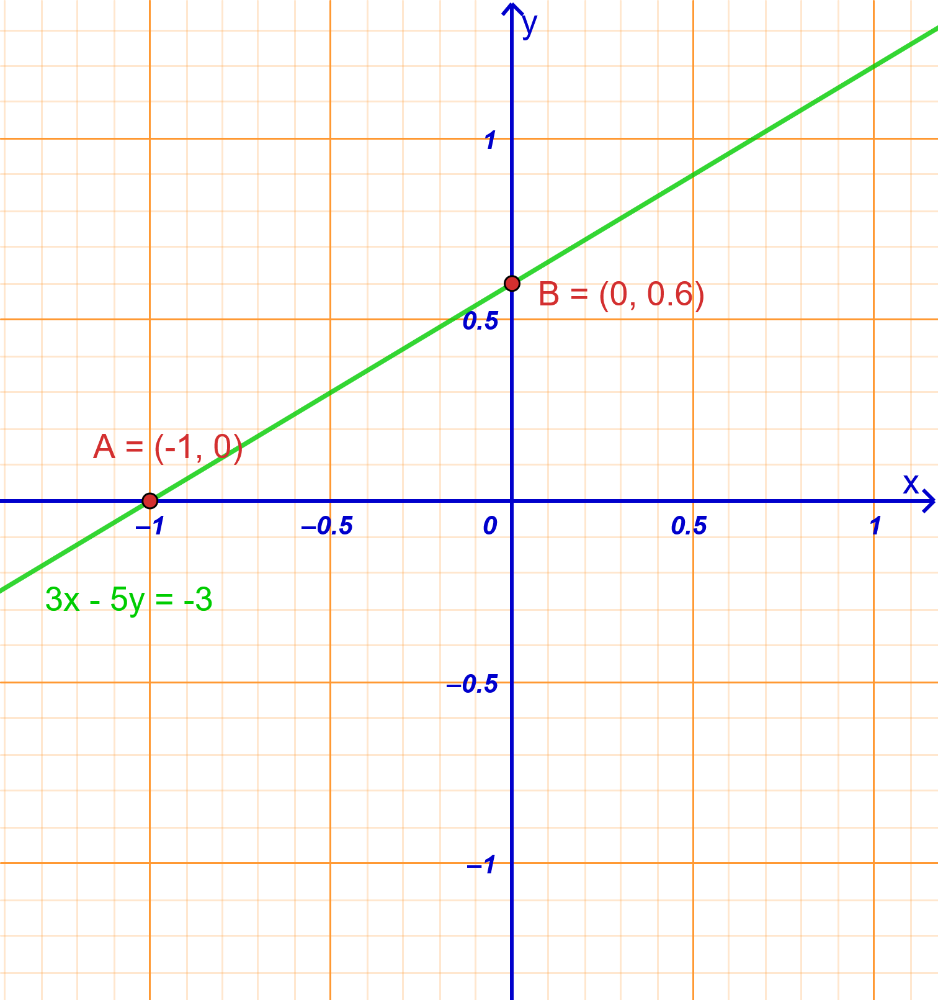
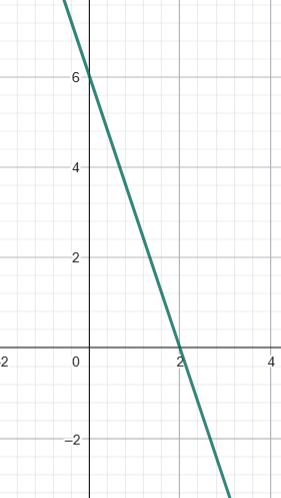
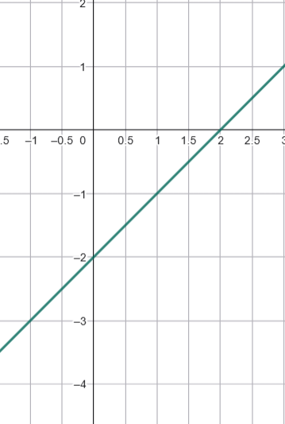
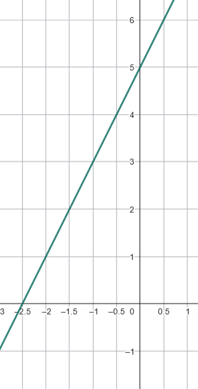

\usepackage{wasysym}
\usepackage{eurosym}
```{=html}
<!-- Φόρτωση βιβλιοθήκης GeoGebra -->
<script src="https://www.geogebra.org/apps/deployggb.js"></script>

<!-- Συνάρτηση δημιουργίας applets -->
<script>
function createGeoGebra(containerId, materialId, width = 700, height = 500) {
  var params = {
    "id": "ggb-" + containerId,
    "material_id": materialId,
    "width": width,
    "height": height,
    "showToolBar": true,
    "showMenuBar": false,
    "showAlgebraInput": true
  };
  
  var applet = new GGBApplet(params, '5.2');
  applet.inject(containerId);
}
</script>
```

## Η συνάρτηση της μορφής $y = \alpha x+β$.

### **Η ευθεία με εξίσωση y = αx + β**

::: {style="background-color: #e0d6b8; border: 2px solid #2f3e50; color: #25188a; padding: 15px; border-radius: 5px;"}
Αφού είδαμε τη συνάρτηση $y = \alpha x$, η οποία εκφράζει τα ανάλογα ποσά, ήρθε η ώρα να προχωρήσουμε στη γενικότερη μορφή της, τη **γραμμική συνάρτηση** $y = \alpha x + \beta$.

**Θεωρία και Ορισμοί**

- **Ορισμός**: Η συνάρτηση της μορφής $y = \alpha x + \beta$, όπου $\alpha$ και $\beta$ είναι πραγματικοί αριθμοί, ονομάζεται γραμμική συνάρτηση.

- **Γραφική Παράσταση**: Η γεωμετρική απεικόνιση της συνάρτησης αυτής στο επίπεδο των αξόνων είναι πάντοτε μια **ευθεία γραμμή**.

- **Συντελεστές**: Ο αριθμός $\alpha$ καθορίζει την κλίση της ευθείας, ενώ ο αριθμός $\beta$ (σταθερός όρος) καθορίζει το σημείο στο οποίο η ευθεία τέμνει τον άξονα των τεταγμένων ($y'y$).

**Ιδιότητες**

1.  **Διέλευση από την αρχή των αξόνων**: Αν $\beta = 0$, η εξίσωση γίνεται $y = \alpha x$ και η ευθεία διέρχεται πάντοτε από το σημείο $O(0,0)$.
2.  **Μη διέλευση**: Αν $\beta \neq 0$, η ευθεία δεν διέρχεται από την αρχή των αξόνων.
3.  **Προσδιορισμός ευθείας**: Για να σχεδιάσουμε τη γραφική παράσταση, αρκεί να προσδιορίσουμε **δύο σημεία** της, συνήθως τις τομές με τους άξονες.

<iframe src="https://www.geogebra.org/calculator/dnnp9zy9?embed" width="730" height="600" allowfullscreen style="border: 1px solid #e4e4e4;border-radius: 4px;" frameborder="0">

</iframe>

\
:::

::: callout-tip
Αλλάξτε την τιμή των δρομέων α και β (κλίκ και σύρτε)

- Τι συμβαίνει όταν μεταβάλεται το α;
- Τι συμβαίνει όταν μεταβάλλεται το β;

Εξετάστε αν ισχύουν όσα είπαμε παραπάνω για τα α και β.
:::

**Παραδείγματα**

1.  $y = 2x + 1$: Ευθεία που δεν περνά από το $(0,0)$.
2.  $y = 3x - 2$: Γραμμική συνάρτηση με κλίση 3.
3.  $y = 25x + 500$: Συνάρτηση αμοιβής (π.χ. σταθερό ποσό συν προμήθεια).
4.  $y = 65000 - 5x$: Συνάρτηση με αρνητική κλίση (φθίνουσα).
5.  $y = 1,50x + 40$: Συνάρτηση κόστους ΔΕΗ (πάγιο συν κατανάλωση).

**Ασκήσεις**

1.  Σχεδιάστε τη γραφική παράσταση της $y = x + 3$.
2.  Βρείτε την τιμή του $y$ για $x = 2$ στην εξίσωση $y = 3x + 4$ (εφαρμογή τύπου).
3.  Αν $f(x) = x + 5$ και $f(a) = 87$, βρείτε τη σταθερά $a$.
4.  Σχεδιάστε την ευθεία $y = -x + 3$.
5.  Προσδιορίστε αν η ευθεία $y = 5x-2$ περνά από την αρχή των αξόνων.
6.  Υπολογίστε την τιμή του $x = 7$ στη συνάρτηση $y = 2x - 4$.
7.  Βρείτε την κλίση $\alpha$ στην εξίσωση $y = 50x-20$.
8.  Προσδιορίστε το $y$ στην $y = -2x - 1$ αν $x = 1,3$.
9.  Σχεδιάστε σε κοινό σύστημα τις $y = 2x-1$ , $y=2x+3$ και $y = 2x$. Τι παρατηρείτε:
10. Γράψτε τη συνάρτηση που συνδέει την πλευρά $x$ τετραγώνου με την περίμετρο $y$.

------------------------------------------------------------------------

### **Η εξίσωση της μορφής αx + βy = γ**

::: {style="background-color: #e0d6b8; border: 2px solid #2f3e50; color: #25188a; padding: 15px; border-radius: 5px;"}
**Θεωρία και Ορισμοί**

- **Ορισμός**: Η έκφραση $ax + βy = γ$ ονομάζεται γραμμική εξίσωση (ή εξίσωση πρώτου βαθμού) με δύο αγνώστους, $x$ και $y$.

- **Λύση**: Λύση της εξίσωσης ονομάζεται κάθε **διατεταγμένο ζεύγος** πραγματικών αριθμών $(κ,λ )$ που την επαληθεύει.

- **Συντελεστές**: Τα $a, β, γ$ είναι πραγματικοί αριθμοί.
  Για να παριστάνει ευθεία, πρέπει τουλάχιστον ένα από τα $a, β$ να είναι διάφορο του μηδενός.

- **Σχέση με την** $y = \alpha x$: Η γραφική παράσταση της $y = \alpha x + \beta$ είναι μια ευθεία **παράλληλη** προς την ευθεία $y = \alpha x$, μετατοπισμένη κατά $\beta$ μονάδες στον άξονα $y'y$.\
  {width="300"} {width="300"}

- **Παράλληλες Ευθείες:** Δύο ευθείες είναι παράλληλες μεταξύ τους όταν έχουν την **ίδια κλίση** $\alpha$.

- **Ειδικές Περιπτώσεις:**

  - Όταν $\alpha = 0$, η συνάρτηση γίνεται $y = \beta$ και είναι μια **σταθερή συνάρτηση** (οριζόντια ευθεία παράλληλη στον άξονα $x'x$).\
    {width="400"}
  - Η εξίσωση $x = \kappa$ παριστάνει μια κατακόρυφη ευθεία παράλληλη στον άξονα $y'y$, αλλά αυτή **δεν ορίζει συνάρτηση**.\
    {width="400"}

**Ιδιότητες**

1.  **Άπειρες Λύσεις**: Μια εξίσωση με δύο αγνώστους έχει άπειρα διατεταγμένα ζεύγη ως λύσεις, τα οποία γεωμετρικά αντιστοιχούν στα σημεία μιας ευθείας.

2.  **Μετασχηματισμός**: Η εξίσωση μπορεί να λυθεί ως προς $y$ (αν $β \neq 0$) παίρνοντας τη μορφή $y = \alpha'x + \beta'$, που είναι η κλασική μορφή της ευθείας.

3.  **Ισοδυναμία**: Αν πολλαπλασιάσουμε ή διαιρέσουμε όλα τα μέλη με τον ίδιο αριθμό (μη μηδενικό), προκύπτει ισοδύναμη εξίσωση.

**Σχέση με τη μορφή** $y = \alpha x + \beta$

Για να συνδέσουμε τις δύο μορφές, αρκεί να λύσουμε τη γενική εξίσωση ως προς $y$ (εφόσον $\beta \neq 0$):

1.  **Απομόνωση του όρου** $y$: Μεταφέρουμε το $\alpha x$ στο δεύτερο μέλος αλλάζοντας το πρόσημό του: $\beta y = -\alpha x + \gamma$.

2.  **Διαίρεση με το** $\beta$: Διαιρούμε όλα τα μέλη με τον συντελεστή του $y$: $y = -\dfrac{\alpha}{\beta}x + \dfrac{\gamma}{\beta}$.

Με αυτή τη μετατροπή, η **κλίση** της ευθείας είναι το πηλίκο $-\dfrac{\alpha}{\beta}$ .
:::

**Παραδείγματα**

1.  $3x - 2y = 7$: Τυπική γραμμική εξίσωση.
2.  $5x + y = -2$: Εξίσωση με $β = 1$.
3.  $4x + 3y = 5$: Γραμμική εξίσωση δύο αγνώστων.
4.  $4x - y = 4$: . α=4 και β=-1
5.  $2x + 3y = -8$: .γ=-8

**Ασκήσεις**

1.  Λύστε την εξίσωση $2x - y = -3$ ως προς $y$.
2.  Βρείτε τρία διατεταγμένα ζεύγη που επαληθεύουν την $x + y = 5$.
3.  Ελέγξτε αν το ζεύγος $(1, -2)$ είναι λύση της $3x - 2y = 7$.
4.  Απλοποιήστε την εξίσωση $6x - 4y = 10$ διαιρώντας με το 2.
5.  Μεταφέρετε τους όρους ώστε η $y - 3x = 12$ να πάρει τη μορφή $ax + βy = γ$.
6.  Βρείτε την τιμή του $y$ στην $4x - y = 5$ αν $x = 0,5$.
7.  Σχηματίστε εξίσωση αν το άθροισμα δύο αριθμών είναι 100.
8.  Βρείτε το $a$ αν το ζεύγος $(2, -3)$ επαληθεύει την $ax + y = 3$.
9.  Λύστε την $x + 2y = -1$ ως προς $x$.

------------------------------------------------------------------------

### **Σημεία τομής της ευθείας αx + βy = γ με τους άξονες**

::: {style="background-color: #e0d6b8; border: 2px solid #2f3e50; color: #25188a; padding: 15px; border-radius: 5px;"}
**Θεωρία και Ορισμοί**

- **Τομή με τον άξονα** $x'x$: Είναι το σημείο της ευθείας που έχει τεταγμένη $y = 0$.
  Για να το βρούμε, αντικαθιστούμε $y = 0$ στην εξίσωση και λύνουμε ως προς $x$.

- **Τομή με τον άξονα** $y'y$: Είναι το σημείο της ευθείας που έχει τετμημένη $x = 0$.
  Για να το βρούμε, αντικαθιστούμε $x = 0$ στην εξίσωση και λύνουμε ως προς $y$.\
  {width="400"}

**Ιδιότητες**

1.  **Συντεταγμένες**: Τα σημεία τομής έχουν πάντα τη μορφή $(x, 0)$ για τον άξονα των τετμημένων και $(0, y)$ για τον άξονα των τεταγμένων.

2.  **Ελάχιστα Σημεία**: Αυτά τα δύο σημεία τομής με τους άξονες είναι τα πλέον κατάλληλα για τον γρήγορο σχεδιασμό οποιασδήποτε ευθείας που δεν περνά από την αρχή των αξόνων.

3.  **Αρχή Αξόνων**: Αν ο σταθερός όρος $\gamma$ είναι μηδέν, τότε και οι δύο τομές συμπίπτουν στο σημείο $(0,0)$.
:::

**Παραδείγματα**

1.  Για την $y = 2x - 4$: Για $y=0 \to x=2$, σημείο $(2,0)$. Για $x=0 \to y=-4$, σημείο $(0,-4)$.
2.  Για την $y = 3x - 12$: Τομές στα σημεία $(4,0)$ και $(0,-12)$.
3.  Για την $x + y = 2$: Τομές στα $(2,0)$ και $(0,2)$.
4.  Για την $y = 5x$: Τομή και με τους δύο άξονες στο $(0,0)$.
5.  Για την $y = 20x + 30$: Τομή με τον $y'y$ στο $(0,30)$.

**Ασκήσεις**

1.  Βρείτε τα σημεία τομής της ευθείας $3x - y = 6$ με τους άξονες.
2.  Προσδιορίστε την τεταγμένη του σημείου τομής της $y = 3x - 2$ με τον $y'y$.
3.  Βρείτε το σημείο τομής της ευθείας $x + 2y = 10$ με τον άξονα $x'x$.
4.  Ποιο είναι το σημείο τομής της $y = ax + \beta$ με τον $y'y$ όταν $x=0$;.
5.  Βρείτε τις τομές της ευθείας $\dfrac{x}{3} + \dfrac{y}{4} = 1$ με τους άξονες.
6.  Προσδιορίστε αν το σημείο $(0,-2)$ είναι τομή της $y = 2x - 2$ με τον $y'y$.
7.  Βρείτε την τετμημένη του σημείου τομής της $5x + 3y = 15$ με τον $x'x$.
8.  Σχεδιάστε την ευθεία $y = -2x + 4$ χρησιμοποιώντας μόνο τα σημεία τομής.
9.  Βρείτε τις συντεταγμένες των σημείων τομής της ευθείας $y = 10$ (οριζόντια) με τους άξονες.
10. Προσδιορίστε τα σημεία τομής της ευθείας που συνδέει τα $(3,0)$ και $(0,4)$ με τους άξονες.

------------------------------------------------------------------------

### ..... Ασκήσεων συνέχεια

**Άσκηση 1: Εύρεση Σημείων Τομής** Δίνεται η ευθεία $y = 2x - 4$.
Να βρείτε τα σημεία στα οποία η ευθεία τέμνει τους άξονες $x'x$ και $y'y$ και στη συνέχεια να τη σχεδιάσετε.

**Άσκηση 2: Υπολογισμός Κλίσης** Να βρείτε την κλίση της ευθείας που διέρχεται από τα σημεία $A(1, 1)$ και $B(2, 3)$.

**Άσκηση 3: Εύρεση Εξίσωσης από Σημεία** Να βρείτε την εξίσωση της ευθείας που περνά από τα σημεία $(0, 3)$ και $(1, 5)$.

**Άσκηση 4: Έλεγχος Σημείου** Να εξετάσετε ποιό από τα παρακάτω σημεία ανήκουν στην γραφική παράσταση της συνάρτησης $y = 2x - 1$.

| Σημείο Α | Σημείο Β | Σημείο Γ | Σημείο Δ |
|:--------:|:--------:|:--------:|:--------:|
|  (-1,1)  |  (3,6)   |  (4,7)   | (-2,-5)  |

**Άσκηση 5: Πρόβλημα Καθημερινότητας (Ταξί)** Για τη χρήση ενός ταξί πληρώνουμε $1,8$ € για τη «σημαία» και $0,8$ € για κάθε χιλιόμετρο διαδρομής.

- Να βρείτε τη συνάρτηση που εκφράζει το συνολικό ποσό $y$ για μια διαδρομή $x$ χιλιομέτρων.
- Να βρείτε πόσα χιλιόμετρα θα κάνει κάποιος με 16 €.
- Πόσα χρήματα θα χρειαστεί κάποιος για να κάνει 22 χιλιόμετρα.

**Άσκηση 6: Παράλληλες Ευθείες** Ποια από τις παρακάτω ευθείες είναι παράλληλη στην $y = 3x$;

α) $y = x + 3$

β) $y = 3x - 7$

γ) $y = -3x + 5$

7.  **Γραφική Παράσταση:** Να σχεδιάσετε στο ίδιο σύστημα αξόνων τις ευθείες $y = \dfrac{1}{4}x$, $y = \dfrac{1}{4}x + 3$ και $y = \dfrac{1}{4}x - 2$.

8.  **Σημεία Τομής με Άξονες:** Να βρείτε τα σημεία στα οποία η ευθεία $y = 2x - 4$ τέμνει τους άξονες $x'x$ και $y'y$.

9.  **Εύρεση Παραμέτρου:** Η γραφική παράσταση της ευθείας $y = -2x + \beta$ διέρχεται από το σημείο $A(-2, 6)$.
    Να βρείτε την τιμή του $\beta$.

10. **Τηλεφωνική Χρέωση:** Μια εταιρεία χρεώνει πάγιο $15$ € τον μήνα και $3$ σεντ ($0,03$ €) ανά λεπτό ομιλίας.
    Βρείτε τον τύπο της μηνιαίας χρέωσης.

11. **Υπολογισμός Κλίσης:** Να βρείτε την κλίση της ευθείας που δίνεται από την εξίσωση $2y = 4x - 1$.

12. **Κόστος Επίσκεψης:** Μια σχολική εκδρομή σε μουσείο κοστίζει $8,50$ € ανά μαθητή για την είσοδο και $50$ € συνολικά για το λεωφορείο.
    Εκφράστε το συνολικό κόστος $y$ ως συνάρτηση του αριθμού των μαθητών $x$.

13. **Ειδικές Μορφές:** Να βρείτε την εξίσωση της ευθείας που διέρχεται από το σημείο $(-2, 4)$ και είναι κάθετη στον άξονα $y'y$.

14. Να αντιστοιχίσετε τις ευθείες με τα γραφήματα

| Ευθείες |                     Γραφήματα                     |
|:-------:|:-------------------------------------------------:|
| y=-3x+6 | {width="213"} |
| y=2x-5  | {width="223"} |
|  y=x-2  | {width="215"} |

15. Σχεδιάστε την ευθεία $2x+4y=-1$
16. Βρείτε την κλίση της ευθείας $5x-3y=4$
17. Βρείτε που τέμνει τους άξονες η ευθεία $2x-6y=-5$.
18. Για την ευθεία $-x+2y=-4$ να επιλέξετε την σωστή απάντηση από τον παρακάτω πίνακα

|                      |   Α    |       Β       |   Γ    |
|:--------------------:|:------:|:-------------:|:------:|
|      Έχει κλίση      |   3    | $\frac{1}{2}$ |   -4   |
| Τέμνει τον άξονα x'x | (4,0)  |    (-2,0)     | (3,-3) |
| Τέμνει τον άξονα y'y | (0,-2) |    (-2,0)     | (-2,2) |

------------------------------------------------------------------------

::: {style="background-color: #f0f8cc; border: 2px solid #2f3e50; color: #25188a; padding: 15px; border-radius: 5px;"}
ΚΑΛΗ ΜΕΛΕΤΗ !
:::
